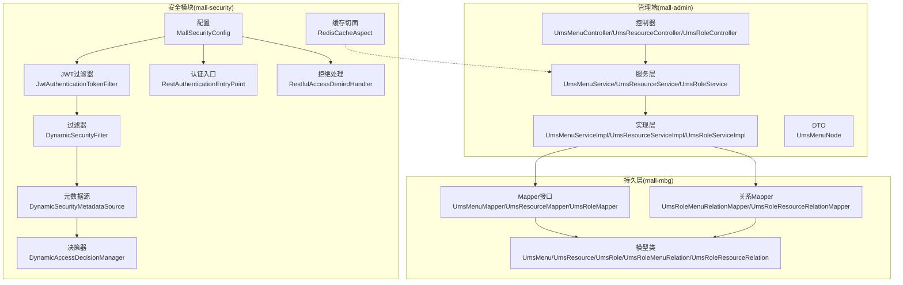
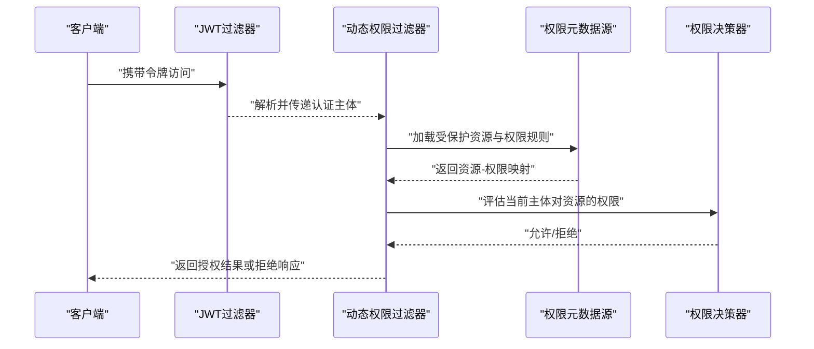
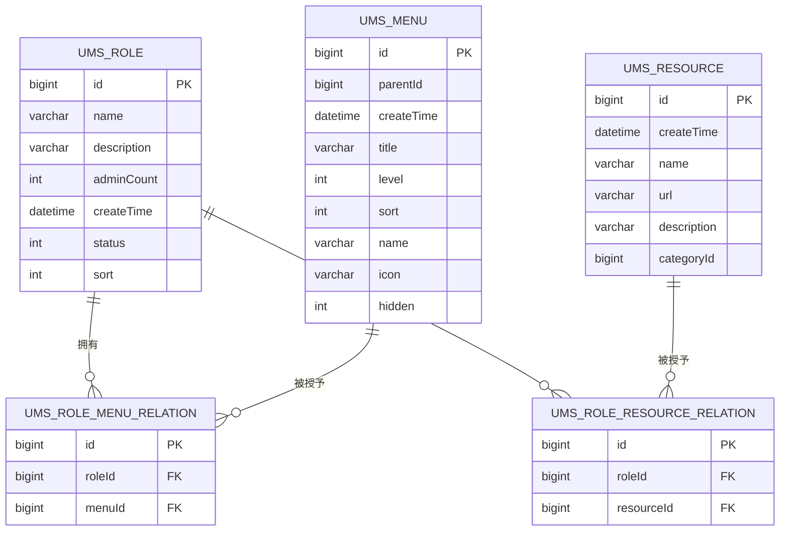
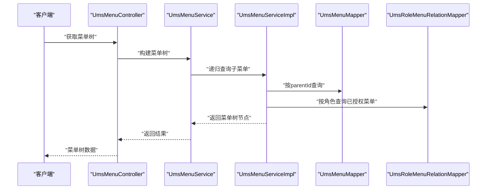
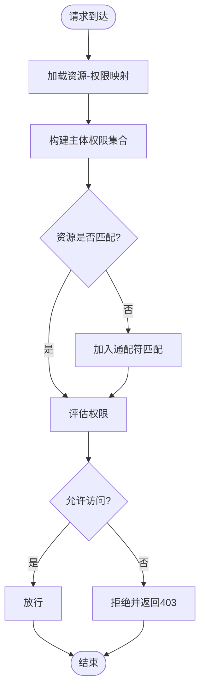
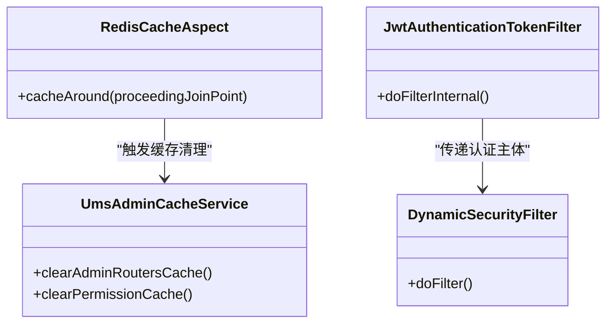
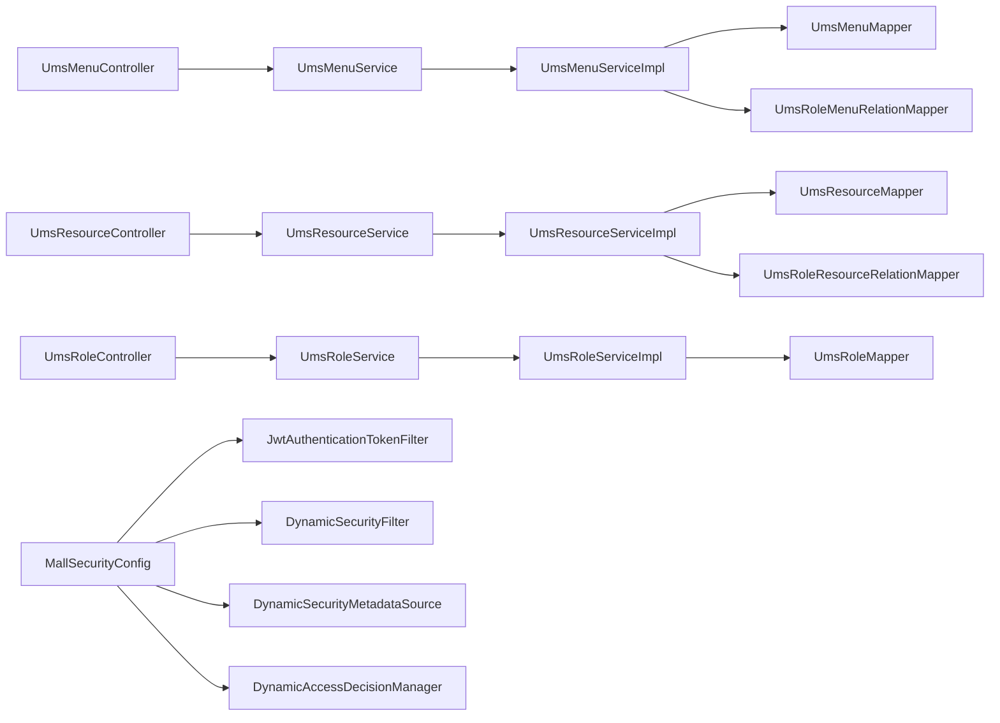

# 系统管理表

<cite>
**本文引用的文件**
- [mall.sql](file://document/sql/mall.sql)
- [generatorConfig.xml](file://mall-mbg/src/main/resources/generatorConfig.xml)
- [UmsMenu.java](file://mall-mbg/src/main/java/com/macro/mall/model/UmsMenu.java)
- [UmsResource.java](file://mall-mbg/src/main/java/com/macro/mall/model/UmsResource.java)
- [UmsRole.java](file://mall-mbg/src/main/java/com/macro/mall/model/UmsRole.java)
- [UmsRoleMenuRelation.java](file://mall-mbg/src/main/java/com/macro/mall/model/UmsRoleMenuRelation.java)
- [UmsRoleResourceRelation.java](file://mall-mbg/src/main/java/com/macro/mall/model/UmsRoleResourceRelation.java)
- [UmsMenuMapper.java](file://mall-mbg/src/main/java/com/macro/mall/mapper/UmsMenuMapper.java)
- [UmsResourceMapper.java](file://mall-mbg/src/main/java/com/macro/mall/mapper/UmsResourceMapper.java)
- [UmsRoleMapper.java](file://mall-mbg/src/main/java/com/macro/mall/mapper/UmsRoleMapper.java)
- [UmsRoleMenuRelationMapper.java](file://mall-mbg/src/main/java/com/macro/mall/mapper/UmsRoleMenuRelationMapper.java)
- [UmsRoleResourceRelationMapper.java](file://mall-mbg/src/main/java/com/macro/mall/mapper/UmsRoleResourceRelationMapper.java)
- [UmsMenuController.java](file://mall-admin/src/main/java/com/macro/mall/controller/UmsMenuController.java)
- [UmsResourceController.java](file://mall-admin/src/main/java/com/macro/mall/controller/UmsResourceController.java)
- [UmsRoleController.java](file://mall-admin/src/main/java/com/macro/mall/controller/UmsRoleController.java)
- [UmsMenuService.java](file://mall-admin/src/main/java/com/macro/mall/service/UmsMenuService.java)
- [UmsResourceService.java](file://mall-admin/src/main/java/com/macro/mall/service/UmsResourceService.java)
- [UmsRoleService.java](file://mall-admin/src/main/java/com/macro/mall/service/UmsRoleService.java)
- [UmsMenuServiceImpl.java](file://mall-admin/src/main/java/com/macro/mall/service/impl/UmsMenuServiceImpl.java)
- [UmsResourceServiceImpl.java](file://mall-admin/src/main/java/com/macro/mall/service/impl/UmsResourceServiceImpl.java)
- [UmsRoleServiceImpl.java](file://mall-admin/src/main/java/com/macro/mall/service/impl/UmsRoleServiceImpl.java)
- [UmsMenuNode.java](file://mall-admin/src/main/java/com/macro/mall/dto/UmsMenuNode.java)
- [MallSecurityConfig.java](file://mall-admin/src/main/java/com/macro/mall/config/MallSecurityConfig.java)
- [DynamicAccessDecisionManager.java](file://mall-security/src/main/java/com/macro/mall/security/aspect/DynamicAccessDecisionManager.java)
- [DynamicSecurityFilter.java](file://mall-security/src/main/java/com/macro/mall/security/component/DynamicSecurityFilter.java)
- [DynamicSecurityMetadataSource.java](file://mall-security/src/main/java/com/macro/mall/security/component/DynamicSecurityMetadataSource.java)
- [DynamicSecurityService.java](file://mall-security/src/main/java/com/macro/mall/security/component/DynamicSecurityService.java)
- [JwtAuthenticationTokenFilter.java](file://mall-security/src/main/java/com/macro/mall/security/component/JwtAuthenticationTokenFilter.java)
- [RestAuthenticationEntryPoint.java](file://mall-security/src/main/java/com/macro/mall/security/component/RestAuthenticationEntryPoint.java)
- [RestfulAccessDeniedHandler.java](file://mall-security/src/main/java/com/macro/mall/security/component/RestfulAccessDeniedHandler.java)
- [RedisCacheAspect.java](file://mall-security/src/main/java/com/macro/mall/security/aspect/RedisCacheAspect.java)
- [UmsAdminCacheService.java](file://mall-admin/src/main/java/com/macro/mall/service/UmsAdminCacheService.java)
</cite>

## 目录
1. [引言](#引言)
2. [项目结构](#项目结构)
3. [核心组件](#核心组件)
4. [架构总览](#架构总览)
5. [详细组件分析](#详细组件分析)
6. [依赖分析](#依赖分析)
7. [性能考虑](#性能考虑)
8. [故障排查指南](#故障排查指南)
9. [结论](#结论)
10. [附录](#附录)

## 引言
本文件聚焦于系统管理表的权限设计与实现，围绕菜单表（UmsMenu）、资源表（UmsResource）、角色表（UmsRole）、角色菜单关系表（UmsRoleMenuRelation）、角色资源关系表（UmsRoleResourceRelation）展开，系统性阐述基于RBAC模型的权限体系：菜单导航、按钮级权限、接口权限的多层控制；权限继承、权限缓存与权限验证的技术实现；以及权限审计与变更追踪的安全管理能力。

## 项目结构
本项目采用前后端分离与模块化组织，权限相关的核心数据模型由MBG自动生成，控制器与服务层负责对外暴露REST接口与业务逻辑，安全模块提供动态权限过滤、鉴权与缓存策略。

**图表来源**
- [UmsMenuController.java:1-200](file://mall-admin/src/main/java/com/macro/mall/controller/UmsMenuController.java#L1-L200)
- [UmsResourceController.java:1-200](file://mall-admin/src/main/java/com/macro/mall/controller/UmsResourceController.java#L1-L200)
- [UmsRoleController.java:1-200](file://mall-admin/src/main/java/com/macro/mall/controller/UmsRoleController.java#L1-L200)
- [MallSecurityConfig.java:1-200](file://mall-admin/src/main/java/com/macro/mall/config/MallSecurityConfig.java#L1-L200)
- [DynamicSecurityFilter.java:1-200](file://mall-security/src/main/java/com/macro/mall/security/component/DynamicSecurityFilter.java#L1-L200)
- [DynamicSecurityMetadataSource.java:1-200](file://mall-security/src/main/java/com/macro/mall/security/component/DynamicSecurityMetadataSource.java#L1-L200)
- [DynamicAccessDecisionManager.java:1-200](file://mall-security/src/main/java/com/macro/mall/security/aspect/DynamicAccessDecisionManager.java#L1-L200)
- [JwtAuthenticationTokenFilter.java:1-200](file://mall-security/src/main/java/com/macro/mall/security/component/JwtAuthenticationTokenFilter.java#L1-L200)
- [UmsMenuMapper.java:1-30](file://mall-mbg/src/main/java/com/macro/mall/mapper/UmsMenuMapper.java#L1-L30)
- [UmsResourceMapper.java:1-30](file://mall-mbg/src/main/java/com/macro/mall/mapper/UmsResourceMapper.java#L1-L30)
- [UmsRoleMapper.java:1-30](file://mall-mbg/src/main/java/com/macro/mall/mapper/UmsRoleMapper.java#L1-L30)
- [UmsRoleMenuRelationMapper.java:1-30](file://mall-mbg/src/main/java/com/macro/mall/mapper/UmsRoleMenuRelationMapper.java#L1-L30)
- [UmsRoleResourceRelationMapper.java:1-30](file://mall-mbg/src/main/java/com/macro/mall/mapper/UmsRoleResourceRelationMapper.java#L1-L30)

**章节来源**
- [generatorConfig.xml:1-50](file://mall-mbg/src/main/resources/generatorConfig.xml#L1-L50)

## 核心组件
- 菜单表（UmsMenu）：描述后台菜单树形结构，支持父子层级、排序、隐藏、图标等属性，用于构建前端导航与页面级权限控制。
- 资源表（UmsResource）：抽象接口与按钮级权限单元，记录资源名称、访问路径、所属分类，支撑细粒度权限校验。
- 角色表（UmsRole）：定义角色标识、状态、排序与统计字段，作为权限聚合载体。
- 角色菜单关系表（UmsRoleMenuRelation）：建立角色与菜单的多对多映射，实现菜单权限继承。
- 角色资源关系表（UmsRoleResourceRelation）：建立角色与资源的多对多映射，实现接口/按钮权限继承。

上述组件共同构成RBAC权限模型的数据基础，配合安全模块实现动态权限匹配与执行。

**章节来源**
- [UmsMenu.java:1-118](file://mall-mbg/src/main/java/com/macro/mall/model/UmsMenu.java#L1-L118)
- [UmsResource.java:1-85](file://mall-mbg/src/main/java/com/macro/mall/model/UmsResource.java#L1-L85)
- [UmsRole.java:1-96](file://mall-mbg/src/main/java/com/macro/mall/model/UmsRole.java#L1-L96)
- [UmsRoleMenuRelation.java:1-51](file://mall-mbg/src/main/java/com/macro/mall/model/UmsRoleMenuRelation.java#L1-L51)
- [UmsRoleResourceRelation.java:1-51](file://mall-mbg/src/main/java/com/macro/mall/model/UmsRoleResourceRelation.java#L1-L51)

## 架构总览
下图展示了从请求进入、鉴权放行、权限匹配到响应返回的完整链路，体现RBAC权限模型在运行期的动态决策与缓存策略。

**图表来源**
- [JwtAuthenticationTokenFilter.java:1-200](file://mall-security/src/main/java/com/macro/mall/security/component/JwtAuthenticationTokenFilter.java#L1-L200)
- [DynamicSecurityFilter.java:1-200](file://mall-security/src/main/java/com/macro/mall/security/component/DynamicSecurityFilter.java#L1-L200)
- [DynamicSecurityMetadataSource.java:1-200](file://mall-security/src/main/java/com/macro/mall/security/component/DynamicSecurityMetadataSource.java#L1-L200)
- [DynamicAccessDecisionManager.java:1-200](file://mall-security/src/main/java/com/macro/mall/security/aspect/DynamicAccessDecisionManager.java#L1-L200)

## 详细组件分析

### 数据模型与关系

**图表来源**
- [UmsRole.java:1-96](file://mall-mbg/src/main/java/com/macro/mall/model/UmsRole.java#L1-L96)
- [UmsMenu.java:1-118](file://mall-mbg/src/main/java/com/macro/mall/model/UmsMenu.java#L1-L118)
- [UmsResource.java:1-85](file://mall-mbg/src/main/java/com/macro/mall/model/UmsResource.java#L1-L85)
- [UmsRoleMenuRelation.java:1-51](file://mall-mbg/src/main/java/com/macro/mall/model/UmsRoleMenuRelation.java#L1-L51)
- [UmsRoleResourceRelation.java:1-51](file://mall-mbg/src/main/java/com/macro/mall/model/UmsRoleResourceRelation.java#L1-L51)

**章节来源**
- [mall.sql:1-623](file://document/sql/mall.sql#L1-L623)

### 控制器与服务层交互
- 菜单管理：UmsMenuController通过UmsMenuService进行菜单树构建、层级查询与权限节点组装（UmsMenuNode），支持按父级递归与排序展示。
- 资源管理：UmsResourceController通过UmsResourceService维护资源清单与分类，支撑接口与按钮级权限校验。
- 角色管理：UmsRoleController通过UmsRoleService完成角色增删改查与权限分配，内部联动角色-菜单/资源关系表更新。

**图表来源**
- [UmsMenuController.java:1-200](file://mall-admin/src/main/java/com/macro/mall/controller/UmsMenuController.java#L1-L200)
- [UmsMenuService.java:1-200](file://mall-admin/src/main/java/com/macro/mall/service/UmsMenuService.java#L1-L200)
- [UmsMenuServiceImpl.java:1-200](file://mall-admin/src/main/java/com/macro/mall/service/impl/UmsMenuServiceImpl.java#L1-L200)
- [UmsMenuMapper.java:1-30](file://mall-mbg/src/main/java/com/macro/mall/mapper/UmsMenuMapper.java#L1-L30)
- [UmsRoleMenuRelationMapper.java:1-30](file://mall-mbg/src/main/java/com/macro/mall/mapper/UmsRoleMenuRelationMapper.java#L1-L30)

**章节来源**
- [UmsMenuController.java:1-200](file://mall-admin/src/main/java/com/macro/mall/controller/UmsMenuController.java#L1-L200)
- [UmsResourceController.java:1-200](file://mall-admin/src/main/java/com/macro/mall/controller/UmsResourceController.java#L1-L200)
- [UmsRoleController.java:1-200](file://mall-admin/src/main/java/com/macro/mall/controller/UmsRoleController.java#L1-L200)

### 权限继承与动态决策
- 继承机制：角色通过UmsRoleMenuRelation与UmsRoleResourceRelation继承菜单与资源权限，形成“角色-权限”闭包。
- 动态决策：DynamicAccessDecisionManager根据当前请求资源与主体权限集合进行比对，决定放行或拒绝。
- 元数据加载：DynamicSecurityMetadataSource从缓存或数据库加载资源-权限映射，确保权限规则实时生效。

**图表来源**
- [DynamicAccessDecisionManager.java:1-200](file://mall-security/src/main/java/com/macro/mall/security/aspect/DynamicAccessDecisionManager.java#L1-L200)
- [DynamicSecurityMetadataSource.java:1-200](file://mall-security/src/main/java/com/macro/mall/security/component/DynamicSecurityMetadataSource.java#L1-L200)
- [DynamicSecurityFilter.java:1-200](file://mall-security/src/main/java/com/macro/mall/security/component/DynamicSecurityFilter.java#L1-L200)

**章节来源**
- [DynamicAccessDecisionManager.java:1-200](file://mall-security/src/main/java/com/macro/mall/security/aspect/DynamicAccessDecisionManager.java#L1-L200)
- [DynamicSecurityMetadataSource.java:1-200](file://mall-security/src/main/java/com/macro/mall/security/component/DynamicSecurityMetadataSource.java#L1-L200)
- [DynamicSecurityFilter.java:1-200](file://mall-security/src/main/java/com/macro/mall/security/component/DynamicSecurityFilter.java#L1-L200)

### 权限缓存与验证
- 缓存策略：RedisCacheAspect对权限相关查询进行缓存，降低数据库压力，提升权限判定效率。
- 缓存失效：UmsAdminCacheService在角色/菜单/资源变更时主动清理缓存，保证权限一致性。
- 鉴权链路：JwtAuthenticationTokenFilter解析JWT，注入认证主体，随后由动态过滤器执行权限校验。

**图表来源**
- [RedisCacheAspect.java:1-200](file://mall-security/src/main/java/com/macro/mall/security/aspect/RedisCacheAspect.java#L1-L200)
- [UmsAdminCacheService.java:1-200](file://mall-admin/src/main/java/com/macro/mall/service/UmsAdminCacheService.java#L1-L200)
- [JwtAuthenticationTokenFilter.java:1-200](file://mall-security/src/main/java/com/macro/mall/security/component/JwtAuthenticationTokenFilter.java#L1-L200)
- [DynamicSecurityFilter.java:1-200](file://mall-security/src/main/java/com/macro/mall/security/component/DynamicSecurityFilter.java#L1-L200)

**章节来源**
- [RedisCacheAspect.java:1-200](file://mall-security/src/main/java/com/macro/mall/security/aspect/RedisCacheAspect.java#L1-L200)
- [UmsAdminCacheService.java:1-200](file://mall-admin/src/main/java/com/macro/mall/service/UmsAdminCacheService.java#L1-L200)

### 权限审计与变更追踪
- 登录日志：UmsAdminLoginLogMapper记录登录行为，便于审计与追踪。
- 权限变更：通过角色-菜单/资源关系表的增删改操作，结合缓存清理与元数据刷新，实现权限变更的可追溯与即时生效。
- 安全入口：RestAuthenticationEntryPoint与RestfulAccessDeniedHandler统一处理未认证与权限不足场景，便于集中审计。

**章节来源**
- [mall.sql:1-623](file://document/sql/mall.sql#L1-L623)
- [RestAuthenticationEntryPoint.java:1-200](file://mall-security/src/main/java/com/macro/mall/security/component/RestAuthenticationEntryPoint.java#L1-L200)
- [RestfulAccessDeniedHandler.java:1-200](file://mall-security/src/main/java/com/macro/mall/security/component/RestfulAccessDeniedHandler.java#L1-L200)

## 依赖分析
- 控制器依赖服务接口，服务实现依赖Mapper与关系Mapper，Mapper依赖模型类。
- 安全模块通过MallSecurityConfig装配过滤器链，动态权限组件相互协作完成鉴权。
- MBG配置统一生成模型、Mapper与XML，确保数据层与业务层契约一致。

**图表来源**
- [UmsMenuController.java:1-200](file://mall-admin/src/main/java/com/macro/mall/controller/UmsMenuController.java#L1-L200)
- [UmsMenuServiceImpl.java:1-200](file://mall-admin/src/main/java/com/macro/mall/service/impl/UmsMenuServiceImpl.java#L1-L200)
- [UmsMenuMapper.java:1-30](file://mall-mbg/src/main/java/com/macro/mall/mapper/UmsMenuMapper.java#L1-L30)
- [UmsRoleMenuRelationMapper.java:1-30](file://mall-mbg/src/main/java/com/macro/mall/mapper/UmsRoleMenuRelationMapper.java#L1-L30)
- [UmsResourceController.java:1-200](file://mall-admin/src/main/java/com/macro/mall/controller/UmsResourceController.java#L1-L200)
- [UmsResourceServiceImpl.java:1-200](file://mall-admin/src/main/java/com/macro/mall/service/impl/UmsResourceServiceImpl.java#L1-L200)
- [UmsResourceMapper.java:1-30](file://mall-mbg/src/main/java/com/macro/mall/mapper/UmsResourceMapper.java#L1-L30)
- [UmsRoleResourceRelationMapper.java:1-30](file://mall-mbg/src/main/java/com/macro/mall/mapper/UmsRoleResourceRelationMapper.java#L1-L30)
- [UmsRoleController.java:1-200](file://mall-admin/src/main/java/com/macro/mall/controller/UmsRoleController.java#L1-L200)
- [UmsRoleServiceImpl.java:1-200](file://mall-admin/src/main/java/com/macro/mall/service/impl/UmsRoleServiceImpl.java#L1-L200)
- [UmsRoleMapper.java:1-30](file://mall-mbg/src/main/java/com/macro/mall/mapper/UmsRoleMapper.java#L1-L30)
- [MallSecurityConfig.java:1-200](file://mall-admin/src/main/java/com/macro/mall/config/MallSecurityConfig.java#L1-L200)
- [JwtAuthenticationTokenFilter.java:1-200](file://mall-security/src/main/java/com/macro/mall/security/component/JwtAuthenticationTokenFilter.java#L1-L200)
- [DynamicSecurityFilter.java:1-200](file://mall-security/src/main/java/com/macro/mall/security/component/DynamicSecurityFilter.java#L1-L200)
- [DynamicSecurityMetadataSource.java:1-200](file://mall-security/src/main/java/com/macro/mall/security/component/DynamicSecurityMetadataSource.java#L1-L200)
- [DynamicAccessDecisionManager.java:1-200](file://mall-security/src/main/java/com/macro/mall/security/aspect/DynamicAccessDecisionManager.java#L1-L200)

**章节来源**
- [generatorConfig.xml:1-50](file://mall-mbg/src/main/resources/generatorConfig.xml#L1-L50)

## 性能考虑
- 缓存优先：权限元数据与路由信息使用Redis缓存，减少频繁数据库查询。
- 批量加载：菜单树与资源-权限映射采用批量查询，避免N+1问题。
- 精准匹配：通过资源路径与通配符组合，减少不必要的权限计算。
- 变更即时：权限变更后及时清理缓存，避免陈旧权限导致的额外开销。

## 故障排查指南
- 认证失败：检查JWT过滤器是否正确解析令牌，确认MallSecurityConfig过滤器链配置。
- 权限不足：确认资源-权限映射是否正确加载，查看DynamicAccessDecisionManager决策日志。
- 缓存异常：调用UmsAdminCacheService清理相关缓存，重新加载权限元数据。
- 接口无响应：排查DynamicSecurityFilter是否阻断请求，检查数据库连接与Mapper执行情况。

**章节来源**
- [MallSecurityConfig.java:1-200](file://mall-admin/src/main/java/com/macro/mall/config/MallSecurityConfig.java#L1-L200)
- [JwtAuthenticationTokenFilter.java:1-200](file://mall-security/src/main/java/com/macro/mall/security/component/JwtAuthenticationTokenFilter.java#L1-L200)
- [DynamicSecurityFilter.java:1-200](file://mall-security/src/main/java/com/macro/mall/security/component/DynamicSecurityFilter.java#L1-L200)
- [RedisCacheAspect.java:1-200](file://mall-security/src/main/java/com/macro/mall/security/aspect/RedisCacheAspect.java#L1-L200)
- [UmsAdminCacheService.java:1-200](file://mall-admin/src/main/java/com/macro/mall/service/UmsAdminCacheService.java#L1-L200)

## 结论
本系统以RBAC为核心，通过菜单、资源、角色及其关系表实现清晰的权限边界；借助动态权限过滤与缓存策略，兼顾灵活性与性能；结合登录日志与统一异常处理，完善了权限审计与安全治理能力。建议在生产环境中持续监控权限缓存命中率与决策耗时，并定期复核权限矩阵，确保最小权限与职责分离原则落地。

## 附录
- 数据库脚本位置：[mall.sql](file://document/sql/mall.sql)
- MBG配置位置：[generatorConfig.xml](file://mall-mbg/src/main/resources/generatorConfig.xml)