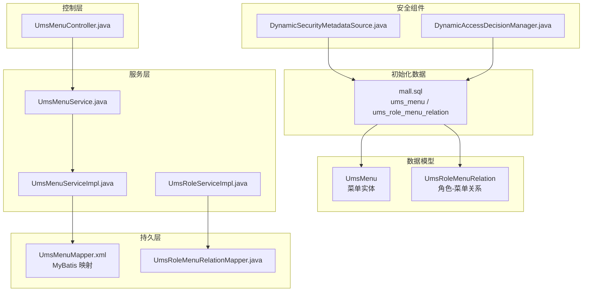
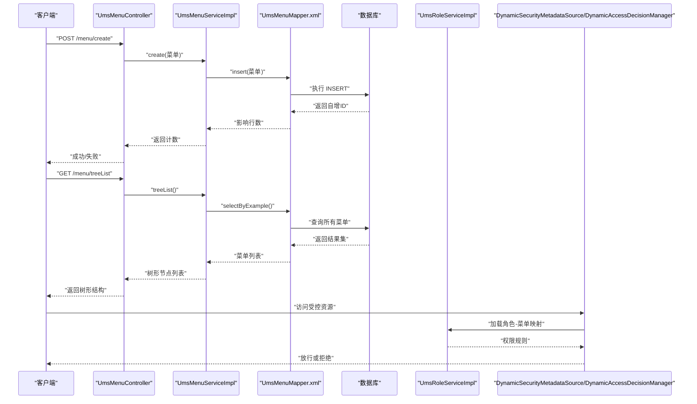
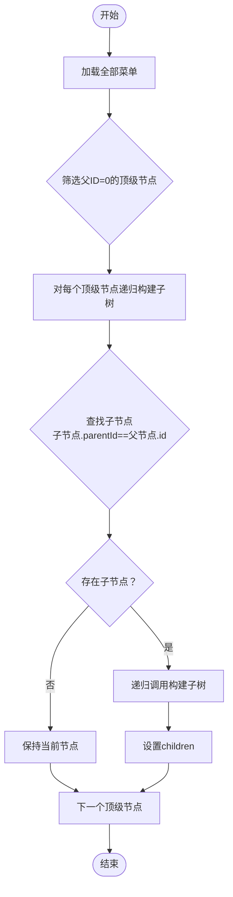
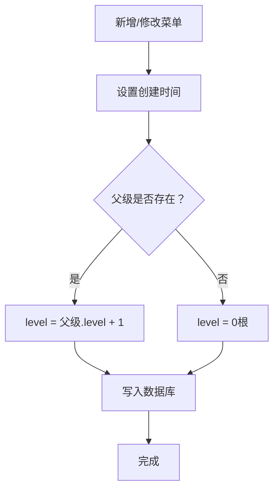
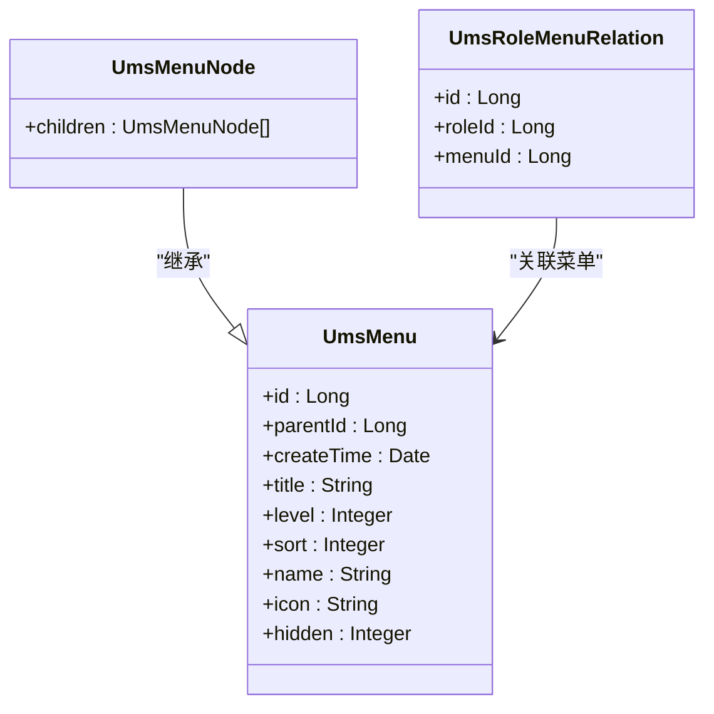
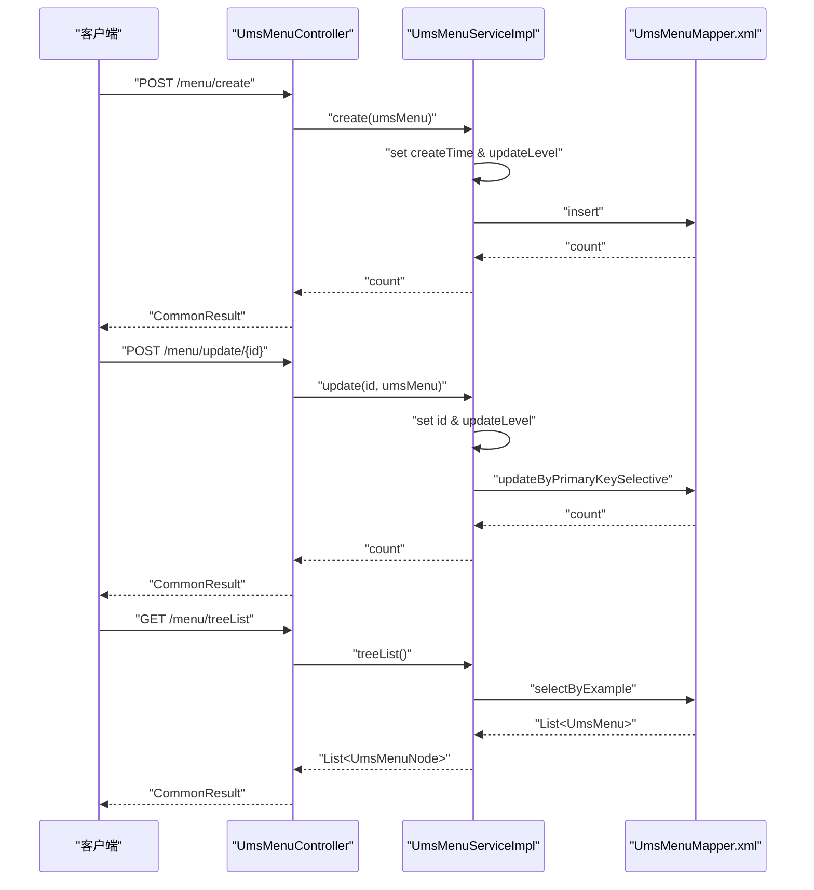
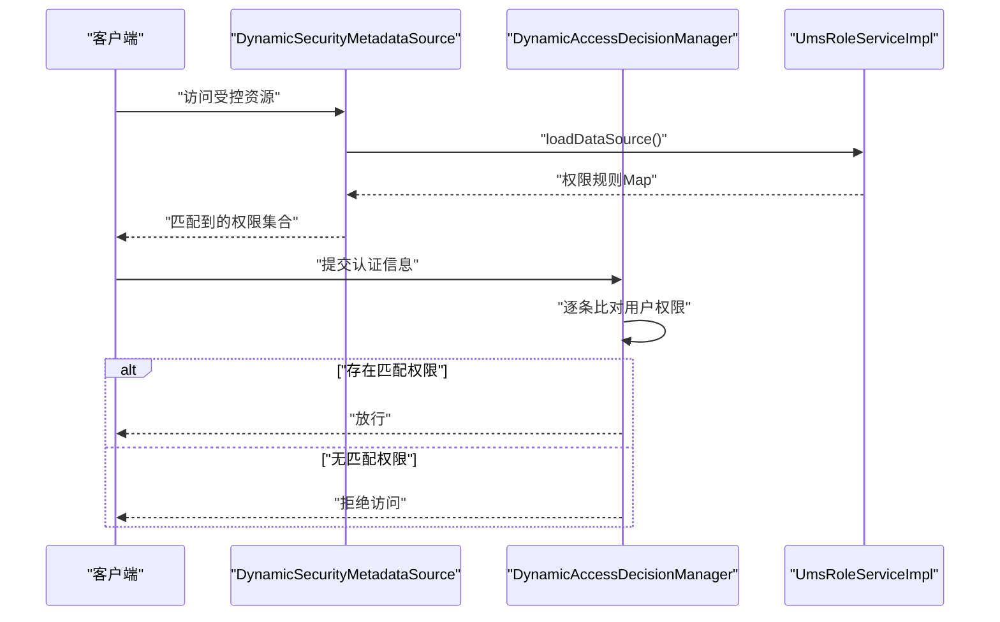
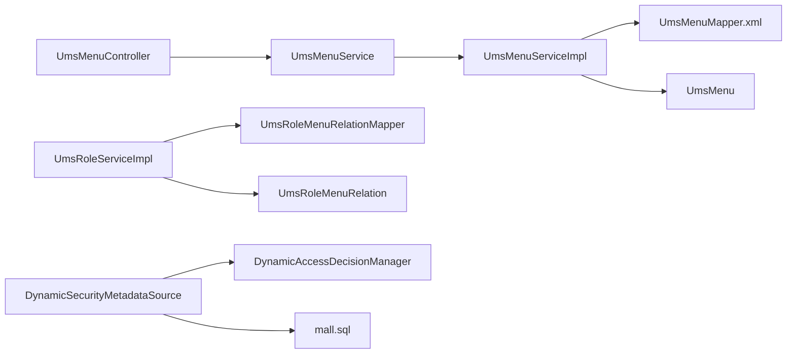

# 菜单表 (UmsMenu)

<cite>
**本文引用的文件**
- [UmsMenu.java](file://mall-mbg/src/main/java/com/macro/mall/model/UmsMenu.java)
- [UmsMenuMapper.xml](file://mall-mbg/src/main/resources/com/macro/mall/mapper/UmsMenuMapper.xml)
- [UmsMenuController.java](file://mall-admin/src/main/java/com/macro/mall/controller/UmsMenuController.java)
- [UmsMenuService.java](file://mall-admin/src/main/java/com/macro/mall/service/UmsMenuService.java)
- [UmsMenuServiceImpl.java](file://mall-admin/src/main/java/com/macro/mall/service/impl/UmsMenuServiceImpl.java)
- [UmsMenuNode.java](file://mall-admin/src/main/java/com/macro/mall/dto/UmsMenuNode.java)
- [mall.sql](file://document/sql/mall.sql)
- [UmsRoleMenuRelation.java](file://mall-mbg/src/main/java/com/macro/mall/model/UmsRoleMenuRelation.java)
- [UmsRoleMenuRelationMapper.java](file://mall-mbg/src/main/java/com/macro/mall/mapper/UmsRoleMenuRelationMapper.java)
- [UmsRoleServiceImpl.java](file://mall-admin/src/main/java/com/macro/mall/service/impl/UmsRoleServiceImpl.java)
- [DynamicSecurityMetadataSource.java](file://mall-security/src/main/java/com/macro/mall/security/component/DynamicSecurityMetadataSource.java)
- [DynamicAccessDecisionManager.java](file://mall-security/src/main/java/com/macro/mall/security/component/DynamicAccessDecisionManager.java)
</cite>

## 目录
1. [简介](#简介)
2. [项目结构](#项目结构)
3. [核心组件](#核心组件)
4. [架构总览](#架构总览)
5. [详细组件分析](#详细组件分析)
6. [依赖分析](#依赖分析)
7. [性能考虑](#性能考虑)
8. [故障排查指南](#故障排查指南)
9. [结论](#结论)
10. [附录](#附录)

## 简介
本文件围绕后台菜单表 UmsMenu 的设计与实现展开，系统性阐述其字段含义与约束、树形结构的构建与维护、在权限体系中的导航作用，以及菜单的增删改查与权限验证流程。通过控制器、服务层、持久层与安全组件的协同，形成从数据模型到前端渲染、再到权限控制的完整闭环。

## 项目结构
- 数据模型与映射
  - 实体类：UmsMenu
  - 映射文件：UmsMenuMapper.xml
  - 关联实体：UmsRoleMenuRelation（角色-菜单关系）
- 控制层与服务层
  - 控制器：UmsMenuController
  - 接口与实现：UmsMenuService / UmsMenuServiceImpl
  - 树节点封装：UmsMenuNode
- 权限与安全
  - 角色-菜单分配：UmsRoleServiceImpl
  - 动态权限元数据：DynamicSecurityMetadataSource
  - 动态权限决策：DynamicAccessDecisionManager
- 初始化数据
  - SQL：包含 ums_menu 及 ums_role_menu_relation 的建表与示例数据

**图表来源**
- [UmsMenu.java:1-118](file://mall-mbg/src/main/java/com/macro/mall/model/UmsMenu.java#L1-L118)
- [UmsMenuMapper.xml:1-273](file://mall-mbg/src/main/resources/com/macro/mall/mapper/UmsMenuMapper.xml#L1-L273)
- [UmsMenuController.java:1-95](file://mall-admin/src/main/java/com/macro/mall/controller/UmsMenuController.java#L1-L95)
- [UmsMenuService.java:1-48](file://mall-admin/src/main/java/com/macro/mall/service/UmsMenuService.java#L1-L48)
- [UmsMenuServiceImpl.java:1-107](file://mall-admin/src/main/java/com/macro/mall/service/impl/UmsMenuServiceImpl.java#L1-L107)
- [UmsRoleMenuRelation.java:1-51](file://mall-mbg/src/main/java/com/macro/mall/model/UmsRoleMenuRelation.java#L1-L51)
- [UmsRoleMenuRelationMapper.java:1-30](file://mall-mbg/src/main/java/com/macro/mall/mapper/UmsRoleMenuRelationMapper.java#L1-L30)
- [UmsRoleServiceImpl.java:1-120](file://mall-admin/src/main/java/com/macro/mall/service/impl/UmsRoleServiceImpl.java#L1-L120)
- [DynamicSecurityMetadataSource.java:1-65](file://mall-security/src/main/java/com/macro/mall/security/component/DynamicSecurityMetadataSource.java#L1-L65)
- [DynamicAccessDecisionManager.java:1-52](file://mall-security/src/main/java/com/macro/mall/security/component/DynamicAccessDecisionManager.java#L1-L52)
- [mall.sql:2939-3138](file://document/sql/mall.sql#L2939-L3138)

**章节来源**
- [UmsMenu.java:1-118](file://mall-mbg/src/main/java/com/macro/mall/model/UmsMenu.java#L1-L118)
- [UmsMenuMapper.xml:1-273](file://mall-mbg/src/main/resources/com/macro/mall/mapper/UmsMenuMapper.xml#L1-L273)
- [UmsMenuController.java:1-95](file://mall-admin/src/main/java/com/macro/mall/controller/UmsMenuController.java#L1-L95)
- [UmsMenuService.java:1-48](file://mall-admin/src/main/java/com/macro/mall/service/UmsMenuService.java#L1-L48)
- [UmsMenuServiceImpl.java:1-107](file://mall-admin/src/main/java/com/macro/mall/service/impl/UmsMenuServiceImpl.java#L1-L107)
- [UmsMenuNode.java:1-18](file://mall-admin/src/main/java/com/macro/mall/dto/UmsMenuNode.java#L1-L18)
- [UmsRoleMenuRelation.java:1-51](file://mall-mbg/src/main/java/com/macro/mall/model/UmsRoleMenuRelation.java#L1-L51)
- [UmsRoleMenuRelationMapper.java:1-30](file://mall-mbg/src/main/java/com/macro/mall/mapper/UmsRoleMenuRelationMapper.java#L1-L30)
- [UmsRoleServiceImpl.java:1-120](file://mall-admin/src/main/java/com/macro/mall/service/impl/UmsRoleServiceImpl.java#L1-L120)
- [DynamicSecurityMetadataSource.java:1-65](file://mall-security/src/main/java/com/macro/mall/security/component/DynamicSecurityMetadataSource.java#L1-L65)
- [DynamicAccessDecisionManager.java:1-52](file://mall-security/src/main/java/com/macro/mall/security/component/DynamicAccessDecisionManager.java#L1-L52)
- [mall.sql:2939-3138](file://document/sql/mall.sql#L2939-L3138)

## 核心组件
- UmsMenu 实体：定义菜单的主键、父级、创建时间、标题、层级、排序、前端名称、图标、隐藏状态等字段，并提供标准的 getter/setter。
- UmsMenuMapper.xml：定义菜单的查询、插入、更新、删除等 SQL 映射，支持按示例条件查询与排序。
- UmsMenuService / UmsMenuServiceImpl：提供菜单的创建、修改、分页查询、树形列表、隐藏状态更新等业务逻辑。
- UmsMenuController：暴露 REST 接口，包括新增、修改、查询单个、删除、按父级分页查询、树形查询、更新隐藏状态。
- UmsMenuNode：继承 UmsMenu 并扩展 children 字段，用于树形结构的序列化输出。
- UmsRoleMenuRelation：角色与菜单的多对多关系表，支撑菜单权限分配。
- UmsRoleServiceImpl：提供角色-菜单分配与查询能力，支持批量分配与清理缓存。
- DynamicSecurityMetadataSource / DynamicAccessDecisionManager：动态权限元数据加载与决策，结合资源路径匹配实现菜单访问控制。

**章节来源**
- [UmsMenu.java:1-118](file://mall-mbg/src/main/java/com/macro/mall/model/UmsMenu.java#L1-L118)
- [UmsMenuMapper.xml:1-273](file://mall-mbg/src/main/resources/com/macro/mall/mapper/UmsMenuMapper.xml#L1-L273)
- [UmsMenuService.java:1-48](file://mall-admin/src/main/java/com/macro/mall/service/UmsMenuService.java#L1-L48)
- [UmsMenuServiceImpl.java:1-107](file://mall-admin/src/main/java/com/macro/mall/service/impl/UmsMenuServiceImpl.java#L1-L107)
- [UmsMenuController.java:1-95](file://mall-admin/src/main/java/com/macro/mall/controller/UmsMenuController.java#L1-L95)
- [UmsMenuNode.java:1-18](file://mall-admin/src/main/java/com/macro/mall/dto/UmsMenuNode.java#L1-L18)
- [UmsRoleMenuRelation.java:1-51](file://mall-mbg/src/main/java/com/macro/mall/model/UmsRoleMenuRelation.java#L1-L51)
- [UmsRoleServiceImpl.java:1-120](file://mall-admin/src/main/java/com/macro/mall/service/impl/UmsRoleServiceImpl.java#L1-L120)
- [DynamicSecurityMetadataSource.java:1-65](file://mall-security/src/main/java/com/macro/mall/security/component/DynamicSecurityMetadataSource.java#L1-L65)
- [DynamicAccessDecisionManager.java:1-52](file://mall-security/src/main/java/com/macro/mall/security/component/DynamicAccessDecisionManager.java#L1-L52)

## 架构总览
下图展示了从控制器到服务、持久层，再到数据库与安全组件的整体交互：

**图表来源**
- [UmsMenuController.java:1-95](file://mall-admin/src/main/java/com/macro/mall/controller/UmsMenuController.java#L1-L95)
- [UmsMenuServiceImpl.java:1-107](file://mall-admin/src/main/java/com/macro/mall/service/impl/UmsMenuServiceImpl.java#L1-L107)
- [UmsMenuMapper.xml:1-273](file://mall-mbg/src/main/resources/com/macro/mall/mapper/UmsMenuMapper.xml#L1-L273)
- [UmsRoleServiceImpl.java:1-120](file://mall-admin/src/main/java/com/macro/mall/service/impl/UmsRoleServiceImpl.java#L1-L120)
- [DynamicSecurityMetadataSource.java:1-65](file://mall-security/src/main/java/com/macro/mall/security/component/DynamicSecurityMetadataSource.java#L1-L65)
- [DynamicAccessDecisionManager.java:1-52](file://mall-security/src/main/java/com/macro/mall/security/component/DynamicAccessDecisionManager.java#L1-L52)

## 详细组件分析

### 数据模型与字段设计
- 主键 id：自增主键，唯一标识菜单项。
- 父级 parentId：指向父级菜单 id，根菜单通常以 0 表示。
- 创建时间 createTime：自动写入创建时间。
- 标题 title：菜单显示名称。
- 层级 level：由服务层根据父级计算，根菜单为 0，子级为父级 + 1。
- 排序 sort：用于同级菜单排序，默认按降序排列。
- 前端名称 name：前端路由或标识使用。
- 图标 icon：前端展示图标。
- 隐藏状态 hidden：控制是否在前端导航中显示。

字段约束与默认值来源于建表脚本，例如：
- parent_id、level、sort、hidden 允许为空，表示可选字段。
- title、name、icon 为可读可写字符串字段。
- create_time 在创建时由服务层填充。

**章节来源**
- [UmsMenu.java:1-118](file://mall-mbg/src/main/java/com/macro/mall/model/UmsMenu.java#L1-L118)
- [mall.sql:2939-2951](file://document/sql/mall.sql#L2939-L2951)

### 树形结构实现原理
- 生成策略：服务层先查询全部菜单，筛选 parentId=0 的顶级节点，再递归构建子节点树。
- 子节点查找：对每个父节点，遍历菜单列表，过滤 parentId 等于当前节点 id 的子项，递归生成树。
- 输出格式：通过 UmsMenuNode 扩展 children 字段，最终输出树形结构。

**图表来源**
- [UmsMenuServiceImpl.java:76-105](file://mall-admin/src/main/java/com/macro/mall/service/impl/UmsMenuServiceImpl.java#L76-L105)
- [UmsMenuNode.java:1-18](file://mall-admin/src/main/java/com/macro/mall/dto/UmsMenuNode.java#L1-L18)

**章节来源**
- [UmsMenuServiceImpl.java:76-105](file://mall-admin/src/main/java/com/macro/mall/service/impl/UmsMenuServiceImpl.java#L76-L105)
- [UmsMenuNode.java:1-18](file://mall-admin/src/main/java/com/macro/mall/dto/UmsMenuNode.java#L1-L18)

### 父子关系维护机制
- 新增时：服务层设置创建时间并调用层级计算方法，若父级不存在则回退为根层级。
- 修改时：同样触发层级重算，保证层级与父级一致性。
- 删除时：直接按主键删除，不涉及层级调整（如需级联删除，可在服务层扩展）。

**图表来源**
- [UmsMenuServiceImpl.java:25-48](file://mall-admin/src/main/java/com/macro/mall/service/impl/UmsMenuServiceImpl.java#L25-L48)

**章节来源**
- [UmsMenuServiceImpl.java:25-48](file://mall-admin/src/main/java/com/macro/mall/service/impl/UmsMenuServiceImpl.java#L25-L48)

### 菜单在权限系统中的导航作用
- 角色-菜单分配：通过 UmsRoleMenuRelation 维护角色与菜单的多对多关系，角色变更后可重新加载权限。
- 导航呈现：树形菜单用于前端侧边栏或面包屑导航，hidden 字段控制是否显示。
- 权限验证：动态权限元数据加载资源与权限的映射，访问时通过决策器校验用户权限。

**图表来源**
- [UmsMenu.java:1-118](file://mall-mbg/src/main/java/com/macro/mall/model/UmsMenu.java#L1-L118)
- [UmsMenuNode.java:1-18](file://mall-admin/src/main/java/com/macro/mall/dto/UmsMenuNode.java#L1-L18)
- [UmsRoleMenuRelation.java:1-51](file://mall-mbg/src/main/java/com/macro/mall/model/UmsRoleMenuRelation.java#L1-L51)

**章节来源**
- [UmsRoleMenuRelation.java:1-51](file://mall-mbg/src/main/java/com/macro/mall/model/UmsRoleMenuRelation.java#L1-L51)
- [UmsRoleMenuRelationMapper.java:1-30](file://mall-mbg/src/main/java/com/macro/mall/mapper/UmsRoleMenuRelationMapper.java#L1-L30)
- [UmsRoleServiceImpl.java:88-101](file://mall-admin/src/main/java/com/macro/mall/service/impl/UmsRoleServiceImpl.java#L88-L101)

### 菜单操作实现细节
- 新增菜单
  - 控制器接收 UmsMenu 对象，服务层设置创建时间并计算层级，最后执行插入。
- 修改菜单
  - 控制器接收 id 与 UmsMenu，服务层设置 id 并重新计算层级，执行选择性更新。
- 查询菜单
  - 单个查询：按主键查询。
  - 列表查询：按父级 parentId 进行条件查询，并按 sort 降序。
  - 树形查询：查询全部菜单，筛选根节点并递归构建树。
- 删除菜单
  - 按主键删除，不处理级联。
- 更新隐藏状态
  - 仅更新 hidden 字段，便于前端控制显示。

**图表来源**
- [UmsMenuController.java:27-82](file://mall-admin/src/main/java/com/macro/mall/controller/UmsMenuController.java#L27-L82)
- [UmsMenuServiceImpl.java:25-92](file://mall-admin/src/main/java/com/macro/mall/service/impl/UmsMenuServiceImpl.java#L25-L92)
- [UmsMenuMapper.xml:106-174](file://mall-mbg/src/main/resources/com/macro/mall/mapper/UmsMenuMapper.xml#L106-L174)

**章节来源**
- [UmsMenuController.java:27-82](file://mall-admin/src/main/java/com/macro/mall/controller/UmsMenuController.java#L27-L82)
- [UmsMenuServiceImpl.java:25-92](file://mall-admin/src/main/java/com/macro/mall/service/impl/UmsMenuServiceImpl.java#L25-L92)
- [UmsMenuMapper.xml:76-174](file://mall-mbg/src/main/resources/com/macro/mall/mapper/UmsMenuMapper.xml#L76-L174)

### 菜单权限验证技术实现
- 动态权限数据源：启动时加载资源与权限的映射，运行时可刷新。
- 请求匹配：基于 Ant 路径匹配当前访问路径，收集所需权限集合。
- 决策逻辑：遍历所需权限，若用户任一角色具备对应权限则放行，否则拒绝访问。
- 角色-菜单关系：通过角色查询菜单列表，用于前端导航与页面级权限控制。

**图表来源**
- [DynamicSecurityMetadataSource.java:24-52](file://mall-security/src/main/java/com/macro/mall/security/component/DynamicSecurityMetadataSource.java#L24-L52)
- [DynamicAccessDecisionManager.java:20-39](file://mall-security/src/main/java/com/macro/mall/security/component/DynamicAccessDecisionManager.java#L20-L39)
- [UmsRoleServiceImpl.java:72-75](file://mall-admin/src/main/java/com/macro/mall/service/impl/UmsRoleServiceImpl.java#L72-L75)

**章节来源**
- [DynamicSecurityMetadataSource.java:24-52](file://mall-security/src/main/java/com/macro/mall/security/component/DynamicSecurityMetadataSource.java#L24-L52)
- [DynamicAccessDecisionManager.java:20-39](file://mall-security/src/main/java/com/macro/mall/security/component/DynamicAccessDecisionManager.java#L20-L39)
- [UmsRoleServiceImpl.java:72-75](file://mall-admin/src/main/java/com/macro/mall/service/impl/UmsRoleServiceImpl.java#L72-L75)

## 依赖分析
- 控制器依赖服务接口，服务实现依赖 Mapper XML 与实体类。
- 角色服务依赖角色-菜单关系 Mapper 与 DAO，用于加载菜单列表与分配关系。
- 安全组件依赖动态权限服务接口，后者负责加载资源-权限映射。
- 数据层依赖 SQL 脚本提供的表结构与示例数据。

**图表来源**
- [UmsMenuController.java:1-95](file://mall-admin/src/main/java/com/macro/mall/controller/UmsMenuController.java#L1-L95)
- [UmsMenuService.java:1-48](file://mall-admin/src/main/java/com/macro/mall/service/UmsMenuService.java#L1-L48)
- [UmsMenuServiceImpl.java:1-107](file://mall-admin/src/main/java/com/macro/mall/service/impl/UmsMenuServiceImpl.java#L1-L107)
- [UmsMenuMapper.xml:1-273](file://mall-mbg/src/main/resources/com/macro/mall/mapper/UmsMenuMapper.xml#L1-L273)
- [UmsRoleServiceImpl.java:1-120](file://mall-admin/src/main/java/com/macro/mall/service/impl/UmsRoleServiceImpl.java#L1-L120)
- [UmsRoleMenuRelationMapper.java:1-30](file://mall-mbg/src/main/java/com/macro/mall/mapper/UmsRoleMenuRelationMapper.java#L1-L30)
- [UmsRoleMenuRelation.java:1-51](file://mall-mbg/src/main/java/com/macro/mall/model/UmsRoleMenuRelation.java#L1-L51)
- [DynamicSecurityMetadataSource.java:1-65](file://mall-security/src/main/java/com/macro/mall/security/component/DynamicSecurityMetadataSource.java#L1-L65)
- [DynamicAccessDecisionManager.java:1-52](file://mall-security/src/main/java/com/macro/mall/security/component/DynamicAccessDecisionManager.java#L1-L52)
- [mall.sql:2939-3138](file://document/sql/mall.sql#L2939-L3138)

**章节来源**
- [UmsMenuController.java:1-95](file://mall-admin/src/main/java/com/macro/mall/controller/UmsMenuController.java#L1-L95)
- [UmsMenuServiceImpl.java:1-107](file://mall-admin/src/main/java/com/macro/mall/service/impl/UmsMenuServiceImpl.java#L1-L107)
- [UmsRoleServiceImpl.java:1-120](file://mall-admin/src/main/java/com/macro/mall/service/impl/UmsRoleServiceImpl.java#L1-L120)
- [DynamicSecurityMetadataSource.java:1-65](file://mall-security/src/main/java/com/macro/mall/security/component/DynamicSecurityMetadataSource.java#L1-L65)
- [DynamicAccessDecisionManager.java:1-52](file://mall-security/src/main/java/com/macro/mall/security/component/DynamicAccessDecisionManager.java#L1-L52)
- [mall.sql:2939-3138](file://document/sql/mall.sql#L2939-L3138)

## 性能考虑
- 树形构建：O(n^2) 的递归筛选在小规模菜单下可接受，建议在数据量增大时引入索引与缓存。
- 分页查询：列表查询已使用分页插件，避免一次性加载过多数据。
- 层级计算：每次新增/修改均会查询父级，建议在服务层增加缓存以减少重复查询。
- 权限匹配：Ant 路径匹配为线性扫描，建议对热点路径进行预热与缓存。

[本节为通用指导，无需特定文件来源]

## 故障排查指南
- 新增菜单层级异常
  - 检查父级是否存在，若父级不存在将回退为根层级。
  - 确认服务层 updateLevel 是否正确调用。
- 树形菜单为空
  - 确认数据库中是否存在 parentId=0 的根节点。
  - 检查 treeList 的过滤条件与递归逻辑。
- 权限无法生效
  - 检查角色-菜单关系是否正确分配。
  - 确认动态权限数据源是否加载成功。
  - 核对请求路径与权限规则是否匹配。

**章节来源**
- [UmsMenuServiceImpl.java:35-48](file://mall-admin/src/main/java/com/macro/mall/service/impl/UmsMenuServiceImpl.java#L35-L48)
- [UmsMenuServiceImpl.java:76-105](file://mall-admin/src/main/java/com/macro/mall/service/impl/UmsMenuServiceImpl.java#L76-L105)
- [UmsRoleServiceImpl.java:88-101](file://mall-admin/src/main/java/com/macro/mall/service/impl/UmsRoleServiceImpl.java#L88-L101)
- [DynamicSecurityMetadataSource.java:24-27](file://mall-security/src/main/java/com/macro/mall/security/component/DynamicSecurityMetadataSource.java#L24-L27)

## 结论
UmsMenu 通过简洁的字段设计与清晰的层级计算，实现了灵活的树形菜单结构；配合角色-菜单关系与动态权限组件，形成了从前端导航到后端访问控制的完整链路。在实际部署中，建议关注树形构建与权限匹配的性能优化，并确保权限数据的及时刷新与一致性。

[本节为总结性内容，无需特定文件来源]

## 附录
- 示例数据
  - 菜单表包含多个示例菜单，涵盖商品、订单、营销、权限等模块，便于演示树形结构与导航效果。
  - 角色-菜单关系表包含示例分配，超级管理员拥有全部菜单访问能力。

**章节来源**
- [mall.sql:2956-2979](file://document/sql/mall.sql#L2956-L2979)
- [mall.sql:3128-3138](file://document/sql/mall.sql#L3128-L3138)