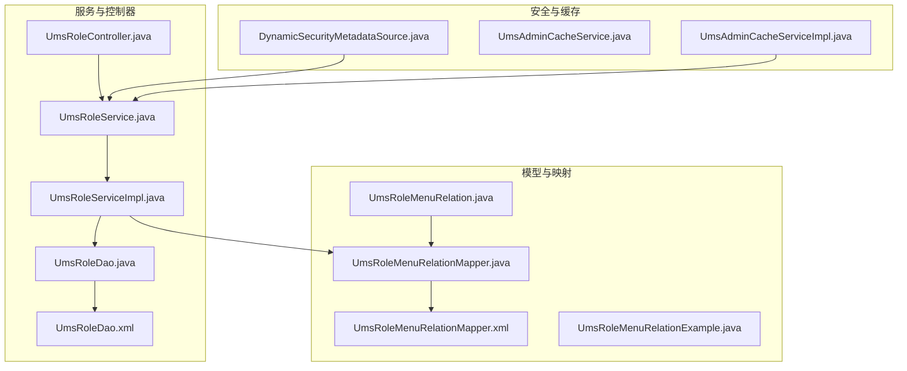
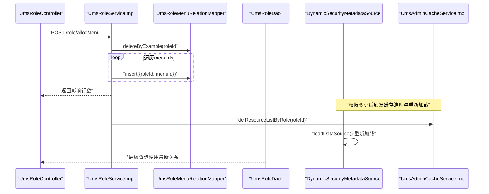
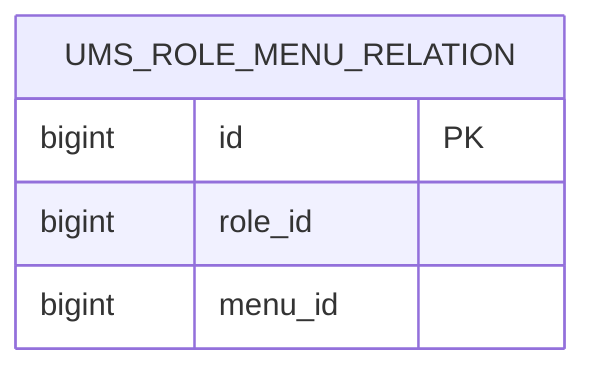
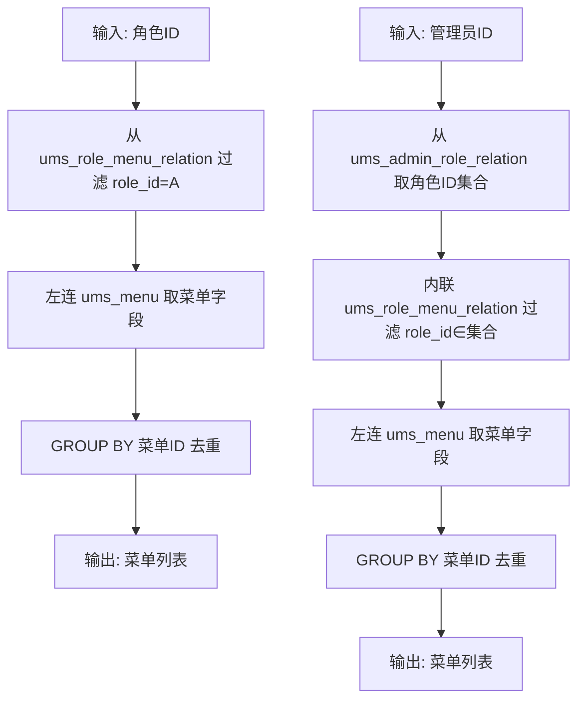
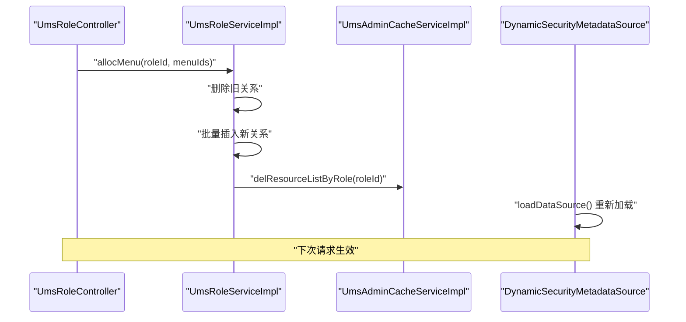
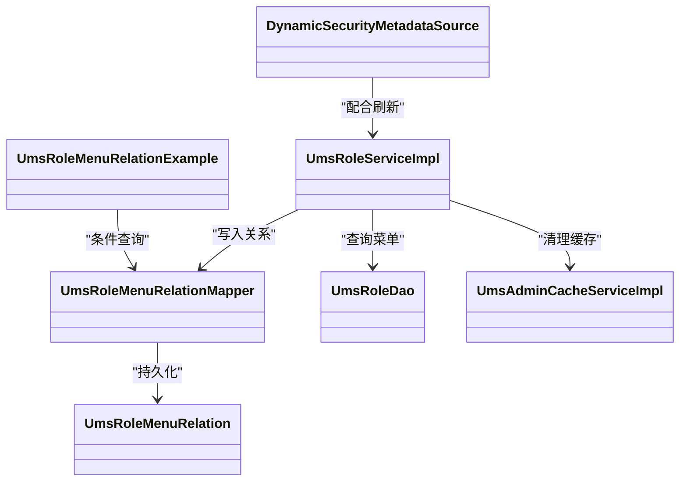

# 角色菜单关系表 (UmsRoleMenuRelation)

<cite>
**本文引用的文件**
- [UmsRoleMenuRelation.java](file://mall-mbg/src/main/java/com/macro/mall/model/UmsRoleMenuRelation.java)
- [UmsRoleMenuRelationMapper.java](file://mall-mbg/src/main/java/com/macro/mall/mapper/UmsRoleMenuRelationMapper.java)
- [UmsRoleMenuRelationMapper.xml](file://mall-mbg/src/main/resources/com/macro/mall/mapper/UmsRoleMenuRelationMapper.xml)
- [UmsRoleMenuRelationExample.java](file://mall-mbg/src/main/java/com/macro/mall/model/UmsRoleMenuRelationExample.java)
- [mall.sql](file://document/sql/mall.sql)
- [UmsRoleController.java](file://mall-admin/src/main/java/com/macro/mall/controller/UmsRoleController.java)
- [UmsRoleService.java](file://mall-admin/src/main/java/com/macro/mall/service/UmsRoleService.java)
- [UmsRoleServiceImpl.java](file://mall-admin/src/main/java/com/macro/mall/service/impl/UmsRoleServiceImpl.java)
- [UmsRoleDao.java](file://mall-admin/src/main/java/com/macro/mall/dao/UmsRoleDao.java)
- [UmsRoleDao.xml](file://mall-admin/src/main/resources/dao/UmsRoleDao.xml)
- [UmsAdminCacheService.java](file://mall-admin/src/main/java/com/macro/mall/service/UmsAdminCacheService.java)
- [UmsAdminCacheServiceImpl.java](file://mall-admin/src/main/java/com/macro/mall/service/impl/UmsAdminCacheServiceImpl.java)
- [DynamicSecurityMetadataSource.java](file://mall-security/src/main/java/com/macro/mall/security/component/DynamicSecurityMetadataSource.java)
</cite>

## 目录
1. [简介](#简介)
2. [项目结构](#项目结构)
3. [核心组件](#核心组件)
4. [架构总览](#架构总览)
5. [详细组件分析](#详细组件分析)
6. [依赖分析](#依赖分析)
7. [性能考虑](#性能考虑)
8. [故障排查指南](#故障排查指南)
9. [结论](#结论)

## 简介
本文件围绕“角色菜单关系表（UmsRoleMenuRelation）”展开，系统性阐述其设计目的、字段结构、多对多关系实现机制、权限继承与传递规则、动态授权与权限变更的实时生效机制，以及权限缓存与性能优化策略。目标是帮助读者从代码到运行时行为全面理解该表在权限体系中的作用。

## 项目结构
UmsRoleMenuRelation 属于后端权限模型的一部分，位于 MBG（MyBatis Generator）生成的模型与映射层中，并由管理端服务层负责授权分配，最终通过安全组件在运行时生效。

图表来源
- [UmsRoleMenuRelation.java:1-51](file://mall-mbg/src/main/java/com/macro/mall/model/UmsRoleMenuRelation.java#L1-L51)
- [UmsRoleMenuRelationMapper.java:1-30](file://mall-mbg/src/main/java/com/macro/mall/mapper/UmsRoleMenuRelationMapper.java#L1-L30)
- [UmsRoleMenuRelationMapper.xml:1-179](file://mall-mbg/src/main/resources/com/macro/mall/mapper/UmsRoleMenuRelationMapper.xml#L1-L179)
- [UmsRoleMenuRelationExample.java:1-64](file://mall-mbg/src/main/java/com/macro/mall/model/UmsRoleMenuRelationExample.java#L1-L64)
- [UmsRoleController.java:1-112](file://mall-admin/src/main/java/com/macro/mall/controller/UmsRoleController.java#L1-L112)
- [UmsRoleService.java:1-67](file://mall-admin/src/main/java/com/macro/mall/service/UmsRoleService.java#L1-L67)
- [UmsRoleServiceImpl.java:1-120](file://mall-admin/src/main/java/com/macro/mall/service/impl/UmsRoleServiceImpl.java#L1-L120)
- [UmsRoleDao.java:1-27](file://mall-admin/src/main/java/com/macro/mall/dao/UmsRoleDao.java#L1-L27)
- [UmsRoleDao.xml:1-64](file://mall-admin/src/main/resources/dao/UmsRoleDao.xml#L1-L64)
- [DynamicSecurityMetadataSource.java:1-65](file://mall-security/src/main/java/com/macro/mall/security/component/DynamicSecurityMetadataSource.java#L1-L65)
- [UmsAdminCacheService.java:1-58](file://mall-admin/src/main/java/com/macro/mall/service/UmsAdminCacheService.java#L1-L58)
- [UmsAdminCacheServiceImpl.java:1-116](file://mall-admin/src/main/java/com/macro/mall/service/impl/UmsAdminCacheServiceImpl.java#L1-L116)

章节来源
- [UmsRoleMenuRelation.java:1-51](file://mall-mbg/src/main/java/com/macro/mall/model/UmsRoleMenuRelation.java#L1-L51)
- [UmsRoleMenuRelationMapper.java:1-30](file://mall-mbg/src/main/java/com/macro/mall/mapper/UmsRoleMenuRelationMapper.java#L1-L30)
- [UmsRoleMenuRelationMapper.xml:1-179](file://mall-mbg/src/main/resources/com/macro/mall/mapper/UmsRoleMenuRelationMapper.xml#L1-L179)
- [UmsRoleMenuRelationExample.java:1-64](file://mall-mbg/src/main/java/com/macro/mall/model/UmsRoleMenuRelationExample.java#L1-L64)
- [UmsRoleController.java:1-112](file://mall-admin/src/main/java/com/macro/mall/controller/UmsRoleController.java#L1-L112)
- [UmsRoleService.java:1-67](file://mall-admin/src/main/java/com/macro/mall/service/UmsRoleService.java#L1-L67)
- [UmsRoleServiceImpl.java:1-120](file://mall-admin/src/main/java/com/macro/mall/service/impl/UmsRoleServiceImpl.java#L1-L120)
- [UmsRoleDao.java:1-27](file://mall-admin/src/main/java/com/macro/mall/dao/UmsRoleDao.java#L1-L27)
- [UmsRoleDao.xml:1-64](file://mall-admin/src/main/resources/dao/UmsRoleDao.xml#L1-L64)
- [DynamicSecurityMetadataSource.java:1-65](file://mall-security/src/main/java/com/macro/mall/security/component/DynamicSecurityMetadataSource.java#L1-L65)
- [UmsAdminCacheService.java:1-58](file://mall-admin/src/main/java/com/macro/mall/service/UmsAdminCacheService.java#L1-L58)
- [UmsAdminCacheServiceImpl.java:1-116](file://mall-admin/src/main/java/com/macro/mall/service/impl/UmsAdminCacheServiceImpl.java#L1-L116)

## 核心组件
- 数据模型：UmsRoleMenuRelation 表示角色与菜单之间的多对多关系，包含主键、角色ID、菜单ID。
- 映射接口与XML：提供基于 MyBatis 的增删改查能力，支持按示例条件查询、分页与排序。
- 控制器与服务：提供“分配菜单”接口，内部以事务方式清空旧关系并批量写入新关系。
- DAO 查询：提供按角色或管理员维度查询菜单列表的能力，用于权限下发与展示。
- 安全与缓存：通过动态权限元数据加载与缓存清理，确保权限变更后能尽快生效。

章节来源
- [UmsRoleMenuRelation.java:1-51](file://mall-mbg/src/main/java/com/macro/mall/model/UmsRoleMenuRelation.java#L1-L51)
- [UmsRoleMenuRelationMapper.java:1-30](file://mall-mbg/src/main/java/com/macro/mall/mapper/UmsRoleMenuRelationMapper.java#L1-L30)
- [UmsRoleMenuRelationMapper.xml:1-179](file://mall-mbg/src/main/resources/com/macro/mall/mapper/UmsRoleMenuRelationMapper.xml#L1-L179)
- [UmsRoleController.java:97-102](file://mall-admin/src/main/java/com/macro/mall/controller/UmsRoleController.java#L97-L102)
- [UmsRoleServiceImpl.java:88-101](file://mall-admin/src/main/java/com/macro/mall/service/impl/UmsRoleServiceImpl.java#L88-L101)
- [UmsRoleDao.xml:27-46](file://mall-admin/src/main/resources/dao/UmsRoleDao.xml#L27-L46)
- [DynamicSecurityMetadataSource.java:24-32](file://mall-security/src/main/java/com/macro/mall/security/component/DynamicSecurityMetadataSource.java#L24-L32)
- [UmsAdminCacheServiceImpl.java:59-80](file://mall-admin/src/main/java/com/macro/mall/service/impl/UmsAdminCacheServiceImpl.java#L59-L80)

## 架构总览
下图展示了“角色菜单关系表”的关键交互流程：控制器接收分配请求，服务层清空旧关系并写入新关系，DAO 层根据角色或管理员查询菜单，安全组件在运行时加载最新权限规则，缓存层负责失效与更新。

图表来源
- [UmsRoleController.java:97-102](file://mall-admin/src/main/java/com/macro/mall/controller/UmsRoleController.java#L97-L102)
- [UmsRoleServiceImpl.java:88-101](file://mall-admin/src/main/java/com/macro/mall/service/impl/UmsRoleServiceImpl.java#L88-L101)
- [UmsRoleMenuRelationMapper.java:11-17](file://mall-mbg/src/main/java/com/macro/mall/mapper/UmsRoleMenuRelationMapper.java#L11-L17)
- [UmsRoleDao.xml:27-46](file://mall-admin/src/main/resources/dao/UmsRoleDao.xml#L27-L46)
- [DynamicSecurityMetadataSource.java:24-32](file://mall-security/src/main/java/com/macro/mall/security/component/DynamicSecurityMetadataSource.java#L24-L32)
- [UmsAdminCacheServiceImpl.java:59-80](file://mall-admin/src/main/java/com/macro/mall/service/impl/UmsAdminCacheServiceImpl.java#L59-L80)

## 详细组件分析

### 数据模型与表结构
- 设计目的：建立角色与菜单之间的多对多关系，支撑“角色拥有哪些菜单”的权限表达。
- 字段说明：
  - id：自增主键，唯一标识一条关系记录。
  - roleId：角色ID，指向角色表。
  - menuId：菜单ID，指向菜单表。
- 关系特性：无额外冗余字段，最小化存储；通过组合索引可优化查询与去重。

图表来源
- [mall.sql:3117-3123](file://document/sql/mall.sql#L3117-L3123)

章节来源
- [mall.sql:3117-3123](file://document/sql/mall.sql#L3117-L3123)
- [UmsRoleMenuRelation.java:5-12](file://mall-mbg/src/main/java/com/macro/mall/model/UmsRoleMenuRelation.java#L5-L12)

### 多对多关系实现机制
- 角色到菜单：通过中间表 UmsRoleMenuRelation 将角色与菜单解耦，支持一个角色绑定多个菜单，一个菜单被多个角色共享。
- 查询路径：
  - 按角色查询菜单：DAO 使用内连接从中间表与菜单表取数，保证结果去重。
  - 按管理员查询菜单：DAO 通过管理员-角色关系表再关联中间表与菜单表，形成“管理员→角色→菜单”的链路。
- 示例查询语义：
  - “列出某角色的所有菜单”：从中间表过滤角色ID，再连接菜单表取字段。
  - “列出某管理员的所有菜单”：先从管理员-角色关系表取角色ID集合，再经中间表与菜单表拼接。

图表来源
- [UmsRoleDao.xml:16-26](file://mall-admin/src/main/resources/dao/UmsRoleDao.xml#L16-L26)
- [UmsRoleDao.xml:27-46](file://mall-admin/src/main/resources/dao/UmsRoleDao.xml#L27-L46)

章节来源
- [UmsRoleDao.xml:5-26](file://mall-admin/src/main/resources/dao/UmsRoleDao.xml#L5-L26)
- [UmsRoleDao.xml:27-46](file://mall-admin/src/main/resources/dao/UmsRoleDao.xml#L27-L46)

### 权限继承与传递规则
- 角色→菜单：角色直接持有菜单集合，不存在跨角色继承；若需要“继承”，应在业务上为角色批量复制菜单集合。
- 管理员→菜单：管理员通过角色间接获得菜单，若角色菜单变更，管理员即时获得最新菜单集合。
- 资源与菜单的关系：资源权限与菜单权限分别维护在不同关系表中，二者叠加构成完整的访问控制面。

章节来源
- [UmsRoleDao.xml:16-26](file://mall-admin/src/main/resources/dao/UmsRoleDao.xml#L16-L26)
- [UmsRoleDao.xml:27-46](file://mall-admin/src/main/resources/dao/UmsRoleDao.xml#L27-L46)

### 动态授权与权限变更的实时生效机制
- 授权流程：
  - 控制器接收分配请求，调用服务层。
  - 服务层以事务执行：先删除该角色的旧关系，再批量插入新关系。
- 实时生效：
  - 服务层在分配完成后，触发缓存清理（按角色维度），避免读到陈旧权限。
  - 安全组件在下一次请求到来时重新加载资源-权限映射，使新增/移除的菜单立即生效。

图表来源
- [UmsRoleController.java:97-102](file://mall-admin/src/main/java/com/macro/mall/controller/UmsRoleController.java#L97-L102)
- [UmsRoleServiceImpl.java:88-101](file://mall-admin/src/main/java/com/macro/mall/service/impl/UmsRoleServiceImpl.java#L88-L101)
- [UmsAdminCacheServiceImpl.java:59-80](file://mall-admin/src/main/java/com/macro/mall/service/impl/UmsAdminCacheServiceImpl.java#L59-L80)
- [DynamicSecurityMetadataSource.java:24-32](file://mall-security/src/main/java/com/macro/mall/security/component/DynamicSecurityMetadataSource.java#L24-L32)

章节来源
- [UmsRoleController.java:97-102](file://mall-admin/src/main/java/com/macro/mall/controller/UmsRoleController.java#L97-L102)
- [UmsRoleServiceImpl.java:88-101](file://mall-admin/src/main/java/com/macro/mall/service/impl/UmsRoleServiceImpl.java#L88-L101)
- [UmsAdminCacheServiceImpl.java:59-80](file://mall-admin/src/main/java/com/macro/mall/service/impl/UmsAdminCacheServiceImpl.java#L59-L80)
- [DynamicSecurityMetadataSource.java:24-32](file://mall-security/src/main/java/com/macro/mall/security/component/DynamicSecurityMetadataSource.java#L24-L32)

### 权限缓存与性能优化策略
- 缓存维度：
  - 用户级缓存：按用户名缓存管理员信息，降低重复查询。
  - 资源列表缓存：按管理员ID缓存其资源列表，减少频繁计算。
  - 角色级缓存：当角色资源或角色菜单发生变更时，批量清理受影响用户的资源列表缓存。
- 性能优化点：
  - DAO 查询使用 LEFT JOIN 并按菜单ID GROUP BY 去重，避免重复数据。
  - MyBatis XML 提供 selectByExample、count、update 等常用操作，便于按需查询与统计。
  - 事务内批量写入中间表，减少多次往返数据库的开销。

章节来源
- [UmsAdminCacheServiceImpl.java:59-80](file://mall-admin/src/main/java/com/macro/mall/service/impl/UmsAdminCacheServiceImpl.java#L59-L80)
- [UmsRoleDao.xml:27-46](file://mall-admin/src/main/resources/dao/UmsRoleDao.xml#L27-L46)
- [UmsRoleMenuRelationMapper.xml:70-83](file://mall-mbg/src/main/resources/com/macro/mall/mapper/UmsRoleMenuRelationMapper.xml#L70-L83)

## 依赖分析
- 模型与映射层：UmsRoleMenuRelation 作为实体，UmsRoleMenuRelationMapper 提供 CRUD，UmsRoleMenuRelationExample 支持条件查询。
- 服务层：UmsRoleServiceImpl 在分配菜单时依赖 Mapper 与 DAO，同时负责事务与缓存清理。
- DAO 层：UmsRoleDao.xml 提供按角色与管理员查询菜单的 SQL。
- 安全层：DynamicSecurityMetadataSource 在启动时加载资源-权限映射，支持动态刷新。
- 缓存层：UmsAdminCacheServiceImpl 提供用户与资源列表缓存及失效策略。

图表来源
- [UmsRoleMenuRelation.java:1-51](file://mall-mbg/src/main/java/com/macro/mall/model/UmsRoleMenuRelation.java#L1-L51)
- [UmsRoleMenuRelationMapper.java:1-30](file://mall-mbg/src/main/java/com/macro/mall/mapper/UmsRoleMenuRelationMapper.java#L1-L30)
- [UmsRoleMenuRelationExample.java:1-64](file://mall-mbg/src/main/java/com/macro/mall/model/UmsRoleMenuRelationExample.java#L1-L64)
- [UmsRoleServiceImpl.java:1-120](file://mall-admin/src/main/java/com/macro/mall/service/impl/UmsRoleServiceImpl.java#L1-L120)
- [UmsRoleDao.java:1-27](file://mall-admin/src/main/java/com/macro/mall/dao/UmsRoleDao.java#L1-L27)
- [UmsAdminCacheServiceImpl.java:1-116](file://mall-admin/src/main/java/com/macro/mall/service/impl/UmsAdminCacheServiceImpl.java#L1-L116)
- [DynamicSecurityMetadataSource.java:1-65](file://mall-security/src/main/java/com/macro/mall/security/component/DynamicSecurityMetadataSource.java#L1-L65)

章节来源
- [UmsRoleMenuRelationMapper.java:1-30](file://mall-mbg/src/main/java/com/macro/mall/mapper/UmsRoleMenuRelationMapper.java#L1-L30)
- [UmsRoleServiceImpl.java:1-120](file://mall-admin/src/main/java/com/macro/mall/service/impl/UmsRoleServiceImpl.java#L1-L120)
- [UmsRoleDao.java:1-27](file://mall-admin/src/main/java/com/macro/mall/dao/UmsRoleDao.java#L1-L27)
- [UmsAdminCacheServiceImpl.java:1-116](file://mall-admin/src/main/java/com/macro/mall/service/impl/UmsAdminCacheServiceImpl.java#L1-L116)
- [DynamicSecurityMetadataSource.java:1-65](file://mall-security/src/main/java/com/macro/mall/security/component/DynamicSecurityMetadataSource.java#L1-L65)

## 性能考虑
- 查询去重：DAO 层使用 GROUP BY 菜单ID 去重，避免重复数据带来的处理与传输成本。
- 批量写入：服务层在分配菜单时先清空旧关系，再批量插入，减少多次往返数据库的开销。
- 缓存命中：通过按角色维度清理缓存，避免全量失效；结合用户级缓存，降低重复查询。
- 索引建议：中间表可考虑在 (role_id, menu_id) 上建立复合索引，加速按角色查询与去重。

## 故障排查指南
- 分配菜单无效
  - 检查是否正确调用“分配菜单”接口并传入正确的角色ID与菜单ID集合。
  - 确认服务层事务已提交，且缓存已按角色维度清理。
  - 下次请求时确认安全组件已重新加载资源-权限映射。
- 查询不到菜单
  - 确认管理员与角色存在有效关联。
  - 确认角色与菜单在中间表中存在对应关系。
  - 检查 DAO 查询是否按角色或管理员维度正确拼接。
- 缓存不一致
  - 若出现权限变更后仍看到旧菜单，检查缓存清理逻辑是否执行。
  - 确认缓存键前缀与过期时间配置正确。

章节来源
- [UmsRoleController.java:97-102](file://mall-admin/src/main/java/com/macro/mall/controller/UmsRoleController.java#L97-L102)
- [UmsRoleServiceImpl.java:88-101](file://mall-admin/src/main/java/com/macro/mall/service/impl/UmsRoleServiceImpl.java#L88-L101)
- [UmsRoleDao.xml:16-26](file://mall-admin/src/main/resources/dao/UmsRoleDao.xml#L16-L26)
- [UmsAdminCacheServiceImpl.java:59-80](file://mall-admin/src/main/java/com/macro/mall/service/impl/UmsAdminCacheServiceImpl.java#L59-L80)
- [DynamicSecurityMetadataSource.java:24-32](file://mall-security/src/main/java/com/macro/mall/security/component/DynamicSecurityMetadataSource.java#L24-L32)

## 结论
UmsRoleMenuRelation 通过简洁的数据模型与完善的映射、服务、DAO、安全与缓存链路，实现了角色到菜单的灵活授权与高效查询。其动态授权与缓存失效机制确保权限变更能够快速生效，配合 DAO 去重与批量写入策略，兼顾了功能灵活性与运行时性能。