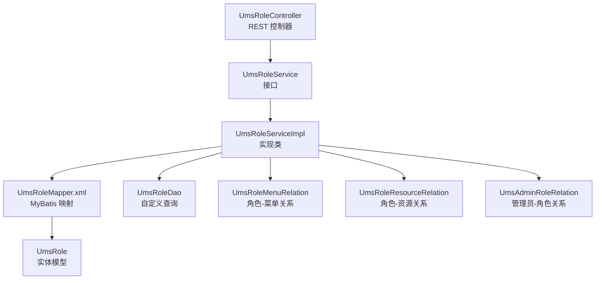
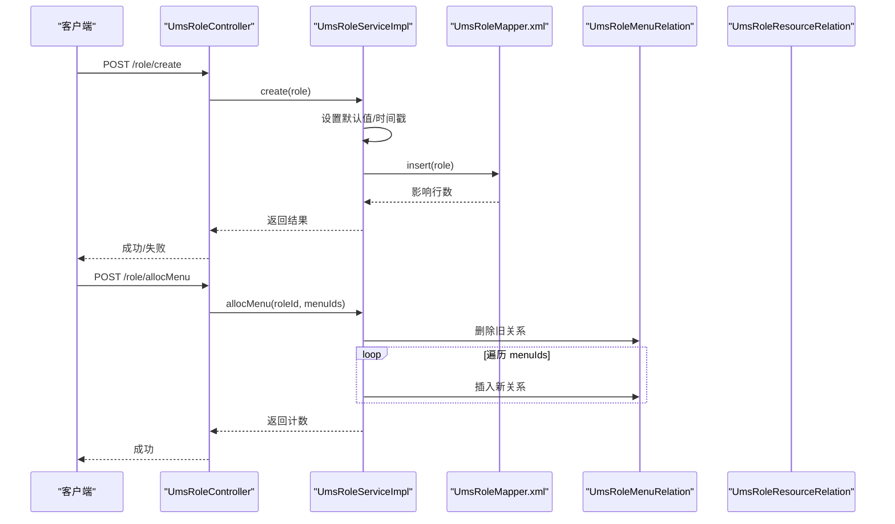
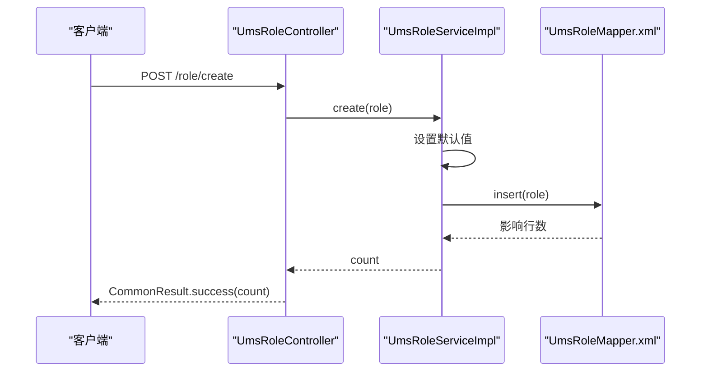
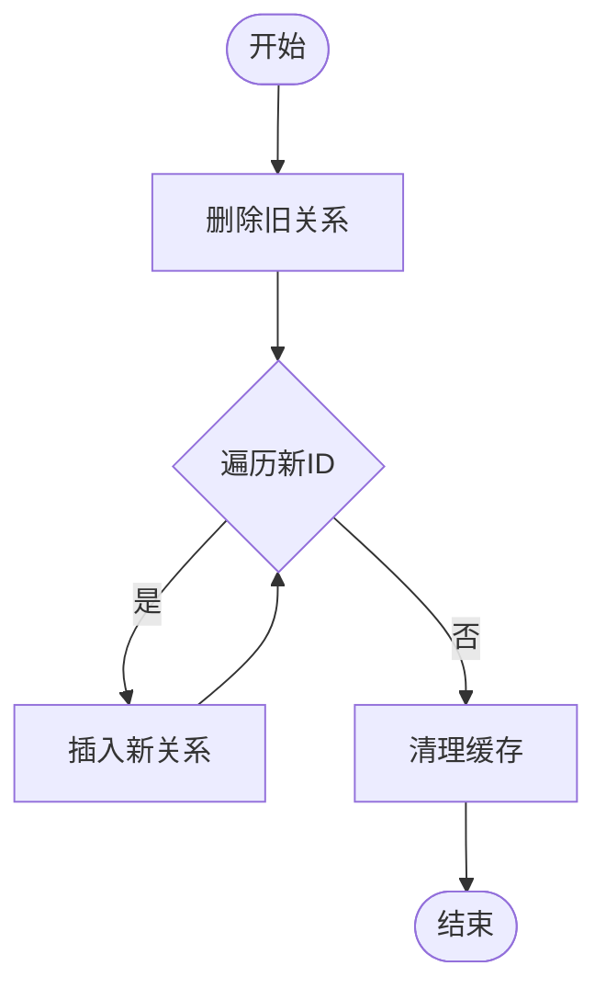
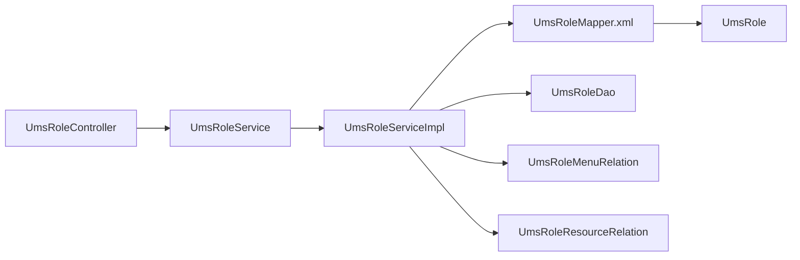

# 角色表 (UmsRole)

<cite>
**本文档引用的文件**
- [UmsRole.java](file://mall-mbg/src/main/java/com/macro/mall/model/UmsRole.java)
- [UmsRoleMapper.xml](file://mall-mbg/src/main/resources/com/macro/mall/mapper/UmsRoleMapper.xml)
- [UmsRoleExample.java](file://mall-mbg/src/main/java/com/macro/mall/model/UmsRoleExample.java)
- [UmsRoleController.java](file://mall-admin/src/main/java/com/macro/mall/controller/UmsRoleController.java)
- [UmsRoleService.java](file://mall-admin/src/main/java/com/macro/mall/service/UmsRoleService.java)
- [UmsRoleServiceImpl.java](file://mall-admin/src/main/java/com/macro/mall/service/impl/UmsRoleServiceImpl.java)
- [UmsRoleDao.java](file://mall-admin/src/main/java/com/macro/mall/dao/UmsRoleDao.java)
- [UmsRoleMenuRelation.java](file://mall-mbg/src/main/java/com/macro/mall/model/UmsRoleMenuRelation.java)
- [UmsRoleResourceRelation.java](file://mall-mbg/src/main/java/com/macro/mall/model/UmsRoleResourceRelation.java)
- [UmsAdminRoleRelation.java](file://mall-mbg/src/main/java/com/macro/mall/model/UmsAdminRoleRelation.java)
- [mall.sql](file://document/sql/mall.sql)
</cite>

## 目录
1. [简介](#简介)
2. [项目结构](#项目结构)
3. [核心组件](#核心组件)
4. [架构总览](#架构总览)
5. [详细组件分析](#详细组件分析)
6. [依赖关系分析](#依赖关系分析)
7. [性能考虑](#性能考虑)
8. [故障排查指南](#故障排查指南)
9. [结论](#结论)

## 简介
本文件围绕后台角色表 UmsRole 的完整实现进行系统化文档化，覆盖数据模型、字段语义、业务含义与使用场景、权限继承与分配策略、状态管理以及 CRUD 操作的实现细节。通过控制器、服务层、DAO 层与持久层的协同，形成从接口到数据库的全链路能力。

## 项目结构
角色相关模块在项目中分布于以下层次：
- 数据模型层：UmsRole 及其关系表模型（UmsRoleMenuRelation、UmsRoleResourceRelation、UmsAdminRoleRelation）
- 持久层：MyBatis 映射器 XML（UmsRoleMapper.xml）与示例查询对象（UmsRoleExample.java）
- 控制器层：UmsRoleController 提供 REST 接口
- 服务层：UmsRoleService 接口与 UmsRoleServiceImpl 实现
- DAO 层：UmsRoleDao 自定义查询接口



**图表来源**
- [UmsRoleController.java:1-112](file://mall-admin/src/main/java/com/macro/mall/controller/UmsRoleController.java#L1-L112)
- [UmsRoleService.java:1-67](file://mall-admin/src/main/java/com/macro/mall/service/UmsRoleService.java#L1-L67)
- [UmsRoleServiceImpl.java:1-120](file://mall-admin/src/main/java/com/macro/mall/service/impl/UmsRoleServiceImpl.java#L1-L120)
- [UmsRoleMapper.xml:1-243](file://mall-mbg/src/main/resources/com/macro/mall/mapper/UmsRoleMapper.xml#L1-L243)
- [UmsRole.java:1-96](file://mall-mbg/src/main/java/com/macro/mall/model/UmsRole.java#L1-L96)
- [UmsRoleDao.java:1-27](file://mall-admin/src/main/java/com/macro/mall/dao/UmsRoleDao.java#L1-L27)

**章节来源**
- [UmsRoleController.java:1-112](file://mall-admin/src/main/java/com/macro/mall/controller/UmsRoleController.java#L1-L112)
- [UmsRoleService.java:1-67](file://mall-admin/src/main/java/com/macro/mall/service/UmsRoleService.java#L1-L67)
- [UmsRoleServiceImpl.java:1-120](file://mall-admin/src/main/java/com/macro/mall/service/impl/UmsRoleServiceImpl.java#L1-L120)
- [UmsRoleMapper.xml:1-243](file://mall-mbg/src/main/resources/com/macro/mall/mapper/UmsRoleMapper.xml#L1-L243)
- [UmsRole.java:1-96](file://mall-mbg/src/main/java/com/macro/mall/model/UmsRole.java#L1-L96)
- [UmsRoleDao.java:1-27](file://mall-admin/src/main/java/com/macro/mall/dao/UmsRoleDao.java#L1-L27)

## 核心组件
- UmsRole 实体：承载角色的基本属性与元数据
- UmsRoleMapper.xml：提供基于 MyBatis 的增删改查与条件查询映射
- UmsRoleExample：用于构建复杂查询条件的示例对象
- UmsRoleController：对外暴露角色管理的 REST 接口
- UmsRoleService/UmsRoleServiceImpl：封装业务逻辑，包括角色分配菜单/资源、状态更新、分页查询等
- 关系模型：UmsRoleMenuRelation、UmsRoleResourceRelation、UmsAdminRoleRelation 支撑角色与菜单、资源、管理员的多对多关系

**章节来源**
- [UmsRole.java:1-96](file://mall-mbg/src/main/java/com/macro/mall/model/UmsRole.java#L1-L96)
- [UmsRoleMapper.xml:1-243](file://mall-mbg/src/main/resources/com/macro/mall/mapper/UmsRoleMapper.xml#L1-L243)
- [UmsRoleExample.java:1-640](file://mall-mbg/src/main/java/com/macro/mall/model/UmsRoleExample.java#L1-L640)
- [UmsRoleController.java:1-112](file://mall-admin/src/main/java/com/macro/mall/controller/UmsRoleController.java#L1-L112)
- [UmsRoleService.java:1-67](file://mall-admin/src/main/java/com/macro/mall/service/UmsRoleService.java#L1-L67)
- [UmsRoleServiceImpl.java:1-120](file://mall-admin/src/main/java/com/macro/mall/service/impl/UmsRoleServiceImpl.java#L1-L120)
- [UmsRoleMenuRelation.java:1-51](file://mall-mbg/src/main/java/com/macro/mall/model/UmsRoleMenuRelation.java#L1-L51)
- [UmsRoleResourceRelation.java:1-51](file://mall-mbg/src/main/java/com/macro/mall/model/UmsRoleResourceRelation.java#L1-L51)
- [UmsAdminRoleRelation.java:1-51](file://mall-mbg/src/main/java/com/macro/mall/model/UmsAdminRoleRelation.java#L1-L51)

## 架构总览
角色管理采用经典的分层架构：
- 表现层：UmsRoleController 提供 HTTP 接口
- 领域服务：UmsRoleServiceImpl 实现业务规则与事务控制
- 数据访问：UmsRoleMapper.xml 负责 SQL 映射，UmsRoleDao 提供自定义查询
- 模型层：UmsRole 及关系模型支撑角色、菜单、资源、管理员之间的关联



**图表来源**
- [UmsRoleController.java:25-33](file://mall-admin/src/main/java/com/macro/mall/controller/UmsRoleController.java#L25-L33)
- [UmsRoleServiceImpl.java:35-46](file://mall-admin/src/main/java/com/macro/mall/service/impl/UmsRoleServiceImpl.java#L35-L46)
- [UmsRoleServiceImpl.java:88-101](file://mall-admin/src/main/java/com/macro/mall/service/impl/UmsRoleServiceImpl.java#L88-L101)

**章节来源**
- [UmsRoleController.java:1-112](file://mall-admin/src/main/java/com/macro/mall/controller/UmsRoleController.java#L1-L112)
- [UmsRoleServiceImpl.java:1-120](file://mall-admin/src/main/java/com/macro/mall/service/impl/UmsRoleServiceImpl.java#L1-L120)

## 详细组件分析

### 数据模型与字段设计
- 角色标识：id（主键）
- 角色名称：name（唯一性约束由数据库定义）
- 角色描述：description
- 管理员数量：adminCount（用于统计该角色绑定的管理员数量）
- 创建时间：createTime（自动设置）
- 启用状态：status（0 禁用，1 启用，默认启用）
- 排序字段：sort（用于界面排序）

上述字段在实体类与数据库表中均得到一致映射，并通过 MyBatis 映射器完成 ORM。

**章节来源**
- [UmsRole.java:6-21](file://mall-mbg/src/main/java/com/macro/mall/model/UmsRole.java#L6-L21)
- [UmsRoleMapper.xml:4-12](file://mall-mbg/src/main/resources/com/macro/mall/mapper/UmsRoleMapper.xml#L4-L12)
- [mall.sql:3096-3105](file://document/sql/mall.sql#L3096-L3105)

### 权限继承与角色分配策略
- 菜单分配：通过 UmsRoleMenuRelation 建立角色与菜单的多对多关系。分配时先清理旧关系，再批量插入新关系。
- 资源分配：通过 UmsRoleResourceRelation 建立角色与资源的多对多关系。分配时同样先清理旧关系，再批量插入。
- 管理员绑定：通过 UmsAdminRoleRelation 建立管理员与角色的多对多关系（DAO 层提供按管理员或角色维度的查询）。

```mermaid
classDiagram
class UmsRole {
+id : Long
+name : String
+description : String
+adminCount : Integer
+createTime : Date
+status : Integer
+sort : Integer
}
class UmsRoleMenuRelation {
+id : Long
+roleId : Long
+menuId : Long
}
class UmsRoleResourceRelation {
+id : Long
+roleId : Long
+resourceId : Long
}
class UmsAdminRoleRelation {
+id : Long
+adminId : Long
+roleId : Long
}
UmsRole ||--o{ UmsRoleMenuRelation : "拥有"
UmsRole ||--o{ UmsRoleResourceRelation : "拥有"
UmsAdminRoleRelation ||--|| UmsRole : "绑定"
```

**图表来源**
- [UmsRole.java:6-21](file://mall-mbg/src/main/java/com/macro/mall/model/UmsRole.java#L6-L21)
- [UmsRoleMenuRelation.java:5-36](file://mall-mbg/src/main/java/com/macro/mall/model/UmsRoleMenuRelation.java#L5-L36)
- [UmsRoleResourceRelation.java:5-36](file://mall-mbg/src/main/java/com/macro/mall/model/UmsRoleResourceRelation.java#L5-L36)
- [UmsAdminRoleRelation.java:5-36](file://mall-mbg/src/main/java/com/macro/mall/model/UmsAdminRoleRelation.java#L5-L36)

**章节来源**
- [UmsRoleServiceImpl.java:88-118](file://mall-admin/src/main/java/com/macro/mall/service/impl/UmsRoleServiceImpl.java#L88-L118)
- [UmsRoleDao.java:13-26](file://mall-admin/src/main/java/com/macro/mall/dao/UmsRoleDao.java#L13-L26)

### 角色状态管理
- 启用/禁用：通过 updateStatus 接口传入 status 参数，服务层仅更新状态字段后持久化。
- 默认状态：创建角色时默认启用（status=1）。

**章节来源**
- [UmsRoleController.java:71-81](file://mall-admin/src/main/java/com/macro/mall/controller/UmsRoleController.java#L71-L81)
- [UmsRoleServiceImpl.java:35-46](file://mall-admin/src/main/java/com/macro/mall/service/impl/UmsRoleServiceImpl.java#L35-L46)
- [mall.sql:3102-3102](file://document/sql/mall.sql#L3102-L3102)

### 角色业务含义与使用场景
- 系统内置角色：如“商品管理员”、“订单管理员”、“超级管理员”，分别限定在特定业务范围内的权限集合。
- 业务角色：面向具体业务线的职责划分，通过菜单与资源分配明确边界。
- 临时角色：可按需分配临时权限组合，便于短期任务授权。

以上角色在数据库中已有示例数据，体现了不同粒度的权限覆盖范围。

**章节来源**
- [mall.sql:3110-3112](file://document/sql/mall.sql#L3110-L3112)

### 操作流程与实现细节

#### 创建角色
- 控制器接收请求体中的 UmsRole 对象
- 服务层设置默认值（创建时间、管理员数量、排序），然后调用持久层插入
- 返回影响行数，成功则返回通用成功响应



**图表来源**
- [UmsRoleController.java:25-33](file://mall-admin/src/main/java/com/macro/mall/controller/UmsRoleController.java#L25-L33)
- [UmsRoleServiceImpl.java:35-46](file://mall-admin/src/main/java/com/macro/mall/service/impl/UmsRoleServiceImpl.java#L35-L46)
- [UmsRoleMapper.xml:104-114](file://mall-mbg/src/main/resources/com/macro/mall/mapper/UmsRoleMapper.xml#L104-L114)

**章节来源**
- [UmsRoleController.java:25-33](file://mall-admin/src/main/java/com/macro/mall/controller/UmsRoleController.java#L25-L33)
- [UmsRoleServiceImpl.java:35-46](file://mall-admin/src/main/java/com/macro/mall/service/impl/UmsRoleServiceImpl.java#L35-L46)
- [UmsRoleMapper.xml:104-114](file://mall-mbg/src/main/resources/com/macro/mall/mapper/UmsRoleMapper.xml#L104-L114)

#### 修改角色
- 控制器接收角色 ID 与请求体
- 服务层将 ID 注入实体并执行选择性更新（仅更新非空字段）
- 返回影响行数

**章节来源**
- [UmsRoleController.java:35-43](file://mall-admin/src/main/java/com/macro/mall/controller/UmsRoleController.java#L35-L43)
- [UmsRoleServiceImpl.java:43-46](file://mall-admin/src/main/java/com/macro/mall/service/impl/UmsRoleServiceImpl.java#L43-L46)
- [UmsRoleMapper.xml:209-232](file://mall-mbg/src/main/resources/com/macro/mall/mapper/UmsRoleMapper.xml#L209-L232)

#### 删除角色
- 控制器接收角色 ID 列表
- 服务层构造条件并删除角色记录
- 同步清理与角色相关的资源缓存

**章节来源**
- [UmsRoleController.java:45-53](file://mall-admin/src/main/java/com/macro/mall/controller/UmsRoleController.java#L45-L53)
- [UmsRoleServiceImpl.java:49-55](file://mall-admin/src/main/java/com/macro/mall/service/impl/UmsRoleServiceImpl.java#L49-L55)
- [UmsRoleMapper.xml:98-103](file://mall-mbg/src/main/resources/com/macro/mall/mapper/UmsRoleMapper.xml#L98-L103)

#### 启用/禁用角色
- 控制器接收角色 ID 与目标状态
- 服务层构造仅含状态字段的对象并更新
- 返回操作结果

**章节来源**
- [UmsRoleController.java:71-81](file://mall-admin/src/main/java/com/macro/mall/controller/UmsRoleController.java#L71-L81)
- [UmsRoleServiceImpl.java:73-75](file://mall-admin/src/main/java/com/macro/mall/service/impl/UmsRoleServiceImpl.java#L73-L75)
- [UmsRoleMapper.xml:233-242](file://mall-mbg/src/main/resources/com/macro/mall/mapper/UmsRoleMapper.xml#L233-L242)

#### 分配菜单与资源
- 控制器接收角色 ID 与菜单/资源 ID 列表
- 服务层先删除旧关系，再批量插入新关系
- 资源分配后清理相关缓存以保证一致性



**图表来源**
- [UmsRoleController.java:97-109](file://mall-admin/src/main/java/com/macro/mall/controller/UmsRoleController.java#L97-L109)
- [UmsRoleServiceImpl.java:88-118](file://mall-admin/src/main/java/com/macro/mall/service/impl/UmsRoleServiceImpl.java#L88-L118)

**章节来源**
- [UmsRoleController.java:97-109](file://mall-admin/src/main/java/com/macro/mall/controller/UmsRoleController.java#L97-L109)
- [UmsRoleServiceImpl.java:88-118](file://mall-admin/src/main/java/com/macro/mall/service/impl/UmsRoleServiceImpl.java#L88-L118)

#### 查询角色列表
- 全量查询：获取所有角色
- 分页查询：支持关键词模糊匹配（按名称），并分页返回
- 获取角色关联的菜单与资源：支持按角色 ID 查询

**章节来源**
- [UmsRoleController.java:55-95](file://mall-admin/src/main/java/com/macro/mall/controller/UmsRoleController.java#L55-L95)
- [UmsRoleServiceImpl.java:58-85](file://mall-admin/src/main/java/com/macro/mall/service/impl/UmsRoleServiceImpl.java#L58-L85)
- [UmsRoleMapper.xml:74-87](file://mall-mbg/src/main/resources/com/macro/mall/mapper/UmsRoleMapper.xml#L74-L87)
- [UmsRoleExample.java:108-236](file://mall-mbg/src/main/java/com/macro/mall/model/UmsRoleExample.java#L108-L236)

## 依赖关系分析
- 控制器依赖服务接口，服务实现依赖映射器与 DAO
- 服务实现依赖关系表映射器以维护角色与菜单/资源的关系
- 实体与数据库表之间通过 MyBatis 映射器建立一一对应关系



**图表来源**
- [UmsRoleController.java:22-23](file://mall-admin/src/main/java/com/macro/mall/controller/UmsRoleController.java#L22-L23)
- [UmsRoleService.java:14-28](file://mall-admin/src/main/java/com/macro/mall/service/UmsRoleService.java#L14-L28)
- [UmsRoleServiceImpl.java:24-33](file://mall-admin/src/main/java/com/macro/mall/service/impl/UmsRoleServiceImpl.java#L24-L33)
- [UmsRoleMapper.xml:3-12](file://mall-mbg/src/main/resources/com/macro/mall/mapper/UmsRoleMapper.xml#L3-L12)
- [UmsRoleDao.java:13-26](file://mall-admin/src/main/java/com/macro/mall/dao/UmsRoleDao.java#L13-L26)
- [UmsRole.java:6-21](file://mall-mbg/src/main/java/com/macro/mall/model/UmsRole.java#L6-L21)

**章节来源**
- [UmsRoleController.java:1-112](file://mall-admin/src/main/java/com/macro/mall/controller/UmsRoleController.java#L1-L112)
- [UmsRoleService.java:1-67](file://mall-admin/src/main/java/com/macro/mall/service/UmsRoleService.java#L1-L67)
- [UmsRoleServiceImpl.java:1-120](file://mall-admin/src/main/java/com/macro/mall/service/impl/UmsRoleServiceImpl.java#L1-L120)
- [UmsRoleMapper.xml:1-243](file://mall-mbg/src/main/resources/com/macro/mall/mapper/UmsRoleMapper.xml#L1-L243)
- [UmsRoleDao.java:1-27](file://mall-admin/src/main/java/com/macro/mall/dao/UmsRoleDao.java#L1-L27)
- [UmsRole.java:1-96](file://mall-mbg/src/main/java/com/macro/mall/model/UmsRole.java#L1-L96)

## 性能考虑
- 分页查询：服务层使用分页插件，建议在大数据量场景下始终使用分页参数，避免一次性加载过多数据
- 条件查询：利用 UmsRoleExample 构建精确条件，减少不必要的全表扫描
- 批量分配：菜单与资源分配采用“清空+批量插入”的方式，适合中等规模的 ID 列表；对于超大规模列表，可考虑分批处理以降低事务锁竞争
- 缓存清理：资源分配后主动清理缓存，确保权限生效及时性

[本节为通用性能建议，无需特定文件来源]

## 故障排查指南
- 创建失败：检查请求体是否包含必要字段，确认数据库外键与唯一性约束
- 更新无效：确认传入的 ID 是否正确，仅更新非空字段，避免误更新其他字段
- 删除异常：确认角色是否被管理员绑定，若存在绑定关系可能需要先解除绑定
- 分配菜单/资源不生效：确认是否触发了缓存清理流程，或等待缓存过期
- 查询为空：检查关键词匹配逻辑与分页参数，确认数据库中是否存在符合条件的数据

**章节来源**
- [UmsRoleServiceImpl.java:49-55](file://mall-admin/src/main/java/com/macro/mall/service/impl/UmsRoleServiceImpl.java#L49-L55)
- [UmsRoleServiceImpl.java:88-118](file://mall-admin/src/main/java/com/macro/mall/service/impl/UmsRoleServiceImpl.java#L88-L118)
- [UmsRoleMapper.xml:74-87](file://mall-mbg/src/main/resources/com/macro/mall/mapper/UmsRoleMapper.xml#L74-L87)

## 结论
UmsRole 角色表通过清晰的字段设计与完善的分层架构，实现了角色的生命周期管理、权限分配与状态控制。结合菜单与资源关系表，系统能够灵活地构建从基础业务角色到高级权限体系的多层次授权模型。在实际部署中，建议配合缓存与分页策略，确保高并发下的稳定性与性能表现。