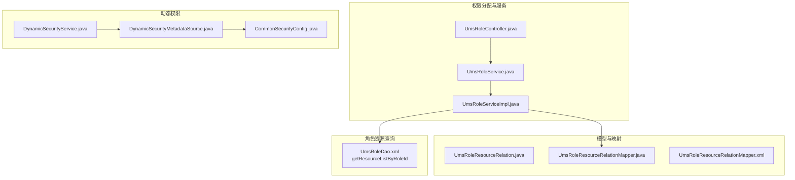
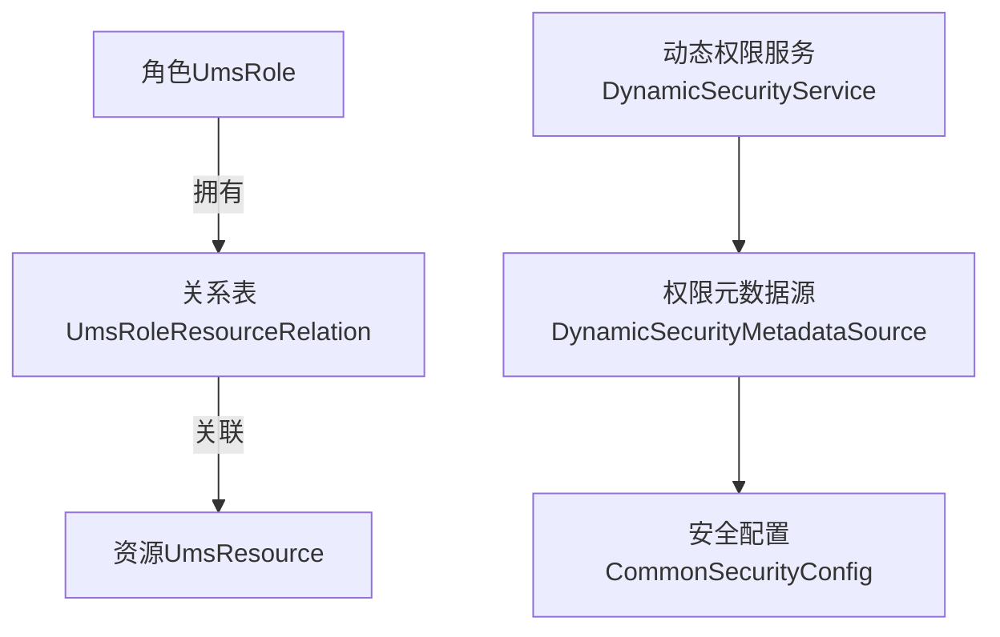
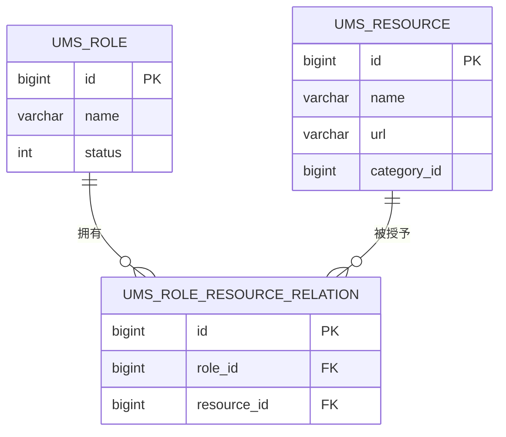
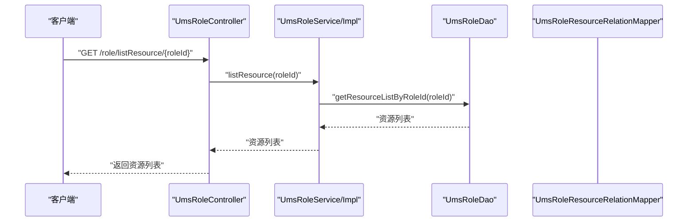
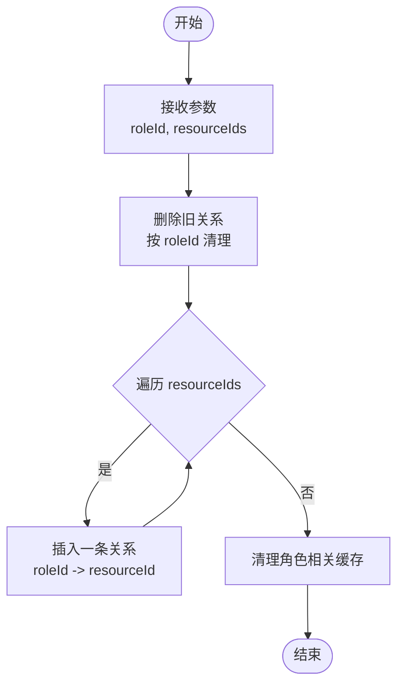
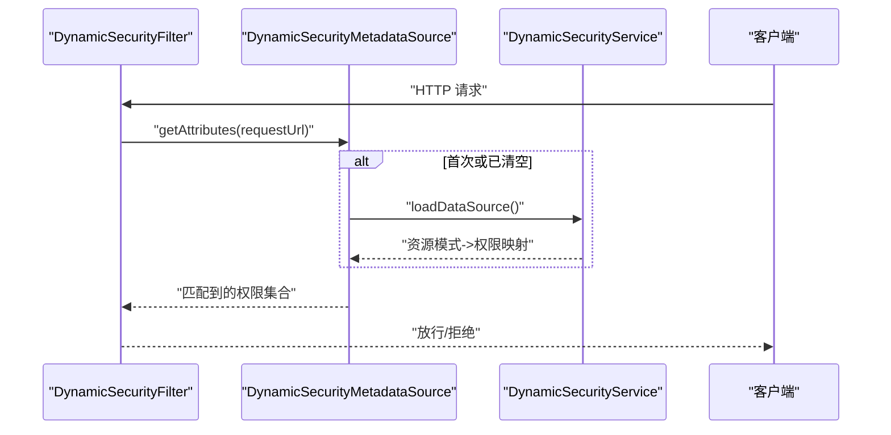
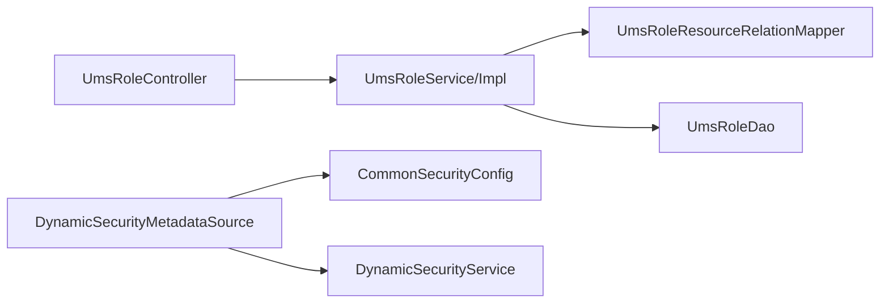

# 角色资源关系表 (UmsRoleResourceRelation)

<cite>
**本文引用的文件**
- [UmsRoleResourceRelation.java](file://mall-mbg/src/main/java/com/macro/mall/model/UmsRoleResourceRelation.java)
- [UmsRoleResourceRelationMapper.java](file://mall-mbg/src/main/java/com/macro/mall/mapper/UmsRoleResourceRelationMapper.java)
- [UmsRoleResourceRelationMapper.xml](file://mall-mbg/src/main/resources/com/macro/mall/mapper/UmsRoleResourceRelationMapper.xml)
- [UmsRoleDao.xml](file://mall-admin/src/main/resources/dao/UmsRoleDao.xml)
- [UmsRoleService.java](file://mall-admin/src/main/java/com/macro/mall/service/UmsRoleService.java)
- [UmsRoleServiceImpl.java](file://mall-admin/src/main/java/com/macro/mall/service/impl/UmsRoleServiceImpl.java)
- [UmsRoleController.java](file://mall-admin/src/main/java/com/macro/mall/controller/UmsRoleController.java)
- [DynamicSecurityMetadataSource.java](file://mall-security/src/main/java/com/macro/mall/security/component/DynamicSecurityMetadataSource.java)
- [DynamicSecurityService.java](file://mall-security/src/main/java/com/macro/mall/security/component/DynamicSecurityService.java)
- [CommonSecurityConfig.java](file://mall-security/src/main/java/com/macro/mall/security/config/CommonSecurityConfig.java)
- [mall.sql](file://document/sql/mall.sql)
</cite>

## 目录
1. [简介](#简介)
2. [项目结构](#项目结构)
3. [核心组件](#核心组件)
4. [架构总览](#架构总览)
5. [详细组件分析](#详细组件分析)
6. [依赖关系分析](#依赖关系分析)
7. [性能考量](#性能考量)
8. [故障排查指南](#故障排查指南)
9. [结论](#结论)

## 简介
本文件围绕“角色资源关系表（UmsRoleResourceRelation）”进行系统化技术文档编写，目标是帮助读者全面理解该表在权限体系中的作用、字段设计意图、与资源表的关联方式，以及从“角色到资源”的权限授予、批量授权、权限验证与缓存刷新、权限变更审计与追踪等关键流程。文档同时提供面向非专业读者的可读性说明，并辅以可视化图示帮助理解。

## 项目结构
UmsRoleResourceRelation 是权限模型中“角色-资源”多对多关系的桥接表，配合资源表（UmsResource）、角色表（UmsRole）及控制器/服务层共同完成权限的分配与校验。其核心位置如下：
- 模型与映射：位于 mall-mbg 模块，包含实体类、MyBatis Mapper 接口与 XML 映射。
- 角色资源查询：通过 UmsRoleDao 的 XML 查询角色所拥有的资源列表。
- 权限分配与批量授权：由 UmsRoleController 调用 UmsRoleService 实现，服务层使用 UmsRoleResourceRelationMapper 进行关系维护。
- 动态权限加载与验证：通过 mall-security 中的 DynamicSecurityService/Source 提供运行时权限规则加载与匹配。

图表来源
- [UmsRoleResourceRelation.java:1-51](file://mall-mbg/src/main/java/com/macro/mall/model/UmsRoleResourceRelation.java#L1-L51)
- [UmsRoleResourceRelationMapper.java:1-30](file://mall-mbg/src/main/java/com/macro/mall/mapper/UmsRoleResourceRelationMapper.java#L1-L30)
- [UmsRoleResourceRelationMapper.xml:1-179](file://mall-mbg/src/main/resources/com/macro/mall/mapper/UmsRoleResourceRelationMapper.xml#L1-L179)
- [UmsRoleDao.xml:47-63](file://mall-admin/src/main/resources/dao/UmsRoleDao.xml#L47-L63)
- [UmsRoleController.java:1-112](file://mall-admin/src/main/java/com/macro/mall/controller/UmsRoleController.java#L1-L112)
- [UmsRoleService.java:1-67](file://mall-admin/src/main/java/com/macro/mall/service/UmsRoleService.java#L1-L67)
- [UmsRoleServiceImpl.java:1-120](file://mall-admin/src/main/java/com/macro/mall/service/impl/UmsRoleServiceImpl.java#L1-L120)
- [DynamicSecurityService.java:1-17](file://mall-security/src/main/java/com/macro/mall/security/component/DynamicSecurityService.java#L1-L17)
- [DynamicSecurityMetadataSource.java:1-65](file://mall-security/src/main/java/com/macro/mall/security/component/DynamicSecurityMetadataSource.java#L1-L65)
- [CommonSecurityConfig.java:49-66](file://mall-security/src/main/java/com/macro/mall/security/config/CommonSecurityConfig.java#L49-L66)

章节来源
- [UmsRoleResourceRelation.java:1-51](file://mall-mbg/src/main/java/com/macro/mall/model/UmsRoleResourceRelation.java#L1-L51)
- [UmsRoleResourceRelationMapper.java:1-30](file://mall-mbg/src/main/java/com/macro/mall/mapper/UmsRoleResourceRelationMapper.java#L1-L30)
- [UmsRoleResourceRelationMapper.xml:1-179](file://mall-mbg/src/main/resources/com/macro/mall/mapper/UmsRoleResourceRelationMapper.xml#L1-L179)
- [UmsRoleDao.xml:47-63](file://mall-admin/src/main/resources/dao/UmsRoleDao.xml#L47-L63)
- [UmsRoleController.java:1-112](file://mall-admin/src/main/java/com/macro/mall/controller/UmsRoleController.java#L1-L112)
- [UmsRoleService.java:1-67](file://mall-admin/src/main/java/com/macro/mall/service/UmsRoleService.java#L1-L67)
- [UmsRoleServiceImpl.java:1-120](file://mall-admin/src/main/java/com/macro/mall/service/impl/UmsRoleServiceImpl.java#L1-L120)
- [DynamicSecurityService.java:1-17](file://mall-security/src/main/java/com/macro/mall/security/component/DynamicSecurityService.java#L1-L17)
- [DynamicSecurityMetadataSource.java:1-65](file://mall-security/src/main/java/com/macro/mall/security/component/DynamicSecurityMetadataSource.java#L1-L65)
- [CommonSecurityConfig.java:49-66](file://mall-security/src/main/java/com/macro/mall/security/config/CommonSecurityConfig.java#L49-L66)

## 核心组件
- 实体模型：UmsRoleResourceRelation 表示“角色-资源”关系，包含自增主键 id、角色标识 roleId、资源标识 resourceId。
- 数据访问：UmsRoleResourceRelationMapper 提供基于 MyBatis 的 CRUD 能力，支持按条件查询、计数、更新等。
- 角色资源查询：UmsRoleDao 的 SQL 将角色与资源通过关系表连接，按角色 ID 返回资源集合。
- 权限分配服务：UmsRoleServiceImpl 在分配资源时，先清理旧关系，再批量插入新关系，确保一致性。
- 动态权限加载：DynamicSecurityMetadataSource 基于 DynamicSecurityService 提供的资源-权限映射，在运行时加载与匹配。

章节来源
- [UmsRoleResourceRelation.java:1-51](file://mall-mbg/src/main/java/com/macro/mall/model/UmsRoleResourceRelation.java#L1-L51)
- [UmsRoleResourceRelationMapper.java:1-30](file://mall-mbg/src/main/java/com/macro/mall/mapper/UmsRoleResourceRelationMapper.java#L1-L30)
- [UmsRoleDao.xml:47-63](file://mall-admin/src/main/resources/dao/UmsRoleDao.xml#L47-L63)
- [UmsRoleServiceImpl.java:104-118](file://mall-admin/src/main/java/com/macro/mall/service/impl/UmsRoleServiceImpl.java#L104-L118)
- [DynamicSecurityMetadataSource.java:1-65](file://mall-security/src/main/java/com/macro/mall/security/component/DynamicSecurityMetadataSource.java#L1-L65)

## 架构总览
下图展示了“角色-资源-权限”在系统中的整体流转：角色通过关系表绑定资源，资源与权限通过动态权限规则建立映射，最终由过滤器在请求阶段进行校验。

图表来源
- [UmsRoleResourceRelation.java:1-51](file://mall-mbg/src/main/java/com/macro/mall/model/UmsRoleResourceRelation.java#L1-L51)
- [UmsRoleDao.xml:47-63](file://mall-admin/src/main/resources/dao/UmsRoleDao.xml#L47-L63)
- [DynamicSecurityService.java:1-17](file://mall-security/src/main/java/com/macro/mall/security/component/DynamicSecurityService.java#L1-L17)
- [DynamicSecurityMetadataSource.java:1-65](file://mall-security/src/main/java/com/macro/mall/security/component/DynamicSecurityMetadataSource.java#L1-L65)
- [CommonSecurityConfig.java:49-66](file://mall-security/src/main/java/com/macro/mall/security/config/CommonSecurityConfig.java#L49-L66)

## 详细组件分析

### 数据模型与字段说明
- 字段设计
  - id：自增主键，唯一标识一条“角色-资源”关系记录。
  - roleId：外键，指向角色表主键，表示该记录所属的角色。
  - resourceId：外键，指向资源表主键，表示该记录授予的资源。
- 设计目的
  - 通过关系表实现“角色-资源”的多对多映射，支持一个角色拥有多个资源、一个资源被多个角色共享。
  - 为后续扩展“资源-权限”映射提供基础，便于统一权限控制策略。

图表来源
- [mall.sql:3196-3205](file://document/sql/mall.sql#L3196-L3205)
- [UmsRoleResourceRelation.java:1-51](file://mall-mbg/src/main/java/com/macro/mall/model/UmsRoleResourceRelation.java#L1-L51)

章节来源
- [UmsRoleResourceRelation.java:1-51](file://mall-mbg/src/main/java/com/macro/mall/model/UmsRoleResourceRelation.java#L1-L51)
- [mall.sql:3196-3205](file://document/sql/mall.sql#L3196-L3205)

### 关系表的数据库结构与约束
- 表名：ums_role_resource_relation
- 主键：id
- 索引：默认仅主键索引；如需高频按角色或资源查询，建议在 role_id、resource_id 上建立单列或复合索引。
- 外键：模型层面未强制外键约束，实际应用中可通过业务保证 referential integrity。
- 存储引擎与字符集：InnoDB、utf8、通用校对规则，满足一般权限表需求。

章节来源
- [mall.sql:3196-3205](file://document/sql/mall.sql#L3196-L3205)

### 角色如何通过关系表获得资源访问权限
- 单角色资源查询
  - 通过 UmsRoleDao 的 SQL，将 ums_role_resource_relation 与 ums_resource 左连接，按角色 ID 返回资源列表。
  - 该查询用于“查看某角色已拥有哪些资源”，支撑前端资源树展示与权限预览。
- 权限层级
  - 资源维度：接口权限、按钮权限、页面权限等均以“资源”为最小粒度单元进行授权。
  - 资源-权限映射：资源与权限的关系由动态权限服务加载，匹配规则通常采用 ANT 匹配风格，结合角色-资源关系形成最终的“角色-权限”集合。

图表来源
- [UmsRoleController.java:90-95](file://mall-admin/src/main/java/com/macro/mall/controller/UmsRoleController.java#L90-L95)
- [UmsRoleService.java:50-54](file://mall-admin/src/main/java/com/macro/mall/service/UmsRoleService.java#L50-L54)
- [UmsRoleServiceImpl.java:82-85](file://mall-admin/src/main/java/com/macro/mall/service/impl/UmsRoleServiceImpl.java#L82-L85)
- [UmsRoleDao.xml:47-63](file://mall-admin/src/main/resources/dao/UmsRoleDao.xml#L47-L63)

章节来源
- [UmsRoleDao.xml:47-63](file://mall-admin/src/main/resources/dao/UmsRoleDao.xml#L47-L63)
- [UmsRoleService.java:50-54](file://mall-admin/src/main/java/com/macro/mall/service/UmsRoleService.java#L50-L54)
- [UmsRoleServiceImpl.java:82-85](file://mall-admin/src/main/java/com/macro/mall/service/impl/UmsRoleServiceImpl.java#L82-L85)
- [UmsRoleController.java:90-95](file://mall-admin/src/main/java/com/macro/mall/controller/UmsRoleController.java#L90-L95)

### 批量授权流程（角色-资源）
- 流程概览
  - 控制器接收角色 ID 与资源 ID 列表。
  - 服务层先删除该角色原有的所有关系，再逐条插入新的关系，确保“全量替换”。
  - 授权后触发缓存清理，避免脏数据导致的权限不一致。
- 关键点
  - 使用事务包裹删除与插入，保证原子性。
  - 清理与资源列表相关的缓存项，确保下次查询能命中最新权限。

图表来源
- [UmsRoleController.java:104-109](file://mall-admin/src/main/java/com/macro/mall/controller/UmsRoleController.java#L104-L109)
- [UmsRoleServiceImpl.java:104-118](file://mall-admin/src/main/java/com/macro/mall/service/impl/UmsRoleServiceImpl.java#L104-L118)
- [UmsRoleResourceRelationMapper.java:11-13](file://mall-mbg/src/main/java/com/macro/mall/mapper/UmsRoleResourceRelationMapper.java#L11-L13)

章节来源
- [UmsRoleController.java:104-109](file://mall-admin/src/main/java/com/macro/mall/controller/UmsRoleController.java#L104-L109)
- [UmsRoleServiceImpl.java:104-118](file://mall-admin/src/main/java/com/macro/mall/service/impl/UmsRoleServiceImpl.java#L104-L118)
- [UmsRoleResourceRelationMapper.java:11-13](file://mall-mbg/src/main/java/com/macro/mall/mapper/UmsRoleResourceRelationMapper.java#L11-L13)

### 权限验证执行流程（运行时）
- 动态权限加载
  - DynamicSecurityService 提供 loadDataSource，返回“资源路径模式 -> 权限集合”的映射。
  - DynamicSecurityMetadataSource 在首次访问或显式清空后重新加载映射，并提供 getAttributes(Object) 用于匹配当前请求路径。
- 过滤器集成
  - 在安全配置中注册 DynamicSecurityFilter 与 DynamicAccessDecisionManager，拦截请求并根据匹配到的权限集合进行决策。
- 请求匹配
  - 对每个请求，提取请求路径，使用 AntPathMatcher 进行模式匹配，收集所有匹配的权限，交由决策器判断放行与否。

图表来源
- [DynamicSecurityMetadataSource.java:24-52](file://mall-security/src/main/java/com/macro/mall/security/component/DynamicSecurityMetadataSource.java#L24-L52)
- [DynamicSecurityService.java:11-16](file://mall-security/src/main/java/com/macro/mall/security/component/DynamicSecurityService.java#L11-L16)
- [CommonSecurityConfig.java:49-66](file://mall-security/src/main/java/com/macro/mall/security/config/CommonSecurityConfig.java#L49-L66)

章节来源
- [DynamicSecurityMetadataSource.java:1-65](file://mall-security/src/main/java/com/macro/mall/security/component/DynamicSecurityMetadataSource.java#L1-L65)
- [DynamicSecurityService.java:1-17](file://mall-security/src/main/java/com/macro/mall/security/component/DynamicSecurityService.java#L1-L17)
- [CommonSecurityConfig.java:49-66](file://mall-security/src/main/java/com/macro/mall/security/config/CommonSecurityConfig.java#L49-L66)

### 权限继承链路与资源-权限映射
- 角色-资源
  - 通过 UmsRoleResourceRelation 将角色与资源建立直接关联。
- 资源-权限
  - 资源与权限的映射由 DynamicSecurityService 提供，通常以资源 URL 或标识为键，权限标识为值。
- 继承链路
  - 若存在“角色-角色”继承或“资源-资源”聚合，可在 DynamicSecurityService 的 loadDataSource 中进行组合与扩展；当前仓库未见此类表结构，因此默认为“角色-资源-权限”的三层映射。

章节来源
- [UmsRoleDao.xml:47-63](file://mall-admin/src/main/resources/dao/UmsRoleDao.xml#L47-L63)
- [DynamicSecurityService.java:11-16](file://mall-security/src/main/java/com/macro/mall/security/component/DynamicSecurityService.java#L11-L16)

### 权限变更的审计与追踪机制
- 缓存刷新
  - 在资源或角色发生变更时，调用动态权限元数据源的 clearDataSource，促使下次请求重新加载权限映射，避免“旧权限生效”问题。
- 变更入口
  - 资源更新/删除：UmsResourceController 调用 clearDataSource。
  - 资源授权：UmsRoleController.allocResource 调用 clearDataSource。
- 审计建议
  - 当前代码未内置数据库级审计日志；可在以下位置增加审计：
    - 资源/角色变更时记录操作日志（操作人、时间、变更前后对比）。
    - 在 DynamicSecurityService.loadDataSource 中记录映射加载事件，便于追踪权限规则变化。

章节来源
- [UmsResourceController.java:41-71](file://mall-admin/src/main/java/com/macro/mall/controller/UmsResourceController.java#L41-L71)
- [UmsRoleController.java:104-109](file://mall-admin/src/main/java/com/macro/mall/controller/UmsRoleController.java#L104-L109)
- [DynamicSecurityMetadataSource.java:29-32](file://mall-security/src/main/java/com/macro/mall/security/component/DynamicSecurityMetadataSource.java#L29-L32)

## 依赖关系分析
- 组件耦合
  - UmsRoleServiceImpl 依赖 UmsRoleResourceRelationMapper 与 UmsRoleDao，负责关系维护与资源查询。
  - UmsRoleController 作为入口，协调服务层与前端交互。
  - 动态权限模块与控制器/服务层解耦，通过接口注入实现运行时权限加载。
- 外部依赖
  - MyBatis 提供 ORM 能力，XML 映射承担复杂联表查询。
  - Spring Security 过滤器链负责权限决策。

图表来源
- [UmsRoleController.java:1-112](file://mall-admin/src/main/java/com/macro/mall/controller/UmsRoleController.java#L1-L112)
- [UmsRoleServiceImpl.java:1-120](file://mall-admin/src/main/java/com/macro/mall/service/impl/UmsRoleServiceImpl.java#L1-L120)
- [UmsRoleResourceRelationMapper.java:1-30](file://mall-mbg/src/main/java/com/macro/mall/mapper/UmsRoleResourceRelationMapper.java#L1-L30)
- [UmsRoleDao.xml:1-64](file://mall-admin/src/main/resources/dao/UmsRoleDao.xml#L1-L64)
- [DynamicSecurityMetadataSource.java:1-65](file://mall-security/src/main/java/com/macro/mall/security/component/DynamicSecurityMetadataSource.java#L1-L65)
- [CommonSecurityConfig.java:49-66](file://mall-security/src/main/java/com/macro/mall/security/config/CommonSecurityConfig.java#L49-L66)

章节来源
- [UmsRoleController.java:1-112](file://mall-admin/src/main/java/com/macro/mall/controller/UmsRoleController.java#L1-L112)
- [UmsRoleServiceImpl.java:1-120](file://mall-admin/src/main/java/com/macro/mall/service/impl/UmsRoleServiceImpl.java#L1-L120)
- [UmsRoleResourceRelationMapper.java:1-30](file://mall-mbg/src/main/java/com/macro/mall/mapper/UmsRoleResourceRelationMapper.java#L1-L30)
- [UmsRoleDao.xml:1-64](file://mall-admin/src/main/resources/dao/UmsRoleDao.xml#L1-L64)
- [DynamicSecurityMetadataSource.java:1-65](file://mall-security/src/main/java/com/macro/mall/security/component/DynamicSecurityMetadataSource.java#L1-L65)
- [CommonSecurityConfig.java:49-66](file://mall-security/src/main/java/com/macro/mall/security/config/CommonSecurityConfig.java#L49-L66)

## 性能考量
- 查询优化
  - 角色资源查询使用 LEFT JOIN，建议在 role_id、resource_id 上建立索引，减少排序与分组成本。
- 写入优化
  - 批量授权采用“清空+重插”，适合中低频变更场景；若资源规模较大，可考虑差异计算与增量写入，降低锁竞争。
- 缓存策略
  - 授权后清理相关缓存，避免陈旧权限；可结合分布式缓存与过期策略提升命中率。
- 动态权限加载
  - loadDataSource 应尽量轻量化，必要时引入本地缓存与热更新机制，避免每次请求都全量扫描。

## 故障排查指南
- 现象：授权后权限未生效
  - 检查是否调用了 clearDataSource 或相关缓存清理逻辑。
  - 确认动态权限规则是否正确加载（loadDataSource 返回的映射是否包含目标资源路径）。
- 现象：资源更新后权限异常
  - 确认资源更新/删除接口是否调用了 clearDataSource。
  - 检查资源 URL 是否与动态权限规则匹配（Ant 匹配）。
- 现象：批量授权后出现重复或遗漏
  - 确认服务层是否先删除旧关系再插入新关系。
  - 检查传入的资源 ID 列表是否为空或重复。

章节来源
- [UmsResourceController.java:41-71](file://mall-admin/src/main/java/com/macro/mall/controller/UmsResourceController.java#L41-L71)
- [UmsRoleController.java:104-109](file://mall-admin/src/main/java/com/macro/mall/controller/UmsRoleController.java#L104-L109)
- [UmsRoleServiceImpl.java:104-118](file://mall-admin/src/main/java/com/macro/mall/service/impl/UmsRoleServiceImpl.java#L104-L118)
- [DynamicSecurityMetadataSource.java:29-32](file://mall-security/src/main/java/com/macro/mall/security/component/DynamicSecurityMetadataSource.java#L29-L32)

## 结论
UmsRoleResourceRelation 作为“角色-资源”的核心关系表，为权限体系提供了清晰的多对多映射基础。结合 UmsRoleDao 的资源查询、UmsRoleServiceImpl 的批量授权与缓存清理、以及 mall-security 的动态权限加载与过滤器链，实现了从“角色到资源再到权限”的完整闭环。建议在生产环境中完善审计与监控，持续优化索引与缓存策略，确保权限系统的稳定性与高性能。