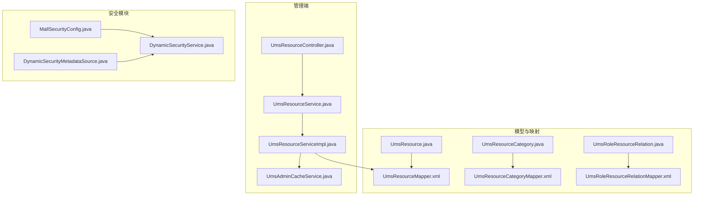
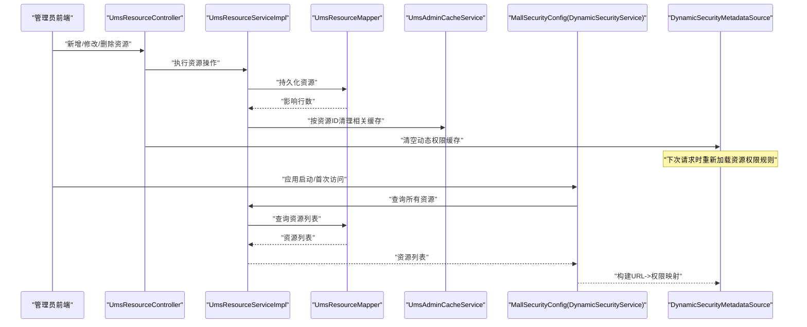
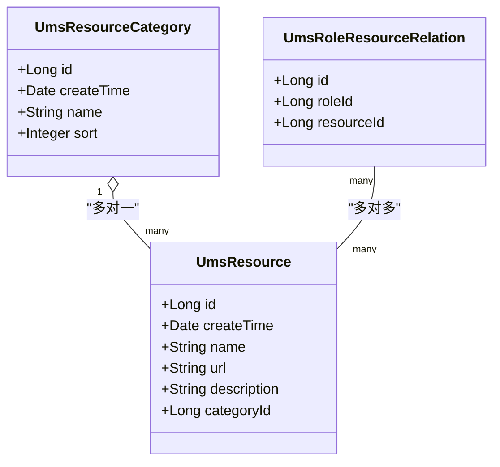
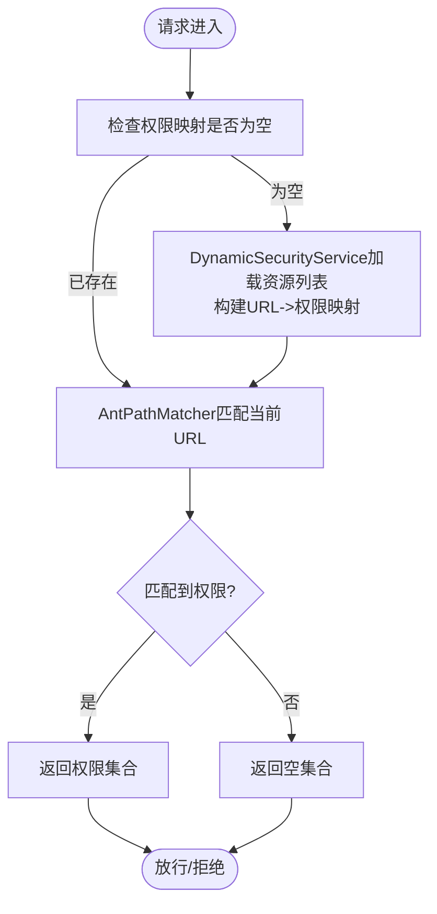
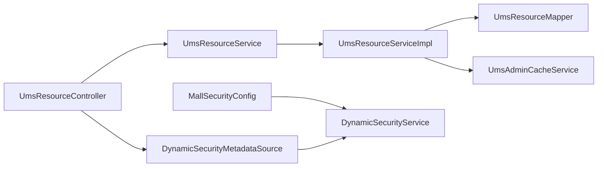

# 资源表 (UmsResource)

<cite>
**本文引用的文件**
- [UmsResource.java](file://mall-mbg/src/main/java/com/macro/mall/model/UmsResource.java)
- [UmsResourceMapper.xml](file://mall-mbg/src/main/resources/com/macro/mall/mapper/UmsResourceMapper.xml)
- [UmsResourceController.java](file://mall-admin/src/main/java/com/macro/mall/controller/UmsResourceController.java)
- [UmsResourceService.java](file://mall-admin/src/main/java/com/macro/mall/service/UmsResourceService.java)
- [UmsResourceServiceImpl.java](file://mall-admin/src/main/java/com/macro/mall/service/impl/UmsResourceServiceImpl.java)
- [UmsAdminCacheService.java](file://mall-admin/src/main/java/com/macro/mall/service/UmsAdminCacheService.java)
- [MallSecurityConfig.java](file://mall-admin/src/main/java/com/macro/mall/config/MallSecurityConfig.java)
- [DynamicSecurityMetadataSource.java](file://mall-security/src/main/java/com/macro/mall/security/component/DynamicSecurityMetadataSource.java)
- [DynamicSecurityService.java](file://mall-security/src/main/java/com/macro/mall/security/component/DynamicSecurityService.java)
- [UmsResourceCategory.java](file://mall-mbg/src/main/java/com/macro/mall/model/UmsResourceCategory.java)
- [UmsResourceCategoryMapper.xml](file://mall-mbg/src/main/resources/com/macro/mall/mapper/UmsResourceCategoryMapper.xml)
- [UmsRoleResourceRelation.java](file://mall-mbg/src/main/java/com/macro/mall/model/UmsRoleResourceRelation.java)
- [UmsRoleResourceRelationMapper.xml](file://mall-mbg/src/main/resources/com/macro/mall/mapper/UmsRoleResourceRelationMapper.xml)
- [mall.sql](file://document/sql/mall.sql)
</cite>

## 目录
1. [简介](#简介)
2. [项目结构](#项目结构)
3. [核心组件](#核心组件)
4. [架构总览](#架构总览)
5. [详细组件分析](#详细组件分析)
6. [依赖分析](#依赖分析)
7. [性能考虑](#性能考虑)
8. [故障排查指南](#故障排查指南)
9. [结论](#结论)
10. [附录](#附录)

## 简介
本文件围绕资源表 UmsResource 的设计与实现进行系统化说明，重点覆盖以下方面：
- 字段设计与语义：资源标识、资源路径、描述信息、所属分类等。
- 资源分类体系：资源分类与资源的多对一关系。
- 权限映射关系：资源与角色之间的多对多映射（通过中间表 UmsRoleResourceRelation）。
- 细粒度权限控制：基于资源路径的动态权限加载与匹配，支持接口级、按钮级、页面级的访问控制。
- 动态加载与缓存：资源权限规则的动态加载、缓存与失效策略。

## 项目结构
与资源表相关的代码主要分布在如下模块与文件中：
- 数据模型与映射：UmsResource 及其 MyBatis 映射文件
- 控制层与服务层：资源增删改查接口与服务实现
- 安全配置与动态权限：动态权限元数据源、动态权限服务、安全配置
- 缓存与失效：管理员资源列表缓存与资源变更后的清理
- 关联实体：资源分类、角色-资源关系

**图表来源**
- [UmsResource.java:1-85](file://mall-mbg/src/main/java/com/macro/mall/model/UmsResource.java#L1-L85)
- [UmsResourceMapper.xml:1-226](file://mall-mbg/src/main/resources/com/macro/mall/mapper/UmsResourceMapper.xml#L1-L226)
- [UmsResourceController.java:1-91](file://mall-admin/src/main/java/com/macro/mall/controller/UmsResourceController.java#L1-L91)
- [UmsResourceService.java:1-42](file://mall-admin/src/main/java/com/macro/mall/service/UmsResourceService.java#L1-L42)
- [UmsResourceServiceImpl.java:1-74](file://mall-admin/src/main/java/com/macro/mall/service/impl/UmsResourceServiceImpl.java#L1-L74)
- [UmsAdminCacheService.java:1-58](file://mall-admin/src/main/java/com/macro/mall/service/UmsAdminCacheService.java#L1-L58)
- [MallSecurityConfig.java:1-49](file://mall-admin/src/main/java/com/macro/mall/config/MallSecurityConfig.java#L1-L49)
- [DynamicSecurityMetadataSource.java:1-65](file://mall-security/src/main/java/com/macro/mall/security/component/DynamicSecurityMetadataSource.java#L1-L65)
- [DynamicSecurityService.java:1-17](file://mall-security/src/main/java/com/macro/mall/security/component/DynamicSecurityService.java#L1-L17)

**章节来源**
- [UmsResource.java:1-85](file://mall-mbg/src/main/java/com/macro/mall/model/UmsResource.java#L1-L85)
- [UmsResourceMapper.xml:1-226](file://mall-mbg/src/main/resources/com/macro/mall/mapper/UmsResourceMapper.xml#L1-L226)
- [UmsResourceController.java:1-91](file://mall-admin/src/main/java/com/macro/mall/controller/UmsResourceController.java#L1-L91)
- [UmsResourceService.java:1-42](file://mall-admin/src/main/java/com/macro/mall/service/UmsResourceService.java#L1-L42)
- [UmsResourceServiceImpl.java:1-74](file://mall-admin/src/main/java/com/macro/mall/service/impl/UmsResourceServiceImpl.java#L1-L74)
- [UmsAdminCacheService.java:1-58](file://mall-admin/src/main/java/com/macro/mall/service/UmsAdminCacheService.java#L1-L58)
- [MallSecurityConfig.java:1-49](file://mall-admin/src/main/java/com/macro/mall/config/MallSecurityConfig.java#L1-L49)
- [DynamicSecurityMetadataSource.java:1-65](file://mall-security/src/main/java/com/macro/mall/security/component/DynamicSecurityMetadataSource.java#L1-L65)
- [DynamicSecurityService.java:1-17](file://mall-security/src/main/java/com/macro/mall/security/component/DynamicSecurityService.java#L1-L17)

## 核心组件
- UmsResource：资源实体，包含资源标识、创建时间、名称、URL、描述、分类 ID 等字段。
- UmsResourceMapper.xml：提供资源的增删改查、分页查询、条件查询等 SQL 映射。
- UmsResourceController：提供资源的创建、更新、删除、查询详情、分页列表、全量列表等接口。
- UmsResourceService / UmsResourceServiceImpl：封装资源的业务逻辑，负责持久化与缓存清理。
- UmsAdminCacheService：提供管理员资源列表缓存的读写与失效能力。
- MallSecurityConfig：定义动态权限服务，将资源 URL 与资源标识/名称映射为权限规则。
- DynamicSecurityMetadataSource：在运行期加载并维护资源权限规则映射，并支持清空缓存。
- UmsResourceCategory / UmsRoleResourceRelation：资源分类与角色-资源关系，支撑资源分类与权限映射。

**章节来源**
- [UmsResource.java:1-85](file://mall-mbg/src/main/java/com/macro/mall/model/UmsResource.java#L1-L85)
- [UmsResourceMapper.xml:1-226](file://mall-mbg/src/main/resources/com/macro/mall/mapper/UmsResourceMapper.xml#L1-L226)
- [UmsResourceController.java:1-91](file://mall-admin/src/main/java/com/macro/mall/controller/UmsResourceController.java#L1-L91)
- [UmsResourceService.java:1-42](file://mall-admin/src/main/java/com/macro/mall/service/UmsResourceService.java#L1-L42)
- [UmsResourceServiceImpl.java:1-74](file://mall-admin/src/main/java/com/macro/mall/service/impl/UmsResourceServiceImpl.java#L1-L74)
- [UmsAdminCacheService.java:1-58](file://mall-admin/src/main/java/com/macro/mall/service/UmsAdminCacheService.java#L1-L58)
- [MallSecurityConfig.java:1-49](file://mall-admin/src/main/java/com/macro/mall/config/MallSecurityConfig.java#L1-L49)
- [DynamicSecurityMetadataSource.java:1-65](file://mall-security/src/main/java/com/macro/mall/security/component/DynamicSecurityMetadataSource.java#L1-L65)
- [UmsResourceCategory.java:1-63](file://mall-mbg/src/main/java/com/macro/mall/model/UmsResourceCategory.java#L1-L63)
- [UmsRoleResourceRelation.java:1-51](file://mall-mbg/src/main/java/com/macro/mall/model/UmsRoleResourceRelation.java#L1-L51)

## 架构总览
下图展示了资源权限从“资源定义”到“运行期鉴权”的整体流程，包括资源 CRUD、动态权限加载、缓存与失效、以及权限匹配过程。

**图表来源**
- [UmsResourceController.java:29-71](file://mall-admin/src/main/java/com/macro/mall/controller/UmsResourceController.java#L29-L71)
- [UmsResourceServiceImpl.java:27-50](file://mall-admin/src/main/java/com/macro/mall/service/impl/UmsResourceServiceImpl.java#L27-L50)
- [UmsResourceMapper.xml:103-151](file://mall-mbg/src/main/resources/com/macro/mall/mapper/UmsResourceMapper.xml#L103-L151)
- [UmsAdminCacheService.java:34-36](file://mall-admin/src/main/java/com/macro/mall/service/UmsAdminCacheService.java#L34-L36)
- [MallSecurityConfig.java:36-48](file://mall-admin/src/main/java/com/macro/mall/config/MallSecurityConfig.java#L36-L48)
- [DynamicSecurityMetadataSource.java:24-32](file://mall-security/src/main/java/com/macro/mall/security/component/DynamicSecurityMetadataSource.java#L24-L32)

## 详细组件分析

### 数据模型与字段设计
- 实体字段
  - id：资源唯一标识
  - createTime：资源创建时间
  - name：资源名称
  - url：资源路径（用于动态权限匹配）
  - description：资源描述
  - categoryId：资源分类 ID（与资源分类表关联）

- 字段语义与约束
  - url 是动态权限匹配的关键字段，应具备唯一性与可匹配性（如使用 ANT 风格通配符）。
  - categoryId 支持资源分类，便于资源目录化管理与筛选。
  - createTime 用于审计与排序。

- 复杂度分析
  - 基于 url 的权限匹配采用前缀/通配符匹配，典型复杂度为 O(n) 遍历匹配集合，n 为资源总数。
  - 分页查询基于 PageHelper，时间复杂度受分页大小与数据库索引影响。

**章节来源**
- [UmsResource.java:6-19](file://mall-mbg/src/main/java/com/macro/mall/model/UmsResource.java#L6-L19)
- [UmsResourceMapper.xml:4-11](file://mall-mbg/src/main/resources/com/macro/mall/mapper/UmsResourceMapper.xml#L4-L11)
- [UmsResourceServiceImpl.java:53-66](file://mall-admin/src/main/java/com/macro/mall/service/impl/UmsResourceServiceImpl.java#L53-L66)

### 资源分类体系
- UmsResourceCategory 提供资源分类的增删改查能力，包含 name、sort 等字段。
- UmsResource 与 UmsResourceCategory 为多对一关系，通过 categoryId 关联。
- 作用：对资源进行分类管理，便于权限治理与界面展示。

**章节来源**
- [UmsResourceCategory.java:6-15](file://mall-mbg/src/main/java/com/macro/mall/model/UmsResourceCategory.java#L6-L15)
- [UmsResourceCategoryMapper.xml:4-9](file://mall-mbg/src/main/resources/com/macro/mall/mapper/UmsResourceCategoryMapper.xml#L4-L9)
- [UmsResource.java:17-17](file://mall-mbg/src/main/java/com/macro/mall/model/UmsResource.java#L17-L17)

### 权限映射关系
- 角色-资源关系由 UmsRoleResourceRelation 维护，形成角色与资源的多对多映射。
- 运行期权限匹配通过 DynamicSecurityMetadataSource 与 DynamicSecurityService 协作完成：
  - DynamicSecurityService 将资源列表转换为 URL 到权限属性的映射。
  - DynamicSecurityMetadataSource 在每次请求时根据当前访问路径匹配所需权限。

**图表来源**
- [UmsResource.java:6-19](file://mall-mbg/src/main/java/com/macro/mall/model/UmsResource.java#L6-L19)
- [UmsResourceCategory.java:6-15](file://mall-mbg/src/main/java/com/macro/mall/model/UmsResourceCategory.java#L6-L15)
- [UmsRoleResourceRelation.java:5-12](file://mall-mbg/src/main/java/com/macro/mall/model/UmsRoleResourceRelation.java#L5-L12)

**章节来源**
- [UmsRoleResourceRelation.java:5-12](file://mall-mbg/src/main/java/com/macro/mall/model/UmsRoleResourceRelation.java#L5-L12)
- [UmsRoleResourceRelationMapper.xml:4-8](file://mall-mbg/src/main/resources/com/macro/mall/mapper/UmsRoleResourceRelationMapper.xml#L4-L8)
- [MallSecurityConfig.java:36-48](file://mall-admin/src/main/java/com/macro/mall/config/MallSecurityConfig.java#L36-L48)

### 动态权限加载与缓存
- 动态权限加载
  - MallSecurityConfig 中定义的 DynamicSecurityService 实现会拉取所有资源，将每个资源的 url 映射为权限属性（包含资源 id 与 name）。
  - DynamicSecurityMetadataSource 在每次请求时加载该映射，并使用 AntPathMatcher 对当前请求路径进行匹配，返回所需权限集合。

- 缓存与失效
  - 当资源被新增、修改或删除后，控制器会调用 DynamicSecurityMetadataSource.clearDataSource 清空缓存。
  - 同时，UmsResourceServiceImpl 在更新/删除资源后，调用 UmsAdminCacheService.delResourceListByResource 清理与该资源相关的管理员资源列表缓存。

**图表来源**
- [DynamicSecurityMetadataSource.java:24-52](file://mall-security/src/main/java/com/macro/mall/security/component/DynamicSecurityMetadataSource.java#L24-L52)
- [MallSecurityConfig.java:36-48](file://mall-admin/src/main/java/com/macro/mall/config/MallSecurityConfig.java#L36-L48)

**章节来源**
- [UmsResourceController.java:33-33](file://mall-admin/src/main/java/com/macro/mall/controller/UmsResourceController.java#L33-L33)
- [UmsResourceController.java:46-46](file://mall-admin/src/main/java/com/macro/mall/controller/UmsResourceController.java#L46-L46)
- [UmsResourceController.java:65-65](file://mall-admin/src/main/java/com/macro/mall/controller/UmsResourceController.java#L65-L65)
- [UmsResourceServiceImpl.java:36-36](file://mall-admin/src/main/java/com/macro/mall/service/impl/UmsResourceServiceImpl.java#L36-L36)
- [UmsResourceServiceImpl.java:48-48](file://mall-admin/src/main/java/com/macro/mall/service/impl/UmsResourceServiceImpl.java#L48-L48)
- [UmsAdminCacheService.java:34-36](file://mall-admin/src/main/java/com/macro/mall/service/UmsAdminCacheService.java#L34-L36)

### 接口与服务层
- 控制器提供资源的增删改查与分页查询接口，调用服务层执行业务逻辑，并在资源变更后触发动态权限缓存清理。
- 服务层实现：
  - 创建：设置创建时间并插入资源。
  - 更新/删除：更新或删除资源，并清理相关管理员缓存。
  - 查询：支持按分类、名称关键字、URL 关键字分页查询，以及全量查询。

**章节来源**
- [UmsResourceController.java:29-89](file://mall-admin/src/main/java/com/macro/mall/controller/UmsResourceController.java#L29-L89)
- [UmsResourceService.java:11-41](file://mall-admin/src/main/java/com/macro/mall/service/UmsResourceService.java#L11-L41)
- [UmsResourceServiceImpl.java:27-72](file://mall-admin/src/main/java/com/macro/mall/service/impl/UmsResourceServiceImpl.java#L27-L72)

### 资源类型分类与权限控制层次
- 资源类型分类
  - 通过 categoryId 与 UmsResourceCategory 关联，支持对资源进行分类管理。
- 权限控制层次
  - 接口级别：以 url 作为权限标识，精确到具体接口。
  - 按钮级别：可通过扩展资源粒度（如为按钮单独配置资源）实现按钮级权限。
  - 页面级别：通过页面内包含的接口资源聚合实现页面级访问控制。

说明：上述层次控制在本仓库中通过资源 URL 与权限映射实现，按钮与页面级别的细化可通过在资源表中增加更细粒度的资源项来扩展。

**章节来源**
- [UmsResource.java:17-17](file://mall-mbg/src/main/java/com/macro/mall/model/UmsResource.java#L17-L17)
- [UmsResourceCategory.java:6-15](file://mall-mbg/src/main/java/com/macro/mall/model/UmsResourceCategory.java#L6-L15)
- [MallSecurityConfig.java:36-48](file://mall-admin/src/main/java/com/macro/mall/config/MallSecurityConfig.java#L36-L48)

## 依赖分析
- 控制器依赖服务接口与动态权限元数据源。
- 服务实现依赖资源 Mapper 与管理员缓存服务。
- 安全配置依赖资源服务以加载资源列表。
- 动态权限元数据源依赖动态权限服务以构建权限映射。

**图表来源**
- [UmsResourceController.java:24-27](file://mall-admin/src/main/java/com/macro/mall/controller/UmsResourceController.java#L24-L27)
- [UmsResourceServiceImpl.java:22-25](file://mall-admin/src/main/java/com/macro/mall/service/impl/UmsResourceServiceImpl.java#L22-L25)
- [MallSecurityConfig.java:36-48](file://mall-admin/src/main/java/com/macro/mall/config/MallSecurityConfig.java#L36-L48)
- [DynamicSecurityMetadataSource.java:21-22](file://mall-security/src/main/java/com/macro/mall/security/component/DynamicSecurityMetadataSource.java#L21-L22)

**章节来源**
- [UmsResourceController.java:24-27](file://mall-admin/src/main/java/com/macro/mall/controller/UmsResourceController.java#L24-L27)
- [UmsResourceServiceImpl.java:22-25](file://mall-admin/src/main/java/com/macro/mall/service/impl/UmsResourceServiceImpl.java#L22-L25)
- [MallSecurityConfig.java:36-48](file://mall-admin/src/main/java/com/macro/mall/config/MallSecurityConfig.java#L36-L48)
- [DynamicSecurityMetadataSource.java:21-22](file://mall-security/src/main/java/com/macro/mall/security/component/DynamicSecurityMetadataSource.java#L21-L22)

## 性能考虑
- 动态权限加载
  - 资源权限映射在首次访问或缓存清空后重建，建议资源总量适中或配合缓存策略减少频繁重建。
- 匹配算法
  - 使用 AntPathMatcher 进行通配符匹配，匹配复杂度与资源数量线性相关，建议对高频访问路径进行优化（如预过滤、索引）。
- 分页查询
  - 使用 PageHelper 进行分页，注意数据库层面的索引设计（如对 name、url、categoryId 建立合适索引）以提升查询性能。
- 缓存清理
  - 资源变更后清理管理员资源列表缓存，避免脏读；建议在批量变更场景合并清理次数。

[本节为通用性能建议，无需特定文件来源]

## 故障排查指南
- 动态权限不生效
  - 检查资源 URL 是否正确配置且与请求路径匹配。
  - 确认资源变更后是否调用了清空动态权限缓存的方法。
- 权限匹配异常
  - 检查 DynamicSecurityMetadataSource 的缓存是否被清空，确认映射是否重新加载。
- 资源查询结果异常
  - 检查分页参数与条件查询参数是否正确传入。
- 缓存一致性问题
  - 确认资源变更后是否调用了按资源 ID 清理管理员资源列表缓存的方法。

**章节来源**
- [UmsResourceController.java:33-33](file://mall-admin/src/main/java/com/macro/mall/controller/UmsResourceController.java#L33-L33)
- [UmsResourceController.java:46-46](file://mall-admin/src/main/java/com/macro/mall/controller/UmsResourceController.java#L46-L46)
- [UmsResourceController.java:65-65](file://mall-admin/src/main/java/com/macro/mall/controller/UmsResourceController.java#L65-L65)
- [UmsResourceServiceImpl.java:36-36](file://mall-admin/src/main/java/com/macro/mall/service/impl/UmsResourceServiceImpl.java#L36-L36)
- [UmsResourceServiceImpl.java:48-48](file://mall-admin/src/main/java/com/macro/mall/service/impl/UmsResourceServiceImpl.java#L48-L48)
- [DynamicSecurityMetadataSource.java:29-32](file://mall-security/src/main/java/com/macro/mall/security/component/DynamicSecurityMetadataSource.java#L29-L32)

## 结论
UmsResource 表通过简洁而明确的字段设计，结合资源分类与角色-资源关系映射，实现了面向接口、按钮、页面的多层级权限控制。配合动态权限加载与缓存机制，系统能够在资源变更后及时刷新权限规则，保证权限控制的准确性与一致性。建议在实际部署中关注资源 URL 的规范性、数据库索引与分页查询的性能优化，以及缓存清理策略的合理性。

[本节为总结性内容，无需特定文件来源]

## 附录
- 数据库脚本位置：document/sql/mall.sql
- 关键实体与映射文件：
  - UmsResource 与 UmsResourceMapper.xml
  - UmsResourceCategory 与 UmsResourceCategoryMapper.xml
  - UmsRoleResourceRelation 与 UmsRoleResourceRelationMapper.xml

**章节来源**
- [mall.sql:1-200](file://document/sql/mall.sql#L1-L200)