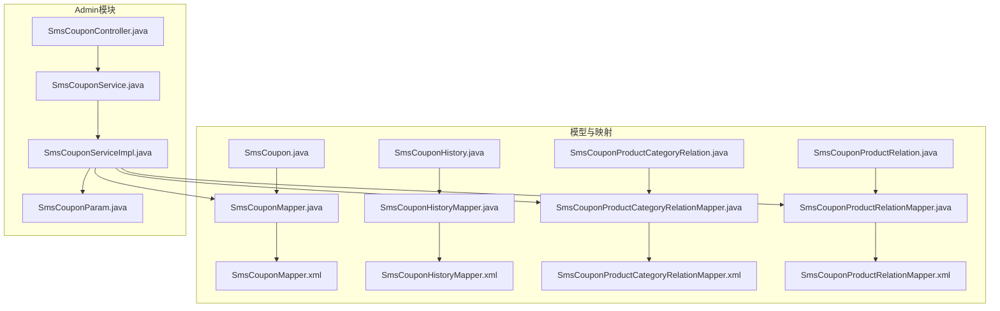
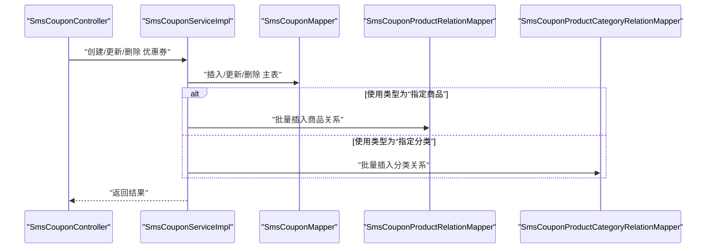
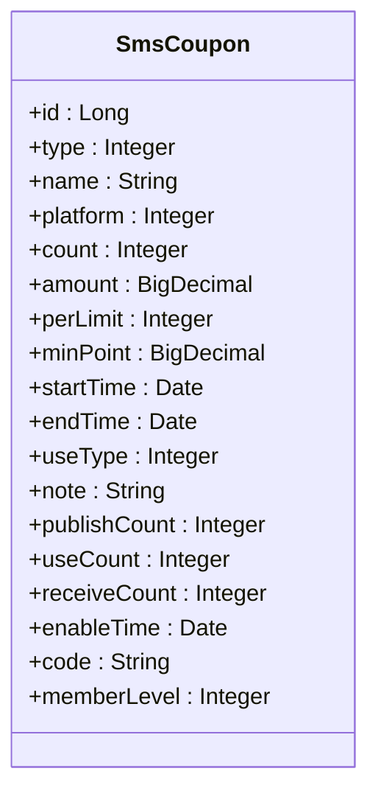
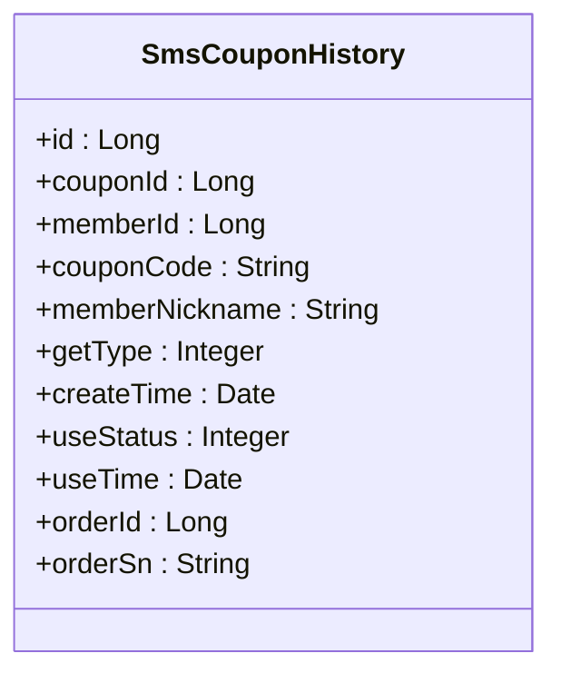
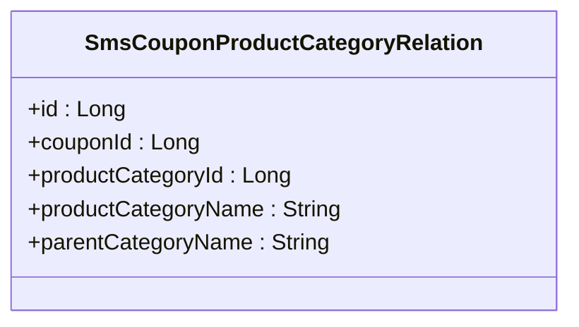
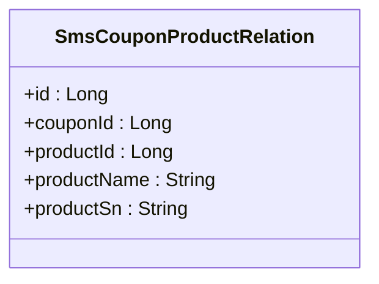
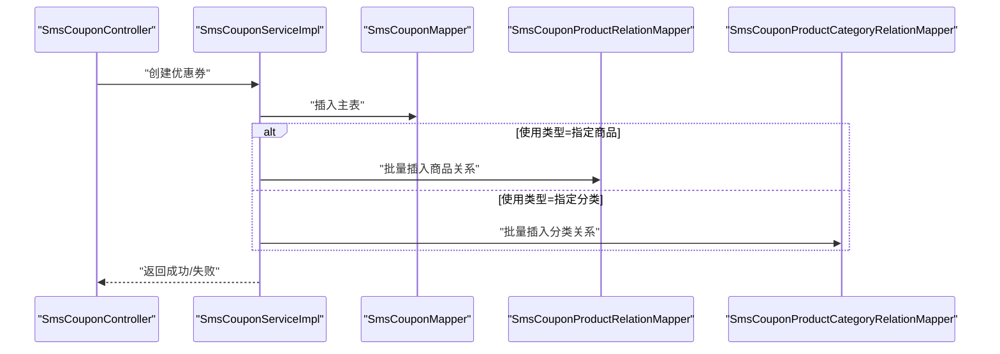
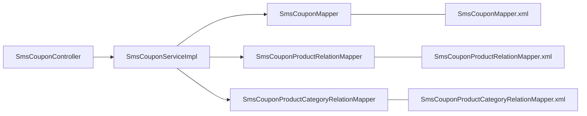

# 优惠券相关表

<cite>
**本文引用的文件**
- [SmsCoupon.java](file://mall-mbg/src/main/java/com/macro/mall/model/SmsCoupon.java)
- [SmsCouponHistory.java](file://mall-mbg/src/main/java/com/macro/mall/model/SmsCouponHistory.java)
- [SmsCouponProductCategoryRelation.java](file://mall-mbg/src/main/java/com/macro/mall/model/SmsCouponProductCategoryRelation.java)
- [SmsCouponProductRelation.java](file://mall-mbg/src/main/java/com/macro/mall/model/SmsCouponProductRelation.java)
- [SmsCouponMapper.java](file://mall-mbg/src/main/java/com/macro/mall/mapper/SmsCouponMapper.java)
- [SmsCouponHistoryMapper.java](file://mall-mbg/src/main/java/com/macro/mall/mapper/SmsCouponHistoryMapper.java)
- [SmsCouponProductCategoryRelationMapper.java](file://mall-mbg/src/main/java/com/macro/mall/mapper/SmsCouponProductCategoryRelationMapper.java)
- [SmsCouponProductRelationMapper.java](file://mall-mbg/src/main/java/com/macro/mall/mapper/SmsCouponProductRelationMapper.java)
- [SmsCouponMapper.xml](file://mall-mbg/src/main/resources/com/macro/mall/mapper/SmsCouponMapper.xml)
- [SmsCouponHistoryMapper.xml](file://mall-mbg/src/main/resources/com/macro/mall/mapper/SmsCouponHistoryMapper.xml)
- [SmsCouponProductCategoryRelationMapper.xml](file://mall-mbg/src/main/resources/com/macro/mall/mapper/SmsCouponProductCategoryRelationMapper.xml)
- [SmsCouponProductRelationMapper.xml](file://mall-mbg/src/main/resources/com/macro/mall/mapper/SmsCouponProductRelationMapper.xml)
- [SmsCouponParam.java](file://mall-admin/src/main/java/com/macro/mall/dto/SmsCouponParam.java)
- [SmsCouponController.java](file://mall-admin/src/main/java/com/macro/mall/controller/SmsCouponController.java)
- [SmsCouponService.java](file://mall-admin/src/main/java/com/macro/mall/service/SmsCouponService.java)
- [SmsCouponServiceImpl.java](file://mall-admin/src/main/java/com/macro/mall/service/impl/SmsCouponServiceImpl.java)
</cite>

## 目录
1. [简介](#简介)
2. [项目结构](#项目结构)
3. [核心组件](#核心组件)
4. [架构总览](#架构总览)
5. [详细组件分析](#详细组件分析)
6. [依赖分析](#依赖分析)
7. [性能考虑](#性能考虑)
8. [故障排查指南](#故障排查指南)
9. [结论](#结论)

## 简介
本文件系统化梳理“优惠券相关表”的数据模型与业务实现，覆盖以下主题：
- 优惠券主表（SmsCoupon）字段设计与业务含义
- 优惠券使用历史表（SmsCouponHistory）记录机制与状态流转
- 优惠券与商品分类关系表（SmsCouponProductCategoryRelation）
- 优惠券与商品关系表（SmsCouponProductRelation）
- 发放策略、使用规则与防刷机制的实现要点
- 前端控制层、服务层与持久层的协作流程

## 项目结构
优惠券相关表位于通用模型与持久层目录中，并通过Admin模块的控制器与服务层进行对外暴露与业务编排。

**图表来源**
- [SmsCoupon.java:1-218](file://mall-mbg/src/main/java/com/macro/mall/model/SmsCoupon.java#L1-L218)
- [SmsCouponHistory.java:1-140](file://mall-mbg/src/main/java/com/macro/mall/model/SmsCouponHistory.java#L1-L140)
- [SmsCouponProductCategoryRelation.java:1-73](file://mall-mbg/src/main/java/com/macro/mall/model/SmsCouponProductCategoryRelation.java#L1-L73)
- [SmsCouponProductRelation.java:1-73](file://mall-mbg/src/main/java/com/macro/mall/model/SmsCouponProductRelation.java#L1-L73)
- [SmsCouponMapper.java:1-30](file://mall-mbg/src/main/java/com/macro/mall/mapper/SmsCouponMapper.java#L1-L30)
- [SmsCouponHistoryMapper.java:1-30](file://mall-mbg/src/main/java/com/macro/mall/mapper/SmsCouponHistoryMapper.java#L1-L30)
- [SmsCouponProductCategoryRelationMapper.java:1-30](file://mall-mbg/src/main/java/com/macro/mall/mapper/SmsCouponProductCategoryRelationMapper.java#L1-L30)
- [SmsCouponProductRelationMapper.java:1-30](file://mall-mbg/src/main/java/com/macro/mall/mapper/SmsCouponProductRelationMapper.java#L1-L30)
- [SmsCouponMapper.xml:1-415](file://mall-mbg/src/main/resources/com/macro/mall/mapper/SmsCouponMapper.xml#L1-L415)
- [SmsCouponHistoryMapper.xml:1-306](file://mall-mbg/src/main/resources/com/macro/mall/mapper/SmsCouponHistoryMapper.xml#L1-L306)
- [SmsCouponProductCategoryRelationMapper.xml:1-211](file://mall-mbg/src/main/resources/com/macro/mall/mapper/SmsCouponProductCategoryRelationMapper.xml#L1-L211)
- [SmsCouponProductRelationMapper.xml:1-211](file://mall-mbg/src/main/resources/com/macro/mall/mapper/SmsCouponProductRelationMapper.xml#L1-L211)
- [SmsCouponController.java:1-73](file://mall-admin/src/main/java/com/macro/mall/controller/SmsCouponController.java#L1-L73)
- [SmsCouponService.java:1-43](file://mall-admin/src/main/java/com/macro/mall/service/SmsCouponService.java#L1-L43)
- [SmsCouponServiceImpl.java:1-126](file://mall-admin/src/main/java/com/macro/mall/service/impl/SmsCouponServiceImpl.java#L1-L126)
- [SmsCouponParam.java:1-23](file://mall-admin/src/main/java/com/macro/mall/dto/SmsCouponParam.java#L1-L23)

**章节来源**
- [SmsCoupon.java:1-218](file://mall-mbg/src/main/java/com/macro/mall/model/SmsCoupon.java#L1-L218)
- [SmsCouponMapper.xml:1-415](file://mall-mbg/src/main/resources/com/macro/mall/mapper/SmsCouponMapper.xml#L1-L415)
- [SmsCouponController.java:1-73](file://mall-admin/src/main/java/com/macro/mall/controller/SmsCouponController.java#L1-L73)

## 核心组件
本节聚焦四张表的字段设计与职责边界，帮助快速理解业务含义与约束。

- 优惠券主表（SmsCoupon）
  - 字段要点：类型、名称、平台、面额、使用门槛、有效期、发放数量、已使用数、领取次数、生效时间、编码、会员等级等
  - 关键约束：发放数量与已使用数用于控制发放节奏；有效期与生效时间决定可用窗口；使用门槛用于订单满足条件判断
- 优惠券使用历史表（SmsCouponHistory）
  - 字段要点：关联优惠券、会员、券码、领取方式、创建时间、使用状态、使用时间、订单号等
  - 关键约束：记录用户领取、使用、过期等生命周期事件；使用状态用于统计与风控
- 优惠券与商品分类关系表（SmsCouponProductCategoryRelation）
  - 字段要点：优惠券ID、商品分类ID、分类名称、父分类名称
  - 关键约束：限定券可使用的商品分类范围
- 优惠券与商品关系表（SmsCouponProductRelation）
  - 字段要点：优惠券ID、商品ID、商品名称、货号
  - 关键约束：限定券可使用的具体商品范围

**章节来源**
- [SmsCoupon.java:1-218](file://mall-mbg/src/main/java/com/macro/mall/model/SmsCoupon.java#L1-L218)
- [SmsCouponHistory.java:1-140](file://mall-mbg/src/main/java/com/macro/mall/model/SmsCouponHistory.java#L1-L140)
- [SmsCouponProductCategoryRelation.java:1-73](file://mall-mbg/src/main/java/com/macro/mall/model/SmsCouponProductCategoryRelation.java#L1-L73)
- [SmsCouponProductRelation.java:1-73](file://mall-mbg/src/main/java/com/macro/mall/model/SmsCouponProductRelation.java#L1-L73)

## 架构总览
下图展示从Admin控制层到服务层再到持久层的数据流与交互关系。

**图表来源**
- [SmsCouponController.java:1-73](file://mall-admin/src/main/java/com/macro/mall/controller/SmsCouponController.java#L1-L73)
- [SmsCouponService.java:1-43](file://mall-admin/src/main/java/com/macro/mall/service/SmsCouponService.java#L1-L43)
- [SmsCouponServiceImpl.java:1-126](file://mall-admin/src/main/java/com/macro/mall/service/impl/SmsCouponServiceImpl.java#L1-L126)
- [SmsCouponMapper.java:1-30](file://mall-mbg/src/main/java/com/macro/mall/mapper/SmsCouponMapper.java#L1-L30)
- [SmsCouponProductRelationMapper.java:1-30](file://mall-mbg/src/main/java/com/macro/mall/mapper/SmsCouponProductRelationMapper.java#L1-L30)
- [SmsCouponProductCategoryRelationMapper.java:1-30](file://mall-mbg/src/main/java/com/macro/mall/mapper/SmsCouponProductCategoryRelationMapper.java#L1-L30)

## 详细组件分析

### 优惠券主表（SmsCoupon）字段设计与业务含义
- 字段分组与职责
  - 基础信息：名称、类型、平台、编码
  - 面额与门槛：面额、使用门槛
  - 时间维度：开始/结束时间、生效时间
  - 数量与计数：发放数量、已使用数、领取次数
  - 使用类型与限制：使用类型、每人限领
  - 备注与会员等级：备注、会员等级
- 设计要点
  - 使用类型用于区分券的适用范围策略（如全场、指定商品、指定分类）
  - 发放数量与已使用数共同控制库存与核销节奏
  - 生效时间与有效期配合，确保在正确时间段内可用
  - 限领次数与领取次数用于防刷与用户体验平衡

**图表来源**
- [SmsCoupon.java:1-218](file://mall-mbg/src/main/java/com/macro/mall/model/SmsCoupon.java#L1-L218)

**章节来源**
- [SmsCoupon.java:1-218](file://mall-mbg/src/main/java/com/macro/mall/model/SmsCoupon.java#L1-L218)
- [SmsCouponMapper.xml:1-415](file://mall-mbg/src/main/resources/com/macro/mall/mapper/SmsCouponMapper.xml#L1-L415)

### 优惠券使用历史表（SmsCouponHistory）记录机制
- 记录内容
  - 用户领取：券码、领取方式、创建时间
  - 用户使用：使用状态、使用时间、关联订单
  - 过期处理：结合主表有效期与系统时间判定
- 状态管理
  - 使用状态用于区分“未使用”“已使用”“已过期”等
  - 订单号与订单ID便于对账与审计
- 业务意义
  - 完整追踪每张券的生命周期
  - 支持运营侧统计与风控策略执行

**图表来源**
- [SmsCouponHistory.java:1-140](file://mall-mbg/src/main/java/com/macro/mall/model/SmsCouponHistory.java#L1-L140)

**章节来源**
- [SmsCouponHistory.java:1-140](file://mall-mbg/src/main/java/com/macro/mall/model/SmsCouponHistory.java#L1-L140)
- [SmsCouponHistoryMapper.xml:1-306](file://mall-mbg/src/main/resources/com/macro/mall/mapper/SmsCouponHistoryMapper.xml#L1-L306)

### 优惠券与商品分类关系表（SmsCouponProductCategoryRelation）
- 设计目的
  - 将优惠券与商品分类建立多对多关系，限定券的适用范围
- 字段说明
  - 优惠券ID、商品分类ID、分类名称、父分类名称
- 业务影响
  - 适用于“全场通用”“指定分类可用”等策略

**图表来源**
- [SmsCouponProductCategoryRelation.java:1-73](file://mall-mbg/src/main/java/com/macro/mall/model/SmsCouponProductCategoryRelation.java#L1-L73)

**章节来源**
- [SmsCouponProductCategoryRelation.java:1-73](file://mall-mbg/src/main/java/com/macro/mall/model/SmsCouponProductCategoryRelation.java#L1-L73)
- [SmsCouponProductCategoryRelationMapper.xml:1-211](file://mall-mbg/src/main/resources/com/macro/mall/mapper/SmsCouponProductCategoryRelationMapper.xml#L1-L211)

### 优惠券与商品关系表（SmsCouponProductRelation）
- 设计目的
  - 将优惠券与具体商品建立绑定关系，实现更细粒度的适用范围控制
- 字段说明
  - 优惠券ID、商品ID、商品名称、货号
- 业务影响
  - 适用于“指定商品可用”策略，提升营销精准度

**图表来源**
- [SmsCouponProductRelation.java:1-73](file://mall-mbg/src/main/java/com/macro/mall/model/SmsCouponProductRelation.java#L1-L73)

**章节来源**
- [SmsCouponProductRelation.java:1-73](file://mall-mbg/src/main/java/com/macro/mall/model/SmsCouponProductRelation.java#L1-L73)
- [SmsCouponProductRelationMapper.xml:1-211](file://mall-mbg/src/main/resources/com/macro/mall/mapper/SmsCouponProductRelationMapper.xml#L1-L211)

### 发放策略、使用规则与防刷机制
- 发放策略
  - 发放数量与已使用数：控制总量与核销节奏
  - 生效时间与有效期：控制可用窗口
  - 限领次数与领取次数：限制单用户领取频次
- 使用规则
  - 使用门槛：订单金额需达到最小门槛才可使用
  - 适用范围：根据使用类型选择“全场通用”“指定分类”“指定商品”
- 防刷机制
  - 限领次数与领取次数联动，避免重复领取
  - 使用状态与有效期配合，防止过期券被使用
  - 历史表记录用于审计与异常监控

**章节来源**
- [SmsCoupon.java:1-218](file://mall-mbg/src/main/java/com/macro/mall/model/SmsCoupon.java#L1-L218)
- [SmsCouponHistory.java:1-140](file://mall-mbg/src/main/java/com/macro/mall/model/SmsCouponHistory.java#L1-L140)
- [SmsCouponServiceImpl.java:1-126](file://mall-admin/src/main/java/com/macro/mall/service/impl/SmsCouponServiceImpl.java#L1-L126)

### 控制层、服务层与持久层协作流程
- 控制层（SmsCouponController）
  - 提供创建、删除、更新、分页查询、详情读取等接口
- 服务层（SmsCouponServiceImpl）
  - 组织事务：插入主表后按使用类型插入商品或分类关系
  - 更新时先删除旧关系再插入新关系，保证一致性
  - 查询支持分页与条件过滤
- 持久层（MyBatis XML）
  - 映射主表与三张关系表的增删改查
  - 提供条件查询与排序能力

**图表来源**
- [SmsCouponController.java:1-73](file://mall-admin/src/main/java/com/macro/mall/controller/SmsCouponController.java#L1-L73)
- [SmsCouponService.java:1-43](file://mall-admin/src/main/java/com/macro/mall/service/SmsCouponService.java#L1-L43)
- [SmsCouponServiceImpl.java:1-126](file://mall-admin/src/main/java/com/macro/mall/service/impl/SmsCouponServiceImpl.java#L1-L126)
- [SmsCouponMapper.java:1-30](file://mall-mbg/src/main/java/com/macro/mall/mapper/SmsCouponMapper.java#L1-L30)
- [SmsCouponProductRelationMapper.java:1-30](file://mall-mbg/src/main/java/com/macro/mall/mapper/SmsCouponProductRelationMapper.java#L1-L30)
- [SmsCouponProductCategoryRelationMapper.java:1-30](file://mall-mbg/src/main/java/com/macro/mall/mapper/SmsCouponProductCategoryRelationMapper.java#L1-L30)

**章节来源**
- [SmsCouponController.java:1-73](file://mall-admin/src/main/java/com/macro/mall/controller/SmsCouponController.java#L1-L73)
- [SmsCouponService.java:1-43](file://mall-admin/src/main/java/com/macro/mall/service/SmsCouponService.java#L1-L43)
- [SmsCouponServiceImpl.java:1-126](file://mall-admin/src/main/java/com/macro/mall/service/impl/SmsCouponServiceImpl.java#L1-L126)
- [SmsCouponParam.java:1-23](file://mall-admin/src/main/java/com/macro/mall/dto/SmsCouponParam.java#L1-L23)

## 依赖分析
- 表间依赖
  - 历史表依赖主表与会员信息（通过外键约束与业务关联）
  - 关系表依赖主表，分别指向商品与分类
- 层级依赖
  - 控制层依赖服务层
  - 服务层依赖Mapper与DAO（批量插入辅助）
  - Mapper依赖XML映射文件

**图表来源**
- [SmsCouponController.java:1-73](file://mall-admin/src/main/java/com/macro/mall/controller/SmsCouponController.java#L1-L73)
- [SmsCouponServiceImpl.java:1-126](file://mall-admin/src/main/java/com/macro/mall/service/impl/SmsCouponServiceImpl.java#L1-L126)
- [SmsCouponMapper.java:1-30](file://mall-mbg/src/main/java/com/macro/mall/mapper/SmsCouponMapper.java#L1-L30)
- [SmsCouponProductRelationMapper.java:1-30](file://mall-mbg/src/main/java/com/macro/mall/mapper/SmsCouponProductRelationMapper.java#L1-L30)
- [SmsCouponProductCategoryRelationMapper.java:1-30](file://mall-mbg/src/main/java/com/macro/mall/mapper/SmsCouponProductCategoryRelationMapper.java#L1-L30)
- [SmsCouponMapper.xml:1-415](file://mall-mbg/src/main/resources/com/macro/mall/mapper/SmsCouponMapper.xml#L1-L415)
- [SmsCouponProductRelationMapper.xml:1-211](file://mall-mbg/src/main/resources/com/macro/mall/mapper/SmsCouponProductRelationMapper.xml#L1-L211)
- [SmsCouponProductCategoryRelationMapper.xml:1-211](file://mall-mbg/src/main/resources/com/macro/mall/mapper/SmsCouponProductCategoryRelationMapper.xml#L1-L211)

**章节来源**
- [SmsCouponServiceImpl.java:1-126](file://mall-admin/src/main/java/com/macro/mall/service/impl/SmsCouponServiceImpl.java#L1-L126)

## 性能考虑
- 查询优化
  - 对主表按名称与类型进行分页查询，建议在相关列建立索引以提升模糊匹配与过滤效率
- 写入优化
  - 批量插入商品/分类关系时，优先使用批量接口减少往返
- 缓存策略
  - 对常用配置（如券模板、适用范围）可引入缓存降低数据库压力
- 事务边界
  - 创建/更新涉及多表写入，应保持在同一事务内，避免数据不一致

## 故障排查指南
- 常见问题定位
  - 券无法使用：检查有效期、生效时间、使用门槛与使用类型是否匹配
  - 领取异常：核查限领次数、领取次数与用户维度的唯一性
  - 适用范围不符：确认商品/分类关系是否正确维护
- 日志与审计
  - 历史表记录可用于回溯用户行为与异常使用
- 接口调用链
  - 从前端请求到控制层、服务层、持久层逐层验证参数与返回值

**章节来源**
- [SmsCouponHistory.java:1-140](file://mall-mbg/src/main/java/com/macro/mall/model/SmsCouponHistory.java#L1-L140)
- [SmsCouponServiceImpl.java:1-126](file://mall-admin/src/main/java/com/macro/mall/service/impl/SmsCouponServiceImpl.java#L1-L126)

## 结论
本文档从数据模型、业务规则、服务编排与持久层映射四个维度完整呈现了优惠券相关表的设计与实现。通过明确字段含义、记录机制与适用范围策略，结合控制层与服务层的协作流程，能够有效支撑发放、使用与风控等核心业务场景。建议在生产环境中配合索引、缓存与完善的日志审计体系，持续优化性能与稳定性。