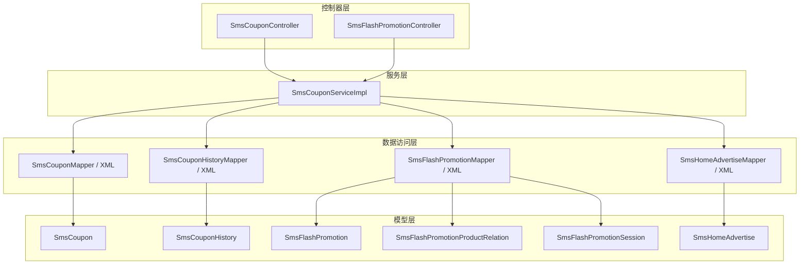
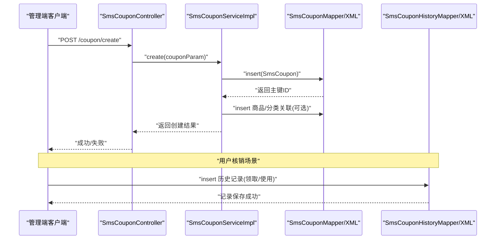
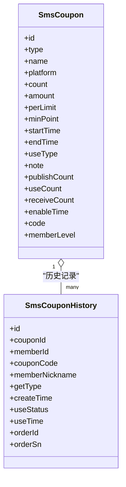
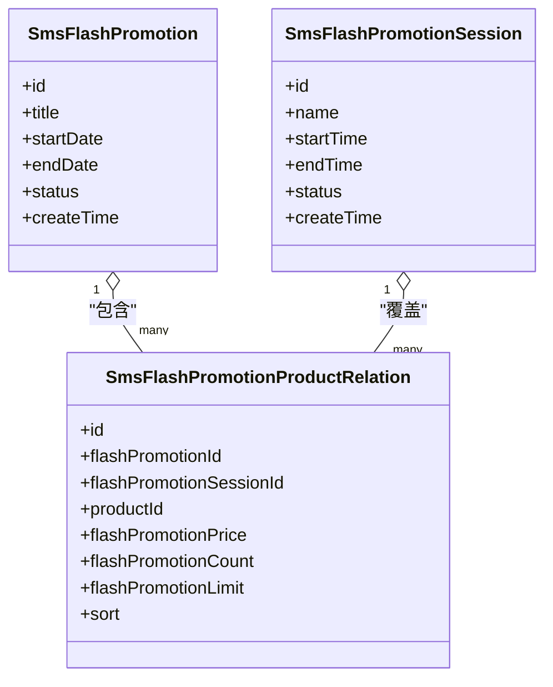
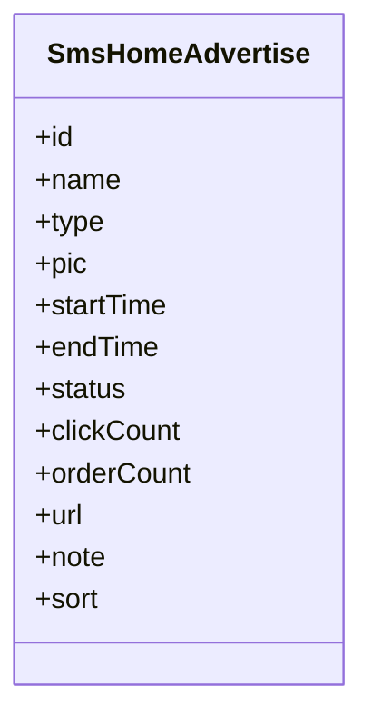
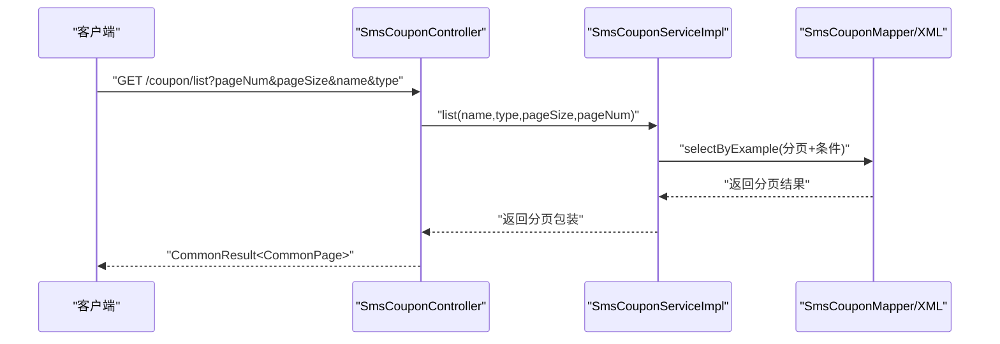
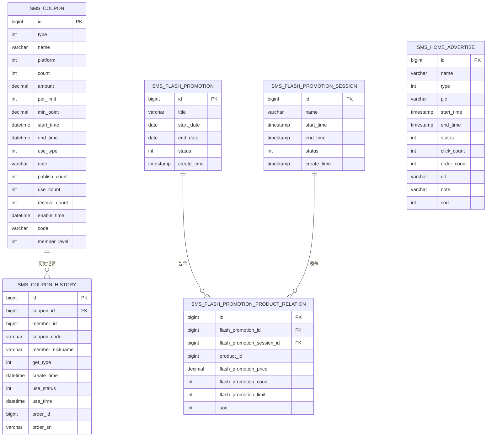

# 营销相关表

<cite>
**本文引用的文件**
- [SmsCoupon.java](file://mall-mbg/src/main/java/com/macro/mall/model/SmsCoupon.java)
- [SmsCouponMapper.java](file://mall-mbg/src/main/java/com/macro/mall/mapper/SmsCouponMapper.java)
- [SmsCouponMapper.xml](file://mall-mbg/src/main/resources/com/macro/mall/mapper/SmsCouponMapper.xml)
- [SmsCouponHistory.java](file://mall-mbg/src/main/java/com/macro/mall/model/SmsCouponHistory.java)
- [SmsCouponHistoryMapper.java](file://mall-mbg/src/main/java/com/macro/mall/mapper/SmsCouponHistoryMapper.java)
- [SmsCouponHistoryMapper.xml](file://mall-mbg/src/main/resources/com/macro/mall/mapper/SmsCouponHistoryMapper.xml)
- [SmsFlashPromotion.java](file://mall-mbg/src/main/java/com/macro/mall/model/SmsFlashPromotion.java)
- [SmsFlashPromotionMapper.java](file://mall-mbg/src/main/java/com/macro/mall/mapper/SmsFlashPromotionMapper.java)
- [SmsFlashPromotionMapper.xml](file://mall-mbg/src/main/resources/com/macro/mall/mapper/SmsFlashPromotionMapper.xml)
- [SmsFlashPromotionProductRelation.java](file://mall-mbg/src/main/java/com/macro/mall/model/SmsFlashPromotionProductRelation.java)
- [SmsFlashPromotionSession.java](file://mall-mbg/src/main/java/com/macro/mall/model/SmsFlashPromotionSession.java)
- [SmsHomeAdvertise.java](file://mall-mbg/src/main/java/com/macro/mall/model/SmsHomeAdvertise.java)
- [SmsHomeAdvertiseMapper.java](file://mall-mbg/src/main/java/com/macro/mall/mapper/SmsHomeAdvertiseMapper.java)
- [SmsHomeAdvertiseMapper.xml](file://mall-mbg/src/main/resources/com/macro/mall/mapper/SmsHomeAdvertiseMapper.xml)
- [SmsCouponController.java](file://mall-admin/src/main/java/com/macro/mall/controller/SmsCouponController.java)
- [SmsFlashPromotionController.java](file://mall-admin/src/main/java/com/macro/mall/controller/SmsFlashPromotionController.java)
- [SmsCouponParam.java](file://mall-admin/src/main/java/com/macro/mall/dto/SmsCouponParam.java)
- [SmsCouponServiceImpl.java](file://mall-admin/src/main/java/com/macro/mall/service/impl/SmsCouponServiceImpl.java)
</cite>

## 目录
1. [简介](#简介)
2. [项目结构](#项目结构)
3. [核心组件](#核心组件)
4. [架构总览](#架构总览)
5. [详细组件分析](#详细组件分析)
6. [依赖分析](#依赖分析)
7. [性能考虑](#性能考虑)
8. [故障排查指南](#故障排查指南)
9. [结论](#结论)
10. [附录](#附录)

## 简介
本文件聚焦于电商系统中的营销相关表结构与实现，围绕以下核心主题展开：
- 优惠券表（SmsCoupon）：定义优惠券类型、发放数量、使用门槛、有效期、平台与会员等级限制等字段，支撑优惠券的创建、发布、核销与统计。
- 限时购表（SmsFlashPromotion）及关联表：定义限时购活动、场次与商品价格、库存、限购等，支撑秒杀活动的组织与执行。
- 首页广告表（SmsHomeAdvertise）：定义广告位名称、类型、图片、起止时间、状态、点击与下单数等，支撑首页广告的投放与效果追踪。
- 优惠券使用历史表（SmsCouponHistory）：记录用户领取与使用优惠券的行为轨迹，包括来源类型、使用状态、订单号等，支撑营销效果分析与审计。

通过控制器、服务层与MyBatis映射的协同，实现营销活动从“创建—发布—执行—统计”的完整闭环，并提供库存控制、有效期管理、使用条件校验等关键能力。

## 项目结构
营销相关功能在代码库中采用分层架构：
- 控制器层：对外暴露REST接口，处理请求参数与响应封装。
- 服务层：编排业务逻辑，协调DAO与Mapper进行数据持久化。
- 数据访问层：DAO与Mapper负责SQL映射与CRUD操作。
- 模型层：实体类描述数据库表结构，DTO用于跨层传输。

图表来源
- [SmsCouponController.java:1-73](file://mall-admin/src/main/java/com/macro/mall/controller/SmsCouponController.java#L1-L73)
- [SmsFlashPromotionController.java:1-81](file://mall-admin/src/main/java/com/macro/mall/controller/SmsFlashPromotionController.java#L1-L81)
- [SmsCouponServiceImpl.java:1-126](file://mall-admin/src/main/java/com/macro/mall/service/impl/SmsCouponServiceImpl.java#L1-L126)
- [SmsCouponMapper.java:1-30](file://mall-mbg/src/main/java/com/macro/mall/mapper/SmsCouponMapper.java#L1-L30)
- [SmsCouponMapper.xml:1-415](file://mall-mbg/src/main/resources/com/macro/mall/mapper/SmsCouponMapper.xml#L1-L415)
- [SmsCouponHistoryMapper.java:1-30](file://mall-mbg/src/main/java/com/macro/mall/mapper/SmsCouponHistoryMapper.java#L1-L30)
- [SmsCouponHistoryMapper.xml:1-306](file://mall-mbg/src/main/resources/com/macro/mall/mapper/SmsCouponHistoryMapper.xml#L1-L306)
- [SmsFlashPromotionMapper.java:1-30](file://mall-mbg/src/main/java/com/macro/mall/mapper/SmsFlashPromotionMapper.java#L1-L30)
- [SmsFlashPromotionMapper.xml:1-226](file://mall-mbg/src/main/resources/com/macro/mall/mapper/SmsFlashPromotionMapper.xml#L1-L226)
- [SmsHomeAdvertiseMapper.java:1-30](file://mall-mbg/src/main/java/com/macro/mall/mapper/SmsHomeAdvertiseMapper.java#L1-L30)
- [SmsHomeAdvertiseMapper.xml:1-321](file://mall-mbg/src/main/resources/com/macro/mall/mapper/SmsHomeAdvertiseMapper.xml#L1-L321)

章节来源
- [SmsCouponController.java:1-73](file://mall-admin/src/main/java/com/macro/mall/controller/SmsCouponController.java#L1-L73)
- [SmsFlashPromotionController.java:1-81](file://mall-admin/src/main/java/com/macro/mall/controller/SmsFlashPromotionController.java#L1-L81)
- [SmsCouponServiceImpl.java:1-126](file://mall-admin/src/main/java/com/macro/mall/service/impl/SmsCouponServiceImpl.java#L1-L126)

## 核心组件
本节对营销相关的核心表进行逐项解析，涵盖字段含义、约束关系与典型用途。

- 优惠券表（SmsCoupon）
  - 关键字段：类型、名称、平台、总量、面额/折扣、每人限领、最低消费门槛、有效期、使用类型（按商品或分类）、备注、已发布数、已使用数、已领取数、生效时间、编码、会员等级限制等。
  - 典型用途：支持满减、折扣等多种优惠形式；通过“使用类型”与关联表限定适用范围；通过“平台”与“会员等级”控制发放对象。
  - 字段复杂度：以数值与时间为主，便于统计与筛选；适合建立索引以优化查询与核销校验。

- 优惠券使用历史表（SmsCouponHistory）
  - 关键字段：优惠券ID、会员ID、券码、昵称、领取来源类型、创建时间、使用状态、使用时间、订单ID、订单号等。
  - 典型用途：记录用户行为轨迹，支撑营销效果分析（如领取率、使用率、转化率）与审计追溯。

- 限时购表（SmsFlashPromotion）
  - 关键字段：标题、开始日期、结束日期、状态、创建时间等。
  - 典型用途：组织限时促销活动，配合场次与商品关系表实现精准的秒杀策略。

- 限时购商品关系表（SmsFlashPromotionProductRelation）
  - 关键字段：限时购ID、场次ID、商品ID、秒杀价、限量数量、每人限购、排序等。
  - 典型用途：限定活动内的商品与价格、库存与限购策略，支撑下单时的价格与库存校验。

- 限时购场次表（SmsFlashPromotionSession）
  - 关键字段：名称、开始/结束时间、状态、创建时间等。
  - 典型用途：定义每日的促销时间段，配合活动表形成“活动+场次+商品”的三级结构。

- 首页广告表（SmsHomeAdvertise）
  - 关键字段：名称、类型、图片、起止时间、状态、点击次数、下单次数、链接、备注、排序等。
  - 典型用途：首页广告位管理，记录曝光与转化指标，支撑运营效果评估。

章节来源
- [SmsCoupon.java:1-218](file://mall-mbg/src/main/java/com/macro/mall/model/SmsCoupon.java#L1-L218)
- [SmsCouponHistory.java:1-140](file://mall-mbg/src/main/java/com/macro/mall/model/SmsCouponHistory.java#L1-L140)
- [SmsFlashPromotion.java:1-85](file://mall-mbg/src/main/java/com/macro/mall/model/SmsFlashPromotion.java#L1-L85)
- [SmsFlashPromotionProductRelation.java:1-107](file://mall-mbg/src/main/java/com/macro/mall/model/SmsFlashPromotionProductRelation.java#L1-L107)
- [SmsFlashPromotionSession.java:1-85](file://mall-mbg/src/main/java/com/macro/mall/model/SmsFlashPromotionSession.java#L1-L85)
- [SmsHomeAdvertise.java:1-151](file://mall-mbg/src/main/java/com/macro/mall/model/SmsHomeAdvertise.java#L1-L151)

## 架构总览
营销功能的端到端流程由控制器发起，经服务层编排，调用DAO/Mapper完成持久化，最终落库到各营销表。下图展示优惠券创建与使用的典型序列：

图表来源
- [SmsCouponController.java:1-73](file://mall-admin/src/main/java/com/macro/mall/controller/SmsCouponController.java#L1-L73)
- [SmsCouponServiceImpl.java:1-126](file://mall-admin/src/main/java/com/macro/mall/service/impl/SmsCouponServiceImpl.java#L1-L126)
- [SmsCouponMapper.xml:1-415](file://mall-mbg/src/main/resources/com/macro/mall/mapper/SmsCouponMapper.xml#L1-L415)
- [SmsCouponHistoryMapper.xml:1-306](file://mall-mbg/src/main/resources/com/macro/mall/mapper/SmsCouponHistoryMapper.xml#L1-L306)

## 详细组件分析

### 优惠券表（SmsCoupon）与历史表（SmsCouponHistory）
- 设计要点
  - 优惠券主表用于定义发放策略与使用规则，历史表用于记录用户行为轨迹。
  - 使用类型（按商品/分类）与平台/会员等级限制共同决定发放范围。
  - 有效期与生效时间配合使用门槛（最低消费）实现精准的营销控制。
- 关键字段与约束
  - 数值型字段（面额、数量、限领、门槛）便于快速计算与校验。
  - 时间字段（开始/结束、生效时间）用于活动期与可用期判断。
  - 历史表中的使用状态与使用时间用于统计核销率与复购联动。
- 统计与分析
  - 历史表可按来源类型、使用状态、时间维度聚合，生成领取率、核销率、客单价等指标。

图表来源
- [SmsCoupon.java:1-218](file://mall-mbg/src/main/java/com/macro/mall/model/SmsCoupon.java#L1-L218)
- [SmsCouponHistory.java:1-140](file://mall-mbg/src/main/java/com/macro/mall/model/SmsCouponHistory.java#L1-L140)

章节来源
- [SmsCoupon.java:1-218](file://mall-mbg/src/main/java/com/macro/mall/model/SmsCoupon.java#L1-L218)
- [SmsCouponMapper.xml:1-415](file://mall-mbg/src/main/resources/com/macro/mall/mapper/SmsCouponMapper.xml#L1-L415)
- [SmsCouponHistory.java:1-140](file://mall-mbg/src/main/java/com/macro/mall/model/SmsCouponHistory.java#L1-L140)
- [SmsCouponHistoryMapper.xml:1-306](file://mall-mbg/src/main/resources/com/macro/mall/mapper/SmsCouponHistoryMapper.xml#L1-L306)

### 限时购表（SmsFlashPromotion）与关联表
- 设计要点
  - 活动表定义整体活动周期与状态；场次表定义每日时间段；商品关系表定义具体商品的秒杀价与库存。
  - 通过“每人限购”与“限量数量”实现库存控制与防刷。
- 执行流程
  - 创建活动与场次，配置商品关系；下单时校验活动期、场次期、库存与限购；支付完成后扣减库存并生成核销记录。

图表来源
- [SmsFlashPromotion.java:1-85](file://mall-mbg/src/main/java/com/macro/mall/model/SmsFlashPromotion.java#L1-L85)
- [SmsFlashPromotionProductRelation.java:1-107](file://mall-mbg/src/main/java/com/macro/mall/model/SmsFlashPromotionProductRelation.java#L1-L107)
- [SmsFlashPromotionSession.java:1-85](file://mall-mbg/src/main/java/com/macro/mall/model/SmsFlashPromotionSession.java#L1-L85)

章节来源
- [SmsFlashPromotion.java:1-85](file://mall-mbg/src/main/java/com/macro/mall/model/SmsFlashPromotion.java#L1-L85)
- [SmsFlashPromotionMapper.xml:1-226](file://mall-mbg/src/main/resources/com/macro/mall/mapper/SmsFlashPromotionMapper.xml#L1-L226)
- [SmsFlashPromotionProductRelation.java:1-107](file://mall-mbg/src/main/java/com/macro/mall/model/SmsFlashPromotionProductRelation.java#L1-L107)

### 首页广告表（SmsHomeAdvertise）
- 设计要点
  - 广告位的生命周期管理（起止时间、状态），曝光与转化指标（点击、下单）用于效果评估。
  - 类型与排序字段便于前端渲染与运营配置。
- 统计维度
  - 可基于状态、时间窗口、类型等维度统计曝光量、点击率、转化率等。

图表来源
- [SmsHomeAdvertise.java:1-151](file://mall-mbg/src/main/java/com/macro/mall/model/SmsHomeAdvertise.java#L1-L151)

章节来源
- [SmsHomeAdvertise.java:1-151](file://mall-mbg/src/main/java/com/macro/mall/model/SmsHomeAdvertise.java#L1-L151)
- [SmsHomeAdvertiseMapper.xml:1-321](file://mall-mbg/src/main/resources/com/macro/mall/mapper/SmsHomeAdvertiseMapper.xml#L1-L321)

### 控制器与服务层协作
- 控制器负责参数接收、分页查询与响应封装。
- 服务层负责业务编排：创建时写入主表与关联表，更新时先删后增以保证一致性，查询时结合分页与条件过滤。
- DTO（SmsCouponParam）承载优惠券与其商品/分类关联列表，便于跨层传输。

图表来源
- [SmsCouponController.java:1-73](file://mall-admin/src/main/java/com/macro/mall/controller/SmsCouponController.java#L1-L73)
- [SmsCouponServiceImpl.java:1-126](file://mall-admin/src/main/java/com/macro/mall/service/impl/SmsCouponServiceImpl.java#L1-L126)
- [SmsCouponMapper.xml:1-415](file://mall-mbg/src/main/resources/com/macro/mall/mapper/SmsCouponMapper.xml#L1-L415)

章节来源
- [SmsCouponController.java:1-73](file://mall-admin/src/main/java/com/macro/mall/controller/SmsCouponController.java#L1-L73)
- [SmsCouponParam.java:1-23](file://mall-admin/src/main/java/com/macro/mall/dto/SmsCouponParam.java#L1-L23)
- [SmsCouponServiceImpl.java:1-126](file://mall-admin/src/main/java/com/macro/mall/service/impl/SmsCouponServiceImpl.java#L1-L126)

## 依赖分析
- 表间依赖
  - SmsCoupon 与 SmsCouponHistory：一对多，历史表记录主表的使用轨迹。
  - SmsFlashPromotion 与 SmsFlashPromotionProductRelation：一对多，关系表承载商品与活动的绑定。
  - SmsFlashPromotion 与 SmsFlashPromotionSession：通过场次ID关联，限定活动在特定时间段内的执行。
  - SmsHomeAdvertise 为独立表，不依赖其他营销表。
- 层级依赖
  - 控制器依赖服务接口；服务实现依赖Mapper与DAO；Mapper映射到对应实体类。

图表来源
- [SmsCoupon.java:1-218](file://mall-mbg/src/main/java/com/macro/mall/model/SmsCoupon.java#L1-L218)
- [SmsCouponHistory.java:1-140](file://mall-mbg/src/main/java/com/macro/mall/model/SmsCouponHistory.java#L1-L140)
- [SmsFlashPromotion.java:1-85](file://mall-mbg/src/main/java/com/macro/mall/model/SmsFlashPromotion.java#L1-L85)
- [SmsFlashPromotionProductRelation.java:1-107](file://mall-mbg/src/main/java/com/macro/mall/model/SmsFlashPromotionProductRelation.java#L1-L107)
- [SmsFlashPromotionSession.java:1-85](file://mall-mbg/src/main/java/com/macro/mall/model/SmsFlashPromotionSession.java#L1-L85)
- [SmsHomeAdvertise.java:1-151](file://mall-mbg/src/main/java/com/macro/mall/model/SmsHomeAdvertise.java#L1-L151)

章节来源
- [SmsCouponMapper.xml:1-415](file://mall-mbg/src/main/resources/com/macro/mall/mapper/SmsCouponMapper.xml#L1-L415)
- [SmsCouponHistoryMapper.xml:1-306](file://mall-mbg/src/main/resources/com/macro/mall/mapper/SmsCouponHistoryMapper.xml#L1-L306)
- [SmsFlashPromotionMapper.xml:1-226](file://mall-mbg/src/main/resources/com/macro/mall/mapper/SmsFlashPromotionMapper.xml#L1-L226)
- [SmsHomeAdvertiseMapper.xml:1-321](file://mall-mbg/src/main/resources/com/macro/mall/mapper/SmsHomeAdvertiseMapper.xml#L1-L321)

## 性能考虑
- 查询性能
  - 在优惠券名称、类型、平台、会员等级、状态等常用过滤字段上建立索引，提升分页与条件查询效率。
  - 对历史表的使用状态、创建时间、订单号建立复合索引，优化统计与报表查询。
- 写入性能
  - 优惠券创建与更新采用“先删后增”的方式维护关联关系，建议批量插入（insertList）减少往返开销。
  - 限时购库存扣减应采用原子性更新（如乐观锁或行级锁），避免超卖。
- 缓存策略
  - 将热门活动与商品关系缓存至Redis，降低高并发下的数据库压力。
- 分页与排序
  - 列表查询使用分页插件，确保orderByClause可控，避免全表扫描。

## 故障排查指南
- 优惠券无法核销
  - 检查有效期与生效时间是否正确设置；确认使用门槛（最低消费）是否满足；核对平台与会员等级限制。
  - 查看历史表的使用状态与使用时间，定位核销异常。
- 库存超卖
  - 核对限时购商品关系表的限量数量与每人限购设置；检查下单时的库存扣减逻辑是否幂等。
- 活动状态异常
  - 确认活动表与场次表的状态与时间窗口是否匹配；检查定时任务或触发器是否正确更新状态。
- 接口返回失败
  - 检查控制器参数绑定与服务层返回值；查看MyBatis映射是否正确映射字段。

章节来源
- [SmsCouponServiceImpl.java:1-126](file://mall-admin/src/main/java/com/macro/mall/service/impl/SmsCouponServiceImpl.java#L1-L126)
- [SmsCouponHistoryMapper.xml:1-306](file://mall-mbg/src/main/resources/com/macro/mall/mapper/SmsCouponHistoryMapper.xml#L1-L306)
- [SmsFlashPromotionMapper.xml:1-226](file://mall-mbg/src/main/resources/com/macro/mall/mapper/SmsFlashPromotionMapper.xml#L1-L226)

## 结论
本文系统梳理了营销相关表的结构设计与实现路径，明确了优惠券、限时购与首页广告在数据层面的关键字段与依赖关系，并给出了从创建、发布、执行到统计分析的全流程视图。通过合理的索引、缓存与批量写入策略，可在高并发场景下保障系统的稳定性与性能。同时，完善的日志与历史表记录为后续的营销效果分析与问题排查提供了坚实基础。

## 附录
- 常用统计口径建议
  - 领取率 = 已领取数 / 已发布数
  - 核销率 = 已使用数 / 已领取数
  - 转化率 = 订单数 / 点击数
  - 客单价 = 营业收入 / 订单数
- 关键字段速查
  - 优惠券：类型、平台、总量、面额、每人限领、最低消费、有效期、使用类型、会员等级
  - 历史表：来源类型、使用状态、订单号、使用时间
  - 限时购：活动期、场次期、商品价、限量、每人限购
  - 首页广告：状态、点击、下单、排序