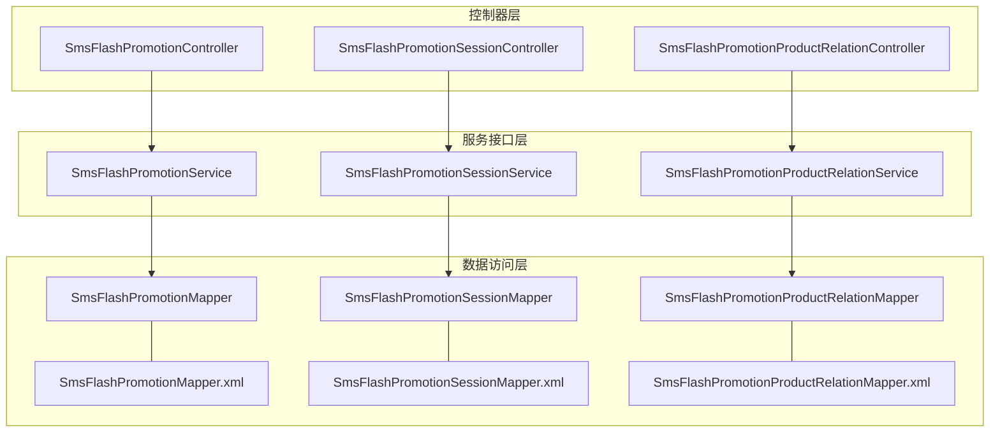
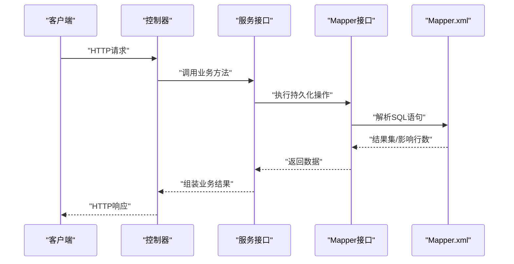
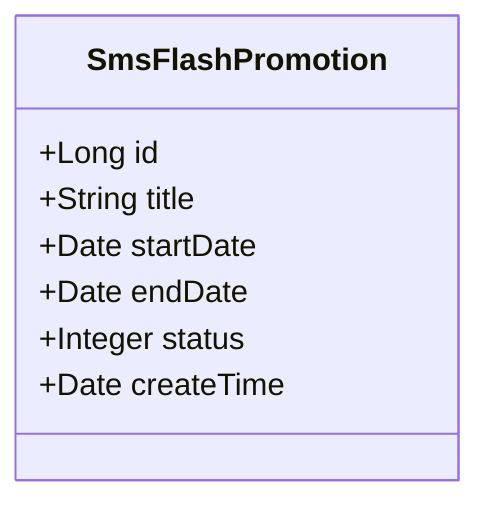
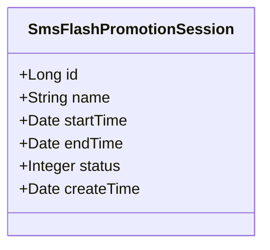
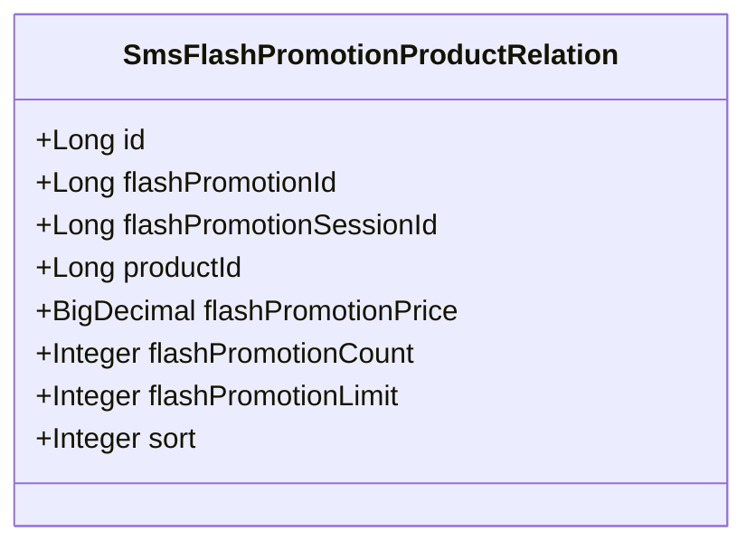
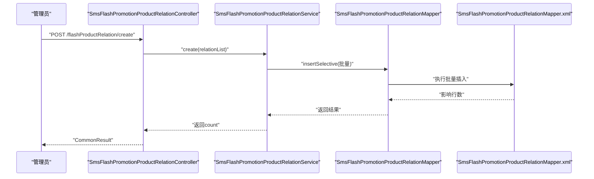
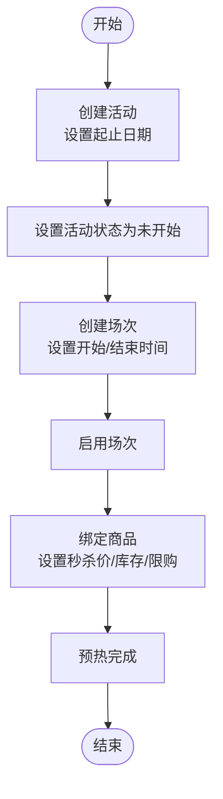
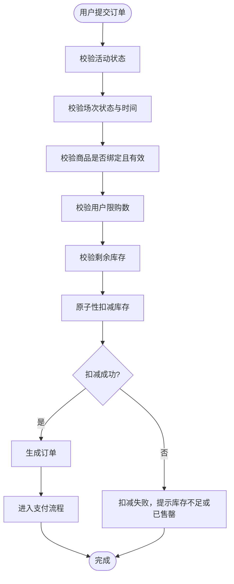
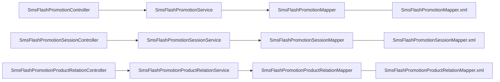

# 限时购相关表

<cite>
**本文引用的文件**
- [SmsFlashPromotion.java](file://mall-mbg/src/main/java/com/macro/mall/model/SmsFlashPromotion.java)
- [SmsFlashPromotionSession.java](file://mall-mbg/src/main/java/com/macro/mall/model/SmsFlashPromotionSession.java)
- [SmsFlashPromotionProductRelation.java](file://mall-mbg/src/main/java/com/macro/mall/model/SmsFlashPromotionProductRelation.java)
- [SmsFlashPromotionController.java](file://mall-admin/src/main/java/com/macro/mall/controller/SmsFlashPromotionController.java)
- [SmsFlashPromotionSessionController.java](file://mall-admin/src/main/java/com/macro/mall/controller/SmsFlashPromotionSessionController.java)
- [SmsFlashPromotionProductRelationController.java](file://mall-admin/src/main/java/com/macro/mall/controller/SmsFlashPromotionProductRelationController.java)
- [SmsFlashPromotionService.java](file://mall-admin/src/main/java/com/macro/mall/service/SmsFlashPromotionService.java)
- [SmsFlashPromotionSessionService.java](file://mall-admin/src/main/java/com/macro/mall/service/SmsFlashPromotionSessionService.java)
- [SmsFlashPromotionProductRelationService.java](file://mall-admin/src/main/java/com/macro/mall/service/SmsFlashPromotionProductRelationService.java)
- [SmsFlashPromotionMapper.java](file://mall-mbg/src/main/java/com/macro/mall/mapper/SmsFlashPromotionMapper.java)
- [SmsFlashPromotionSessionMapper.java](file://mall-mbg/src/main/java/com/macro/mall/mapper/SmsFlashPromotionSessionMapper.java)
- [SmsFlashPromotionProductRelationMapper.java](file://mall-mbg/src/main/java/com/macro/mall/mapper/SmsFlashPromotionProductRelationMapper.java)
- [SmsFlashPromotionMapper.xml](file://mall-mbg/src/main/resources/com/macro/mall/mapper/SmsFlashPromotionMapper.xml)
- [SmsFlashPromotionSessionMapper.xml](file://mall-mbg/src/main/resources/com/macro/mall/mapper/SmsFlashPromotionSessionMapper.xml)
- [SmsFlashPromotionProductRelationMapper.xml](file://mall-mbg/src/main/resources/com/macro/mall/mapper/SmsFlashPromotionProductRelationMapper.xml)
</cite>

## 目录
1. [引言](#引言)
2. [项目结构](#项目结构)
3. [核心组件](#核心组件)
4. [架构总览](#架构总览)
5. [详细组件分析](#详细组件分析)
6. [依赖分析](#依赖分析)
7. [性能考虑](#性能考虑)
8. [故障排查指南](#故障排查指南)
9. [结论](#结论)

## 引言
本文件围绕“限时购”相关数据库表与后端实现进行系统化梳理，重点覆盖以下三张表：
- 活动表：记录限时购活动的时间范围、状态与创建时间
- 场次表：记录每日场次的开始/结束时间、状态与创建时间
- 商品关系表：记录活动场次与商品的绑定关系，包括秒杀价、总量、每人限购数与排序

同时，结合控制器、服务接口与MyBatis映射，说明活动预热、场次配置、商品绑定、以及商品秒杀与库存扣减等核心业务流程在代码层面的落地方式。

## 项目结构
- 模型层（MBG生成）：定义三张表的实体类
- 控制器层（Admin模块）：提供REST接口，用于活动、场次与商品关系的增删改查
- 服务接口层（Admin模块）：定义业务方法契约
- 数据访问层（MBG）：MyBatis Mapper接口与XML映射文件

图表来源
- [SmsFlashPromotionController.java:1-81](file://mall-admin/src/main/java/com/macro/mall/controller/SmsFlashPromotionController.java#L1-L81)
- [SmsFlashPromotionSessionController.java:1-85](file://mall-admin/src/main/java/com/macro/mall/controller/SmsFlashPromotionSessionController.java#L1-L85)
- [SmsFlashPromotionProductRelationController.java:1-73](file://mall-admin/src/main/java/com/macro/mall/controller/SmsFlashPromotionProductRelationController.java#L1-L73)
- [SmsFlashPromotionService.java:1-42](file://mall-admin/src/main/java/com/macro/mall/service/SmsFlashPromotionService.java#L1-L42)
- [SmsFlashPromotionSessionService.java:1-48](file://mall-admin/src/main/java/com/macro/mall/service/SmsFlashPromotionSessionService.java#L1-L48)
- [SmsFlashPromotionProductRelationService.java:1-50](file://mall-admin/src/main/java/com/macro/mall/service/SmsFlashPromotionProductRelationService.java#L1-L50)
- [SmsFlashPromotionMapper.java:1-30](file://mall-mbg/src/main/java/com/macro/mall/mapper/SmsFlashPromotionMapper.java#L1-L30)
- [SmsFlashPromotionSessionMapper.java:1-30](file://mall-mbg/src/main/java/com/macro/mall/mapper/SmsFlashPromotionSessionMapper.java#L1-L30)
- [SmsFlashPromotionProductRelationMapper.java:1-30](file://mall-mbg/src/main/java/com/macro/mall/mapper/SmsFlashPromotionProductRelationMapper.java#L1-L30)
- [SmsFlashPromotionMapper.xml:1-226](file://mall-mbg/src/main/resources/com/macro/mall/mapper/SmsFlashPromotionMapper.xml#L1-L226)
- [SmsFlashPromotionSessionMapper.xml:1-226](file://mall-mbg/src/main/resources/com/macro/mall/mapper/SmsFlashPromotionSessionMapper.xml#L1-L226)
- [SmsFlashPromotionProductRelationMapper.xml:1-259](file://mall-mbg/src/main/resources/com/macro/mall/mapper/SmsFlashPromotionProductRelationMapper.xml#L1-L259)

章节来源
- [SmsFlashPromotionController.java:1-81](file://mall-admin/src/main/java/com/macro/mall/controller/SmsFlashPromotionController.java#L1-L81)
- [SmsFlashPromotionSessionController.java:1-85](file://mall-admin/src/main/java/com/macro/mall/controller/SmsFlashPromotionSessionController.java#L1-L85)
- [SmsFlashPromotionProductRelationController.java:1-73](file://mall-admin/src/main/java/com/macro/mall/controller/SmsFlashPromotionProductRelationController.java#L1-L73)

## 核心组件
- 活动表（SmsFlashPromotion）
  - 关键字段：标题、起止日期、状态、创建时间
  - 作用：定义一次限时购活动的整体时间窗口与上下线状态
- 场次表（SmsFlashPromotionSession）
  - 关键字段：名称、当日开始/结束时间、状态、创建时间
  - 作用：定义每日的抢购时间段，如早场、晚场等
- 商品关系表（SmsFlashPromotionProductRelation）
  - 关键字段：活动ID、场次ID、商品ID、秒杀价、总量、每人限购数、排序
  - 作用：将具体商品绑定到某个活动的某个场次，并设置价格与库存限制

章节来源
- [SmsFlashPromotion.java:1-85](file://mall-mbg/src/main/java/com/macro/mall/model/SmsFlashPromotion.java#L1-L85)
- [SmsFlashPromotionSession.java:1-85](file://mall-mbg/src/main/java/com/macro/mall/model/SmsFlashPromotionSession.java#L1-L85)
- [SmsFlashPromotionProductRelation.java:1-107](file://mall-mbg/src/main/java/com/macro/mall/model/SmsFlashPromotionProductRelation.java#L1-L107)

## 架构总览
从控制器到服务再到数据访问，形成清晰的分层架构。控制器负责参数接收与返回封装；服务接口定义业务能力；Mapper通过XML映射SQL，完成对数据库的CRUD操作。

图表来源
- [SmsFlashPromotionController.java:25-33](file://mall-admin/src/main/java/com/macro/mall/controller/SmsFlashPromotionController.java#L25-L33)
- [SmsFlashPromotionService.java:11-41](file://mall-admin/src/main/java/com/macro/mall/service/SmsFlashPromotionService.java#L11-L41)
- [SmsFlashPromotionMapper.java:8-29](file://mall-mbg/src/main/java/com/macro/mall/mapper/SmsFlashPromotionMapper.java#L8-L29)
- [SmsFlashPromotionMapper.xml:73-92](file://mall-mbg/src/main/resources/com/macro/mall/mapper/SmsFlashPromotionMapper.xml#L73-L92)

## 详细组件分析

### 活动表（SmsFlashPromotion）
- 设计要点
  - 时间范围：使用日期类型存储活动起止日期，便于按自然日筛选
  - 状态管理：整型状态位用于标识活动是否上线（如0未开始/1进行中/2已结束等，具体值由业务约定）
  - 创建时间：记录活动创建时间，用于排序与审计
- 常见业务场景
  - 预热：提前开启活动但不立即放量，通过状态与场次配合实现
  - 上下线：根据状态控制前端展示与抢购入口
- 数据访问
  - 提供按主键查询、条件查询、分页查询等能力
  - 支持更新状态、更新活动信息等

图表来源
- [SmsFlashPromotion.java:6-19](file://mall-mbg/src/main/java/com/macro/mall/model/SmsFlashPromotion.java#L6-L19)

章节来源
- [SmsFlashPromotion.java:1-85](file://mall-mbg/src/main/java/com/macro/mall/model/SmsFlashPromotion.java#L1-L85)
- [SmsFlashPromotionMapper.java:1-30](file://mall-mbg/src/main/java/com/macro/mall/mapper/SmsFlashPromotionMapper.java#L1-L30)
- [SmsFlashPromotionMapper.xml:1-226](file://mall-mbg/src/main/resources/com/macro/mall/mapper/SmsFlashPromotionMapper.xml#L1-L226)

### 场次表（SmsFlashPromotionSession）
- 设计要点
  - 当日时间段：使用时间类型表示当日开始/结束时间，支持跨日逻辑需在业务侧处理
  - 启用状态：用于控制场次是否参与抢购
  - 名称：便于运营配置与展示
- 常见业务场景
  - 每日多场：如早9点场、下午15点场、晚20点场
  - 动态启停：根据活动策略临时调整场次状态
- 数据访问
  - 提供新增、修改、删除、查询列表与按ID查询

图表来源
- [SmsFlashPromotionSession.java:6-19](file://mall-mbg/src/main/java/com/macro/mall/model/SmsFlashPromotionSession.java#L6-L19)

章节来源
- [SmsFlashPromotionSession.java:1-85](file://mall-mbg/src/main/java/com/macro/mall/model/SmsFlashPromotionSession.java#L1-L85)
- [SmsFlashPromotionSessionMapper.java:1-30](file://mall-mbg/src/main/java/com/macro/mall/mapper/SmsFlashPromotionSessionMapper.java#L1-L30)
- [SmsFlashPromotionSessionMapper.xml:1-226](file://mall-mbg/src/main/resources/com/macro/mall/mapper/SmsFlashPromotionSessionMapper.xml#L1-L226)

### 商品关系表（SmsFlashPromotionProductRelation）
- 设计要点
  - 绑定关系：以活动ID+场次ID+商品ID构成组合维度，确保不同场次的同品价格与库存独立
  - 价格与库存：秒杀价、总量、每人限购数共同决定销售策略与风控
  - 排序：用于前台展示顺序
- 常见业务场景
  - 商品绑定：将商品加入活动场次，设置秒杀价与库存
  - 限购控制：基于每人限购数限制下单数量
  - 展示排序：通过sort字段控制商品在页面的排列
- 数据访问
  - 支持批量插入（用于活动场次商品导入）、按ID查询、分页查询等

图表来源
- [SmsFlashPromotionProductRelation.java:6-23](file://mall-mbg/src/main/java/com/macro/mall/model/SmsFlashPromotionProductRelation.java#L6-L23)

章节来源
- [SmsFlashPromotionProductRelation.java:1-107](file://mall-mbg/src/main/java/com/macro/mall/model/SmsFlashPromotionProductRelation.java#L1-L107)
- [SmsFlashPromotionProductRelationMapper.java:1-30](file://mall-mbg/src/main/java/com/macro/mall/mapper/SmsFlashPromotionProductRelationMapper.java#L1-L30)
- [SmsFlashPromotionProductRelationMapper.xml:1-259](file://mall-mbg/src/main/resources/com/macro/mall/mapper/SmsFlashPromotionProductRelationMapper.xml#L1-L259)

### 控制器与服务接口
- 控制器职责
  - 活动：创建、更新、删除、上下线、查询详情、分页查询
  - 场次：创建、更新、上下线、删除、查询详情、查询列表、按活动查询可选场次
  - 商品关系：创建（批量）、更新、删除、查询详情、按活动与场次分页查询
- 服务接口职责
  - 定义业务方法签名，如批量创建商品关系、按条件分页查询等
  - 标注事务性方法（如批量创建商品关系）

图表来源
- [SmsFlashPromotionProductRelationController.java:26-34](file://mall-admin/src/main/java/com/macro/mall/controller/SmsFlashPromotionProductRelationController.java#L26-L34)
- [SmsFlashPromotionProductRelationService.java:17-18](file://mall-admin/src/main/java/com/macro/mall/service/SmsFlashPromotionProductRelationService.java#L17-L18)
- [SmsFlashPromotionProductRelationMapper.java:15-17](file://mall-mbg/src/main/java/com/macro/mall/mapper/SmsFlashPromotionProductRelationMapper.java#L15-L17)
- [SmsFlashPromotionProductRelationMapper.xml:106-168](file://mall-mbg/src/main/resources/com/macro/mall/mapper/SmsFlashPromotionProductRelationMapper.xml#L106-L168)

章节来源
- [SmsFlashPromotionController.java:25-79](file://mall-admin/src/main/java/com/macro/mall/controller/SmsFlashPromotionController.java#L25-L79)
- [SmsFlashPromotionSessionController.java:25-84](file://mall-admin/src/main/java/com/macro/mall/controller/SmsFlashPromotionSessionController.java#L25-L84)
- [SmsFlashPromotionProductRelationController.java:26-71](file://mall-admin/src/main/java/com/macro/mall/controller/SmsFlashPromotionProductRelationController.java#L26-L71)
- [SmsFlashPromotionService.java:11-41](file://mall-admin/src/main/java/com/macro/mall/service/SmsFlashPromotionService.java#L11-L41)
- [SmsFlashPromotionSessionService.java:12-47](file://mall-admin/src/main/java/com/macro/mall/service/SmsFlashPromotionSessionService.java#L12-L47)
- [SmsFlashPromotionProductRelationService.java:13-49](file://mall-admin/src/main/java/com/macro/mall/service/SmsFlashPromotionProductRelationService.java#L13-L49)

### 核心业务流程

#### 活动预热
- 流程说明
  - 创建活动并设置起止日期
  - 将活动状态置为“未开始”
  - 配置场次并设置启停状态
  - 在场次内绑定商品并设置秒杀价与库存
  - 预热期间仅开放场次与商品信息，不开放购买入口
- 关键点
  - 活动状态与场次状态共同决定是否对外展示
  - 起止日期与场次时间共同决定可抢购时段

#### 商品秒杀与库存扣减
- 流程说明
  - 用户在活动场次内提交订单
  - 校验：活动状态、场次状态、商品是否在关系表中、是否在有效时间段内
  - 校验限购：判断用户当前场次已购数量与限购数
  - 校验库存：判断剩余库存是否足够
  - 扣减库存：原子性扣减，失败则回滚
  - 下单成功：生成订单并锁定支付
- 关键点
  - 库存扣减必须保证原子性与一致性
  - 限购与库存校验需在同一事务内完成
  - 秒杀价与原价差异需在下单时体现

## 依赖分析
- 控制器依赖服务接口，服务接口依赖Mapper
- Mapper通过XML映射SQL，实现对数据库的CRUD
- 三张表之间存在外键关系：商品关系表依赖活动与场次

图表来源
- [SmsFlashPromotionController.java:22-23](file://mall-admin/src/main/java/com/macro/mall/controller/SmsFlashPromotionController.java#L22-L23)
- [SmsFlashPromotionSessionController.java:22-23](file://mall-admin/src/main/java/com/macro/mall/controller/SmsFlashPromotionSessionController.java#L22-L23)
- [SmsFlashPromotionProductRelationController.java:23-24](file://mall-admin/src/main/java/com/macro/mall/controller/SmsFlashPromotionProductRelationController.java#L23-L24)
- [SmsFlashPromotionService.java:1-42](file://mall-admin/src/main/java/com/macro/mall/service/SmsFlashPromotionService.java#L1-L42)
- [SmsFlashPromotionSessionService.java:1-48](file://mall-admin/src/main/java/com/macro/mall/service/SmsFlashPromotionSessionService.java#L1-L48)
- [SmsFlashPromotionProductRelationService.java:1-50](file://mall-admin/src/main/java/com/macro/mall/service/SmsFlashPromotionProductRelationService.java#L1-L50)
- [SmsFlashPromotionMapper.java:1-30](file://mall-mbg/src/main/java/com/macro/mall/mapper/SmsFlashPromotionMapper.java#L1-L30)
- [SmsFlashPromotionSessionMapper.java:1-30](file://mall-mbg/src/main/java/com/macro/mall/mapper/SmsFlashPromotionSessionMapper.java#L1-L30)
- [SmsFlashPromotionProductRelationMapper.java:1-30](file://mall-mbg/src/main/java/com/macro/mall/mapper/SmsFlashPromotionProductRelationMapper.java#L1-L30)
- [SmsFlashPromotionMapper.xml:1-226](file://mall-mbg/src/main/resources/com/macro/mall/mapper/SmsFlashPromotionMapper.xml#L1-L226)
- [SmsFlashPromotionSessionMapper.xml:1-226](file://mall-mbg/src/main/resources/com/macro/mall/mapper/SmsFlashPromotionSessionMapper.xml#L1-L226)
- [SmsFlashPromotionProductRelationMapper.xml:1-259](file://mall-mbg/src/main/resources/com/macro/mall/mapper/SmsFlashPromotionProductRelationMapper.xml#L1-L259)

章节来源
- [SmsFlashPromotionMapper.xml:73-92](file://mall-mbg/src/main/resources/com/macro/mall/mapper/SmsFlashPromotionMapper.xml#L73-L92)
- [SmsFlashPromotionSessionMapper.xml:73-92](file://mall-mbg/src/main/resources/com/macro/mall/mapper/SmsFlashPromotionSessionMapper.xml#L73-L92)
- [SmsFlashPromotionProductRelationMapper.xml:76-95](file://mall-mbg/src/main/resources/com/macro/mall/mapper/SmsFlashPromotionProductRelationMapper.xml#L76-L95)

## 性能考虑
- 查询优化
  - 对活动与场次的常用查询（如按状态、时间范围）建立合适索引
  - 分页查询时避免“深度分页”，优先使用基于索引的游标分页
- 写入优化
  - 批量插入商品关系时使用JDBC批处理，减少往返
  - 扣减库存采用原子操作（如UPDATE带条件），避免读写竞争
- 缓存策略
  - 活动与场次的基础配置可缓存，变更时失效
  - 商品关系在活动开始前可预热加载至本地缓存
- 并发控制
  - 秒杀场景下使用分布式锁或队列削峰填谷
  - 库存扣减与订单创建放在同一事务或同一分布式事务中

## 故障排查指南
- 常见问题
  - 活动未显示：检查活动状态与起止日期、场次状态与时间
  - 商品未出现在场次：检查商品关系是否存在、是否被禁用
  - 抢购失败：检查库存是否充足、是否超过限购数、是否在有效场次内
- 排查步骤
  - 核对活动表状态与时间范围
  - 核对场次表启停状态与时间
  - 核对商品关系表中的秒杀价、总量、限购数与排序
  - 核对数据库索引与慢查询日志
- 相关接口参考
  - 活动：创建/更新/删除/上下线/详情/分页
  - 场次：创建/更新/上下线/删除/详情/列表/按活动查询可选场次
  - 商品关系：批量创建/更新/删除/详情/按活动与场次分页查询

章节来源
- [SmsFlashPromotionController.java:25-79](file://mall-admin/src/main/java/com/macro/mall/controller/SmsFlashPromotionController.java#L25-L79)
- [SmsFlashPromotionSessionController.java:25-84](file://mall-admin/src/main/java/com/macro/mall/controller/SmsFlashPromotionSessionController.java#L25-L84)
- [SmsFlashPromotionProductRelationController.java:26-71](file://mall-admin/src/main/java/com/macro/mall/controller/SmsFlashPromotionProductRelationController.java#L26-L71)

## 结论
限时购系统的三张核心表分别承担“活动范围”、“每日场次”与“商品绑定”的职责，通过控制器、服务与Mapper的分层设计，实现了从配置到执行的完整闭环。活动预热、场次配置与商品绑定是业务准备阶段的关键，而商品秒杀与库存扣减则体现了高并发下的性能与一致性要求。建议在实际部署中完善索引、缓存与限流策略，并在高并发场景下引入分布式锁与异步削峰方案，确保系统稳定与用户体验。