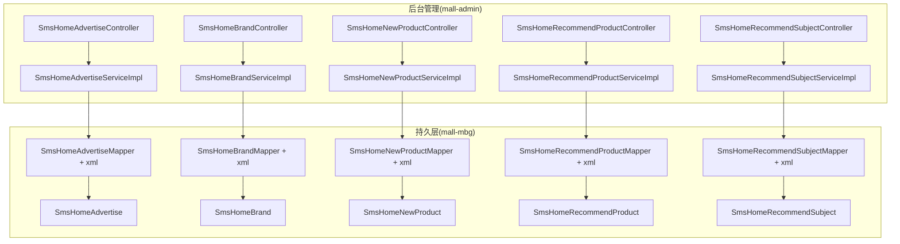
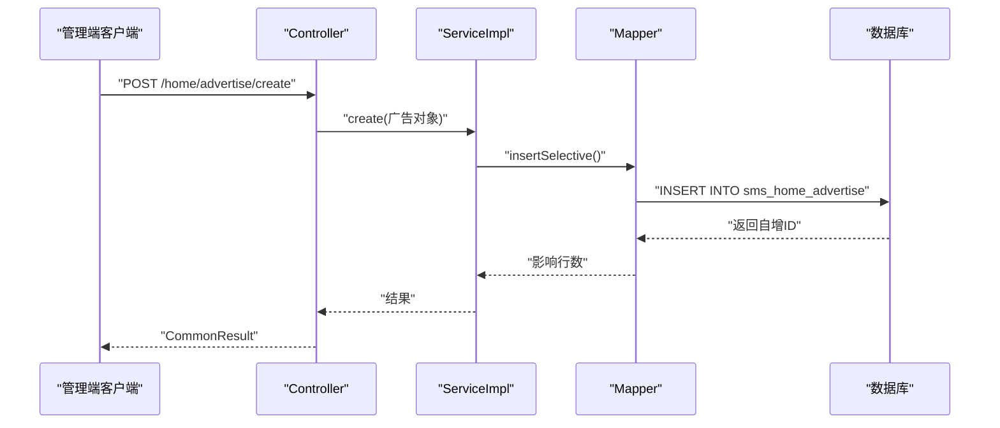
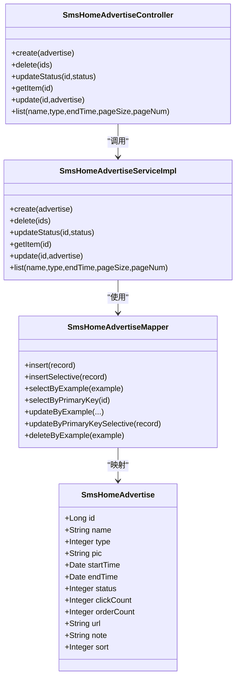
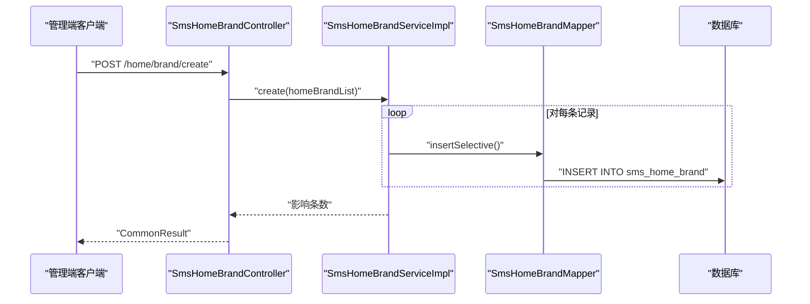
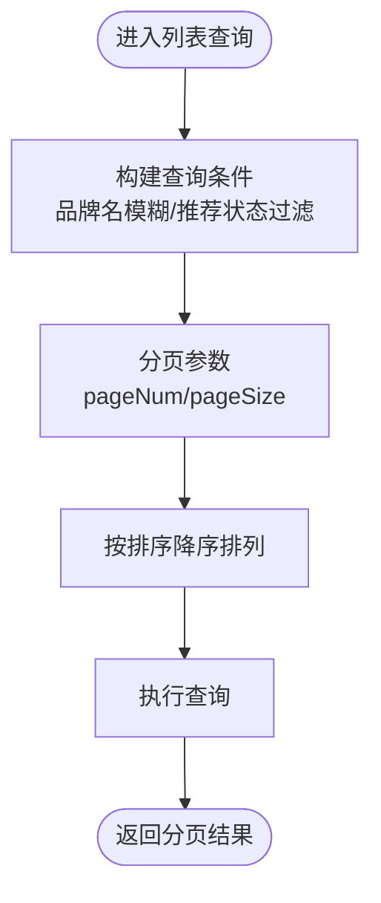
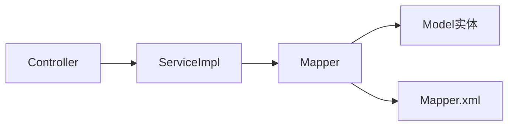

# 首页广告相关表

<cite>
**本文引用的文件**
- [SmsHomeAdvertiseController.java](file://mall-admin/src/main/java/com/macro/mall/controller/SmsHomeAdvertiseController.java)
- [SmsHomeAdvertiseServiceImpl.java](file://mall-admin/src/main/java/com/macro/mall/service/impl/SmsHomeAdvertiseServiceImpl.java)
- [SmsHomeAdvertiseMapper.java](file://mall-mbg/src/main/java/com/macro/mall/mapper/SmsHomeAdvertiseMapper.java)
- [SmsHomeAdvertise.java](file://mall-mbg/src/main/java/com/macro/mall/model/SmsHomeAdvertise.java)
- [SmsHomeAdvertiseMapper.xml](file://mall-mbg/src/main/resources/com/macro/mall/mapper/SmsHomeAdvertiseMapper.xml)
- [SmsHomeBrandController.java](file://mall-admin/src/main/java/com/macro/mall/controller/SmsHomeBrandController.java)
- [SmsHomeBrandServiceImpl.java](file://mall-admin/src/main/java/com/macro/mall/service/impl/SmsHomeBrandServiceImpl.java)
- [SmsHomeBrandMapper.java](file://mall-mbg/src/main/java/com/macro/mall/mapper/SmsHomeBrandMapper.java)
- [SmsHomeBrand.java](file://mall-mbg/src/main/java/com/macro/mall/model/SmsHomeBrand.java)
- [SmsHomeBrandMapper.xml](file://mall-mbg/src/main/resources/com/macro/mall/mapper/SmsHomeBrandMapper.xml)
- [SmsHomeNewProductController.java](file://mall-admin/src/main/java/com/macro/mall/controller/SmsHomeNewProductController.java)
- [SmsHomeNewProductServiceImpl.java](file://mall-admin/src/main/java/com/macro/mall/service/impl/SmsHomeNewProductServiceImpl.java)
- [SmsHomeNewProductMapper.java](file://mall-mbg/src/main/java/com/macro/mall/mapper/SmsHomeNewProductMapper.java)
- [SmsHomeNewProduct.java](file://mall-mbg/src/main/java/com/macro/mall/model/SmsHomeNewProduct.java)
- [SmsHomeNewProductMapper.xml](file://mall-mbg/src/main/resources/com/macro/mall/mapper/SmsHomeNewProductMapper.xml)
- [SmsHomeRecommendProductController.java](file://mall-admin/src/main/java/com/macro/mall/controller/SmsHomeRecommendProductController.java)
- [SmsHomeRecommendProductServiceImpl.java](file://mall-admin/src/main/java/com/macro/mall/service/impl/SmsHomeRecommendProductServiceImpl.java)
- [SmsHomeRecommendProductMapper.java](file://mall-mbg/src/main/java/com/macro/mall/mapper/SmsHomeRecommendProductMapper.java)
- [SmsHomeRecommendProduct.java](file://mall-mbg/src/main/java/com/macro/mall/model/SmsHomeRecommendProduct.java)
- [SmsHomeRecommendProductMapper.xml](file://mall-mbg/src/main/resources/com/macro/mall/mapper/SmsHomeRecommendProductMapper.xml)
- [SmsHomeRecommendSubjectController.java](file://mall-admin/src/main/java/com/macro/mall/controller/SmsHomeRecommendSubjectController.java)
- [SmsHomeRecommendSubjectServiceImpl.java](file://mall-admin/src/main/java/com/macro/mall/service/impl/SmsHomeRecommendSubjectServiceImpl.java)
- [SmsHomeRecommendSubjectMapper.java](file://mall-mbg/src/main/java/com/macro/mall/mapper/SmsHomeRecommendSubjectMapper.java)
- [SmsHomeRecommendSubject.java](file://mall-mbg/src/main/java/com/macro/mall/model/SmsHomeRecommendSubject.java)
- [SmsHomeRecommendSubjectMapper.xml](file://mall-mbg/src/main/resources/com/macro/mall/mapper/SmsHomeRecommendSubjectMapper.xml)
</cite>

## 目录
1. [引言](#引言)
2. [项目结构](#项目结构)
3. [核心组件](#核心组件)
4. [架构总览](#架构总览)
5. [详细组件分析](#详细组件分析)
6. [依赖分析](#依赖分析)
7. [性能考虑](#性能考虑)
8. [故障排查指南](#故障排查指南)
9. [结论](#结论)
10. [附录](#附录)

## 引言
本文件聚焦于“首页广告相关表”的设计与实现，覆盖以下主题：
- 首页广告表（SmsHomeAdvertise）：广告位管理、轮播图配置、跳转链接设置、点击与下单统计字段。
- 首页品牌推荐表（SmsHomeBrand）：品牌展示机制、排序、展示状态、点击统计。
- 首页新品推荐表（SmsHomeNewProduct）、首页商品推荐表（SmsHomeRecommendProduct）、首页专题推荐表（SmsHomeRecommendSubject）：推荐策略与展示逻辑。
- 运营功能：后台管理接口、分页查询、状态切换、排序调整、批量操作等。

本文件以代码为依据，提供面向运营与开发的可执行说明，并辅以可视化图表帮助理解数据流与控制流。

## 项目结构
首页广告相关表位于 mall-mbg 模块中，采用 MyBatis 映射；后台管理接口位于 mall-admin 模块，通过 Controller -> Service -> Mapper 的分层实现。

**图表来源**
- [SmsHomeAdvertiseController.java:1-79](file://mall-admin/src/main/java/com/macro/mall/controller/SmsHomeAdvertiseController.java#L1-L79)
- [SmsHomeAdvertiseServiceImpl.java:1-94](file://mall-admin/src/main/java/com/macro/mall/service/impl/SmsHomeAdvertiseServiceImpl.java#L1-L94)
- [SmsHomeAdvertiseMapper.java:1-30](file://mall-mbg/src/main/java/com/macro/mall/mapper/SmsHomeAdvertiseMapper.java#L1-L30)
- [SmsHomeAdvertise.java:1-151](file://mall-mbg/src/main/java/com/macro/mall/model/SmsHomeAdvertise.java#L1-L151)
- [SmsHomeBrandController.java:1-75](file://mall-admin/src/main/java/com/macro/mall/controller/SmsHomeBrandController.java#L1-L75)
- [SmsHomeBrandServiceImpl.java:1-71](file://mall-admin/src/main/java/com/macro/mall/service/impl/SmsHomeBrandServiceImpl.java#L1-L71)
- [SmsHomeBrandMapper.java:1-30](file://mall-mbg/src/main/java/com/macro/mall/mapper/SmsHomeBrandMapper.java#L1-L30)
- [SmsHomeBrand.java:1-73](file://mall-mbg/src/main/java/com/macro/mall/model/SmsHomeBrand.java#L1-L73)
- [SmsHomeNewProductController.java:1-75](file://mall-admin/src/main/java/com/macro/mall/controller/SmsHomeNewProductController.java#L1-L75)
- [SmsHomeNewProductServiceImpl.java:1-71](file://mall-admin/src/main/java/com/macro/mall/service/impl/SmsHomeNewProductServiceImpl.java#L1-L71)
- [SmsHomeNewProductMapper.java:1-30](file://mall-mbg/src/main/java/com/macro/mall/mapper/SmsHomeNewProductMapper.java#L1-L30)
- [SmsHomeNewProduct.java:1-73](file://mall-mbg/src/main/java/com/macro/mall/model/SmsHomeNewProduct.java#L1-L73)
- [SmsHomeRecommendProductController.java](file://mall-admin/src/main/java/com/macro/mall/controller/SmsHomeRecommendProductController.java)
- [SmsHomeRecommendProductServiceImpl.java](file://mall-admin/src/main/java/com/macro/mall/service/impl/SmsHomeRecommendProductServiceImpl.java)
- [SmsHomeRecommendProductMapper.java](file://mall-mbg/src/main/java/com/macro/mall/mapper/SmsHomeRecommendProductMapper.java)
- [SmsHomeRecommendProduct.java](file://mall-mbg/src/main/java/com/macro/mall/model/SmsHomeRecommendProduct.java)
- [SmsHomeRecommendSubjectController.java](file://mall-admin/src/main/java/com/macro/mall/controller/SmsHomeRecommendSubjectController.java)
- [SmsHomeRecommendSubjectServiceImpl.java](file://mall-admin/src/main/java/com/macro/mall/service/impl/SmsHomeRecommendSubjectServiceImpl.java)
- [SmsHomeRecommendSubjectMapper.java](file://mall-mbg/src/main/java/com/macro/mall/mapper/SmsHomeRecommendSubjectMapper.java)
- [SmsHomeRecommendSubject.java](file://mall-mbg/src/main/java/com/macro/mall/model/SmsHomeRecommendSubject.java)

**章节来源**
- [SmsHomeAdvertiseController.java:1-79](file://mall-admin/src/main/java/com/macro/mall/controller/SmsHomeAdvertiseController.java#L1-L79)
- [SmsHomeBrandController.java:1-75](file://mall-admin/src/main/java/com/macro/mall/controller/SmsHomeBrandController.java#L1-L75)
- [SmsHomeNewProductController.java:1-75](file://mall-admin/src/main/java/com/macro/mall/controller/SmsHomeNewProductController.java#L1-L75)

## 核心组件
- 首页广告表（SmsHomeAdvertise）
  - 字段：名称、类型、图片、起止时间、状态、点击计数、下单计数、跳转链接、备注、排序。
  - 控制器提供创建、删除、上下线、详情、更新、列表查询（支持按名称、类型、结束日期范围、分页、排序）。
- 首页品牌推荐表（SmsHomeBrand）
  - 字段：品牌ID、品牌名、推荐状态、排序。
  - 控制器提供批量创建、单条排序更新、删除、批量推荐状态更新、列表查询（支持按品牌名、推荐状态、分页、排序）。
- 首页新品推荐表（SmsHomeNewProduct）
  - 字段：商品ID、商品名、推荐状态、排序。
  - 控制器提供批量创建、单条排序更新、删除、批量推荐状态更新、列表查询（支持按商品名、推荐状态、分页、排序）。
- 首页商品推荐表（SmsHomeRecommendProduct）
  - 字段：商品ID、商品名、推荐状态、排序。
  - 控制器提供批量创建、单条排序更新、删除、批量推荐状态更新、列表查询（支持按商品名、推荐状态、分页、排序）。
- 首页专题推荐表（SmsHomeRecommendSubject）
  - 字段：专题ID、专题名、推荐状态、排序。
  - 控制器提供批量创建、单条排序更新、删除、批量推荐状态更新、列表查询（支持按专题名、推荐状态、分页、排序）。

**章节来源**
- [SmsHomeAdvertise.java:1-151](file://mall-mbg/src/main/java/com/macro/mall/model/SmsHomeAdvertise.java#L1-L151)
- [SmsHomeBrand.java:1-73](file://mall-mbg/src/main/java/com/macro/mall/model/SmsHomeBrand.java#L1-L73)
- [SmsHomeNewProduct.java:1-73](file://mall-mbg/src/main/java/com/macro/mall/model/SmsHomeNewProduct.java#L1-L73)
- [SmsHomeRecommendProduct.java](file://mall-mbg/src/main/java/com/macro/mall/model/SmsHomeRecommendProduct.java)
- [SmsHomeRecommendSubject.java](file://mall-mbg/src/main/java/com/macro/mall/model/SmsHomeRecommendSubject.java)

## 架构总览
从请求到数据库的典型流程如下：

**图表来源**
- [SmsHomeAdvertiseController.java:25-32](file://mall-admin/src/main/java/com/macro/mall/controller/SmsHomeAdvertiseController.java#L25-L32)
- [SmsHomeAdvertiseServiceImpl.java:27-31](file://mall-admin/src/main/java/com/macro/mall/service/impl/SmsHomeAdvertiseServiceImpl.java#L27-L31)
- [SmsHomeAdvertiseMapper.xml:123-198](file://mall-mbg/src/main/resources/com/macro/mall/mapper/SmsHomeAdvertiseMapper.xml#L123-L198)

## 详细组件分析

### 首页广告表（SmsHomeAdvertise）
- 设计要点
  - 广告位管理：通过类型字段区分广告位类型；通过状态字段控制上下线；通过起止时间控制投放周期。
  - 轮播图配置：图片字段用于展示；排序字段决定展示顺序；名称与备注便于运营识别。
  - 跳转链接设置：url 字段承载点击后的跳转地址。
  - 统计字段：clickCount、orderCount 用于运营分析与效果评估。
- 控制器能力
  - 创建、删除、批量删除、更新状态、按ID查询、更新、分页列表（支持名称模糊、类型过滤、结束日期范围、排序）。
- 查询逻辑
  - 使用 PageHelper 实现分页；根据条件动态拼装查询条件；默认按排序降序排列。
- 数据库映射
  - MyBatis XML 定义了完整的 CRUD 与条件查询，字段映射到表列。

**图表来源**
- [SmsHomeAdvertise.java:1-151](file://mall-mbg/src/main/java/com/macro/mall/model/SmsHomeAdvertise.java#L1-L151)
- [SmsHomeAdvertiseMapper.java:1-30](file://mall-mbg/src/main/java/com/macro/mall/mapper/SmsHomeAdvertiseMapper.java#L1-L30)
- [SmsHomeAdvertiseController.java:1-79](file://mall-admin/src/main/java/com/macro/mall/controller/SmsHomeAdvertiseController.java#L1-L79)
- [SmsHomeAdvertiseServiceImpl.java:1-94](file://mall-admin/src/main/java/com/macro/mall/service/impl/SmsHomeAdvertiseServiceImpl.java#L1-L94)

**章节来源**
- [SmsHomeAdvertiseController.java:25-77](file://mall-admin/src/main/java/com/macro/mall/controller/SmsHomeAdvertiseController.java#L25-L77)
- [SmsHomeAdvertiseServiceImpl.java:26-92](file://mall-admin/src/main/java/com/macro/mall/service/impl/SmsHomeAdvertiseServiceImpl.java#L26-L92)
- [SmsHomeAdvertiseMapper.xml:80-99](file://mall-mbg/src/main/resources/com/macro/mall/mapper/SmsHomeAdvertiseMapper.xml#L80-L99)

### 首页品牌推荐表（SmsHomeBrand）
- 设计要点
  - 品牌展示机制：通过 recommendStatus 控制是否展示；通过 sort 控制展示顺序。
  - 点击统计：可在业务侧扩展点击事件埋点与统计字段（当前实体未内置点击计数字段）。
- 控制器能力
  - 批量创建时默认推荐状态为启用、排序为0；支持按品牌名模糊查询、按推荐状态过滤、分页与排序。
- 推荐策略
  - 默认推荐启用且按排序降序展示；运营可通过批量更新推荐状态与排序进行策略调整。

**图表来源**
- [SmsHomeBrandController.java:25-33](file://mall-admin/src/main/java/com/macro/mall/controller/SmsHomeBrandController.java#L25-L33)
- [SmsHomeBrandServiceImpl.java:23-30](file://mall-admin/src/main/java/com/macro/mall/service/impl/SmsHomeBrandServiceImpl.java#L23-L30)
- [SmsHomeBrandMapper.xml:102-144](file://mall-mbg/src/main/resources/com/macro/mall/mapper/SmsHomeBrandMapper.xml#L102-L144)

**章节来源**
- [SmsHomeBrandController.java:25-73](file://mall-admin/src/main/java/com/macro/mall/controller/SmsHomeBrandController.java#L25-L73)
- [SmsHomeBrandServiceImpl.java:23-70](file://mall-admin/src/main/java/com/macro/mall/service/impl/SmsHomeBrandServiceImpl.java#L23-L70)
- [SmsHomeBrand.java:1-73](file://mall-mbg/src/main/java/com/macro/mall/model/SmsHomeBrand.java#L1-L73)

### 首页新品推荐表（SmsHomeNewProduct）
- 设计要点
  - 新品展示：通过 recommendStatus 控制是否展示；通过 sort 控制展示顺序。
  - 商品维度：存储商品ID与商品名，便于运营核对与展示。
- 控制器能力
  - 批量创建时默认推荐状态为启用、排序为0；支持按商品名模糊查询、按推荐状态过滤、分页与排序。

**图表来源**
- [SmsHomeNewProductServiceImpl.java:56-69](file://mall-admin/src/main/java/com/macro/mall/service/impl/SmsHomeNewProductServiceImpl.java#L56-L69)
- [SmsHomeNewProductMapper.xml:72-85](file://mall-mbg/src/main/resources/com/macro/mall/mapper/SmsHomeNewProductMapper.xml#L72-L85)

**章节来源**
- [SmsHomeNewProductController.java:25-73](file://mall-admin/src/main/java/com/macro/mall/controller/SmsHomeNewProductController.java#L25-L73)
- [SmsHomeNewProductServiceImpl.java:23-70](file://mall-admin/src/main/java/com/macro/mall/service/impl/SmsHomeNewProductServiceImpl.java#L23-L70)
- [SmsHomeNewProduct.java:1-73](file://mall-mbg/src/main/java/com/macro/mall/model/SmsHomeNewProduct.java#L1-L73)

### 首页商品推荐表（SmsHomeRecommendProduct）
- 设计要点
  - 商品推荐：通过 recommendStatus 控制是否展示；通过 sort 控制展示顺序。
  - 商品维度：存储商品ID与商品名，便于运营核对与展示。
- 控制器能力
  - 批量创建时默认推荐状态为启用、排序为0；支持按商品名模糊查询、按推荐状态过滤、分页与排序。

**章节来源**
- [SmsHomeRecommendProductController.java](file://mall-admin/src/main/java/com/macro/mall/controller/SmsHomeRecommendProductController.java)
- [SmsHomeRecommendProductServiceImpl.java](file://mall-admin/src/main/java/com/macro/mall/service/impl/SmsHomeRecommendProductServiceImpl.java)
- [SmsHomeRecommendProduct.java](file://mall-mbg/src/main/java/com/macro/mall/model/SmsHomeRecommendProduct.java)
- [SmsHomeRecommendProductMapper.xml](file://mall-mbg/src/main/resources/com/macro/mall/mapper/SmsHomeRecommendProductMapper.xml)

### 首页专题推荐表（SmsHomeRecommendSubject）
- 设计要点
  - 专题推荐：通过 recommendStatus 控制是否展示；通过 sort 控制展示顺序。
  - 专题维度：存储专题ID与专题名，便于运营核对与展示。
- 控制器能力
  - 批量创建时默认推荐状态为启用、排序为0；支持按专题名模糊查询、按推荐状态过滤、分页与排序。

**章节来源**
- [SmsHomeRecommendSubjectController.java](file://mall-admin/src/main/java/com/macro/mall/controller/SmsHomeRecommendSubjectController.java)
- [SmsHomeRecommendSubjectServiceImpl.java](file://mall-admin/src/main/java/com/macro/mall/service/impl/SmsHomeRecommendSubjectServiceImpl.java)
- [SmsHomeRecommendSubject.java](file://mall-mbg/src/main/java/com/macro/mall/model/SmsHomeRecommendSubject.java)
- [SmsHomeRecommendSubjectMapper.xml](file://mall-mbg/src/main/resources/com/macro/mall/mapper/SmsHomeRecommendSubjectMapper.xml)

## 依赖分析
- 控制器依赖服务层；服务层依赖 Mapper；Mapper 通过 MyBatis XML 映射到数据库表。
- 各表实体结构相似：均包含主键、推荐状态、排序字段；部分表包含名称字段用于展示与检索。
- 分页查询统一使用 PageHelper，查询条件通过 Example 动态拼装，排序统一按 sort 降序。

**图表来源**
- [SmsHomeAdvertiseController.java:1-79](file://mall-admin/src/main/java/com/macro/mall/controller/SmsHomeAdvertiseController.java#L1-L79)
- [SmsHomeAdvertiseServiceImpl.java:1-94](file://mall-admin/src/main/java/com/macro/mall/service/impl/SmsHomeAdvertiseServiceImpl.java#L1-L94)
- [SmsHomeAdvertiseMapper.java:1-30](file://mall-mbg/src/main/java/com/macro/mall/mapper/SmsHomeAdvertiseMapper.java#L1-L30)
- [SmsHomeAdvertise.java:1-151](file://mall-mbg/src/main/java/com/macro/mall/model/SmsHomeAdvertise.java#L1-L151)
- [SmsHomeAdvertiseMapper.xml:1-321](file://mall-mbg/src/main/resources/com/macro/mall/mapper/SmsHomeAdvertiseMapper.xml#L1-L321)

**章节来源**
- [SmsHomeBrandMapper.xml:1-211](file://mall-mbg/src/main/resources/com/macro/mall/mapper/SmsHomeBrandMapper.xml#L1-L211)
- [SmsHomeNewProductMapper.xml:1-211](file://mall-mbg/src/main/resources/com/macro/mall/mapper/SmsHomeNewProductMapper.xml#L1-L211)
- [SmsHomeRecommendProductMapper.xml](file://mall-mbg/src/main/resources/com/macro/mall/mapper/SmsHomeRecommendProductMapper.xml)
- [SmsHomeRecommendSubjectMapper.xml](file://mall-mbg/src/main/resources/com/macro/mall/mapper/SmsHomeRecommendSubjectMapper.xml)

## 性能考虑
- 分页与排序
  - 使用 PageHelper 实现分页，避免一次性加载大量数据；默认按 sort 降序，减少前端二次排序成本。
- 条件查询
  - 仅在传入有效参数时拼接查询条件，降低无效过滤带来的开销。
- 插入优化
  - 批量插入时建议复用会话或事务，减少往返次数；MyBatis 的 insertSelective 仅插入非空字段，有助于减少冗余写入。
- 统计字段
  - 广告表已具备点击与下单计数字段，建议在运营侧建立定时任务或埋点上报机制，定期汇总与归档统计数据，避免热点查询压力。

## 故障排查指南
- 列表查询无结果
  - 检查查询参数：名称模糊匹配需确保传入值；类型与推荐状态需确认是否为空；结束日期范围需注意时分秒边界。
- 更新失败
  - 确认主键存在且未被并发修改；检查排序与推荐状态更新是否传入正确数值。
- 删除异常
  - 确认 ids 数组不为空且元素为有效 Long；检查是否存在外键约束导致删除失败。
- 排序异常
  - 确认排序字段为整型且合理；若出现重复排序值，建议在业务层增加去重或二级键。

**章节来源**
- [SmsHomeAdvertiseServiceImpl.java:60-92](file://mall-admin/src/main/java/com/macro/mall/service/impl/SmsHomeAdvertiseServiceImpl.java#L60-L92)
- [SmsHomeBrandServiceImpl.java:56-70](file://mall-admin/src/main/java/com/macro/mall/service/impl/SmsHomeBrandServiceImpl.java#L56-L70)
- [SmsHomeNewProductServiceImpl.java:56-70](file://mall-admin/src/main/java/com/macro/mall/service/impl/SmsHomeNewProductServiceImpl.java#L56-L70)

## 结论
首页广告相关表围绕“广告位管理、品牌/商品/专题推荐、运营配置”构建，采用清晰的分层架构与标准的 CRUD 流程。通过状态与排序字段，运营可灵活控制展示策略；通过统计字段，可支撑后续数据分析与效果评估。建议在业务侧完善点击与转化统计链路，并结合分页与条件查询提升后台管理效率。

## 附录
- 表字段与含义概览（基于实体定义）
  - SmsHomeAdvertise：广告名称、类型、图片、起止时间、状态、点击计数、下单计数、跳转链接、备注、排序。
  - SmsHomeBrand：品牌ID、品牌名、推荐状态、排序。
  - SmsHomeNewProduct：商品ID、商品名、推荐状态、排序。
  - SmsHomeRecommendProduct：商品ID、商品名、推荐状态、排序。
  - SmsHomeRecommendSubject：专题ID、专题名、推荐状态、排序。