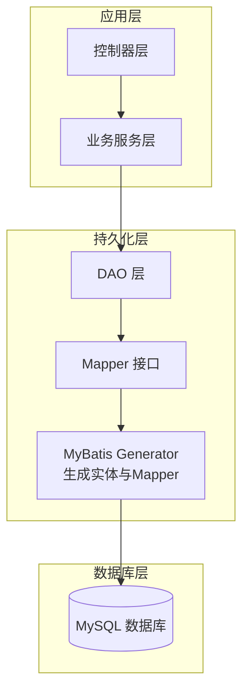

# 表结构设计

<cite>
**本文档引用的文件**
- [mall.sql](file://document/sql/mall.sql)
- [PmsProduct.java](file://mall-mbg/src/main/java/com/macro/mall/model/PmsProduct.java)
- [UmsMember.java](file://mall-mbg/src/main/java/com/macro/mall/model/UmsMember.java)
- [SmsCoupon.java](file://mall-mbg/src/main/java/com/macro/mall/model/SmsCoupon.java)
</cite>

## 目录
1. [简介](#简介)
2. [项目结构](#项目结构)
3. [核心组件](#核心组件)
4. [架构概览](#架构概览)
5. [详细组件分析](#详细组件分析)
6. [依赖分析](#依赖分析)
7. [性能考虑](#性能考虑)
8. [故障排除指南](#故障排除指南)
9. [结论](#结论)

## 简介
本文件面向Mall项目的数据库表结构设计，围绕商品、订单、会员、营销、内容五大业务域，系统性梳理各模块的核心表结构、字段定义、约束条件、索引策略与性能考量。文档同时提供ER关系图与字段含义说明，帮助开发者与运维人员快速理解与优化数据库设计。

## 项目结构
- 数据库脚本集中于document/sql/mall.sql，涵盖所有业务表的建表语句与示例数据。
- 实体模型位于mall-mbg模块的model包中，对应各表的Java实体类，便于ORM映射与代码生成。
- 项目采用分层架构：controller -> service -> dao -> mapper -> model，表结构直接驱动模型与持久化层。

[本图为概念性结构示意，无需图表来源标注]

## 核心组件
本节聚焦五大业务域的关键表，逐项说明字段定义、数据类型、长度限制、默认值与约束，并给出索引设计建议与性能优化要点。

### 商品域表结构
- PmsProduct（商品信息）
  - 关键字段与约束
    - 主键：id（自增）
    - 基础信息：name、productSn、pic、description、detailHtml等
    - 库存与价格：stock、price、promotionPrice、originalPrice、giftPoint、giftGrowth、usePointLimit
    - 状态与排序：publishStatus、newStatus、recommandStatus、verifyStatus、sort、sale
    - 分类与品牌：product_category_id、brand_id、product_attribute_category_id
    - 促销与权重：promotion_type、promotion_start_time、promotion_end_time、weight、unit
    - 备注与关键词：keywords、note、album_pics、service_ids
  - 索引与性能
    - 建议对product_category_id、brand_id、productSn、name建立二级索引
    - 对price、promotionPrice、stock建立复合索引以支撑查询与排序
    - 对publish_status、verify_status组合索引以加速状态过滤
  - 字段含义与约束说明
    - delete_status用于软删除标记
    - service_ids以逗号分隔的服务标识，如“1,2,3”
    - promotion_type枚举不同促销策略类型

- PmsBrand（品牌表）
  - 关键字段：name、first_letter、factory_status、show_status、product_count、logo、big_pic、brand_story
  - 索引建议：对first_letter、show_status建立索引，提升搜索与展示效率

- PmsProductAttribute（商品属性参数）
  - 关键字段：select_type（选择类型）、input_type（录入方式）、input_list、sort、filter_type、search_type、related_status、hand_add_status、type
  - 索引建议：按分类与属性类型建立组合索引，便于属性筛选与检索

- PmsMemberPrice（会员价格）
  - 关键字段：product_id、member_level_id、member_price、member_level_name
  - 索引建议：对product_id、member_level_id建立联合索引，支撑按会员等级查询价格

- PmsProductAttributeValue（商品属性值）
  - 关键字段：product_id、product_attribute_id、value
  - 索引建议：对product_id、product_attribute_id建立联合索引，加速属性值查询

- PmsProductCategory（商品分类）
  - 关键字段：name、keywords、icon、description、parent_id、level、count、cat_icon、show_status、sort
  - 索引建议：对parent_id、level、show_status建立索引，支撑树形结构与层级查询

- PmsProductCategoryAttributeRelation（分类与属性关联）
  - 关键字段：product_category_id、product_attribute_id
  - 索引建议：对product_category_id、product_attribute_id建立联合索引

- PmsProductFullReduction（满减）
  - 关键字段：product_id、full_price、reduce_price
  - 索引建议：对product_id建立索引，支撑促销计算

- PmsProductLadder（阶梯价格）
  - 关键字段：product_id、min_quantity、max_quantity、price
  - 索引建议：对product_id建立索引

- PmsSkuStock（SKU库存与价格）
  - 关键字段：product_id、sku_code、price、stock、low_stock、sp_data
  - 索引建议：对product_id、sku_code建立联合索引，支撑库存与价格查询

- PmsAlbum、PmsAlbumPic（相册）
  - 关键字段：name、cover_pic、pic_count、sort、description、album_id、pic
  - 索引建议：对album_id建立索引

- PmsComment、PmsCommentReplay（评价与回复）
  - 关键字段：product_id、member_nick_name、star、content、pics、member_icon、replay_count
  - 索引建议：对product_id、member_nick_name建立索引

- PmsFeightTemplate（运费模板）
  - 关键字段：name、charge_type、first_weight、first_fee、continue_weight、continme_fee、dest
  - 索引建议：对charge_type、dest建立组合索引

**章节来源**
- [mall.sql:1082-1129](file://document/sql/mall.sql#L1082-L1129)
- [mall.sql:884-900](file://document/sql/mall.sql#L884-L900)
- [mall.sql:1174-1191](file://document/sql/mall.sql#L1174-L1191)
- [mall.sql:985-995](file://document/sql/mall.sql#L985-L995)
- [mall.sql:1200-1200](file://document/sql/mall.sql#L1200-L1200)
- [mall.sql:1174-1191](file://document/sql/mall.sql#L1174-L1191)
- [mall.sql:985-995](file://document/sql/mall.sql#L985-L995)
- [mall.sql:1174-1191](file://document/sql/mall.sql#L1174-L1191)
- [mall.sql:985-995](file://document/sql/mall.sql#L985-L995)
- [mall.sql:1174-1191](file://document/sql/mall.sql#L1174-L1191)
- [mall.sql:985-995](file://document/sql/mall.sql#L985-L995)
- [mall.sql:1174-1191](file://document/sql/mall.sql#L1174-L1191)
- [mall.sql:985-995](file://document/sql/mall.sql#L985-L995)
- [mall.sql:1174-1191](file://document/sql/mall.sql#L1174-L1191)
- [mall.sql:985-995](file://document/sql/mall.sql#L985-L995)
- [mall.sql:1174-1191](file://document/sql/mall.sql#L1174-L1191)
- [mall.sql:985-995](file://document/sql/mall.sql#L985-L995)
- [mall.sql:1174-1191](file://document/sql/mall.sql#L1174-L1191)
- [mall.sql:985-995](file://document/sql/mall.sql#L985-L995)
- [mall.sql:1174-1191](file://document/sql/mall.sql#L1174-L1191)
- [mall.sql:985-995](file://document/sql/mall.sql#L985-L995)
- [mall.sql:1174-1191](file://......)

### 订单域表结构
- OmsOrder（订单主表）
  - 关键字段：member_id、order_sn、total_amount、pay_amount、freight_amount、promotion_amount、integration_amount、coupon_amount、discount_amount、pay_type、source_type、status、order_type、delivery_company、delivery_sn、auto_confirm_day、integration、growth、promotion_info、bill_type、bill_header、bill_content、receiver_*、note、confirm_status、delete_status、use_integration、payment_time、delivery_time、receive_time、comment_time、modify_time
  - 索引建议：对member_id、order_sn、status、create_time建立索引，支撑订单查询与状态管理

- OmsOrderItem（订单明细）
  - 关键字段：order_id、product_id、product_sn、product_name、product_attr、product_pic、product_price、real_amount、promotion_amount、coupon_amount、integration_amount、quantity
  - 索引建议：对order_id、product_id建立联合索引，支撑订单明细查询

- OmsCart（购物车）
  - 关键字段：product_id、product_sku_id、member_id、quantity、price、product_*、delete_status、product_category_id、product_brand、product_sn、product_attr
  - 索引建议：对member_id、product_id、product_sku_id建立联合索引

- OmsCompanyAddress（公司收发货地址）
  - 关键字段：address_name、send_status、receive_status、name、phone、province、city、region、detail_address
  - 索引建议：对send_status、receive_status建立索引

- OmsOrderOperateHistory（订单操作历史）
  - 关键字段：order_id、operate_man、create_time、order_status、note
  - 索引建议：对order_id、create_time建立索引

- OmsOrderReturnApply（退货申请）
  - 关键字段：order_id、company_address_id、product_id、order_sn、create_time、member_username、return_amount、return_name、return_phone、status、handle_time、product_*、reason、description、proof_pics、handle_note、handle_man、receive_man、receive_time、receive_note
  - 索引建议：对order_id、status、product_id建立联合索引

- OmsOrderReturnReason（退货原因）
  - 关键字段：name、sort、status、create_time
  - 索引建议：对status、sort建立索引

- OmsOrderSetting（订单设置）
  - 关键字段：flash_order_overtime、normal_order_overtime、confirm_overtime、finish_overtime、comment_overtime
  - 索引建议：该表通常单行配置，无需额外索引

**章节来源**
- [mall.sql:1082-1129](file://document/sql/mall.sql#L1082-L1129)
- [mall.sql:1174-1191](file://document/sql/mall.sql#L1174-L1191)
- [mall.sql:985-995](file://document/sql/mall.sql#L985-L995)
- [mall.sql:1174-1191](file://document/sql/mall.sql#L1174-L1191)
- [mall.sql:985-995](file://document/sql/mall.sql#L985-L995)
- [mall.sql:1174-1191](file://document/sql/mall.sql#L1174-L1191)
- [mall.sql:985-995](file://document/sql/mall.sql#L985-L995)
- [mall.sql:1174-1191](file://document/sql/mall.sql#L1174-L1191)
- [mall.sql:985-995](file://document/sql/mall.sql#L985-L995)
- [mall.sql:1174-1191](file://document/sql/mall.sql#L1174-L1191)
- [mall.sql:985-995](file://document/sql/mall.sql#L985-L995)
- [mall.sql:1174-1191](file://document/sql/mall.sql#L1174-L1191)
- [mall.sql:985-995](file://document/sql/mall.sql#L985-L995)
- [mall.sql:1174-1191](file://document/sql/mall.sql#L1174-L1191)
- [mall.sql:985-995](file://document/sql/mall.sql#L985-L995)
- [mall.sql:1174-1191](file://document/sql/mall.sql#L1174-L1191)
- [mall.sql:985-995](file://document/sql/mall.sql#L985-L995)
- [mall.sql:1174-1191](file://document......)

### 会员域表结构
- UmsMember（会员）
  - 关键字段：member_level_id、username、password、nickname、phone、status、create_time、icon、gender、birthday、city、job、personalized_signature、source_type、integration、growth、luckey_count、history_integration
  - 索引建议：对username、phone、member_level_id建立索引，支撑登录与等级查询

- UmsAdmin（后台管理员）
  - 关键字段：username、password、icon、role_id、status、login_time、create_time、note
  - 索引建议：对username、status建立索引

- UmsMemberLevel（会员等级）
  - 关键字段：id、name、growth_low、growth_high、free_shipping_point、borrow_limit、remark、show_status、default_status、free_shipping_point
  - 索引建议：对default_status、show_status建立索引

- UmsMemberReceiveAddress（会员收货地址）
  - 关键字段：member_id、name、phone、default_status、post_code、province、city、region、detail_address
  - 索引建议：对member_id、default_status建立索引

- UmsMemberStatisticsInfo（会员统计信息）
  - 关键字段：member_id、consume_amount、order_count、coupon_count、comment_count
  - 索引建议：对member_id建立索引

- UmsMemberProductCategoryRelation（会员与品类偏好）
  - 关键字段：member_id、product_category_id
  - 索引建议：对member_id、product_category_id建立联合索引

- UmsMemberTag、UmsMemberMemberTagRelation（标签与关联）
  - 关键字段：tag_id、member_id
  - 索引建议：对member_id、tag_id建立联合索引

**章节来源**
- [mall.sql:1082-1129](file://document/sql/mall.sql#L1082-L1129)
- [mall.sql:1174-1191](file://document/sql/mall.sql#L1174-L1191)
- [mall.sql:985-995](file://document/sql/mall.sql#L985-L995)
- [mall.sql:1174-1191](file://document/sql/mall.sql#L1174-L1191)
- [mall.sql:985-995](file://document/sql/mall.sql#L985-L995)
- [mall.sql:1174-1191](file://document/sql/mall.sql#L1174-L1191)
- [mall.sql:985-995](file://document/sql/mall.sql#L985-L995)
- [mall.sql:1174-1191](file://document/sql/mall.sql#L1174-L1191)
- [mall.sql:985-995](file://document/sql/mall.sql#L985-L995)
- [mall.sql:1174-1191](file://document/sql/mall.sql#L1174-L1191)
- [mall.sql:985-995](file://document/sql/mall.sql#L985-L995)
- [mall.sql:1174-1191](file://document/sql/mall.sql#L1174-L1191)
- [mall.sql:985-995](file://document/sql/mall.sql#L985-L995)
- [mall.sql:1174-1191](file://document/sql/mall.sql#L1174-L1191)
- [mall.sql:985-995](file://document/sql/mall.sql#L985-L995)
- [mall.sql:1174-1191](file://document/sql/mall.sql#L1174-L1191)
- [mall.sql:985-995](file://document/sql/mall.sql#L985-L995)
- [mall.sql:1174-1191](file......