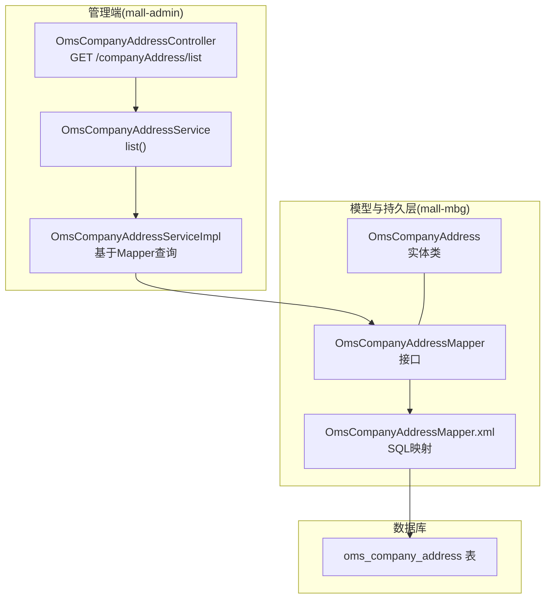
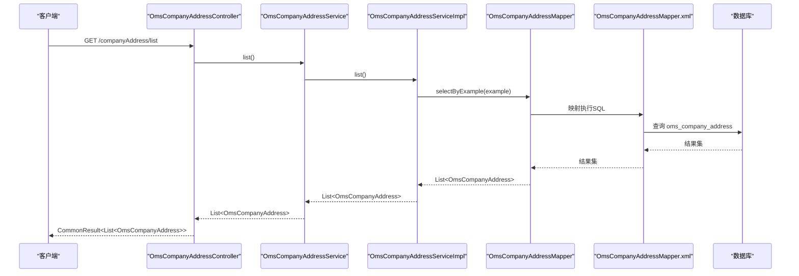
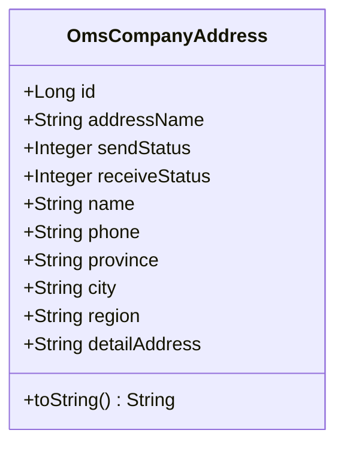
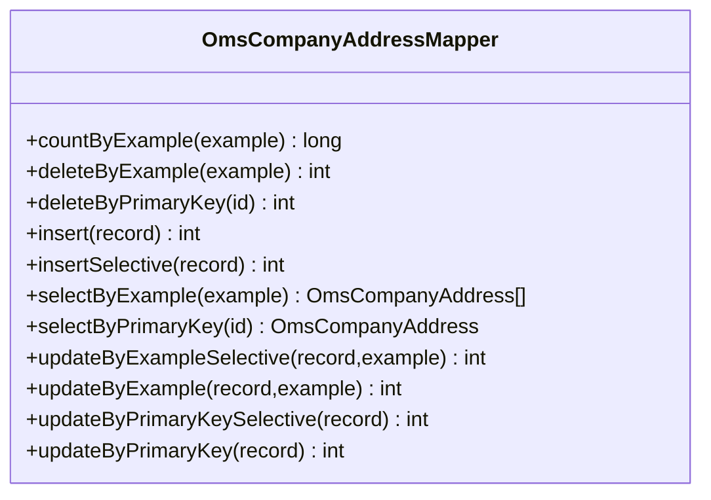
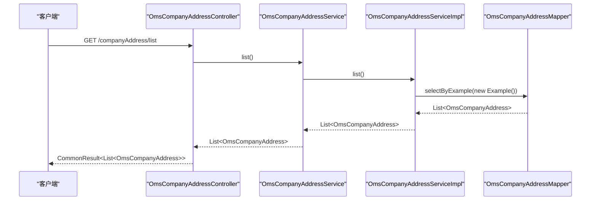
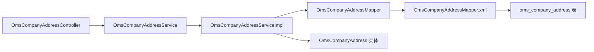

# 公司收发货地址表（OmsCompanyAddress）

<cite>
**本文引用的文件**
- [OmsCompanyAddress.java](file://mall-mbg/src/main/java/com/macro/mall/model/OmsCompanyAddress.java)
- [OmsCompanyAddressMapper.java](file://mall-mbg/src/main/java/com/macro/mall/mapper/OmsCompanyAddressMapper.java)
- [OmsCompanyAddressMapper.xml](file://mall-mbg/src/main/resources/com/macro/mall/mapper/OmsCompanyAddressMapper.xml)
- [OmsCompanyAddressController.java](file://mall-admin/src/main/java/com/macro/mall/controller/OmsCompanyAddressController.java)
- [OmsCompanyAddressService.java](file://mall-admin/src/main/java/com/macro/mall/service/OmsCompanyAddressService.java)
- [OmsCompanyAddressServiceImpl.java](file://mall-admin/src/main/java/com/macro/mall/service/impl/OmsCompanyAddressServiceImpl.java)
- [OmsReceiverInfoParam.java](file://mall-admin/src/main/java/com/macro/mall/dto/OmsReceiverInfoParam.java)
- [OmsOrderService.java](file://mall-admin/src/main/java/com/macro/mall/service/OmsOrderService.java)
- [mall.sql](file://document/sql/mall.sql)
</cite>

## 目录
1. [简介](#简介)
2. [项目结构](#项目结构)
3. [核心组件](#核心组件)
4. [架构总览](#架构总览)
5. [详细组件分析](#详细组件分析)
6. [依赖关系分析](#依赖关系分析)
7. [性能考虑](#性能考虑)
8. [故障排查指南](#故障排查指南)
9. [结论](#结论)
10. [附录](#附录)

## 简介
本文件围绕“公司收发货地址表（OmsCompanyAddress）”进行系统化说明，目标包括：
- 明确设计目的：统一管理公司多个发货仓库与退货地址，支持默认发货/收货地址标识，便于订单履约与物流调度。
- 解释地址字段定义：省市区、详细地址、收发货人姓名、电话号码等。
- 阐述业务逻辑：发货地址选择策略、退货地址配置、物流配送范围等。
- 覆盖地址管理的增删改查与地址有效性验证机制。

当前代码库中，OmsCompanyAddress 的控制器与服务层已具备基础的列表查询能力，但未提供完整的增删改接口与显式的地址有效性校验逻辑。后续可在现有基础上扩展。

## 项目结构
OmsCompanyAddress 涉及的核心模块与文件如下：
- 数据模型与映射：model、mapper 接口与 XML 映射
- 控制器与服务：controller、service 接口与实现
- DTO 参数：接收订单收货人信息的参数对象
- 数据库脚本：表结构与示例数据

**图表来源**
- [OmsCompanyAddressController.java:1-33](file://mall-admin/src/main/java/com/macro/mall/controller/OmsCompanyAddressController.java#L1-L33)
- [OmsCompanyAddressService.java:1-17](file://mall-admin/src/main/java/com/macro/mall/service/OmsCompanyAddressService.java#L1-L17)
- [OmsCompanyAddressServiceImpl.java:1-25](file://mall-admin/src/main/java/com/macro/mall/service/impl/OmsCompanyAddressServiceImpl.java#L1-L25)
- [OmsCompanyAddressMapper.java:1-30](file://mall-mbg/src/main/java/com/macro/mall/mapper/OmsCompanyAddressMapper.java#L1-L30)
- [OmsCompanyAddressMapper.xml:1-291](file://mall-mbg/src/main/resources/com/macro/mall/mapper/OmsCompanyAddressMapper.xml#L1-L291)
- [OmsCompanyAddress.java:1-128](file://mall-mbg/src/main/java/com/macro/mall/model/OmsCompanyAddress.java#L1-L128)

**章节来源**
- [OmsCompanyAddressController.java:1-33](file://mall-admin/src/main/java/com/macro/mall/controller/OmsCompanyAddressController.java#L1-L33)
- [OmsCompanyAddressService.java:1-17](file://mall-admin/src/main/java/com/macro/mall/service/OmsCompanyAddressService.java#L1-L17)
- [OmsCompanyAddressServiceImpl.java:1-25](file://mall-admin/src/main/java/com/macro/mall/service/impl/OmsCompanyAddressServiceImpl.java#L1-L25)
- [OmsCompanyAddressMapper.java:1-30](file://mall-mbg/src/main/java/com/macro/mall/mapper/OmsCompanyAddressMapper.java#L1-L30)
- [OmsCompanyAddressMapper.xml:1-291](file://mall-mbg/src/main/resources/com/macro/mall/mapper/OmsCompanyAddressMapper.xml#L1-L291)
- [OmsCompanyAddress.java:1-128](file://mall-mbg/src/main/java/com/macro/mall/model/OmsCompanyAddress.java#L1-L128)

## 核心组件
- 实体类 OmsCompanyAddress：封装地址表的字段与访问器，支持序列化。
- Mapper 接口与 XML：提供完整的 CRUD 与条件查询能力，映射到数据库表 oms_company_address。
- 控制器与服务：提供地址列表查询接口，服务层通过 Mapper 查询所有记录。

关键字段说明（来源于数据库注释与实体类）：
- 地址名称：address_name
- 默认发货状态：send_status（0 否，1 是）
- 默认收货状态：receive_status（0 否，1 是）
- 收发货人姓名：name
- 电话号码：phone
- 省/直辖市：province
- 市：city
- 区：region
- 详细地址：detail_address

**章节来源**
- [OmsCompanyAddress.java:1-128](file://mall-mbg/src/main/java/com/macro/mall/model/OmsCompanyAddress.java#L1-L128)
- [OmsCompanyAddressMapper.xml:4-15](file://mall-mbg/src/main/resources/com/macro/mall/mapper/OmsCompanyAddressMapper.xml#L4-L15)
- [mall.sql:415-431](file://document/sql/mall.sql#L415-L431)

## 架构总览
从请求到数据库的调用链路如下：

**图表来源**
- [OmsCompanyAddressController.java:26-31](file://mall-admin/src/main/java/com/macro/mall/controller/OmsCompanyAddressController.java#L26-L31)
- [OmsCompanyAddressService.java:15](file://mall-admin/src/main/java/com/macro/mall/service/OmsCompanyAddressService.java#L15)
- [OmsCompanyAddressServiceImpl.java:21-23](file://mall-admin/src/main/java/com/macro/mall/service/impl/OmsCompanyAddressServiceImpl.java#L21-L23)
- [OmsCompanyAddressMapper.java:19](file://mall-mbg/src/main/java/com/macro/mall/mapper/OmsCompanyAddressMapper.java#L19)
- [OmsCompanyAddressMapper.xml:78-91](file://mall-mbg/src/main/resources/com/macro/mall/mapper/OmsCompanyAddressMapper.xml#L78-L91)

## 详细组件分析

### 实体类与数据模型
- 字段与类型：Long id、String addressName、Integer sendStatus、Integer receiveStatus、String name、String phone、String province、String city、String region、String detailAddress。
- 序列化支持：实现 Serializable，便于跨层传输。
- toString 输出：包含所有字段，便于日志与调试。

**图表来源**
- [OmsCompanyAddress.java:5-128](file://mall-mbg/src/main/java/com/macro/mall/model/OmsCompanyAddress.java#L5-L128)

**章节来源**
- [OmsCompanyAddress.java:1-128](file://mall-mbg/src/main/java/com/macro/mall/model/OmsCompanyAddress.java#L1-L128)

### Mapper 接口与 SQL 映射
- 提供的接口方法覆盖：计数、按主键删除、插入、按主键更新、条件查询、分页排序等。
- XML 映射将字段与数据库列一一对应，并提供 where 条件与动态 SQL 片段。
- 支持 selectByExample、updateByExample、updateByPrimaryKeySelective 等灵活查询与更新。

**图表来源**
- [OmsCompanyAddressMapper.java:8-29](file://mall-mbg/src/main/java/com/macro/mall/mapper/OmsCompanyAddressMapper.java#L8-L29)
- [OmsCompanyAddressMapper.xml:4-291](file://mall-mbg/src/main/resources/com/macro/mall/mapper/OmsCompanyAddressMapper.xml#L4-L291)

**章节来源**
- [OmsCompanyAddressMapper.java:1-30](file://mall-mbg/src/main/java/com/macro/mall/mapper/OmsCompanyAddressMapper.java#L1-L30)
- [OmsCompanyAddressMapper.xml:1-291](file://mall-mbg/src/main/resources/com/macro/mall/mapper/OmsCompanyAddressMapper.xml#L1-L291)

### 控制器与服务层
- 控制器提供 /companyAddress/list 接口，返回所有地址列表。
- 服务层接口定义 list 方法，实现类通过 Mapper 查询并返回结果。

**图表来源**
- [OmsCompanyAddressController.java:26-31](file://mall-admin/src/main/java/com/macro/mall/controller/OmsCompanyAddressController.java#L26-L31)
- [OmsCompanyAddressService.java:15](file://mall-admin/src/main/java/com/macro/mall/service/OmsCompanyAddressService.java#L15)
- [OmsCompanyAddressServiceImpl.java:21-23](file://mall-admin/src/main/java/com/macro/mall/service/impl/OmsCompanyAddressServiceImpl.java#L21-L23)

**章节来源**
- [OmsCompanyAddressController.java:1-33](file://mall-admin/src/main/java/com/macro/mall/controller/OmsCompanyAddressController.java#L1-L33)
- [OmsCompanyAddressService.java:1-17](file://mall-admin/src/main/java/com/macro/mall/service/OmsCompanyAddressService.java#L1-L17)
- [OmsCompanyAddressServiceImpl.java:1-25](file://mall-admin/src/main/java/com/macro/mall/service/impl/OmsCompanyAddressServiceImpl.java#L1-L25)

### 地址字段定义与业务含义
- 地址名称：address_name，用于标识该地址用途（如“深圳发货点”、“北京发货点”）。
- 默认发货状态：send_status（0 否，1 是），用于订单生成时选择默认发货仓库。
- 默认收货状态：receive_status（0 否，1 是），用于订单收货地址默认值。
- 收发货人姓名：name，收货联系人姓名。
- 电话号码：phone，收货联系电话。
- 省市区：province、city、region，三级行政区域。
- 详细地址：detail_address，街道门牌等具体位置描述。

以上字段均来自数据库表结构注释与实体类定义。

**章节来源**
- [OmsCompanyAddress.java:8-24](file://mall-mbg/src/main/java/com/macro/mall/model/OmsCompanyAddress.java#L8-L24)
- [mall.sql:419-430](file://document/sql/mall.sql#L419-L430)

### 发货地址选择策略与退货地址配置
- 发货地址选择策略：send_status=1 的记录可作为默认发货仓库；若存在多条默认发货地址，需在业务层明确优先级或按区域/仓配策略选择。
- 退货地址配置：receive_status=1 的记录可作为默认退货地址；同样需要业务层在退货流程中读取并使用。
- 物流配送范围：当前表未包含配送范围字段，建议在业务层结合省市区与外部物流规则进行判断。

说明：以上为基于现有字段的业务解读，实际策略以业务需求为准。

**章节来源**
- [mall.sql:422-423](file://document/sql/mall.sql#L422-L423)
- [OmsCompanyAddress.java:10-12](file://mall-mbg/src/main/java/com/macro/mall/model/OmsCompanyAddress.java#L10-L12)

### 地址有效性验证机制
- 当前实现未发现针对 OmsCompanyAddress 的显式参数校验注解或拦截器。
- 可参考 OmsReceiverInfoParam 中的字段设计，结合业务场景对必填项（如 name、phone、province、city、region、detail_address）进行校验。
- 若需扩展，可在服务层或控制器层增加参数校验与异常处理。

**章节来源**
- [OmsReceiverInfoParam.java:12-22](file://mall-admin/src/main/java/com/macro/mall/dto/OmsReceiverInfoParam.java#L12-L22)

### 地址管理的增删改查操作
- 查询：已实现 list 接口，返回所有地址。
- 新增：Mapper 提供 insert 与 insertSelective，可直接使用。
- 更新：Mapper 提供 updateByPrimaryKey、updateByPrimaryKeySelective、updateByExample、updateByExampleSelective。
- 删除：Mapper 提供 deleteByPrimaryKey 与 deleteByExample。

注意：当前控制器仅暴露了 list 接口，其他 CRUD 接口需在控制器与服务层补充。

**章节来源**
- [OmsCompanyAddressMapper.xml:108-184](file://mall-mbg/src/main/resources/com/macro/mall/mapper/OmsCompanyAddressMapper.xml#L108-L184)
- [OmsCompanyAddressMapper.xml:245-290](file://mall-mbg/src/main/resources/com/macro/mall/mapper/OmsCompanyAddressMapper.xml#L245-L290)
- [OmsCompanyAddressController.java:26-31](file://mall-admin/src/main/java/com/macro/mall/controller/OmsCompanyAddressController.java#L26-L31)

### 与订单系统的集成点
- 订单修改收货人信息：OmsOrderService 提供 updateReceiverInfo 方法，参数类型为 OmsReceiverInfoParam，包含收货人姓名、电话、省市区、详细地址等字段。
- 订单发货：OmsOrderService 提供 delivery 方法，参数类型为 OmsOrderDeliveryParam，用于批量发货。

这表明订单系统在收货人信息与发货环节会依赖地址数据，OmsCompanyAddress 可作为发货仓库与退货地址的数据来源之一。

**章节来源**
- [OmsOrderService.java:44-45](file://mall-admin/src/main/java/com/macro/mall/service/OmsOrderService.java#L44-L45)
- [OmsReceiverInfoParam.java:12-22](file://mall-admin/src/main/java/com/macro/mall/dto/OmsReceiverInfoParam.java#L12-L22)

## 依赖关系分析
- 控制器依赖服务接口，服务实现依赖 Mapper 接口。
- Mapper 通过 XML 映射访问数据库表 oms_company_address。
- 实体类与 Mapper 接口通过 MyBatis 进行字段映射。

**图表来源**
- [OmsCompanyAddressController.java:23-24](file://mall-admin/src/main/java/com/macro/mall/controller/OmsCompanyAddressController.java#L23-L24)
- [OmsCompanyAddressService.java:11-16](file://mall-admin/src/main/java/com/macro/mall/service/OmsCompanyAddressService.java#L11-L16)
- [OmsCompanyAddressServiceImpl.java:18-19](file://mall-admin/src/main/java/com/macro/mall/service/impl/OmsCompanyAddressServiceImpl.java#L18-L19)
- [OmsCompanyAddressMapper.java:8-29](file://mall-mbg/src/main/java/com/macro/mall/mapper/OmsCompanyAddressMapper.java#L8-L29)
- [OmsCompanyAddressMapper.xml:4-15](file://mall-mbg/src/main/resources/com/macro/mall/mapper/OmsCompanyAddressMapper.xml#L4-L15)

**章节来源**
- [OmsCompanyAddressController.java:1-33](file://mall-admin/src/main/java/com/macro/mall/controller/OmsCompanyAddressController.java#L1-L33)
- [OmsCompanyAddressService.java:1-17](file://mall-admin/src/main/java/com/macro/mall/service/OmsCompanyAddressService.java#L1-L17)
- [OmsCompanyAddressServiceImpl.java:1-25](file://mall-admin/src/main/java/com/macro/mall/service/impl/OmsCompanyAddressServiceImpl.java#L1-L25)
- [OmsCompanyAddressMapper.java:1-30](file://mall-mbg/src/main/java/com/macro/mall/mapper/OmsCompanyAddressMapper.java#L1-L30)
- [OmsCompanyAddressMapper.xml:1-291](file://mall-mbg/src/main/resources/com/macro/mall/mapper/OmsCompanyAddressMapper.xml#L1-L291)

## 性能考虑
- 查询优化：使用 selectByExample 时建议根据常用过滤条件（如 send_status/receive_status）建立索引，减少全表扫描。
- 写入优化：insertSelective 在部分字段为空时可避免冗余写入，适合动态表单提交。
- 分页与排序：Mapper 已支持 orderByClause，建议在业务层传入合理排序字段，避免大数据量下的排序开销。
- 缓存策略：对于不频繁变更的地址列表，可在服务层引入缓存以降低数据库压力。

## 故障排查指南
- 列表查询无结果：检查数据库中是否存在数据，确认 Mapper XML 的 selectByExample 是否正确映射。
- 插入失败：检查字段长度与非空约束，确保 address_name、name、phone、province、city、region、detail_address 等字段满足要求。
- 更新无效：确认传入的 id 是否正确，updateByPrimaryKeySelective 仅更新非空字段，避免误判。
- 参数校验缺失：如需对必填字段进行校验，可在服务层或控制器层增加校验逻辑与异常处理。

**章节来源**
- [OmsCompanyAddressMapper.xml:78-91](file://mall-mbg/src/main/resources/com/macro/mall/mapper/OmsCompanyAddressMapper.xml#L78-L91)
- [OmsCompanyAddressMapper.xml:108-184](file://mall-mbg/src/main/resources/com/macro/mall/mapper/OmsCompanyAddressMapper.xml#L108-L184)
- [OmsCompanyAddressMapper.xml:245-290](file://mall-mbg/src/main/resources/com/macro/mall/mapper/OmsCompanyAddressMapper.xml#L245-L290)

## 结论
OmsCompanyAddress 表为公司发货仓库与退货地址提供了统一的数据载体，当前实现了基础的地址列表查询能力。建议后续扩展：
- 完善 CRUD 接口（新增、编辑、删除）并在控制器与服务层落地。
- 引入地址有效性校验与默认地址策略（send_status/receive_status）。
- 结合订单系统在发货与退货流程中使用该表数据，完善发货仓库选择与退货地址配置。

## 附录

### 数据库表结构（节选）
- 表名：oms_company_address
- 字段：id、address_name、send_status、receive_status、name、phone、province、city、region、detail_address

**章节来源**
- [mall.sql:415-431](file://document/sql/mall.sql#L415-L431)