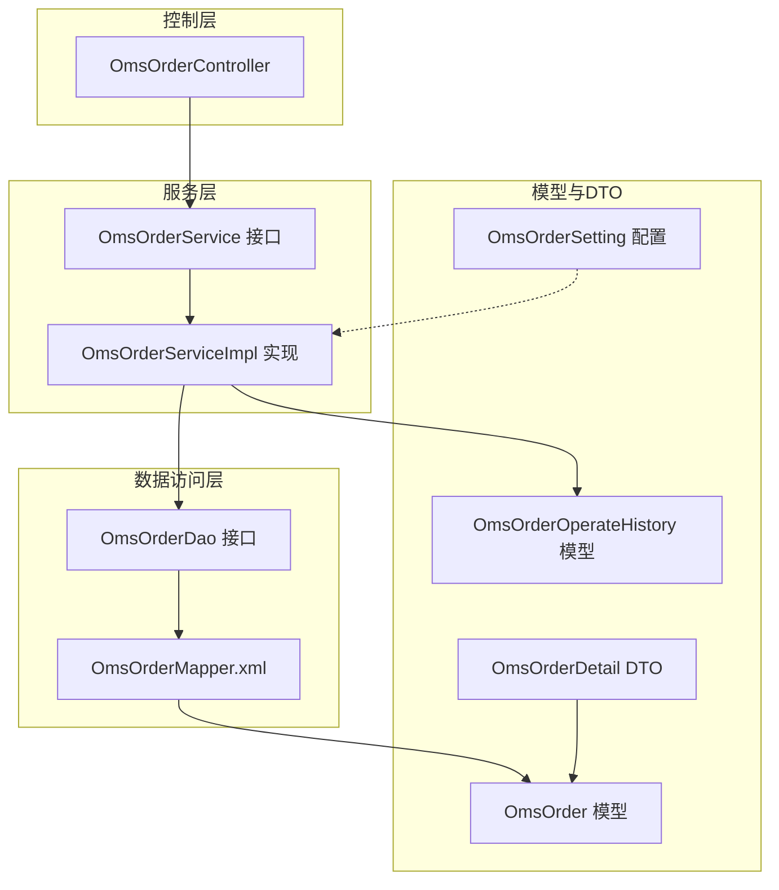
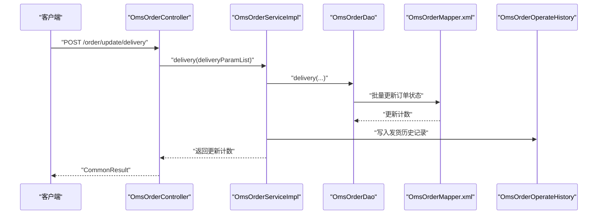
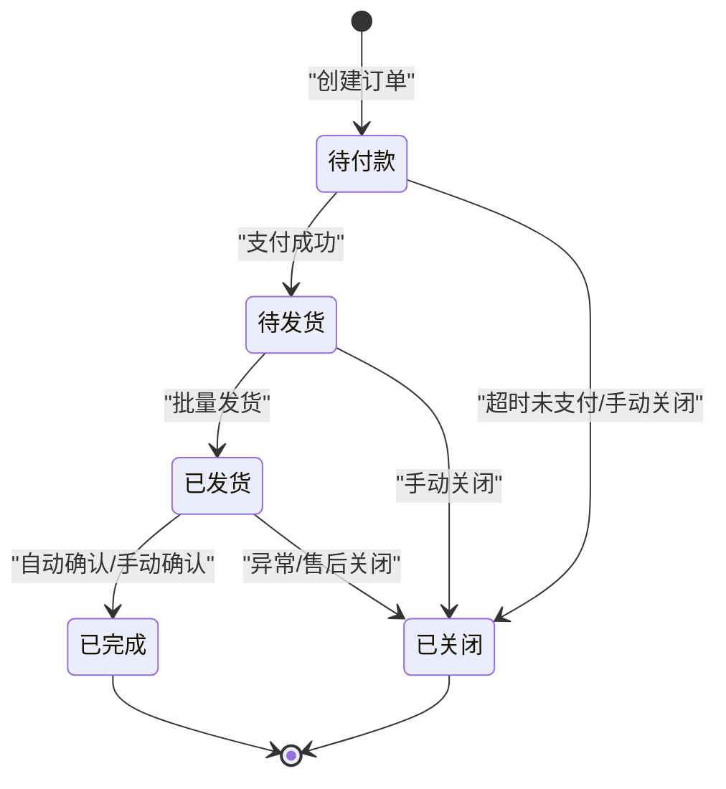
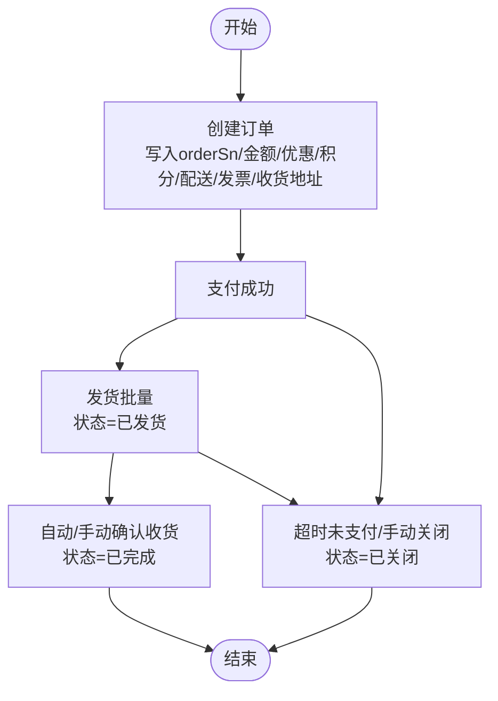
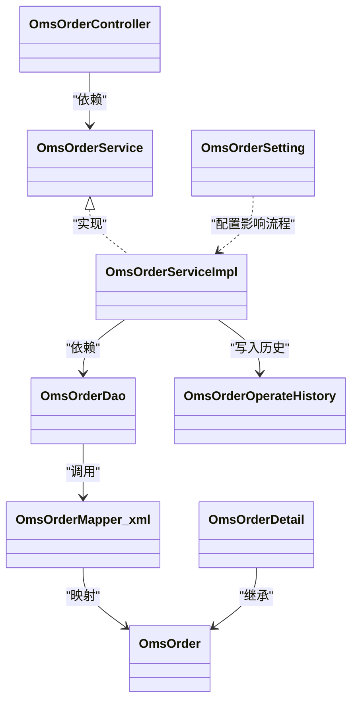

# 订单主表（OmsOrder）

<cite>
**本文引用的文件**
- [OmsOrder.java](file://mall-mbg/src/main/java/com/macro/mall/model/OmsOrder.java)
- [OmsOrderMapper.xml](file://mall-mbg/src/main/resources/com/macro/mall/mapper/OmsOrderMapper.xml)
- [OmsOrderController.java](file://mall-admin/src/main/java/com/macro/mall/controller/OmsOrderController.java)
- [OmsOrderService.java](file://mall-admin/src/main/java/com/macro/mall/service/OmsOrderService.java)
- [OmsOrderServiceImpl.java](file://mall-admin/src/main/java/com/macro/mall/service/impl/OmsOrderServiceImpl.java)
- [OmsOrderDao.java](file://mall-admin/src/main/java/com/macro/mall/dao/OmsOrderDao.java)
- [OmsOrderDetail.java](file://mall-admin/src/main/java/com/macro/mall/dto/OmsOrderDetail.java)
- [OmsUpdateStatusParam.java](file://mall-admin/src/main/java/com/macro/mall/dto/OmsUpdateStatusParam.java)
- [OmsOrderOperateHistory.java](file://mall-mbg/src/main/java/com/macro/mall/model/OmsOrderOperateHistory.java)
- [OmsOrderSetting.java](file://mall-mbg/src/main/java/com/macro/mall/model/OmsOrderSetting.java)
- [mall.pdm（PDM注释）](file://document/pdm/mall.pdm)
</cite>

## 目录
1. [引言](#引言)
2. [项目结构](#项目结构)
3. [核心组件](#核心组件)
4. [架构总览](#架构总览)
5. [详细组件分析](#详细组件分析)
6. [依赖分析](#依赖分析)
7. [性能考虑](#性能考虑)
8. [故障排查指南](#故障排查指南)
9. [结论](#结论)
10. [附录](#附录)

## 引言
本文件围绕订单主表（OmsOrder）进行系统化、分层次的技术文档编写，目标读者既包括技术人员也包括非技术背景的业务人员。文档覆盖字段定义与业务含义、订单状态流转机制、订单编号生成规则、支付与配送信息、优惠与积分使用、订单创建/修改/删除的业务逻辑，以及状态变更的触发条件与影响范围。

## 项目结构
- 模型层：OmsOrder 及其映射文件 OmsOrderMapper.xml 负责订单主表的持久化映射。
- 控制器层：OmsOrderController 提供订单列表、发货、关闭、删除、详情、收货人信息与费用信息修改、备注更新等接口。
- 服务层：OmsOrderService 接口与 OmsOrderServiceImpl 实现类承载订单业务逻辑，含批量发货、批量关闭、删除、详情查询、信息修改及操作历史记录。
- DTO 层：OmsOrderDetail 用于返回订单详情（含订单项与操作历史），OmsUpdateStatusParam 用于状态更新参数。
- 历史与配置：OmsOrderOperateHistory 记录订单操作历史；OmsOrderSetting 提供订单超时配置（如确认、完成、评论等）。

**图表来源**
- [OmsOrderController.java:22-103](file://mall-admin/src/main/java/com/macro/mall/controller/OmsOrderController.java#L22-L103)
- [OmsOrderService.java:13-58](file://mall-admin/src/main/java/com/macro/mall/service/OmsOrderService.java#L13-L58)
- [OmsOrderServiceImpl.java:24-153](file://mall-admin/src/main/java/com/macro/mall/service/impl/OmsOrderServiceImpl.java#L24-L153)
- [OmsOrderDao.java:15-30](file://mall-admin/src/main/java/com/macro/mall/dao/OmsOrderDao.java#L15-L30)
- [OmsOrderMapper.xml:4-49](file://mall-mbg/src/main/resources/com/macro/mall/mapper/OmsOrderMapper.xml#L4-L49)
- [OmsOrder.java:7-96](file://mall-mbg/src/main/java/com/macro/mall/model/OmsOrder.java#L7-L96)
- [OmsOrderDetail.java:15-22](file://mall-admin/src/main/java/com/macro/mall/dto/OmsOrderDetail.java#L15-L22)
- [OmsOrderOperateHistory.java:6-19](file://mall-mbg/src/main/java/com/macro/mall/model/OmsOrderOperateHistory.java#L6-L19)
- [OmsOrderSetting.java:5-18](file://mall-mbg/src/main/java/com/macro/mall/model/OmsOrderSetting.java#L5-L18)

**章节来源**
- [OmsOrderController.java:22-103](file://mall-admin/src/main/java/com/macro/mall/controller/OmsOrderController.java#L22-L103)
- [OmsOrderService.java:13-58](file://mall-admin/src/main/java/com/macro/mall/service/OmsOrderService.java#L13-L58)
- [OmsOrderServiceImpl.java:24-153](file://mall-admin/src/main/java/com/macro/mall/service/impl/OmsOrderServiceImpl.java#L24-L153)
- [OmsOrderDao.java:15-30](file://mall-admin/src/main/java/com/macro/mall/dao/OmsOrderDao.java#L15-L30)
- [OmsOrderMapper.xml:4-49](file://mall-mbg/src/main/resources/com/macro/mall/mapper/OmsOrderMapper.xml#L4-L49)
- [OmsOrder.java:7-96](file://mall-mbg/src/main/java/com/macro/mall/model/OmsOrder.java#L7-L96)
- [OmsOrderDetail.java:15-22](file://mall-admin/src/main/java/com/macro/mall/dto/OmsOrderDetail.java#L15-L22)
- [OmsOrderOperateHistory.java:6-19](file://mall-mbg/src/main/java/com/macro/mall/model/OmsOrderOperateHistory.java#L6-L19)
- [OmsOrderSetting.java:5-18](file://mall-mbg/src/main/java/com/macro/mall/model/OmsOrderSetting.java#L5-L18)

## 核心组件
- 订单主表模型（OmsOrder）：定义订单主表所有字段及其 getter/setter，涵盖会员信息、金额构成、支付与来源、状态、订单类型、配送信息、发票信息、收货地址、积分与成长值、促销信息、时间戳等。
- 订单映射（OmsOrderMapper.xml）：MyBatis 映射文件，定义字段到数据库列的映射、基础查询、插入与更新语句。
- 订单控制器（OmsOrderController）：提供订单列表、批量发货、批量关闭、删除、详情、收货人信息修改、费用信息修改、备注更新等接口。
- 订单服务（OmsOrderService/OmsOrderServiceImpl）：封装订单业务逻辑，包括批量发货写入操作历史、批量关闭写入历史、删除标记、详情查询、信息修改与历史记录。
- 订单详情DTO（OmsOrderDetail）：在订单基础上扩展订单项列表与操作历史列表。
- 订单操作历史（OmsOrderOperateHistory）：记录每次状态变更的操作人、时间、新状态与备注。
- 订单设置（OmsOrderSetting）：提供订单超时配置（如确认、完成、评论等），用于业务流程自动推进或提醒。

**章节来源**
- [OmsOrder.java:7-96](file://mall-mbg/src/main/java/com/macro/mall/model/OmsOrder.java#L7-L96)
- [OmsOrderMapper.xml:4-49](file://mall-mbg/src/main/resources/com/macro/mall/mapper/OmsOrderMapper.xml#L4-L49)
- [OmsOrderController.java:26-102](file://mall-admin/src/main/java/com/macro/mall/controller/OmsOrderController.java#L26-L102)
- [OmsOrderService.java:13-58](file://mall-admin/src/main/java/com/macro/mall/service/OmsOrderService.java#L13-L58)
- [OmsOrderServiceImpl.java:42-152](file://mall-admin/src/main/java/com/macro/mall/service/impl/OmsOrderServiceImpl.java#L42-L152)
- [OmsOrderDetail.java:15-22](file://mall-admin/src/main/java/com/macro/mall/dto/OmsOrderDetail.java#L15-L22)
- [OmsOrderOperateHistory.java:6-19](file://mall-mbg/src/main/java/com/macro/mall/model/OmsOrderOperateHistory.java#L6-L19)
- [OmsOrderSetting.java:5-18](file://mall-mbg/src/main/java/com/macro/mall/model/OmsOrderSetting.java#L5-L18)

## 架构总览
订单模块采用经典的分层架构：
- 控制层负责对外暴露接口；
- 服务层编排业务流程并维护事务边界；
- 数据访问层通过 MyBatis 将实体映射到数据库；
- 模型与DTO承载数据结构，历史表记录关键动作轨迹；
- 设置表为流程自动化提供配置支撑。

**图表来源**
- [OmsOrderController.java:35-43](file://mall-admin/src/main/java/com/macro/mall/controller/OmsOrderController.java#L35-L43)
- [OmsOrderServiceImpl.java:42-58](file://mall-admin/src/main/java/com/macro/mall/service/impl/OmsOrderServiceImpl.java#L42-L58)
- [OmsOrderDao.java:22-24](file://mall-admin/src/main/java/com/macro/mall/dao/OmsOrderDao.java#L22-L24)
- [OmsOrderMapper.xml:646-780](file://mall-mbg/src/main/resources/com/macro/mall/mapper/OmsOrderMapper.xml#L646-L780)
- [OmsOrderOperateHistory.java:6-19](file://mall-mbg/src/main/java/com/macro/mall/model/OmsOrderOperateHistory.java#L6-L19)

## 详细组件分析

### 字段定义与业务含义
以下字段来自模型与映射文件，按功能归类说明（字段名与含义对应映射文件中的列名）：

- 基础标识与时间
  - id：主键
  - orderSn：订单编号
  - createTime：创建时间
  - modifyTime：最后修改时间
- 会员与来源
  - memberId：会员ID
  - memberUsername：会员用户名
  - sourceType：订单来源（0：PC；1：APP）
- 金额与优惠
  - totalAmount：订单总金额
  - payAmount：应付金额
  - freightAmount：运费
  - promotionAmount：促销优惠
  - integrationAmount：积分抵扣
  - couponAmount：优惠券抵扣
  - discountAmount：折扣金额
  - useIntegration：本次使用积分
  - integration：可用积分
  - growth：成长值
- 支付与状态
  - payType：支付方式（0：未支付；1：支付宝；2：微信）
  - status：订单状态（0：待付款；1：待发货；2：已发货；3：已完成；4：已关闭；5：无效）
  - orderType：订单类型（0：普通；1：秒杀）
  - confirmStatus：确认状态（0：未确认；1：已确认）
  - deleteStatus：删除状态（0：未删除；1：已删除）
- 配送信息
  - deliveryCompany：物流公司
  - deliverySn：物流单号
  - autoConfirmDay：自动确认收货天数
  - deliveryTime：发货时间
  - receiveTime：收货时间
- 发票与收货地址
  - billType：发票类型
  - billHeader：发票抬头
  - billContent：发票内容
  - billReceiverPhone：发票接收人手机号
  - billReceiverEmail：发票接收人邮箱
  - receiverName：收货人姓名
  - receiverPhone：收货人电话
  - receiverPostCode：收货人邮编
  - receiverProvince：省
  - receiverCity：市
  - receiverRegion：区
  - receiverDetailAddress：详细地址
- 备注与时间
  - note：备注
  - paymentTime：支付时间
  - commentTime：评论时间

上述字段均在模型与映射文件中一一对应，确保数据库与Java对象的一致性。

**章节来源**
- [OmsOrder.java:8-96](file://mall-mbg/src/main/java/com/macro/mall/model/OmsOrder.java#L8-L96)
- [OmsOrderMapper.xml:4-49](file://mall-mbg/src/main/resources/com/macro/mall/mapper/OmsOrderMapper.xml#L4-L49)

### 订单状态流转机制
根据PDM注释与服务实现，订单状态定义如下：
- 0：待付款
- 1：待发货
- 2：已发货
- 3：已完成
- 4：已关闭
- 5：无效订单

状态流转的关键触发点与实现：
- 批量发货：将状态从“待发货”（1）更新为“已发货”（2），并写入操作历史。
- 批量关闭：将状态从“待付款/待发货”等更新为“已关闭”（4），并写入历史。
- 删除：仅打上删除标记（deleteStatus=1），不改变状态。
- 确认收货：服务层提供状态更新参数DTO，可配合业务流程推进至“已完成”。

**图表来源**
- [mall.pdm（PDM注释）:15012-15021](file://document/pdm/mall.pdm#L15012-L15021)
- [OmsOrderServiceImpl.java:42-78](file://mall-admin/src/main/java/com/macro/mall/service/impl/OmsOrderServiceImpl.java#L42-L78)

**章节来源**
- [mall.pdm（PDM注释）:15012-15021](file://document/pdm/mall.pdm#L15012-L15021)
- [OmsOrderServiceImpl.java:42-78](file://mall-admin/src/main/java/com/macro/mall/service/impl/OmsOrderServiceImpl.java#L42-L78)

### 订单编号生成规则
- 订单编号（orderSn）由模型字段定义并在插入时写入，但仓库中未提供具体生成策略代码片段。
- 建议遵循唯一性与可读性原则：结合时间戳、序列号或雪花算法生成，避免并发冲突。

**章节来源**
- [OmsOrder.java](file://mall-mbg/src/main/java/com/macro/mall/model/OmsOrder.java#L14)
- [OmsOrderMapper.xml:147-181](file://mall-mbg/src/main/resources/com/macro/mall/mapper/OmsOrderMapper.xml#L147-L181)

### 支付方式与来源类型
- 支付方式（payType）：0未支付；1支付宝；2微信。
- 订单来源（sourceType）：0PC；1APP。
- 订单类型（orderType）：0普通；1秒杀。

这些字段用于区分业务渠道与支付渠道，便于统计与对账。

**章节来源**
- [OmsOrder.java:34-40](file://mall-mbg/src/main/java/com/macro/mall/model/OmsOrder.java#L34-L40)
- [OmsOrderMapper.xml:18-21](file://mall-mbg/src/main/resources/com/macro/mall/mapper/OmsOrderMapper.xml#L18-L21)
- [mall.pdm（PDM注释）:15000-15008](file://document/pdm/mall.pdm#L15000-L15008)

### 配送信息与自动确认
- 物流公司与单号：deliveryCompany、deliverySn。
- 自动确认天数：autoConfirmDay，结合订单设置（OmsOrderSetting）可用于自动完成流程。
- 发货/收货时间：deliveryTime、receiveTime。

**章节来源**
- [OmsOrder.java:42-46](file://mall-mbg/src/main/java/com/macro/mall/model/OmsOrder.java#L42-L46)
- [OmsOrderMapper.xml:22-26](file://mall-mbg/src/main/resources/com/macro/mall/mapper/OmsOrderMapper.xml#L22-L26)
- [OmsOrderSetting.java:8-16](file://mall-mbg/src/main/java/com/macro/mall/model/OmsOrderSetting.java#L8-L16)

### 优惠与积分使用
- 优惠维度：promotionAmount（促销）、couponAmount（优惠券）、discountAmount（折扣）、integrationAmount（积分抵扣）。
- 积分与成长值：integration、growth、useIntegration。
- 业务建议：在下单时计算各维度金额，确保应付金额=总金额-优惠-积分抵扣+运费。

**章节来源**
- [OmsOrder.java:20-32](file://mall-mbg/src/main/java/com/macro/mall/model/OmsOrder.java#L20-L32)
- [OmsOrderMapper.xml:11-17](file://mall-mbg/src/main/resources/com/macro/mall/mapper/OmsOrderMapper.xml#L11-L17)

### 发票信息
- 发票类型（billType）、抬头（billHeader）、内容（billContent）、接收人手机（billReceiverPhone）、邮箱（billReceiverEmail）。
- 用于订单结算与合规开票。

**章节来源**
- [OmsOrder.java:54-62](file://mall-mbg/src/main/java/com/macro/mall/model/OmsOrder.java#L54-L62)
- [OmsOrderMapper.xml:28-32](file://mall-mbg/src/main/resources/com/macro/mall/mapper/OmsOrderMapper.xml#L28-L32)

### 订单创建、修改、删除的业务逻辑
- 创建：通过插入订单记录（含orderSn、金额、优惠、积分、配送、发票、收货地址等），并写入初始状态（通常为“待付款”）。
- 修改：
  - 收货人信息：支持批量修改收货人姓名、电话、地址等，并记录历史。
  - 费用信息：支持修改运费、折扣等，并记录历史。
  - 备注：支持修改订单备注与状态并记录历史。
- 删除：仅更新删除标记（deleteStatus=1），不物理删除，便于审计与恢复。

**图表来源**
- [OmsOrderServiceImpl.java:42-78](file://mall-admin/src/main/java/com/macro/mall/service/impl/OmsOrderServiceImpl.java#L42-L78)
- [OmsOrderServiceImpl.java:95-152](file://mall-admin/src/main/java/com/macro/mall/service/impl/OmsOrderServiceImpl.java#L95-L152)

**章节来源**
- [OmsOrderServiceImpl.java:42-152](file://mall-admin/src/main/java/com/macro/mall/service/impl/OmsOrderServiceImpl.java#L42-L152)

### 订单状态变更的触发条件与影响范围
- 触发条件
  - 批量发货：调用发货接口后，状态从“待发货”变为“已发货”，并记录历史。
  - 批量关闭：调用关闭接口后，状态变为“已关闭”，并记录历史。
  - 修改信息：修改收货人/费用/备注会写入历史，但不改变状态（除非显式传入状态）。
  - 删除：仅打删除标记，不影响状态。
- 影响范围
  - 前端展示：状态变化影响订单列表与详情页的UI与交互。
  - 后台运营：状态变化驱动后续流程（如发货、售后、财务结算）。
  - 历史追踪：所有状态变更均写入操作历史，便于审计与问题定位。

**章节来源**
- [OmsOrderController.java:35-102](file://mall-admin/src/main/java/com/macro/mall/controller/OmsOrderController.java#L35-L102)
- [OmsOrderServiceImpl.java:42-152](file://mall-admin/src/main/java/com/macro/mall/service/impl/OmsOrderServiceImpl.java#L42-L152)
- [OmsOrderOperateHistory.java:6-19](file://mall-mbg/src/main/java/com/macro/mall/model/OmsOrderOperateHistory.java#L6-L19)

## 依赖分析
- 控制器依赖服务接口，服务实现依赖DAO与Mapper XML。
- 订单详情DTO继承订单模型，扩展订单项与历史列表。
- 操作历史模型独立存在，被服务实现写入。
- 订单设置模型为流程自动化提供配置依据。

**图表来源**
- [OmsOrderController.java:23-24](file://mall-admin/src/main/java/com/macro/mall/controller/OmsOrderController.java#L23-L24)
- [OmsOrderService.java:13-18](file://mall-admin/src/main/java/com/macro/mall/service/OmsOrderService.java#L13-L18)
- [OmsOrderServiceImpl.java:26-33](file://mall-admin/src/main/java/com/macro/mall/service/impl/OmsOrderServiceImpl.java#L26-L33)
- [OmsOrderDao.java:15-19](file://mall-admin/src/main/java/com/macro/mall/dao/OmsOrderDao.java#L15-L19)
- [OmsOrderMapper.xml:4-49](file://mall-mbg/src/main/resources/com/macro/mall/mapper/OmsOrderMapper.xml#L4-L49)
- [OmsOrder.java:7-96](file://mall-mbg/src/main/java/com/macro/mall/model/OmsOrder.java#L7-L96)
- [OmsOrderDetail.java:15-22](file://mall-admin/src/main/java/com/macro/mall/dto/OmsOrderDetail.java#L15-L22)
- [OmsOrderOperateHistory.java:6-19](file://mall-mbg/src/main/java/com/macro/mall/model/OmsOrderOperateHistory.java#L6-L19)
- [OmsOrderSetting.java:5-18](file://mall-mbg/src/main/java/com/macro/mall/model/OmsOrderSetting.java#L5-L18)

**章节来源**
- [OmsOrderController.java:23-24](file://mall-admin/src/main/java/com/macro/mall/controller/OmsOrderController.java#L23-L24)
- [OmsOrderService.java:13-18](file://mall-admin/src/main/java/com/macro/mall/service/OmsOrderService.java#L13-L18)
- [OmsOrderServiceImpl.java:26-33](file://mall-admin/src/main/java/com/macro/mall/service/impl/OmsOrderServiceImpl.java#L26-L33)
- [OmsOrderDao.java:15-19](file://mall-admin/src/main/java/com/macro/mall/dao/OmsOrderDao.java#L15-L19)
- [OmsOrderMapper.xml:4-49](file://mall-mbg/src/main/resources/com/macro/mall/mapper/OmsOrderMapper.xml#L4-L49)
- [OmsOrder.java:7-96](file://mall-mbg/src/main/java/com/macro/mall/model/OmsOrder.java#L7-L96)
- [OmsOrderDetail.java:15-22](file://mall-admin/src/main/java/com/macro/mall/dto/OmsOrderDetail.java#L15-L22)
- [OmsOrderOperateHistory.java:6-19](file://mall-mbg/src/main/java/com/macro/mall/model/OmsOrderOperateHistory.java#L6-L19)
- [OmsOrderSetting.java:5-18](file://mall-mbg/src/main/java/com/macro/mall/model/OmsOrderSetting.java#L5-L18)

## 性能考虑
- 分页查询：服务层使用分页插件，建议在订单列表接口合理设置分页大小与排序字段。
- 批量操作：批量发货与批量关闭使用批量更新，减少网络往返与事务开销。
- 历史记录：每次状态变更写入历史，建议对历史表建立索引（如orderId、orderStatus、createTime）以提升查询效率。
- 金额计算：在下单与修改费用时，建议在服务层统一计算，避免重复计算与不一致。

## 故障排查指南
- 状态未变更
  - 检查控制器是否正确调用服务方法（发货/关闭/删除）。
  - 检查服务实现中的条件（如deleteStatus=0）是否满足。
- 历史记录缺失
  - 确认服务实现是否调用了历史写入逻辑。
- 金额不一致
  - 对照模型字段与业务计算逻辑，核对优惠、积分、运费与应付金额的关系。
- 发票或收货信息错误
  - 检查修改接口是否正确传入参数并写入历史。

**章节来源**
- [OmsOrderController.java:35-102](file://mall-admin/src/main/java/com/macro/mall/controller/OmsOrderController.java#L35-L102)
- [OmsOrderServiceImpl.java:42-152](file://mall-admin/src/main/java/com/macro/mall/service/impl/OmsOrderServiceImpl.java#L42-L152)
- [OmsOrderOperateHistory.java:6-19](file://mall-mbg/src/main/java/com/macro/mall/model/OmsOrderOperateHistory.java#L6-L19)

## 结论
OmsOrder 主表通过清晰的字段划分与完善的业务流程支持，实现了从创建、支付、发货、确认到完成/关闭的全链路管理。服务层在关键节点写入操作历史，保障了可追溯性；控制器提供丰富的接口，满足后台管理需求。建议在实际部署中完善订单编号生成策略、优化历史表索引与分页查询性能，并在业务流程中充分利用订单设置表的超时配置。

## 附录
- 订单状态对照（来源于PDM注释）
  - 0：待付款
  - 1：待发货
  - 2：已发货
  - 3：已完成
  - 4：已关闭
  - 5：无效订单

**章节来源**
- [mall.pdm（PDM注释）:15012-15021](file://document/pdm/mall.pdm#L15012-L15021)