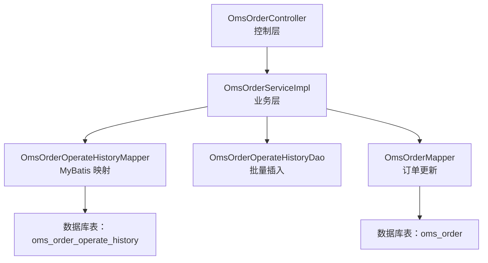
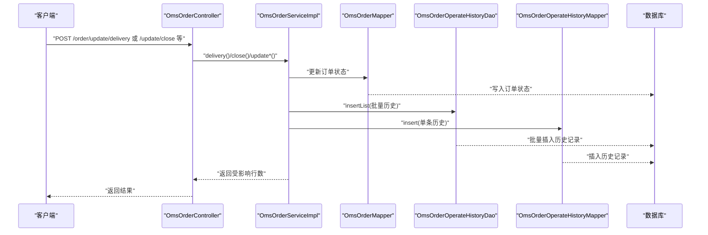
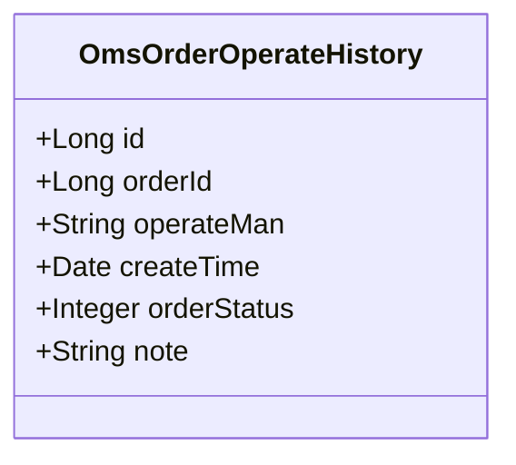
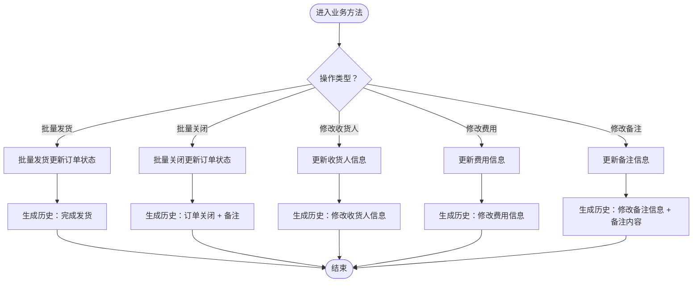
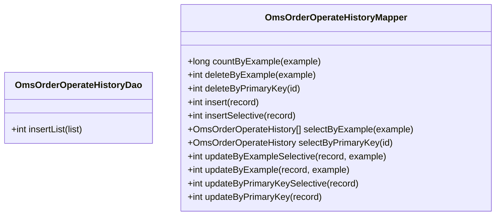
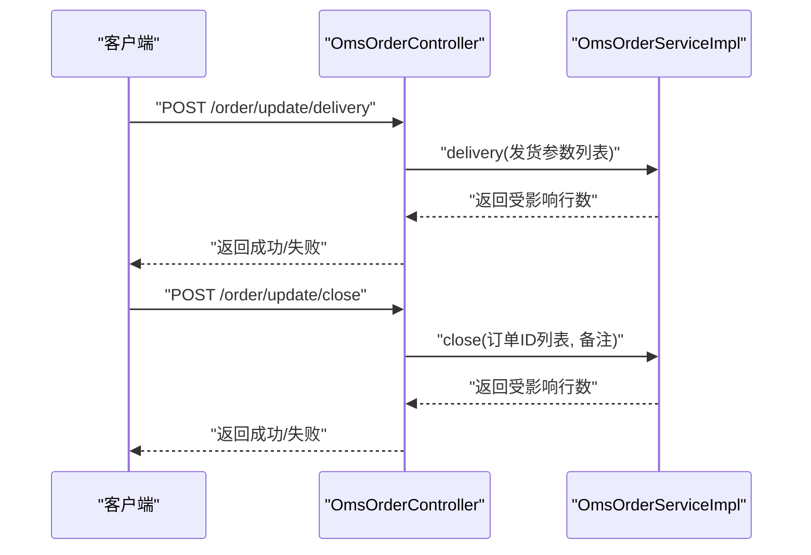
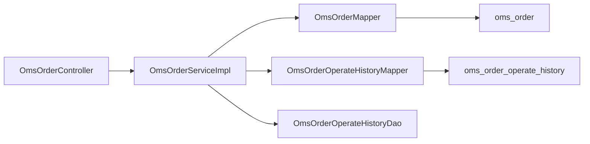

# 订单操作历史表（OmsOrderOperateHistory）

<cite>
**本文引用的文件**
- [OmsOrderOperateHistory.java](file://mall-mbg/src/main/java/com/macro/mall/model/OmsOrderOperateHistory.java)
- [OmsOrderOperateHistoryMapper.java](file://mall-mbg/src/main/java/com/macro/mall/mapper/OmsOrderOperateHistoryMapper.java)
- [OmsOrderOperateHistoryMapper.xml](file://mall-mbg/src/main/resources/com/macro/mall/mapper/OmsOrderOperateHistoryMapper.xml)
- [OmsOrderOperateHistoryDao.java](file://mall-admin/src/main/java/com/macro/mall/dao/OmsOrderOperateHistoryDao.java)
- [OmsOrderService.java](file://mall-admin/src/main/java/com/macro/mall/service/OmsOrderService.java)
- [OmsOrderServiceImpl.java](file://mall-admin/src/main/java/com/macro/mall/service/impl/OmsOrderServiceImpl.java)
- [OmsOrderController.java](file://mall-admin/src/main/java/com/macro/mall/controller/OmsOrderController.java)
- [OmsOrder.java](file://mall-mbg/src/main/java/com/macro/mall/model/OmsOrder.java)
- [OmsOrderSetting.java](file://mall-mbg/src/main/java/com/macro/mall/model/OmsOrderSetting.java)
- [mall.sql](file://document/sql/mall.sql)
</cite>

## 目录
1. [引言](#引言)
2. [项目结构](#项目结构)
3. [核心组件](#核心组件)
4. [架构总览](#架构总览)
5. [详细组件分析](#详细组件分析)
6. [依赖分析](#依赖分析)
7. [性能考虑](#性能考虑)
8. [故障排查指南](#故障排查指南)
9. [结论](#结论)
10. [附录](#附录)

## 引言
本文件围绕订单操作历史表（OmsOrderOperateHistory）进行系统化说明，目标是帮助读者理解该表在订单全生命周期审计中的作用，掌握历史记录如何追踪订单状态变更、人工干预与系统自动处理的记录机制，并提供历史查询与统计分析的实现思路。文档同时给出关键流程的时序图与类图，便于不同背景的读者快速把握。

## 项目结构
- 模型层：OmsOrderOperateHistory 为历史记录实体，OmsOrder 为订单实体，二者通过 orderId 关联。
- 映射层：MyBatis 提供 OmsOrderOperateHistoryMapper 接口与 XML 映射文件，支持通用 CRUD 与条件查询。
- 数据访问扩展：OmsOrderOperateHistoryDao 定义批量插入能力，用于批量操作场景（如批量发货）。
- 业务层：OmsOrderServiceImpl 在关键状态变更处生成历史记录，确保审计可追溯。
- 控制层：OmsOrderController 提供对外接口，触发状态变更与历史记录生成。

图表来源
- [OmsOrderController.java:1-104](file://mall-admin/src/main/java/com/macro/mall/controller/OmsOrderController.java#L1-L104)
- [OmsOrderServiceImpl.java:1-154](file://mall-admin/src/main/java/com/macro/mall/service/impl/OmsOrderServiceImpl.java#L1-L154)
- [OmsOrderOperateHistoryMapper.java:1-30](file://mall-mbg/src/main/java/com/macro/mall/mapper/OmsOrderOperateHistoryMapper.java#L1-L30)
- [OmsOrderOperateHistoryDao.java:1-18](file://mall-admin/src/main/java/com/macro/mall/dao/OmsOrderOperateHistoryDao.java#L1-L18)
- [OmsOrderOperateHistoryMapper.xml:1-226](file://mall-mbg/src/main/resources/com/macro/mall/mapper/OmsOrderOperateHistoryMapper.xml#L1-L226)
- [OmsOrder.java:1-504](file://mall-mbg/src/main/java/com/macro/mall/model/OmsOrder.java#L1-L504)

章节来源
- [OmsOrderController.java:1-104](file://mall-admin/src/main/java/com/macro/mall/controller/OmsOrderController.java#L1-L104)
- [OmsOrderServiceImpl.java:1-154](file://mall-admin/src/main/java/com/macro/mall/service/impl/OmsOrderServiceImpl.java#L1-L154)
- [OmsOrderOperateHistory.java:1-85](file://mall-mbg/src/main/java/com/macro/mall/model/OmsOrderOperateHistory.java#L1-L85)
- [OmsOrderOperateHistoryMapper.java:1-30](file://mall-mbg/src/main/java/com/macro/mall/mapper/OmsOrderOperateHistoryMapper.java#L1-L30)
- [OmsOrderOperateHistoryMapper.xml:1-226](file://mall-mbg/src/main/resources/com/macro/mall/mapper/OmsOrderOperateHistoryMapper.xml#L1-L226)
- [OmsOrderOperateHistoryDao.java:1-18](file://mall-admin/src/main/java/com/macro/mall/dao/OmsOrderOperateHistoryDao.java#L1-L18)
- [OmsOrder.java:1-504](file://mall-mbg/src/main/java/com/macro/mall/model/OmsOrder.java#L1-L504)

## 核心组件
- 实体模型：OmsOrderOperateHistory
  - 字段：id、orderId、operateMan、createTime、orderStatus、note
  - 作用：记录每次订单状态变更或重要操作的历史快照，便于审计与回溯
- 映射接口与 XML：OmsOrderOperateHistoryMapper
  - 能力：通用查询、分页、条件更新、批量插入等
- 扩展 DAO：OmsOrderOperateHistoryDao
  - 能力：批量插入历史记录，适配批量发货等场景
- 业务服务：OmsOrderServiceImpl
  - 在关键状态变更（如发货、关闭、修改信息、修改备注）后生成历史记录
- 控制器：OmsOrderController
  - 对外暴露状态变更接口，触发业务层处理与历史记录生成

章节来源
- [OmsOrderOperateHistory.java:1-85](file://mall-mbg/src/main/java/com/macro/mall/model/OmsOrderOperateHistory.java#L1-L85)
- [OmsOrderOperateHistoryMapper.java:1-30](file://mall-mbg/src/main/java/com/macro/mall/mapper/OmsOrderOperateHistoryMapper.java#L1-L30)
- [OmsOrderOperateHistoryMapper.xml:1-226](file://mall-mbg/src/main/resources/com/macro/mall/mapper/OmsOrderOperateHistoryMapper.xml#L1-L226)
- [OmsOrderOperateHistoryDao.java:1-18](file://mall-admin/src/main/java/com/macro/mall/dao/OmsOrderOperateHistoryDao.java#L1-L18)
- [OmsOrderServiceImpl.java:1-154](file://mall-admin/src/main/java/com/macro/mall/service/impl/OmsOrderServiceImpl.java#L1-L154)
- [OmsOrderController.java:1-104](file://mall-admin/src/main/java/com/macro/mall/controller/OmsOrderController.java#L1-L104)

## 架构总览
下图展示了从控制器到业务层、再到数据访问层与数据库的历史记录生成路径，体现“状态变更即记录”的审计策略。

图表来源
- [OmsOrderController.java:35-102](file://mall-admin/src/main/java/com/macro/mall/controller/OmsOrderController.java#L35-L102)
- [OmsOrderServiceImpl.java:42-152](file://mall-admin/src/main/java/com/macro/mall/service/impl/OmsOrderServiceImpl.java#L42-L152)
- [OmsOrderOperateHistoryDao.java:12-17](file://mall-admin/src/main/java/com/macro/mall/dao/OmsOrderOperateHistoryDao.java#L12-L17)
- [OmsOrderOperateHistoryMapper.java:15-29](file://mall-mbg/src/main/java/com/macro/mall/mapper/OmsOrderOperateHistoryMapper.java#L15-L29)

## 详细组件分析

### 实体类与表结构
- 字段说明
  - id：历史记录唯一标识
  - orderId：关联的订单编号
  - operateMan：操作人（如“后台管理员”），用于审计责任人
  - createTime：记录创建时间，用于排序与统计
  - orderStatus：订单状态值，用于审计状态变迁
  - note：备注信息，记录具体操作描述
- 表结构要点
  - 历史表仅记录“事实”，不存储冗余业务数据
  - 通过 orderId 与订单表建立关联，便于跨表审计

图表来源
- [OmsOrderOperateHistory.java:6-85](file://mall-mbg/src/main/java/com/macro/mall/model/OmsOrderOperateHistory.java#L6-L85)

章节来源
- [OmsOrderOperateHistory.java:1-85](file://mall-mbg/src/main/java/com/macro/mall/model/OmsOrderOperateHistory.java#L1-L85)
- [mall.sql:691-720](file://document/sql/mall.sql#L691-L720)

### 业务层历史生成逻辑
- 批量发货：delivery()
  - 先执行批量发货更新，再批量生成“完成发货”历史
- 批量关闭：close()
  - 更新订单状态为“已关闭”，批量生成“订单关闭: 备注”历史
- 修改收货人信息：updateReceiverInfo()
  - 更新订单后生成“修改收货人信息”历史
- 修改费用信息：updateMoneyInfo()
  - 更新订单后生成“修改费用信息”历史
- 修改备注：updateNote()
  - 更新订单备注后生成“修改备注信息：...”历史

图表来源
- [OmsOrderServiceImpl.java:42-152](file://mall-admin/src/main/java/com/macro/mall/service/impl/OmsOrderServiceImpl.java#L42-L152)

章节来源
- [OmsOrderServiceImpl.java:1-154](file://mall-admin/src/main/java/com/macro/mall/service/impl/OmsOrderServiceImpl.java#L1-L154)

### 数据访问层与批量插入
- OmsOrderOperateHistoryDao
  - 提供 insertList(...) 批量插入能力，用于批量发货等场景
- OmsOrderOperateHistoryMapper
  - 提供 select、insert、update、delete 等通用能力，支持按条件查询与排序

图表来源
- [OmsOrderOperateHistoryDao.java:12-17](file://mall-admin/src/main/java/com/macro/mall/dao/OmsOrderOperateHistoryDao.java#L12-L17)
- [OmsOrderOperateHistoryMapper.java:8-29](file://mall-mbg/src/main/java/com/macro/mall/mapper/OmsOrderOperateHistoryMapper.java#L8-L29)

章节来源
- [OmsOrderOperateHistoryDao.java:1-18](file://mall-admin/src/main/java/com/macro/mall/dao/OmsOrderOperateHistoryDao.java#L1-L18)
- [OmsOrderOperateHistoryMapper.java:1-30](file://mall-mbg/src/main/java/com/macro/mall/mapper/OmsOrderOperateHistoryMapper.java#L1-L30)
- [OmsOrderOperateHistoryMapper.xml:1-226](file://mall-mbg/src/main/resources/com/macro/mall/mapper/OmsOrderOperateHistoryMapper.xml#L1-L226)

### 控制层接口与调用链
- 控制层提供批量发货、批量关闭、修改收货人、修改费用、修改备注等接口
- 接口调用后由业务层统一生成历史记录，保证一致性

图表来源
- [OmsOrderController.java:35-53](file://mall-admin/src/main/java/com/macro/mall/controller/OmsOrderController.java#L35-L53)
- [OmsOrderServiceImpl.java:42-78](file://mall-admin/src/main/java/com/macro/mall/service/impl/OmsOrderServiceImpl.java#L42-L78)

章节来源
- [OmsOrderController.java:1-104](file://mall-admin/src/main/java/com/macro/mall/controller/OmsOrderController.java#L1-L104)
- [OmsOrderService.java:1-59](file://mall-admin/src/main/java/com/macro/mall/service/OmsOrderService.java#L1-L59)

## 依赖分析
- 组件耦合
  - 控制层依赖业务层接口，避免直接操作数据库
  - 业务层同时依赖订单映射与历史映射，形成“状态变更+历史记录”的双写
- 外部依赖
  - MyBatis 提供 ORM 能力，XML 中定义了条件查询与批量插入
  - 数据库层面，历史表与订单表通过 orderId 建立关联，便于审计

图表来源
- [OmsOrderController.java:23-24](file://mall-admin/src/main/java/com/macro/mall/controller/OmsOrderController.java#L23-L24)
- [OmsOrderServiceImpl.java:26-33](file://mall-admin/src/main/java/com/macro/mall/service/impl/OmsOrderServiceImpl.java#L26-L33)
- [OmsOrderOperateHistoryMapper.xml:3-11](file://mall-mbg/src/main/resources/com/macro/mall/mapper/OmsOrderOperateHistoryMapper.xml#L3-L11)

章节来源
- [OmsOrderController.java:1-104](file://mall-admin/src/main/java/com/macro/mall/controller/OmsOrderController.java#L1-L104)
- [OmsOrderServiceImpl.java:1-154](file://mall-admin/src/main/java/com/macro/mall/service/impl/OmsOrderServiceImpl.java#L1-L154)
- [OmsOrderOperateHistoryMapper.xml:1-226](file://mall-mbg/src/main/resources/com/macro/mall/mapper/OmsOrderOperateHistoryMapper.xml#L1-L226)

## 性能考虑
- 批量插入优化
  - 批量发货场景使用 insertList(...) 批量写入历史，减少往返开销
- 查询与排序
  - 历史表按 createTime 排序，适合分页与趋势分析
- 索引建议
  - 建议在 orderId、createTime 上建立索引，提升按订单检索与时间范围查询效率
- 写入压力
  - 历史表写入频率与订单变更频率相关，建议结合业务峰值评估数据库写入能力

## 故障排查指南
- 常见问题
  - 历史记录缺失：确认业务方法是否正确生成并插入历史记录
  - 操作人为空：检查 operateMan 是否被正确赋值（如“后台管理员”）
  - 状态不一致：核对 orderStatus 与订单状态更新是否同步发生
- 排查步骤
  - 通过订单 ID 查询历史记录，确认 createTime、operateMan、orderStatus、note 是否符合预期
  - 对比订单表状态与历史记录，定位异常环节
- 相关实现参考
  - 批量发货与批量关闭的历史生成位置
  - 修改信息与备注的历史生成位置

章节来源
- [OmsOrderServiceImpl.java:42-152](file://mall-admin/src/main/java/com/macro/mall/service/impl/OmsOrderServiceImpl.java#L42-L152)
- [OmsOrderOperateHistoryMapper.xml:73-86](file://mall-mbg/src/main/resources/com/macro/mall/mapper/OmsOrderOperateHistoryMapper.xml#L73-L86)

## 结论
OmsOrderOperateHistory 通过“状态变更即记录”的策略，为订单全生命周期提供了完整的审计轨迹。业务层在关键节点生成历史记录，配合 MyBatis 的通用查询与批量插入能力，能够满足历史查询与统计分析的需求。通过合理的索引与批量写入策略，可在高并发场景下保持良好的性能与一致性。

## 附录

### 字段与状态说明
- 字段
  - id：历史记录主键
  - orderId：关联订单编号
  - operateMan：操作人（如“后台管理员”）
  - createTime：记录创建时间
  - orderStatus：订单状态值
  - note：操作备注
- 状态来源
  - 订单状态值来源于订单实体的状态字段，业务层在不同操作中设置对应的状态值
  - 订单设置表用于配置超时等规则，与历史记录无直接字段对应，但影响状态流转时机

章节来源
- [OmsOrderOperateHistory.java:1-85](file://mall-mbg/src/main/java/com/macro/mall/model/OmsOrderOperateHistory.java#L1-L85)
- [OmsOrder.java:38-224](file://mall-mbg/src/main/java/com/macro/mall/model/OmsOrder.java#L38-L224)
- [OmsOrderSetting.java:1-84](file://mall-mbg/src/main/java/com/macro/mall/model/OmsOrderSetting.java#L1-L84)