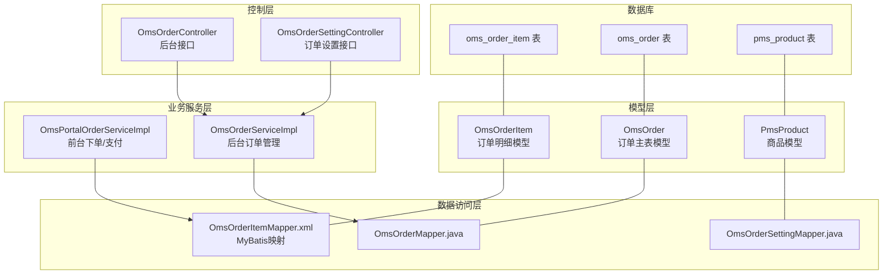
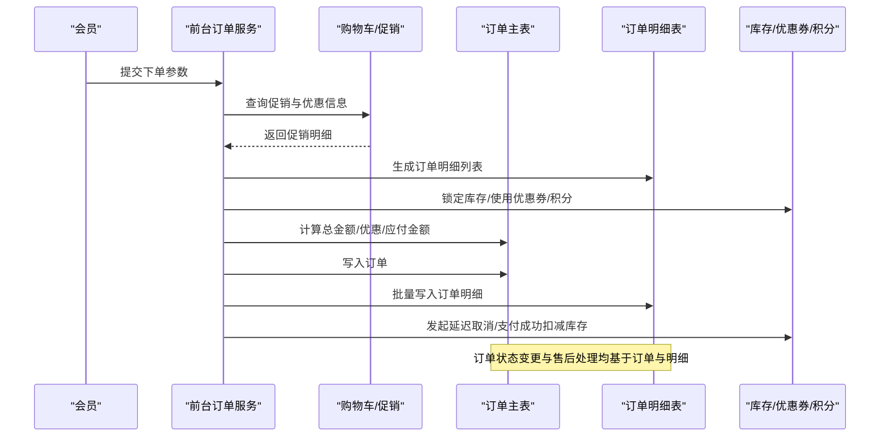
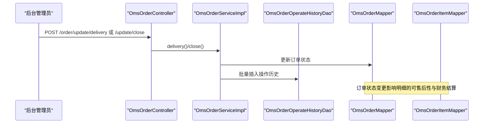
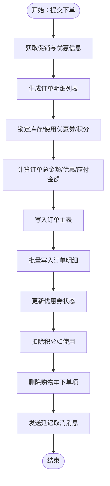
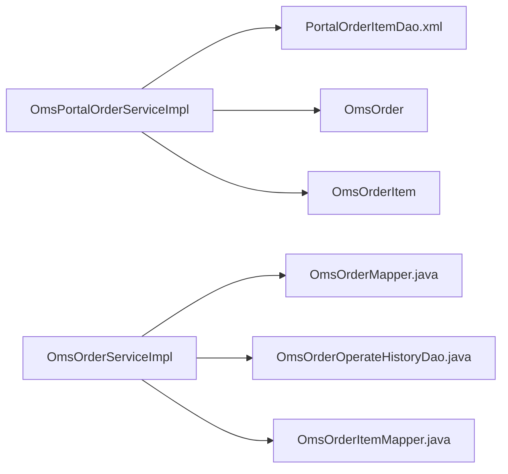

# 订单明细表（OmsOrderItem）

<cite>
**本文引用的文件**
- [OmsOrderItem.java](file://mall-mbg/src/main/java/com/macro/mall/model/OmsOrderItem.java)
- [OmsOrderItemMapper.java](file://mall-mbg/src/main/java/com/macro/mall/mapper/OmsOrderItemMapper.java)
- [OmsOrderItemMapper.xml](file://mall-mbg/src/main/resources/com/macro/mall/mapper/OmsOrderItemMapper.xml)
- [OmsOrder.java](file://mall-mbg/src/main/java/com/macro/mall/model/OmsOrder.java)
- [OmsOrderMapper.java](file://mall-mbg/src/main/java/com/macro/mall/mapper/OmsOrderMapper.java)
- [PmsProduct.java](file://mall-mbg/src/main/java/com/macro/mall/model/PmsProduct.java)
- [OmsOrderOperateHistory.java](file://mall-mbg/src/main/java/com/macro/mall/model/OmsOrderOperateHistory.java)
- [OmsOrderOperateHistoryDao.java](file://mall-mbg/src/main/java/com/macro/mall/dao/OmsOrderOperateHistoryDao.java)
- [OmsOrderDao.java](file://mall-mbg/src/main/java/com/macro/mall/dao/OmsOrderDao.java)
- [OmsPortalOrderServiceImpl.java](file://mall-portal/src/main/java/com/macro/mall/portal/service/impl/OmsPortalOrderServiceImpl.java)
- [PortalOrderItemDao.java](file://mall-portal/src/main/java/com/macro/mall/portal/dao/PortalOrderItemDao.java)
- [PortalOrderItemDao.xml](file://mall-portal/src/main/resources/dao/PortalOrderItemDao.xml)
- [OmsOrderController.java](file://mall-admin/src/main/java/com/macro/mall/controller/OmsOrderController.java)
- [OmsOrderServiceImpl.java](file://mall-admin/src/main/java/com/macro/mall/service/impl/OmsOrderServiceImpl.java)
- [OmsOrderSettingController.java](file://mall-admin/src/main/java/com/macro/mall/controller/OmsOrderSettingController.java)
- [OmsOrderSettingService.java](file://mall-admin/src/main/java/com/macro/mall/service/OmsOrderSettingService.java)
- [OmsOrderSettingServiceImpl.java](file://mall-admin/src/main/java/com/macro/mall/service/impl/OmsOrderSettingServiceImpl.java)
- [OmsOrderSettingMapper.java](file://mall-mbg/src/main/java/com/macro/mall/mapper/OmsOrderSettingMapper.java)
- [mall.sql](file://document/sql/mall.sql)
</cite>

## 目录
1. [引言](#引言)
2. [项目结构](#项目结构)
3. [核心组件](#核心组件)
4. [架构总览](#架构总览)
5. [详细组件分析](#详细组件分析)
6. [依赖分析](#依赖分析)
7. [性能考虑](#性能考虑)
8. [故障排查指南](#故障排查指南)
9. [结论](#结论)
10. [附录](#附录)

## 引言
本文件围绕订单明细表（OmsOrderItem）展开，系统化阐述其设计目的、结构特征、与订单主表（OmsOrder）和商品表（PmsProduct）的关联关系，详解订单明细中的商品信息、数量、单价、总价、规格属性等字段的作用，并结合订单状态变更、退货处理、售后维护等典型场景，说明订单明细在业务流程中的关键作用。同时，给出订单明细数据的生成时机、更新机制与数据一致性保障策略，帮助读者全面理解该表在电商系统中的定位与实现。

## 项目结构
- 数据模型层：OmsOrderItem、OmsOrder、PmsProduct 等实体模型定义于 mall-mbg 模块。
- 数据访问层：MyBatis 映射器（OmsOrderItemMapper、OmsOrderMapper、OmsOrderSettingMapper 等）与 XML 映射文件位于 mall-mbg 的 resources 下。
- 业务服务层：前台下单与支付流程由 mall-portal 的 OmsPortalOrderServiceImpl 实现；后台订单管理由 mall-admin 的 OmsOrderServiceImpl 实现。
- 控制器层：mall-admin 提供订单管理接口（OmsOrderController），mall-portal 提供前台订单接口（OmsPortalOrderController）。
- 数据库脚本：document/sql/mall.sql 中包含 oms_order_item 表结构与示例数据。

图表来源
- [OmsOrderItem.java:1-250](file://mall-mbg/src/main/java/com/macro/mall/model/OmsOrderItem.java#L1-L250)
- [OmsOrderItemMapper.java:1-30](file://mall-mbg/src/main/java/com/macro/mall/mapper/OmsOrderItemMapper.java#L1-L30)
- [OmsOrderItemMapper.xml:1-464](file://mall-mbg/src/main/resources/com/macro/mall/mapper/OmsOrderItemMapper.xml#L1-L464)
- [OmsOrder.java:1-200](file://mall-mbg/src/main/java/com/macro/mall/model/OmsOrder.java#L1-L200)
- [OmsOrderMapper.java:1-30](file://mall-mbg/src/main/java/com/macro/mall/mapper/OmsOrderMapper.java#L1-L30)
- [PmsProduct.java:1-200](file://mall-mbg/src/main/java/com/macro/mall/model/PmsProduct.java#L1-L200)
- [OmsOrderServiceImpl.java:1-154](file://mall-admin/src/main/java/com/macro/mall/service/impl/OmsOrderServiceImpl.java#L1-L154)
- [OmsPortalOrderServiceImpl.java:95-314](file://mall-portal/src/main/java/com/macro/mall/portal/service/impl/OmsPortalOrderServiceImpl.java#L95-L314)
- [OmsOrderController.java:1-70](file://mall-admin/src/main/java/com/macro/mall/controller/OmsOrderController.java#L1-L70)
- [OmsOrderSettingController.java:1-38](file://mall-admin/src/main/java/com/macro/mall/controller/OmsOrderSettingController.java#L1-L38)

章节来源
- [OmsOrderItem.java:1-250](file://mall-mbg/src/main/java/com/macro/mall/model/OmsOrderItem.java#L1-L250)
- [OmsOrderItemMapper.xml:1-464](file://mall-mbg/src/main/resources/com/macro/mall/mapper/OmsOrderItemMapper.xml#L1-L464)
- [mall.sql:561-588](file://document/sql/mall.sql#L561-L588)

## 核心组件
- 订单明细模型（OmsOrderItem）：封装单个订单项的完整信息，包括订单标识、商品标识、SKU 信息、数量、单价、优惠拆分、实付金额、赠品积分/成长值、销售属性等。
- 订单主表（OmsOrder）：记录订单整体状态、金额汇总、收货人信息、支付与发货状态等。
- 商品模型（PmsProduct）：提供商品基础信息（名称、品牌、类别、价格等），用于下单时填充明细。
- 前台订单服务（OmsPortalOrderServiceImpl）：负责从购物车聚合促销信息，生成订单明细，计算优惠与实付金额，写入订单与订单明细表。
- 后台订单服务（OmsOrderServiceImpl）：负责订单状态变更（发货、关闭、备注修改等），并记录操作历史。
- 订单明细映射（OmsOrderItemMapper.xml）：提供订单明细的增删改查能力，支持批量插入。

章节来源
- [OmsOrderItem.java:1-250](file://mall-mbg/src/main/java/com/macro/mall/model/OmsOrderItem.java#L1-L250)
- [OmsOrder.java:1-200](file://mall-mbg/src/main/java/com/macro/mall/model/OmsOrder.java#L1-L200)
- [PmsProduct.java:1-200](file://mall-mbg/src/main/java/com/macro/mall/model/PmsProduct.java#L1-L200)
- [OmsPortalOrderServiceImpl.java:95-314](file://mall-portal/src/main/java/com/macro/mall/portal/service/impl/OmsPortalOrderServiceImpl.java#L95-L314)
- [OmsOrderServiceImpl.java:1-154](file://mall-admin/src/main/java/com/macro/mall/service/impl/OmsOrderServiceImpl.java#L1-L154)
- [OmsOrderItemMapper.xml:1-464](file://mall-mbg/src/main/resources/com/macro/mall/mapper/OmsOrderItemMapper.xml#L1-L464)

## 架构总览
订单明细贯穿“下单—支付—发货—售后—完结”的全链路，是订单状态流转与财务结算的最小颗粒。

图表来源
- [OmsPortalOrderServiceImpl.java:95-314](file://mall-portal/src/main/java/com/macro/mall/portal/service/impl/OmsPortalOrderServiceImpl.java#L95-L314)
- [PortalOrderItemDao.xml:1-22](file://mall-portal/src/main/resources/dao/PortalOrderItemDao.xml#L1-L22)
- [OmsOrderServiceImpl.java:1-154](file://mall-admin/src/main/java/com/macro/mall/service/impl/OmsOrderServiceImpl.java#L1-L154)

## 详细组件分析

### 订单明细表（OmsOrderItem）结构与字段解析
- 关联字段
  - 订单标识：orderId/orderSn，用于将明细与订单主表关联。
  - 商品标识：productId/productSkuId，指向商品与SKU。
  - 分类标识：productCategoryId，便于统计与运营分析。
- 商品信息字段
  - 商品名称、品牌、货号、图片等，用于展示与售后核对。
- 数量与价格
  - productQuantity：购买数量。
  - productPrice：下单时的销售单价。
- 优惠与实付
  - promotionName/promotionAmount：促销拆分金额。
  - couponAmount：优惠券拆分金额。
  - integrationAmount：积分抵扣拆分金额。
  - realAmount：该商品最终应付金额（单价×数量 - 优惠拆分）。
- 赠品与属性
  - giftIntegration/giftGrowth：该商品赠送的积分/成长值。
  - productAttr：JSON格式的销售属性，如颜色、容量等，便于售后与退换货核验。

章节来源
- [OmsOrderItem.java:1-250](file://mall-mbg/src/main/java/com/macro/mall/model/OmsOrderItem.java#L1-L250)
- [OmsOrderItemMapper.xml:4-26](file://mall-mbg/src/main/resources/com/macro/mall/mapper/OmsOrderItemMapper.xml#L4-L26)
- [mall.sql:561-588](file://document/sql/mall.sql#L561-L588)

### 与订单主表（OmsOrder）的关联关系
- 一对多关系：一个订单可包含多个订单明细。
- 关键关联：OmsOrderItem 的 orderId/orderSn 与 OmsOrder 的 id/orderSn 对应。
- 金额汇总：订单主表的总金额、优惠、应付金额由各明细的 realAmount 与各类优惠拆分累加得出。

章节来源
- [OmsOrder.java:1-200](file://mall-mbg/src/main/java/com/macro/mall/model/OmsOrder.java#L1-L200)
- [OmsOrderMapper.java:1-30](file://mall-mbg/src/main/java/com/macro/mall/mapper/OmsOrderMapper.java#L1-L30)
- [OmsOrderItemMapper.xml:105-110](file://mall-mbg/src/main/resources/com/macro/mall/mapper/OmsOrderItemMapper.xml#L105-L110)

### 与商品表（PmsProduct）的关联关系
- 商品维度：通过 productId/productSkuId 将订单明细与商品/SKU绑定，确保下单时的价格、属性、品牌、类别等信息被固化。
- 属性一致性：productAttr 字段存储销售属性，便于售后与财务对账。

章节来源
- [PmsProduct.java:1-200](file://mall-mbg/src/main/java/com/macro/mall/model/PmsProduct.java#L1-L200)
- [OmsPortalOrderServiceImpl.java:95-124](file://mall-portal/src/main/java/com/macro/mall/portal/service/impl/OmsPortalOrderServiceImpl.java#L95-L124)

### 订单明细在典型业务场景中的作用

#### 订单状态变更
- 发货：后台调用发货接口，批量更新订单状态并记录操作历史（oms_order_operate_history），明细作为订单的组成部分随订单状态联动。
- 关闭/删除：后台关闭或逻辑删除订单时，明细随之失效，便于后续审计与报表。

图表来源
- [OmsOrderController.java:35-53](file://mall-admin/src/main/java/com/macro/mall/controller/OmsOrderController.java#L35-L53)
- [OmsOrderServiceImpl.java:42-78](file://mall-admin/src/main/java/com/macro/mall/service/impl/OmsOrderServiceImpl.java#L42-L78)
- [OmsOrderOperateHistoryDao.java:1-18](file://mall-mbg/src/main/java/com/macro/mall/dao/OmsOrderOperateHistoryDao.java#L1-L18)

章节来源
- [OmsOrderServiceImpl.java:1-154](file://mall-admin/src/main/java/com/macro/mall/service/impl/OmsOrderServiceImpl.java#L1-L154)
- [OmsOrderOperateHistory.java:61-85](file://mall-mbg/src/main/java/com/macro/mall/model/OmsOrderOperateHistory.java#L61-L85)

#### 退货与售后维护
- 退货申请：售后系统依据订单明细中的商品信息、SKU、属性、数量与单价进行退款与库存释放。
- 历史追溯：明细字段完整保留下单时的关键信息，便于审核与对账。

章节来源
- [mall.sql:746-779](file://document/sql/mall.sql#L746-L779)

#### 订单生成与数据一致性
- 生成时机：前台下单时，根据购物车促销结果逐项生成订单明细，随后批量写入数据库。
- 一致性保障：
  - 使用事务：订单与订单明细的写入通常在同一事务内完成，避免部分写入导致的数据不一致。
  - 库存锁定：下单前锁定库存，支付成功后扣减真实库存，失败则释放锁定。
  - 优惠与积分：明细层面按比例分摊优惠与积分，确保每项商品的优惠拆分准确。

图表来源
- [OmsPortalOrderServiceImpl.java:95-252](file://mall-portal/src/main/java/com/macro/mall/portal/service/impl/OmsPortalOrderServiceImpl.java#L95-L252)
- [PortalOrderItemDao.xml:1-22](file://mall-portal/src/main/resources/dao/PortalOrderItemDao.xml#L1-L22)

章节来源
- [OmsPortalOrderServiceImpl.java:95-314](file://mall-portal/src/main/java/com/macro/mall/portal/service/impl/OmsPortalOrderServiceImpl.java#L95-L314)
- [PortalOrderItemDao.java:1-17](file://mall-portal/src/main/java/com/macro/mall/portal/dao/PortalOrderItemDao.java#L1-L17)

### 订单明细的更新机制
- 基础 CRUD：通过 OmsOrderItemMapper 提供的 insert/insertSelective/update/delete 方法进行常规更新。
- 批量写入：前台下单时使用 PortalOrderItemDao 的 insertList 批量插入，提升性能。
- 状态联动：订单状态变更（如发货、关闭）通过后台服务更新订单主表，明细随订单状态变化而生效。

章节来源
- [OmsOrderItemMapper.java:1-30](file://mall-mbg/src/main/java/com/macro/mall/mapper/OmsOrderItemMapper.java#L1-L30)
- [OmsOrderItemMapper.xml:121-139](file://mall-mbg/src/main/resources/com/macro/mall/mapper/OmsOrderItemMapper.xml#L121-L139)
- [PortalOrderItemDao.java:1-17](file://mall-portal/src/main/java/com/macro/mall/portal/dao/PortalOrderItemDao.java#L1-L17)
- [PortalOrderItemDao.xml:1-22](file://mall-portal/src/main/resources/dao/PortalOrderItemDao.xml#L1-L22)

## 依赖分析
- 组件耦合
  - 前台下单服务依赖购物车促销模块与库存/优惠券/积分模块，再写入订单与订单明细。
  - 后台订单服务依赖订单操作历史模块，用于记录状态变更。
- 外部依赖
  - MyBatis 映射器与 XML 文件承担 ORM 职责。
  - 数据库脚本定义表结构与初始数据。

图表来源
- [OmsPortalOrderServiceImpl.java:95-314](file://mall-portal/src/main/java/com/macro/mall/portal/service/impl/OmsPortalOrderServiceImpl.java#L95-L314)
- [OmsOrderServiceImpl.java:1-154](file://mall-admin/src/main/java/com/macro/mall/service/impl/OmsOrderServiceImpl.java#L1-L154)
- [OmsOrderItemMapper.java:1-30](file://mall-mbg/src/main/java/com/macro/mall/mapper/OmsOrderItemMapper.java#L1-L30)
- [OmsOrderMapper.java:1-30](file://mall-mbg/src/main/java/com/macro/mall/mapper/OmsOrderMapper.java#L1-L30)

章节来源
- [OmsOrderServiceImpl.java:1-154](file://mall-admin/src/main/java/com/macro/mall/service/impl/OmsOrderServiceImpl.java#L1-L154)
- [OmsPortalOrderServiceImpl.java:95-314](file://mall-portal/src/main/java/com/macro/mall/portal/service/impl/OmsPortalOrderServiceImpl.java#L95-L314)

## 性能考虑
- 批量写入：前台下单时使用批量插入订单明细，减少数据库往返次数。
- 乐观锁与重试：在并发场景下，建议在支付成功扣减真实库存时增加幂等与重试机制，避免重复扣减。
- 索引优化：为订单号、商品ID、SKU ID 等常用查询字段建立索引，提升明细查询与统计效率。
- 缓存策略：对高频读取的促销与优惠规则进行缓存，降低下单路径的计算成本。

## 故障排查指南
- 订单明细缺失
  - 检查前台下单流程是否正确生成明细并批量写入。
  - 核对订单主表与明细表的关联字段（orderId/orderSn）是否一致。
- 金额不一致
  - 核对明细的 realAmount 是否等于 productPrice × productQuantity - promotionAmount - couponAmount - integrationAmount。
  - 检查订单主表的总金额是否由明细 realAmount 累加得到。
- 库存问题
  - 支付成功后若出现库存扣减失败，需回溯明细中的 productSkuId 与数量，检查库存接口返回。
- 售后异常
  - 核对 productAttr 与 SKU 信息，确保退货/换货时能准确定位商品。

章节来源
- [OmsPortalOrderServiceImpl.java:254-314](file://mall-portal/src/main/java/com/macro/mall/portal/service/impl/OmsPortalOrderServiceImpl.java#L254-L314)
- [OmsOrderServiceImpl.java:42-78](file://mall-admin/src/main/java/com/macro/mall/service/impl/OmsOrderServiceImpl.java#L42-L78)

## 结论
订单明细表（OmsOrderItem）是电商系统中订单状态流转、财务结算与售后维护的基石。它通过固化下单时的商品信息、价格与优惠拆分，确保业务流程的可追溯与可审计。前台下单时的批量写入与后台订单状态变更的联动，共同保障了数据的一致性与完整性。合理设计索引、缓存与幂等机制，有助于进一步提升性能与稳定性。

## 附录
- 表结构参考（节选）
  - oms_order_item：包含订单明细的全部关键字段，支持按订单号、商品ID、SKU ID 等维度查询与统计。
  - oms_order：包含订单整体状态与金额汇总，明细为其子集。
  - pms_product：提供商品基础信息，用于下单时填充明细。

章节来源
- [mall.sql:561-588](file://document/sql/mall.sql#L561-L588)
- [OmsOrder.java:1-200](file://mall-mbg/src/main/java/com/macro/mall/model/OmsOrder.java#L1-L200)
- [PmsProduct.java:1-200](file://mall-mbg/src/main/java/com/macro/mall/model/PmsProduct.java#L1-L200)