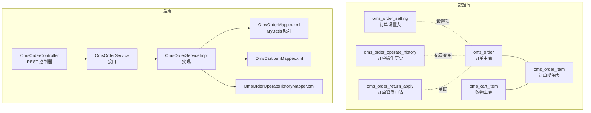
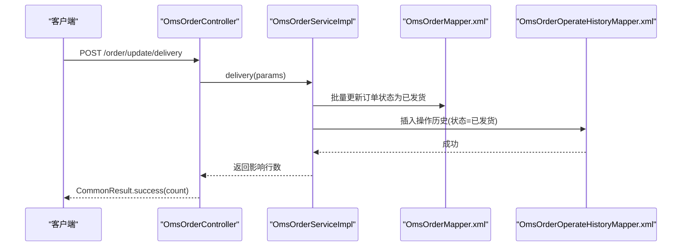
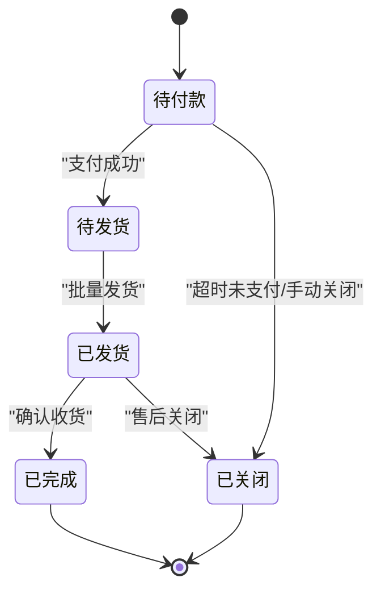
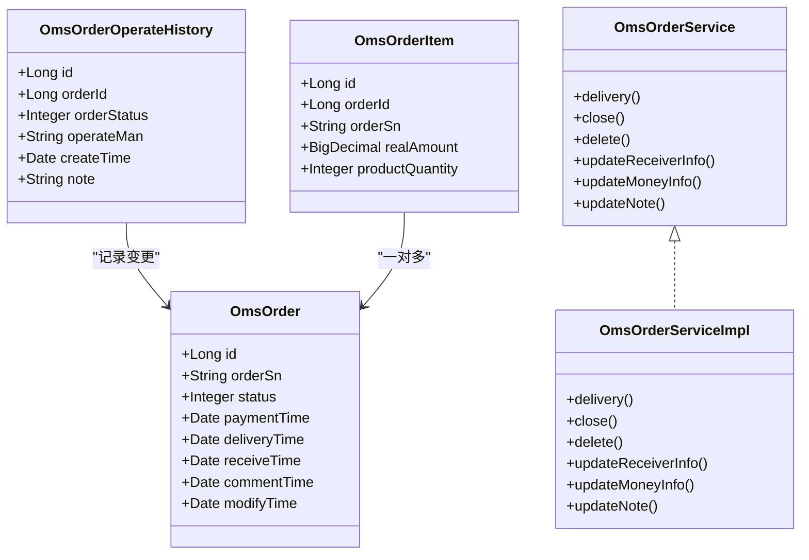

# 订单相关表

<cite>
**本文引用的文件**
- [mall.sql](file://document/sql/mall.sql)
- [OmsOrder.java](file://mall-mbg/src/main/java/com/macro/mall/model/OmsOrder.java)
- [OmsOrderMapper.xml](file://mall-mbg/src/main/resources/com/macro/mall/mapper/OmsOrderMapper.xml)
- [OmsCartItem.java](file://mall-mbg/src/main/java/com/macro/mall/model/OmsCartItem.java)
- [OmsCartItemMapper.xml](file://mall-mbg/src/main/resources/com/macro/mall/mapper/OmsCartItemMapper.xml)
- [OmsOrderItem.java](file://mall-mbg/src/main/java/com/macro/mall/model/OmsOrderItem.java)
- [OmsOrderSetting.java](file://mall-mbg/src/main/java/com/macro/mall/model/OmsOrderSetting.java)
- [OmsOrderOperateHistory.java](file://mall-mbg/src/main/java/com/macro/mall/model/OmsOrderOperateHistory.java)
- [OmsOrderOperateHistoryMapper.xml](file://mall-mbg/src/main/resources/com/macro/mall/mapper/OmsOrderOperateHistoryMapper.xml)
- [OmsOrderReturnApply.java](file://mall-mbg/src/main/java/com/macro/mall/model/OmsOrderReturnApply.java)
- [OmsOrderService.java](file://mall-admin/src/main/java/com/macro/mall/service/OmsOrderService.java)
- [OmsOrderServiceImpl.java](file://mall-admin/src/main/java/com/macro/mall/service/impl/OmsOrderServiceImpl.java)
- [OmsOrderController.java](file://mall-admin/src/main/java/com/macro/mall/controller/OmsOrderController.java)
</cite>

## 目录
1. [简介](#简介)
2. [项目结构](#项目结构)
3. [核心组件](#核心组件)
4. [架构总览](#架构总览)
5. [详细组件分析](#详细组件分析)
6. [依赖分析](#依赖分析)
7. [性能考虑](#性能考虑)
8. [故障排查指南](#故障排查指南)
9. [结论](#结论)

## 简介
本文件聚焦于“订单相关表”的数据库结构与业务逻辑，围绕以下核心表展开：
- 订单主表（OmsOrder）
- 购物车表（OmsCartItem）
- 订单明细表（OmsOrderItem）
- 订单设置表（OmsOrderSetting）
- 订单操作历史（OmsOrderOperateHistory）
- 订单退货申请（OmsOrderReturnApply）

同时，结合后端服务层与控制层代码，阐述订单状态流转、支付流程、发货流程、退款流程、订单编号生成规则、价格计算、优惠券与积分抵扣、订单生命周期管理与异常处理机制。

## 项目结构
- 数据库脚本位于 document/sql/mall.sql，包含各订单相关表的建表语句与示例数据。
- 实体模型与MyBatis映射位于 mall-mbg 模块，涵盖上述表对应的Java实体与Mapper XML。
- 后台管理模块 mall-admin 提供订单管理的接口与服务实现，包括发货、关闭、删除、修改收货人与费用信息、更新备注等。

图表来源
- [OmsOrderMapper.xml:1-800](file://mall-mbg/src/main/resources/com/macro/mall/mapper/OmsOrderMapper.xml#L1-L800)
- [OmsCartItemMapper.xml:1-416](file://mall-mbg/src/main/resources/com/macro/mall/mapper/OmsCartItemMapper.xml#L1-L416)
- [OmsOrderOperateHistoryMapper.xml:1-226](file://mall-mbg/src/main/resources/com/macro/mall/mapper/OmsOrderOperateHistoryMapper.xml#L1-L226)
- [OmsOrderController.java:1-104](file://mall-admin/src/main/java/com/macro/mall/controller/OmsOrderController.java#L1-L104)
- [OmsOrderService.java:1-59](file://mall-admin/src/main/java/com/macro/mall/service/OmsOrderService.java#L1-L59)
- [OmsOrderServiceImpl.java:1-154](file://mall-admin/src/main/java/com/macro/mall/service/impl/OmsOrderServiceImpl.java#L1-L154)

章节来源
- [mall.sql:1-623](file://document/sql/mall.sql#L1-L623)

## 核心组件
- 订单主表（OmsOrder）
  - 关键字段：订单编号（order_sn）、应付金额（pay_amount）、总金额（total_amount）、运费（freight_amount）、促销优惠（promotion_amount）、积分抵扣（integration_amount）、优惠券抵扣（coupon_amount）、折扣调整（discount_amount）、支付方式（pay_type）、订单来源（source_type）、状态（status）、类型（order_type）、收货人信息、备注、删除状态、时间字段等。
  - 作用：承载订单整体生命周期与财务汇总信息。
- 购物车表（OmsCartItem）
  - 关键字段：商品SKU、数量、单价、会员信息、删除状态、商品属性等。
  - 作用：保存用户购物车中的商品明细，用于下单前的价格计算与库存校验。
- 订单明细表（OmsOrderItem）
  - 关键字段：订单ID、商品信息、单价、数量、实付金额（real_amount）、促销/优惠/积分抵扣明细等。
  - 作用：记录下单时的商品明细与优惠拆分，支撑对账与售后。
- 订单设置表（OmsOrderSetting）
  - 关键字段：秒杀订单超时、普通订单超时、确认收货超时、完成超时、评论超时等。
  - 作用：配置订单自动确认、自动完成、自动评论等生命周期阈值。
- 订单操作历史（OmsOrderOperateHistory）
  - 关键字段：订单ID、操作人、操作时间、状态、备注。
  - 作用：审计与追踪订单状态变更。
- 订单退货申请（OmsOrderReturnApply）
  - 关键字段：订单ID、商品信息、退货金额、原因、凭证、处理状态与人员等。
  - 作用：支撑售后流程与退款处理。

章节来源
- [OmsOrder.java:1-504](file://mall-mbg/src/main/java/com/macro/mall/model/OmsOrder.java#L1-L504)
- [OmsCartItem.java:1-218](file://mall-mbg/src/main/java/com/macro/mall/model/OmsCartItem.java#L1-L218)
- [OmsOrderItem.java:1-250](file://mall-mbg/src/main/java/com/macro/mall/model/OmsOrderItem.java#L1-L250)
- [OmsOrderSetting.java:1-84](file://mall-mbg/src/main/java/com/macro/mall/model/OmsOrderSetting.java#L1-L84)
- [OmsOrderOperateHistory.java:1-85](file://mall-mbg/src/main/java/com/macro/mall/model/OmsOrderOperateHistory.java#L1-L85)
- [OmsOrderReturnApply.java:1-317](file://mall-mbg/src/main/java/com/macro/mall/model/OmsOrderReturnApply.java#L1-L317)

## 架构总览
订单相关模块采用“数据库表 + MyBatis 映射 + 控制层 + 服务层”的分层架构：
- 控制层负责接收请求并返回统一响应。
- 服务层封装业务逻辑（如批量发货、关闭订单、修改费用与备注等），并写入操作历史。
- MyBatis 映射负责与数据库交互，确保数据一致性与可追踪性。

图表来源
- [OmsOrderController.java:35-53](file://mall-admin/src/main/java/com/macro/mall/controller/OmsOrderController.java#L35-L53)
- [OmsOrderServiceImpl.java:42-58](file://mall-admin/src/main/java/com/macro/mall/service/impl/OmsOrderServiceImpl.java#L42-L58)
- [OmsOrderOperateHistoryMapper.xml:103-151](file://mall-mbg/src/main/resources/com/macro/mall/mapper/OmsOrderOperateHistoryMapper.xml#L103-L151)

## 详细组件分析

### 订单主表（OmsOrder）
- 表结构要点
  - 主键自增（id），订单编号（order_sn）唯一标识订单。
  - 财务字段：total_amount、pay_amount、freight_amount、promotion_amount、integration_amount、coupon_amount、discount_amount。
  - 状态字段：status（待付款、待发货、已发货、已完成、已关闭、无效订单）。
  - 时间字段：create_time、payment_time、delivery_time、receive_time、comment_time、modify_time。
  - 地址与发票字段：收货人信息、发票类型与内容等。
- 业务要点
  - 订单状态流转由服务层驱动，并同步写入操作历史。
  - 删除状态（delete_status）用于软删除，避免物理删除造成审计缺失。
- 价格计算与优惠
  - 总金额 = 商品小计 + 运费 - 促销优惠 - 优惠券抵扣 - 积分抵扣 - 折扣调整。
  - 实际支付金额（pay_amount）为最终应付金额，受支付方式（pay_type）与来源（source_type）影响。

章节来源
- [OmsOrder.java:1-504](file://mall-mbg/src/main/java/com/macro/mall/model/OmsOrder.java#L1-L504)
- [OmsOrderMapper.xml:1-800](file://mall-mbg/src/main/resources/com/macro/mall/mapper/OmsOrderMapper.xml#L1-L800)

### 购物车表（OmsCartItem）
- 表结构要点
  - 保存用户购物车中的商品明细，含商品SKU、数量、单价、会员信息、删除状态等。
- 业务要点
  - 下单前从购物车聚合计算订单总金额与优惠，随后生成订单明细。
  - 删除状态用于清理失效购物车项。

章节来源
- [OmsCartItem.java:1-218](file://mall-mbg/src/main/java/com/macro/mall/model/OmsCartItem.java#L1-L218)
- [OmsCartItemMapper.xml:1-416](file://mall-mbg/src/main/resources/com/macro/mall/mapper/OmsCartItemMapper.xml#L1-L416)

### 订单明细表（OmsOrderItem）
- 表结构要点
  - 记录下单时的商品明细，含商品SKU、数量、单价、实付金额（real_amount）、促销/优惠/积分抵扣明细等。
- 业务要点
  - 与订单主表一对多关系，用于对账、售后与财务结算。
  - 促销名称（promotion_name）与促销金额（promotion_amount）用于明细级优惠拆分。

章节来源
- [OmsOrderItem.java:1-250](file://mall-mbg/src/main/java/com/macro/mall/model/OmsOrderItem.java#L1-L250)

### 订单设置表（OmsOrderSetting）
- 表结构要点
  - 配置各类订单生命周期超时时间：秒杀订单超时、普通订单超时、确认收货超时、完成超时、评论超时。
- 业务要点
  - 用于系统自动确认与自动完成的阈值判断，避免人工干预导致的延迟。

章节来源
- [OmsOrderSetting.java:1-84](file://mall-mbg/src/main/java/com/macro/mall/model/OmsOrderSetting.java#L1-L84)

### 订单操作历史（OmsOrderOperateHistory）
- 表结构要点
  - 记录每次状态变更的操作人、时间、状态与备注，便于审计与问题追溯。
- 业务要点
  - 发货、关闭、修改收货人与费用信息、更新备注等关键动作均会写入历史。

章节来源
- [OmsOrderOperateHistory.java:1-85](file://mall-mbg/src/main/java/com/macro/mall/model/OmsOrderOperateHistory.java#L1-L85)
- [OmsOrderOperateHistoryMapper.xml:1-226](file://mall-mbg/src/main/resources/com/macro/mall/mapper/OmsOrderOperateHistoryMapper.xml#L1-L226)

### 订单退货申请（OmsOrderReturnApply）
- 表结构要点
  - 记录退货申请的订单ID、商品信息、退货金额、原因、凭证、处理状态与人员等。
- 业务要点
  - 与订单主表关联，支撑退款流程与售后闭环。

章节来源
- [OmsOrderReturnApply.java:1-317](file://mall-mbg/src/main/java/com/macro/mall/model/OmsOrderReturnApply.java#L1-L317)

### 订单状态流转与生命周期管理
- 状态定义（来源于订单主表状态字段）
  - 待付款、待发货、已发货、已完成、已关闭、无效订单。
- 流转路径（概念示意）
  - 创建订单 → 待付款 → 待发货 → 已发货 → 已完成；或在特定条件下 → 已关闭/无效订单。
- 自动化机制
  - 订单设置表提供超时阈值，系统可据此自动推进状态（如自动确认、自动完成）。
- 操作历史
  - 每次状态变更均写入操作历史，保证可追溯。

图表来源
- [OmsOrder.java:38-224](file://mall-mbg/src/main/java/com/macro/mall/model/OmsOrder.java#L38-L224)
- [OmsOrderSetting.java:8-66](file://mall-mbg/src/main/java/com/macro/mall/model/OmsOrderSetting.java#L8-L66)

### 支付流程（数据库层面）
- 触发条件
  - 支付完成后，系统更新订单支付时间（payment_time）与状态为“待发货”。
- 数据落点
  - 订单主表的支付相关字段与状态字段更新。
- 异常处理
  - 若支付失败或重复支付，需通过操作历史与日志进行追踪与对账。

章节来源
- [OmsOrder.java:86-160](file://mall-mbg/src/main/java/com/macro/mall/model/OmsOrder.java#L86-L160)
- [OmsOrderMapper.xml:147-181](file://mall-mbg/src/main/resources/com/macro/mall/mapper/OmsOrderMapper.xml#L147-L181)

### 发货流程（数据库层面）
- 触发条件
  - 后台批量发货接口调用，服务层批量更新订单状态为“已发货”，并写入操作历史。
- 数据落点
  - 订单主表状态与发货时间（delivery_time）字段更新；操作历史记录状态=已发货。
- 异常处理
  - 发货失败时回滚事务并记录错误日志，确保状态一致性。

章节来源
- [OmsOrderController.java:35-53](file://mall-admin/src/main/java/com/macro/mall/controller/OmsOrderController.java#L35-L53)
- [OmsOrderServiceImpl.java:42-58](file://mall-admin/src/main/java/com/macro/mall/service/impl/OmsOrderServiceImpl.java#L42-L58)
- [OmsOrderOperateHistoryMapper.xml:103-151](file://mall-mbg/src/main/resources/com/macro/mall/mapper/OmsOrderOperateHistoryMapper.xml#L103-L151)

### 退款流程（数据库层面）
- 触发条件
  - 用户发起退货申请，后台审核通过后，系统根据退货申请金额与状态推进。
- 数据落点
  - 订单主表状态更新；退货申请表记录处理结果；操作历史记录备注。
- 异常处理
  - 退款失败需回滚并记录失败原因，确保资金与状态一致。

章节来源
- [OmsOrderReturnApply.java:1-317](file://mall-mbg/src/main/java/com/macro/mall/model/OmsOrderReturnApply.java#L1-L317)
- [OmsOrderOperateHistoryMapper.xml:103-151](file://mall-mbg/src/main/resources/com/macro/mall/mapper/OmsOrderOperateHistoryMapper.xml#L103-L151)

### 订单编号生成规则
- 订单编号（order_sn）为字符串类型，数据库未见自动生成策略，通常由业务层按规则拼装（如时间戳+用户ID+序列号等）。
- 建议
  - 在服务层统一生成并幂等写入，避免并发冲突；可结合数据库唯一索引保障唯一性。

章节来源
- [OmsOrder.java:14-128](file://mall-mbg/src/main/java/com/macro/mall/model/OmsOrder.java#L14-L128)

### 价格计算、优惠券与积分抵扣
- 价格计算
  - 订单总金额（total_amount）= 明细小计 + 运费 - 促销优惠 - 优惠券抵扣 - 积分抵扣 - 折扣调整。
  - 实付金额（pay_amount）= total_amount - 优惠券抵扣 - 积分抵扣。
- 优惠券与积分
  - 优惠券抵扣（coupon_amount）与积分抵扣（integration_amount）在订单主表体现。
  - 明细表（OmsOrderItem）保留促销/优惠/积分抵扣明细，便于对账。
- 注意
  - 价格计算需在下单前完成，确保库存与价格一致性。

章节来源
- [OmsOrder.java:20-33](file://mall-mbg/src/main/java/com/macro/mall/model/OmsOrder.java#L20-L33)
- [OmsOrderItem.java:33-41](file://mall-mbg/src/main/java/com/macro/mall/model/OmsOrderItem.java#L33-L41)

### 订单生命周期管理与异常处理
- 生命周期管理
  - 通过订单设置表配置自动确认、自动完成、自动评论等阈值。
  - 操作历史记录所有关键状态变更，便于审计与回溯。
- 异常处理
  - 批量操作（发货、关闭、删除）采用事务封装，失败回滚。
  - 控制层统一返回结果对象，便于前端与监控系统感知异常。

章节来源
- [OmsOrderSetting.java:8-66](file://mall-mbg/src/main/java/com/macro/mall/model/OmsOrderSetting.java#L8-L66)
- [OmsOrderOperateHistoryMapper.xml:103-151](file://mall-mbg/src/main/resources/com/macro/mall/mapper/OmsOrderOperateHistoryMapper.xml#L103-L151)
- [OmsOrderServiceImpl.java:42-87](file://mall-admin/src/main/java/com/macro/mall/service/impl/OmsOrderServiceImpl.java#L42-L87)
- [OmsOrderController.java:26-102](file://mall-admin/src/main/java/com/macro/mall/controller/OmsOrderController.java#L26-L102)

## 依赖分析
- 组件耦合
  - 控制层依赖服务接口；服务实现依赖Mapper与DAO；Mapper映射数据库表。
  - 订单主表与订单明细表存在外键关联（通过订单ID）；操作历史与订单主表存在外键关联。
- 外部依赖
  - MyBatis ORM、Spring 事务管理、PageHelper 分页。
- 潜在风险
  - 若未正确维护外键约束，可能导致数据不一致；建议在数据库层面补充约束并开启事务。

图表来源
- [OmsOrder.java:1-504](file://mall-mbg/src/main/java/com/macro/mall/model/OmsOrder.java#L1-L504)
- [OmsOrderItem.java:1-250](file://mall-mbg/src/main/java/com/macro/mall/model/OmsOrderItem.java#L1-L250)
- [OmsOrderOperateHistory.java:1-85](file://mall-mbg/src/main/java/com/macro/mall/model/OmsOrderOperateHistory.java#L1-L85)
- [OmsOrderService.java:1-59](file://mall-admin/src/main/java/com/macro/mall/service/OmsOrderService.java#L1-L59)
- [OmsOrderServiceImpl.java:1-154](file://mall-admin/src/main/java/com/macro/mall/service/impl/OmsOrderServiceImpl.java#L1-L154)

## 性能考虑
- 查询优化
  - 对订单主表的关键查询（如按状态、时间、会员ID）建立合适索引，减少全表扫描。
- 写入优化
  - 批量发货、批量关闭等操作应使用批处理与事务，降低锁竞争。
- 缓存策略
  - 对高频读取的订单设置表可引入本地缓存，减少数据库访问。
- 日志与监控
  - 对关键业务（支付、发货、退款）增加埋点与链路追踪，便于定位性能瓶颈。

## 故障排查指南
- 常见问题
  - 发货后状态未更新：检查服务层是否正确调用Mapper并写入操作历史。
  - 退款异常：核对退货申请状态与订单状态一致性，检查资金流水与订单金额。
  - 订单超时未自动完成：检查订单设置表阈值与定时任务执行情况。
- 排查步骤
  - 查看操作历史表，确认最近一次状态变更与操作人。
  - 核对订单主表字段（支付/发货/收货/评论时间）是否符合预期。
  - 检查服务层事务是否回滚，控制层返回码是否异常。

章节来源
- [OmsOrderOperateHistoryMapper.xml:73-92](file://mall-mbg/src/main/resources/com/macro/mall/mapper/OmsOrderOperateHistoryMapper.xml#L73-L92)
- [OmsOrderServiceImpl.java:42-152](file://mall-admin/src/main/java/com/macro/mall/service/impl/OmsOrderServiceImpl.java#L42-L152)
- [OmsOrderController.java:26-102](file://mall-admin/src/main/java/com/macro/mall/controller/OmsOrderController.java#L26-L102)

## 结论
订单相关表在数据库层面提供了完整的订单生命周期承载能力，配合服务层的状态变更与操作历史记录，实现了可追踪、可审计、可自动化的订单管理。通过明确的价格计算规则、优惠与积分抵扣机制，以及完善的退货与发货流程，系统能够稳定支撑电商业务的核心场景。建议进一步完善外键约束、索引策略与自动化阈值配置，持续提升性能与可靠性。