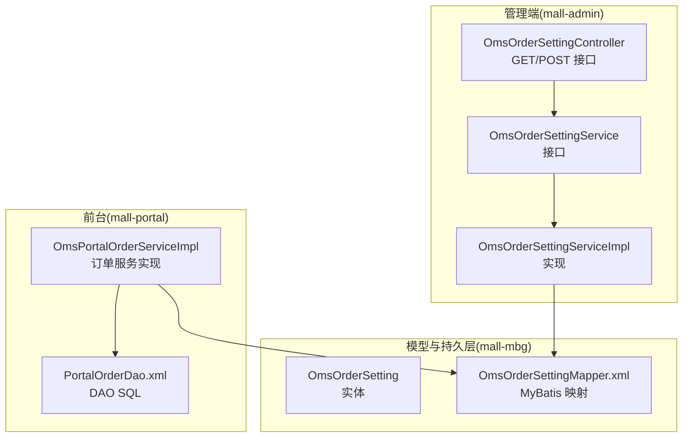
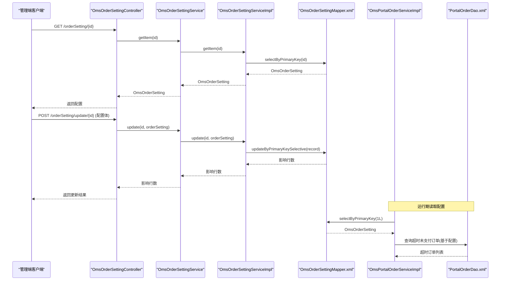
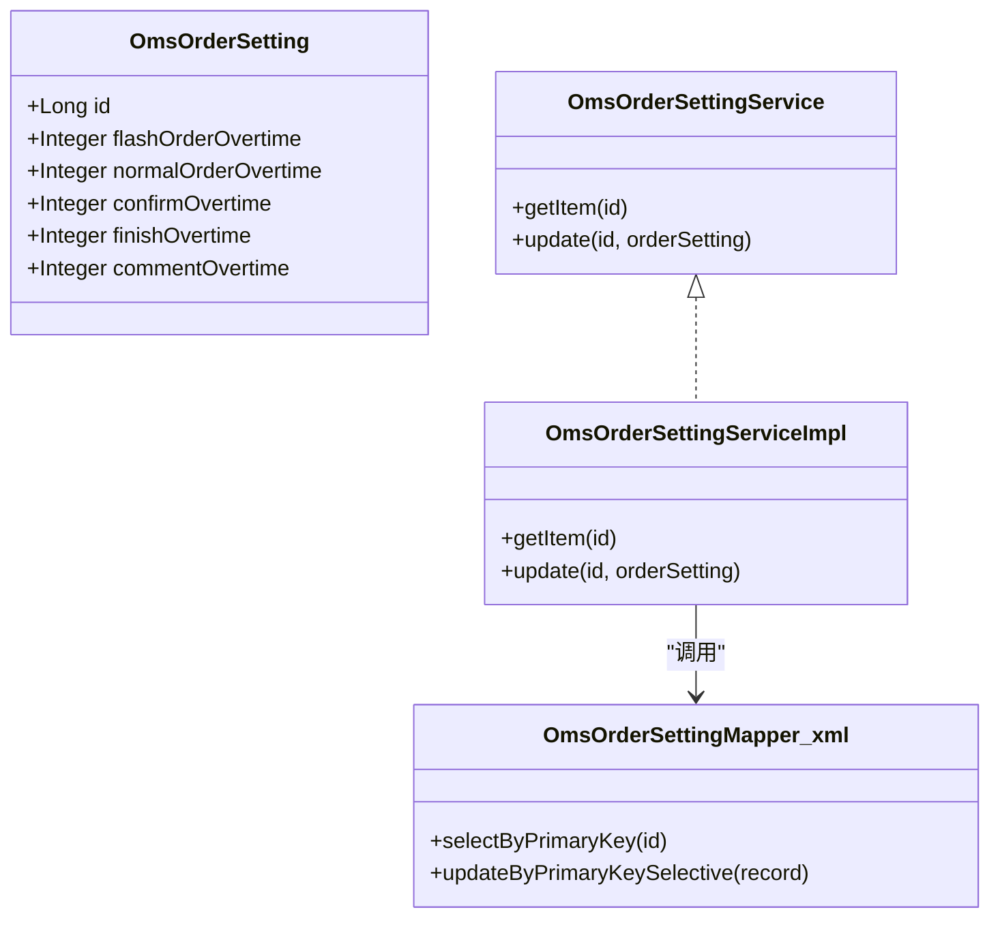
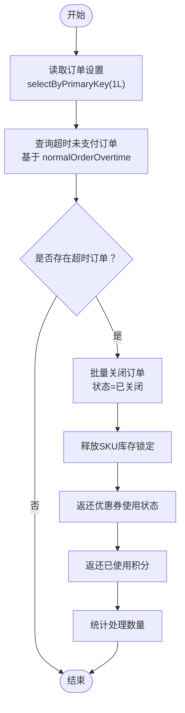
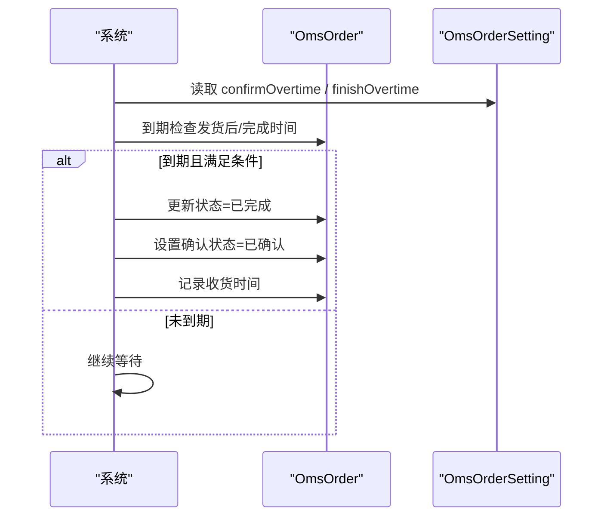
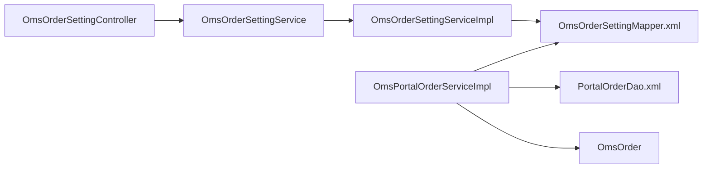

# 订单设置表（OmsOrderSetting）

<cite>
**本文引用的文件**
- [OmsOrderSetting.java](file://mall-mbg/src/main/java/com/macro/mall/model/OmsOrderSetting.java)
- [OmsOrderSettingMapper.xml](file://mall-mbg/src/main/resources/com/macro/mall/mapper/OmsOrderSettingMapper.xml)
- [OmsOrderSettingController.java](file://mall-admin/src/main/java/com/macro/mall/controller/OmsOrderSettingController.java)
- [OmsOrderSettingService.java](file://mall-admin/src/main/java/com/macro/mall/service/OmsOrderSettingService.java)
- [OmsOrderSettingServiceImpl.java](file://mall-admin/src/main/java/com/macro/mall/service/impl/OmsOrderSettingServiceImpl.java)
- [OmsPortalOrderServiceImpl.java](file://mall-portal/src/main/java/com/macro/mall/portal/service/impl/OmsPortalOrderServiceImpl.java)
- [PortalOrderDao.xml](file://mall-portal/src/main/resources/dao/PortalOrderDao.xml)
- [OmsOrder.java](file://mall-mbg/src/main/java/com/macro/mall/model/OmsOrder.java)
- [UmsIntegrationConsumeSetting.java](file://mall-mbg/src/main/java/com/macro/mall/model/UmsIntegrationConsumeSetting.java)
- [mall.sql](file://document/sql/mall.sql)
</cite>

## 目录
1. [简介](#简介)
2. [项目结构](#项目结构)
3. [核心组件](#核心组件)
4. [架构总览](#架构总览)
5. [详细组件分析](#详细组件分析)
6. [依赖关系分析](#依赖关系分析)
7. [性能考量](#性能考量)
8. [故障排查指南](#故障排查指南)
9. [结论](#结论)
10. [附录](#附录)

## 简介
本文件围绕订单设置表（OmsOrderSetting）进行系统化说明，阐述其设计理念、字段含义与业务影响，并结合实际代码实现解析系统如何通过配置表驱动订单流程的关键行为，包括订单超时处理、自动完成机制、自动确认收货时间等。同时给出配置调整的最佳实践与注意事项，帮助读者在不改动代码的前提下，安全地优化订单生命周期策略。

## 项目结构
OmsOrderSetting属于后端模型层与持久层的一部分，配合管理端控制器与服务层，实现订单设置的读取与更新；前台订单服务在执行超时取消、自动完成等逻辑时会读取该配置，从而实现“配置即策略”的柔性控制。

图表来源
- [OmsOrderSettingController.java:1-39](file://mall-admin/src/main/java/com/macro/mall/controller/OmsOrderSettingController.java#L1-L39)
- [OmsOrderSettingService.java:1-20](file://mall-admin/src/main/java/com/macro/mall/service/OmsOrderSettingService.java#L1-L20)
- [OmsOrderSettingServiceImpl.java:1-29](file://mall-admin/src/main/java/com/macro/mall/service/impl/OmsOrderSettingServiceImpl.java#L1-L29)
- [OmsOrderSetting.java:1-84](file://mall-mbg/src/main/java/com/macro/mall/model/OmsOrderSetting.java#L1-L84)
- [OmsOrderSettingMapper.xml:1-229](file://mall-mbg/src/main/resources/com/macro/mall/mapper/OmsOrderSettingMapper.xml#L1-L229)
- [OmsPortalOrderServiceImpl.java:285-312](file://mall-portal/src/main/java/com/macro/mall/portal/service/impl/OmsPortalOrderServiceImpl.java#L285-L312)
- [PortalOrderDao.xml:29-48](file://mall-portal/src/main/resources/dao/PortalOrderDao.xml#L29-L48)

章节来源
- [OmsOrderSettingController.java:1-39](file://mall-admin/src/main/java/com/macro/mall/controller/OmsOrderSettingController.java#L1-L39)
- [OmsOrderSettingService.java:1-20](file://mall-admin/src/main/java/com/macro/mall/service/OmsOrderSettingService.java#L1-L20)
- [OmsOrderSettingServiceImpl.java:1-29](file://mall-admin/src/main/java/com/macro/mall/service/impl/OmsOrderSettingServiceImpl.java#L1-L29)
- [OmsOrderSetting.java:1-84](file://mall-mbg/src/main/java/com/macro/mall/model/OmsOrderSetting.java#L1-L84)
- [OmsOrderSettingMapper.xml:1-229](file://mall-mbg/src/main/resources/com/macro/mall/mapper/OmsOrderSettingMapper.xml#L1-L229)
- [OmsPortalOrderServiceImpl.java:285-312](file://mall-portal/src/main/java/com/macro/mall/portal/service/impl/OmsPortalOrderServiceImpl.java#L285-L312)
- [PortalOrderDao.xml:29-48](file://mall-portal/src/main/resources/dao/PortalOrderDao.xml#L29-L48)

## 核心组件
- 实体模型：OmsOrderSetting 提供订单设置的字段封装与序列化支持。
- 持久层映射：OmsOrderSettingMapper.xml 定义了查询、插入、更新等SQL映射。
- 管理端接口：OmsOrderSettingController 提供获取与更新订单设置的REST接口。
- 服务层接口与实现：OmsOrderSettingService 及其实现负责业务编排与数据访问。
- 前台订单服务：OmsPortalOrderServiceImpl 在订单超时取消、自动完成等流程中读取配置。

章节来源
- [OmsOrderSetting.java:1-84](file://mall-mbg/src/main/java/com/macro/mall/model/OmsOrderSetting.java#L1-L84)
- [OmsOrderSettingMapper.xml:1-229](file://mall-mbg/src/main/resources/com/macro/mall/mapper/OmsOrderSettingMapper.xml#L1-L229)
- [OmsOrderSettingController.java:1-39](file://mall-admin/src/main/java/com/macro/mall/controller/OmsOrderSettingController.java#L1-L39)
- [OmsOrderSettingService.java:1-20](file://mall-admin/src/main/java/com/macro/mall/service/OmsOrderSettingService.java#L1-L20)
- [OmsOrderSettingServiceImpl.java:1-29](file://mall-admin/src/main/java/com/macro/mall/service/impl/OmsOrderSettingServiceImpl.java#L1-L29)
- [OmsPortalOrderServiceImpl.java:285-312](file://mall-portal/src/main/java/com/macro/mall/portal/service/impl/OmsPortalOrderServiceImpl.java#L285-L312)

## 架构总览
下图展示了“订单设置配置”在系统中的位置与调用链路：管理端用于维护配置，前台订单服务在运行期读取配置并据此执行订单生命周期关键动作。

图表来源
- [OmsOrderSettingController.java:22-37](file://mall-admin/src/main/java/com/macro/mall/controller/OmsOrderSettingController.java#L22-L37)
- [OmsOrderSettingServiceImpl.java:18-27](file://mall-admin/src/main/java/com/macro/mall/service/impl/OmsOrderSettingServiceImpl.java#L18-L27)
- [OmsOrderSettingMapper.xml:199-228](file://mall-mbg/src/main/resources/com/macro/mall/mapper/OmsOrderSettingMapper.xml#L199-L228)
- [OmsPortalOrderServiceImpl.java:288-290](file://mall-portal/src/main/java/com/macro/mall/portal/service/impl/OmsPortalOrderServiceImpl.java#L288-L290)
- [PortalOrderDao.xml:29-48](file://mall-portal/src/main/resources/dao/PortalOrderDao.xml#L29-L48)

## 详细组件分析

### 数据模型与字段语义
OmsOrderSetting 的字段对应订单生命周期的关键阈值与时间窗口，具体如下：

- 秒杀订单超时关闭时间（分钟）
  - 含义：秒杀订单下单后未支付的最长等待时间，超过则自动关闭。
  - 影响：直接影响秒杀场景的库存占用与资金占用周期。
- 正常订单超时关闭时间（分钟）
  - 含义：普通订单下单后未支付的最长等待时间，超过则自动关闭。
  - 影响：决定普通订单的超时清理节奏，影响库存锁定与资金沉淀。
- 发货后自动确认收货时间（天）
  - 含义：订单发货后，系统自动确认收货的时间间隔，到期自动完成交易。
  - 影响：影响售后可申请窗口与资金结算周期。
- 自动完成交易时间（天）
  - 含义：订单完成后，系统自动完成交易且不可申请售后的时间窗口。
  - 影响：售后与退款政策边界，决定纠纷处理时效。
- 自动好评时间（天）
  - 含义：订单完成后自动给予默认好评的时间节点。
  - 影响：提升用户参与度与评价率，但需平衡真实反馈质量。

章节来源
- [OmsOrderSetting.java:8-16](file://mall-mbg/src/main/java/com/macro/mall/model/OmsOrderSetting.java#L8-L16)
- [mall.sql:837-841](file://document/sql/mall.sql#L837-L841)

### 配置读取与更新流程
- 管理端接口
  - GET /orderSetting/{id}：获取指定订单设置。
  - POST /orderSetting/update/{id}：更新订单设置。
- 服务层实现
  - getItem(id)：根据主键查询配置。
  - update(id, orderSetting)：设置主键并更新记录。
- 持久层映射
  - selectByPrimaryKey：按主键查询。
  - updateByPrimaryKeySelective：按非空字段选择性更新。

图表来源
- [OmsOrderSetting.java:1-84](file://mall-mbg/src/main/java/com/macro/mall/model/OmsOrderSetting.java#L1-L84)
- [OmsOrderSettingMapper.xml:88-93](file://mall-mbg/src/main/resources/com/macro/mall/mapper/OmsOrderSettingMapper.xml#L88-L93)
- [OmsOrderSettingMapper.xml:199-218](file://mall-mbg/src/main/resources/com/macro/mall/mapper/OmsOrderSettingMapper.xml#L199-L218)
- [OmsOrderSettingService.java:9-19](file://mall-admin/src/main/java/com/macro/mall/service/OmsOrderSettingService.java#L9-L19)
- [OmsOrderSettingServiceImpl.java:14-27](file://mall-admin/src/main/java/com/macro/mall/service/impl/OmsOrderSettingServiceImpl.java#L14-L27)

章节来源
- [OmsOrderSettingController.java:22-37](file://mall-admin/src/main/java/com/macro/mall/controller/OmsOrderSettingController.java#L22-L37)
- [OmsOrderSettingService.java:9-19](file://mall-admin/src/main/java/com/macro/mall/service/OmsOrderSettingService.java#L9-L19)
- [OmsOrderSettingServiceImpl.java:18-27](file://mall-admin/src/main/java/com/macro/mall/service/impl/OmsOrderSettingServiceImpl.java#L18-L27)
- [OmsOrderSettingMapper.xml:88-93](file://mall-mbg/src/main/resources/com/macro/mall/mapper/OmsOrderSettingMapper.xml#L88-L93)
- [OmsOrderSettingMapper.xml:199-218](file://mall-mbg/src/main/resources/com/macro/mall/mapper/OmsOrderSettingMapper.xml#L199-L218)

### 订单超时处理流程（自动关闭未支付订单）
系统通过定时任务或延迟消息触发，读取“正常订单超时关闭时间”配置，查询超时未支付订单并执行关闭、释放库存、返还优惠券与积分等操作。

图表来源
- [OmsPortalOrderServiceImpl.java:288-312](file://mall-portal/src/main/java/com/macro/mall/portal/service/impl/OmsPortalOrderServiceImpl.java#L288-L312)
- [PortalOrderDao.xml:29-48](file://mall-portal/src/main/resources/dao/PortalOrderDao.xml#L29-L48)

章节来源
- [OmsPortalOrderServiceImpl.java:285-312](file://mall-portal/src/main/java/com/macro/mall/portal/service/impl/OmsPortalOrderServiceImpl.java#L285-L312)
- [PortalOrderDao.xml:29-48](file://mall-portal/src/main/resources/dao/PortalOrderDao.xml#L29-L48)

### 自动确认收货与自动完成机制
- 自动确认收货：在“发货后自动确认收货时间”到期后，系统自动将订单状态更新为已完成，并记录确认状态与收货时间。
- 自动完成交易：在“自动完成交易时间”到期后，系统不再允许售后申请，订单进入最终完成状态。

图表来源
- [OmsPortalOrderServiceImpl.java:360-373](file://mall-portal/src/main/java/com/macro/mall/portal/service/impl/OmsPortalOrderServiceImpl.java#L360-L373)
- [OmsOrder.java:38-96](file://mall-mbg/src/main/java/com/macro/mall/model/OmsOrder.java#L38-L96)

章节来源
- [OmsPortalOrderServiceImpl.java:360-373](file://mall-portal/src/main/java/com/macro/mall/portal/service/impl/OmsPortalOrderServiceImpl.java#L360-L373)
- [OmsOrder.java:38-96](file://mall-mbg/src/main/java/com/macro/mall/model/OmsOrder.java#L38-L96)

### 积分使用规则与订单设置的关系
- 订单设置表本身不包含积分抵扣比例与最低使用积分字段；积分抵扣相关配置位于独立表 UmsIntegrationConsumeSetting。
- 在订单超时关闭时，系统会根据订单记录中的已用积分字段进行返还，这与订单设置表的“自动完成交易时间”共同构成售后与资金结算边界。

章节来源
- [UmsIntegrationConsumeSetting.java:1-73](file://mall-mbg/src/main/java/com/macro/mall/model/UmsIntegrationConsumeSetting.java#L1-L73)
- [OmsPortalOrderServiceImpl.java:305-310](file://mall-portal/src/main/java/com/macro/mall/portal/service/impl/OmsPortalOrderServiceImpl.java#L305-L310)

## 依赖关系分析
- 控制器依赖服务接口，服务实现依赖Mapper，Mapper映射到数据库表。
- 前台订单服务在运行期依赖订单设置表与DAO层SQL，形成“配置驱动行为”的解耦设计。
- 订单状态枚举与生命周期在 OmsOrder 中定义，与订单设置表协同工作。

图表来源
- [OmsOrderSettingController.java:19-37](file://mall-admin/src/main/java/com/macro/mall/controller/OmsOrderSettingController.java#L19-L37)
- [OmsOrderSettingServiceImpl.java:14-27](file://mall-admin/src/main/java/com/macro/mall/service/impl/OmsOrderSettingServiceImpl.java#L14-L27)
- [OmsOrderSettingMapper.xml:1-229](file://mall-mbg/src/main/resources/com/macro/mall/mapper/OmsOrderSettingMapper.xml#L1-L229)
- [OmsPortalOrderServiceImpl.java:285-312](file://mall-portal/src/main/java/com/macro/mall/portal/service/impl/OmsPortalOrderServiceImpl.java#L285-L312)
- [PortalOrderDao.xml:29-48](file://mall-portal/src/main/resources/dao/PortalOrderDao.xml#L29-L48)
- [OmsOrder.java:38-96](file://mall-mbg/src/main/java/com/macro/mall/model/OmsOrder.java#L38-L96)

章节来源
- [OmsOrderSettingController.java:19-37](file://mall-admin/src/main/java/com/macro/mall/controller/OmsOrderSettingController.java#L19-L37)
- [OmsOrderSettingServiceImpl.java:14-27](file://mall-admin/src/main/java/com/macro/mall/service/impl/OmsOrderSettingServiceImpl.java#L14-L27)
- [OmsOrderSettingMapper.xml:1-229](file://mall-mbg/src/main/resources/com/macro/mall/mapper/OmsOrderSettingMapper.xml#L1-L229)
- [OmsPortalOrderServiceImpl.java:285-312](file://mall-portal/src/main/java/com/macro/mall/portal/service/impl/OmsPortalOrderServiceImpl.java#L285-L312)
- [PortalOrderDao.xml:29-48](file://mall-portal/src/main/resources/dao/PortalOrderDao.xml#L29-L48)
- [OmsOrder.java:38-96](file://mall-mbg/src/main/java/com/macro/mall/model/OmsOrder.java#L38-L96)

## 性能考量
- 配置读取频率：订单超时扫描通常按分钟级调度，建议在服务启动时缓存关键配置，避免频繁数据库访问。
- 批量处理：超时订单关闭应采用批量更新与批量释放库存，减少事务开销与锁竞争。
- 索引与SQL：确保订单表的创建时间、状态等字段具备合适索引，以支撑超时查询。
- 并发与幂等：超时处理应考虑并发场景下的重复执行问题，保证幂等性与一致性。

## 故障排查指南
- 配置未生效
  - 检查是否正确更新主键为1的记录。
  - 确认服务层 updateByPrimaryKeySelective 是否返回预期影响行数。
- 超时订单未被关闭
  - 核对“正常订单超时关闭时间”是否合理，确认DAO查询SQL是否按分钟计算。
  - 检查订单状态是否为未支付且创建时间早于阈值。
- 自动确认收货/完成未触发
  - 核对“发货后自动确认收货时间”与“自动完成交易时间”配置。
  - 检查订单状态流转逻辑与时间判断条件。
- 积分返还异常
  - 确认订单记录中已用积分字段存在且正确。
  - 检查积分服务更新逻辑与幂等性。

章节来源
- [OmsOrderSettingServiceImpl.java:24-27](file://mall-admin/src/main/java/com/macro/mall/service/impl/OmsOrderSettingServiceImpl.java#L24-L27)
- [OmsPortalOrderServiceImpl.java:288-312](file://mall-portal/src/main/java/com/macro/mall/portal/service/impl/OmsPortalOrderServiceImpl.java#L288-L312)
- [PortalOrderDao.xml:29-48](file://mall-portal/src/main/resources/dao/PortalOrderDao.xml#L29-L48)
- [OmsOrder.java:84-92](file://mall-mbg/src/main/java/com/macro/mall/model/OmsOrder.java#L84-L92)

## 结论
OmsOrderSetting 作为订单生命周期策略的“配置中心”，通过少量关键字段即可灵活控制订单超时、自动确认收货、自动完成与自动好评等行为。管理端负责配置维护，前台服务通过读取配置实现“配置即策略”的柔性控制，既降低了硬编码带来的风险，也为业务快速演进提供了基础能力。

## 附录

### 字段对照与默认值
- 字段与含义
  - flash_order_overtime：秒杀订单超时关闭时间（分钟）
  - normal_order_overtime：正常订单超时关闭时间（分钟）
  - confirm_overtime：发货后自动确认收货时间（天）
  - finish_overtime：自动完成交易时间（天）
  - comment_overtime：订单完成后自动好评时间（天）
- 默认值示例
  - 默认记录（id=1）：秒杀超时60分钟、普通超时120分钟、自动确认15天、自动完成7天、自动好评7天。

章节来源
- [mall.sql:837-848](file://document/sql/mall.sql#L837-L848)