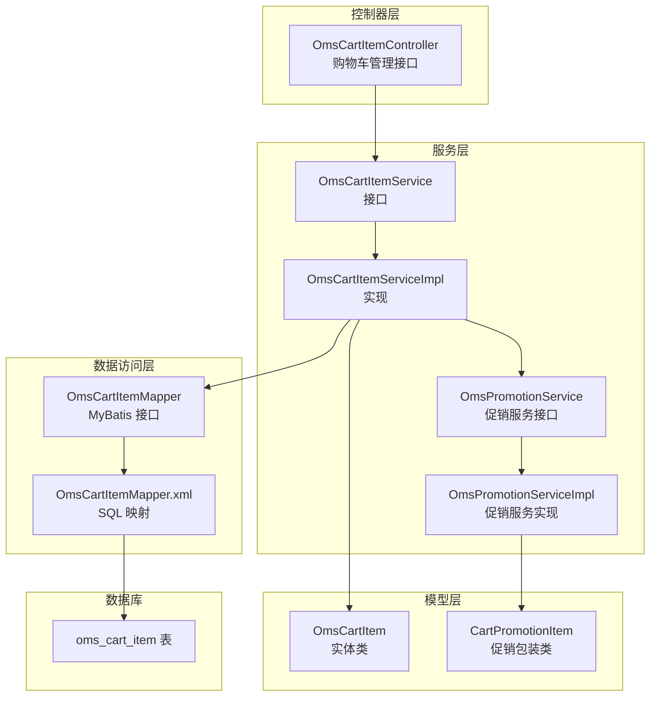
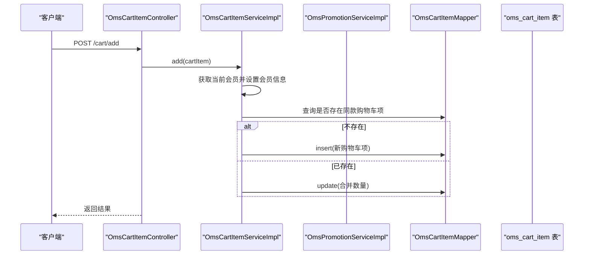
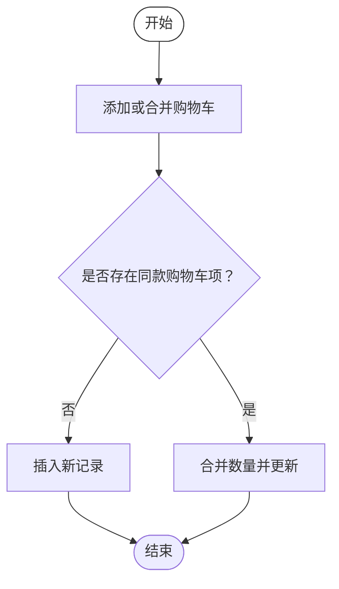
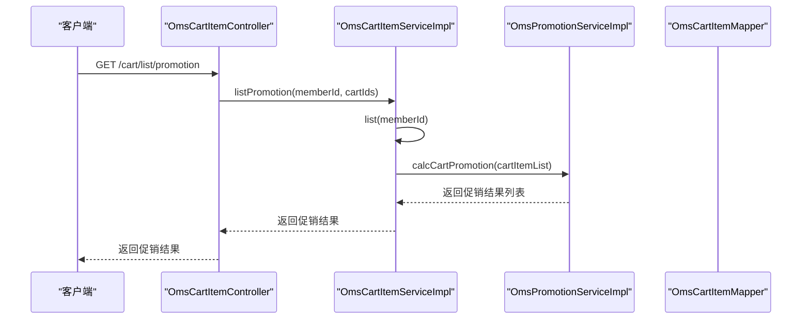
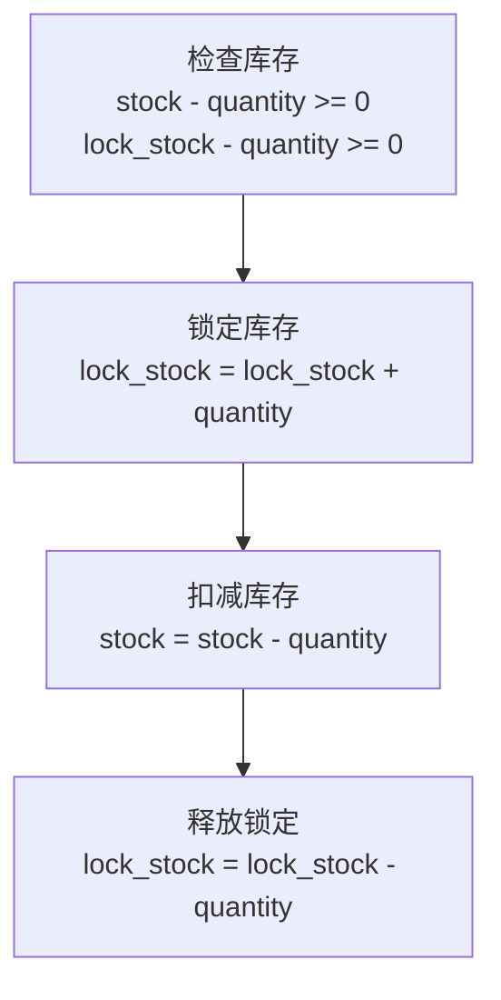
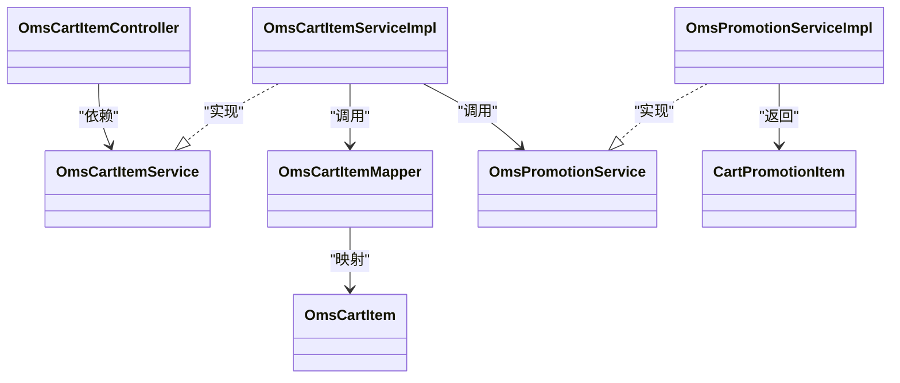

# 购物车表（OmsCartItem）

<cite>
**本文引用的文件**
- [OmsCartItem.java](file://mall-mbg/src/main/java/com/macro/mall/model/OmsCartItem.java)
- [OmsCartItemMapper.java](file://mall-mbg/src/main/java/com/macro/mall/mapper/OmsCartItemMapper.java)
- [OmsCartItemMapper.xml](file://mall-mbg/src/main/resources/com/macro/mall/mapper/OmsCartItemMapper.xml)
- [OmsCartItemController.java](file://mall-portal/src/main/java/com/macro/mall/portal/controller/OmsCartItemController.java)
- [OmsCartItemService.java](file://mall-portal/src/main/java/com/macro/mall/portal/service/OmsCartItemService.java)
- [OmsCartItemServiceImpl.java](file://mall-portal/src/main/java/com/macro/mall/portal/service/impl/OmsCartItemServiceImpl.java)
- [OmsPromotionService.java](file://mall-portal/src/main/java/com/macro/mall/portal/service/OmsPromotionService.java)
- [OmsPromotionServiceImpl.java](file://mall-portal/src/main/java/com/macro/mall/portal/service/impl/OmsPromotionServiceImpl.java)
- [CartPromotionItem.java](file://mall-portal/src/main/java/com/macro/mall/portal/domain/CartPromotionItem.java)
- [OmsPortalOrderServiceImpl.java](file://mall-portal/src/main/java/com/macro/mall/portal/service/impl/OmsPortalOrderServiceImpl.java)
- [mall.sql](file://document/sql/mall.sql)
</cite>

## 目录
1. [简介](#简介)
2. [项目结构](#项目结构)
3. [核心组件](#核心组件)
4. [架构概览](#架构概览)
5. [详细组件分析](#详细组件分析)
6. [依赖分析](#依赖分析)
7. [性能考虑](#性能考虑)
8. [故障排查指南](#故障排查指南)
9. [结论](#结论)

## 简介
本文件围绕购物车表（OmsCartItem）进行系统化文档化，覆盖表结构设计、字段语义、与用户与商品的关联关系、购物车生命周期管理（新增、合并、修改数量、删除、清空）、价格计算与促销叠加逻辑、库存检查机制以及业务处理流程。文档同时提供可视化图示，帮助读者快速理解模块间交互。

## 项目结构
- 数据模型层：OmsCartItem 实体类与 MyBatis 映射文件
- 服务层：购物车服务接口与实现，促销服务接口与实现
- 控制器层：对外暴露购物车管理接口
- 数据库层：购物车表结构定义与样例数据

图表来源
- [OmsCartItemController.java](file://mall-portal/src/main/java/com/macro/mall/portal/controller/OmsCartItemController.java)
- [OmsCartItemService.java](file://mall-portal/src/main/java/com/macro/mall/portal/service/OmsCartItemService.java)
- [OmsCartItemServiceImpl.java](file://mall-portal/src/main/java/com/macro/mall/portal/service/impl/OmsCartItemServiceImpl.java)
- [OmsPromotionService.java](file://mall-portal/src/main/java/com/macro/mall/portal/service/OmsPromotionService.java)
- [OmsPromotionServiceImpl.java](file://mall-portal/src/main/java/com/macro/mall/portal/service/impl/OmsPromotionServiceImpl.java)
- [OmsCartItemMapper.java](file://mall-mbg/src/main/java/com/macro/mall/mapper/OmsCartItemMapper.java)
- [OmsCartItemMapper.xml](file://mall-mbg/src/main/resources/com/macro/mall/mapper/OmsCartItemMapper.xml)
- [OmsCartItem.java](file://mall-mbg/src/main/java/com/macro/mall/model/OmsCartItem.java)
- [CartPromotionItem.java](file://mall-portal/src/main/java/com/macro/mall/portal/domain/CartPromotionItem.java)
- [mall.sql](file://document/sql/mall.sql)

章节来源
- [OmsCartItemController.java](file://mall-portal/src/main/java/com/macro/mall/portal/controller/OmsCartItemController.java)
- [OmsCartItemService.java](file://mall-portal/src/main/java/com/macro/mall/portal/service/OmsCartItemService.java)
- [OmsCartItemServiceImpl.java](file://mall-portal/src/main/java/com/macro/mall/portal/service/impl/OmsCartItemServiceImpl.java)
- [OmsPromotionService.java](file://mall-portal/src/main/java/com/macro/mall/portal/service/OmsPromotionService.java)
- [OmsPromotionServiceImpl.java](file://mall-portal/src/main/java/com/macro/mall/portal/service/impl/OmsPromotionServiceImpl.java)
- [OmsCartItemMapper.java](file://mall-mbg/src/main/java/com/macro/mall/mapper/OmsCartItemMapper.java)
- [OmsCartItemMapper.xml](file://mall-mbg/src/main/resources/com/macro/mall/mapper/OmsCartItemMapper.xml)
- [OmsCartItem.java](file://mall-mbg/src/main/java/com/macro/mall/model/OmsCartItem.java)
- [CartPromotionItem.java](file://mall-portal/src/main/java/com/macro/mall/portal/domain/CartPromotionItem.java)
- [mall.sql](file://document/sql/mall.sql)

## 核心组件
- 实体模型：OmsCartItem 描述购物车项的核心字段，包括商品标识、SKU、会员、数量、单价、图片、标题、SKU 编码、会员昵称、创建/修改时间、删除状态、分类、品牌、货号、销售属性等。
- 数据访问：OmsCartItemMapper 提供 CRUD 与条件更新能力；OmsCartItemMapper.xml 定义 SQL 映射与列清单。
- 业务服务：OmsCartItemServiceImpl 实现购物车生命周期管理；OmsPromotionServiceImpl 实现促销计算与价格叠加。
- 控制器：OmsCartItemController 暴露对外接口，如添加、查询、修改数量、删除、清空、获取促销信息等。
- 促销域：CartPromotionItem 在 OmsCartItem 基础上扩展促销消息、减免金额、真实库存、积分与成长值等。

章节来源
- [OmsCartItem.java](file://mall-mbg/src/main/java/com/macro/mall/model/OmsCartItem.java)
- [OmsCartItemMapper.java](file://mall-mbg/src/main/java/com/macro/mall/mapper/OmsCartItemMapper.java)
- [OmsCartItemMapper.xml](file://mall-mbg/src/main/resources/com/macro/mall/mapper/OmsCartItemMapper.xml)
- [OmsCartItemService.java](file://mall-portal/src/main/java/com/macro/mall/portal/service/OmsCartItemService.java)
- [OmsCartItemServiceImpl.java](file://mall-portal/src/main/java/com/macro/mall/portal/service/impl/OmsCartItemServiceImpl.java)
- [OmsPromotionService.java](file://mall-portal/src/main/java/com/macro/mall/portal/service/OmsPromotionService.java)
- [OmsPromotionServiceImpl.java](file://mall-portal/src/main/java/com/macro/mall/portal/service/impl/OmsPromotionServiceImpl.java)
- [CartPromotionItem.java](file://mall-portal/src/main/java/com/macro/mall/portal/domain/CartPromotionItem.java)
- [OmsCartItemController.java](file://mall-portal/src/main/java/com/macro/mall/portal/controller/OmsCartItemController.java)

## 架构概览
购物车模块遵循典型的分层架构：控制器负责请求入口与参数校验，服务层编排业务逻辑（含促销计算），数据访问层通过 MyBatis 访问数据库，实体模型承载数据结构。

图表来源
- [OmsCartItemController.java](file://mall-portal/src/main/java/com/macro/mall/portal/controller/OmsCartItemController.java)
- [OmsCartItemServiceImpl.java](file://mall-portal/src/main/java/com/macro/mall/portal/service/impl/OmsCartItemServiceImpl.java)
- [OmsCartItemMapper.java](file://mall-mbg/src/main/java/com/macro/mall/mapper/OmsCartItemMapper.java)
- [mall.sql](file://document/sql/mall.sql)

## 详细组件分析

### 表结构与字段定义
- 主键与标识：id（自增）、member_id（会员）、product_id（商品）、product_sku_id（SKU）。
- 数量与价格：quantity（购买数量）、price（加入购物车时的价格）。
- 商品信息：product_pic（主图）、product_name（名称）、product_sub_title（副标题）、product_sku_code（SKU 条码）、product_attr（销售属性 JSON）。
- 会员信息：member_nickname（昵称）。
- 时间与状态：create_date（创建时间）、modify_date（修改时间）、delete_status（删除状态，默认 0）。
- 分类与品牌：product_category_id（分类）、product_brand（品牌）、product_sn（货号）。

章节来源
- [OmsCartItem.java](file://mall-mbg/src/main/java/com/macro/mall/model/OmsCartItem.java)
- [OmsCartItemMapper.xml](file://mall-mbg/src/main/resources/com/macro/mall/mapper/OmsCartItemMapper.xml)
- [mall.sql](file://document/sql/mall.sql)

### 关联关系
- 用户关联：member_id 关联会员表，控制器通过当前登录会员上下文设置购物车归属。
- 商品关联：product_id 关联商品表，product_sku_id 关联 SKU 库存表。
- 规格关联：product_sku_id 与 SKU 库存表的 id 对应，用于库存锁定与释放。
- 删除状态：delete_status 为 0 表示有效记录，1 表示逻辑删除。

章节来源
- [OmsCartItemServiceImpl.java](file://mall-portal/src/main/java/com/macro/mall/portal/service/impl/OmsCartItemServiceImpl.java)
- [OmsCartItemMapper.xml](file://mall-mbg/src/main/resources/com/macro/mall/mapper/OmsCartItemMapper.xml)
- [mall.sql](file://document/sql/mall.sql)

### 生命周期管理
- 添加商品：若同款（同一会员、同一商品、同一 SKU）已存在，则合并数量；否则新增一条购物车记录。
- 修改数量：按购物车项 id 与会员 id 更新 quantity。
- 删除商品：支持批量删除，通过将 delete_status 设为 1 实现逻辑删除。
- 清空购物车：按会员 id 将 delete_status 设为 1。
- 查询购物车：按会员 id 与 delete_status=0 查询有效购物车项。

图表来源
- [OmsCartItemServiceImpl.java](file://mall-portal/src/main/java/com/macro/mall/portal/service/impl/OmsCartItemServiceImpl.java)
- [OmsCartItemMapper.java](file://mall-mbg/src/main/java/com/macro/mall/mapper/OmsCartItemMapper.java)

章节来源
- [OmsCartItemServiceImpl.java](file://mall-portal/src/main/java/com/macro/mall/portal/service/impl/OmsCartItemServiceImpl.java)
- [OmsCartItemService.java](file://mall-portal/src/main/java/com/macro/mall/portal/service/OmsCartItemService.java)
- [OmsCartItemController.java](file://mall-portal/src/main/java/com/macro/mall/portal/controller/OmsCartItemController.java)

### 价格计算与促销叠加
- 价格来源：购物车项 price 字段存储加入购物车时的价格；促销计算基于商品原价与促销策略。
- 促销类型：
  - 单品促销：按原价与促销价计算减免。
  - 打折优惠：按购买数量匹配阶梯折扣。
  - 满减：按购物车中该商品小计占总金额的比例分配满减金额。
- 结果封装：CartPromotionItem 扩展促销消息、减免金额、真实库存、积分与成长值。

图表来源
- [OmsCartItemController.java](file://mall-portal/src/main/java/com/macro/mall/portal/controller/OmsCartItemController.java)
- [OmsCartItemServiceImpl.java](file://mall-portal/src/main/java/com/macro/mall/portal/service/impl/OmsCartItemServiceImpl.java)
- [OmsPromotionServiceImpl.java](file://mall-portal/src/main/java/com/macro/mall/portal/service/impl/OmsPromotionServiceImpl.java)

章节来源
- [OmsPromotionServiceImpl.java](file://mall-portal/src/main/java/com/macro/mall/portal/service/impl/OmsPromotionServiceImpl.java)
- [CartPromotionItem.java](file://mall-portal/src/main/java/com/macro/mall/portal/domain/CartPromotionItem.java)
- [OmsPortalOrderServiceImpl.java](file://mall-portal/src/main/java/com/macro/mall/portal/service/impl/OmsPortalOrderServiceImpl.java)

### 库存检查机制
- 库存锁定与释放：在订单确认阶段，通过 SKU 库存表的 lock_stock 与 stock 字段进行检查与变更，确保下单时库存充足且可锁定。
- 库存释放：当订单取消或超时未支付时，释放锁定库存。

图表来源
- [OmsPortalOrderServiceImpl.java](file://mall-portal/src/main/java/com/macro/mall/portal/service/impl/OmsPortalOrderServiceImpl.java)

章节来源
- [OmsPortalOrderServiceImpl.java](file://mall-portal/src/main/java/com/macro/mall/portal/service/impl/OmsPortalOrderServiceImpl.java)

## 依赖分析
- 控制器依赖服务接口与会员服务，服务实现依赖数据访问层与促销服务。
- 数据访问层依赖 MyBatis 映射文件与数据库表结构。
- 促销服务依赖商品 DAO 获取促销信息，并按促销类型计算减免。

图表来源
- [OmsCartItemController.java](file://mall-portal/src/main/java/com/macro/mall/portal/controller/OmsCartItemController.java)
- [OmsCartItemService.java](file://mall-portal/src/main/java/com/macro/mall/portal/service/OmsCartItemService.java)
- [OmsCartItemServiceImpl.java](file://mall-portal/src/main/java/com/macro/mall/portal/service/impl/OmsCartItemServiceImpl.java)
- [OmsPromotionService.java](file://mall-portal/src/main/java/com/macro/mall/portal/service/OmsPromotionService.java)
- [OmsPromotionServiceImpl.java](file://mall-portal/src/main/java/com/macro/mall/portal/service/impl/OmsPromotionServiceImpl.java)
- [OmsCartItemMapper.java](file://mall-mbg/src/main/java/com/macro/mall/mapper/OmsCartItemMapper.java)
- [OmsCartItem.java](file://mall-mbg/src/main/java/com/macro/mall/model/OmsCartItem.java)
- [CartPromotionItem.java](file://mall-portal/src/main/java/com/macro/mall/portal/domain/CartPromotionItem.java)

章节来源
- [OmsCartItemController.java](file://mall-portal/src/main/java/com/macro/mall/portal/controller/OmsCartItemController.java)
- [OmsCartItemServiceImpl.java](file://mall-portal/src/main/java/com/macro/mall/portal/service/impl/OmsCartItemServiceImpl.java)
- [OmsPromotionServiceImpl.java](file://mall-portal/src/main/java/com/macro/mall/portal/service/impl/OmsPromotionServiceImpl.java)
- [OmsCartItemMapper.java](file://mall-mbg/src/main/java/com/macro/mall/mapper/OmsCartItemMapper.java)

## 性能考虑
- 查询过滤：按会员 id 与 delete_status=0 查询，建议在 member_id、delete_status 组合索引上建立索引以提升查询效率。
- 写入合并：添加时优先合并数量，减少重复记录，降低写入压力。
- 促销计算：按商品维度聚合后一次性查询促销信息，避免 N+1 查询。
- 库存操作：在订单确认阶段统一进行库存锁定与扣减，减少并发冲突。

## 故障排查指南
- 添加失败：检查会员上下文是否正确设置，确认是否存在同款购物车项导致合并逻辑异常。
- 修改数量失败：确认传入的购物车项 id 与会员 id 是否匹配，delete_status 是否为 0。
- 删除/清空异常：确认 delete_status 更新是否成功，以及传入的 ids 或会员 id 是否正确。
- 促销计算异常：检查促销类型与促销策略配置，确认商品原价与 SKU 库存价格一致性。

章节来源
- [OmsCartItemServiceImpl.java](file://mall-portal/src/main/java/com/macro/mall/portal/service/impl/OmsCartItemServiceImpl.java)
- [OmsPromotionServiceImpl.java](file://mall-portal/src/main/java/com/macro/mall/portal/service/impl/OmsPromotionServiceImpl.java)

## 结论
OmsCartItem 表作为购物车核心数据载体，结合服务层的生命周期管理与促销服务的价格计算，形成了完整的购物车业务闭环。通过合理的索引设计、合并写入策略与促销聚合计算，可在保证业务正确性的同时提升整体性能与用户体验。