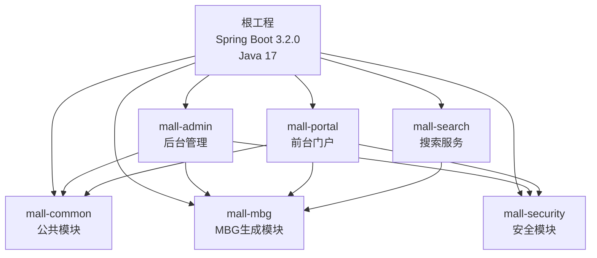
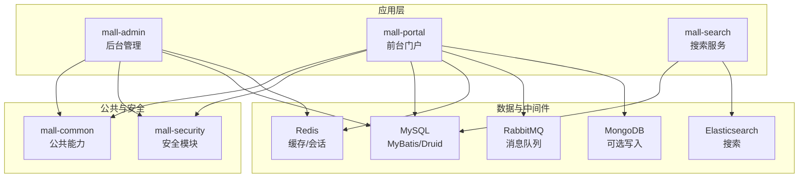
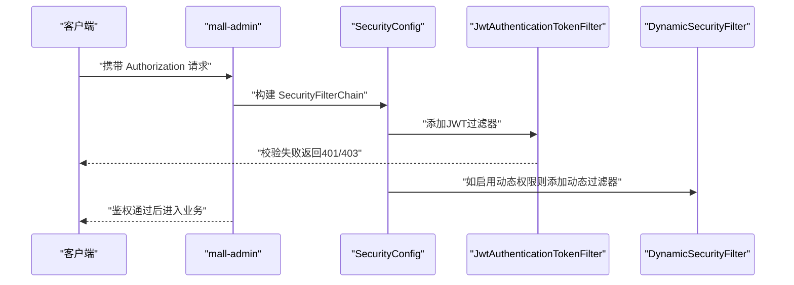
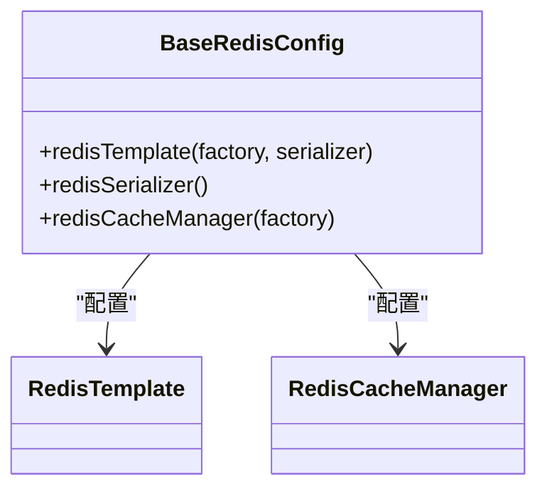
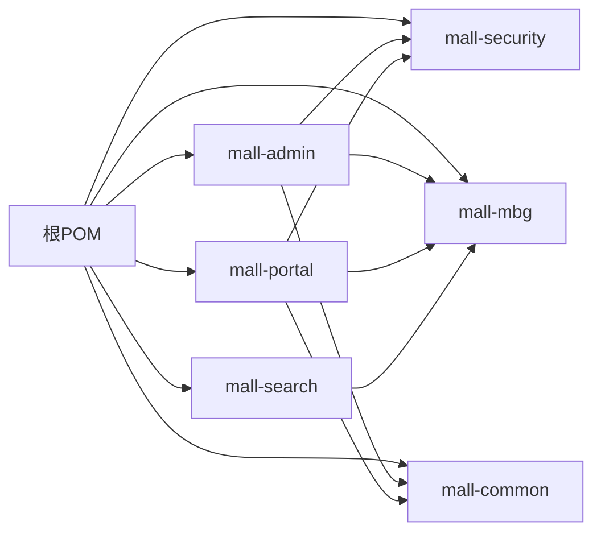

# 技术栈

<cite>
**本文引用的文件**
- [pom.xml](file://pom.xml)
- [mall-admin/pom.xml](file://mall-admin/pom.xml)
- [mall-portal/pom.xml](file://mall-portal/pom.xml)
- [mall-search/pom.xml](file://mall-search/pom.xml)
- [mall-common/pom.xml](file://mall-common/pom.xml)
- [mall-admin/src/main/resources/application.yml](file://mall-admin/src/main/resources/application.yml)
- [mall-portal/src/main/resources/application.yml](file://mall-portal/src/main/resources/application.yml)
- [mall-search/src/main/resources/application.yml](file://mall-search/src/main/resources/application.yml)
- [mall-security/src/main/java/com/macro/mall/security/config/SecurityConfig.java](file://mall-security/src/main/java/com/macro/mall/security/config/SecurityConfig.java)
- [mall-common/src/main/java/com/macro/mall/common/config/BaseRedisConfig.java](file://mall-common/src/main/java/com/macro/mall/common/config/BaseRedisConfig.java)
- [mall-admin/src/main/java/com/macro/mall/MallAdminApplication.java](file://mall-admin/src/main/java/com/macro/mall/MallAdminApplication.java)
- [mall-portal/src/main/java/com/macro/mall/portal/MallPortalApplication.java](file://mall-portal/src/main/java/com/macro/mall/portal/MallPortalApplication.java)
- [mall-search/src/main/java/com/macro/mall/search/MallSearchApplication.java](file://mall-search/src/main/java/com/macro/mall/search/MallSearchApplication.java)
</cite>

## 目录
1. [引言](#引言)
2. [项目结构](#项目结构)
3. [核心组件](#核心组件)
4. [架构总览](#架构总览)
5. [详细组件分析](#详细组件分析)
6. [依赖分析](#依赖分析)
7. [性能考虑](#性能考虑)
8. [故障排查指南](#故障排查指南)
9. [结论](#结论)
10. [附录](#附录)

## 引言
本文件系统梳理 Mall 项目的整体技术栈与实现方式，重点覆盖以下方面：
- 核心技术栈：Java 17、Spring Boot 3.2.0、Spring Security、MyBatis、Elasticsearch、Redis、MySQL 等
- 各组件作用与协作：ORM 框架、缓存策略、搜索能力、消息队列等
- 技术选型考量：性能、稳定性、可扩展性、社区支持
- 版本兼容性与升级路径建议
- 学习资源与最佳实践

## 项目结构
Mall 采用多模块 Maven 工程组织，核心模块包括：
- mall-common：公共能力（Web、Redis、日志、校验、异常）
- mall-mbg：MyBatis Generator 生成的模型与 Mapper
- mall-security：统一安全模块（JWT、动态权限、过滤器链）
- mall-admin：后台管理端
- mall-portal：前台门户端
- mall-search：搜索服务（Elasticsearch）
- mall-demo：示例模块

图表来源
- [pom.xml:12-20](file://pom.xml#L12-L20)
- [mall-admin/pom.xml:13-17](file://mall-admin/pom.xml#L13-L17)
- [mall-portal/pom.xml:14-18](file://mall-portal/pom.xml#L14-L18)
- [mall-search/pom.xml:14-18](file://mall-search/pom.xml#L14-L18)

章节来源
- [pom.xml:12-20](file://pom.xml#L12-L20)
- [mall-admin/pom.xml:13-17](file://mall-admin/pom.xml#L13-L17)
- [mall-portal/pom.xml:14-18](file://mall-portal/pom.xml#L14-L18)
- [mall-search/pom.xml:14-18](file://mall-search/pom.xml#L14-L18)

## 核心组件
- Java 17：统一编译与运行时版本，确保与 Spring Boot 3.x 生态兼容
- Spring Boot 3.2.0：父工程版本，统一依赖与插件管理
- Spring Security：基于无状态 JWT 的统一鉴权与授权
- MyBatis / MyBatis-Plus：ORM 映射与分页（PageHelper）
- Elasticsearch：商品检索与全文搜索
- Redis：缓存、验证码、限流、分布式锁等
- MySQL：持久化存储，配合 Druid 连接池
- RabbitMQ：异步消息（订单取消等）
- MongoDB：部分场景的数据写入（可选开关）

章节来源
- [pom.xml:22-27](file://pom.xml#L22-L27)
- [pom.xml:29-55](file://pom.xml#L29-L55)
- [mall-portal/pom.xml:29-49](file://mall-portal/pom.xml#L29-L49)
- [mall-search/pom.xml:20-35](file://mall-search/pom.xml#L20-L35)
- [mall-common/pom.xml:21-51](file://mall-common/pom.xml#L21-L51)

## 架构总览
Mall 采用“多应用 + 公共模块 + 安全模块”的分层架构：
- 多应用：admin、portal、search 分别承担不同职责
- 统一安全：mall-security 提供 JWT、动态权限、异常处理
- 统一公共：mall-common 提供 Redis、日志、校验、异常等
- 数据与中间件：MySQL（MyBatis）、Redis、Elasticsearch、RabbitMQ、MongoDB

图表来源
- [pom.xml:12-20](file://pom.xml#L12-L20)
- [mall-admin/pom.xml:19-36](file://mall-admin/pom.xml#L19-L36)
- [mall-portal/pom.xml:20-50](file://mall-portal/pom.xml#L20-L50)
- [mall-search/pom.xml:20-35](file://mall-search/pom.xml#L20-L35)
- [mall-common/pom.xml:21-51](file://mall-common/pom.xml#L21-L51)

## 详细组件分析

### Spring Security 与 JWT 鉴权
- 无状态会话：禁用 Session，使用 JWT 令牌承载身份
- 白名单放行：对 Swagger、静态资源、登录注册等路径放行
- 动态权限：支持运行时动态决策与资源授权
- 统一异常处理：认证失败与权限不足的统一响应

图表来源
- [mall-security/src/main/java/com/macro/mall/security/config/SecurityConfig.java:38-67](file://mall-security/src/main/java/com/macro/mall/security/config/SecurityConfig.java#L38-L67)

章节来源
- [mall-security/src/main/java/com/macro/mall/security/config/SecurityConfig.java:38-67](file://mall-security/src/main/java/com/macro/mall/security/config/SecurityConfig.java#L38-L67)
- [mall-admin/src/main/resources/application.yml:34-53](file://mall-admin/src/main/resources/application.yml#L34-L53)
- [mall-portal/src/main/resources/application.yml:21-40](file://mall-portal/src/main/resources/application.yml#L21-L40)

### Redis 缓存与序列化
- RedisTemplate：键值序列化策略（字符串、JSON）
- RedisCacheManager：默认缓存 TTL 1 天
- 应用场景：验证码、会员信息、资源列表、通用缓存

图表来源
- [mall-common/src/main/java/com/macro/mall/common/config/BaseRedisConfig.java:30-61](file://mall-common/src/main/java/com/macro/mall/common/config/BaseRedisConfig.java#L30-L61)

章节来源
- [mall-common/src/main/java/com/macro/mall/common/config/BaseRedisConfig.java:30-61](file://mall-common/src/main/java/com/macro/mall/common/config/BaseRedisConfig.java#L30-L61)
- [mall-admin/src/main/resources/application.yml:26-33](file://mall-admin/src/main/resources/application.yml#L26-L33)
- [mall-portal/src/main/resources/application.yml:42-51](file://mall-portal/src/main/resources/application.yml#L42-L51)

### MyBatis 与分页（PageHelper）
- MyBatis 起步依赖与版本管理
- PageHelper 分页插件，简化分页查询
- Mapper XML 位置与别名包配置

章节来源
- [pom.xml:113-136](file://pom.xml#L113-L136)
- [mall-admin/src/main/resources/application.yml:14-18](file://mall-admin/src/main/resources/application.yml#L14-L18)
- [mall-portal/src/main/resources/application.yml:10-14](file://mall-portal/src/main/resources/application.yml#L10-L14)
- [mall-search/src/main/resources/application.yml:13-16](file://mall-search/src/main/resources/application.yml#L13-L16)

### Elasticsearch 搜索
- 使用 Spring Boot Elasticsearch Starter
- 独立服务 mall-search，专注商品搜索
- 与 MBG 模块协同，提供搜索索引与查询能力

章节来源
- [mall-search/pom.xml:32-34](file://mall-search/pom.xml#L32-L34)
- [mall-search/src/main/resources/application.yml:10-11](file://mall-search/src/main/resources/application.yml#L10-L11)

### RabbitMQ 消息队列
- mall-portal 集成 spring-boot-starter-amqp
- 定义队列名称（如取消订单队列），支撑异步解耦

章节来源
- [mall-portal/pom.xml:39-43](file://mall-portal/pom.xml#L39-L43)
- [mall-portal/src/main/resources/application.yml:57-61](file://mall-portal/src/main/resources/application.yml#L57-L61)

### MongoDB 可选写入
- mall-portal 引入 spring-boot-starter-data-mongodb
- 通过配置开关控制是否从 SQL 写入 Mongo

章节来源
- [mall-portal/pom.xml:29-33](file://mall-portal/pom.xml#L29-L33)
- [mall-portal/src/main/resources/application.yml:52-55](file://mall-portal/src/main/resources/application.yml#L52-L55)

### 应用启动入口
- mall-admin、mall-portal、mall-search 均以 SpringBootApplication 启动
- portal/search 使用统一扫描基础包，保证跨模块组件可用

章节来源
- [mall-admin/src/main/java/com/macro/mall/MallAdminApplication.java:10-15](file://mall-admin/src/main/java/com/macro/mall/MallAdminApplication.java#L10-L15)
- [mall-portal/src/main/java/com/macro/mall/portal/MallPortalApplication.java:6-13](file://mall-portal/src/main/java/com/macro/mall/portal/MallPortalApplication.java#L6-L13)
- [mall-search/src/main/java/com/macro/mall/search/MallSearchApplication.java:6-12](file://mall-search/src/main/java/com/macro/mall/search/MallSearchApplication.java#L6-L12)

## 依赖分析
- 版本与兼容性
  - Java 17 与 Spring Boot 3.2.0：确保 Jakarta EE 依赖（如 Servlet API 6）与新特性支持
  - MyBatis 3.5.x 与 MyBatis-Spring Boot 3.x：稳定组合
  - PageHelper 与 MyBatis-Spring Boot Starter：注意排除重复依赖
  - MySQL Connector 8.0.x：与 JDBC 4.2+ 兼容
  - jjwt 0.11.5：与 Spring Security 5.7+ 兼容
  - Logstash Encoder：日志结构化输出
- 模块间依赖
  - mall-admin、mall-portal 依赖 mall-security 与 mall-mbg
  - mall-search 依赖 mall-mbg，并排除 Redis 以免重复引入

图表来源
- [pom.xml:12-20](file://pom.xml#L12-L20)
- [mall-admin/pom.xml:19-36](file://mall-admin/pom.xml#L19-L36)
- [mall-portal/pom.xml:20-50](file://mall-portal/pom.xml#L20-L50)
- [mall-search/pom.xml:20-35](file://mall-search/pom.xml#L20-L35)

章节来源
- [pom.xml:29-55](file://pom.xml#L29-L55)
- [mall-admin/pom.xml:19-36](file://mall-admin/pom.xml#L19-L36)
- [mall-portal/pom.xml:20-50](file://mall-portal/pom.xml#L20-L50)
- [mall-search/pom.xml:20-35](file://mall-search/pom.xml#L20-L35)

## 性能考虑
- 无状态鉴权：降低服务器会话开销，利于水平扩展
- Redis 缓存：热点数据本地化，减少数据库压力；合理设置 TTL
- 分页查询：PageHelper 减少一次性加载大结果集
- Elasticsearch：针对全文检索与聚合场景优化，避免复杂 SQL
- 连接池：Druid 提供监控与性能调优能力
- 日志结构化：Logstash Encoder 输出便于 ELK 分析与定位

## 故障排查指南
- 认证失败/未授权
  - 检查白名单配置与 JWT 头部格式
  - 关注 SecurityConfig 中异常处理器返回
- Redis 连接问题
  - 校验连接工厂与序列化器配置
  - 关注 TTL 设置与键命名规范
- MyBatis 映射异常
  - 核对 Mapper XML 路径与别名包
  - 检查分页参数与 PageHelper 排除冲突
- Elasticsearch 连接或索引异常
  - 校验集群连通性与索引映射
- RabbitMQ 消费异常
  - 校验队列名称与交换机绑定
  - 关注消息确认与重试策略

章节来源
- [mall-security/src/main/java/com/macro/mall/security/config/SecurityConfig.java:38-67](file://mall-security/src/main/java/com/macro/mall/security/config/SecurityConfig.java#L38-L67)
- [mall-common/src/main/java/com/macro/mall/common/config/BaseRedisConfig.java:30-61](file://mall-common/src/main/java/com/macro/mall/common/config/BaseRedisConfig.java#L30-L61)
- [mall-admin/src/main/resources/application.yml:14-18](file://mall-admin/src/main/resources/application.yml#L14-L18)
- [mall-search/src/main/resources/application.yml:13-16](file://mall-search/src/main/resources/application.yml#L13-L16)
- [mall-portal/src/main/resources/application.yml:57-61](file://mall-portal/src/main/resources/application.yml#L57-L61)

## 结论
Mall 的技术栈围绕 Spring Boot 3.2.0 与 Java 17 构建，结合 Spring Security 实现统一鉴权，利用 MyBatis 与 PageHelper 完成 ORM 与分页，Redis、Elasticsearch、RabbitMQ、MongoDB 等中间件满足高并发与多样化业务需求。整体设计强调无状态、可扩展与可观测性，适合中大型电商类项目的演进。

## 附录
- 版本兼容性与升级建议
  - Spring Boot 3.x → JDK 17+、Jakarta EE 依赖、WebMvcTest 改动
  - MyBatis 3.5.x → 保持与 MyBatis-Spring Boot 3.x 的组合
  - PageHelper 与 MyBatis-Spring Boot Starter：注意排除重复依赖
  - MySQL Connector 8.0.x：升级前验证时区与 SSL 配置
  - jjwt 0.11.5：与 Spring Security 5.7+ 兼容，升级需测试令牌签发与解析
- 学习资源与最佳实践
  - Spring Security 官方文档与无状态 JWT 示例
  - MyBatis 官方文档与 PageHelper 使用指南
  - Elasticsearch 官方文档与索引设计最佳实践
  - Redis 官方文档与缓存策略
  - RabbitMQ 官方文档与消息幂等性设计
  - MongoDB 官方文档与读写分离策略