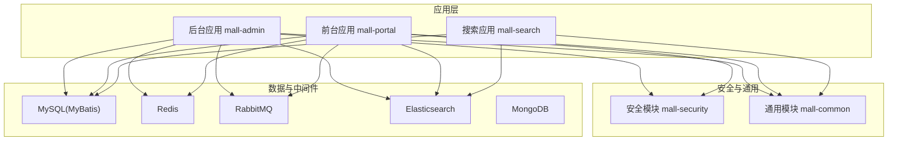
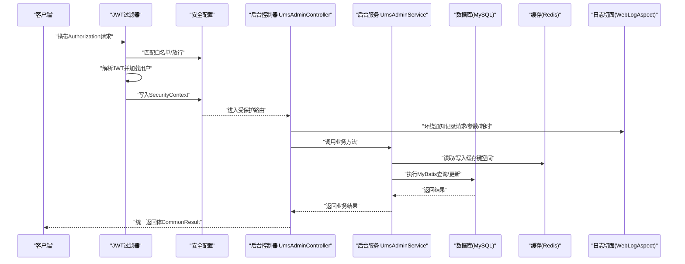
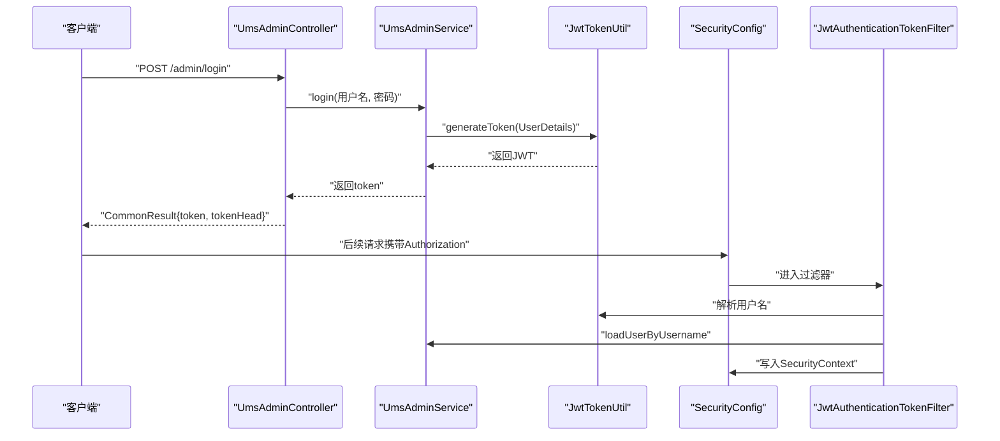
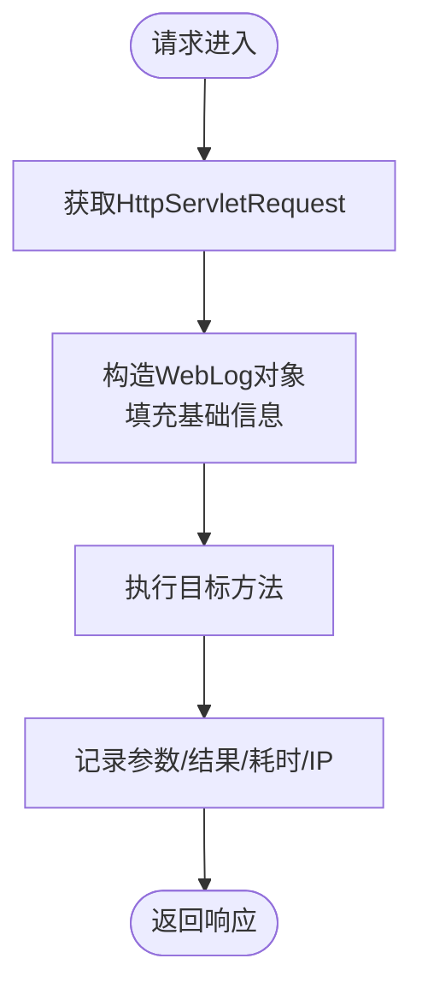
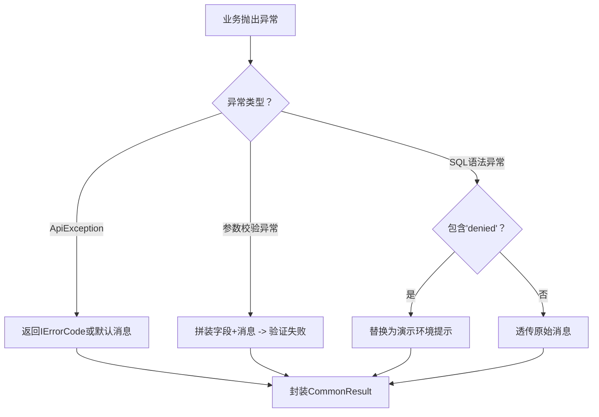
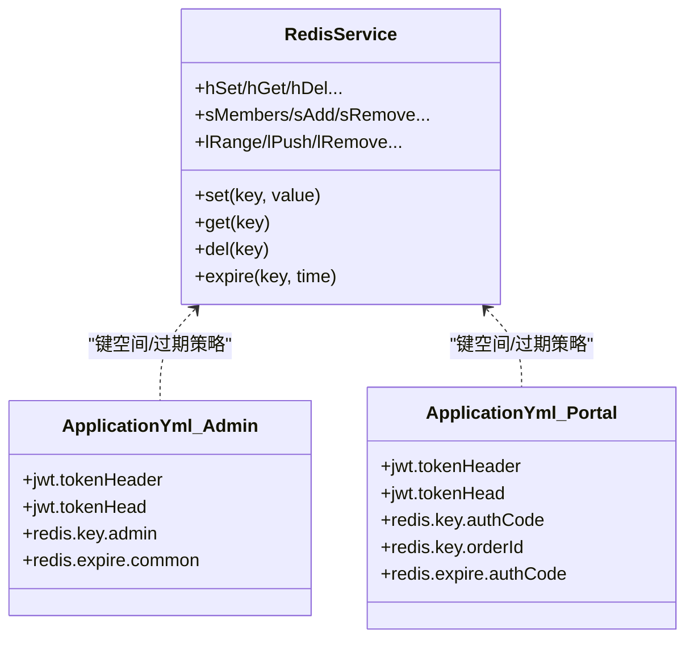
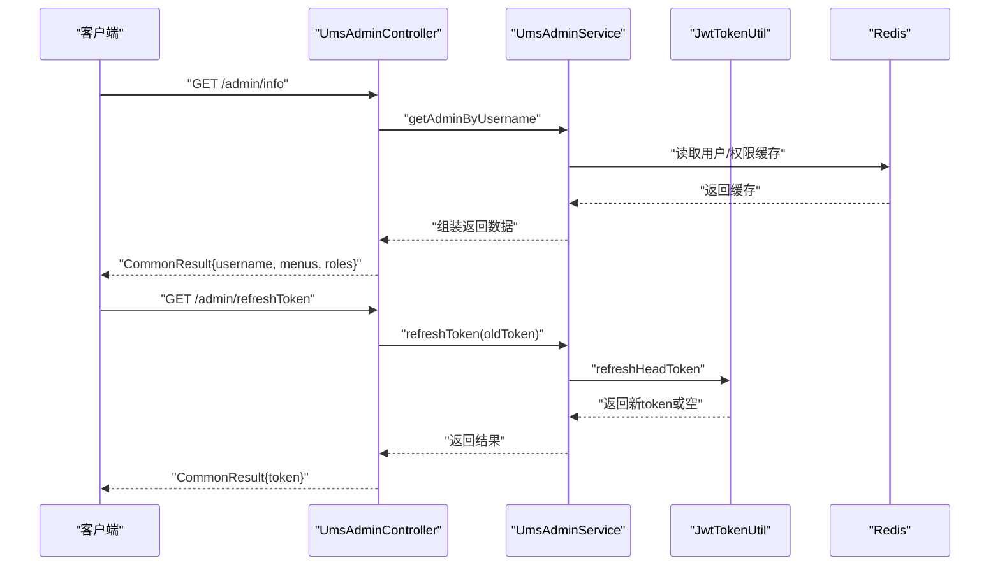
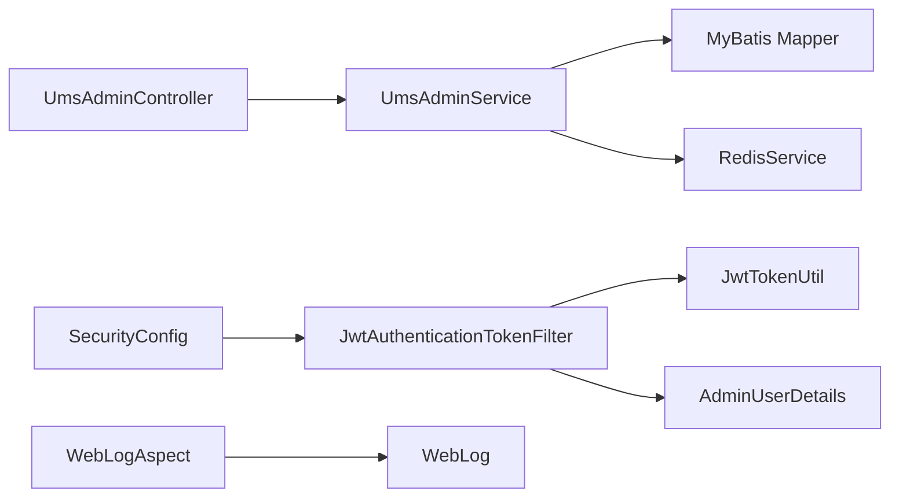

# 数据流设计

<cite>
**本文引用的文件**
- [README.md](file://README.md)
- [MallAdminApplication.java](file://mall-admin/src/main/java/com/macro/mall/MallAdminApplication.java)
- [MallPortalApplication.java](file://mall-portal/src/main/java/com/macro/mall/portal/MallPortalApplication.java)
- [MallSearchApplication.java](file://mall-search/src/main/java/com/macro/mall/search/MallSearchApplication.java)
- [application.yml（后台）](file://mall-admin/src/main/resources/application.yml)
- [application.yml（前台）](file://mall-portal/src/main/resources/application.yml)
- [WebLogAspect.java](file://mall-common/src/main/java/com/macro/mall/common/log/WebLogAspect.java)
- [WebLog.java](file://mall-common/src/main/java/com/macro/mall/common/domain/WebLog.java)
- [CommonResult.java](file://mall-common/src/main/java/com/macro/mall/common/api/CommonResult.java)
- [GlobalExceptionHandler.java](file://mall-common/src/main/java/com/macro/mall/common/exception/GlobalExceptionHandler.java)
- [JwtTokenUtil.java](file://mall-security/src/main/java/com/macro/mall/security/util/JwtTokenUtil.java)
- [JwtAuthenticationTokenFilter.java](file://mall-security/src/main/java/com/macro/mall/security/component/JwtAuthenticationTokenFilter.java)
- [SecurityConfig.java](file://mall-security/src/main/java/com/macro/mall/security/config/SecurityConfig.java)
- [AdminUserDetails.java](file://mall-admin/src/main/java/com/macro/mall/bo/AdminUserDetails.java)
- [UmsAdminController.java](file://mall-admin/src/main/java/com/macro/mall/controller/UmsAdminController.java)
- [UmsAdminService.java](file://mall-admin/src/main/java/com/macro/mall/service/UmsAdminService.java)
- [RedisService.java](file://mall-common/src/main/java/com/macro/mall/common/service/RedisService.java)
</cite>

## 目录
1. [简介](#简介)
2. [项目结构](#项目结构)
3. [核心组件](#核心组件)
4. [架构总览](#架构总览)
5. [详细组件分析](#详细组件分析)
6. [依赖分析](#依赖分析)
7. [性能考虑](#性能考虑)
8. [故障排查指南](#故障排查指南)
9. [结论](#结论)
10. [附录](#附录)

## 简介
本文件面向Mall项目的“数据流设计”，聚焦以下目标：
- 系统请求处理链路与数据传输机制
- 缓存策略与持久化方案
- JWT认证流程与权限验证机制
- 日志记录与监控数据流
- 商品管理、订单处理、用户管理等核心业务的数据流转（含数据验证、业务规则检查、事务管理与错误处理）
- 异步处理机制（消息队列应用场景与数据同步策略）
- 数据流图与时序图，帮助开发者理解复杂业务与数据处理过程
- 性能优化与数据一致性保障措施

## 项目结构
Mall采用多模块架构，包含后台管理、前台商城、搜索、公共模块与安全模块，配合Redis、RabbitMQ、Elasticsearch、MongoDB等中间件，形成前后端分离、高内聚低耦合的电商系统。

图示来源
- [MallAdminApplication.java:10-15](file://mall-admin/src/main/java/com/macro/mall/MallAdminApplication.java#L10-L15)
- [MallPortalApplication.java:6-12](file://mall-portal/src/main/java/com/macro/mall/portal/MallPortalApplication.java#L6-L12)
- [MallSearchApplication.java:6-11](file://mall-search/src/main/java/com/macro/mall/search/MallSearchApplication.java#L6-L11)
- [application.yml（后台）:1-66](file://mall-admin/src/main/resources/application.yml#L1-L66)
- [application.yml（前台）:1-62](file://mall-portal/src/main/resources/application.yml#L1-L62)

章节来源
- [README.md:51-62](file://README.md#L51-L62)
- [MallAdminApplication.java:10-15](file://mall-admin/src/main/java/com/macro/mall/MallAdminApplication.java#L10-L15)
- [MallPortalApplication.java:6-12](file://mall-portal/src/main/java/com/macro/mall/portal/MallPortalApplication.java#L6-L12)
- [MallSearchApplication.java:6-11](file://mall-search/src/main/java/com/macro/mall/search/MallSearchApplication.java#L6-L11)
- [application.yml（后台）:1-66](file://mall-admin/src/main/resources/application.yml#L1-L66)
- [application.yml（前台）:1-62](file://mall-portal/src/main/resources/application.yml#L1-L62)

## 核心组件
- 安全与认证
  - JWT工具：生成、解析、刷新与过期判断
  - JWT过滤器：从请求头读取令牌，解析用户并写入安全上下文
  - 安全配置：禁用CSRF、无状态会话、白名单放行、异常处理器
  - 用户详情：封装后台用户与资源权限
- 日志与监控
  - Web日志切面：统一记录请求、参数、响应、耗时与IP
  - 日志输出：结合Logstash写入Elasticsearch
- 通用返回体与异常处理
  - 统一返回体：成功/失败/验证失败/未登录/未授权
  - 全局异常处理：参数校验、SQL权限等异常转换
- 缓存与持久化
  - Redis服务接口：键值、哈希、集合、列表等常用操作
  - 配置：后台/前台各自Redis键空间与过期策略
- 业务入口
  - 后台用户控制器：登录、刷新、注销、个人信息、角色管理等

章节来源
- [JwtTokenUtil.java:28-171](file://mall-security/src/main/java/com/macro/mall/security/util/JwtTokenUtil.java#L28-L171)
- [JwtAuthenticationTokenFilter.java:25-57](file://mall-security/src/main/java/com/macro/mall/security/component/JwtAuthenticationTokenFilter.java#L25-L57)
- [SecurityConfig.java:38-67](file://mall-security/src/main/java/com/macro/mall/security/config/SecurityConfig.java#L38-L67)
- [AdminUserDetails.java:17-65](file://mall-admin/src/main/java/com/macro/mall/bo/AdminUserDetails.java#L17-L65)
- [WebLogAspect.java:36-89](file://mall-common/src/main/java/com/macro/mall/common/log/WebLogAspect.java#L36-L89)
- [WebLog.java:10-68](file://mall-common/src/main/java/com/macro/mall/common/domain/WebLog.java#L10-L68)
- [CommonResult.java:7-134](file://mall-common/src/main/java/com/macro/mall/common/api/CommonResult.java#L7-L134)
- [GlobalExceptionHandler.java:19-68](file://mall-common/src/main/java/com/macro/mall/common/exception/GlobalExceptionHandler.java#L19-L68)
- [RedisService.java:11-182](file://mall-common/src/main/java/com/macro/mall/common/service/RedisService.java#L11-L182)
- [UmsAdminController.java:34-191](file://mall-admin/src/main/java/com/macro/mall/controller/UmsAdminController.java#L34-L191)
- [UmsAdminService.java:17-98](file://mall-admin/src/main/java/com/macro/mall/service/UmsAdminService.java#L17-L98)

## 架构总览
下图展示从客户端到各子系统的请求与数据流，涵盖认证、鉴权、日志、缓存与持久化。

图示来源
- [JwtAuthenticationTokenFilter.java:36-56](file://mall-security/src/main/java/com/macro/mall/security/component/JwtAuthenticationTokenFilter.java#L36-L56)
- [SecurityConfig.java:38-67](file://mall-security/src/main/java/com/macro/mall/security/config/SecurityConfig.java#L38-L67)
- [UmsAdminController.java:54-79](file://mall-admin/src/main/java/com/macro/mall/controller/UmsAdminController.java#L54-L79)
- [UmsAdminService.java:34-40](file://mall-admin/src/main/java/com/macro/mall/service/UmsAdminService.java#L34-L40)
- [RedisService.java:11-182](file://mall-common/src/main/java/com/macro/mall/common/service/RedisService.java#L11-L182)
- [WebLogAspect.java:54-89](file://mall-common/src/main/java/com/macro/mall/common/log/WebLogAspect.java#L54-L89)
- [CommonResult.java:35-101](file://mall-common/src/main/java/com/macro/mall/common/api/CommonResult.java#L35-L101)

## 详细组件分析

### JWT认证与权限验证流程
- 登录与令牌发放
  - 控制器接收用户名/密码，服务层校验后生成JWT
  - 令牌包含签发时间与过期时间，支持刷新
- 请求阶段的认证
  - 过滤器从请求头读取Authorization，去除前缀后解析用户名
  - 若未认证且用户存在，则将用户信息与权限写入SecurityContext
- 权限控制
  - 安全配置禁用CSRF、无状态会话
  - 白名单URL直接放行；其他请求必须认证
  - 动态权限扩展点可按需接入

图示来源
- [UmsAdminController.java:54-65](file://mall-admin/src/main/java/com/macro/mall/controller/UmsAdminController.java#L54-L65)
- [UmsAdminService.java:34-40](file://mall-admin/src/main/java/com/macro/mall/service/UmsAdminService.java#L34-L40)
- [JwtTokenUtil.java:117-122](file://mall-security/src/main/java/com/macro/mall/security/util/JwtTokenUtil.java#L117-L122)
- [JwtAuthenticationTokenFilter.java:36-56](file://mall-security/src/main/java/com/macro/mall/security/component/JwtAuthenticationTokenFilter.java#L36-L56)
- [SecurityConfig.java:38-67](file://mall-security/src/main/java/com/macro/mall/security/config/SecurityConfig.java#L38-L67)

章节来源
- [UmsAdminController.java:54-79](file://mall-admin/src/main/java/com/macro/mall/controller/UmsAdminController.java#L54-L79)
- [UmsAdminService.java:34-40](file://mall-admin/src/main/java/com/macro/mall/service/UmsAdminService.java#L34-L40)
- [JwtTokenUtil.java:76-122](file://mall-security/src/main/java/com/macro/mall/security/util/JwtTokenUtil.java#L76-L122)
- [JwtAuthenticationTokenFilter.java:36-56](file://mall-security/src/main/java/com/macro/mall/security/component/JwtAuthenticationTokenFilter.java#L36-L56)
- [SecurityConfig.java:38-67](file://mall-security/src/main/java/com/macro/mall/security/config/SecurityConfig.java#L38-L67)
- [AdminUserDetails.java:28-64](file://mall-admin/src/main/java/com/macro/mall/bo/AdminUserDetails.java#L28-L64)

### 日志记录与监控数据流
- WebLog切面
  - 统一切面捕获请求元数据（URL、方法、参数、IP、耗时）、响应结果
  - 输出结构化日志，便于Logstash采集并写入Elasticsearch
- 日志模型
  - WebLog封装了描述、用户、起止时间、URI、URL、方法、IP、参数、结果等字段

图示来源
- [WebLogAspect.java:54-89](file://mall-common/src/main/java/com/macro/mall/common/log/WebLogAspect.java#L54-L89)
- [WebLog.java:10-68](file://mall-common/src/main/java/com/macro/mall/common/domain/WebLog.java#L10-L68)

章节来源
- [WebLogAspect.java:36-89](file://mall-common/src/main/java/com/macro/mall/common/log/WebLogAspect.java#L36-L89)
- [WebLog.java:10-68](file://mall-common/src/main/java/com/macro/mall/common/domain/WebLog.java#L10-L68)

### 通用返回体与全局异常处理
- 统一返回体
  - 成功/失败/验证失败/未登录/未授权等标准化结构
- 全局异常处理
  - 参数校验异常、绑定异常、SQL语法异常等统一转换为CommonResult

图示来源
- [CommonResult.java:35-108](file://mall-common/src/main/java/com/macro/mall/common/api/CommonResult.java#L35-L108)
- [GlobalExceptionHandler.java:23-67](file://mall-common/src/main/java/com/macro/mall/common/exception/GlobalExceptionHandler.java#L23-L67)

章节来源
- [CommonResult.java:7-134](file://mall-common/src/main/java/com/macro/mall/common/api/CommonResult.java#L7-L134)
- [GlobalExceptionHandler.java:19-68](file://mall-common/src/main/java/com/macro/mall/common/exception/GlobalExceptionHandler.java#L19-L68)

### 缓存策略与持久化方案
- 缓存接口
  - 支持键值、哈希、集合、列表等结构，提供过期、递增/递减、批量删除等能力
- Redis键空间与过期
  - 后台：管理员、资源列表等键空间，通用过期24小时
  - 前台：验证码、订单ID、会员等键空间，验证码短期过期
- 持久化
  - MyBatis + Mapper XML进行数据库访问
  - MongoDB用于部分场景（如SQL插入开关）

图示来源
- [RedisService.java:11-182](file://mall-common/src/main/java/com/macro/mall/common/service/RedisService.java#L11-L182)
- [application.yml（后台）:26-33](file://mall-admin/src/main/resources/application.yml#L26-L33)
- [application.yml（前台）:42-51](file://mall-portal/src/main/resources/application.yml#L42-L51)

章节来源
- [RedisService.java:11-182](file://mall-common/src/main/java/com/macro/mall/common/service/RedisService.java#L11-L182)
- [application.yml（后台）:26-33](file://mall-admin/src/main/resources/application.yml#L26-L33)
- [application.yml（前台）:42-51](file://mall-portal/src/main/resources/application.yml#L42-L51)

### 用户管理数据流（登录/刷新/注销/信息）
- 登录
  - 控制器接收用户名/密码，服务层生成JWT并返回
- 刷新
  - 从前端请求头读取旧令牌，服务层刷新后返回新令牌
- 注销
  - 服务层执行登出逻辑（例如清理缓存）
- 个人信息
  - 读取当前Principal，查询用户与菜单/角色信息

图示来源
- [UmsAdminController.java:81-99](file://mall-admin/src/main/java/com/macro/mall/controller/UmsAdminController.java#L81-L99)
- [UmsAdminController.java:67-79](file://mall-admin/src/main/java/com/macro/mall/controller/UmsAdminController.java#L67-L79)
- [UmsAdminService.java:86-97](file://mall-admin/src/main/java/com/macro/mall/service/UmsAdminService.java#L86-L97)
- [JwtTokenUtil.java:129-153](file://mall-security/src/main/java/com/macro/mall/security/util/JwtTokenUtil.java#L129-L153)

章节来源
- [UmsAdminController.java:54-99](file://mall-admin/src/main/java/com/macro/mall/controller/UmsAdminController.java#L54-L99)
- [UmsAdminService.java:34-97](file://mall-admin/src/main/java/com/macro/mall/service/UmsAdminService.java#L34-L97)
- [JwtTokenUtil.java:117-153](file://mall-security/src/main/java/com/macro/mall/security/util/JwtTokenUtil.java#L117-L153)

### 异步处理与消息队列
- 配置位置
  - 前台应用配置中声明消息队列名称（如取消订单队列）
- 应用场景
  - 订单超时取消、库存释放、积分/成长值变更、营销活动异步通知等
- 数据同步策略
  - 事件驱动：生产者发布消息，消费者消费并更新数据库与缓存
  - 幂等性：消费者基于唯一业务ID去重，确保重复消费不产生副作用
  - 事务一致性：建议采用本地消息表或死信队列保障最终一致

章节来源
- [application.yml（前台）:57-61](file://mall-portal/src/main/resources/application.yml#L57-L61)

## 依赖分析
- 组件耦合
  - 控制器依赖服务接口，服务依赖DAO与缓存接口
  - 安全过滤器依赖用户详情服务与JWT工具
  - 日志切面横切所有控制器方法
- 外部依赖
  - Redis提供高性能缓存与会话无状态化
  - RabbitMQ支撑异步任务与事件解耦
  - Elasticsearch承载日志与搜索
  - MongoDB用于特定场景的数据存储

图示来源
- [UmsAdminController.java:34-191](file://mall-admin/src/main/java/com/macro/mall/controller/UmsAdminController.java#L34-L191)
- [UmsAdminService.java:17-98](file://mall-admin/src/main/java/com/macro/mall/service/UmsAdminService.java#L17-L98)
- [JwtAuthenticationTokenFilter.java:25-57](file://mall-security/src/main/java/com/macro/mall/security/component/JwtAuthenticationTokenFilter.java#L25-L57)
- [JwtTokenUtil.java:28-171](file://mall-security/src/main/java/com/macro/mall/security/util/JwtTokenUtil.java#L28-L171)
- [AdminUserDetails.java:17-65](file://mall-admin/src/main/java/com/macro/mall/bo/AdminUserDetails.java#L17-L65)
- [WebLogAspect.java:36-89](file://mall-common/src/main/java/com/macro/mall/common/log/WebLogAspect.java#L36-L89)
- [WebLog.java:10-68](file://mall-common/src/main/java/com/macro/mall/common/domain/WebLog.java#L10-L68)
- [SecurityConfig.java:38-67](file://mall-security/src/main/java/com/macro/mall/security/config/SecurityConfig.java#L38-L67)
- [RedisService.java:11-182](file://mall-common/src/main/java/com/macro/mall/common/service/RedisService.java#L11-L182)

## 性能考虑
- 无状态会话
  - 禁用Session，使用JWT，降低服务器状态开销
- 缓存优先
  - 用户信息、菜单/权限、验证码等高频数据走Redis，减少数据库压力
- 分页与索引
  - 列表查询使用分页，数据库建立必要索引
- 日志异步
  - WebLog切面采用结构化日志，结合Logstash异步写入ES
- 事务边界
  - 业务方法标注事务，避免长事务占用锁资源
- 消息队列削峰
  - 将非实时任务投递至RabbitMQ，平滑瞬时流量

## 故障排查指南
- 认证失败
  - 检查请求头Authorization格式是否为“Bearer ”前缀
  - 核对JWT密钥、过期时间与刷新窗口
- 权限不足
  - 确认用户资源权限是否正确加载
  - 动态权限过滤器是否启用
- 参数校验失败
  - 查看全局异常处理对字段错误的映射
- SQL权限受限
  - 演示环境限制修改，查看异常处理器的提示逻辑
- 日志缺失
  - 确认WebLog切面是否生效，Logstash是否正常采集

章节来源
- [JwtAuthenticationTokenFilter.java:36-56](file://mall-security/src/main/java/com/macro/mall/security/component/JwtAuthenticationTokenFilter.java#L36-L56)
- [SecurityConfig.java:38-67](file://mall-security/src/main/java/com/macro/mall/security/config/SecurityConfig.java#L38-L67)
- [GlobalExceptionHandler.java:32-67](file://mall-common/src/main/java/com/macro/mall/common/exception/GlobalExceptionHandler.java#L32-L67)
- [WebLogAspect.java:54-89](file://mall-common/src/main/java/com/macro/mall/common/log/WebLogAspect.java#L54-L89)

## 结论
Mall通过“安全无状态 + 缓存优先 + 统一返回 + 结构化日志 + 异步消息”的组合，实现了清晰的数据流与可维护的架构。JWT认证与权限控制贯穿请求链路，Redis与RabbitMQ分别承担缓存与异步解耦，WebLog切面提供可观测性。建议在生产环境中进一步完善动态权限、幂等与事务一致性保障，并持续优化热点缓存与慢查询。

## 附录
- 关键配置要点
  - JWT：tokenHeader、tokenHead、secret、expiration
  - 白名单：/swagger-ui、/druid、/admin/login 等
  - Redis键空间：后台/前台各自命名空间与过期策略
  - 消息队列：前台应用声明队列名称

章节来源
- [application.yml（后台）:20-51](file://mall-admin/src/main/resources/application.yml#L20-L51)
- [application.yml（前台）:15-61](file://mall-portal/src/main/resources/application.yml#L15-L61)