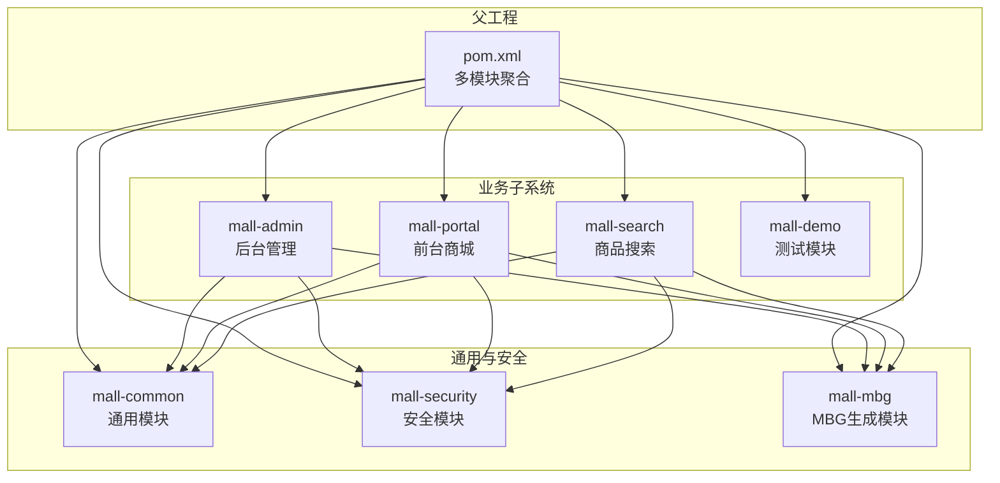
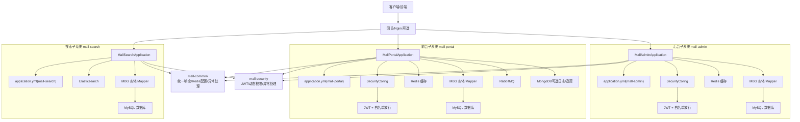
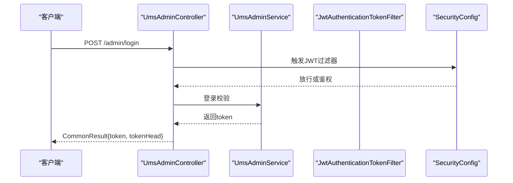
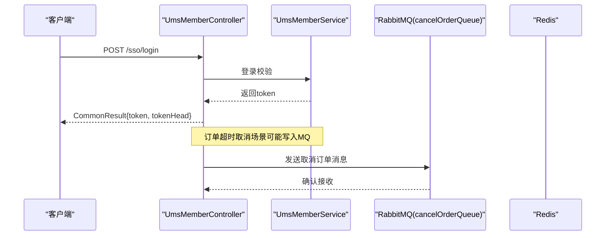
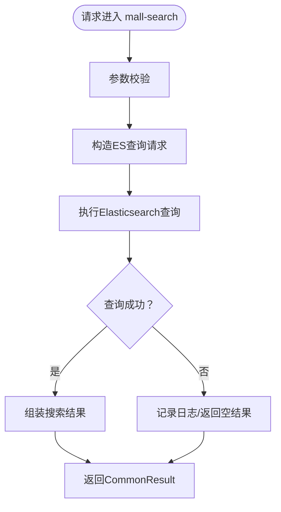
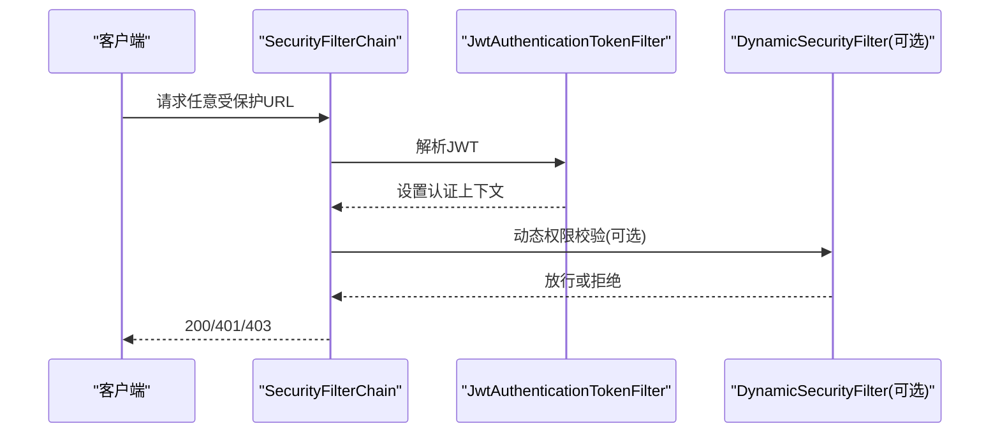
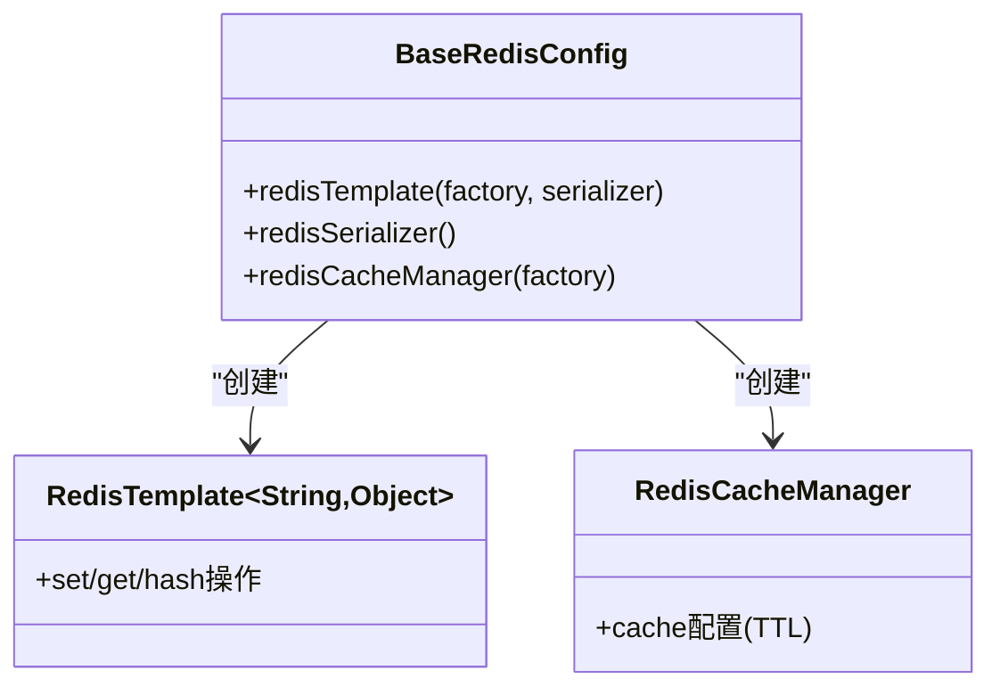
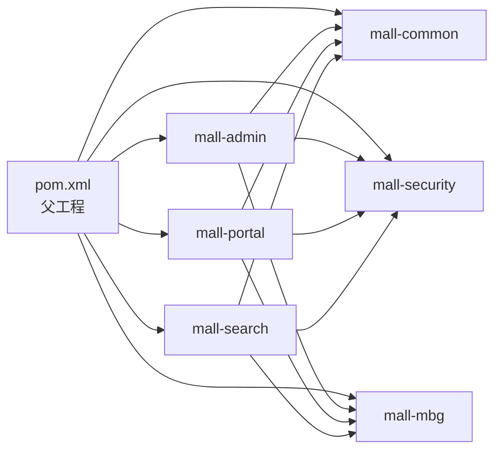

# 架构设计

<cite>
**本文引用的文件**
- [pom.xml](file://pom.xml)
- [README.md](file://README.md)
- [MallAdminApplication.java](file://mall-admin/src/main/java/com/macro/mall/MallAdminApplication.java)
- [MallPortalApplication.java](file://mall-portal/src/main/java/com/macro/mall/portal/MallPortalApplication.java)
- [MallSearchApplication.java](file://mall-search/src/main/java/com/macro/mall/search/MallSearchApplication.java)
- [application.yml（mall-admin）](file://mall-admin/src/main/resources/application.yml)
- [application.yml（mall-portal）](file://mall-portal/src/main/resources/application.yml)
- [application.yml（mall-search）](file://mall-search/src/main/resources/application.yml)
- [SecurityConfig.java](file://mall-security/src/main/java/com/macro/mall/security/config/SecurityConfig.java)
- [BaseRedisConfig.java](file://mall-common/src/main/java/com/macro/mall/common/config/BaseRedisConfig.java)
- [CommonResult.java](file://mall-common/src/main/java/com/macro/mall/common/api/CommonResult.java)
- [UmsAdminController.java](file://mall-admin/src/main/java/com/macro/mall/controller/UmsAdminController.java)
- [UmsMemberController.java](file://mall-portal/src/main/java/com/macro/mall/portal/controller/UmsMemberController.java)
- [mall.sql](file://document/sql/mall.sql)
</cite>

## 目录
1. [引言](#引言)
2. [项目结构](#项目结构)
3. [核心组件](#核心组件)
4. [架构总览](#架构总览)
5. [详细组件分析](#详细组件分析)
6. [依赖分析](#依赖分析)
7. [性能考虑](#性能考虑)
8. [故障排查指南](#故障排查指南)
9. [结论](#结论)
10. [附录](#附录)

## 引言
本项目是一套电商系统，包含前台商城系统与后台管理系统，采用 Spring Boot 微服务化架构，结合 MyBatis、Redis、JWT、RabbitMQ、Elasticsearch 等技术栈，实现高内聚、低耦合的模块化设计。系统通过统一的通用模块与安全模块，向上支撑 mall-admin（后台）、mall-portal（前台）、mall-search（搜索）三大业务子系统，形成清晰的职责边界与数据流。

## 项目结构
项目采用多模块 Maven 结构，父工程统一管理版本与依赖，子模块按领域与职责拆分：
- mall-common：通用工具、统一响应体、Redis 基础配置、全局异常处理等
- mall-security：安全配置、JWT 过滤器、动态权限组件
- mall-mbg：MyBatis Generator 自动生成的实体与 Mapper
- mall-admin：后台管理系统接口与业务
- mall-portal：前台商城系统接口与业务
- mall-search：基于 Elasticsearch 的商品搜索服务
- mall-demo：框架搭建时的测试代码

**图表来源**
- [pom.xml:12-20](file://pom.xml#L12-L20)
- [README.md:51-62](file://README.md#L51-L62)

**章节来源**
- [pom.xml:12-20](file://pom.xml#L12-L20)
- [README.md:51-62](file://README.md#L51-L62)

## 核心组件
- 统一响应体与异常处理：mall-common 提供 CommonResult 统一返回结构与全局异常处理，保证各子系统对外一致的契约。
- 安全与鉴权：mall-security 封装 Spring Security 与 JWT，提供无状态鉴权、白名单放行、动态权限过滤等能力。
- 缓存与序列化：mall-common 提供 RedisTemplate、Jackson 序列化与 RedisCacheManager，统一缓存策略。
- 业务入口：各子系统通过独立的 Spring Boot 启动类暴露服务，分别对应 mall-admin、mall-portal、mall-search。

**章节来源**
- [CommonResult.java:1-134](file://mall-common/src/main/java/com/macro/mall/common/api/CommonResult.java#L1-L134)
- [SecurityConfig.java:1-70](file://mall-security/src/main/java/com/macro/mall/security/config/SecurityConfig.java#L1-L70)
- [BaseRedisConfig.java:1-67](file://mall-common/src/main/java/com/macro/mall/common/config/BaseRedisConfig.java#L1-L67)
- [MallAdminApplication.java:1-16](file://mall-admin/src/main/java/com/macro/mall/MallAdminApplication.java#L1-L16)
- [MallPortalApplication.java:1-14](file://mall-portal/src/main/java/com/macro/mall/portal/MallPortalApplication.java#L1-L14)
- [MallSearchApplication.java:1-13](file://mall-search/src/main/java/com/macro/mall/search/MallSearchApplication.java#L1-L13)

## 架构总览
系统采用“多模块 + 微服务化”的架构模式，以 Spring Boot 为核心，结合以下关键技术：
- 认证与授权：JWT + Spring Security 无状态鉴权
- 数据访问：MyBatis + MyBatis Generator（MBG）
- 缓存：Redis（JSON 序列化、统一 TTL）
- 搜索：Elasticsearch（mall-search 子系统）
- 消息队列：RabbitMQ（订单超时取消等异步任务）
- 对象存储：阿里云 OSS 或 MinIO（mall-admin 支持）
- 文档：SpringDoc OpenAPI
- 容器化：Docker（Fabric8 插件打包）

**图表来源**
- [MallAdminApplication.java:1-16](file://mall-admin/src/main/java/com/macro/mall/MallAdminApplication.java#L1-L16)
- [MallPortalApplication.java:1-14](file://mall-portal/src/main/java/com/macro/mall/portal/MallPortalApplication.java#L1-L14)
- [MallSearchApplication.java:1-13](file://mall-search/src/main/java/com/macro/mall/search/MallSearchApplication.java#L1-L13)
- [application.yml（mall-admin）:1-66](file://mall-admin/src/main/resources/application.yml#L1-L66)
- [application.yml（mall-portal）:1-62](file://mall-portal/src/main/resources/application.yml#L1-L62)
- [application.yml（mall-search）:1-20](file://mall-search/src/main/resources/application.yml#L1-L20)
- [SecurityConfig.java:1-70](file://mall-security/src/main/java/com/macro/mall/security/config/SecurityConfig.java#L1-L70)
- [BaseRedisConfig.java:1-67](file://mall-common/src/main/java/com/macro/mall/common/config/BaseRedisConfig.java#L1-L67)

## 详细组件分析

### 后台子系统 mall-admin
- 职责：商品、订单、会员、促销、运营、内容、权限等后台管理能力
- 启动入口：MallAdminApplication
- 安全：通过 SecurityConfig 配置无状态会话、JWT 过滤器、白名单放行
- 配置要点：
  - MyBatis Mapper 扫描与别名包
  - JWT 头部、密钥、过期时间、前缀
  - Redis 缓存键命名与过期策略
  - 白名单 URL（Swagger、Druid、登录/注册等）
  - 阿里云 OSS 配置（Endpoint、Bucket、Policy、回调等）
- 控制器示例：UmsAdminController 提供后台用户登录、刷新令牌、角色分配等接口，统一返回 CommonResult

**图表来源**
- [UmsAdminController.java:54-65](file://mall-admin/src/main/java/com/macro/mall/controller/UmsAdminController.java#L54-L65)
- [SecurityConfig.java:38-67](file://mall-security/src/main/java/com/macro/mall/security/config/SecurityConfig.java#L38-L67)
- [application.yml（mall-admin）:20-53](file://mall-admin/src/main/resources/application.yml#L20-L53)

**章节来源**
- [MallAdminApplication.java:1-16](file://mall-admin/src/main/java/com/macro/mall/MallAdminApplication.java#L1-L16)
- [UmsAdminController.java:1-192](file://mall-admin/src/main/java/com/macro/mall/controller/UmsAdminController.java#L1-L192)
- [application.yml（mall-admin）:1-66](file://mall-admin/src/main/resources/application.yml#L1-L66)
- [SecurityConfig.java:1-70](file://mall-security/src/main/java/com/macro/mall/security/config/SecurityConfig.java#L1-L70)

### 前台子系统 mall-portal
- 职责：首页、商品、购物车、订单、会员 SSO、支付等前台业务
- 启动入口：MallPortalApplication
- 安全：同 mall-admin，通过 SecurityConfig 与 JWT
- 配置要点：
  - MyBatis Mapper 扫描
  - JWT 头部、密钥、过期时间、前缀
  - 白名单 URL（Swagger、Druid、SSO、首页、商品、品牌、支付等）
  - Redis 缓存键命名（验证码、订单号、会员信息）
  - RabbitMQ 队列（cancelOrderQueue）
  - MongoDB 插入开关（SQL 到 Mongo 的数据注入）
- 控制器示例：UmsMemberController 提供注册、登录、刷新令牌、获取当前会员信息、修改密码等接口，统一返回 CommonResult

**图表来源**
- [UmsMemberController.java:45-57](file://mall-portal/src/main/java/com/macro/mall/portal/controller/UmsMemberController.java#L45-L57)
- [application.yml（mall-portal）:56-62](file://mall-portal/src/main/resources/application.yml#L56-L62)
- [application.yml（mall-portal）:42-51](file://mall-portal/src/main/resources/application.yml#L42-L51)

**章节来源**
- [MallPortalApplication.java:1-14](file://mall-portal/src/main/java/com/macro/mall/portal/MallPortalApplication.java#L1-L14)
- [UmsMemberController.java:1-100](file://mall-portal/src/main/java/com/macro/mall/portal/controller/UmsMemberController.java#L1-L100)
- [application.yml（mall-portal）:1-62](file://mall-portal/src/main/resources/application.yml#L1-L62)

### 搜索子系统 mall-search
- 职责：基于 Elasticsearch 的商品搜索
- 启动入口：MallSearchApplication
- 配置要点：
  - 独立端口（默认 8081）
  - MyBatis Mapper 扫描
- 数据来源：通过 MBG 读取 MySQL 商品数据，结合 Elasticsearch 实现高性能检索

**图表来源**
- [MallSearchApplication.java:1-13](file://mall-search/src/main/java/com/macro/mall/search/MallSearchApplication.java#L1-L13)
- [application.yml（mall-search）:1-20](file://mall-search/src/main/resources/application.yml#L1-L20)

**章节来源**
- [MallSearchApplication.java:1-13](file://mall-search/src/main/java/com/macro/mall/search/MallSearchApplication.java#L1-L13)
- [application.yml（mall-search）:1-20](file://mall-search/src/main/resources/application.yml#L1-L20)

### 安全与鉴权
- 无状态会话：禁用 CSRF，SessionCreationPolicy.STATELESS
- JWT 过滤器：在用户名密码过滤器之前加入，解析请求头中的 Authorization
- 白名单放行：Swagger、静态资源、登录/注册、Druid、Actuator 等
- 动态权限：如存在动态权限服务，则在 FilterSecurityInterceptor 之前加入动态权限过滤器

**图表来源**
- [SecurityConfig.java:38-67](file://mall-security/src/main/java/com/macro/mall/security/config/SecurityConfig.java#L38-L67)

**章节来源**
- [SecurityConfig.java:1-70](file://mall-security/src/main/java/com/macro/mall/security/config/SecurityConfig.java#L1-L70)

### 缓存策略
- RedisTemplate：统一字符串 Key 序列化与 JSON Value 序列化
- RedisCacheManager：默认缓存 TTL 为 1 天
- mall-admin/mall-portal 分别定义了各自的 Redis Key 命名空间与过期时间（如验证码、订单号、会员信息）

**图表来源**
- [BaseRedisConfig.java:30-61](file://mall-common/src/main/java/com/macro/mall/common/config/BaseRedisConfig.java#L30-L61)

**章节来源**
- [BaseRedisConfig.java:1-67](file://mall-common/src/main/java/com/macro/mall/common/config/BaseRedisConfig.java#L1-L67)
- [application.yml（mall-admin）:26-33](file://mall-admin/src/main/resources/application.yml#L26-L33)
- [application.yml（mall-portal）:42-51](file://mall-portal/src/main/resources/application.yml#L42-L51)

### 统一响应与异常处理
- CommonResult：统一 code/message/data 结构，提供 success/failed/unauthorized/forbidden 等静态方法
- mall-common 提供全局异常处理与切面日志，确保各子系统对外一致的错误语义

**章节来源**
- [CommonResult.java:1-134](file://mall-common/src/main/java/com/macro/mall/common/api/CommonResult.java#L1-L134)

## 依赖分析
- 父工程统一管理 Spring Boot 版本、MyBatis、PageHelper、Druid、Hutool、JWT、OSS、MinIO、Logstash、MySQL Connector 等依赖
- 子模块通过 dependencyManagement 引入公共依赖，避免版本冲突
- mall-admin/mall-portal/mall-search 通过各自 application.yml 配置数据源、Redis、JWT、RabbitMQ、Elasticsearch 等外部组件

**图表来源**
- [pom.xml:93-194](file://pom.xml#L93-L194)

**章节来源**
- [pom.xml:22-55](file://pom.xml#L22-L55)
- [pom.xml:93-194](file://pom.xml#L93-L194)

## 性能考虑
- 无状态鉴权：JWT 无 Session，降低服务器内存压力
- Redis 缓存：热点数据（验证码、会员信息、资源列表）缓存，减少数据库压力
- MyBatis 分页：PageHelper 提升大数据量查询效率
- Elasticsearch：对商品检索进行全文索引与聚合，显著提升搜索性能
- RabbitMQ：异步处理订单超时取消等耗时任务，保障接口响应

[本节为通用建议，无需列出具体文件来源]

## 故障排查指南
- 统一响应体：优先检查 CommonResult 的 code/message，定位业务错误与参数校验问题
- 安全配置：确认 SecurityConfig 中白名单 URL 是否覆盖当前接口；检查 JWT 头部、密钥、过期时间配置
- 缓存问题：核对 Redis Key 命名空间与过期时间；确认序列化器是否正确
- 数据库：核对 MyBatis Mapper 扫描路径与实体包名；检查 MySQL 连接与事务配置
- 搜索：确认 Elasticsearch 索引是否存在、映射是否正确；mall-search 与 MySQL 数据同步是否正常
- 消息队列：确认 RabbitMQ 队列名称与消费者是否就绪；排查消息堆积与重复消费

**章节来源**
- [CommonResult.java:1-134](file://mall-common/src/main/java/com/macro/mall/common/api/CommonResult.java#L1-L134)
- [SecurityConfig.java:1-70](file://mall-security/src/main/java/com/macro/mall/security/config/SecurityConfig.java#L1-L70)
- [BaseRedisConfig.java:1-67](file://mall-common/src/main/java/com/macro/mall/common/config/BaseRedisConfig.java#L1-L67)
- [mall.sql:1-200](file://document/sql/mall.sql#L1-L200)

## 结论
本项目通过“多模块 + 微服务化”的架构设计，实现了后台管理、前台商城与商品搜索的清晰分离；借助 Spring Security + JWT 实现无状态鉴权，Redis 提升缓存命中率，Elasticsearch 优化搜索体验，RabbitMQ 异步化耗时任务。统一的通用模块与安全模块提升了代码复用性与安全性，便于后续扩展与维护。

[本节为总结，无需列出具体文件来源]

## 附录

### 数据模型概览（基于 mall.sql）
- CMS、PMS、SMS、UMS、OMS 等模块表结构完整，涵盖帮助、专题、品牌、商品、会员、订单、权限等核心业务
- 建议在新增字段时遵循统一命名规范与注释规范，保持与现有表结构一致性

**章节来源**
- [mall.sql:1-200](file://document/sql/mall.sql#L1-L200)

### 架构演进与发展规划
- 当前版本基于 Spring Boot 3.2 + JDK 17，具备现代化特性与更高性能
- 未来可考虑引入 Spring Cloud Alibaba（如 Nacos、Sentinel、Gateway），进一步完善服务治理与限流降级
- 搜索能力可扩展至全文检索优化、热门词与纠错、个性化排序等
- 缓存策略可引入多级缓存（本地+Redis）与热点数据预热
- CI/CD：结合 Jenkins 与 Docker Compose，完善自动化部署与灰度发布

**章节来源**
- [README.md:18-19](file://README.md#L18-L19)
- [README.md:116-125](file://README.md#L116-L125)