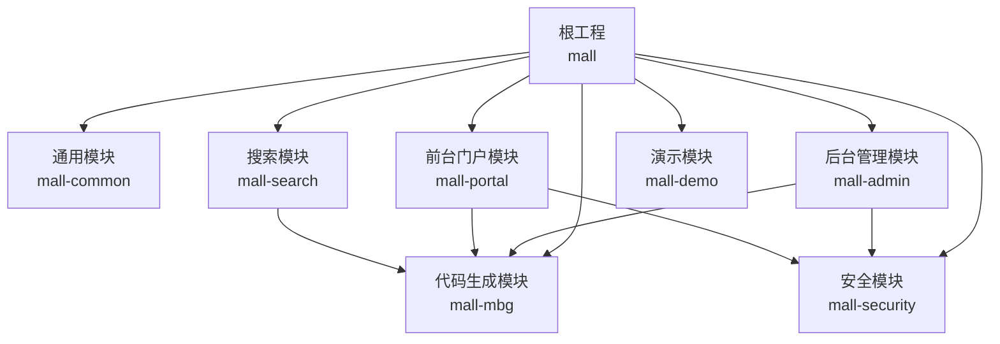
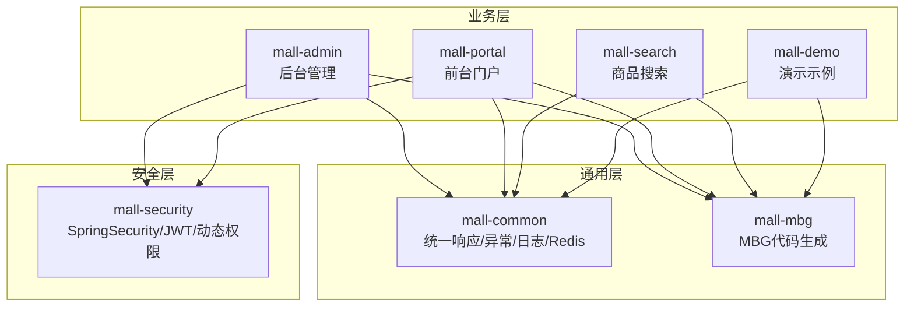
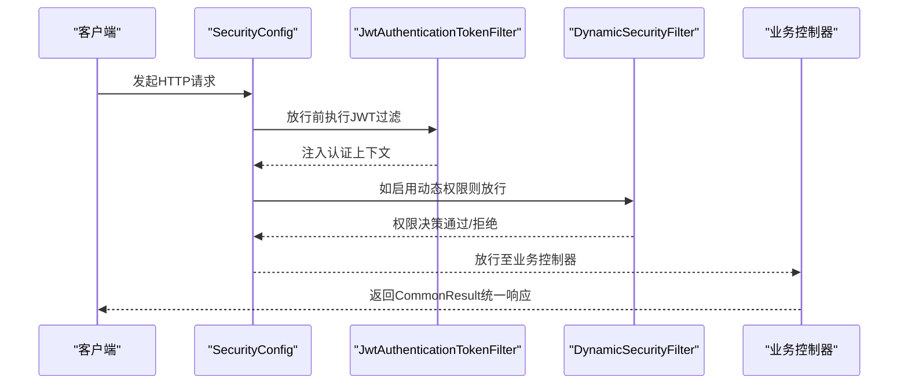
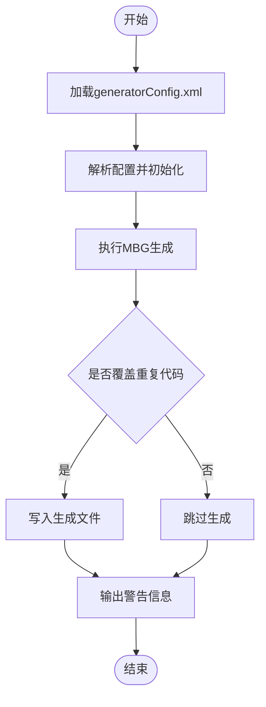
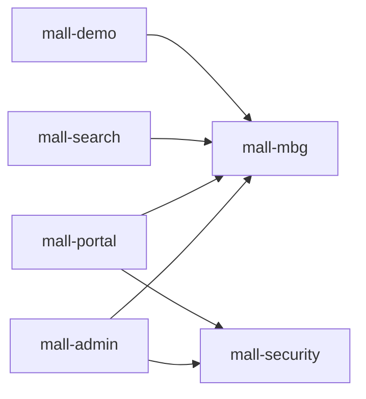

# 模块设计

<cite>
**本文引用的文件**
- [根POM](file://pom.xml)
- [公共模块POM](file://mall-common/pom.xml)
- [安全模块POM](file://mall-security/pom.xml)
- [MBG代码生成模块POM](file://mall-mbg/pom.xml)
- [后台管理模块POM](file://mall-admin/pom.xml)
- [前台门户模块POM](file://mall-portal/pom.xml)
- [搜索模块POM](file://mall-search/pom.xml)
- [演示模块POM](file://mall-demo/pom.xml)
- [公共返回体定义](file://mall-common/src/main/java/com/macro/mall/common/api/CommonResult.java)
- [错误码接口](file://mall-common/src/main/java/com/macro/mall/common/api/IErrorCode.java)
- [安全配置](file://mall-security/src/main/java/com/macro/mall/security/config/SecurityConfig.java)
- [MBG生成器入口](file://mall-mbg/src/main/java/com/macro/mall/Generator.java)
- [后台应用入口](file://mall-admin/src/main/java/com/macro/mall/MallAdminApplication.java)
- [前台应用入口](file://mall-portal/src/main/java/com/macro/mall/portal/MallPortalApplication.java)
- [搜索应用入口](file://mall-search/src/main/java/com/macro/mall/search/MallSearchApplication.java)
- [项目说明文档](file://README.md)
</cite>

## 目录
1. [引言](#引言)
2. [项目结构](#项目结构)
3. [核心组件](#核心组件)
4. [架构总览](#架构总览)
5. [详细组件分析](#详细组件分析)
6. [依赖分析](#依赖分析)
7. [性能考虑](#性能考虑)
8. [故障排查指南](#故障排查指南)
9. [结论](#结论)
10. [附录](#附录)

## 引言
本文件面向Mall项目的模块设计，系统性解析其模块化理念与实现方式，重点覆盖以下核心模块：
- mall-common 通用模块：统一响应体、异常处理、日志切面、Redis服务等基础设施
- mall-security 安全模块：基于Spring Security的认证授权、JWT过滤器、动态权限控制等
- mall-mbg 代码生成模块：基于MyBatis Generator的数据库模型与DAO代码生成
- mall-admin 后台管理模块：后台管理系统接口与业务实现
- mall-portal 前台门户模块：前台商城系统接口与业务实现
- mall-search 搜索模块：基于Elasticsearch的商品搜索能力
- mall-demo 演示模块：框架搭建时的测试与示例代码

文档将阐明各模块职责、分层设计（表现层、业务层、数据访问层）、模块间依赖关系、接口与数据传递机制，并总结可扩展性与可维护性设计原则及最佳实践。

## 项目结构
Mall采用多模块Maven聚合工程组织，顶层POM声明所有子模块并集中管理依赖与插件。各模块职责清晰，遵循“共用能力下沉、业务能力上浮”的分层设计思想。

**图表来源**
- [根POM:12-20](file://pom.xml#L12-L20)
- [后台管理模块POM:19-36](file://mall-admin/pom.xml#L19-L36)
- [前台门户模块POM:20-50](file://mall-portal/pom.xml#L20-L50)
- [搜索模块POM:20-35](file://mall-search/pom.xml#L20-L35)
- [安全模块POM:19-53](file://mall-security/pom.xml#L19-L53)
- [MBG代码生成模块POM:21-46](file://mall-mbg/pom.xml#L21-L46)
- [演示模块POM:19-36](file://mall-demo/pom.xml#L19-L36)

**章节来源**
- [根POM:12-20](file://pom.xml#L12-L20)
- [项目说明文档:51-62](file://README.md#L51-L62)

## 核心组件
本节聚焦通用模块与安全模块的关键组件，它们是其他模块复用的基础。

- 通用返回体与错误码
  - 通用返回体封装了状态码、消息与数据，提供成功、失败、未登录、未授权等多种静态工厂方法，确保前后端交互的一致性与可预期性。
  - 错误码接口定义统一的错误标识与描述，便于全局异常处理与国际化扩展。

- 安全配置
  - 基于Spring Security的WebFlux式配置，禁用CSRF、启用无状态会话、配置认证与授权入口点、JWT过滤器链路以及可选的动态权限过滤器，形成统一的安全策略。

- 代码生成器
  - 提供独立的生成入口，读取配置文件，执行MBG生成流程，覆盖重复代码，输出警告信息，便于数据库变更后的快速同步。

**章节来源**
- [公共返回体定义:1-134](file://mall-common/src/main/java/com/macro/mall/common/api/CommonResult.java#L1-L134)
- [错误码接口:1-18](file://mall-common/src/main/java/com/macro/mall/common/api/IErrorCode.java#L1-L18)
- [安全配置:1-70](file://mall-security/src/main/java/com/macro/mall/security/config/SecurityConfig.java#L1-L70)
- [MBG生成器入口:1-39](file://mall-mbg/src/main/java/com/macro/mall/Generator.java#L1-L39)

## 架构总览
下图展示了Mall的整体架构与模块交互关系，体现“通用能力下沉、业务能力上浮”的设计原则：

**图表来源**
- [根POM:12-20](file://pom.xml#L12-L20)
- [后台管理模块POM:19-36](file://mall-admin/pom.xml#L19-L36)
- [前台门户模块POM:20-50](file://mall-portal/pom.xml#L20-L50)
- [搜索模块POM:20-35](file://mall-search/pom.xml#L20-L35)
- [安全模块POM:19-53](file://mall-security/pom.xml#L19-L53)
- [MBG代码生成模块POM:21-46](file://mall-mbg/pom.xml#L21-L46)
- [演示模块POM:19-36](file://mall-demo/pom.xml#L19-L36)

## 详细组件分析

### 通用模块（mall-common）
- 设计原则
  - 单一职责：提供统一的返回体、异常处理、日志切面、Redis服务等横切能力
  - 可复用性：通过依赖注入在各业务模块中共享，避免重复实现
  - 可扩展性：接口抽象（如IErrorCode）便于替换与扩展

- 关键组件
  - 通用返回体：封装标准响应格式，提供多种静态工厂方法
  - 异常处理：全局异常处理器与断言工具，统一错误语义
  - 日志切面：WebLogAspect对请求进行统一日志记录
  - Redis服务：RedisService提供常用缓存操作

- 分层映射
  - 表现层：通过CommonResult统一输出
  - 业务层：通过异常与断言工具约束输入输出
  - 数据访问层：通过RedisService支撑缓存

**章节来源**
- [公共返回体定义:1-134](file://mall-common/src/main/java/com/macro/mall/common/api/CommonResult.java#L1-L134)
- [错误码接口:1-18](file://mall-common/src/main/java/com/macro/mall/common/api/IErrorCode.java#L1-L18)

### 安全模块（mall-security）
- 设计原则
  - 配置即插拔：通过@EnableWebSecurity与SecurityFilterChain按需启用
  - 无状态认证：基于JWT与无状态会话策略
  - 动态权限：支持运行时动态权限元数据与决策

- 关键组件
  - SecurityConfig：配置CSRF禁用、无状态会话、异常处理、JWT过滤器链
  - 动态权限：DynamicSecurityService/DynamicSecurityFilter/DynamicAccessDecisionManager
  - JWT工具：JwtTokenUtil提供令牌生成与解析
  - 认证入口：RestAuthenticationEntryPoint
  - 授权入口：RestfulAccessDeniedHandler

- 分层映射
  - 表现层：控制器层通过安全注解与过滤器链受保护
  - 业务层：动态权限元数据驱动业务授权
  - 数据访问层：与业务层协作完成权限校验

**图表来源**
- [安全配置:38-67](file://mall-security/src/main/java/com/macro/mall/security/config/SecurityConfig.java#L38-L67)

**章节来源**
- [安全配置:1-70](file://mall-security/src/main/java/com/macro/mall/security/config/SecurityConfig.java#L1-L70)

### 代码生成模块（mall-mbg）
- 设计原则
  - 自动化：通过MBG插件与配置文件自动生成模型、Mapper与XML
  - 可维护性：集中配置generatorConfig.xml，便于数据库变更后的批量更新
  - 可扩展性：支持自定义插件与模板

- 关键组件
  - Generator：独立入口，加载配置、执行生成、输出警告
  - generatorConfig.xml：数据库连接、目标包名、表规则、插件等配置
  - generator.properties：属性占位符与参数

- 分层映射
  - 数据访问层：生成的Model/Mapper/XML直接服务于DAO层
  - 业务层：通过Service调用DAO完成数据操作
  - 表现层：通过Controller暴露REST接口

**图表来源**
- [MBG生成器入口:17-37](file://mall-mbg/src/main/java/com/macro/mall/Generator.java#L17-L37)

**章节来源**
- [MBG生成器入口:1-39](file://mall-mbg/src/main/java/com/macro/mall/Generator.java#L1-L39)

### 后台管理模块（mall-admin）
- 设计原则
  - 业务聚合：集中管理商品、订单、会员、促销、运营、内容、统计、财务、权限、设置等模块
  - 分层清晰：Controller-Service-DAO三层分离，DAO基于MBG生成
  - 安全受控：统一接入安全模块，实现鉴权与授权

- 关键组件
  - 应用入口：MallAdminApplication
  - 控制器：涵盖Cms、Oms、Pms、Sms、Ums等业务控制器
  - 服务：各业务Service接口与实现
  - DAO：MBG生成的Mapper接口与XML

- 分层映射
  - 表现层：Controller接收请求，返回CommonResult
  - 业务层：Service编排领域逻辑，调用DAO
  - 数据访问层：DAO基于MyBatis与MBG生成

**章节来源**
- [后台应用入口:1-16](file://mall-admin/src/main/java/com/macro/mall/MallAdminApplication.java#L1-L16)

### 前台门户模块（mall-portal）
- 设计原则
  - 业务聚焦：首页门户、商品推荐、搜索、展示、购物车、订单流程、会员中心、客服、帮助中心
  - 多技术栈：集成MongoDB、Redis、RabbitMQ等中间件
  - 安全受控：统一接入安全模块

- 关键组件
  - 应用入口：MallPortalApplication
  - 控制器：涵盖商品、订单、会员、购物车等前端接口
  - 服务：业务Service与仓储服务
  - 组件：自定义组件与工具类

**章节来源**
- [前台应用入口:1-14](file://mall-portal/src/main/java/com/macro/mall/portal/MallPortalApplication.java#L1-L14)

### 搜索模块（mall-search）
- 设计原则
  - 专业分工：专门负责商品搜索，基于Elasticsearch
  - 低耦合：通过排除Redis依赖，避免与门户模块重复依赖

- 关键组件
  - 应用入口：MallSearchApplication
  - 配置：Elasticsearch相关配置
  - 控制器/服务：搜索相关接口与实现

**章节来源**
- [搜索应用入口:1-13](file://mall-search/src/main/java/com/macro/mall/search/MallSearchApplication.java#L1-L13)

### 演示模块（mall-demo）
- 设计原则
  - 示例导向：用于演示框架搭建与基本特性
  - 轻量依赖：引入Thymeleaf与安全示例

**章节来源**
- [演示模块POM:19-36](file://mall-demo/pom.xml#L19-L36)

## 依赖分析
模块间依赖关系如下：

**图表来源**
- [后台管理模块POM:19-36](file://mall-admin/pom.xml#L19-L36)
- [前台门户模块POM:20-50](file://mall-portal/pom.xml#L20-L50)
- [搜索模块POM:20-35](file://mall-search/pom.xml#L20-L35)
- [演示模块POM:19-36](file://mall-demo/pom.xml#L19-L36)

**章节来源**
- [根POM:93-194](file://pom.xml#L93-L194)

## 性能考虑
- 无状态会话：安全模块采用STATELESS策略，降低会话开销，提升横向扩展能力
- 缓存策略：通用模块提供RedisService，建议在热点数据与接口层面合理使用缓存
- 分页优化：MBG模块集成PageHelper，建议在查询列表场景使用分页以降低数据库压力
- 并发控制：结合JWT令牌与动态权限，避免不必要的鉴权计算
- 日志性能：统一日志切面与Logstash集成，注意异步日志与采样策略

## 故障排查指南
- 统一异常处理
  - 使用全局异常处理器捕获业务异常，返回标准化的CommonResult
  - 断言工具用于前置校验，避免空指针与非法参数进入业务流程

- 安全相关
  - 认证失败：检查JWT过滤器是否正确注入认证上下文
  - 授权失败：确认动态权限元数据与决策是否生效
  - CORS与跨域：结合全局跨域配置与OPTIONS预检请求处理

- 代码生成
  - 生成失败：检查generatorConfig.xml配置与数据库连接
  - 重复覆盖：根据overwrite策略决定是否覆盖已有文件

**章节来源**
- [公共返回体定义:1-134](file://mall-common/src/main/java/com/macro/mall/common/api/CommonResult.java#L1-L134)
- [安全配置:1-70](file://mall-security/src/main/java/com/macro/mall/security/config/SecurityConfig.java#L1-L70)
- [MBG生成器入口:1-39](file://mall-mbg/src/main/java/com/macro/mall/Generator.java#L1-L39)

## 结论
Mall通过清晰的模块划分与分层设计，实现了通用能力下沉、业务能力上浮的目标。通用模块提供一致的响应、异常与日志规范；安全模块提供统一的认证授权与动态权限；MBG模块保证数据访问层的高效生成与维护；后台与前台模块分别承载管理与业务主流程；搜索模块专业化处理检索需求；演示模块辅助框架理解与验证。整体设计具备良好的可扩展性与可维护性，适合在企业级电商系统中推广与演进。

## 附录
- 最佳实践
  - 统一使用CommonResult作为所有接口返回体
  - 在业务层使用IErrorCode定义错误码，便于国际化与多语言支持
  - 安全策略集中在SecurityConfig中，避免分散配置
  - MBG配置集中管理，数据库变更后及时执行生成
  - 服务层尽量无状态，配合缓存与分页提升性能
  - 动态权限按需启用，避免过度设计

- 常见问题
  - 接口返回格式不统一：检查是否使用CommonResult
  - 权限控制失效：核对IgnoreUrls与动态权限配置
  - 代码生成失败：检查generatorConfig.xml与数据库驱动版本
  - 缓存一致性：结合业务场景选择合适的缓存策略与失效机制