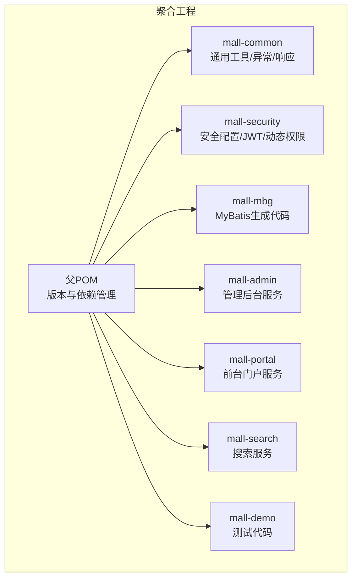
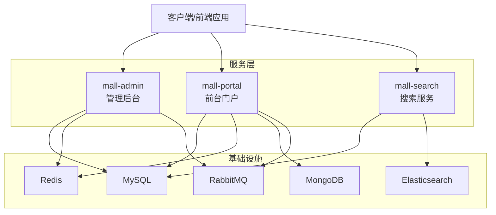
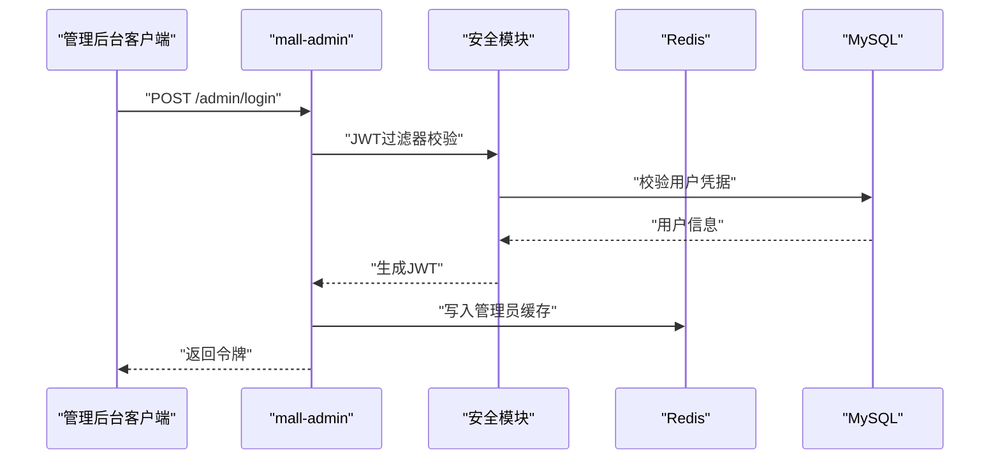
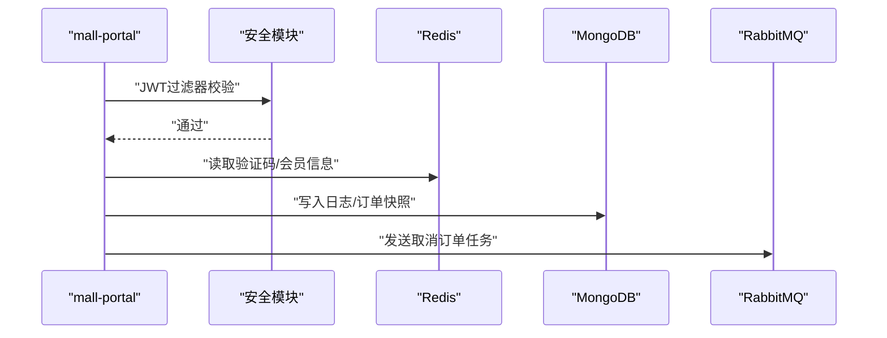
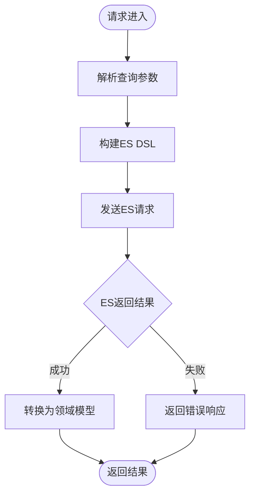
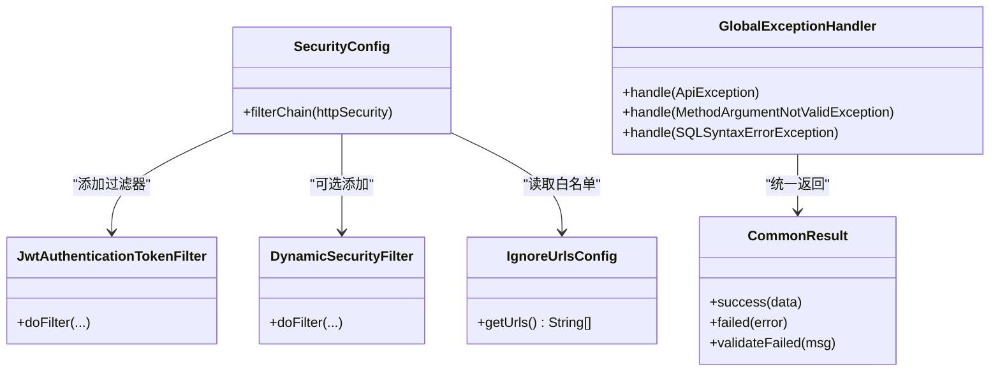
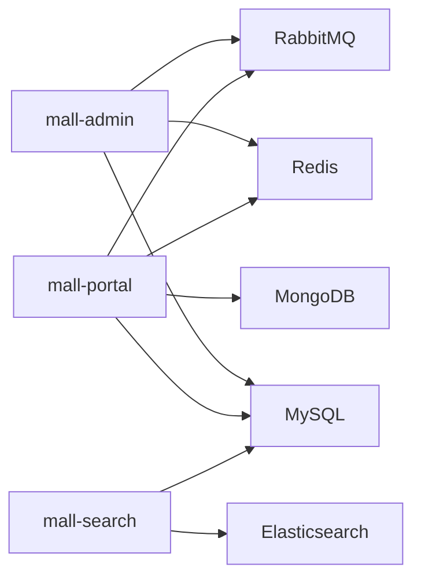

# 系统架构

<cite>
**本文引用的文件**
- [README.md](file://README.md)
- [pom.xml](file://pom.xml)
- [mall-admin/src/main/java/com/macro/mall/MallAdminApplication.java](file://mall-admin/src/main/java/com/macro/mall/MallAdminApplication.java)
- [mall-portal/src/main/java/com/macro/mall/portal/MallPortalApplication.java](file://mall-portal/src/main/java/com/macro/mall/portal/MallPortalApplication.java)
- [mall-search/src/main/java/com/macro/mall/search/MallSearchApplication.java](file://mall-search/src/main/java/com/macro/mall/search/MallSearchApplication.java)
- [mall-admin/src/main/resources/application.yml](file://mall-admin/src/main/resources/application.yml)
- [mall-portal/src/main/resources/application.yml](file://mall-portal/src/main/resources/application.yml)
- [mall-search/src/main/resources/application.yml](file://mall-search/src/main/resources/application.yml)
- [mall-common/src/main/java/com/macro/mall/common/config/BaseRedisConfig.java](file://mall-common/src/main/java/com/macro/mall/common/config/BaseRedisConfig.java)
- [mall-security/src/main/java/com/macro/mall/security/config/SecurityConfig.java](file://mall-security/src/main/java/com/macro/mall/security/config/SecurityConfig.java)
- [mall-common/src/main/java/com/macro/mall/common/api/CommonResult.java](file://mall-common/src/main/java/com/macro/mall/common/api/CommonResult.java)
- [mall-common/src/main/java/com/macro/mall/common/exception/GlobalExceptionHandler.java](file://mall-common/src/main/java/com/macro/mall/common/exception/GlobalExceptionHandler.java)
- [mall-admin/src/main/java/com/macro/mall/service/UmsAdminService.java](file://mall-admin/src/main/java/com/macro/mall/service/UmsAdminService.java)
- [document/docker/docker-compose-app.yml](file://document/docker/docker-compose-app.yml)
</cite>

## 目录
1. [引言](#引言)
2. [项目结构](#项目结构)
3. [核心组件](#核心组件)
4. [架构总览](#架构总览)
5. [详细组件分析](#详细组件分析)
6. [依赖分析](#依赖分析)
7. [性能考虑](#性能考虑)
8. [故障排查指南](#故障排查指南)
9. [结论](#结论)
10. [附录](#附录)

## 引言
本文件面向Mall系统的架构文档，围绕微服务架构模式、服务拆分与边界划分进行系统性梳理，重点覆盖以下服务：
- mall-admin 管理后台服务
- mall-portal 前台门户服务
- mall-search 搜索服务

同时，本文阐述服务间通信机制、数据流向与依赖关系，解释高内聚低耦合、单一职责原则在微服务中的落地方式，并结合仓库中的配置与模块组织，给出系统架构图的解读与演进建议。

## 项目结构
Mall采用多模块聚合工程，父POM统一管理版本与依赖，子模块按职责拆分：
- mall-common：通用工具与公共配置（如Redis序列化、全局响应体、全局异常）
- mall-security：安全模块（Spring Security、JWT、动态权限）
- mall-mbg：MyBatis Generator生成的DAO与Model
- mall-admin：后台管理接口服务
- mall-portal：前台门户接口服务
- mall-search：基于Elasticsearch的商品搜索服务
- mall-demo：框架搭建时的测试代码

**图示来源**
- [pom.xml:12-20](file://pom.xml#L12-L20)
- [README.md:51-62](file://README.md#L51-L62)

**章节来源**
- [pom.xml:12-20](file://pom.xml#L12-L20)
- [README.md:51-62](file://README.md#L51-L62)

## 核心组件
- 通用响应与异常
  - 统一响应体封装与错误码体系，确保前后端一致的契约
  - 全局异常处理器，集中处理参数校验、业务异常与SQL语法异常
- 安全与鉴权
  - 基于Spring Security的无状态鉴权链路，JWT令牌校验，白名单放行
  - 动态权限扩展点，支持运行时权限变更
- 缓存与序列化
  - RedisTemplate与Jackson JSON序列化配置，统一键命名与过期策略
- 服务入口
  - 各服务独立Spring Boot启动类，按需扫描基础包

**章节来源**
- [mall-common/src/main/java/com/macro/mall/common/api/CommonResult.java:1-134](file://mall-common/src/main/java/com/macro/mall/common/api/CommonResult.java#L1-L134)
- [mall-common/src/main/java/com/macro/mall/common/exception/GlobalExceptionHandler.java:1-69](file://mall-common/src/main/java/com/macro/mall/common/exception/GlobalExceptionHandler.java#L1-L69)
- [mall-security/src/main/java/com/macro/mall/security/config/SecurityConfig.java:1-70](file://mall-security/src/main/java/com/macro/mall/security/config/SecurityConfig.java#L1-L70)
- [mall-common/src/main/java/com/macro/mall/common/config/BaseRedisConfig.java:1-67](file://mall-common/src/main/java/com/macro/mall/common/config/BaseRedisConfig.java#L1-L67)
- [mall-admin/src/main/java/com/macro/mall/MallAdminApplication.java:1-16](file://mall-admin/src/main/java/com/macro/mall/MallAdminApplication.java#L1-L16)
- [mall-portal/src/main/java/com/macro/mall/portal/MallPortalApplication.java:1-14](file://mall-portal/src/main/java/com/macro/mall/portal/MallPortalApplication.java#L1-L14)
- [mall-search/src/main/java/com/macro/mall/search/MallSearchApplication.java:1-13](file://mall-search/src/main/java/com/macro/mall/search/MallSearchApplication.java#L1-L13)

## 架构总览
系统采用微服务架构，以“前台门户、后台管理、搜索服务”三足鼎立为核心，配合通用模块与安全模块，形成清晰的边界与职责分离。服务间通过HTTP REST调用与中间件协同，典型交互如下：

**图示来源**
- [document/docker/docker-compose-app.yml:3-42](file://document/docker/docker-compose-app.yml#L3-L42)
- [README.md:116-125](file://README.md#L116-L125)

说明要点：
- 服务发现与负载均衡：仓库未包含注册中心与网关组件，实际部署通过Nginx反向代理与容器编排实现流量接入
- 熔断降级：当前未见熔断器实现，建议在后续版本引入Sentinel/Hystrix
- 数据一致性：通过消息队列异步解耦（如取消订单），缓存与数据库双写策略保障读性能

## 详细组件分析

### mall-admin 管理后台服务
- 角色定位：后台管理接口，提供商品、订单、促销、内容、权限等管理能力
- 技术要点
  - 安全：基于JWT的无状态认证，白名单放行静态资源与登录接口
  - 缓存：Redis存储管理员信息与资源列表，统一键前缀与过期时间
  - 存储：MyBatis映射XML与MBG生成模型协作
  - 对象存储：集成阿里云OSS，提供直传与回调
- 关键配置
  - application.yml中定义JWT、Redis、安全白名单、OSS参数
- 典型流程：登录鉴权 → 权限校验 → 业务处理 → 缓存更新

**图示来源**
- [mall-admin/src/main/resources/application.yml:20-66](file://mall-admin/src/main/resources/application.yml#L20-L66)
- [mall-security/src/main/java/com/macro/mall/security/config/SecurityConfig.java:38-67](file://mall-security/src/main/java/com/macro/mall/security/config/SecurityConfig.java#L38-L67)
- [mall-common/src/main/java/com/macro/mall/common/config/BaseRedisConfig.java:30-61](file://mall-common/src/main/java/com/macro/mall/common/config/BaseRedisConfig.java#L30-L61)

**章节来源**
- [mall-admin/src/main/java/com/macro/mall/MallAdminApplication.java:1-16](file://mall-admin/src/main/java/com/macro/mall/MallAdminApplication.java#L1-L16)
- [mall-admin/src/main/resources/application.yml:1-66](file://mall-admin/src/main/resources/application.yml#L1-L66)
- [mall-admin/src/main/java/com/macro/mall/service/UmsAdminService.java:1-99](file://mall-admin/src/main/java/com/macro/mall/service/UmsAdminService.java#L1-L99)

### mall-portal 前台门户服务
- 角色定位：面向C端用户的门户接口，涵盖首页、商品、购物车、订单、会员等
- 技术要点
  - 安全：JWT无状态认证，白名单放行公开接口
  - 缓存：验证码、会员、订单号等键空间隔离
  - 存储：MySQL + MongoDB（日志/订单快照等）
  - 消息：RabbitMQ队列用于异步任务（如取消超时订单）
- 关键配置
  - application.yml中定义JWT、Redis键空间、Mongo开关、RabbitMQ队列名

**图示来源**
- [mall-portal/src/main/resources/application.yml:15-62](file://mall-portal/src/main/resources/application.yml#L15-L62)
- [mall-security/src/main/java/com/macro/mall/security/config/SecurityConfig.java:38-67](file://mall-security/src/main/java/com/macro/mall/security/config/SecurityConfig.java#L38-L67)
- [mall-common/src/main/java/com/macro/mall/common/config/BaseRedisConfig.java:30-61](file://mall-common/src/main/java/com/macro/mall/common/config/BaseRedisConfig.java#L30-L61)

**章节来源**
- [mall-portal/src/main/java/com/macro/mall/portal/MallPortalApplication.java:1-14](file://mall-portal/src/main/java/com/macro/mall/portal/MallPortalApplication.java#L1-L14)
- [mall-portal/src/main/resources/application.yml:1-62](file://mall-portal/src/main/resources/application.yml#L1-L62)

### mall-search 搜索服务
- 角色定位：基于Elasticsearch的商品搜索服务，提供全文检索与聚合
- 技术要点
  - 独立端口监听（默认8081）
  - MyBatis映射XML与模型协作
- 关键配置
  - application.yml中定义服务端口与MyBatis映射路径

**图示来源**
- [mall-search/src/main/resources/application.yml:10-17](file://mall-search/src/main/resources/application.yml#L10-L17)

**章节来源**
- [mall-search/src/main/java/com/macro/mall/search/MallSearchApplication.java:1-13](file://mall-search/src/main/java/com/macro/mall/search/MallSearchApplication.java#L1-L13)
- [mall-search/src/main/resources/application.yml:1-20](file://mall-search/src/main/resources/application.yml#L1-L20)

### 安全与鉴权
- 无状态会话：禁用Session，基于JWT令牌
- 白名单放行：静态资源、登录、注册、回调等接口
- 动态权限：可扩展的动态权限过滤器
- 统一异常处理：参数校验、业务异常、SQL受限提示

**图示来源**
- [mall-security/src/main/java/com/macro/mall/security/config/SecurityConfig.java:38-67](file://mall-security/src/main/java/com/macro/mall/security/config/SecurityConfig.java#L38-L67)
- [mall-common/src/main/java/com/macro/mall/common/exception/GlobalExceptionHandler.java:20-68](file://mall-common/src/main/java/com/macro/mall/common/exception/GlobalExceptionHandler.java#L20-L68)
- [mall-common/src/main/java/com/macro/mall/common/api/CommonResult.java:35-108](file://mall-common/src/main/java/com/macro/mall/common/api/CommonResult.java#L35-L108)

**章节来源**
- [mall-security/src/main/java/com/macro/mall/security/config/SecurityConfig.java:1-70](file://mall-security/src/main/java/com/macro/mall/security/config/SecurityConfig.java#L1-L70)
- [mall-common/src/main/java/com/macro/mall/common/exception/GlobalExceptionHandler.java:1-69](file://mall-common/src/main/java/com/macro/mall/common/exception/GlobalExceptionHandler.java#L1-L69)
- [mall-common/src/main/java/com/macro/mall/common/api/CommonResult.java:1-134](file://mall-common/src/main/java/com/macro/mall/common/api/CommonResult.java#L1-L134)

## 依赖分析
- 模块内聚与耦合
  - mall-common与mall-security为横切能力，被其他服务复用，降低重复实现
  - mall-mbg提供数据访问层骨架，避免手写DAO样板代码
  - 三大服务各自持有独立配置与依赖，体现单一职责
- 外部依赖与集成
  - MySQL：主数据存储
  - Redis：缓存与会话无状态化支撑
  - MongoDB：日志与非结构化数据
  - Elasticsearch：全文检索
  - RabbitMQ：异步消息解耦
- 容器编排
  - docker-compose将服务与外部依赖绑定，便于一键部署

**图示来源**
- [document/docker/docker-compose-app.yml:3-42](file://document/docker/docker-compose-app.yml#L3-L42)

**章节来源**
- [document/docker/docker-compose-app.yml:1-42](file://document/docker/docker-compose-app.yml#L1-L42)

## 性能考虑
- 读写分离与缓存
  - Redis作为热点数据缓存，减少数据库压力；统一序列化与键空间规划
- 分页与索引
  - MyBatis分页插件与数据库索引优化，避免全表扫描
- 异步化
  - 基于RabbitMQ的任务异步化（如取消订单），降低同步链路延迟
- 横向扩展
  - 服务独立部署，可按业务峰值扩容单个服务实例

## 故障排查指南
- 统一响应与异常
  - 使用统一响应体与全局异常处理器，快速定位参数校验、业务异常与SQL受限场景
- 安全链路
  - 核对白名单配置与JWT头部、过期时间，确认动态权限过滤器启用情况
- 缓存问题
  - 检查Redis连接、键空间命名与过期策略，确认序列化器兼容性
- 配置核对
  - 对照各服务application.yml，确认数据库、缓存、消息队列、搜索引擎等连接参数

**章节来源**
- [mall-common/src/main/java/com/macro/mall/common/api/CommonResult.java:1-134](file://mall-common/src/main/java/com/macro/mall/common/api/CommonResult.java#L1-L134)
- [mall-common/src/main/java/com/macro/mall/common/exception/GlobalExceptionHandler.java:1-69](file://mall-common/src/main/java/com/macro/mall/common/exception/GlobalExceptionHandler.java#L1-L69)
- [mall-security/src/main/java/com/macro/mall/security/config/SecurityConfig.java:38-67](file://mall-security/src/main/java/com/macro/mall/security/config/SecurityConfig.java#L38-L67)
- [mall-common/src/main/java/com/macro/mall/common/config/BaseRedisConfig.java:30-61](file://mall-common/src/main/java/com/macro/mall/common/config/BaseRedisConfig.java#L30-L61)

## 结论
Mall系统以清晰的微服务边界与模块化设计实现了高内聚低耦合，通过通用模块与安全模块沉淀横切能力，三大服务分别聚焦管理后台、前台门户与搜索，满足电商核心业务诉求。建议在现有基础上引入服务注册与网关、熔断降级与分布式追踪，进一步完善生产级治理能力。

## 附录
- 架构图与业务图
  - 系统架构图与业务架构图位于仓库文档资源区，可作为宏观视角参考
- 部署与环境
  - 支持Windows与Docker环境部署，提供Compose编排示例

**章节来源**
- [README.md:116-125](file://README.md#L116-L125)
- [document/docker/docker-compose-app.yml:1-42](file://document/docker/docker-compose-app.yml#L1-L42)