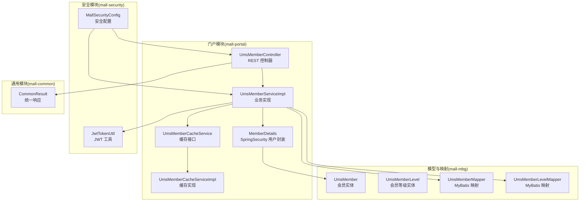
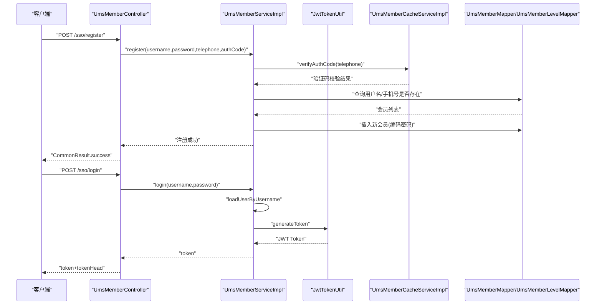
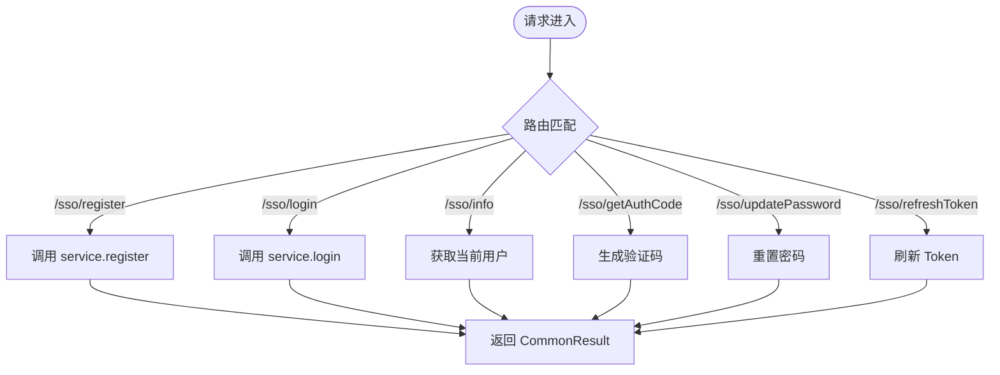
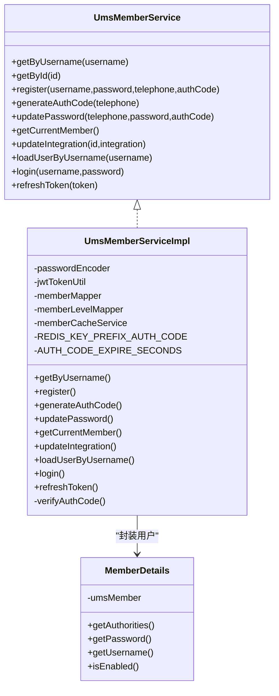
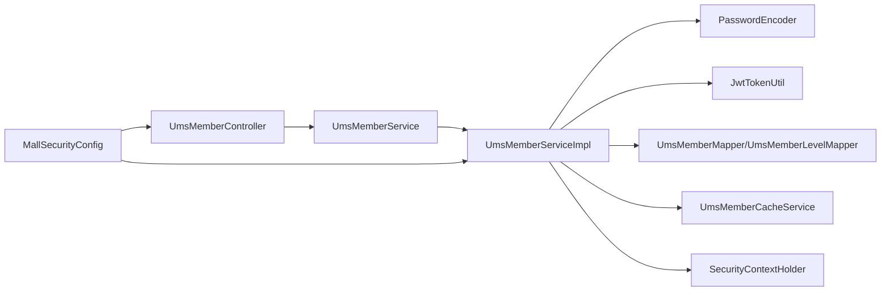

# 会员服务中心

<cite>
**本文引用的文件**
- [UmsMemberController.java](file://mall-portal/src/main/java/com/macro/mall/portal/controller/UmsMemberController.java)
- [UmsMemberServiceImpl.java](file://mall-portal/src/main/java/com/macro/mall/portal/service/impl/UmsMemberServiceImpl.java)
- [UmsMemberService.java](file://mall-portal/src/main/java/com/macro/mall/portal/service/UmsMemberService.java)
- [MemberDetails.java](file://mall-portal/src/main/java/com/macro/mall/portal/domain/MemberDetails.java)
- [UmsMember.java](file://mall-mbg/src/main/java/com/macro/mall/model/UmsMember.java)
- [UmsMemberMapper.java](file://mall-mbg/src/main/java/com/macro/mall/mapper/UmsMemberMapper.java)
- [UmsMemberLevelMapper.java](file://mall-mbg/src/main/java/com/macro/mall/mapper/UmsMemberLevelMapper.java)
- [UmsMemberLevel.java](file://mall-mbg/src/main/java/com/macro/mall/model/UmsMemberLevel.java)
- [UmsMemberCacheService.java](file://mall-portal/src/main/java/com/macro/mall/portal/service/UmsMemberCacheService.java)
- [UmsMemberCacheServiceImpl.java](file://mall-portal/src/main/java/com/macro/mall/portal/service/impl/UmsMemberCacheServiceImpl.java)
- [JwtTokenUtil.java](file://mall-security/src/main/java/com/macro/mall/security/util/JwtTokenUtil.java)
- [MallSecurityConfig.java](file://mall-admin/src/main/java/com/macro/mall/config/MallSecurityConfig.java)
- [CommonResult.java](file://mall-common/src/main/java/com/macro/mall/common/api/CommonResult.java)
- [application.yml](file://mall-portal/src/main/resources/application.yml)
</cite>

## 目录
1. [简介](#简介)
2. [项目结构](#项目结构)
3. [核心组件](#核心组件)
4. [架构总览](#架构总览)
5. [详细组件分析](#详细组件分析)
6. [依赖关系分析](#依赖关系分析)
7. [性能考虑](#性能考虑)
8. [故障排查指南](#故障排查指南)
9. [结论](#结论)
10. [附录：接口文档与使用示例](#附录接口文档与使用示例)

## 简介
本文件面向“会员服务中心”的技术实现，围绕会员注册登录、个人信息管理、会员等级权益、积分管理等核心功能，系统梳理 UmsMemberController 的 API 设计与 UmsMemberServiceImpl 的业务逻辑，并说明与数据库层、安全框架、缓存层的协作方式。同时给出接口文档与使用示例，帮助开发者快速理解与集成。

## 项目结构
会员服务中心位于 mall-portal 模块，采用前后端分离的控制器-服务-持久层分层架构；安全认证基于 JWT；数据访问通过 MyBatis Mapper；缓存通过 Redis 实现。

图表来源
- [UmsMemberController.java:1-100](file://mall-portal/src/main/java/com/macro/mall/portal/controller/UmsMemberController.java#L1-L100)
- [UmsMemberServiceImpl.java:1-197](file://mall-portal/src/main/java/com/macro/mall/portal/service/impl/UmsMemberServiceImpl.java#L1-L197)
- [MemberDetails.java:1-62](file://mall-portal/src/main/java/com/macro/mall/portal/domain/MemberDetails.java#L1-L62)
- [UmsMemberCacheService.java](file://mall-portal/src/main/java/com/macro/mall/portal/service/UmsMemberCacheService.java)
- [UmsMemberCacheServiceImpl.java](file://mall-portal/src/main/java/com/macro/mall/portal/service/impl/UmsMemberCacheServiceImpl.java)
- [UmsMember.java:1-228](file://mall-mbg/src/main/java/com/macro/mall/model/UmsMember.java#L1-L228)
- [UmsMemberLevel.java](file://mall-mbg/src/main/java/com/macro/mall/model/UmsMemberLevel.java)
- [UmsMemberMapper.java:1-30](file://mall-mbg/src/main/java/com/macro/mall/mapper/UmsMemberMapper.java#L1-L30)
- [UmsMemberLevelMapper.java](file://mall-mbg/src/main/java/com/macro/mall/mapper/UmsMemberLevelMapper.java)
- [JwtTokenUtil.java](file://mall-security/src/main/java/com/macro/mall/security/util/JwtTokenUtil.java)
- [MallSecurityConfig.java](file://mall-admin/src/main/java/com/macro/mall/config/MallSecurityConfig.java)
- [CommonResult.java](file://mall-common/src/main/java/com/macro/mall/common/api/CommonResult.java)

章节来源
- [UmsMemberController.java:1-100](file://mall-portal/src/main/java/com/macro/mall/portal/controller/UmsMemberController.java#L1-L100)
- [UmsMemberServiceImpl.java:1-197](file://mall-portal/src/main/java/com/macro/mall/portal/service/impl/UmsMemberServiceImpl.java#L1-L197)
- [UmsMemberService.java:1-65](file://mall-portal/src/main/java/com/macro/mall/portal/service/UmsMemberService.java#L1-L65)
- [MemberDetails.java:1-62](file://mall-portal/src/main/java/com/macro/mall/portal/domain/MemberDetails.java#L1-L62)
- [UmsMember.java:1-228](file://mall-mbg/src/main/java/com/macro/mall/model/UmsMember.java#L1-L228)
- [UmsMemberMapper.java:1-30](file://mall-mbg/src/main/java/com/macro/mall/mapper/UmsMemberMapper.java#L1-L30)
- [UmsMemberLevelMapper.java](file://mall-mbg/src/main/java/com/macro/mall/mapper/UmsMemberLevelMapper.java)
- [UmsMemberCacheService.java](file://mall-portal/src/main/java/com/macro/mall/portal/service/UmsMemberCacheService.java)
- [UmsMemberCacheServiceImpl.java](file://mall-portal/src/main/java/com/macro/mall/portal/service/impl/UmsMemberCacheServiceImpl.java)
- [JwtTokenUtil.java](file://mall-security/src/main/java/com/macro/mall/security/util/JwtTokenUtil.java)
- [MallSecurityConfig.java](file://mall-admin/src/main/java/com/macro/mall/config/MallSecurityConfig.java)
- [CommonResult.java](file://mall-common/src/main/java/com/macro/mall/common/api/CommonResult.java)

## 核心组件
- 控制器层：UmsMemberController 提供注册、登录、获取当前用户、获取验证码、修改密码、刷新 Token 等接口。
- 服务层：UmsMemberServiceImpl 实现注册、登录、获取当前用户、验证码生成与校验、积分更新、Token 生成与刷新等业务逻辑。
- 安全层：MemberDetails 封装会员为 SpringSecurity 用户；JwtTokenUtil 负责 Token 生成与刷新；MallSecurityConfig 配置安全过滤链。
- 数据层：UmsMemberMapper、UmsMemberLevelMapper 访问 MySQL；UmsMemberCacheService/Impl 基于 Redis 缓存会员与验证码。
- 统一响应：CommonResult 提供标准响应格式。

章节来源
- [UmsMemberController.java:24-99](file://mall-portal/src/main/java/com/macro/mall/portal/controller/UmsMemberController.java#L24-L99)
- [UmsMemberServiceImpl.java:39-196](file://mall-portal/src/main/java/com/macro/mall/portal/service/impl/UmsMemberServiceImpl.java#L39-L196)
- [UmsMemberService.java:11-64](file://mall-portal/src/main/java/com/macro/mall/portal/service/UmsMemberService.java#L11-L64)
- [MemberDetails.java:15-61](file://mall-portal/src/main/java/com/macro/mall/portal/domain/MemberDetails.java#L15-L61)
- [JwtTokenUtil.java](file://mall-security/src/main/java/com/macro/mall/security/util/JwtTokenUtil.java)
- [MallSecurityConfig.java](file://mall-admin/src/main/java/com/macro/mall/config/MallSecurityConfig.java)
- [UmsMemberMapper.java:8-29](file://mall-mbg/src/main/java/com/macro/mall/mapper/UmsMemberMapper.java#L8-L29)
- [UmsMemberLevelMapper.java](file://mall-mbg/src/main/java/com/macro/mall/mapper/UmsMemberLevelMapper.java)
- [CommonResult.java](file://mall-common/src/main/java/com/macro/mall/common/api/CommonResult.java)

## 架构总览
会员中心整体采用“控制器-服务-数据访问-缓存-安全”分层，请求从控制器进入，经服务层处理业务，访问数据库与缓存，最终返回统一响应。

图表来源
- [UmsMemberController.java:35-57](file://mall-portal/src/main/java/com/macro/mall/portal/controller/UmsMemberController.java#L35-L57)
- [UmsMemberServiceImpl.java:77-107](file://mall-portal/src/main/java/com/macro/mall/portal/service/impl/UmsMemberServiceImpl.java#L77-L107)
- [UmsMemberServiceImpl.java:164-180](file://mall-portal/src/main/java/com/macro/mall/portal/service/impl/UmsMemberServiceImpl.java#L164-L180)
- [JwtTokenUtil.java](file://mall-security/src/main/java/com/macro/mall/security/util/JwtTokenUtil.java)
- [UmsMemberCacheServiceImpl.java](file://mall-portal/src/main/java/com/macro/mall/portal/service/impl/UmsMemberCacheServiceImpl.java)
- [UmsMemberMapper.java:19-21](file://mall-mbg/src/main/java/com/macro/mall/mapper/UmsMemberMapper.java#L19-L21)
- [UmsMemberLevelMapper.java](file://mall-mbg/src/main/java/com/macro/mall/mapper/UmsMemberLevelMapper.java)

## 详细组件分析

### 控制器：UmsMemberController
- 接口路径前缀：/sso
- 主要接口：
  - POST /sso/register：会员注册（用户名、密码、手机号、验证码）
  - POST /sso/login：登录认证（用户名、密码），返回 token 与 tokenHead
  - GET /sso/info：获取当前登录会员信息
  - GET /sso/getAuthCode：按手机号生成验证码
  - POST /sso/updatePassword：重置密码（手机号、新密码、验证码）
  - GET /sso/refreshToken：刷新 Token

图表来源
- [UmsMemberController.java:35-99](file://mall-portal/src/main/java/com/macro/mall/portal/controller/UmsMemberController.java#L35-L99)
- [CommonResult.java](file://mall-common/src/main/java/com/macro/mall/common/api/CommonResult.java)

章节来源
- [UmsMemberController.java:24-99](file://mall-portal/src/main/java/com/macro/mall/portal/controller/UmsMemberController.java#L24-L99)

### 服务实现：UmsMemberServiceImpl
- 关键职责：
  - 注册：校验验证码、去重检查、设置默认会员等级、保存会员并清除缓存
  - 登录：加载用户详情、密码匹配、写入安全上下文、生成 JWT
  - 当前用户：从安全上下文提取 MemberDetails 并返回 UmsMember
  - 验证码：生成 6 位数字验证码并写入缓存
  - 密码修改：按手机号查询用户、校验验证码、更新密码并清理缓存
  - 积分更新：直接更新会员积分并清理缓存
  - Token 刷新：委托 JwtTokenUtil 刷新头部 token

图表来源
- [UmsMemberService.java:11-64](file://mall-portal/src/main/java/com/macro/mall/portal/service/UmsMemberService.java#L11-L64)
- [UmsMemberServiceImpl.java:40-196](file://mall-portal/src/main/java/com/macro/mall/portal/service/impl/UmsMemberServiceImpl.java#L40-L196)
- [MemberDetails.java:15-61](file://mall-portal/src/main/java/com/macro/mall/portal/domain/MemberDetails.java#L15-L61)

章节来源
- [UmsMemberServiceImpl.java:57-196](file://mall-portal/src/main/java/com/macro/mall/portal/service/impl/UmsMemberServiceImpl.java#L57-L196)
- [MemberDetails.java:15-61](file://mall-portal/src/main/java/com/macro/mall/portal/domain/MemberDetails.java#L15-L61)

### 数据模型：UmsMember
- 字段覆盖：基础信息（用户名、昵称、头像、性别、生日、城市、职业）、状态、注册时间、来源类型、积分、成长值、幸运次数、历史积分等
- 用于服务层与控制器的数据载体，支撑注册、登录、信息展示、积分管理等场景

章节来源
- [UmsMember.java:6-45](file://mall-mbg/src/main/java/com/macro/mall/model/UmsMember.java#L6-L45)

### 安全与认证：MemberDetails 与 JwtTokenUtil
- MemberDetails：实现 UserDetails，暴露用户名、密码、权限与账户启用状态，权限可扩展
- JwtTokenUtil：负责生成与刷新 JWT，配合 MallSecurityConfig 过滤链完成认证

章节来源
- [MemberDetails.java:15-61](file://mall-portal/src/main/java/com/macro/mall/portal/domain/MemberDetails.java#L15-L61)
- [JwtTokenUtil.java](file://mall-security/src/main/java/com/macro/mall/security/util/JwtTokenUtil.java)
- [MallSecurityConfig.java](file://mall-admin/src/main/java/com/macro/mall/config/MallSecurityConfig.java)

### 缓存策略：UmsMemberCacheService/Impl
- 缓存内容：
  - 会员信息：按用户名缓存，避免重复查询数据库
  - 验证码：按手机号缓存，带过期时间
- 更新策略：写入会员时缓存；删除会员时清理缓存；修改密码后清理对应会员缓存

章节来源
- [UmsMemberCacheService.java](file://mall-portal/src/main/java/com/macro/mall/portal/service/UmsMemberCacheService.java)
- [UmsMemberCacheServiceImpl.java](file://mall-portal/src/main/java/com/macro/mall/portal/service/impl/UmsMemberCacheServiceImpl.java)

## 依赖关系分析
- 控制器依赖服务接口与统一响应
- 服务实现依赖：
  - 加密器：密码编码与匹配
  - JWT 工具：Token 生成与刷新
  - Mapper：会员与会员等级数据访问
  - 缓存服务：验证码与会员信息缓存
  - SpringSecurity 上下文：认证与授权
- 安全配置贯穿控制器与服务，确保请求受控

图表来源
- [UmsMemberController.java:32-33](file://mall-portal/src/main/java/com/macro/mall/portal/controller/UmsMemberController.java#L32-L33)
- [UmsMemberServiceImpl.java:43-51](file://mall-portal/src/main/java/com/macro/mall/portal/service/impl/UmsMemberServiceImpl.java#L43-L51)
- [MallSecurityConfig.java](file://mall-admin/src/main/java/com/macro/mall/config/MallSecurityConfig.java)

章节来源
- [UmsMemberServiceImpl.java:43-51](file://mall-portal/src/main/java/com/macro/mall/portal/service/impl/UmsMemberServiceImpl.java#L43-L51)
- [MallSecurityConfig.java](file://mall-admin/src/main/java/com/macro/mall/config/MallSecurityConfig.java)

## 性能考虑
- 缓存命中：会员信息按用户名缓存，降低数据库压力；验证码带过期时间，避免长期占用内存
- 密码处理：客户端加密传输，服务端仅做匹配，减少计算开销
- 事务边界：注册与密码修改使用事务，保证一致性
- Token 复用：登录成功后复用已认证上下文，减少重复鉴权

## 故障排查指南
- 登录失败：
  - 检查用户名是否存在与状态是否启用
  - 核对密码是否与加密后一致
  - 查看安全上下文是否正确写入
- 验证码问题：
  - 确认验证码是否在缓存中且未过期
  - 核对手机号与验证码是否匹配
- 注册冲突：
  - 校验用户名与手机号唯一性
  - 默认会员等级是否存在
- Token 过期：
  - 使用刷新接口获取新 Token
  - 检查 tokenHeader 与 tokenHead 配置

章节来源
- [UmsMemberServiceImpl.java:164-180](file://mall-portal/src/main/java/com/macro/mall/portal/service/impl/UmsMemberServiceImpl.java#L164-L180)
- [UmsMemberServiceImpl.java:188-194](file://mall-portal/src/main/java/com/macro/mall/portal/service/impl/UmsMemberServiceImpl.java#L188-L194)
- [application.yml](file://mall-portal/src/main/resources/application.yml)

## 结论
会员服务中心以清晰的分层架构实现了注册、登录、信息管理与积分管理等核心能力，结合 SpringSecurity 与 JWT 提供了可靠的认证与授权机制，通过 Redis 缓存提升了性能与可用性。接口设计简洁明确，便于前端集成与扩展。

## 附录：接口文档与使用示例

### 接口总览
- 基础路径：/sso
- 认证方式：登录成功后携带 token 请求头（由 tokenHeader 指定）
- 统一响应：使用 CommonResult 返回

章节来源
- [UmsMemberController.java:26-99](file://mall-portal/src/main/java/com/macro/mall/portal/controller/UmsMemberController.java#L26-L99)
- [CommonResult.java](file://mall-common/src/main/java/com/macro/mall/common/api/CommonResult.java)

### 接口定义

- 注册
  - 方法：POST
  - 路径：/sso/register
  - 参数：
    - username：用户名
    - password：密码（客户端需加密）
    - telephone：手机号
    - authCode：验证码
  - 返回：CommonResult.success

- 登录
  - 方法：POST
  - 路径：/sso/login
  - 参数：
    - username：用户名
    - password：密码（客户端需加密）
  - 返回：CommonResult.success(token, tokenHead)

- 获取当前用户
  - 方法：GET
  - 路径：/sso/info
  - 认证：需要携带有效 token
  - 返回：CommonResult.success(当前会员信息)

- 获取验证码
  - 方法：GET
  - 路径：/sso/getAuthCode
  - 参数：
    - telephone：手机号
  - 返回：CommonResult.success(authCode)

- 修改密码
  - 方法：POST
  - 路径：/sso/updatePassword
  - 参数：
    - telephone：手机号
    - password：新密码（客户端需加密）
    - authCode：验证码
  - 返回：CommonResult.success

- 刷新 Token
  - 方法：GET
  - 路径：/sso/refreshToken
  - 请求头：tokenHeader: Bearer xxx
  - 返回：CommonResult.success(token, tokenHead)

章节来源
- [UmsMemberController.java:35-99](file://mall-portal/src/main/java/com/macro/mall/portal/controller/UmsMemberController.java#L35-L99)

### 使用示例（步骤说明）

- 获取验证码
  - 步骤：向 /sso/getAuthCode 发起 GET 请求，传入手机号
  - 返回：验证码字符串
- 用户注册
  - 步骤：向 /sso/register 发起 POST 请求，传入用户名、加密后的密码、手机号、验证码
  - 返回：注册成功提示
- 用户登录
  - 步骤：向 /sso/login 发起 POST 请求，传入用户名、加密后的密码
  - 返回：token 与 tokenHead
- 获取当前用户
  - 步骤：携带 token 请求 /sso/info
  - 返回：当前会员信息
- 修改密码
  - 步骤：先获取验证码，再向 /sso/updatePassword 发起 POST 请求，传入手机号、新密码、验证码
  - 返回：修改成功提示
- 刷新 Token
  - 步骤：向 /sso/refreshToken 发起 GET 请求，请求头携带 tokenHeader: Bearer xxx
  - 返回：新的 token 与 tokenHead

章节来源
- [UmsMemberController.java:35-99](file://mall-portal/src/main/java/com/macro/mall/portal/controller/UmsMemberController.java#L35-L99)