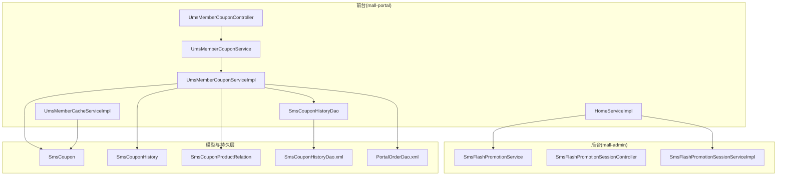
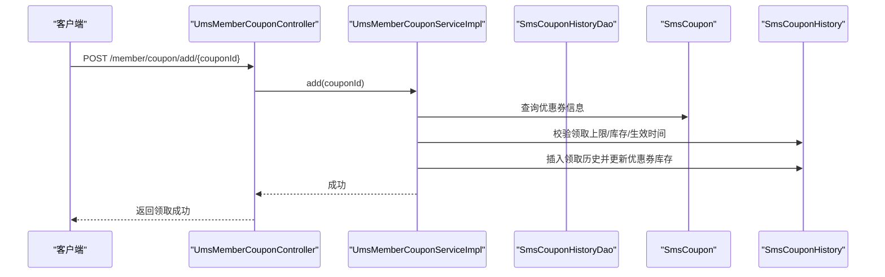
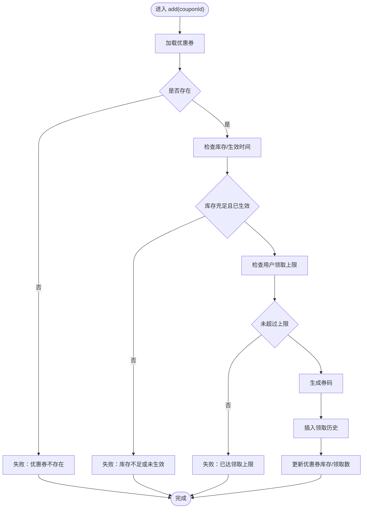
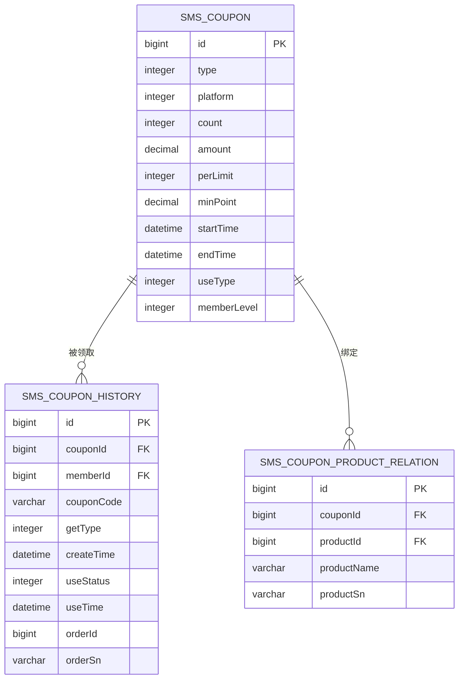
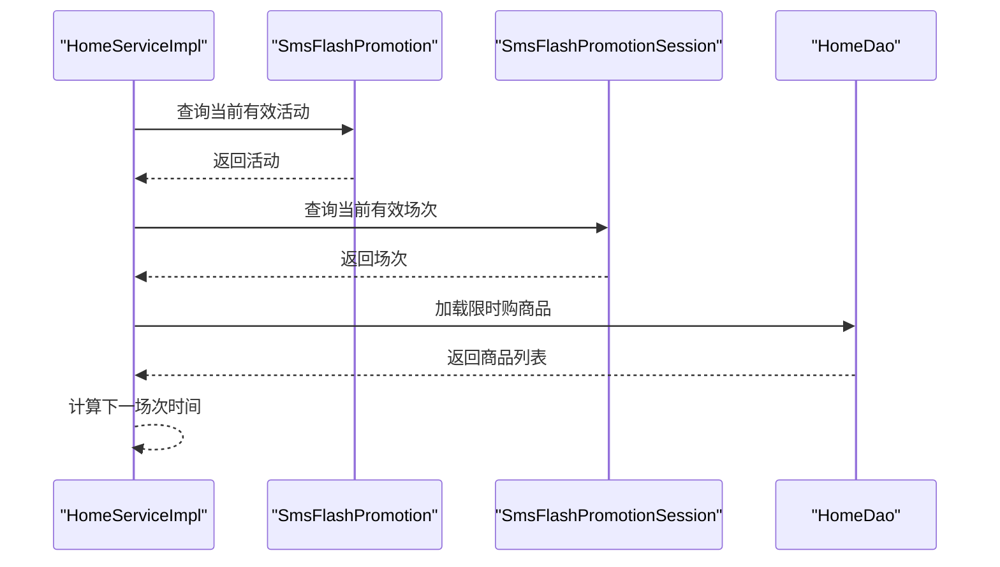
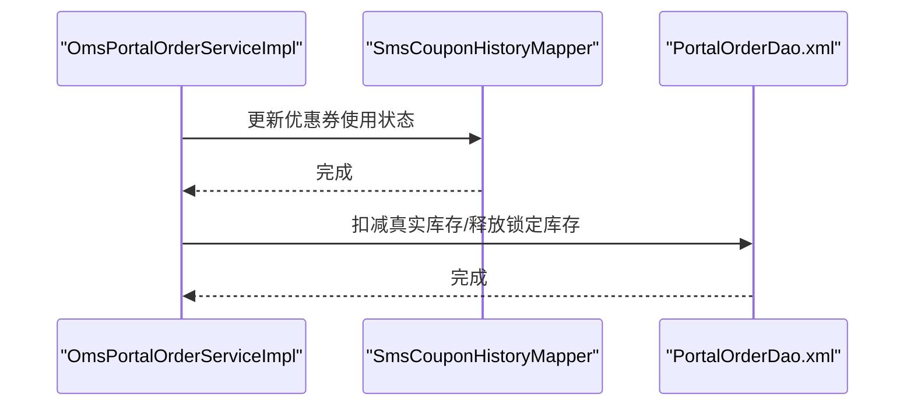
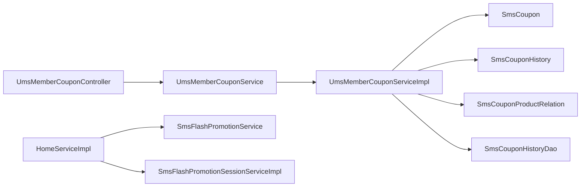

# 促销活动服务

<cite>
**本文引用的文件**
- [UmsMemberCouponController.java](file://mall-portal/src/main/java/com/macro/mall/portal/controller/UmsMemberCouponController.java)
- [UmsMemberCouponService.java](file://mall-portal/src/main/java/com/macro/mall/portal/service/UmsMemberCouponService.java)
- [UmsMemberCouponServiceImpl.java](file://mall-portal/src/main/java/com/macro/mall/portal/service/impl/UmsMemberCouponServiceImpl.java)
- [SmsCouponHistoryDao.java](file://mall-portal/src/main/java/com/macro/mall/portal/dao/SmsCouponHistoryDao.java)
- [SmsCouponHistory.java](file://mall-mbg/src/main/java/com/macro/mall/model/SmsCouponHistory.java)
- [SmsCoupon.java](file://mall-mbg/src/main/java/com/macro/mall/model/SmsCoupon.java)
- [SmsCouponProductRelation.java](file://mall-mbg/src/main/java/com/macro/mall/model/SmsCouponProductRelation.java)
- [SmsCouponHistoryDao.xml](file://mall-portal/src/main/resources/dao/SmsCouponHistoryDao.xml)
- [PortalOrderDao.xml](file://mall-portal/src/main/resources/dao/PortalOrderDao.xml)
- [OmsPortalOrderServiceImpl.java](file://mall-portal/src/main/java/com/macro/mall/portal/service/impl/OmsPortalOrderServiceImpl.java)
- [HomeServiceImpl.java](file://mall-portal/src/main/java/com/macro/mall/portal/service/impl/HomeServiceImpl.java)
- [SmsFlashPromotionService.java](file://mall-admin/src/main/java/com/macro/mall/service/SmsFlashPromotionService.java)
- [SmsFlashPromotionSessionController.java](file://mall-admin/src/main/java/com/macro/mall/controller/SmsFlashPromotionSessionController.java)
- [SmsFlashPromotionSessionServiceImpl.java](file://mall-admin/src/main/java/com/macro/mall/service/impl/SmsFlashPromotionSessionServiceImpl.java)
- [UmsMemberCacheServiceImpl.java](file://mall-portal/src/main/java/com/macro/mall/portal/service/impl/UmsMemberCacheServiceImpl.java)
- [RedisCacheAspect.java](file://mall-security/src/main/java/com/macro/mall/security/aspect/RedisCacheAspect.java)
- [mall.sql](file://document/sql/mall.sql)
- [mall-portal.postman_collection.json](file://document/postman/mall-portal.postman_collection.json)
- [mall-admin.postman_collection.json](file://document/postman/mall-admin.postman_collection.json)
</cite>

## 目录
1. [简介](#简介)
2. [项目结构](#项目结构)
3. [核心组件](#核心组件)
4. [架构总览](#架构总览)
5. [详细组件分析](#详细组件分析)
6. [依赖关系分析](#依赖关系分析)
7. [性能考量](#性能考量)
8. [故障排查指南](#故障排查指南)
9. [结论](#结论)
10. [附录](#附录)

## 简介
本技术文档聚焦于促销活动服务，涵盖以下核心能力：
- 优惠券领取与使用：会员通过接口领取优惠券，系统进行规则校验、库存与领取上限控制，并在订单结算时更新使用状态。
- 限时购活动：首页展示当前场次的限时购商品，支持活动与场次配置。
- 会员权益：结合会员等级特权与促销活动，提升用户体验。

文档将详细解析 UmsMemberCouponController 的 API 设计与 UmsMemberCouponServiceImpl 的业务实现，说明缓存策略与并发控制机制，并提供接口文档与使用示例。

## 项目结构
促销活动服务主要分布在 mall-portal 与 mall-admin 模块：
- mall-portal：面向前端的促销能力，包含优惠券、限时购、订单流程等。
- mall-admin：后台管理端，负责优惠券与限时购活动的配置与维护。

图表来源
- [UmsMemberCouponController.java:1-69](file://mall-portal/src/main/java/com/macro/mall/portal/controller/UmsMemberCouponController.java#L1-L69)
- [UmsMemberCouponService.java:1-41](file://mall-portal/src/main/java/com/macro/mall/portal/service/UmsMemberCouponService.java#L1-L41)
- [UmsMemberCouponServiceImpl.java:1-245](file://mall-portal/src/main/java/com/macro/mall/portal/service/impl/UmsMemberCouponServiceImpl.java#L1-L245)
- [SmsCouponHistoryDao.java:1-24](file://mall-portal/src/main/java/com/macro/mall/portal/dao/SmsCouponHistoryDao.java#L1-L24)
- [SmsCoupon.java:1-84](file://mall-mbg/src/main/java/com/macro/mall/model/SmsCoupon.java#L1-L84)
- [SmsCouponHistory.java:1-140](file://mall-mbg/src/main/java/com/macro/mall/model/SmsCouponHistory.java#L1-L140)
- [SmsCouponProductRelation.java:1-73](file://mall-mbg/src/main/java/com/macro/mall/model/SmsCouponProductRelation.java#L1-L73)
- [SmsCouponHistoryDao.xml](file://mall-portal/src/main/resources/dao/SmsCouponHistoryDao.xml)
- [PortalOrderDao.xml:95-114](file://mall-portal/src/main/resources/dao/PortalOrderDao.xml#L95-L114)
- [HomeServiceImpl.java:103-176](file://mall-portal/src/main/java/com/macro/mall/portal/service/impl/HomeServiceImpl.java#L103-L176)
- [SmsFlashPromotionService.java:1-41](file://mall-admin/src/main/java/com/macro/mall/service/SmsFlashPromotionService.java#L1-L41)
- [SmsFlashPromotionSessionController.java:1-33](file://mall-admin/src/main/java/com/macro/mall/controller/SmsFlashPromotionSessionController.java#L1-L33)
- [SmsFlashPromotionSessionServiceImpl.java:1-38](file://mall-admin/src/main/java/com/macro/mall/service/impl/SmsFlashPromotionSessionServiceImpl.java#L1-L38)
- [UmsMemberCacheServiceImpl.java:1-40](file://mall-portal/src/main/java/com/macro/mall/portal/service/impl/UmsMemberCacheServiceImpl.java#L1-L40)

章节来源
- [UmsMemberCouponController.java:1-69](file://mall-portal/src/main/java/com/macro/mall/portal/controller/UmsMemberCouponController.java#L1-L69)
- [UmsMemberCouponService.java:1-41](file://mall-portal/src/main/java/com/macro/mall/portal/service/UmsMemberCouponService.java#L1-L41)
- [UmsMemberCouponServiceImpl.java:1-245](file://mall-portal/src/main/java/com/macro/mall/portal/service/impl/UmsMemberCouponServiceImpl.java#L1-L245)
- [SmsCouponHistoryDao.java:1-24](file://mall-portal/src/main/java/com/macro/mall/portal/dao/SmsCouponHistoryDao.java#L1-L24)
- [SmsCoupon.java:1-84](file://mall-mbg/src/main/java/com/macro/mall/model/SmsCoupon.java#L1-L84)
- [SmsCouponHistory.java:1-140](file://mall-mbg/src/main/java/com/macro/mall/model/SmsCouponHistory.java#L1-L140)
- [SmsCouponProductRelation.java:1-73](file://mall-mbg/src/main/java/com/macro/mall/model/SmsCouponProductRelation.java#L1-L73)
- [SmsCouponHistoryDao.xml](file://mall-portal/src/main/resources/dao/SmsCouponHistoryDao.xml)
- [PortalOrderDao.xml:95-114](file://mall-portal/src/main/resources/dao/PortalOrderDao.xml#L95-L114)
- [HomeServiceImpl.java:103-176](file://mall-portal/src/main/java/com/macro/mall/portal/service/impl/HomeServiceImpl.java#L103-L176)
- [SmsFlashPromotionService.java:1-41](file://mall-admin/src/main/java/com/macro/mall/service/SmsFlashPromotionService.java#L1-L41)
- [SmsFlashPromotionSessionController.java:1-33](file://mall-admin/src/main/java/com/macro/mall/controller/SmsFlashPromotionSessionController.java#L1-L33)
- [SmsFlashPromotionSessionServiceImpl.java:1-38](file://mall-admin/src/main/java/com/macro/mall/service/impl/SmsFlashPromotionSessionServiceImpl.java#L1-L38)
- [UmsMemberCacheServiceImpl.java:1-40](file://mall-portal/src/main/java/com/macro/mall/portal/service/impl/UmsMemberCacheServiceImpl.java#L1-L40)

## 核心组件
- UmsMemberCouponController：提供优惠券相关接口，包括领取、历史查询、可用券查询、按商品查询券等。
- UmsMemberCouponService：定义优惠券服务接口，包括领取、历史查询、购物车可用券、按商品查询券、用户券列表。
- UmsMemberCouponServiceImpl：实现优惠券业务逻辑，含规则校验、库存与领取上限控制、券码生成、可用券筛选等。
- SmsCouponHistoryDao：提供优惠券历史详情与用户券列表查询。
- HomeServiceImpl：限时购首页聚合，获取当前活动与场次并加载商品。
- 缓存与并发：UmsMemberCacheServiceImpl 提供会员缓存，RedisCacheAspect 防止缓存异常影响主流程。

章节来源
- [UmsMemberCouponController.java:1-69](file://mall-portal/src/main/java/com/macro/mall/portal/controller/UmsMemberCouponController.java#L1-L69)
- [UmsMemberCouponService.java:1-41](file://mall-portal/src/main/java/com/macro/mall/portal/service/UmsMemberCouponService.java#L1-L41)
- [UmsMemberCouponServiceImpl.java:1-245](file://mall-portal/src/main/java/com/macro/mall/portal/service/impl/UmsMemberCouponServiceImpl.java#L1-L245)
- [SmsCouponHistoryDao.java:1-24](file://mall-portal/src/main/java/com/macro/mall/portal/dao/SmsCouponHistoryDao.java#L1-L24)
- [HomeServiceImpl.java:103-176](file://mall-portal/src/main/java/com/macro/mall/portal/service/impl/HomeServiceImpl.java#L103-L176)
- [UmsMemberCacheServiceImpl.java:1-40](file://mall-portal/src/main/java/com/macro/mall/portal/service/impl/UmsMemberCacheServiceImpl.java#L1-L40)
- [RedisCacheAspect.java:1-50](file://mall-security/src/main/java/com/macro/mall/security/aspect/RedisCacheAspect.java#L1-L50)

## 架构总览
促销活动服务采用分层架构：
- 控制层：UmsMemberCouponController 对外暴露 REST 接口。
- 服务层：UmsMemberCouponServiceImpl 实现业务规则与数据处理。
- 数据访问层：MyBatis Mapper/Dao 负责数据库交互。
- 缓存层：基于 Redis 的会员缓存与切面保护。

图表来源
- [UmsMemberCouponController.java:33-38](file://mall-portal/src/main/java/com/macro/mall/portal/controller/UmsMemberCouponController.java#L33-L38)
- [UmsMemberCouponServiceImpl.java:43-80](file://mall-portal/src/main/java/com/macro/mall/portal/service/impl/UmsMemberCouponServiceImpl.java#L43-L80)
- [SmsCouponHistoryDao.java:1-24](file://mall-portal/src/main/java/com/macro/mall/portal/dao/SmsCouponHistoryDao.java#L1-L24)
- [SmsCoupon.java:1-84](file://mall-mbg/src/main/java/com/macro/mall/model/SmsCoupon.java#L1-L84)
- [SmsCouponHistory.java:1-140](file://mall-mbg/src/main/java/com/macro/mall/model/SmsCouponHistory.java#L1-L140)

## 详细组件分析

### UmsMemberCouponController 接口设计
- 领取优惠券
  - 方法：POST
  - 路径：/member/coupon/add/{couponId}
  - 参数：couponId（路径变量）
  - 返回：统一结果包装
- 优惠券历史查询
  - 方法：GET
  - 路径：/member/coupon/listHistory
  - 参数：useStatus（可选）
  - 返回：历史列表
- 用户优惠券列表
  - 方法：GET
  - 路径：/member/coupon/list
  - 参数：useStatus（可选）
  - 返回：优惠券列表
- 购物车可用券
  - 方法：GET
  - 路径：/member/coupon/list/cart/{type}
  - 参数：type（1=可用，0=不可用）
  - 返回：可用券详情列表
- 按商品查询优惠券
  - 方法：GET
  - 路径：/member/coupon/listByProduct/{productId}
  - 参数：productId（路径变量）
  - 返回：可用优惠券列表

章节来源
- [UmsMemberCouponController.java:33-67](file://mall-portal/src/main/java/com/macro/mall/portal/controller/UmsMemberCouponController.java#L33-L67)

### UmsMemberCouponServiceImpl 业务逻辑
- 领取流程
  - 校验优惠券存在性、库存、生效时间。
  - 校验用户领取上限（perLimit）。
  - 生成唯一券码（16位），插入领取历史，更新优惠券库存与领取数量。
- 可用券筛选（购物车）
  - 全场通用：按购物车总价与门槛比较。
  - 指定分类：按分类汇总金额与门槛比较。
  - 指定商品：按商品汇总金额与门槛比较。
  - 结合有效期与使用类型返回可用/不可用列表。
- 按商品查询券
  - 组合“指定商品”、“指定分类”和“全场通用”有效期内的券。
- 用户券列表
  - 基于领取历史与使用状态查询。

图表来源
- [UmsMemberCouponServiceImpl.java:43-80](file://mall-portal/src/main/java/com/macro/mall/portal/service/impl/UmsMemberCouponServiceImpl.java#L43-L80)

章节来源
- [UmsMemberCouponServiceImpl.java:43-245](file://mall-portal/src/main/java/com/macro/mall/portal/service/impl/UmsMemberCouponServiceImpl.java#L43-L245)

### 优惠券模型与关系
- SmsCoupon：优惠券基础信息（类型、平台、数量、门槛、有效期、使用类型等）。
- SmsCouponHistory：用户领取历史（券码、领取方式、使用状态、关联订单等）。
- SmsCouponProductRelation：优惠券与商品/分类的关系。

图表来源
- [SmsCoupon.java:1-84](file://mall-mbg/src/main/java/com/macro/mall/model/SmsCoupon.java#L1-L84)
- [SmsCouponHistory.java:1-140](file://mall-mbg/src/main/java/com/macro/mall/model/SmsCouponHistory.java#L1-L140)
- [SmsCouponProductRelation.java:1-73](file://mall-mbg/src/main/java/com/macro/mall/model/SmsCouponProductRelation.java#L1-L73)

### 限时购活动
- 首页聚合
  - 根据当前日期定位活动，根据当前时间定位场次，加载对应商品。
- 场次管理
  - 后台新增/编辑场次，支持启用状态与时间范围。

图表来源
- [HomeServiceImpl.java:103-176](file://mall-portal/src/main/java/com/macro/mall/portal/service/impl/HomeServiceImpl.java#L103-L176)
- [SmsFlashPromotionService.java:1-41](file://mall-admin/src/main/java/com/macro/mall/service/SmsFlashPromotionService.java#L1-L41)
- [SmsFlashPromotionSessionController.java:1-33](file://mall-admin/src/main/java/com/macro/mall/controller/SmsFlashPromotionSessionController.java#L1-L33)
- [SmsFlashPromotionSessionServiceImpl.java:1-38](file://mall-admin/src/main/java/com/macro/mall/service/impl/SmsFlashPromotionSessionServiceImpl.java#L1-L38)
- [mall.sql:1890-2018](file://document/sql/mall.sql#L1890-L2018)

章节来源
- [HomeServiceImpl.java:103-176](file://mall-portal/src/main/java/com/macro/mall/portal/service/impl/HomeServiceImpl.java#L103-L176)
- [SmsFlashPromotionService.java:1-41](file://mall-admin/src/main/java/com/macro/mall/service/SmsFlashPromotionService.java#L1-L41)
- [SmsFlashPromotionSessionController.java:1-33](file://mall-admin/src/main/java/com/macro/mall/controller/SmsFlashPromotionSessionController.java#L1-L33)
- [SmsFlashPromotionSessionServiceImpl.java:1-38](file://mall-admin/src/main/java/com/macro/mall/service/impl/SmsFlashPromotionSessionServiceImpl.java#L1-L38)
- [mall.sql:1890-2018](file://document/sql/mall.sql#L1890-L2018)

### 优惠券使用与订单结算
- 使用状态更新
  - 在订单结算完成后，将指定优惠券的历史记录使用状态置为“已使用”，并写入使用时间。
- 库存控制
  - 支付成功后，对下单商品的锁定库存进行扣减与释放，确保并发安全。

图表来源
- [OmsPortalOrderServiceImpl.java:519-532](file://mall-portal/src/main/java/com/macro/mall/portal/service/impl/OmsPortalOrderServiceImpl.java#L519-L532)
- [PortalOrderDao.xml:95-114](file://mall-portal/src/main/resources/dao/PortalOrderDao.xml#L95-L114)

章节来源
- [OmsPortalOrderServiceImpl.java:519-532](file://mall-portal/src/main/java/com/macro/mall/portal/service/impl/OmsPortalOrderServiceImpl.java#L519-L532)
- [PortalOrderDao.xml:95-114](file://mall-portal/src/main/resources/dao/PortalOrderDao.xml#L95-L114)

### 缓存策略与并发控制
- 会员缓存
  - UmsMemberCacheServiceImpl 提供会员信息缓存与删除。
- 缓存异常防护
  - RedisCacheAspect 对缓存方法进行环绕增强，非关键缓存异常不阻断主流程。
- 并发控制
  - 优惠券领取：通过数据库层面的库存与领取上限校验，避免超领。
  - 库存扣减：使用带条件的原子更新，防止超卖。

章节来源
- [UmsMemberCacheServiceImpl.java:1-40](file://mall-portal/src/main/java/com/macro/mall/portal/service/impl/UmsMemberCacheServiceImpl.java#L1-L40)
- [RedisCacheAspect.java:1-50](file://mall-security/src/main/java/com/macro/mall/security/aspect/RedisCacheAspect.java#L1-L50)
- [UmsMemberCouponServiceImpl.java:43-80](file://mall-portal/src/main/java/com/macro/mall/portal/service/impl/UmsMemberCouponServiceImpl.java#L43-L80)
- [PortalOrderDao.xml:95-114](file://mall-portal/src/main/resources/dao/PortalOrderDao.xml#L95-L114)

## 依赖关系分析
- 控制器依赖服务接口，服务实现依赖模型与 DAO。
- 服务实现依赖多个 Mapper/Dao 进行数据读写。
- 限时购模块通过 HomeServiceImpl 聚合活动与场次信息。

图表来源
- [UmsMemberCouponController.java:1-69](file://mall-portal/src/main/java/com/macro/mall/portal/controller/UmsMemberCouponController.java#L1-L69)
- [UmsMemberCouponService.java:1-41](file://mall-portal/src/main/java/com/macro/mall/portal/service/UmsMemberCouponService.java#L1-L41)
- [UmsMemberCouponServiceImpl.java:1-245](file://mall-portal/src/main/java/com/macro/mall/portal/service/impl/UmsMemberCouponServiceImpl.java#L1-L245)
- [SmsCoupon.java:1-84](file://mall-mbg/src/main/java/com/macro/mall/model/SmsCoupon.java#L1-L84)
- [SmsCouponHistory.java:1-140](file://mall-mbg/src/main/java/com/macro/mall/model/SmsCouponHistory.java#L1-L140)
- [SmsCouponProductRelation.java:1-73](file://mall-mbg/src/main/java/com/macro/mall/model/SmsCouponProductRelation.java#L1-L73)
- [SmsCouponHistoryDao.java:1-24](file://mall-portal/src/main/java/com/macro/mall/portal/dao/SmsCouponHistoryDao.java#L1-L24)
- [HomeServiceImpl.java:103-176](file://mall-portal/src/main/java/com/macro/mall/portal/service/impl/HomeServiceImpl.java#L103-L176)
- [SmsFlashPromotionService.java:1-41](file://mall-admin/src/main/java/com/macro/mall/service/SmsFlashPromotionService.java#L1-L41)
- [SmsFlashPromotionSessionServiceImpl.java:1-38](file://mall-admin/src/main/java/com/macro/mall/service/impl/SmsFlashPromotionSessionServiceImpl.java#L1-L38)

章节来源
- [UmsMemberCouponController.java:1-69](file://mall-portal/src/main/java/com/macro/mall/portal/controller/UmsMemberCouponController.java#L1-L69)
- [UmsMemberCouponService.java:1-41](file://mall-portal/src/main/java/com/macro/mall/portal/service/UmsMemberCouponService.java#L1-L41)
- [UmsMemberCouponServiceImpl.java:1-245](file://mall-portal/src/main/java/com/macro/mall/portal/service/impl/UmsMemberCouponServiceImpl.java#L1-L245)
- [SmsCoupon.java:1-84](file://mall-mbg/src/main/java/com/macro/mall/model/SmsCoupon.java#L1-L84)
- [SmsCouponHistory.java:1-140](file://mall-mbg/src/main/java/com/macro/mall/model/SmsCouponHistory.java#L1-L140)
- [SmsCouponProductRelation.java:1-73](file://mall-mbg/src/main/java/com/macro/mall/model/SmsCouponProductRelation.java#L1-L73)
- [SmsCouponHistoryDao.java:1-24](file://mall-portal/src/main/java/com/macro/mall/portal/dao/SmsCouponHistoryDao.java#L1-L24)
- [HomeServiceImpl.java:103-176](file://mall-portal/src/main/java/com/macro/mall/portal/service/impl/HomeServiceImpl.java#L103-L176)
- [SmsFlashPromotionService.java:1-41](file://mall-admin/src/main/java/com/macro/mall/service/SmsFlashPromotionService.java#L1-L41)
- [SmsFlashPromotionSessionServiceImpl.java:1-38](file://mall-admin/src/main/java/com/macro/mall/service/impl/SmsFlashPromotionSessionServiceImpl.java#L1-L38)

## 性能考量
- 优惠券领取与使用涉及多表写操作，建议在数据库层面增加索引以优化查询与更新性能。
- 购物车可用券筛选为内存计算，建议对购物车数据进行分页与缓存，减少不必要的全量计算。
- 限时购商品列表应配合缓存与预热，降低首页聚合查询压力。
- 并发场景下的库存扣减使用原子更新，避免超卖；同时建议对热点券设置合理的领取上限与库存阈值。

## 故障排查指南
- 领取失败：检查优惠券是否存在、是否生效、库存是否充足、是否达到领取上限。
- 使用失败：确认订单状态与优惠券使用状态一致，核对订单号与券历史记录匹配。
- 库存异常：核对支付成功后的库存扣减与锁定库存释放逻辑，确保原子性。
- 缓存异常：若缓存服务不可用，RedisCacheAspect 会记录日志但不影响主流程，建议检查缓存配置与健康状态。

章节来源
- [UmsMemberCouponServiceImpl.java:43-80](file://mall-portal/src/main/java/com/macro/mall/portal/service/impl/UmsMemberCouponServiceImpl.java#L43-L80)
- [OmsPortalOrderServiceImpl.java:519-532](file://mall-portal/src/main/java/com/macro/mall/portal/service/impl/OmsPortalOrderServiceImpl.java#L519-L532)
- [RedisCacheAspect.java:1-50](file://mall-security/src/main/java/com/macro/mall/security/aspect/RedisCacheAspect.java#L1-L50)

## 结论
促销活动服务围绕“优惠券”与“限时购”两大核心展开，通过清晰的分层设计与严格的业务校验保障了功能正确性与系统稳定性。结合缓存与并发控制策略，可在高并发场景下保持良好的性能表现。后续可进一步完善热点券的限流与库存预警机制，持续优化用户体验。

## 附录

### 接口文档与使用示例
- 领取优惠券
  - 方法：POST
  - 路径：/member/coupon/add/{couponId}
  - 示例：参考 Postman 集合中的登录与优惠券领取请求。
- 查询优惠券历史
  - 方法：GET
  - 路径：/member/coupon/listHistory?useStatus={useStatus}
- 查询用户优惠券
  - 方法：GET
  - 路径：/member/coupon/list?useStatus={useStatus}
- 查询购物车可用券
  - 方法：GET
  - 路径：/member/coupon/list/cart/{type}
- 按商品查询优惠券
  - 方法：GET
  - 路径：/member/coupon/listByProduct/{productId}

章节来源
- [UmsMemberCouponController.java:33-67](file://mall-portal/src/main/java/com/macro/mall/portal/controller/UmsMemberCouponController.java#L33-L67)
- [mall-portal.postman_collection.json:1-77](file://document/postman/mall-portal.postman_collection.json#L1-L77)
- [mall-admin.postman_collection.json:1-47](file://document/postman/mall-admin.postman_collection.json#L1-L47)