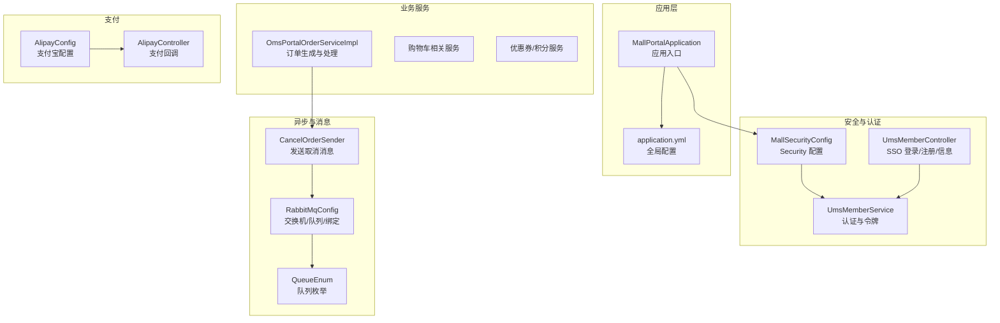
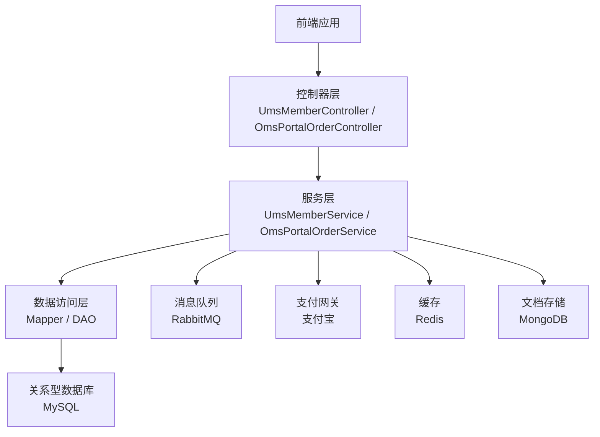
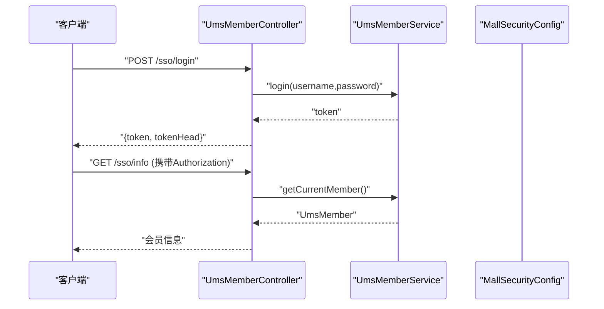
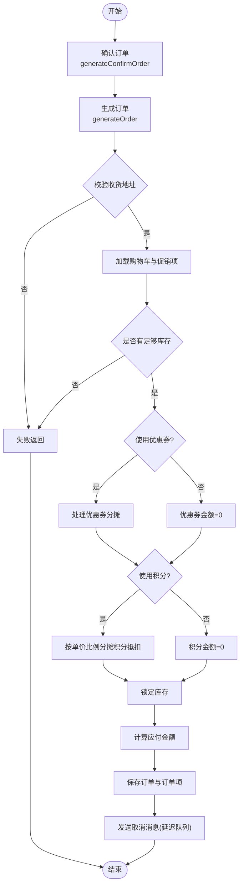
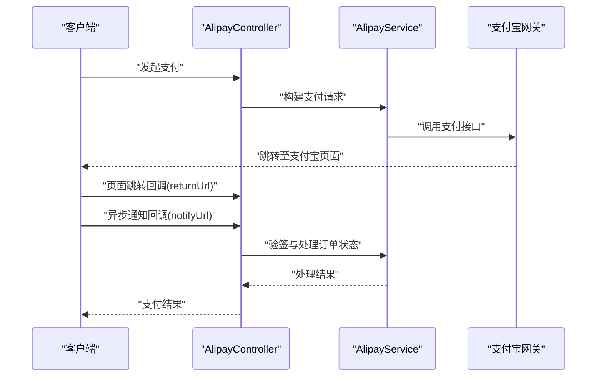
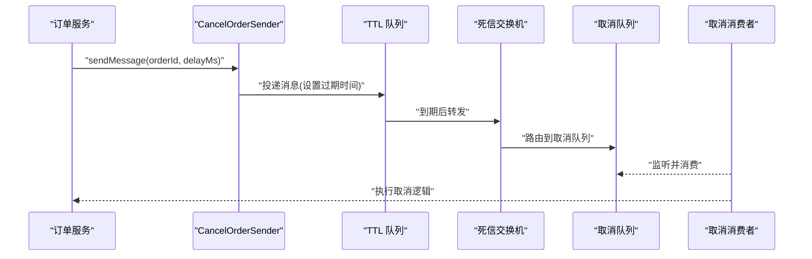
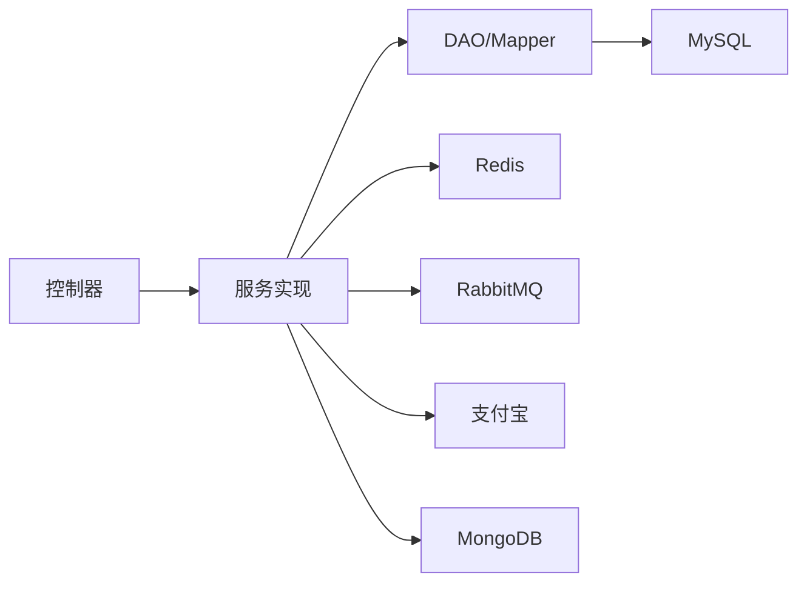

# 前台门户系统 (mall-portal)

<cite>
**本文引用的文件**
- [MallPortalApplication.java](file://mall-portal/src/main/java/com/macro/mall/portal/MallPortalApplication.java)
- [application.yml](file://mall-portal/src/main/resources/application.yml)
- [MallSecurityConfig.java](file://mall-portal/src/main/java/com/macro/mall/portal/config/MallSecurityConfig.java)
- [SpringTaskConfig.java](file://mall-portal/src/main/java/com/macro/mall/portal/config/SpringTaskConfig.java)
- [RabbitMqConfig.java](file://mall-portal/src/main/java/com/macro/mall/portal/config/RabbitMqConfig.java)
- [AlipayConfig.java](file://mall-portal/src/main/java/com/macro/mall/portal/config/AlipayConfig.java)
- [UmsMemberController.java](file://mall-portal/src/main/java/com/macro/mall/portal/controller/UmsMemberController.java)
- [UmsMemberService.java](file://mall-portal/src/main/java/com/macro/mall/portal/service/UmsMemberService.java)
- [OmsPortalOrderServiceImpl.java](file://mall-portal/src/main/java/com/macro/mall/portal/service/impl/OmsPortalOrderServiceImpl.java)
- [QueueEnum.java](file://mall-portal/src/main/java/com/macro/mall/portal/domain/QueueEnum.java)
- [CancelOrderSender.java](file://mall-portal/src/main/java/com/macro/mall/portal/component/CancelOrderSender.java)
</cite>

## 目录
1. [简介](#简介)
2. [项目结构](#项目结构)
3. [核心组件](#核心组件)
4. [架构总览](#架构总览)
5. [详细组件分析](#详细组件分析)
6. [依赖分析](#依赖分析)
7. [性能考虑](#性能考虑)
8. [故障排查指南](#故障排查指南)
9. [结论](#结论)
10. [附录](#附录)

## 简介
mall-portal 是电商前台门户模块，面向终端用户，提供商品浏览、购物车管理、订单处理、会员中心、支付集成、异步任务与消息队列等功能。系统基于 Spring Boot 构建，采用 Spring Security + JWT 实现认证授权，结合 Redis 缓存、RabbitMQ 异步处理、MongoDB 文档存储等能力，支撑高并发的电商前端业务。

## 项目结构
- 应用入口与配置
  - 应用启动类位于 mall-portal 模块根包下，扫描 com.macro.mall 包以加载各子模块组件。
  - 全局配置集中于 application.yml，包含 JWT、安全白名单、Redis、MongoDB、RabbitMQ 等关键参数。
- 安全与认证
  - 通过 mall-security 模块提供的组件与配置，结合自定义 UserDetailsService 实现会员认证。
- 控制层与服务层
  - 控制器负责对外暴露 REST 接口，服务层封装业务逻辑，DAO 层对接数据库。
- 异步与消息
  - 使用 RabbitMQ 的 TTL 死信队列实现订单超时自动取消。
- 支付集成
  - 提供支付宝 SDK 配置与回调处理接口，支持同步跳转与异步通知。

**图表来源**
- [MallPortalApplication.java:1-14](file://mall-portal/src/main/java/com/macro/mall/portal/MallPortalApplication.java#L1-L14)
- [application.yml:1-62](file://mall-portal/src/main/resources/application.yml#L1-L62)
- [MallSecurityConfig.java:1-25](file://mall-portal/src/main/java/com/macro/mall/portal/config/MallSecurityConfig.java#L1-L25)
- [UmsMemberController.java:1-100](file://mall-portal/src/main/java/com/macro/mall/portal/controller/UmsMemberController.java#L1-L100)
- [UmsMemberService.java:1-65](file://mall-portal/src/main/java/com/macro/mall/portal/service/UmsMemberService.java#L1-L65)
- [OmsPortalOrderServiceImpl.java:1-200](file://mall-portal/src/main/java/com/macro/mall/portal/service/impl/OmsPortalOrderServiceImpl.java#L1-L200)
- [RabbitMqConfig.java:1-80](file://mall-portal/src/main/java/com/macro/mall/portal/config/RabbitMqConfig.java#L1-L80)
- [QueueEnum.java:1-39](file://mall-portal/src/main/java/com/macro/mall/portal/domain/QueueEnum.java#L1-L39)
- [CancelOrderSender.java:1-36](file://mall-portal/src/main/java/com/macro/mall/portal/component/CancelOrderSender.java#L1-L36)
- [AlipayConfig.java:1-58](file://mall-portal/src/main/java/com/macro/mall/portal/config/AlipayConfig.java#L1-L58)

**章节来源**
- [MallPortalApplication.java:1-14](file://mall-portal/src/main/java/com/macro/mall/portal/MallPortalApplication.java#L1-L14)
- [application.yml:1-62](file://mall-portal/src/main/resources/application.yml#L1-L62)

## 核心组件
- 应用入口与扫描
  - 启动类启用 Spring Boot 自动装配，并通过 scanBasePackages 扫描 com.macro.mall 下所有组件。
- 安全与认证
  - 自定义 UserDetailsService，从会员服务按用户名加载用户详情，配合 mall-security 模块完成认证。
  - SSO 登录接口支持注册、登录、获取验证码、刷新 Token、获取当前用户信息。
- 订单与购物车
  - 订单服务负责确认订单、生成订单、优惠券与积分处理、库存锁定、应付金额计算等。
  - 购物车服务提供促销项计算、优惠明细、收货地址选择等。
- 异步任务与消息队列
  - 启用 Spring 定时任务注解，结合 RabbitMQ TTL 死信队列实现订单超时取消。
- 支付集成
  - 支付宝配置集中于 AlipayConfig，提供网关地址、应用 ID、私钥、公钥、回调地址等。
  - 提供 AlipayController 处理支付回调与页面跳转。

**章节来源**
- [MallSecurityConfig.java:1-25](file://mall-portal/src/main/java/com/macro/mall/portal/config/MallSecurityConfig.java#L1-L25)
- [UmsMemberController.java:1-100](file://mall-portal/src/main/java/com/macro/mall/portal/controller/UmsMemberController.java#L1-L100)
- [UmsMemberService.java:1-65](file://mall-portal/src/main/java/com/macro/mall/portal/service/UmsMemberService.java#L1-L65)
- [OmsPortalOrderServiceImpl.java:1-200](file://mall-portal/src/main/java/com/macro/mall/portal/service/impl/OmsPortalOrderServiceImpl.java#L1-L200)
- [SpringTaskConfig.java:1-14](file://mall-portal/src/main/java/com/macro/mall/portal/config/SpringTaskConfig.java#L1-L14)
- [RabbitMqConfig.java:1-80](file://mall-portal/src/main/java/com/macro/mall/portal/config/RabbitMqConfig.java#L1-L80)
- [AlipayConfig.java:1-58](file://mall-portal/src/main/java/com/macro/mall/portal/config/AlipayConfig.java#L1-L58)

## 架构总览
mall-portal 采用前后端分离架构，前端通过 HTTP 接口与后端交互。后端以 Spring MVC 为核心，结合 Spring Security 进行鉴权，JWT 作为无状态令牌。订单流程通过异步消息队列实现超时自动取消，支付通过支付宝 SDK 完成。

**图表来源**
- [UmsMemberController.java:1-100](file://mall-portal/src/main/java/com/macro/mall/portal/controller/UmsMemberController.java#L1-L100)
- [OmsPortalOrderServiceImpl.java:1-200](file://mall-portal/src/main/java/com/macro/mall/portal/service/impl/OmsPortalOrderServiceImpl.java#L1-L200)
- [RabbitMqConfig.java:1-80](file://mall-portal/src/main/java/com/macro/mall/portal/config/RabbitMqConfig.java#L1-L80)
- [AlipayConfig.java:1-58](file://mall-portal/src/main/java/com/macro/mall/portal/config/AlipayConfig.java#L1-L58)
- [application.yml:1-62](file://mall-portal/src/main/resources/application.yml#L1-L62)

## 详细组件分析

### 安全与认证组件
- 配置要点
  - 自定义 UserDetailsService，按用户名加载会员详情，用于登录认证。
  - 安全白名单通过 secure.ignored.urls 配置，放行静态资源、Swagger、首页、商品/品牌查询、支付回调等。
  - JWT 参数：tokenHeader、secret、expiration、tokenHead。
- 认证流程
  - 登录接口接收用户名/密码，成功后返回 token 与前缀；刷新接口支持续签。
  - 当前用户信息接口需携带有效 JWT，服务端解析后返回会员详情。

**图表来源**
- [UmsMemberController.java:1-100](file://mall-portal/src/main/java/com/macro/mall/portal/controller/UmsMemberController.java#L1-L100)
- [UmsMemberService.java:1-65](file://mall-portal/src/main/java/com/macro/mall/portal/service/UmsMemberService.java#L1-L65)
- [MallSecurityConfig.java:1-25](file://mall-portal/src/main/java/com/macro/mall/portal/config/MallSecurityConfig.java#L1-L25)

**章节来源**
- [MallSecurityConfig.java:1-25](file://mall-portal/src/main/java/com/macro/mall/portal/config/MallSecurityConfig.java#L1-L25)
- [UmsMemberController.java:1-100](file://mall-portal/src/main/java/com/macro/mall/portal/controller/UmsMemberController.java#L1-L100)
- [application.yml:15-40](file://mall-portal/src/main/resources/application.yml#L15-L40)

### 订单处理组件
- 功能概述
  - 确认订单：聚合购物车促销项、收货地址、可用优惠券、积分规则与计算总金额。
  - 生成订单：校验地址、库存、优惠券与积分使用，锁定库存，计算应付金额，写入订单与订单项。
  - 发送取消消息：通过 CancelOrderSender 将订单 ID 发送到 TTL 队列，实现超时自动取消。
- 关键流程

**图表来源**
- [OmsPortalOrderServiceImpl.java:71-200](file://mall-portal/src/main/java/com/macro/mall/portal/service/impl/OmsPortalOrderServiceImpl.java#L71-L200)
- [CancelOrderSender.java:23-34](file://mall-portal/src/main/java/com/macro/mall/portal/component/CancelOrderSender.java#L23-L34)
- [RabbitMqConfig.java:18-77](file://mall-portal/src/main/java/com/macro/mall/portal/config/RabbitMqConfig.java#L18-L77)

**章节来源**
- [OmsPortalOrderServiceImpl.java:1-200](file://mall-portal/src/main/java/com/macro/mall/portal/service/impl/OmsPortalOrderServiceImpl.java#L1-L200)
- [CancelOrderSender.java:1-36](file://mall-portal/src/main/java/com/macro/mall/portal/component/CancelOrderSender.java#L1-L36)
- [RabbitMqConfig.java:1-80](file://mall-portal/src/main/java/com/macro/mall/portal/config/RabbitMqConfig.java#L1-L80)

### 支付集成组件
- 配置要点
  - 支付宝网关、应用 ID、应用私钥、支付宝公钥、返回地址、通知地址、参数格式、字符集、签名算法等。
- 回调处理
  - 页面跳转回调与异步通知回调分别对应前端展示与服务端幂等处理，确保支付结果一致性。

**图表来源**
- [AlipayConfig.java:1-58](file://mall-portal/src/main/java/com/macro/mall/portal/config/AlipayConfig.java#L1-L58)

**章节来源**
- [AlipayConfig.java:1-58](file://mall-portal/src/main/java/com/macro/mall/portal/config/AlipayConfig.java#L1-L58)

### 异步任务与消息队列
- 配置要点
  - 定时任务：通过 @EnableScheduling 启用。
  - RabbitMQ：定义直连交换机与队列，TTL 队列作为死信队列，到期后转发至实际消费队列。
- 工作流
  - 订单生成后，向 TTL 队列投递带过期时间的消息；到期后死信交换机转发至取消队列，消费者处理取消逻辑。

**图表来源**
- [SpringTaskConfig.java:1-14](file://mall-portal/src/main/java/com/macro/mall/portal/config/SpringTaskConfig.java#L1-L14)
- [RabbitMqConfig.java:18-77](file://mall-portal/src/main/java/com/macro/mall/portal/config/RabbitMqConfig.java#L18-L77)
- [QueueEnum.java:1-39](file://mall-portal/src/main/java/com/macro/mall/portal/domain/QueueEnum.java#L1-L39)
- [CancelOrderSender.java:23-34](file://mall-portal/src/main/java/com/macro/mall/portal/component/CancelOrderSender.java#L23-L34)

**章节来源**
- [SpringTaskConfig.java:1-14](file://mall-portal/src/main/java/com/macro/mall/portal/config/SpringTaskConfig.java#L1-L14)
- [RabbitMqConfig.java:1-80](file://mall-portal/src/main/java/com/macro/mall/portal/config/RabbitMqConfig.java#L1-L80)
- [QueueEnum.java:1-39](file://mall-portal/src/main/java/com/macro/mall/portal/domain/QueueEnum.java#L1-L39)
- [CancelOrderSender.java:1-36](file://mall-portal/src/main/java/com/macro/mall/portal/component/CancelOrderSender.java#L1-L36)

### MongoDB 文档存储
- 应用场景
  - 通过配置项 mongo.insert.sqlEnable 控制是否基于数据库数据插入 MongoDB，适合日志、行为轨迹、搜索索引等文档型数据。
- 数据模型设计
  - 建议围绕用户行为（浏览、收藏、历史）、订单扩展信息、营销活动记录等建立集合，字段设计遵循业务实体与查询需求。

**章节来源**
- [application.yml:52-55](file://mall-portal/src/main/resources/application.yml#L52-L55)

## 依赖分析
- 组件耦合
  - 控制器依赖服务接口；服务实现依赖 DAO、Redis、MQ、支付配置等。
  - 订单服务与取消消息发送者存在直接依赖，形成“下单即发取消消息”的闭环。
- 外部依赖
  - RabbitMQ：订单取消的异步处理通道。
  - Redis：验证码、订单号、会员信息等缓存。
  - 支付宝：支付网关与回调处理。
  - MySQL：订单、会员、优惠券等结构化数据。
  - MongoDB：文档型数据存储。

**图表来源**
- [UmsMemberController.java:1-100](file://mall-portal/src/main/java/com/macro/mall/portal/controller/UmsMemberController.java#L1-L100)
- [OmsPortalOrderServiceImpl.java:1-200](file://mall-portal/src/main/java/com/macro/mall/portal/service/impl/OmsPortalOrderServiceImpl.java#L1-L200)
- [application.yml:1-62](file://mall-portal/src/main/resources/application.yml#L1-L62)

**章节来源**
- [application.yml:1-62](file://mall-portal/src/main/resources/application.yml#L1-L62)

## 性能考虑
- 缓存策略
  - 使用 Redis 存储验证码、订单号、会员信息，降低数据库压力。
- 异步化
  - 订单取消通过消息队列异步处理，避免阻塞下单主流程。
- 分页与查询
  - 订单与商品列表建议结合分页插件与索引优化，减少大表扫描。
- 并发控制
  - 库存锁定与扣减应使用原子操作或分布式锁，防止超卖。

## 故障排查指南
- 认证失败
  - 检查 JWT 配置与请求头 Authorization 是否正确；确认安全白名单是否覆盖目标接口。
- 订单无法生成
  - 核对收货地址、库存、优惠券与积分使用规则；查看日志定位具体断言点。
- 消息未被取消
  - 检查 RabbitMQ 交换机/队列绑定、TTL 设置与死信路由；确认消费者是否正常运行。
- 支付回调异常
  - 核对支付宝回调地址公网可达性、验签参数与签名算法；检查幂等处理逻辑。

**章节来源**
- [application.yml:15-62](file://mall-portal/src/main/resources/application.yml#L15-L62)
- [OmsPortalOrderServiceImpl.java:95-200](file://mall-portal/src/main/java/com/macro/mall/portal/service/impl/OmsPortalOrderServiceImpl.java#L95-L200)
- [RabbitMqConfig.java:18-77](file://mall-portal/src/main/java/com/macro/mall/portal/config/RabbitMqConfig.java#L18-L77)
- [AlipayConfig.java:36-44](file://mall-portal/src/main/java/com/macro/mall/portal/config/AlipayConfig.java#L36-L44)

## 结论
mall-portal 通过清晰的分层架构与模块化设计，实现了从前端门户到后端服务的完整闭环。JWT + Spring Security 提供了可靠的认证授权；Redis、RabbitMQ、MongoDB 等中间件提升了系统的可扩展性与性能。订单超时取消、支付回调等关键流程均具备完善的异步与幂等保障，满足电商前台的核心业务需求。

## 附录
- API 接口清单（示例）
  - SSO 登录/注册/信息/刷新 Token：/sso/*
  - 商品与品牌：/product/*、/brand/*
  - 购物车：/cart/*
  - 订单：/order/*
  - 支付：/alipay/*
- 集成指南
  - 在 application.yml 中配置 JWT、Redis、RabbitMQ、MongoDB、支付宝参数。
  - 确保 RabbitMQ 交换机/队列/绑定与 QueueEnum 一致。
  - 支付回调地址需公网可达，注意验签与幂等处理。