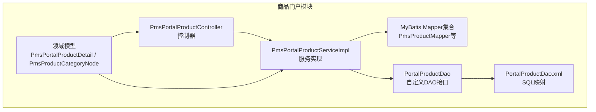
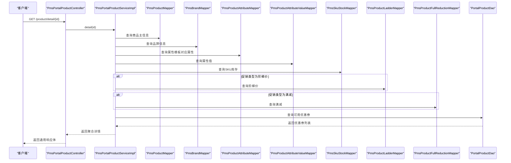
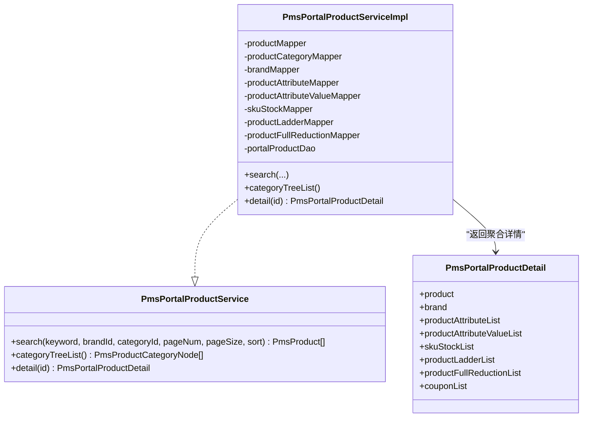
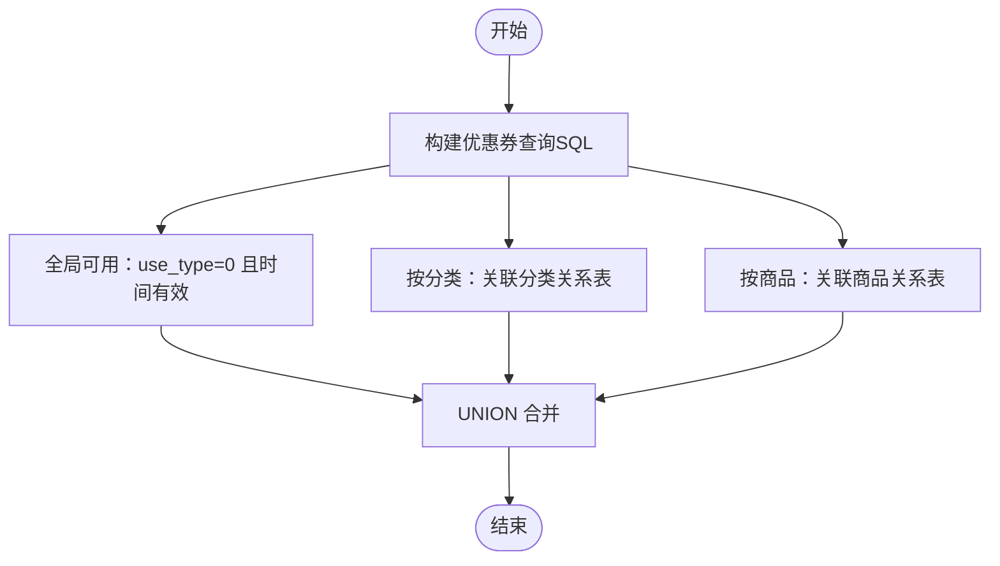
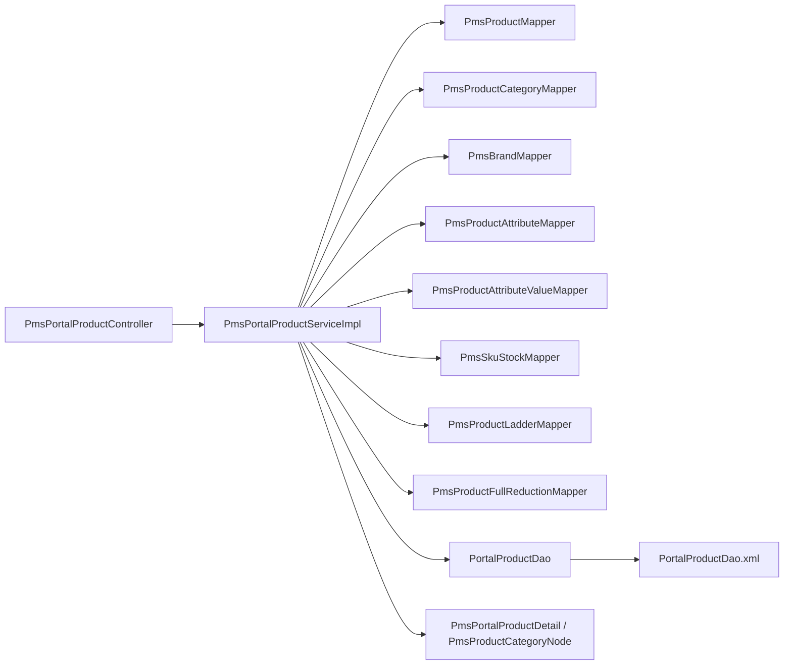

# 商品门户服务

<cite>
**本文引用的文件**
- [PmsPortalProductController.java](file://mall-portal/src/main/java/com/macro/mall/portal/controller/PmsPortalProductController.java)
- [PmsPortalProductService.java](file://mall-portal/src/main/java/com/macro/mall/portal/service/PmsPortalProductService.java)
- [PmsPortalProductServiceImpl.java](file://mall-portal/src/main/java/com/macro/mall/portal/service/impl/PmsPortalProductServiceImpl.java)
- [PmsPortalProductDetail.java](file://mall-portal/src/main/java/com/macro/mall/portal/domain/PmsPortalProductDetail.java)
- [PmsProductCategoryNode.java](file://mall-portal/src/main/java/com/macro/mall/portal/domain/PmsProductCategoryNode.java)
- [PortalProductDao.java](file://mall-portal/src/main/java/com/macro/mall/portal/dao/PortalProductDao.java)
- [PortalProductDao.xml](file://mall-portal/src/main/resources/dao/PortalProductDao.xml)
- [PmsProductMapper.java](file://mall-mbg/src/main/java/com/macro/mall/mapper/PmsProductMapper.java)
- [PmsProductCategoryMapper.java](file://mall-mbg/src/main/java/com/macro/mall/mapper/PmsProductCategoryMapper.java)
- [PmsBrandMapper.java](file://mall-mbg/src/main/java/com/macro/mall/mapper/PmsBrandMapper.java)
- [PmsProductAttributeMapper.java](file://mall-mbg/src/main/java/com/macro/mall/mapper/PmsProductAttributeMapper.java)
- [PmsProductAttributeValueMapper.java](file://mall-mbg/src/main/java/com/macro/mall/mapper/PmsProductAttributeValueMapper.java)
- [PmsSkuStockMapper.java](file://mall-mbg/src/main/java/com/macro/mall/mapper/PmsSkuStockMapper.java)
- [PmsProductLadderMapper.java](file://mall-mbg/src/main/java/com/macro/mall/mapper/PmsProductLadderMapper.java)
- [PmsProductFullReductionMapper.java](file://mall-mbg/src/main/java/com/macro/mall/mapper/PmsProductFullReductionMapper.java)
- [CommonResult.java](file://mall-common/src/main/java/com/macro/mall/common/api/CommonResult.java)
- [CommonPage.java](file://mall-common/src/main/java/com/macro/mall/common/api/CommonPage.java)
</cite>

## 目录
1. [简介](#简介)
2. [项目结构](#项目结构)
3. [核心组件](#核心组件)
4. [架构总览](#架构总览)
5. [详细组件分析](#详细组件分析)
6. [依赖分析](#依赖分析)
7. [性能考虑](#性能考虑)
8. [故障排查指南](#故障排查指南)
9. [结论](#结论)
10. [附录：接口文档与集成示例](#附录接口文档与集成示例)

## 简介
本文件面向“商品门户服务”，系统性梳理商品详情展示、商品搜索、商品分类筛选、价格比较等核心能力。重点覆盖以下内容：
- PmsPortalProductController 的 API 设计与参数说明
- PmsPortalProductServiceImpl 的业务逻辑实现（商品信息聚合、库存查询、价格计算）
- 商品缓存策略与性能优化建议
- 完整的接口文档与集成示例路径

## 项目结构
商品门户模块位于 mall-portal，采用典型的分层架构：
- 控制器层：对外暴露 REST 接口
- 服务层：封装业务逻辑，协调多个 Mapper/DAO
- 领域模型：用于前端展示的数据聚合载体
- DAO/XML：复杂联表查询与优惠券可用性计算

图表来源
- [PmsPortalProductController.java:1-54](file://mall-portal/src/main/java/com/macro/mall/portal/controller/PmsPortalProductController.java#L1-L54)
- [PmsPortalProductServiceImpl.java:1-145](file://mall-portal/src/main/java/com/macro/mall/portal/service/impl/PmsPortalProductServiceImpl.java#L1-L145)
- [PortalProductDao.java:1-30](file://mall-portal/src/main/java/com/macro/mall/portal/dao/PortalProductDao.java#L1-L30)
- [PortalProductDao.xml:1-102](file://mall-portal/src/main/resources/dao/PortalProductDao.xml#L1-L102)

章节来源
- [PmsPortalProductController.java:1-54](file://mall-portal/src/main/java/com/macro/mall/portal/controller/PmsPortalProductController.java#L1-L54)
- [PmsPortalProductServiceImpl.java:1-145](file://mall-portal/src/main/java/com/macro/mall/portal/service/impl/PmsPortalProductServiceImpl.java#L1-L145)
- [PortalProductDao.java:1-30](file://mall-portal/src/main/java/com/macro/mall/portal/dao/PortalProductDao.java#L1-L30)
- [PortalProductDao.xml:1-102](file://mall-portal/src/main/resources/dao/PortalProductDao.xml#L1-L102)

## 核心组件
- 控制器：提供商品搜索、分类树、商品详情三个接口，统一返回包装结果与分页结构
- 服务实现：负责条件构建、排序规则、树形分类转换、详情聚合（商品、品牌、属性、SKU、促销价、可用优惠券）
- 领域模型：PmsPortalProductDetail 聚合商品主体、品牌、属性、SKU、阶梯价、满减、可用优惠券
- 自定义DAO：提供购物车商品、促销商品列表、可用优惠券等复杂查询

章节来源
- [PmsPortalProductController.java:28-52](file://mall-portal/src/main/java/com/macro/mall/portal/controller/PmsPortalProductController.java#L28-L52)
- [PmsPortalProductService.java:13-28](file://mall-portal/src/main/java/com/macro/mall/portal/service/PmsPortalProductService.java#L13-L28)
- [PmsPortalProductServiceImpl.java:44-129](file://mall-portal/src/main/java/com/macro/mall/portal/service/impl/PmsPortalProductServiceImpl.java#L44-L129)
- [PmsPortalProductDetail.java:13-24](file://mall-portal/src/main/java/com/macro/mall/portal/domain/PmsPortalProductDetail.java#L13-L24)
- [PortalProductDao.java:14-28](file://mall-portal/src/main/java/com/macro/mall/portal/dao/PortalProductDao.java#L14-L28)

## 架构总览
商品门户服务遵循“控制器-服务-数据访问”的分层设计，服务层通过多个 Mapper 和自定义 DAO 汇聚商品详情所需数据，并在 SQL 层完成优惠券可用性合并查询。

图表来源
- [PmsPortalProductController.java:47-52](file://mall-portal/src/main/java/com/macro/mall/portal/controller/PmsPortalProductController.java#L47-L52)
- [PmsPortalProductServiceImpl.java:84-129](file://mall-portal/src/main/java/com/macro/mall/portal/service/impl/PmsPortalProductServiceImpl.java#L84-L129)
- [PortalProductDao.java:25-28](file://mall-portal/src/main/java/com/macro/mall/portal/dao/PortalProductDao.java#L25-L28)
- [PortalProductDao.xml:75-101](file://mall-portal/src/main/resources/dao/PortalProductDao.xml#L75-L101)

## 详细组件分析

### 控制器：PmsPortalProductController
- 接口概览
  - GET /product/search：综合搜索商品，支持关键词、品牌、分类、分页、排序
  - GET /product/categoryTreeList：获取树形分类列表
  - GET /product/detail/{id}：根据 ID 获取商品详情
- 关键点
  - 使用通用响应包装与分页工具返回
  - 参数校验与默认值处理由方法签名与注解完成

章节来源
- [PmsPortalProductController.java:28-52](file://mall-portal/src/main/java/com/macro/mall/portal/controller/PmsPortalProductController.java#L28-L52)
- [CommonResult.java](file://mall-common/src/main/java/com/macro/mall/common/api/CommonResult.java)
- [CommonPage.java](file://mall-common/src/main/java/com/macro/mall/common/api/CommonPage.java)

### 服务接口与实现：PmsPortalProductService 与 PmsPortalProductServiceImpl
- 服务接口职责
  - search：综合搜索，支持多条件与多种排序
  - categoryTreeList：生成树形分类
  - detail：聚合商品详情
- 实现要点
  - 分页：使用分页助手控制页码与大小
  - 过滤：删除状态、发布状态、关键词、品牌、分类
  - 排序：按新品、销量、价格升序/降序
  - 详情聚合：品牌、属性、属性值、SKU、阶梯价/满减、可用优惠券
  - 树形分类：基于父 ID 过滤与递归构建

图表来源
- [PmsPortalProductService.java:13-28](file://mall-portal/src/main/java/com/macro/mall/portal/service/PmsPortalProductService.java#L13-L28)
- [PmsPortalProductServiceImpl.java:24-144](file://mall-portal/src/main/java/com/macro/mall/portal/service/impl/PmsPortalProductServiceImpl.java#L24-L144)
- [PmsPortalProductDetail.java:15-24](file://mall-portal/src/main/java/com/macro/mall/portal/domain/PmsPortalProductDetail.java#L15-L24)

章节来源
- [PmsPortalProductService.java:13-28](file://mall-portal/src/main/java/com/macro/mall/portal/service/PmsPortalProductService.java#L13-L28)
- [PmsPortalProductServiceImpl.java:44-129](file://mall-portal/src/main/java/com/macro/mall/portal/service/impl/PmsPortalProductServiceImpl.java#L44-L129)

### 领域模型：PmsPortalProductDetail 与 PmsProductCategoryNode
- PmsPortalProductDetail：聚合商品主体、品牌、属性、属性值、SKU、促销价、可用优惠券
- PmsProductCategoryNode：继承分类实体并扩展 children 字段，用于树形结构

章节来源
- [PmsPortalProductDetail.java:13-24](file://mall-portal/src/main/java/com/macro/mall/portal/domain/PmsPortalProductDetail.java#L13-L24)
- [PmsProductCategoryNode.java:13-17](file://mall-portal/src/main/java/com/macro/mall/portal/domain/PmsProductCategoryNode.java#L13-L17)

### 自定义DAO与SQL：PortalProductDao 与 PortalProductDao.xml
- 主要职责
  - getCartProduct：获取购物车商品信息（包含属性与SKU）
  - getPromotionProductList：批量获取促销商品（SKU、阶梯价、满减）
  - getAvailableCouponList：按全局、分类、商品三种维度合并查询可用优惠券
- SQL 特点
  - 使用 UNION 合并三类可用优惠券来源
  - LEFT JOIN 多表联查促销商品的 SKU、阶梯价、满减信息

图表来源
- [PortalProductDao.xml:75-101](file://mall-portal/src/main/resources/dao/PortalProductDao.xml#L75-L101)

章节来源
- [PortalProductDao.java:14-28](file://mall-portal/src/main/java/com/macro/mall/portal/dao/PortalProductDao.java#L14-L28)
- [PortalProductDao.xml:1-102](file://mall-portal/src/main/resources/dao/PortalProductDao.xml#L1-L102)

## 依赖分析
- 控制器依赖服务接口
- 服务实现依赖多个 Mapper 与自定义 DAO
- 自定义 DAO 通过 XML 映射执行复杂 SQL
- 领域模型作为输入输出载体

图表来源
- [PmsPortalProductController.java:25-26](file://mall-portal/src/main/java/com/macro/mall/portal/controller/PmsPortalProductController.java#L25-L26)
- [PmsPortalProductServiceImpl.java:25-42](file://mall-portal/src/main/java/com/macro/mall/portal/service/impl/PmsPortalProductServiceImpl.java#L25-L42)
- [PortalProductDao.java:14-28](file://mall-portal/src/main/java/com/macro/mall/portal/dao/PortalProductDao.java#L14-L28)
- [PortalProductDao.xml:1-102](file://mall-portal/src/main/resources/dao/PortalProductDao.xml#L1-L102)

章节来源
- [PmsPortalProductController.java:25-26](file://mall-portal/src/main/java/com/macro/mall/portal/controller/PmsPortalProductController.java#L25-L26)
- [PmsPortalProductServiceImpl.java:25-42](file://mall-portal/src/main/java/com/macro/mall/portal/service/impl/PmsPortalProductServiceImpl.java#L25-L42)

## 性能考虑
- 分页与排序
  - 使用分页助手限制查询范围，避免一次性加载全量数据
  - 排序字段建议建立索引（如 id、sale、price），减少排序开销
- 关联查询优化
  - 详情聚合涉及多表 JOIN，建议对关联键（品牌、属性、SKU）建立索引
  - 优惠券查询使用 UNION，需确保各子查询的过滤列有索引
- 缓存策略（建议）
  - 商品详情：可按商品 ID 缓存聚合结果，设置合理过期时间
  - 分类树：可缓存树结构，定期刷新
  - 优惠券列表：按商品/分类维度缓存，结合业务更新事件失效
- 并发与一致性
  - 缓存读写分离，写操作先更新数据库再失效缓存
  - 对于价格敏感场景，可在缓存中保留价格版本号或时间戳

## 故障排查指南
- 常见问题
  - 详情为空：确认商品 ID 是否存在、是否已发布、未删除
  - 优惠券不可用：检查当前时间是否在有效期内、分类/商品维度是否匹配
  - 分页异常：检查 pageNum/pageSize 合法性与数据库记录数
- 排查步骤
  - 核对请求参数与默认值
  - 查看服务日志与 SQL 执行计划
  - 验证索引是否存在及生效
  - 检查缓存命中情况与过期时间
- 参考实现位置
  - 控制器返回包装与分页：[PmsPortalProductController.java:28-52](file://mall-portal/src/main/java/com/macro/mall/portal/controller/PmsPortalProductController.java#L28-L52)
  - 详情聚合逻辑：[PmsPortalProductServiceImpl.java:84-129](file://mall-portal/src/main/java/com/macro/mall/portal/service/impl/PmsPortalProductServiceImpl.java#L84-L129)
  - 优惠券查询 SQL：[PortalProductDao.xml:75-101](file://mall-portal/src/main/resources/dao/PortalProductDao.xml#L75-L101)

章节来源
- [PmsPortalProductController.java:28-52](file://mall-portal/src/main/java/com/macro/mall/portal/controller/PmsPortalProductController.java#L28-L52)
- [PmsPortalProductServiceImpl.java:84-129](file://mall-portal/src/main/java/com/macro/mall/portal/service/impl/PmsPortalProductServiceImpl.java#L84-L129)
- [PortalProductDao.xml:75-101](file://mall-portal/src/main/resources/dao/PortalProductDao.xml#L75-L101)

## 结论
商品门户服务通过清晰的分层设计与聚合查询，实现了商品搜索、分类树、详情展示与价格比较等核心能力。建议在现有基础上引入缓存与索引优化，进一步提升性能与用户体验。

## 附录：接口文档与集成示例

### 接口清单
- 获取商品详情
  - 方法：GET
  - 路径：/product/detail/{id}
  - 请求参数：id（路径变量）
  - 返回：通用响应体，data 为 PmsPortalProductDetail
  - 参考实现：[PmsPortalProductController.java:47-52](file://mall-portal/src/main/java/com/macro/mall/portal/controller/PmsPortalProductController.java#L47-L52)，[PmsPortalProductServiceImpl.java:84-129](file://mall-portal/src/main/java/com/macro/mall/portal/service/impl/PmsPortalProductServiceImpl.java#L84-L129)
- 综合搜索商品
  - 方法：GET
  - 路径：/product/search
  - 请求参数：
    - keyword：关键词（可选）
    - brandId：品牌 ID（可选）
    - productCategoryId：分类 ID（可选）
    - pageNum：页码，默认 0
    - pageSize：每页数量，默认 5
    - sort：排序方式，1 新品，2 销量，3 价格升序，4 价格降序
  - 返回：通用响应体，data 为分页包装后的商品列表
  - 参考实现：[PmsPortalProductController.java:28-38](file://mall-portal/src/main/java/com/macro/mall/portal/controller/PmsPortalProductController.java#L28-L38)，[PmsPortalProductServiceImpl.java:44-71](file://mall-portal/src/main/java/com/macro/mall/portal/service/impl/PmsPortalProductServiceImpl.java#L44-L71)
- 获取分类树
  - 方法：GET
  - 路径：/product/categoryTreeList
  - 请求参数：无
  - 返回：通用响应体，data 为树形分类列表
  - 参考实现：[PmsPortalProductController.java:40-45](file://mall-portal/src/main/java/com/macro/mall/portal/controller/PmsPortalProductController.java#L40-L45)，[PmsPortalProductServiceImpl.java:73-82](file://mall-portal/src/main/java/com/macro/mall/portal/service/impl/PmsPortalProductServiceImpl.java#L73-L82)

### 数据模型说明
- PmsPortalProductDetail：包含商品主体、品牌、属性、属性值、SKU、阶梯价、满减、可用优惠券
  - 参考定义：[PmsPortalProductDetail.java:15-24](file://mall-portal/src/main/java/com/macro/mall/portal/domain/PmsPortalProductDetail.java#L15-L24)
- PmsProductCategoryNode：继承分类实体并扩展 children 字段
  - 参考定义：[PmsProductCategoryNode.java:15-17](file://mall-portal/src/main/java/com/macro/mall/portal/domain/PmsProductCategoryNode.java#L15-L17)

### 集成示例（路径参考）
- 控制器层调用服务层：[PmsPortalProductController.java:28-52](file://mall-portal/src/main/java/com/macro/mall/portal/controller/PmsPortalProductController.java#L28-L52)
- 服务层聚合详情：[PmsPortalProductServiceImpl.java:84-129](file://mall-portal/src/main/java/com/macro/mall/portal/service/impl/PmsPortalProductServiceImpl.java#L84-L129)
- 优惠券可用性查询 SQL：[PortalProductDao.xml:75-101](file://mall-portal/src/main/resources/dao/PortalProductDao.xml#L75-L101)