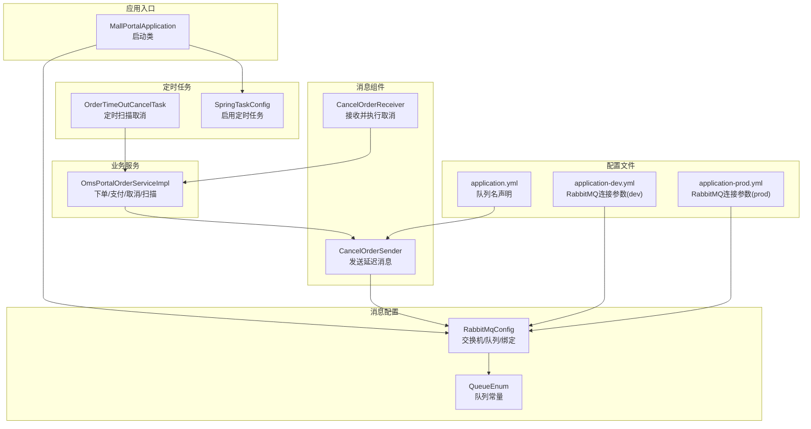
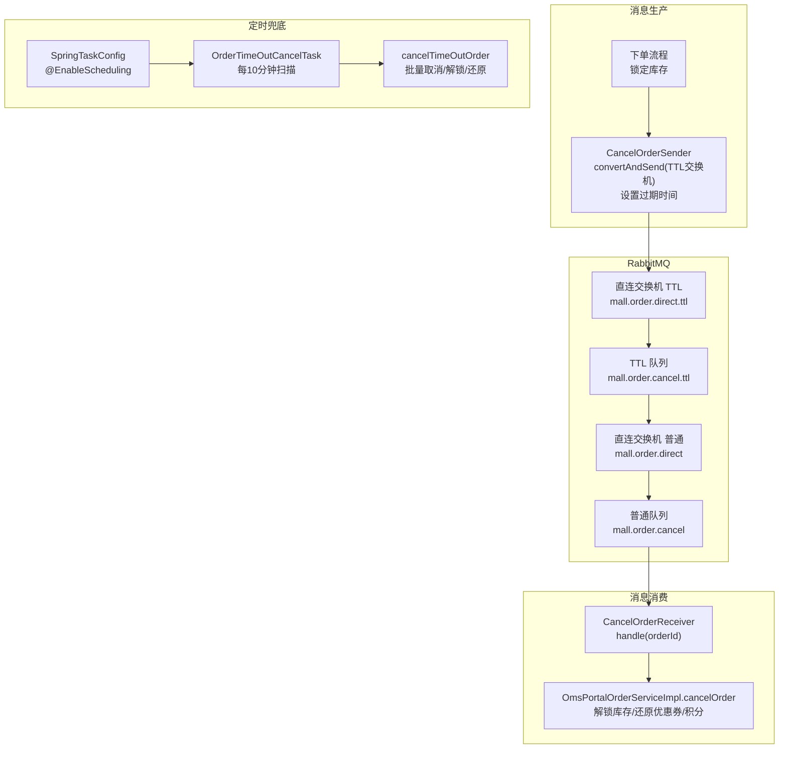
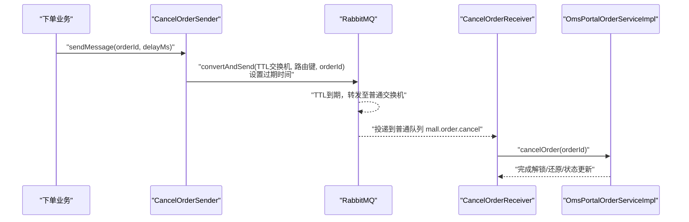
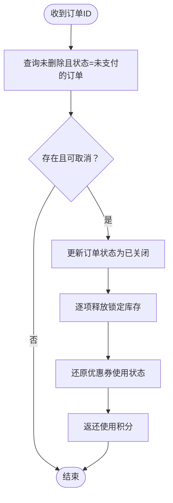
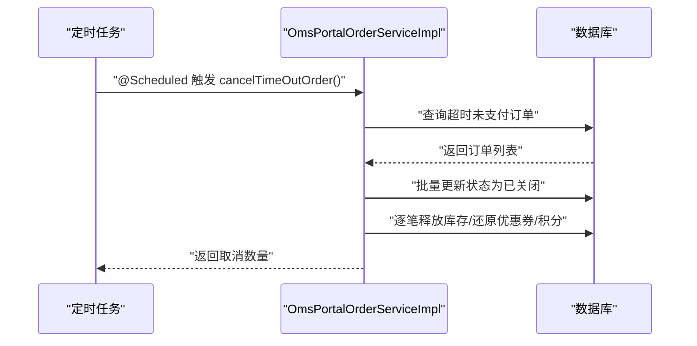
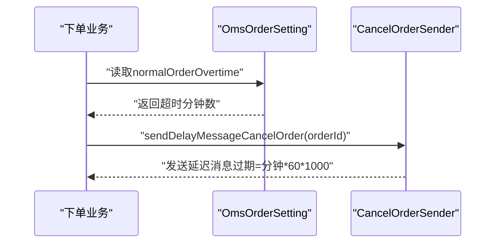
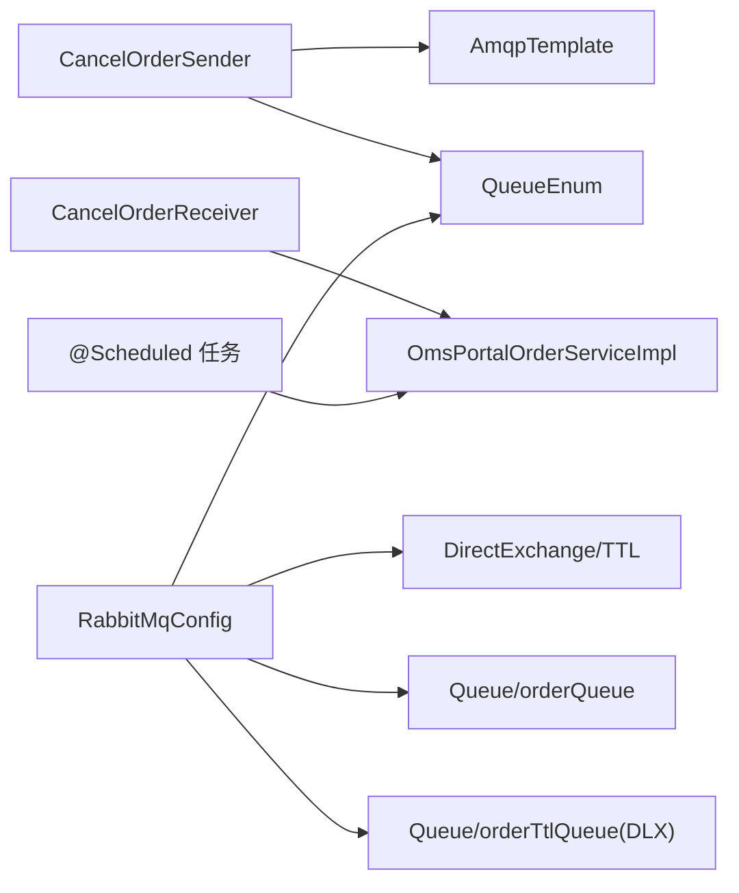

# 异步任务处理

<cite>
**本文引用的文件**
- [CancelOrderSender.java](file://mall-portal/src/main/java/com/macro/mall/portal/component/CancelOrderSender.java)
- [CancelOrderReceiver.java](file://mall-portal/src/main/java/com/macro/mall/portal/component/CancelOrderReceiver.java)
- [RabbitMqConfig.java](file://mall-portal/src/main/java/com/macro/mall/portal/config/RabbitMqConfig.java)
- [QueueEnum.java](file://mall-portal/src/main/java/com/macro/mall/portal/domain/QueueEnum.java)
- [OmsPortalOrderServiceImpl.java](file://mall-portal/src/main/java/com/macro/mall/portal/service/impl/OmsPortalOrderServiceImpl.java)
- [OrderTimeOutCancelTask.java](file://mall-portal/src/main/java/com/macro/mall/portal/component/OrderTimeOutCancelTask.java)
- [SpringTaskConfig.java](file://mall-portal/src/main/java/com/macro/mall/portal/config/SpringTaskConfig.java)
- [application.yml](file://mall-portal/src/main/resources/application.yml)
- [application-dev.yml](file://mall-portal/src/main/resources/application-dev.yml)
- [application-prod.yml](file://mall-portal/src/main/resources/application-prod.yml)
- [MallPortalApplication.java](file://mall-portal/src/main/java/com/macro/mall/portal/MallPortalApplication.java)
- [OmsOrderSetting.java](file://mall-mbg/src/main/java/com/macro/mall/model/OmsOrderSetting.java)
</cite>

## 目录
1. [简介](#简介)
2. [项目结构](#项目结构)
3. [核心组件](#核心组件)
4. [架构总览](#架构总览)
5. [详细组件分析](#详细组件分析)
6. [依赖分析](#依赖分析)
7. [性能考虑](#性能考虑)
8. [故障排查指南](#故障排查指南)
9. [结论](#结论)
10. [附录](#附录)

## 简介
本文件系统性梳理 mall 项目的异步任务处理能力，重点覆盖以下方面：
- 订单超时取消的双轨机制：基于 RabbitMQ 延迟队列的消息驱动取消与基于 Spring Task 的定时轮询清理
- 消息队列集成：交换机、队列、死信路由的配置与使用
- 可靠性保障：消息发送与接收的幂等、失败重试与死信兜底
- 实践指南：RabbitMQ 与应用配置、部署与运维要点

## 项目结构
围绕异步任务处理的相关模块分布于 mall-portal 子工程，关键文件如下：
- 组件层：消息发送与接收、定时任务
- 配置层：RabbitMQ 交换机与队列绑定、Spring Task 启用
- 服务层：订单业务逻辑，包含库存锁定、解锁、优惠券与积分处理
- 配置文件：应用与 RabbitMQ 连接参数

图表来源
- [MallPortalApplication.java:1-14](file://mall-portal/src/main/java/com/macro/mall/portal/MallPortalApplication.java#L1-L14)
- [RabbitMqConfig.java:1-80](file://mall-portal/src/main/java/com/macro/mall/portal/config/RabbitMqConfig.java#L1-L80)
- [QueueEnum.java:1-39](file://mall-portal/src/main/java/com/macro/mall/portal/domain/QueueEnum.java#L1-L39)
- [CancelOrderSender.java:1-35](file://mall-portal/src/main/java/com/macro/mall/portal/component/CancelOrderSender.java#L1-L35)
- [CancelOrderReceiver.java:1-26](file://mall-portal/src/main/java/com/macro/mall/portal/component/CancelOrderReceiver.java#L1-L26)
- [OrderTimeOutCancelTask.java:1-30](file://mall-portal/src/main/java/com/macro/mall/portal/component/OrderTimeOutCancelTask.java#L1-L30)
- [SpringTaskConfig.java:1-13](file://mall-portal/src/main/java/com/macro/mall/portal/config/SpringTaskConfig.java#L1-L13)
- [OmsPortalOrderServiceImpl.java:1-795](file://mall-portal/src/main/java/com/macro/mall/portal/service/impl/OmsPortalOrderServiceImpl.java#L1-L795)
- [application.yml:58-64](file://mall-portal/src/main/resources/application.yml#L58-L64)
- [application-dev.yml:29-35](file://mall-portal/src/main/resources/application-dev.yml#L29-L35)
- [application-prod.yml:32-38](file://mall-portal/src/main/resources/application-prod.yml#L32-L38)

章节来源
- [MallPortalApplication.java:1-14](file://mall-portal/src/main/java/com/macro/mall/portal/MallPortalApplication.java#L1-L14)
- [RabbitMqConfig.java:1-80](file://mall-portal/src/main/java/com/macro/mall/portal/config/RabbitMqConfig.java#L1-L80)
- [application.yml:58-64](file://mall-portal/src/main/resources/application.yml#L58-L64)

## 核心组件
- 消息发送方 CancelOrderSender：向延迟队列发送带过期时间的消息，触发后续取消流程
- 消息接收方 CancelOrderReceiver：监听实际消费队列，调用服务执行取消、解锁库存、还原优惠券与积分
- 定时任务 OrderTimeOutCancelTask：周期性扫描超时未支付订单，执行取消与资源释放
- RabbitMQ 配置 RabbitMqConfig：定义两个直连交换机、一个普通队列与一个 TTL 死信队列，形成“延迟消息”链路
- 业务服务 OmsPortalOrderServiceImpl：下单时锁定库存、下单后发送延迟取消消息；取消与扫描取消均负责解锁库存、还原优惠券与积分

章节来源
- [CancelOrderSender.java:1-35](file://mall-portal/src/main/java/com/macro/mall/portal/component/CancelOrderSender.java#L1-L35)
- [CancelOrderReceiver.java:1-26](file://mall-portal/src/main/java/com/macro/mall/portal/component/CancelOrderReceiver.java#L1-L26)
- [OrderTimeOutCancelTask.java:1-30](file://mall-portal/src/main/java/com/macro/mall/portal/component/OrderTimeOutCancelTask.java#L1-L30)
- [RabbitMqConfig.java:1-80](file://mall-portal/src/main/java/com/macro/mall/portal/config/RabbitMqConfig.java#L1-L80)
- [OmsPortalOrderServiceImpl.java:285-357](file://mall-portal/src/main/java/com/macro/mall/portal/service/impl/OmsPortalOrderServiceImpl.java#L285-L357)

## 架构总览
异步取消采用“延迟队列 + 死信交换机”的经典模式，结合定时任务作为兜底，确保订单在超时未支付时被可靠取消。

图表来源
- [RabbitMqConfig.java:18-77](file://mall-portal/src/main/java/com/macro/mall/portal/config/RabbitMqConfig.java#L18-L77)
- [CancelOrderSender.java:23-34](file://mall-portal/src/main/java/com/macro/mall/portal/component/CancelOrderSender.java#L23-L34)
- [CancelOrderReceiver.java:16-25](file://mall-portal/src/main/java/com/macro/mall/portal/component/CancelOrderReceiver.java#L16-L25)
- [OmsPortalOrderServiceImpl.java:314-348](file://mall-portal/src/main/java/com/macro/mall/portal/service/impl/OmsPortalOrderServiceImpl.java#L314-L348)
- [OrderTimeOutCancelTask.java:24-28](file://mall-portal/src/main/java/com/macro/mall/portal/component/OrderTimeOutCancelTask.java#L24-L28)
- [SpringTaskConfig.java:10-12](file://mall-portal/src/main/java/com/macro/mall/portal/config/SpringTaskConfig.java#L10-L12)

## 详细组件分析

### 消息发送机制与 RabbitMQ 配置
- 发送端 CancelOrderSender
  - 使用 AmqpTemplate.convertAndSend 将订单 ID 发送到 TTL 交换机
  - 通过 MessagePostProcessor 设置消息过期时间（毫秒），实现延迟投递
  - 日志记录发送的订单 ID，便于追踪
- RabbitMQ 配置
  - 两个直连交换机：普通交换机与 TTL 交换机，均持久化
  - 普通队列 mall.order.cancel 与 TTL 队列 mall.order.cancel.ttl
  - TTL 队列配置死信交换机与死信路由键，到期后自动转发至普通队列
  - 普通队列与 TTL 队列分别绑定到对应交换机，路由键一致
- 配置文件
  - application.yml 中声明队列名（cancelOrder），但实际使用的是 QueueEnum 中的常量名
  - application-dev.yml 与 application-prod.yml 提供 RabbitMQ 连接参数（host/port/virtual-host/username/password）

图表来源
- [CancelOrderSender.java:23-34](file://mall-portal/src/main/java/com/macro/mall/portal/component/CancelOrderSender.java#L23-L34)
- [RabbitMqConfig.java:48-77](file://mall-portal/src/main/java/com/macro/mall/portal/config/RabbitMqConfig.java#L48-L77)
- [CancelOrderReceiver.java:21-25](file://mall-portal/src/main/java/com/macro/mall/portal/component/CancelOrderReceiver.java#L21-L25)
- [OmsPortalOrderServiceImpl.java:314-348](file://mall-portal/src/main/java/com/macro/mall/portal/service/impl/OmsPortalOrderServiceImpl.java#L314-L348)

章节来源
- [CancelOrderSender.java:1-35](file://mall-portal/src/main/java/com/macro/mall/portal/component/CancelOrderSender.java#L1-L35)
- [RabbitMqConfig.java:1-80](file://mall-portal/src/main/java/com/macro/mall/portal/config/RabbitMqConfig.java#L1-L80)
- [application.yml:58-64](file://mall-portal/src/main/resources/application.yml#L58-L64)
- [application-dev.yml:29-35](file://mall-portal/src/main/resources/application-dev.yml#L29-L35)
- [application-prod.yml:32-38](file://mall-portal/src/main/resources/application-prod.yml#L32-L38)

### 消息接收与取消处理逻辑
- 接收器 CancelOrderReceiver
  - 监听普通队列 mall.order.cancel
  - 收到订单 ID 后调用服务 cancelOrder 执行取消
- 服务端 OmsPortalOrderServiceImpl.cancelOrder
  - 条件检查：仅对未删除且状态为“未支付”的订单执行取消
  - 状态变更：将订单状态置为“已关闭”
  - 库存处理：按订单项逐个释放锁定库存
  - 优惠券处理：将对应优惠券历史记录的使用状态置为未使用
  - 积分处理：若使用了积分，则返还相应积分
- 关键点
  - 取消前的状态校验避免误操作
  - 逐项释放库存，失败时通过断言抛出异常，保证一致性
  - 优惠券与积分的还原逻辑清晰、可追溯

图表来源
- [CancelOrderReceiver.java:21-25](file://mall-portal/src/main/java/com/macro/mall/portal/component/CancelOrderReceiver.java#L21-L25)
- [OmsPortalOrderServiceImpl.java:314-348](file://mall-portal/src/main/java/com/macro/mall/portal/service/impl/OmsPortalOrderServiceImpl.java#L314-L348)

章节来源
- [CancelOrderReceiver.java:1-26](file://mall-portal/src/main/java/com/macro/mall/portal/component/CancelOrderReceiver.java#L1-L26)
- [OmsPortalOrderServiceImpl.java:314-348](file://mall-portal/src/main/java/com/macro/mall/portal/service/impl/OmsPortalOrderServiceImpl.java#L314-L348)

### 定时任务与调度策略
- 启用与配置
  - SpringTaskConfig 启用 @Scheduled 注解
  - OrderTimeOutCancelTask 定义每 10 分钟扫描一次的 cron 表达式
- 扫描与处理
  - 读取订单超时设置（分钟），查询超时未支付订单
  - 批量更新状态为“已关闭”，逐笔释放锁定库存、还原优惠券与积分
- 作用
  - 作为消息延迟队列的兜底：即使消息丢失或异常，仍能通过定时任务清理
  - 降低峰值压力：将实时取消与周期性清理分离

图表来源
- [SpringTaskConfig.java:10-12](file://mall-portal/src/main/java/com/macro/mall/portal/config/SpringTaskConfig.java#L10-L12)
- [OrderTimeOutCancelTask.java:24-28](file://mall-portal/src/main/java/com/macro/mall/portal/component/OrderTimeOutCancelTask.java#L24-L28)
- [OmsPortalOrderServiceImpl.java:285-312](file://mall-portal/src/main/java/com/macro/mall/portal/service/impl/OmsPortalOrderServiceImpl.java#L285-L312)

章节来源
- [SpringTaskConfig.java:1-13](file://mall-portal/src/main/java/com/macro/mall/portal/config/SpringTaskConfig.java#L1-L13)
- [OrderTimeOutCancelTask.java:1-30](file://mall-portal/src/main/java/com/macro/mall/portal/component/OrderTimeOutCancelTask.java#L1-L30)
- [OmsPortalOrderServiceImpl.java:285-312](file://mall-portal/src/main/java/com/macro/mall/portal/service/impl/OmsPortalOrderServiceImpl.java#L285-L312)

### 下单流程中的延迟消息发送
- 下单成功后立即发送延迟取消消息
- 延迟时长来自订单设置表的“普通订单超时时间”字段（分钟 → 毫秒）
- 该流程与库存锁定、优惠券与积分处理同属下单事务的一部分，确保一致性边界清晰

图表来源
- [OmsPortalOrderServiceImpl.java:350-357](file://mall-portal/src/main/java/com/macro/mall/portal/service/impl/OmsPortalOrderServiceImpl.java#L350-L357)
- [OmsOrderSetting.java:60-84](file://mall-mbg/src/main/java/com/macro/mall/model/OmsOrderSetting.java#L60-L84)
- [CancelOrderSender.java:23-34](file://mall-portal/src/main/java/com/macro/mall/portal/component/CancelOrderSender.java#L23-L34)

章节来源
- [OmsPortalOrderServiceImpl.java:350-357](file://mall-portal/src/main/java/com/macro/mall/portal/service/impl/OmsPortalOrderServiceImpl.java#L350-L357)
- [OmsOrderSetting.java:60-84](file://mall-mbg/src/main/java/com/macro/mall/model/OmsOrderSetting.java#L60-L84)

## 依赖分析
- 组件耦合
  - CancelOrderSender 依赖 AmqpTemplate 与 QueueEnum
  - CancelOrderReceiver 依赖 OmsPortalOrderService
  - OrderTimeOutCancelTask 依赖 OmsPortalOrderService
  - RabbitMqConfig 依赖 QueueEnum，定义交换机、队列与绑定
- 外部依赖
  - RabbitMQ：直连交换机、TTL 队列、死信路由
  - Spring Task：@Scheduled 与 @EnableScheduling
  - 数据库：订单、订单项、订单设置、优惠券历史、会员积分

图表来源
- [CancelOrderSender.java:18-21](file://mall-portal/src/main/java/com/macro/mall/portal/component/CancelOrderSender.java#L18-L21)
- [CancelOrderReceiver.java:18-20](file://mall-portal/src/main/java/com/macro/mall/portal/component/CancelOrderReceiver.java#L18-L20)
- [OrderTimeOutCancelTask.java:16-18](file://mall-portal/src/main/java/com/macro/mall/portal/component/OrderTimeOutCancelTask.java#L16-L18)
- [RabbitMqConfig.java:18-77](file://mall-portal/src/main/java/com/macro/mall/portal/config/RabbitMqConfig.java#L18-L77)
- [QueueEnum.java:10-18](file://mall-portal/src/main/java/com/macro/mall/portal/domain/QueueEnum.java#L10-L18)

章节来源
- [RabbitMqConfig.java:1-80](file://mall-portal/src/main/java/com/macro/mall/portal/config/RabbitMqConfig.java#L1-L80)
- [QueueEnum.java:1-39](file://mall-portal/src/main/java/com/macro/mall/portal/domain/QueueEnum.java#L1-L39)

## 性能考虑
- 延迟消息与死信队列
  - 通过 TTL + 死信交换机实现延迟投递，避免轮询占用 CPU
  - 普通队列与 TTL 队列分离，降低争用
- 定时任务频率
  - 每 10 分钟扫描一次，兼顾及时性与资源消耗
  - 批量处理超时订单，减少数据库往返
- 库存与优惠券/积分处理
  - 逐项释放库存与还原，保证精确性
  - 若某一步骤失败，通过断言快速失败，避免部分更新

[本节为通用性能建议，无需列出章节来源]

## 故障排查指南
- 消息未到达
  - 检查 RabbitMQ 连接参数（host/port/virtual-host/username/password）与网络连通
  - 核对队列名与路由键是否与 QueueEnum 一致
  - 查看 TTL 队列到期后是否正确转发至普通队列
- 消费端未执行
  - 确认 @RabbitListener 监听的队列名与配置一致
  - 检查 CancelOrderReceiver 是否注入了正确的服务实例
  - 关注 cancelOrder 方法内的状态校验与断言日志
- 定时任务未生效
  - 确认 @EnableScheduling 已启用
  - 检查 cron 表达式是否正确
  - 关注 cancelTimeOutOrder 的日志输出
- 集成配置
  - application.yml 中声明的队列名与实际使用不一致时，可能导致消费者找不到队列
  - 开发/生产环境的 RabbitMQ 参数需与部署环境匹配

章节来源
- [application-dev.yml:29-35](file://mall-portal/src/main/resources/application-dev.yml#L29-L35)
- [application-prod.yml:32-38](file://mall-portal/src/main/resources/application-prod.yml#L32-L38)
- [application.yml:58-64](file://mall-portal/src/main/resources/application.yml#L58-L64)
- [RabbitMqConfig.java:18-77](file://mall-portal/src/main/java/com/macro/mall/portal/config/RabbitMqConfig.java#L18-L77)
- [CancelOrderReceiver.java:16-25](file://mall-portal/src/main/java/com/macro/mall/portal/component/CancelOrderReceiver.java#L16-L25)
- [OrderTimeOutCancelTask.java:24-28](file://mall-portal/src/main/java/com/macro/mall/portal/component/OrderTimeOutCancelTask.java#L24-L28)
- [SpringTaskConfig.java:10-12](file://mall-portal/src/main/java/com/macro/mall/portal/config/SpringTaskConfig.java#L10-L12)

## 结论
本项目通过“延迟队列 + 死信交换机 + 定时任务”的组合，实现了高可靠、低耦合的订单超时取消机制。消息驱动具备实时性强的优势，定时任务提供了稳健的兜底保障。配合库存锁定与优惠券/积分的精确还原，整体流程在一致性与可维护性上表现良好。

[本节为总结性内容，无需列出章节来源]

## 附录

### 消息队列集成指南（步骤清单）
- 准备 RabbitMQ 环境
  - 安装 Erlang 与 RabbitMQ
  - 启用管理插件，访问管理界面
  - 创建用户（mall/mall）与虚拟主机（/mall），授权该用户对 /mall 的权限
  - 可选：安装延迟消息插件（rabbitmq_delayed_message_exchange）
- 应用侧配置
  - 在 application-dev.yml 或 application-prod.yml 中填写 RabbitMQ 连接参数
  - 确保 QueueEnum 中的交换机、队列、路由键与 RabbitMQ 实际配置一致
  - 启用定时任务：确保 @EnableScheduling 生效
- 验证
  - 下单后应看到延迟消息发送日志
  - TTL 到期后消息应进入普通队列并被消费
  - 定时任务应按计划扫描并输出取消数量日志

章节来源
- [application-dev.yml:29-35](file://mall-portal/src/main/resources/application-dev.yml#L29-L35)
- [application-prod.yml:32-38](file://mall-portal/src/main/resources/application-prod.yml#L32-L38)
- [RabbitMqConfig.java:18-77](file://mall-portal/src/main/java/com/macro/mall/portal/config/RabbitMqConfig.java#L18-L77)
- [SpringTaskConfig.java:10-12](file://mall-portal/src/main/java/com/macro/mall/portal/config/SpringTaskConfig.java#L10-L12)