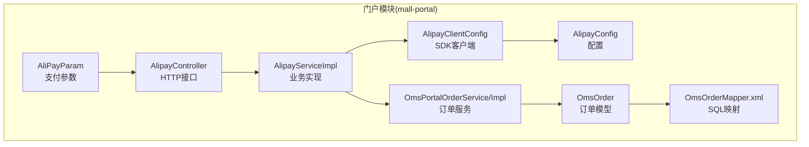
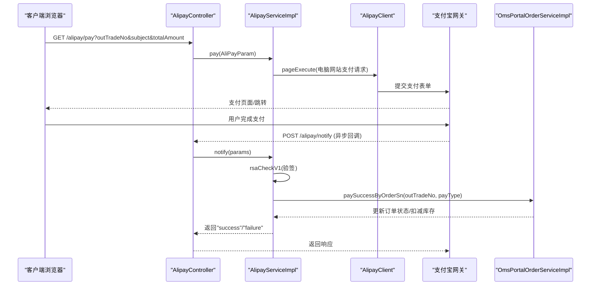
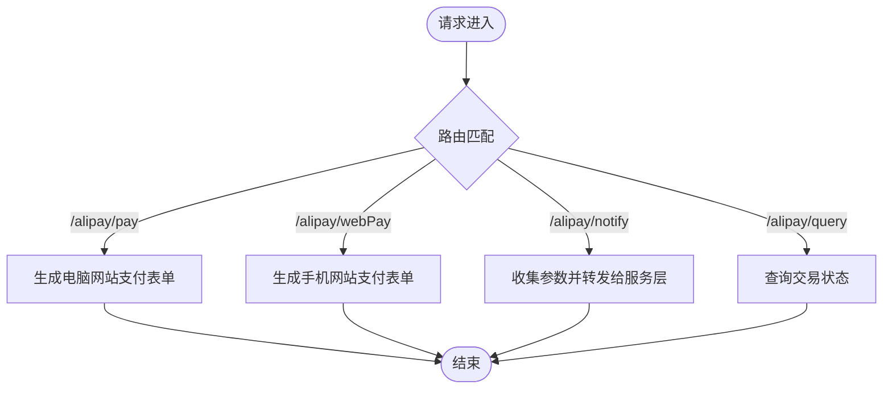
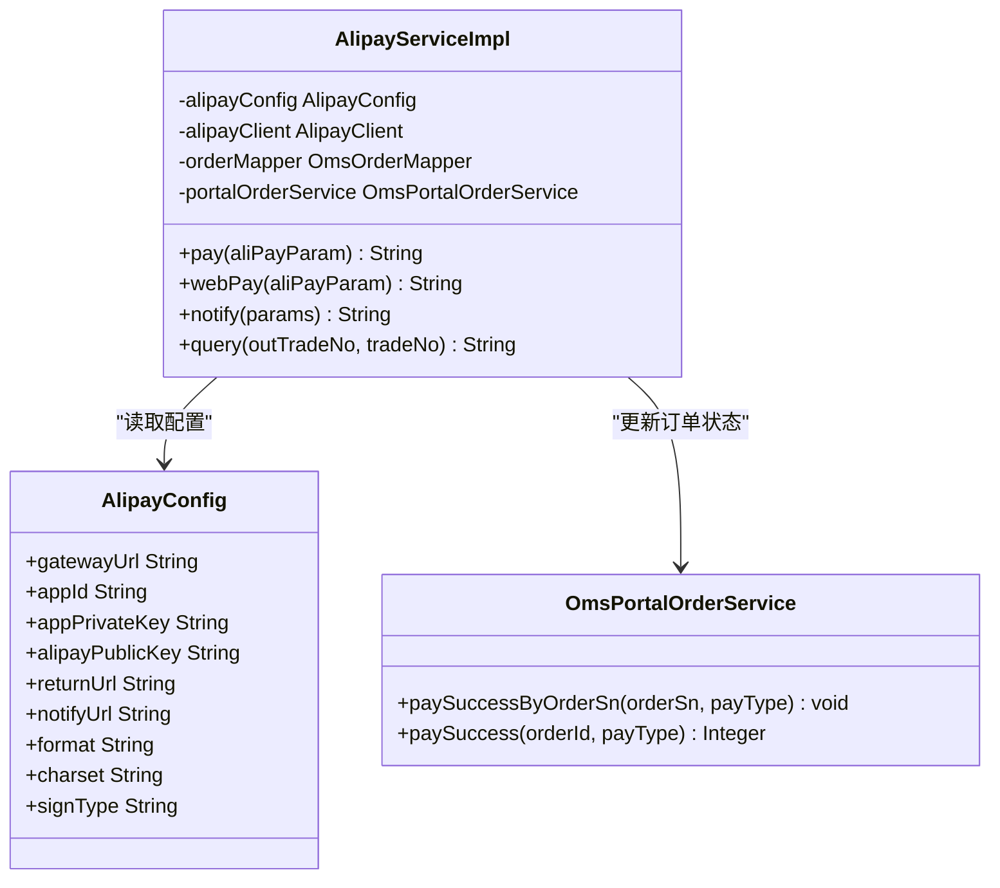
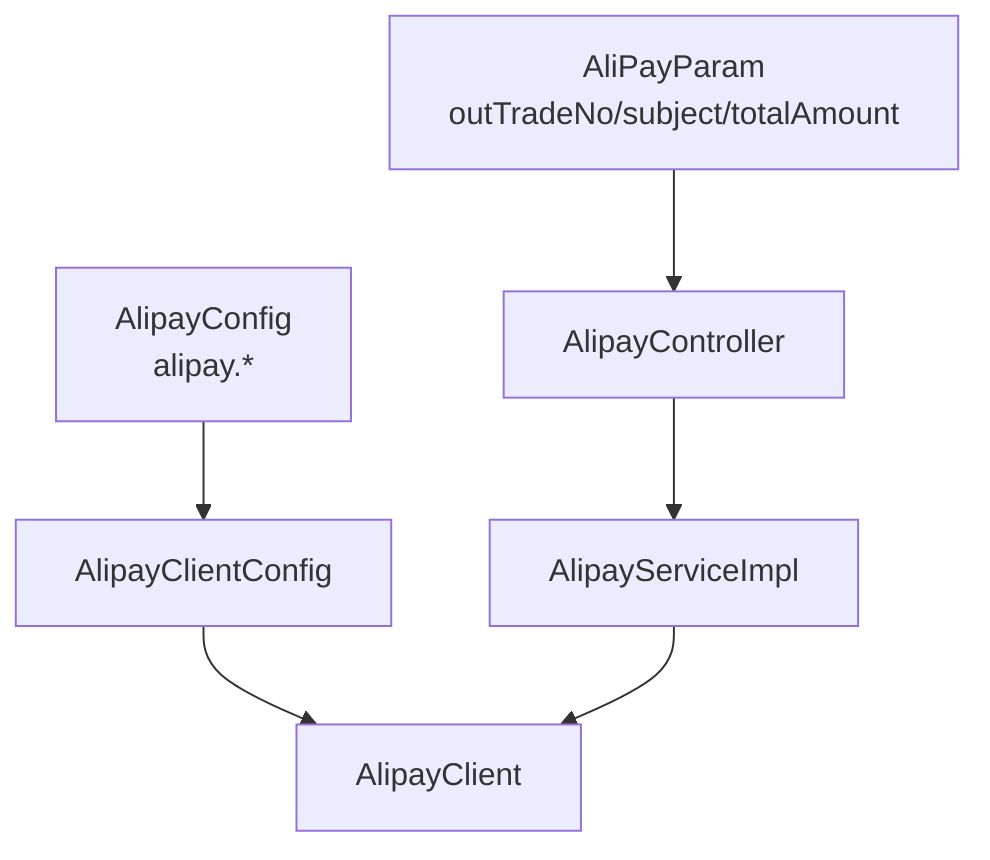
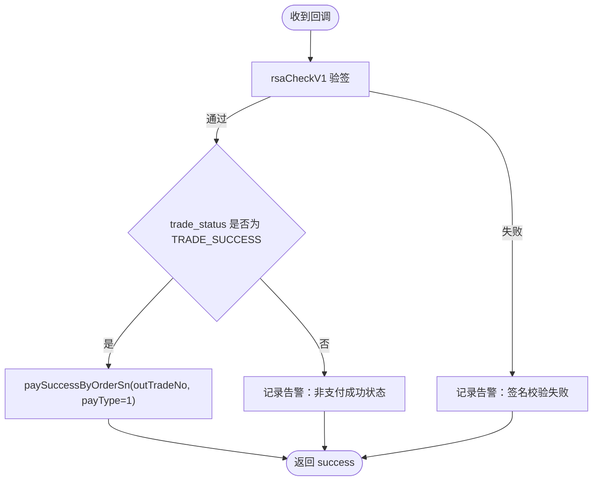
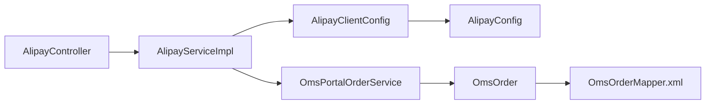

# 支付服务集成

<cite>
**本文引用的文件**
- [AlipayController.java](file://mall-portal/src/main/java/com/macro/mall/portal/controller/AlipayController.java)
- [AlipayService.java](file://mall-portal/src/main/java/com/macro/mall/portal/service/AlipayService.java)
- [AlipayServiceImpl.java](file://mall-portal/src/main/java/com/macro/mall/portal/service/impl/AlipayServiceImpl.java)
- [AlipayConfig.java](file://mall-portal/src/main/java/com/macro/mall/portal/config/AlipayConfig.java)
- [AlipayClientConfig.java](file://mall-portal/src/main/java/com/macro/mall/portal/config/AlipayClientConfig.java)
- [AliPayParam.java](file://mall-portal/src/main/java/com/macro/mall/portal/domain/AliPayParam.java)
- [application.yml](file://mall-portal/src/main/resources/application.yml)
- [application-dev.yml](file://mall-portal/src/main/resources/application-dev.yml)
- [application-prod.yml](file://mall-portal/src/main/resources/application-prod.yml)
- [OmsPortalOrderService.java](file://mall-portal/src/main/java/com/macro/mall/portal/service/OmsPortalOrderService.java)
- [OmsPortalOrderServiceImpl.java](file://mall-portal/src/main/java/com/macro/mall/portal/service/impl/OmsPortalOrderServiceImpl.java)
- [OmsOrderMapper.java](file://mall-mbg/src/main/java/com/macro/mall/mapper/OmsOrderMapper.java)
- [OmsOrderMapper.xml](file://mall-mbg/src/main/resources/com/macro/mall/mapper/OmsOrderMapper.xml)
- [OmsOrder.java](file://mall-mbg/src/main/java/com/macro/mall/model/OmsOrder.java)
</cite>

## 目录
1. [简介](#简介)
2. [项目结构](#项目结构)
3. [核心组件](#核心组件)
4. [架构总览](#架构总览)
5. [详细组件分析](#详细组件分析)
6. [依赖关系分析](#依赖关系分析)
7. [性能考量](#性能考量)
8. [故障排查指南](#故障排查指南)
9. [结论](#结论)
10. [附录](#附录)

## 简介
本技术文档围绕支付服务集成展开，重点覆盖支付宝支付在 mall-portal 模块中的完整实现，包括支付参数配置、支付请求生成、支付页面跳转、支付回调处理、支付状态查询等核心能力。文档同时阐述 AlipayController 的 API 设计与 AlipayServiceImpl 的业务逻辑实现，并给出支付安全机制与防重放攻击策略、完整的支付集成指南以及错误处理方案。

## 项目结构
支付相关代码主要集中在 mall-portal 模块，采用“控制器-服务-配置-领域模型”的分层组织：
- 控制器层：AlipayController 提供对外 HTTP 接口
- 服务层：AlipayService 接口与 AlipayServiceImpl 实现
- 配置层：AlipayConfig、AlipayClientConfig 负责支付宝 SDK 客户端与参数配置
- 领域模型：AliPayParam 封装支付请求参数
- 订单服务：OmsPortalOrderService/Impl 提供订单状态变更与库存扣减
- 数据持久化：OmsOrderMapper/Xml、OmsOrder 模型支撑订单状态与支付信息落库

图表来源
- [AlipayController.java:26-67](file://mall-portal/src/main/java/com/macro/mall/portal/controller/AlipayController.java#L26-L67)
- [AlipayServiceImpl.java:31-39](file://mall-portal/src/main/java/com/macro/mall/portal/service/impl/AlipayServiceImpl.java#L31-L39)
- [AlipayConfig.java:14-57](file://mall-portal/src/main/java/com/macro/mall/portal/config/AlipayConfig.java#L14-L57)
- [AlipayClientConfig.java:14-21](file://mall-portal/src/main/java/com/macro/mall/portal/config/AlipayClientConfig.java#L14-L21)
- [AliPayParam.java:13-27](file://mall-portal/src/main/java/com/macro/mall/portal/domain/AliPayParam.java#L13-L27)
- [OmsPortalOrderService.java:16-76](file://mall-portal/src/main/java/com/macro/mall/portal/service/OmsPortalOrderService.java#L16-L76)
- [OmsOrder.java:202-448](file://mall-mbg/src/main/java/com/macro/mall/model/OmsOrder.java#L202-L448)
- [OmsOrderMapper.xml:685-726](file://mall-mbg/src/main/resources/com/macro/mall/mapper/OmsOrderMapper.xml#L685-L726)

章节来源
- [AlipayController.java:26-67](file://mall-portal/src/main/java/com/macro/mall/portal/controller/AlipayController.java#L26-L67)
- [AlipayServiceImpl.java:31-39](file://mall-portal/src/main/java/com/macro/mall/portal/service/impl/AlipayServiceImpl.java#L31-L39)
- [AlipayConfig.java:14-57](file://mall-portal/src/main/java/com/macro/mall/portal/config/AlipayConfig.java#L14-L57)
- [AlipayClientConfig.java:14-21](file://mall-portal/src/main/java/com/macro/mall/portal/config/AlipayClientConfig.java#L14-L21)
- [AliPayParam.java:13-27](file://mall-portal/src/main/java/com/macro/mall/portal/domain/AliPayParam.java#L13-L27)
- [OmsPortalOrderService.java:16-76](file://mall-portal/src/main/java/com/macro/mall/portal/service/OmsPortalOrderService.java#L16-L76)
- [OmsOrder.java:202-448](file://mall-mbg/src/main/java/com/macro/mall/model/OmsOrder.java#L202-L448)
- [OmsOrderMapper.xml:685-726](file://mall-mbg/src/main/resources/com/macro/mall/mapper/OmsOrderMapper.xml#L685-L726)

## 核心组件
- AlipayController：提供 /alipay/pay、/alipay/webPay、/alipay/notify、/alipay/query 四个接口，分别用于生成电脑网站支付表单、生成手机网站支付表单、处理支付宝异步回调、查询交易状态。
- AlipayService：定义支付、回调、查询、移动端支付等接口。
- AlipayServiceImpl：基于支付宝 SDK 构造支付请求、执行支付、校验回调签名、触发订单状态更新、查询交易状态。
- AlipayConfig/AlipayClientConfig：封装支付宝网关、应用ID、密钥、回调地址等配置，并创建 AlipayClient。
- AliPayParam：封装 outTradeNo、subject、totalAmount 三个必填字段。
- OmsPortalOrderService/Impl：负责订单状态更新、库存扣减、按订单号回溯支付成功逻辑。
- OmsOrder/OmsOrderMapper/Xml：订单状态、支付方式、支付时间等字段持久化。

章节来源
- [AlipayController.java:26-67](file://mall-portal/src/main/java/com/macro/mall/portal/controller/AlipayController.java#L26-L67)
- [AlipayService.java:14-37](file://mall-portal/src/main/java/com/macro/mall/portal/service/AlipayService.java#L14-L37)
- [AlipayServiceImpl.java:31-162](file://mall-portal/src/main/java/com/macro/mall/portal/service/impl/AlipayServiceImpl.java#L31-L162)
- [AlipayConfig.java:14-57](file://mall-portal/src/main/java/com/macro/mall/portal/config/AlipayConfig.java#L14-L57)
- [AlipayClientConfig.java:14-21](file://mall-portal/src/main/java/com/macro/mall/portal/config/AlipayClientConfig.java#L14-L21)
- [AliPayParam.java:13-27](file://mall-portal/src/main/java/com/macro/mall/portal/domain/AliPayParam.java#L13-L27)
- [OmsPortalOrderService.java:16-76](file://mall-portal/src/main/java/com/macro/mall/portal/service/OmsPortalOrderService.java#L16-L76)
- [OmsPortalOrderServiceImpl.java:254-283](file://mall-portal/src/main/java/com/macro/mall/portal/service/impl/OmsPortalOrderServiceImpl.java#L254-L283)
- [OmsOrder.java:202-448](file://mall-mbg/src/main/java/com/macro/mall/model/OmsOrder.java#L202-L448)
- [OmsOrderMapper.xml:685-726](file://mall-mbg/src/main/resources/com/macro/mall/mapper/OmsOrderMapper.xml#L685-L726)

## 架构总览
支付流程从门户模块发起，经由 AlipayController 调用 AlipayServiceImpl，借助 AlipayClient 与支付宝网关交互；异步回调由支付宝服务器推送至 /alipay/notify，服务端完成签名校验与订单状态更新；查询接口 /alipay/query 用于对账与兜底。

图表来源
- [AlipayController.java:36-60](file://mall-portal/src/main/java/com/macro/mall/portal/controller/AlipayController.java#L36-L60)
- [AlipayServiceImpl.java:41-96](file://mall-portal/src/main/java/com/macro/mall/portal/service/impl/AlipayServiceImpl.java#L41-L96)
- [AlipayClientConfig.java:17-20](file://mall-portal/src/main/java/com/macro/mall/portal/config/AlipayClientConfig.java#L17-L20)
- [OmsPortalOrderServiceImpl.java:445-457](file://mall-portal/src/main/java/com/macro/mall/portal/service/impl/OmsPortalOrderServiceImpl.java#L445-L457)

## 详细组件分析

### AlipayController API 设计
- /alipay/pay：GET，生成电脑网站支付页面 HTML 表单，写入响应体并直接输出。
- /alipay/webPay：GET，生成手机网站支付页面 HTML 表单，写入响应体并直接输出。
- /alipay/notify：POST，收集请求参数为 Map，调用服务层处理异步回调。
- /alipay/query：GET，查询交易状态，返回 CommonResult<String>。

图表来源
- [AlipayController.java:36-66](file://mall-portal/src/main/java/com/macro/mall/portal/controller/AlipayController.java#L36-L66)

章节来源
- [AlipayController.java:26-67](file://mall-portal/src/main/java/com/macro/mall/portal/controller/AlipayController.java#L26-L67)

### AlipayServiceImpl 业务逻辑
- 支付请求生成：构造 AlipayTradePagePayRequest 或 AlipayTradeWapPayRequest，设置 returnUrl/notifyUrl、bizContent 必填参数（out_trade_no、total_amount、subject、product_code），通过 AlipayClient.pageExecute 获取表单 HTML。
- 异步回调处理：使用 AlipaySignature.rsaCheckV1 对回调参数进行签名校验；当 trade_status 为 TRADE_SUCCESS 且验签通过时，调用 OmsPortalOrderService.paySuccessByOrderSn 完成订单状态更新与库存扣减。
- 交易状态查询：构造 AlipayTradeQueryRequest，设置 out_trade_no 或 trade_no，查询交易状态；若返回 TRADE_SUCCESS 则触发支付成功逻辑。
- 错误处理：捕获 AlipayApiException 并记录日志；回调验签失败或查询失败均记录告警。

图表来源
- [AlipayServiceImpl.java:31-162](file://mall-portal/src/main/java/com/macro/mall/portal/service/impl/AlipayServiceImpl.java#L31-L162)
- [AlipayConfig.java:14-57](file://mall-portal/src/main/java/com/macro/mall/portal/config/AlipayConfig.java#L14-L57)
- [OmsPortalOrderService.java:16-76](file://mall-portal/src/main/java/com/macro/mall/portal/service/OmsPortalOrderService.java#L16-L76)

章节来源
- [AlipayServiceImpl.java:41-162](file://mall-portal/src/main/java/com/macro/mall/portal/service/impl/AlipayServiceImpl.java#L41-L162)
- [OmsPortalOrderServiceImpl.java:254-283](file://mall-portal/src/main/java/com/macro/mall/portal/service/impl/OmsPortalOrderServiceImpl.java#L254-L283)

### 支付参数与配置
- AliPayParam：outTradeNo（商户订单号，需唯一）、subject（订单标题）、totalAmount（金额，单位元）。
- AlipayConfig：gatewayUrl、appId、appPrivateKey、alipayPublicKey、returnUrl、notifyUrl、format、charset、signType。
- AlipayClientConfig：基于 AlipayConfig 创建 AlipayClient，默认使用 RSA2 签名与 JSON 格式。
- 应用配置：application.yml 中将 /alipay/** 加入安全白名单；application-dev.yml 与 application-prod.yml 提供不同环境的 alipay.* 配置占位。

图表来源
- [AliPayParam.java:13-27](file://mall-portal/src/main/java/com/macro/mall/portal/domain/AliPayParam.java#L13-L27)
- [AlipayConfig.java:14-57](file://mall-portal/src/main/java/com/macro/mall/portal/config/AlipayConfig.java#L14-L57)
- [AlipayClientConfig.java:14-21](file://mall-portal/src/main/java/com/macro/mall/portal/config/AlipayClientConfig.java#L14-L21)
- [application.yml:39-39](file://mall-portal/src/main/resources/application.yml#L39-L39)
- [application-dev.yml:45-51](file://mall-portal/src/main/resources/application-dev.yml#L45-L51)
- [application-prod.yml:53-60](file://mall-portal/src/main/resources/application-prod.yml#L53-L60)

章节来源
- [AliPayParam.java:13-27](file://mall-portal/src/main/java/com/macro/mall/portal/domain/AliPayParam.java#L13-L27)
- [AlipayConfig.java:14-57](file://mall-portal/src/main/java/com/macro/mall/portal/config/AlipayConfig.java#L14-L57)
- [AlipayClientConfig.java:14-21](file://mall-portal/src/main/java/com/macro/mall/portal/config/AlipayClientConfig.java#L14-L21)
- [application.yml:39-39](file://mall-portal/src/main/resources/application.yml#L39-L39)
- [application-dev.yml:45-51](file://mall-portal/src/main/resources/application-dev.yml#L45-L51)
- [application-prod.yml:53-60](file://mall-portal/src/main/resources/application-prod.yml#L53-L60)

### 支付回调处理与订单状态更新
- 回调签名校验：使用支付宝公钥与指定字符集、签名算法对回调参数进行验签。
- 支付成功分支：当 trade_status 为 TRADE_SUCCESS 且验签通过时，调用 paySuccessByOrderSn(outTradeNo, 1)，内部仅更新未支付状态的订单，设置支付时间、支付方式并扣减真实库存。
- 失败与异常：验签失败或非成功状态记录警告；查询失败同样记录错误。

图表来源
- [AlipayServiceImpl.java:72-96](file://mall-portal/src/main/java/com/macro/mall/portal/service/impl/AlipayServiceImpl.java#L72-L96)
- [OmsPortalOrderServiceImpl.java:254-283](file://mall-portal/src/main/java/com/macro/mall/portal/service/impl/OmsPortalOrderServiceImpl.java#L254-L283)

章节来源
- [AlipayServiceImpl.java:72-96](file://mall-portal/src/main/java/com/macro/mall/portal/service/impl/AlipayServiceImpl.java#L72-L96)
- [OmsPortalOrderServiceImpl.java:254-283](file://mall-portal/src/main/java/com/macro/mall/portal/service/impl/OmsPortalOrderServiceImpl.java#L254-L283)

### 支付状态查询
- query 接口支持按 outTradeNo 或 tradeNo 查询交易状态；当查询返回 TRADE_SUCCESS 时，触发支付成功逻辑，确保对账一致性。

章节来源
- [AlipayServiceImpl.java:98-130](file://mall-portal/src/main/java/com/macro/mall/portal/service/impl/AlipayServiceImpl.java#L98-L130)

## 依赖关系分析
- 控制器依赖服务接口与配置对象。
- 服务实现依赖支付宝 SDK 客户端、订单服务与订单 Mapper。
- 配置层通过 @ConfigurationProperties 绑定 alipay.* 属性。
- 订单服务通过 Mapper 与 XML 更新订单状态、支付时间、支付方式等字段。

图表来源
- [AlipayController.java:26-67](file://mall-portal/src/main/java/com/macro/mall/portal/controller/AlipayController.java#L26-L67)
- [AlipayServiceImpl.java:31-39](file://mall-portal/src/main/java/com/macro/mall/portal/service/impl/AlipayServiceImpl.java#L31-L39)
- [AlipayClientConfig.java:14-21](file://mall-portal/src/main/java/com/macro/mall/portal/config/AlipayClientConfig.java#L14-L21)
- [AlipayConfig.java:14-57](file://mall-portal/src/main/java/com/macro/mall/portal/config/AlipayConfig.java#L14-L57)
- [OmsPortalOrderService.java:16-76](file://mall-portal/src/main/java/com/macro/mall/portal/service/OmsPortalOrderService.java#L16-L76)
- [OmsOrder.java:202-448](file://mall-mbg/src/main/java/com/macro/mall/model/OmsOrder.java#L202-L448)
- [OmsOrderMapper.xml:685-726](file://mall-mbg/src/main/resources/com/macro/mall/mapper/OmsOrderMapper.xml#L685-L726)

章节来源
- [AlipayController.java:26-67](file://mall-portal/src/main/java/com/macro/mall/portal/controller/AlipayController.java#L26-L67)
- [AlipayServiceImpl.java:31-39](file://mall-portal/src/main/java/com/macro/mall/portal/service/impl/AlipayServiceImpl.java#L31-L39)
- [AlipayClientConfig.java:14-21](file://mall-portal/src/main/java/com/macro/mall/portal/config/AlipayClientConfig.java#L14-L21)
- [AlipayConfig.java:14-57](file://mall-portal/src/main/java/com/macro/mall/portal/config/AlipayConfig.java#L14-L57)
- [OmsPortalOrderService.java:16-76](file://mall-portal/src/main/java/com/macro/mall/portal/service/OmsPortalOrderService.java#L16-L76)
- [OmsOrder.java:202-448](file://mall-mbg/src/main/java/com/macro/mall/model/OmsOrder.java#L202-L448)
- [OmsOrderMapper.xml:685-726](file://mall-mbg/src/main/resources/com/macro/mall/mapper/OmsOrderMapper.xml#L685-L726)

## 性能考量
- 支付请求与查询均通过 AlipayClient 执行，建议在高并发场景下：
  - 合理设置 SDK 客户端连接池参数（如超时、重试策略）。
  - 对回调接口进行幂等设计，避免重复更新订单状态。
  - 使用异步任务或消息队列处理库存扣减与后续流程，降低回调耗时。
- 日志与监控：对验签失败、查询失败、回调异常进行统一记录与告警，便于定位问题。

## 故障排查指南
- 回调验签失败
  - 检查支付宝公钥与应用私钥配置是否正确。
  - 确认回调地址 notifyUrl 可公网访问。
  - 核对字符集与签名算法配置一致。
- 支付成功但订单未更新
  - 确认回调参数中的 outTradeNo 与订单号一致。
  - 检查订单状态是否仍为未支付，且未被逻辑删除。
  - 查看库存是否充足，扣减库存失败会触发断言。
- 查询交易状态异常
  - 确认 outTradeNo/tradeNo 至少传一个。
  - 检查网关地址与沙箱/生产环境配置。
- 响应乱码或页面无法显示
  - 确认响应内容类型与字符集设置与配置一致。

章节来源
- [AlipayServiceImpl.java:72-96](file://mall-portal/src/main/java/com/macro/mall/portal/service/impl/AlipayServiceImpl.java#L72-L96)
- [OmsPortalOrderServiceImpl.java:254-283](file://mall-portal/src/main/java/com/macro/mall/portal/service/impl/OmsPortalOrderServiceImpl.java#L254-L283)
- [AlipayConfig.java:14-57](file://mall-portal/src/main/java/com/macro/mall/portal/config/AlipayConfig.java#L14-L57)
- [application-dev.yml:45-51](file://mall-portal/src/main/resources/application-dev.yml#L45-L51)
- [application-prod.yml:53-60](file://mall-portal/src/main/resources/application-prod.yml#L53-L60)

## 结论
本支付服务集成以清晰的分层设计实现了支付宝支付的完整闭环：从参数配置、请求生成、页面跳转、回调验签到订单状态更新与库存扣减，并提供了交易状态查询能力。通过严格的签名校验与幂等处理，能够有效防范重放攻击与异常情况带来的风险。建议在生产环境中完善监控与告警体系，并结合消息队列优化异步处理链路。

## 附录

### 支付集成步骤清单
- 在 application.yml 中将 /alipay/** 加入安全白名单。
- 在 application-dev.yml 或 application-prod.yml 填写 alipay.* 配置项（网关、App ID、密钥、回调地址等）。
- 调用 /alipay/pay 或 /alipay/webPay 生成支付表单并引导用户完成支付。
- 配置公网可访问的 notifyUrl，确保支付宝回调可达。
- 在 /alipay/notify 接收回调并完成验签与订单状态更新。
- 如遇异常，使用 /alipay/query 对账并触发支付成功逻辑。

章节来源
- [application.yml:39-39](file://mall-portal/src/main/resources/application.yml#L39-L39)
- [application-dev.yml:45-51](file://mall-portal/src/main/resources/application-dev.yml#L45-L51)
- [application-prod.yml:53-60](file://mall-portal/src/main/resources/application-prod.yml#L53-L60)
- [AlipayController.java:36-66](file://mall-portal/src/main/java/com/macro/mall/portal/controller/AlipayController.java#L36-L66)
- [AlipayServiceImpl.java:72-130](file://mall-portal/src/main/java/com/macro/mall/portal/service/impl/AlipayServiceImpl.java#L72-L130)