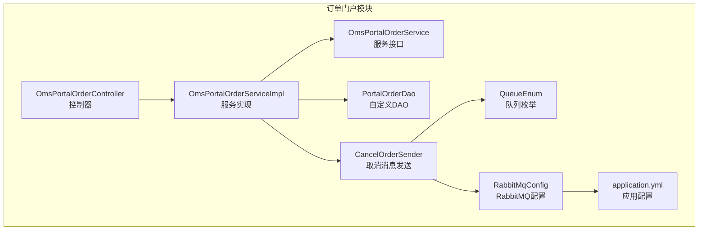
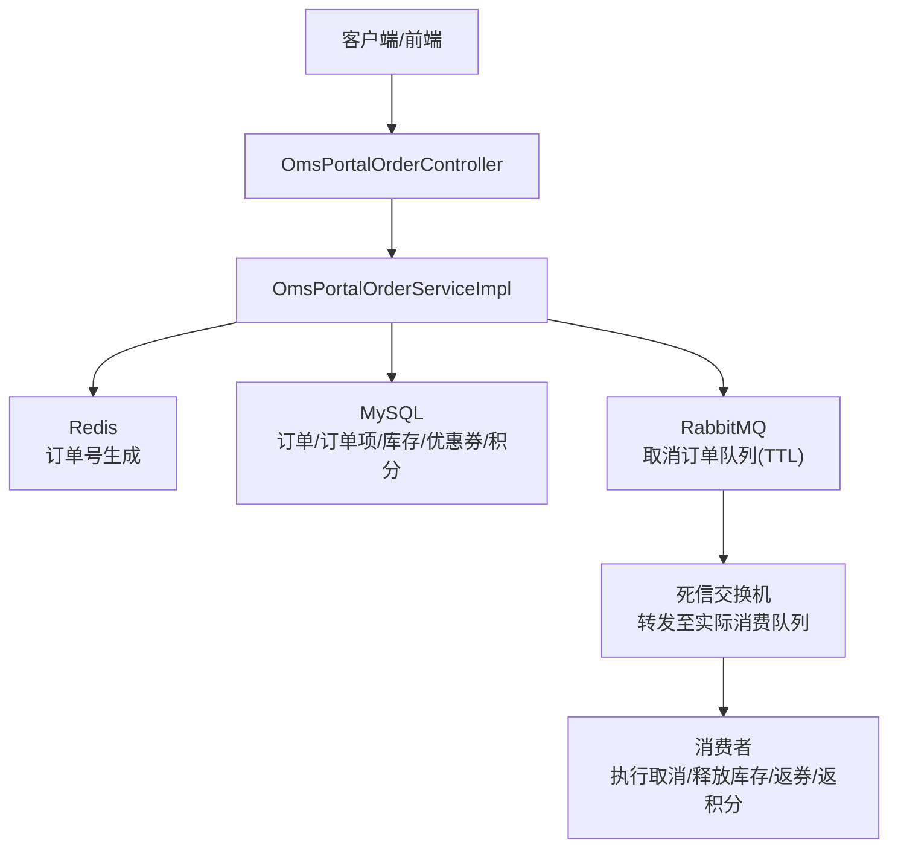
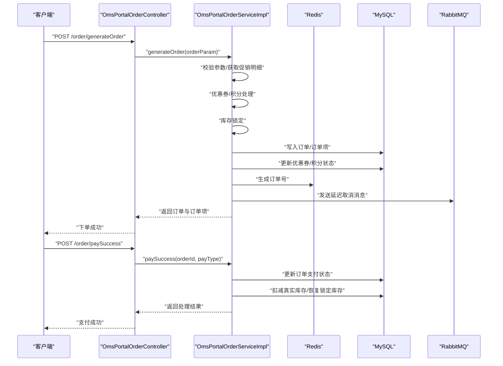
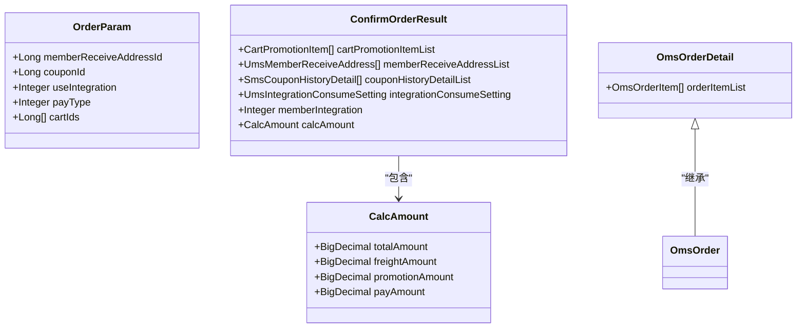
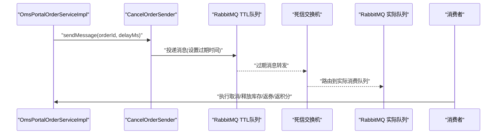
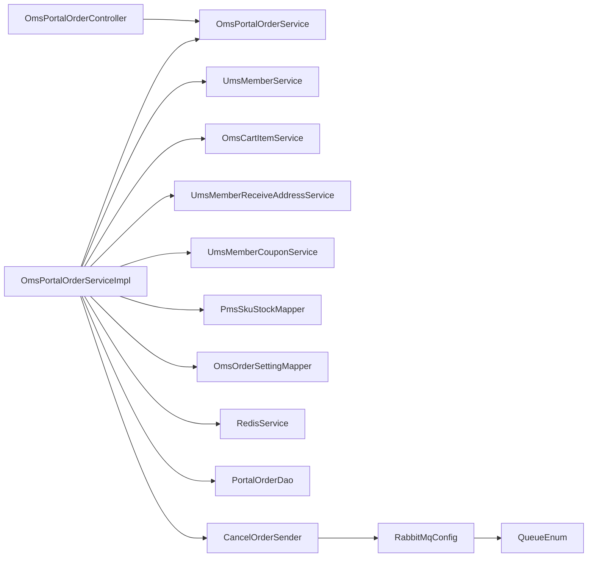

# 订单门户服务

<cite>
**本文引用的文件**
- [OmsPortalOrderController.java](file://mall-portal/src/main/java/com/macro/mall/portal/controller/OmsPortalOrderController.java)
- [OmsPortalOrderServiceImpl.java](file://mall-portal/src/main/java/com/macro/mall/portal/service/impl/OmsPortalOrderServiceImpl.java)
- [OmsPortalOrderService.java](file://mall-portal/src/main/java/com/macro/mall/portal/service/OmsPortalOrderService.java)
- [OrderParam.java](file://mall-portal/src/main/java/com/macro/mall/portal/domain/OrderParam.java)
- [ConfirmOrderResult.java](file://mall-portal/src/main/java/com/macro/mall/portal/domain/ConfirmOrderResult.java)
- [OmsOrderDetail.java](file://mall-portal/src/main/java/com/macro/mall/portal/domain/OmsOrderDetail.java)
- [PortalOrderDao.java](file://mall-portal/src/main/java/com/macro/mall/portal/dao/PortalOrderDao.java)
- [CancelOrderSender.java](file://mall-portal/src/main/java/com/macro/mall/portal/component/CancelOrderSender.java)
- [RabbitMqConfig.java](file://mall-portal/src/main/java/com/macro/mall/portal/config/RabbitMqConfig.java)
- [QueueEnum.java](file://mall-portal/src/main/java/com/macro/mall/portal/domain/QueueEnum.java)
- [application.yml](file://mall-portal/src/main/resources/application.yml)
</cite>

## 目录
1. [简介](#简介)
2. [项目结构](#项目结构)
3. [核心组件](#核心组件)
4. [架构总览](#架构总览)
5. [详细组件分析](#详细组件分析)
6. [依赖分析](#依赖分析)
7. [性能考虑](#性能考虑)
8. [故障排查指南](#故障排查指南)
9. [结论](#结论)
10. [附录](#附录)

## 简介
本文件面向“订单门户服务”，系统性梳理订单创建、订单确认、支付处理、订单查询等核心能力，重点解析以下内容：
- OmsPortalOrderController 的 API 设计与交互流程
- OmsPortalOrderServiceImpl 的业务实现，包括订单数据校验、库存锁定、支付处理、消息队列集成与异步取消机制
- 订单状态管理与异步处理机制
- 完整的接口文档与集成示例

## 项目结构
订单门户服务位于 mall-portal 模块，核心文件组织如下：
- 控制器层：OmsPortalOrderController 提供订单相关 HTTP 接口
- 服务层：OmsPortalOrderService 接口与 OmsPortalOrderServiceImpl 实现
- 领域模型：OrderParam、ConfirmOrderResult、OmsOrderDetail
- 数据访问：PortalOrderDao 定义订单相关自定义查询与库存操作
- 消息与配置：RabbitMqConfig、QueueEnum、CancelOrderSender、application.yml

图表来源
- [OmsPortalOrderController.java:21-99](file://mall-portal/src/main/java/com/macro/mall/portal/controller/OmsPortalOrderController.java#L21-L99)
- [OmsPortalOrderServiceImpl.java:35-794](file://mall-portal/src/main/java/com/macro/mall/portal/service/impl/OmsPortalOrderServiceImpl.java#L35-L794)
- [PortalOrderDao.java:13-54](file://mall-portal/src/main/java/com/macro/mall/portal/dao/PortalOrderDao.java#L13-L54)
- [CancelOrderSender.java:17-35](file://mall-portal/src/main/java/com/macro/mall/portal/component/CancelOrderSender.java#L17-L35)
- [RabbitMqConfig.java:12-79](file://mall-portal/src/main/java/com/macro/mall/portal/config/RabbitMqConfig.java#L12-L79)
- [QueueEnum.java:9-38](file://mall-portal/src/main/java/com/macro/mall/portal/domain/QueueEnum.java#L9-L38)
- [application.yml:1-62](file://mall-portal/src/main/resources/application.yml#L1-L62)

章节来源
- [OmsPortalOrderController.java:21-99](file://mall-portal/src/main/java/com/macro/mall/portal/controller/OmsPortalOrderController.java#L21-L99)
- [OmsPortalOrderServiceImpl.java:35-794](file://mall-portal/src/main/java/com/macro/mall/portal/service/impl/OmsPortalOrderServiceImpl.java#L35-L794)
- [application.yml:1-62](file://mall-portal/src/main/resources/application.yml#L1-L62)

## 核心组件
- 控制器：OmsPortalOrderController 提供订单确认单生成、订单提交、支付回调、超时取消、订单列表与详情、确认收货、删除订单等接口
- 服务：OmsPortalOrderServiceImpl 实现订单创建、库存锁定、优惠券与积分处理、支付状态变更、异步取消、订单查询与详情
- 领域模型：OrderParam 作为下单参数载体；ConfirmOrderResult 用于确认单聚合结果；OmsOrderDetail 用于订单详情聚合
- DAO：PortalOrderDao 提供订单详情、超时订单查询、库存锁定/扣减/释放等操作
- 消息：RabbitMqConfig 定义取消订单的直连交换机与 TTL 死信队列；CancelOrderSender 通过 AMQP 发送带过期时间的消息；QueueEnum 统一队列与交换机命名

章节来源
- [OmsPortalOrderController.java:28-98](file://mall-portal/src/main/java/com/macro/mall/portal/controller/OmsPortalOrderController.java#L28-L98)
- [OmsPortalOrderService.java:16-76](file://mall-portal/src/main/java/com/macro/mall/portal/service/OmsPortalOrderService.java#L16-L76)
- [OrderParam.java:14-21](file://mall-portal/src/main/java/com/macro/mall/portal/domain/OrderParam.java#L14-L21)
- [ConfirmOrderResult.java:17-34](file://mall-portal/src/main/java/com/macro/mall/portal/domain/ConfirmOrderResult.java#L17-L34)
- [OmsOrderDetail.java:16-19](file://mall-portal/src/main/java/com/macro/mall/portal/domain/OmsOrderDetail.java#L16-L19)
- [PortalOrderDao.java:13-54](file://mall-portal/src/main/java/com/macro/mall/portal/dao/PortalOrderDao.java#L13-L54)
- [RabbitMqConfig.java:12-79](file://mall-portal/src/main/java/com/macro/mall/portal/config/RabbitMqConfig.java#L12-L79)
- [CancelOrderSender.java:17-35](file://mall-portal/src/main/java/com/macro/mall/portal/component/CancelOrderSender.java#L17-L35)
- [QueueEnum.java:9-38](file://mall-portal/src/main/java/com/macro/mall/portal/domain/QueueEnum.java#L9-L38)

## 架构总览
订单门户服务采用“控制器-服务-DAO-消息队列”的分层架构，结合 Redis 生成订单号、MySQL 存储订单与订单项、RabbitMQ 实现订单超时取消的异步处理。

图表来源
- [OmsPortalOrderController.java:28-98](file://mall-portal/src/main/java/com/macro/mall/portal/controller/OmsPortalOrderController.java#L28-L98)
- [OmsPortalOrderServiceImpl.java:96-252](file://mall-portal/src/main/java/com/macro/mall/portal/service/impl/OmsPortalOrderServiceImpl.java#L96-L252)
- [RabbitMqConfig.java:18-77](file://mall-portal/src/main/java/com/macro/mall/portal/config/RabbitMqConfig.java#L18-L77)
- [CancelOrderSender.java:23-34](file://mall-portal/src/main/java/com/macro/mall/portal/component/CancelOrderSender.java#L23-L34)
- [application.yml:56-61](file://mall-portal/src/main/resources/application.yml#L56-L61)

## 详细组件分析

### 控制器：OmsPortalOrderController
- 接口职责
  - 生成确认单：POST /order/generateConfirmOrder
  - 提交订单：POST /order/generateOrder
  - 支付成功回调：POST /order/paySuccess
  - 取消超时订单：POST /order/cancelTimeOutOrder
  - 单个订单取消（延迟）：POST /order/cancelOrder
  - 订单列表：GET /order/list
  - 订单详情：GET /order/detail/{orderId}
  - 用户取消订单：POST /order/cancelUserOrder
  - 确认收货：POST /order/confirmReceiveOrder
  - 删除订单：POST /order/deleteOrder

- 关键行为
  - 通过 OmsPortalOrderService 执行业务逻辑
  - 返回统一响应包装对象
  - 部分接口触发异步取消消息发送

章节来源
- [OmsPortalOrderController.java:28-98](file://mall-portal/src/main/java/com/macro/mall/portal/controller/OmsPortalOrderController.java#L28-L98)

### 服务：OmsPortalOrderServiceImpl
- 订单确认单生成
  - 获取当前会员、购物车促销明细、收货地址、可用优惠券、积分与规则、计算总金额与应付金额
- 订单提交
  - 参数校验（收货地址必填）
  - 生成订单项、优惠券与积分处理、应付金额计算
  - 库存锁定（真实库存+锁定库存）
  - 写入订单与订单项、更新优惠券状态、扣减积分、清理购物车
  - 发送延迟取消消息
- 支付成功回调
  - 校验订单状态为未支付
  - 更新支付状态与支付类型、支付时间
  - 扣减真实库存、恢复锁定库存
- 超时取消
  - 查询超时未支付订单，批量更新状态为已关闭
  - 解锁库存、返券、返积分
- 单个订单取消（延迟）
  - 计算延迟时长并发送延迟消息
- 订单查询与详情
  - 分页查询当前会员订单，组装订单详情
  - 获取订单详情（订单+订单项）
- 确认收货与删除订单
  - 校验订单归属与状态，更新状态与确认时间

图表来源
- [OmsPortalOrderController.java:35-47](file://mall-portal/src/main/java/com/macro/mall/portal/controller/OmsPortalOrderController.java#L35-L47)
- [OmsPortalOrderServiceImpl.java:96-252](file://mall-portal/src/main/java/com/macro/mall/portal/service/impl/OmsPortalOrderServiceImpl.java#L96-L252)
- [application.yml:42-47](file://mall-portal/src/main/resources/application.yml#L42-L47)

章节来源
- [OmsPortalOrderServiceImpl.java:72-93](file://mall-portal/src/main/java/com/macro/mall/portal/service/impl/OmsPortalOrderServiceImpl.java#L72-L93)
- [OmsPortalOrderServiceImpl.java:96-252](file://mall-portal/src/main/java/com/macro/mall/portal/service/impl/OmsPortalOrderServiceImpl.java#L96-L252)
- [OmsPortalOrderServiceImpl.java:254-283](file://mall-portal/src/main/java/com/macro/mall/portal/service/impl/OmsPortalOrderServiceImpl.java#L254-L283)
- [OmsPortalOrderServiceImpl.java:285-312](file://mall-portal/src/main/java/com/macro/mall/portal/service/impl/OmsPortalOrderServiceImpl.java#L285-L312)
- [OmsPortalOrderServiceImpl.java:314-348](file://mall-portal/src/main/java/com/macro/mall/portal/service/impl/OmsPortalOrderServiceImpl.java#L314-L348)
- [OmsPortalOrderServiceImpl.java:350-357](file://mall-portal/src/main/java/com/macro/mall/portal/service/impl/OmsPortalOrderServiceImpl.java#L350-L357)
- [OmsPortalOrderServiceImpl.java:360-373](file://mall-portal/src/main/java/com/macro/mall/portal/service/impl/OmsPortalOrderServiceImpl.java#L360-L373)
- [OmsPortalOrderServiceImpl.java:376-443](file://mall-portal/src/main/java/com/macro/mall/portal/service/impl/OmsPortalOrderServiceImpl.java#L376-L443)

### 领域模型与DAO
- OrderParam：下单参数载体，包含收货地址、优惠券、积分、支付方式与购物车ID列表
- ConfirmOrderResult：确认单聚合结果，包含促销明细、地址、优惠券、积分规则、可用积分与金额计算
- OmsOrderDetail：订单详情，继承订单并扩展订单项列表
- PortalOrderDao：提供订单详情、超时订单、库存锁定/扣减/释放等操作

图表来源
- [OrderParam.java:14-21](file://mall-portal/src/main/java/com/macro/mall/portal/domain/OrderParam.java#L14-L21)
- [ConfirmOrderResult.java:17-34](file://mall-portal/src/main/java/com/macro/mall/portal/domain/ConfirmOrderResult.java#L17-L34)
- [OmsOrderDetail.java:16-19](file://mall-portal/src/main/java/com/macro/mall/portal/domain/OmsOrderDetail.java#L16-L19)

章节来源
- [OrderParam.java:14-21](file://mall-portal/src/main/java/com/macro/mall/portal/domain/OrderParam.java#L14-L21)
- [ConfirmOrderResult.java:17-34](file://mall-portal/src/main/java/com/macro/mall/portal/domain/ConfirmOrderResult.java#L17-L34)
- [OmsOrderDetail.java:16-19](file://mall-portal/src/main/java/com/macro/mall/portal/domain/OmsOrderDetail.java#L16-L19)
- [PortalOrderDao.java:13-54](file://mall-portal/src/main/java/com/macro/mall/portal/dao/PortalOrderDao.java#L13-L54)

### 消息与异步处理
- RabbitMQ 配置
  - 交换机：直连交换机（订单实际消费）与 TTL 交换机（死信队列）
  - 队列：订单实际消费队列与订单延迟队列（死信队列）
  - 绑定：将两个队列绑定到对应交换机
- 消息发送
  - CancelOrderSender 将订单ID放入 TTL 队列，并设置过期时间（分钟转换为毫秒）
  - 过期后消息转发至实际消费交换机，消费者处理取消逻辑
- 配置要点
  - application.yml 中定义队列名称
  - QueueEnum 统一命名常量

图表来源
- [CancelOrderSender.java:23-34](file://mall-portal/src/main/java/com/macro/mall/portal/component/CancelOrderSender.java#L23-L34)
- [RabbitMqConfig.java:18-77](file://mall-portal/src/main/java/com/macro/mall/portal/config/RabbitMqConfig.java#L18-L77)
- [QueueEnum.java:14-18](file://mall-portal/src/main/java/com/macro/mall/portal/domain/QueueEnum.java#L14-L18)
- [application.yml:56-61](file://mall-portal/src/main/resources/application.yml#L56-L61)

章节来源
- [RabbitMqConfig.java:12-79](file://mall-portal/src/main/java/com/macro/mall/portal/config/RabbitMqConfig.java#L12-L79)
- [CancelOrderSender.java:17-35](file://mall-portal/src/main/java/com/macro/mall/portal/component/CancelOrderSender.java#L17-L35)
- [QueueEnum.java:9-38](file://mall-portal/src/main/java/com/macro/mall/portal/domain/QueueEnum.java#L9-L38)
- [application.yml:56-61](file://mall-portal/src/main/resources/application.yml#L56-L61)

## 依赖分析
- 控制器依赖服务接口
- 服务实现依赖多个子系统：会员、购物车、地址、优惠券、库存、订单设置、Redis、DAO、消息发送
- DAO 依赖 MyBatis 映射文件
- 消息层依赖 RabbitMQ 配置与队列枚举

图表来源
- [OmsPortalOrderController.java:25-26](file://mall-portal/src/main/java/com/macro/mall/portal/controller/OmsPortalOrderController.java#L25-L26)
- [OmsPortalOrderServiceImpl.java:37-69](file://mall-portal/src/main/java/com/macro/mall/portal/service/impl/OmsPortalOrderServiceImpl.java#L37-L69)
- [RabbitMqConfig.java:12-79](file://mall-portal/src/main/java/com/macro/mall/portal/config/RabbitMqConfig.java#L12-L79)
- [QueueEnum.java:9-38](file://mall-portal/src/main/java/com/macro/mall/portal/domain/QueueEnum.java#L9-L38)

章节来源
- [OmsPortalOrderController.java:25-26](file://mall-portal/src/main/java/com/macro/mall/portal/controller/OmsPortalOrderController.java#L25-L26)
- [OmsPortalOrderServiceImpl.java:37-69](file://mall-portal/src/main/java/com/macro/mall/portal/service/impl/OmsPortalOrderServiceImpl.java#L37-L69)

## 性能考虑
- 订单号生成：基于 Redis 自增，避免数据库热点与并发冲突
- 库存处理：先锁定再扣减，减少并发下的超卖风险
- 事务边界：下单、支付回调、取消等关键流程均在事务内执行，保证一致性
- 分页查询：订单列表使用分页组件，降低内存压力
- 异步取消：通过延迟队列异步处理超时订单，避免阻塞主流程

## 故障排查指南
- 下单失败（库存不足）
  - 现象：下单时报错提示库存不足
  - 排查：检查 hasStock 与 lockStock 流程，确认真实库存与锁定库存是否足够
- 支付回调异常
  - 现象：支付成功后无法扣减真实库存或状态未更新
  - 排查：核对 paySuccess 的状态校验与订单详情查询，确保订单处于未支付状态
- 超时取消未生效
  - 现象：订单超时未自动关闭
  - 排查：确认 RabbitMQ 队列与交换机配置、TTL 设置、死信路由键是否正确
- 订单状态不一致
  - 现象：确认收货或删除订单时报权限或状态错误
  - 排查：核对当前登录用户与订单归属、状态流转条件

章节来源
- [OmsPortalOrderServiceImpl.java:125-129](file://mall-portal/src/main/java/com/macro/mall/portal/service/impl/OmsPortalOrderServiceImpl.java#L125-L129)
- [OmsPortalOrderServiceImpl.java:254-272](file://mall-portal/src/main/java/com/macro/mall/portal/service/impl/OmsPortalOrderServiceImpl.java#L254-L272)
- [OmsPortalOrderServiceImpl.java:285-312](file://mall-portal/src/main/java/com/macro/mall/portal/service/impl/OmsPortalOrderServiceImpl.java#L285-L312)
- [OmsPortalOrderServiceImpl.java:360-373](file://mall-portal/src/main/java/com/macro/mall/portal/service/impl/OmsPortalOrderServiceImpl.java#L360-L373)
- [OmsPortalOrderServiceImpl.java:431-443](file://mall-portal/src/main/java/com/macro/mall/portal/service/impl/OmsPortalOrderServiceImpl.java#L431-L443)

## 结论
订单门户服务通过清晰的分层设计与完善的异步机制，实现了从订单确认、下单、支付到取消与查询的全链路能力。服务端在事务一致性、库存安全与消息可靠性方面具备良好保障，适合在高并发场景下稳定运行。

## 附录

### 接口文档

- 生成确认单
  - 方法：POST
  - 路径：/order/generateConfirmOrder
  - 请求体：购物车ID列表
  - 响应：确认单结果（促销明细、地址、优惠券、积分与金额）

- 提交订单
  - 方法：POST
  - 路径：/order/generateOrder
  - 请求体：OrderParam（收货地址、优惠券、积分、支付方式、购物车ID列表）
  - 响应：订单与订单项集合

- 支付成功回调
  - 方法：POST
  - 路径：/order/paySuccess
  - 参数：orderId、payType
  - 响应：处理结果（成功条数）

- 取消超时订单
  - 方法：POST
  - 路径：/order/cancelTimeOutOrder
  - 响应：取消的订单数量

- 单个订单取消（延迟）
  - 方法：POST
  - 路径：/order/cancelOrder
  - 参数：orderId
  - 响应：无

- 订单列表
  - 方法：GET
  - 路径：/order/list
  - 参数：status（-1 表示全部）、pageNum、pageSize
  - 响应：订单分页详情

- 订单详情
  - 方法：GET
  - 路径：/order/detail/{orderId}
  - 参数：orderId
  - 响应：订单详情（订单+订单项）

- 用户取消订单
  - 方法：POST
  - 路径：/order/cancelUserOrder
  - 参数：orderId
  - 响应：无

- 确认收货
  - 方法：POST
  - 路径：/order/confirmReceiveOrder
  - 参数：orderId
  - 响应：无

- 删除订单
  - 方法：POST
  - 路径：/order/deleteOrder
  - 参数：orderId
  - 响应：无

章节来源
- [OmsPortalOrderController.java:28-98](file://mall-portal/src/main/java/com/macro/mall/portal/controller/OmsPortalOrderController.java#L28-L98)

### 集成示例（步骤说明）
- 生成确认单
  - 调用 /order/generateConfirmOrder，传入购物车ID列表，获取促销明细、可用地址、可用优惠券与积分规则
- 提交订单
  - 准备 OrderParam，选择收货地址、优惠券、积分与支付方式，调用 /order/generateOrder
  - 订单提交后，系统会锁定库存并发送延迟取消消息
- 支付回调
  - 支付完成后调用 /order/paySuccess，传入 orderId 与 payType，系统更新支付状态并扣减真实库存
- 订单查询
  - 使用 /order/list 或 /order/detail/{orderId} 查询订单状态与详情
- 超时取消
  - 系统通过延迟队列自动取消未支付订单，释放库存并返券返积分

章节来源
- [OmsPortalOrderController.java:28-98](file://mall-portal/src/main/java/com/macro/mall/portal/controller/OmsPortalOrderController.java#L28-L98)
- [OmsPortalOrderServiceImpl.java:96-252](file://mall-portal/src/main/java/com/macro/mall/portal/service/impl/OmsPortalOrderServiceImpl.java#L96-L252)
- [RabbitMqConfig.java:18-77](file://mall-portal/src/main/java/com/macro/mall/portal/config/RabbitMqConfig.java#L18-L77)