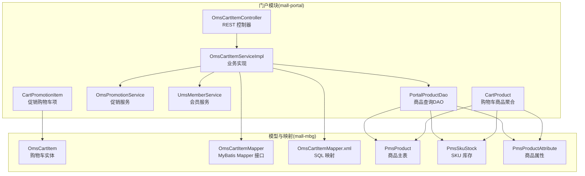
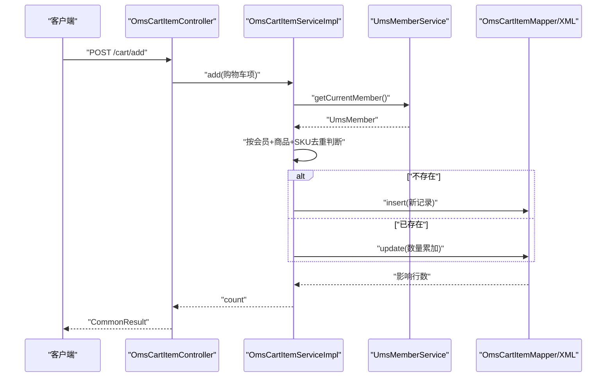
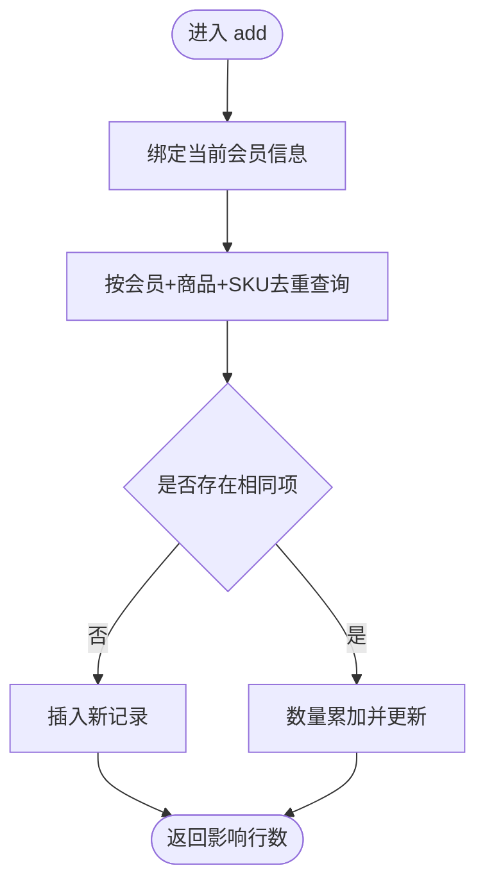
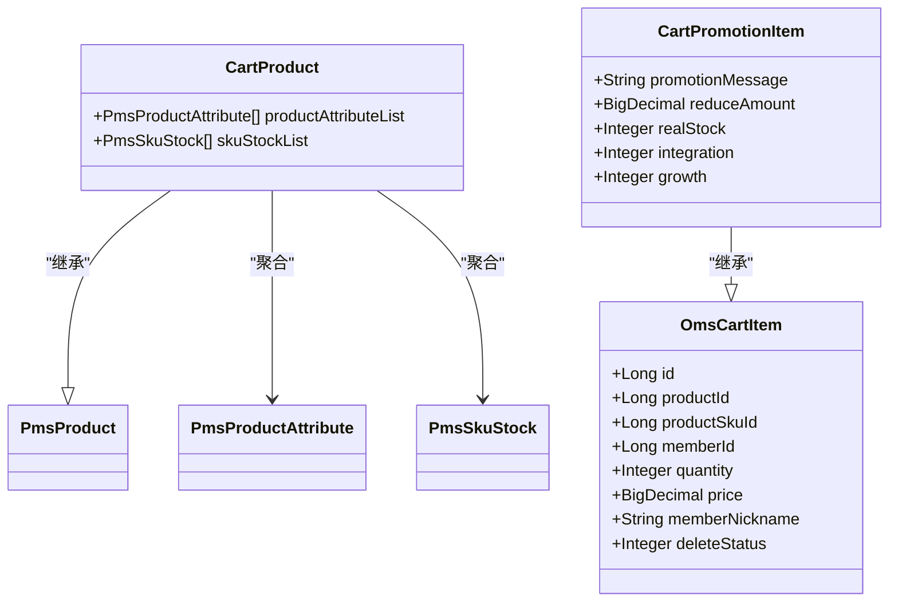
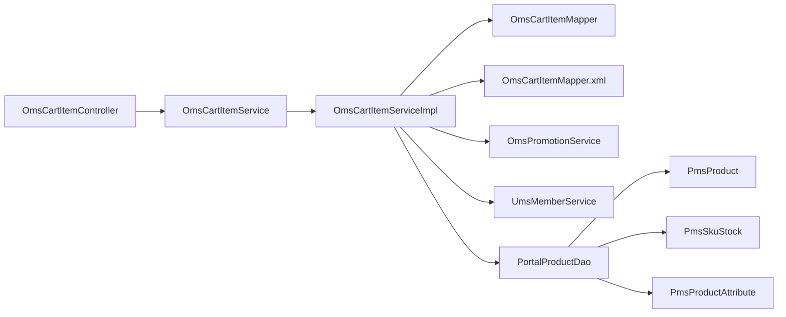

# 购物车服务

<cite>
**本文引用的文件**
- [OmsCartItemController.java](file://mall-portal/src/main/java/com/macro/mall/portal/controller/OmsCartItemController.java)
- [OmsCartItemService.java](file://mall-portal/src/main/java/com/macro/mall/portal/service/OmsCartItemService.java)
- [OmsCartItemServiceImpl.java](file://mall-portal/src/main/java/com/macro/mall/portal/service/impl/OmsCartItemServiceImpl.java)
- [OmsCartItemMapper.java](file://mall-mbg/src/main/java/com/macro/mall/mapper/OmsCartItemMapper.java)
- [OmsCartItemMapper.xml](file://mall-mbg/src/main/resources/com/macro/mall/mapper/OmsCartItemMapper.xml)
- [OmsCartItem.java](file://mall-mbg/src/main/java/com/macro/mall/model/OmsCartItem.java)
- [UmsMemberService.java](file://mall-portal/src/main/java/com/macro/mall/portal/service/UmsMemberService.java)
- [PortalProductDao.java](file://mall-portal/src/main/java/com/macro/mall/portal/dao/PortalProductDao.java)
- [CartProduct.java](file://mall-portal/src/main/java/com/macro/mall/portal/domain/CartProduct.java)
- [CartPromotionItem.java](file://mall-portal/src/main/java/com/macro/mall/portal/domain/CartPromotionItem.java)
- [OmsPromotionService.java](file://mall-portal/src/main/java/com/macro/mall/portal/service/OmsPromotionService.java)
- [PmsProduct.java](file://mall-mbg/src/main/java/com/macro/mall/model/PmsProduct.java)
- [PmsSkuStock.java](file://mall-mbg/src/main/java/com/macro/mall/model/PmsSkuStock.java)
- [PmsProductAttribute.java](file://mall-mbg/src/main/java/com/macro/mall/model/PmsProductAttribute.java)
</cite>

## 目录
1. [简介](#简介)
2. [项目结构](#项目结构)
3. [核心组件](#核心组件)
4. [架构总览](#架构总览)
5. [详细组件分析](#详细组件分析)
6. [依赖关系分析](#依赖关系分析)
7. [性能与扩展性](#性能与扩展性)
8. [故障排查指南](#故障排查指南)
9. [结论](#结论)
10. [附录：接口文档与使用示例](#附录接口文档与使用示例)

## 简介
本文件面向“购物车服务”的技术文档，系统性阐述购物车管理、商品添加/删除、数量修改、价格计算与促销联动等核心能力；重点解析控制器 OmsCartItemController 的 API 设计与调用流程，以及服务层 OmsCartItemServiceImpl 的业务实现（含持久化、促销计算、规格变更、清空购物车等）；同时给出缓存策略建议与数据一致性保障思路，并提供完整的接口清单与使用示例。

## 项目结构
购物车相关代码主要分布在 portal 模块的 controller、service、domain 层，以及 mbg 模块的 model 与 mybatis 映射层：
- 控制器层：OmsCartItemController 提供 REST 接口
- 服务层：OmsCartItemService 定义接口，OmsCartItemServiceImpl 实现业务逻辑
- 数据访问层：OmsCartItemMapper 及其 XML 映射
- 领域模型：OmsCartItem、CartProduct、CartPromotionItem
- 促销与会员：OmsPromotionService、UmsMemberService
- 商品信息：PortalProductDao、PmsProduct、PmsSkuStock、PmsProductAttribute

图表来源
- [OmsCartItemController.java:1-62](file://mall-portal/src/main/java/com/macro/mall/portal/controller/OmsCartItemController.java#L1-L62)
- [OmsCartItemServiceImpl.java:1-111](file://mall-portal/src/main/java/com/macro/mall/portal/service/impl/OmsCartItemServiceImpl.java#L1-L111)
- [OmsCartItemMapper.java:1-30](file://mall-mbg/src/main/java/com/macro/mall/mapper/OmsCartItemMapper.java#L1-L30)
- [OmsCartItemMapper.xml:1-200](file://mall-mbg/src/main/resources/com/macro/mall/mapper/OmsCartItemMapper.xml#L1-L200)
- [PortalProductDao.java:1-30](file://mall-portal/src/main/java/com/macro/mall/portal/dao/PortalProductDao.java#L1-L30)
- [CartProduct.java:1-21](file://mall-portal/src/main/java/com/macro/mall/portal/domain/CartProduct.java#L1-L21)
- [CartPromotionItem.java:1-22](file://mall-portal/src/main/java/com/macro/mall/portal/domain/CartPromotionItem.java#L1-L22)
- [PmsProduct.java:1-200](file://mall-mbg/src/main/java/com/macro/mall/model/PmsProduct.java#L1-L200)
- [PmsSkuStock.java:1-140](file://mall-mbg/src/main/java/com/macro/mall/model/PmsSkuStock.java#L1-L140)
- [PmsProductAttribute.java:1-150](file://mall-mbg/src/main/java/com/macro/mall/model/PmsProductAttribute.java#L1-L150)

章节来源
- [OmsCartItemController.java:1-62](file://mall-portal/src/main/java/com/macro/mall/portal/controller/OmsCartItemController.java#L1-L62)
- [OmsCartItemServiceImpl.java:1-111](file://mall-portal/src/main/java/com/macro/mall/portal/service/impl/OmsCartItemServiceImpl.java#L1-L111)
- [OmsCartItemMapper.java:1-30](file://mall-mbg/src/main/java/com/macro/mall/mapper/OmsCartItemMapper.java#L1-L30)
- [OmsCartItemMapper.xml:1-200](file://mall-mbg/src/main/resources/com/macro/mall/mapper/OmsCartItemMapper.xml#L1-L200)

## 核心组件
- 控制器 OmsCartItemController：提供购物车增删改查、按促销计算、按数量更新等接口，统一返回通用结果包装。
- 服务接口 OmsCartItemService：定义添加、查询、促销计算、数量更新、批量删除、规格变更、清空等方法。
- 服务实现 OmsCartItemServiceImpl：完成会员绑定、去重合并、持久化、促销计算、数量更新、批量删除、清空等。
- 数据访问 OmsCartItemMapper + XML：提供基于 MyBatis 的增删改查、条件查询、示例查询等 SQL 映射。
- 领域模型：OmsCartItem（购物车记录）、CartProduct（购物车商品聚合视图）、CartPromotionItem（带促销信息的购物车项）。
- 促销与会员：OmsPromotionService（促销计算）、UmsMemberService（当前会员上下文）。
- 商品 DAO：PortalProductDao（获取购物车商品详情、促销商品列表、可用优惠券）。

章节来源
- [OmsCartItemService.java:1-57](file://mall-portal/src/main/java/com/macro/mall/portal/service/OmsCartItemService.java#L1-L57)
- [OmsCartItemServiceImpl.java:1-111](file://mall-portal/src/main/java/com/macro/mall/portal/service/impl/OmsCartItemServiceImpl.java#L1-L111)
- [OmsCartItemMapper.java:1-30](file://mall-mbg/src/main/java/com/macro/mall/mapper/OmsCartItemMapper.java#L1-L30)
- [OmsCartItemMapper.xml:1-200](file://mall-mbg/src/main/resources/com/macro/mall/mapper/OmsCartItemMapper.xml#L1-L200)
- [CartProduct.java:1-21](file://mall-portal/src/main/java/com/macro/mall/portal/domain/CartProduct.java#L1-L21)
- [CartPromotionItem.java:1-22](file://mall-portal/src/main/java/com/macro/mall/portal/domain/CartPromotionItem.java#L1-L22)
- [OmsPromotionService.java:1-19](file://mall-portal/src/main/java/com/macro/mall/portal/service/OmsPromotionService.java#L1-L19)
- [UmsMemberService.java:1-65](file://mall-portal/src/main/java/com/macro/mall/portal/service/UmsMemberService.java#L1-L65)

## 架构总览
购物车服务采用典型的 MVC 分层与领域驱动设计：
- 控制器负责参数接收、鉴权与返回封装
- 服务层编排业务规则（会员绑定、去重合并、促销计算）
- DAO/Mapper 负责与数据库交互
- 领域模型承载业务语义与跨表聚合

图表来源
- [OmsCartItemController.java:29-37](file://mall-portal/src/main/java/com/macro/mall/portal/controller/OmsCartItemController.java#L29-L37)
- [OmsCartItemServiceImpl.java:39-55](file://mall-portal/src/main/java/com/macro/mall/portal/service/impl/OmsCartItemServiceImpl.java#L39-L55)
- [OmsCartItemMapper.xml:117-133](file://mall-mbg/src/main/resources/com/macro/mall/mapper/OmsCartItemMapper.xml#L117-L133)
- [UmsMemberService.java](file://mall-portal/src/main/java/com/macro/mall/portal/service/UmsMemberService.java#L42)

## 详细组件分析

### 控制器：OmsCartItemController
- 功能点
  - 添加购物车项：接收 OmsCartItem，调用服务层 add 并返回结果
  - 查询购物车列表：按当前会员 ID 查询未删除的购物车项
  - 查询促销购物车：可选传入部分购物车项 ID，返回带促销信息的集合
  - 更新数量：按购物车项 ID 和数量更新
  - 删除购物车项：支持批量删除（设置删除状态为已删除）
- 参数与返回
  - 统一通过 CommonResult 包装，遵循项目通用返回规范
  - 当前会员通过 UmsMemberService.getCurrentMember() 获取
- 扩展建议
  - 支持批量更新数量、批量删除增强
  - 增加规格变更接口（updateAttr）

章节来源
- [OmsCartItemController.java:29-62](file://mall-portal/src/main/java/com/macro/mall/portal/controller/OmsCartItemController.java#L29-L62)
- [UmsMemberService.java](file://mall-portal/src/main/java/com/macro/mall/portal/service/UmsMemberService.java#L42)

### 服务接口：OmsCartItemService
- 方法概览
  - add：添加或合并购物车项（事务）
  - list：按会员 ID 查询购物车列表
  - listPromotion：按会员 ID 与可选购物车项 ID 过滤，返回促销计算结果
  - updateQuantity：按 ID 与会员 ID 更新数量
  - delete：按会员 ID 与 ID 列表批量删除
  - getCartProduct：获取购物车中用于规格选择的商品信息
  - updateAttr：修改购物车中商品的规格（事务）
  - clear：清空购物车
- 事务性
  - add、updateAttr 标注事务，确保去重合并与规格变更的一致性

章节来源
- [OmsCartItemService.java:14-56](file://mall-portal/src/main/java/com/macro/mall/portal/service/OmsCartItemService.java#L14-L56)

### 服务实现：OmsCartItemServiceImpl
- add 流程
  - 绑定当前会员 ID 与昵称
  - 去重判断：按会员、商品、SKU（若存在）查询现有购物车项
  - 若不存在则插入，否则数量累加并更新
- list 流程
  - 查询 delete_status 为未删除且 memberId 等于当前会员的购物车项
- listPromotion 流程
  - 先取当前会员购物车项，再按 cartIds 过滤（如有）
  - 调用促销服务计算促销信息
- updateQuantity 流程
  - 仅允许更新当前会员的购物车项数量
- delete 流程
  - 将 delete_status 设置为已删除
- getCartProduct 流程
  - 通过 PortalProductDao 获取商品详情（含属性、SKU 库存）
- updateAttr 流程
  - 事务内更新购物车项的 SKU、属性等字段
- clear 流程
  - 清空当前会员购物车（设置删除状态）

图表来源
- [OmsCartItemServiceImpl.java:39-55](file://mall-portal/src/main/java/com/macro/mall/portal/service/impl/OmsCartItemServiceImpl.java#L39-L55)
- [OmsCartItemMapper.xml:117-133](file://mall-mbg/src/main/resources/com/macro/mall/mapper/OmsCartItemMapper.xml#L117-L133)

章节来源
- [OmsCartItemServiceImpl.java:39-111](file://mall-portal/src/main/java/com/macro/mall/portal/service/impl/OmsCartItemServiceImpl.java#L39-L111)

### 数据访问：OmsCartItemMapper 与 XML
- Mapper 接口
  - 提供 count/select/update/delete 的多种重载
- XML 映射
  - BaseResultMap 映射 OmsCartItem 字段
  - selectByExample、selectByPrimaryKey、insert、insertSelective、updateByExampleSelective 等
  - 条件拼装 Example_Where_Clause，支持动态 WHERE 片段
- 使用要点
  - 通过 Example 构建条件，避免硬编码 SQL
  - insertSelective 仅对非空字段写入，便于后续扩展字段

章节来源
- [OmsCartItemMapper.java:8-30](file://mall-mbg/src/main/java/com/macro/mall/mapper/OmsCartItemMapper.java#L8-L30)
- [OmsCartItemMapper.xml:1-200](file://mall-mbg/src/main/resources/com/macro/mall/mapper/OmsCartItemMapper.xml#L1-L200)

### 领域模型与聚合
- OmsCartItem：购物车记录，包含商品、SKU、数量、单价、会员信息、删除状态等
- CartProduct：继承 PmsProduct，聚合商品属性与 SKU 库存，用于规格选择与展示
- CartPromotionItem：在 OmsCartItem 基础上扩展促销信息（如促销文案、减免金额、真实库存、积分/成长值）

图表来源
- [OmsCartItem.java:1-218](file://mall-mbg/src/main/java/com/macro/mall/model/OmsCartItem.java#L1-L218)
- [CartProduct.java:1-21](file://mall-portal/src/main/java/com/macro/mall/portal/domain/CartProduct.java#L1-L21)
- [CartPromotionItem.java:1-22](file://mall-portal/src/main/java/com/macro/mall/portal/domain/CartPromotionItem.java#L1-L22)
- [PmsProduct.java:1-200](file://mall-mbg/src/main/java/com/macro/mall/model/PmsProduct.java#L1-L200)
- [PmsSkuStock.java:1-140](file://mall-mbg/src/main/java/com/macro/mall/model/PmsSkuStock.java#L1-L140)
- [PmsProductAttribute.java:1-150](file://mall-mbg/src/main/java/com/macro/mall/model/PmsProductAttribute.java#L1-L150)

## 依赖关系分析
- 控制器依赖服务接口与会员服务
- 服务实现依赖 Mapper、XML、促销服务、会员服务、商品 DAO
- 商品 DAO 依赖 PmsProduct、PmsSkuStock、PmsProductAttribute
- 返回类型依赖 CartProduct、CartPromotionItem

图表来源
- [OmsCartItemController.java:1-62](file://mall-portal/src/main/java/com/macro/mall/portal/controller/OmsCartItemController.java#L1-L62)
- [OmsCartItemServiceImpl.java:1-111](file://mall-portal/src/main/java/com/macro/mall/portal/service/impl/OmsCartItemServiceImpl.java#L1-L111)
- [PortalProductDao.java:1-30](file://mall-portal/src/main/java/com/macro/mall/portal/dao/PortalProductDao.java#L1-L30)
- [PmsProduct.java:1-200](file://mall-mbg/src/main/java/com/macro/mall/model/PmsProduct.java#L1-L200)
- [PmsSkuStock.java:1-140](file://mall-mbg/src/main/java/com/macro/mall/model/PmsSkuStock.java#L1-L140)
- [PmsProductAttribute.java:1-150](file://mall-mbg/src/main/java/com/macro/mall/model/PmsProductAttribute.java#L1-L150)

## 性能与扩展性
- 性能特性
  - MyBatis 示例查询与动态 WHERE 片段，适合多条件过滤
  - add 合并逻辑减少重复记录，降低存储与查询压力
- 扩展建议
  - 缓存策略：对热门商品详情与促销信息进行缓存，结合失效策略与最终一致性
  - 分页与排序：list 接口可引入分页与排序参数，提升大数据量下的响应性能
  - 并发控制：在高并发场景下，建议在 add 与 updateAttr 上增加幂等与锁机制
  - 促销计算：将促销计算拆分为独立微服务或本地缓存，降低购物车查询时的计算开销

[本节为通用指导，不直接分析具体文件]

## 故障排查指南
- 添加失败
  - 检查当前会员是否正确获取
  - 核对去重条件（会员、商品、SKU）是否一致
  - 查看 insert/update 是否返回预期行数
- 数量更新无效
  - 确认请求参数 id、quantity 与当前会员匹配
  - 检查 delete_status 与查询条件
- 促销列表为空
  - 确认 cartIds 过滤是否正确
  - 检查促销服务 calcCartPromotion 输入是否为空
- 规格变更异常
  - 确认事务边界与幂等处理
  - 校验商品属性与 SKU 库存是否匹配

章节来源
- [OmsCartItemServiceImpl.java:39-111](file://mall-portal/src/main/java/com/macro/mall/portal/service/impl/OmsCartItemServiceImpl.java#L39-L111)
- [OmsCartItemMapper.xml:252-262](file://mall-mbg/src/main/resources/com/macro/mall/mapper/OmsCartItemMapper.xml#L252-L262)

## 结论
购物车服务以清晰的分层与接口设计实现了核心购物流程：添加合并、查询列表、促销计算、数量与规格变更、批量删除与清空。通过 MyBatis 的灵活映射与领域模型的聚合，系统具备良好的可维护性与扩展性。建议在高并发与大促场景下引入缓存与限流策略，并完善幂等与一致性保障机制。

[本节为总结性内容，不直接分析具体文件]

## 附录：接口文档与使用示例

- 接口总览
  - POST /cart/add
    - 请求体：OmsCartItem
    - 返回：CommonResult<Integer>（新增/更新条数）
  - GET /cart/list
    - 查询：无
    - 返回：CommonResult<List<OmsCartItem>>
  - GET /cart/list/promotion
    - 查询参数：cartIds（可选，List<Long>）
    - 返回：CommonResult<List<CartPromotionItem>>
  - GET /cart/update/quantity
    - 查询参数：id（Long），quantity（Integer）
    - 返回：CommonResult<Integer>（影响行数）
  - DELETE /cart/delete
    - 查询参数：ids（List<Long>）
    - 返回：CommonResult<Integer>（影响行数）
  - GET /cart/getCartProduct
    - 查询参数：productId（Long）
    - 返回：CommonResult<CartProduct>
  - PUT /cart/updateAttr
    - 请求体：OmsCartItem（含 SKU、属性等）
    - 返回：CommonResult<Integer>（影响行数）
  - DELETE /cart/clear
    - 查询：无
    - 返回：CommonResult<Integer>（影响行数）

- 使用示例（说明性）
  - 新增购物车项
    - 请求：POST /cart/add，Body 为包含 productId、productSkuId、quantity 等的 OmsCartItem
    - 响应：成功时返回新增/更新后的条数
  - 查询购物车列表
    - 请求：GET /cart/list
    - 响应：返回当前会员的购物车项列表
  - 查询促销购物车
    - 请求：GET /cart/list/promotion?cartIds=1&cartIds=2
    - 响应：返回带促销信息的购物车项集合
  - 修改数量
    - 请求：GET /cart/update/quantity?id=1&quantity=3
    - 响应：返回受影响的行数
  - 批量删除
    - 请求：DELETE /cart/delete?ids=1&ids=2
    - 响应：返回受影响的行数
  - 获取规格选择商品
    - 请求：GET /cart/getCartProduct?productId=1001
    - 响应：返回 CartProduct（含属性与 SKU 库存）
  - 修改规格
    - 请求：PUT /cart/updateAttr，Body 为新的 SKU 与属性
    - 响应：返回受影响的行数
  - 清空购物车
    - 请求：DELETE /cart/clear
    - 响应：返回受影响的行数

章节来源
- [OmsCartItemController.java:29-62](file://mall-portal/src/main/java/com/macro/mall/portal/controller/OmsCartItemController.java#L29-L62)
- [OmsCartItemService.java:14-56](file://mall-portal/src/main/java/com/macro/mall/portal/service/OmsCartItemService.java#L14-L56)
- [CartProduct.java:1-21](file://mall-portal/src/main/java/com/macro/mall/portal/domain/CartProduct.java#L1-L21)
- [CartPromotionItem.java:1-22](file://mall-portal/src/main/java/com/macro/mall/portal/domain/CartPromotionItem.java#L1-L22)