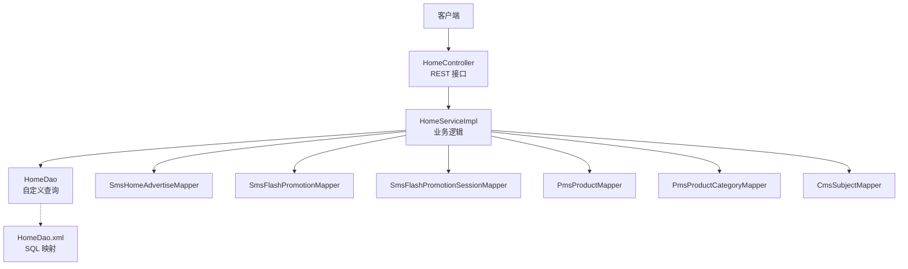
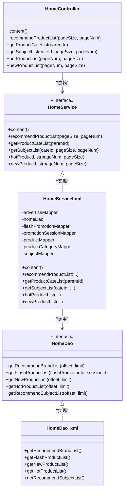
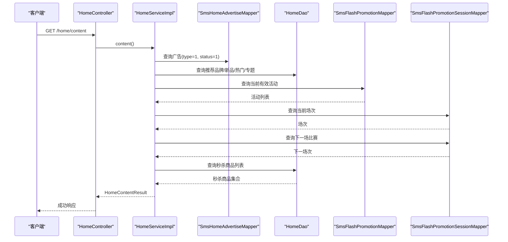
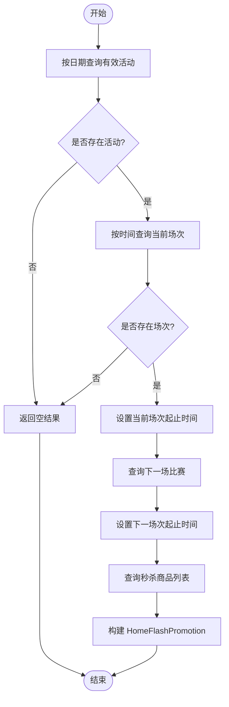
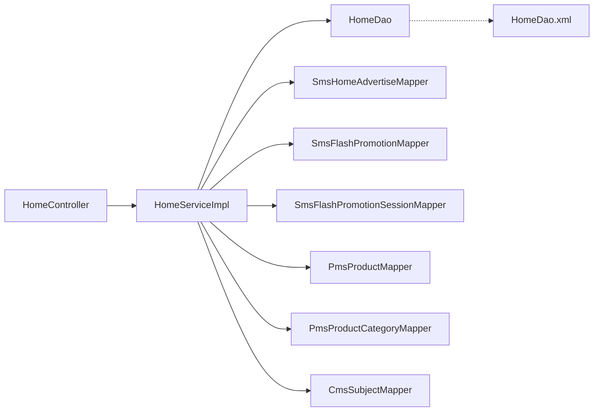

# 首页服务模块

<cite>
**本文引用的文件**
- [HomeServiceImpl.java](file://mall-portal/src/main/java/com/macro/mall/portal/service/impl/HomeServiceImpl.java)
- [HomeService.java](file://mall-portal/src/main/java/com/macro/mall/portal/service/HomeService.java)
- [HomeDao.java](file://mall-portal/src/main/java/com/macro/mall/portal/dao/HomeDao.java)
- [HomeDao.xml](file://mall-portal/src/main/resources/dao/HomeDao.xml)
- [HomeController.java](file://mall-portal/src/main/java/com/macro/mall/portal/controller/HomeController.java)
- [HomeContentResult.java](file://mall-portal/src/main/java/com/macro/mall/portal/domain/HomeContentResult.java)
- [HomeFlashPromotion.java](file://mall-portal/src/main/java/com/macro/mall/portal/domain/HomeFlashPromotion.java)
- [FlashPromotionProduct.java](file://mall-portal/src/main/java/com/macro/mall/portal/domain/FlashPromotionProduct.java)
- [SmsHomeAdvertiseMapper.java](file://mall-mbg/src/main/java/com/macro/mall/mapper/SmsHomeAdvertiseMapper.java)
- [SmsFlashPromotionMapper.java](file://mall-mbg/src/main/java/com/macro/mall/mapper/SmsFlashPromotionMapper.java)
- [SmsFlashPromotionSessionMapper.java](file://mall-mbg/src/main/java/com/macro/mall/mapper/SmsFlashPromotionSessionMapper.java)
- [PmsProductMapper.java](file://mall-mbg/src/main/java/com/macro/mall/mapper/PmsProductMapper.java)
- [PmsProductCategoryMapper.java](file://mall-mbg/src/main/java/com/macro/mall/mapper/PmsProductCategoryMapper.java)
- [CmsSubjectMapper.java](file://mall-mbg/src/main/java/com/macro/mall/mapper/CmsSubjectMapper.java)
- [CommonResult.java](file://mall-common/src/main/java/com/macro/mall/common/api/CommonResult.java)
</cite>

## 目录
1. [简介](#简介)
2. [项目结构](#项目结构)
3. [核心组件](#核心组件)
4. [架构总览](#架构总览)
5. [详细组件分析](#详细组件分析)
6. [依赖关系分析](#依赖关系分析)
7. [性能与缓存策略](#性能与缓存策略)
8. [接口文档](#接口文档)
9. [故障排查指南](#故障排查指南)
10. [结论](#结论)

## 简介
本文件系统性梳理首页服务模块的技术实现，覆盖首页数据聚合（广告、推荐、专题）、商品分类查询、热门/新品/品牌推荐、促销活动（限时秒杀）展示等核心能力。重点解析 HomeServiceImpl 的实现逻辑、DAO 层数据访问模式与 SQL 优化策略，并给出首页缓存与性能优化建议及完整接口文档与使用示例。

## 项目结构
首页服务模块位于 mall-portal 子工程中，采用典型的分层架构：
- 控制器层：对外暴露 REST 接口，负责参数接收与响应封装
- 服务层：实现业务逻辑，协调 DAO 与领域模型
- DAO 层：MyBatis 映射文件，封装复杂查询与分页
- 领域模型：用于返回结果的组合对象与扩展字段

图表来源
- [HomeController.java:1-74](file://mall-portal/src/main/java/com/macro/mall/portal/controller/HomeController.java#L1-L74)
- [HomeServiceImpl.java:1-177](file://mall-portal/src/main/java/com/macro/mall/portal/service/impl/HomeServiceImpl.java#L1-L177)
- [HomeDao.java:1-41](file://mall-portal/src/main/java/com/macro/mall/portal/dao/HomeDao.java#L1-L41)
- [HomeDao.xml:1-76](file://mall-portal/src/main/resources/dao/HomeDao.xml#L1-L76)

章节来源
- [HomeController.java:1-74](file://mall-portal/src/main/java/com/macro/mall/portal/controller/HomeController.java#L1-L74)
- [HomeServiceImpl.java:1-177](file://mall-portal/src/main/java/com/macro/mall/portal/service/impl/HomeServiceImpl.java#L1-L177)
- [HomeDao.java:1-41](file://mall-portal/src/main/java/com/macro/mall/portal/dao/HomeDao.java#L1-L41)
- [HomeDao.xml:1-76](file://mall-portal/src/main/resources/dao/HomeDao.xml#L1-L76)

## 核心组件
- 首页内容聚合：广告、推荐品牌、限时秒杀、新品、热门、专题
- 商品分类查询：支持一级/二级分类树状结构
- 推荐商品列表：基于状态过滤的全量商品分页
- 专题列表：按分类与分页查询
- 秒杀活动：活动与场次匹配、商品关联、下一场次预览

章节来源
- [HomeServiceImpl.java:40-56](file://mall-portal/src/main/java/com/macro/mall/portal/service/impl/HomeServiceImpl.java#L40-L56)
- [HomeServiceImpl.java:69-101](file://mall-portal/src/main/java/com/macro/mall/portal/service/impl/HomeServiceImpl.java#L69-L101)
- [HomeServiceImpl.java:103-126](file://mall-portal/src/main/java/com/macro/mall/portal/service/impl/HomeServiceImpl.java#L103-L126)

## 架构总览
首页服务采用“控制器-服务-DAO-Mapper”的分层设计，通过 MyBatis XML 实现复杂联表查询与分页，结合领域对象对返回数据进行聚合。

图表来源
- [HomeController.java:20-74](file://mall-portal/src/main/java/com/macro/mall/portal/controller/HomeController.java#L20-L74)
- [HomeService.java:14-47](file://mall-portal/src/main/java/com/macro/mall/portal/service/HomeService.java#L14-L47)
- [HomeServiceImpl.java:23-177](file://mall-portal/src/main/java/com/macro/mall/portal/service/impl/HomeServiceImpl.java#L23-L177)
- [HomeDao.java:15-40](file://mall-portal/src/main/java/com/macro/mall/portal/dao/HomeDao.java#L15-L40)
- [HomeDao.xml:11-75](file://mall-portal/src/main/resources/dao/HomeDao.xml#L11-L75)

## 详细组件分析

### 首页内容聚合（HomeServiceImpl.content）
- 聚合项
  - 广告列表：按类型与状态排序
  - 推荐品牌：分页查询
  - 限时秒杀：活动、场次、下一场次、秒杀商品
  - 新品推荐：分页查询
  - 热门推荐：分页查询
  - 推荐专题：分页查询
- 关键流程
  - 获取当前活动与场次，计算下一场次时间窗口
  - 基于活动与场次 ID 查询关联商品并填充价格/数量/限购等扩展字段

图表来源
- [HomeController.java:27-32](file://mall-portal/src/main/java/com/macro/mall/portal/controller/HomeController.java#L27-L32)
- [HomeServiceImpl.java:40-56](file://mall-portal/src/main/java/com/macro/mall/portal/service/impl/HomeServiceImpl.java#L40-L56)
- [HomeServiceImpl.java:103-126](file://mall-portal/src/main/java/com/macro/mall/portal/service/impl/HomeServiceImpl.java#L103-L126)
- [HomeDao.xml:11-75](file://mall-portal/src/main/resources/dao/HomeDao.xml#L11-L75)

章节来源
- [HomeServiceImpl.java:40-56](file://mall-portal/src/main/java/com/macro/mall/portal/service/impl/HomeServiceImpl.java#L40-L56)
- [HomeServiceImpl.java:103-126](file://mall-portal/src/main/java/com/macro/mall/portal/service/impl/HomeServiceImpl.java#L103-L126)
- [HomeDao.xml:11-75](file://mall-portal/src/main/resources/dao/HomeDao.xml#L11-L75)

### 商品分类查询（HomeServiceImpl.getProductCateList）
- 功能：按父级 ID 查询可见分类，并按 sort 字段降序排列
- 典型场景：一级分类 parentId=0；二级分类 parentId=某一级分类 ID

章节来源
- [HomeServiceImpl.java:70-77](file://mall-portal/src/main/java/com/macro/mall/portal/service/impl/HomeServiceImpl.java#L70-L77)

### 推荐商品列表（HomeServiceImpl.recommendProductList）
- 功能：分页返回已发布且未删除的商品列表
- 注意：当前为全量推荐，后续可接入个性化算法

章节来源
- [HomeServiceImpl.java:58-67](file://mall-portal/src/main/java/com/macro/mall/portal/service/impl/HomeServiceImpl.java#L58-L67)

### 专题列表（HomeServiceImpl.getSubjectList）
- 功能：按分类 ID 与分页查询专题，支持无分类条件
- 条件：仅显示 show_status=1 的专题

章节来源
- [HomeServiceImpl.java:80-89](file://mall-portal/src/main/java/com/macro/mall/portal/service/impl/HomeServiceImpl.java#L80-L89)

### 人气/新品分页查询（HomeServiceImpl.hotProductList/newProductList）
- 功能：通过偏移量 offset 计算分页，调用 HomeDao 执行分页查询
- 适用：懒加载或固定排序的推荐位

章节来源
- [HomeServiceImpl.java:92-101](file://mall-portal/src/main/java/com/macro/mall/portal/service/impl/HomeServiceImpl.java#L92-L101)

### 限时秒杀逻辑（HomeServiceImpl.getHomeFlashPromotion）
- 步骤
  - 根据当前日期定位有效活动
  - 根据当前时间定位活动场次
  - 查询该场次下的秒杀商品集合
  - 查找下一场比赛的时间窗口
- 返回值：包含当前场次时间窗、下一场比赛时间窗与商品明细

图表来源
- [HomeServiceImpl.java:103-126](file://mall-portal/src/main/java/com/macro/mall/portal/service/impl/HomeServiceImpl.java#L103-L126)
- [HomeServiceImpl.java:129-139](file://mall-portal/src/main/java/com/macro/mall/portal/service/impl/HomeServiceImpl.java#L129-L139)
- [HomeServiceImpl.java:148-161](file://mall-portal/src/main/java/com/macro/mall/portal/service/impl/HomeServiceImpl.java#L148-L161)
- [HomeServiceImpl.java:164-175](file://mall-portal/src/main/java/com/macro/mall/portal/service/impl/HomeServiceImpl.java#L164-L175)

章节来源
- [HomeServiceImpl.java:103-126](file://mall-portal/src/main/java/com/macro/mall/portal/service/impl/HomeServiceImpl.java#L103-L126)
- [HomeServiceImpl.java:129-139](file://mall-portal/src/main/java/com/macro/mall/portal/service/impl/HomeServiceImpl.java#L129-L139)
- [HomeServiceImpl.java:148-161](file://mall-portal/src/main/java/com/macro/mall/portal/service/impl/HomeServiceImpl.java#L148-L161)
- [HomeServiceImpl.java:164-175](file://mall-portal/src/main/java/com/macro/mall/portal/service/impl/HomeServiceImpl.java#L164-L175)

### DAO 层与 SQL 优化
- 推荐品牌/新品/热门/专题：通过中间表关联主表，按 recommend_status 与 show_status 过滤，按 sort 降序并限制条数
- 秒杀商品：通过促销与场次 ID 关联商品，返回扩展字段（价格、库存、限购）
- 分页策略：使用 offset/limit 或 PageHelper（在 recommendProductList 中使用 PageHelper），注意大数据量时的索引与覆盖索引优化

章节来源
- [HomeDao.java:15-40](file://mall-portal/src/main/java/com/macro/mall/portal/dao/HomeDao.java#L15-L40)
- [HomeDao.xml:11-75](file://mall-portal/src/main/resources/dao/HomeDao.xml#L11-L75)
- [HomeServiceImpl.java:58-67](file://mall-portal/src/main/java/com/macro/mall/portal/service/impl/HomeServiceImpl.java#L58-L67)

## 依赖关系分析
- 控制器依赖服务接口，便于替换实现与单元测试
- 服务实现注入多个 Mapper 与自定义 HomeDao
- HomeDao 通过 XML 完成复杂联表与分页查询
- 返回对象 HomeContentResult 组合多种实体列表

图表来源
- [HomeController.java:20-74](file://mall-portal/src/main/java/com/macro/mall/portal/controller/HomeController.java#L20-L74)
- [HomeServiceImpl.java:23-39](file://mall-portal/src/main/java/com/macro/mall/portal/service/impl/HomeServiceImpl.java#L23-L39)
- [HomeDao.java:15-40](file://mall-portal/src/main/java/com/macro/mall/portal/dao/HomeDao.java#L15-L40)
- [HomeDao.xml:1-76](file://mall-portal/src/main/resources/dao/HomeDao.xml#L1-L76)

章节来源
- [HomeController.java:20-74](file://mall-portal/src/main/java/com/macro/mall/portal/controller/HomeController.java#L20-L74)
- [HomeServiceImpl.java:23-39](file://mall-portal/src/main/java/com/macro/mall/portal/service/impl/HomeServiceImpl.java#L23-L39)
- [HomeDao.java:15-40](file://mall-portal/src/main/java/com/macro/mall/portal/dao/HomeDao.java#L15-L40)
- [HomeDao.xml:1-76](file://mall-portal/src/main/resources/dao/HomeDao.xml#L1-L76)

## 性能与缓存策略
- 缓存建议
  - 首页聚合结果：短期缓存（如 10-30 秒），热点广告、品牌、专题可适当延长
  - 秒杀场次与商品：以场次开始/结束时间点为边界刷新，避免过期数据
  - 分类树：静态缓存，变更时失效
- SQL 优化
  - 为中间表 recommend_status、sort、publish_status、show_status 建立复合索引
  - 对分页查询使用覆盖索引，减少回表
  - 合理使用 LIMIT 与 OFFSET，避免超大偏移
- 异步与降级
  - 推荐商品列表可异步加载
  - 失败时返回兜底数据或空集合，保证页面可用性

[本节为通用性能指导，不直接分析具体文件]

## 接口文档

- 获取首页内容
  - 方法：GET
  - 路径：/home/content
  - 响应：CommonResult<HomeContentResult>
  - 说明：聚合广告、推荐品牌、限时秒杀、新品、热门、专题

- 获取推荐商品列表
  - 方法：GET
  - 路径：/home/recommendProductList
  - 参数：
    - pageSize：每页大小，默认 4
    - pageNum：页码，默认 1
  - 响应：CommonResult<List<PmsProduct>>

- 获取商品分类列表
  - 方法：GET
  - 路径：/home/productCateList/{parentId}
  - 路径参数：parentId（0 表示一级分类）
  - 响应：CommonResult<List<PmsProductCategory>>

- 获取专题列表
  - 方法：GET
  - 路径：/home/subjectList
  - 参数：
    - cateId：专题分类 ID（可选）
    - pageSize：每页大小，默认 4
    - pageNum：页码，默认 1
  - 响应：CommonResult<List<CmsSubject>>

- 获取人气推荐商品（分页）
  - 方法：GET
  - 路径：/home/hotProductList
  - 参数：
    - pageNum：默认 1
    - pageSize：默认 6
  - 响应：CommonResult<List<PmsProduct>>

- 获取新品推荐商品（分页）
  - 方法：GET
  - 路径：/home/newProductList
  - 参数：
    - pageNum：默认 1
    - pageSize：默认 6
  - 响应：CommonResult<List<PmsProduct>>

章节来源
- [HomeController.java:27-72](file://mall-portal/src/main/java/com/macro/mall/portal/controller/HomeController.java#L27-L72)
- [CommonResult.java](file://mall-common/src/main/java/com/macro/mall/common/api/CommonResult.java)

## 故障排查指南
- 广告/推荐为空
  - 检查广告类型与状态是否正确
  - 检查推荐中间表的 recommend_status 与排序字段
- 秒杀商品为空
  - 核对活动时间范围与场次时间窗口
  - 核对促销与场次 ID 是否匹配
- 分类/专题查询异常
  - 确认 show_status 条件与 parentId
  - 检查分页参数是否过大导致数据缺失
- 性能问题
  - 关注分页 OFFSET 过大带来的慢查询
  - 检查相关字段索引是否缺失

章节来源
- [HomeServiceImpl.java:141-146](file://mall-portal/src/main/java/com/macro/mall/portal/service/impl/HomeServiceImpl.java#L141-L146)
- [HomeServiceImpl.java:148-161](file://mall-portal/src/main/java/com/macro/mall/portal/service/impl/HomeServiceImpl.java#L148-L161)
- [HomeServiceImpl.java:164-175](file://mall-portal/src/main/java/com/macro/mall/portal/service/impl/HomeServiceImpl.java#L164-L175)
- [HomeDao.xml:11-75](file://mall-portal/src/main/resources/dao/HomeDao.xml#L11-L75)

## 结论
首页服务模块通过清晰的分层设计与 MyBatis XML 查询实现了首页数据聚合与推荐能力。建议在生产环境中引入缓存与索引优化，并对分页查询进行容量评估与限流保护，以确保高并发下的稳定性与性能。