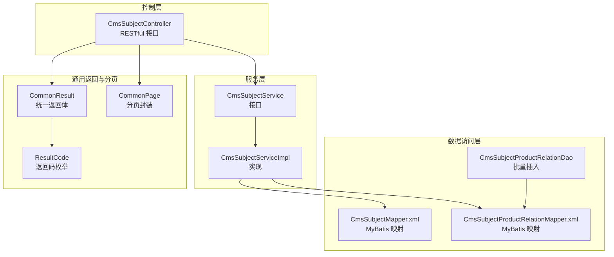
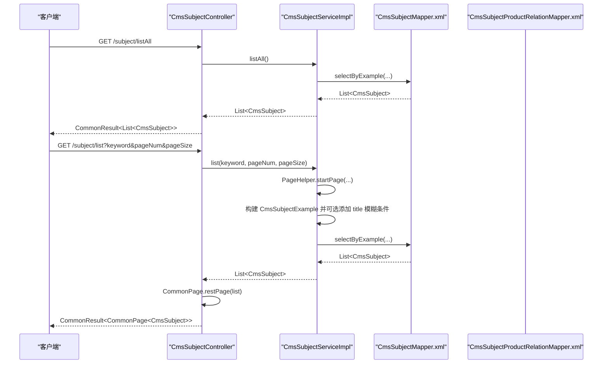
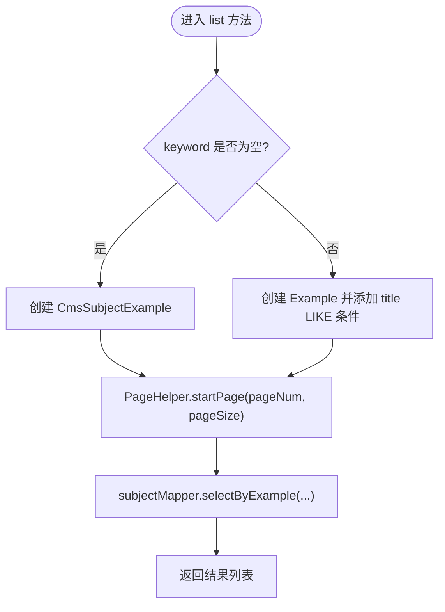
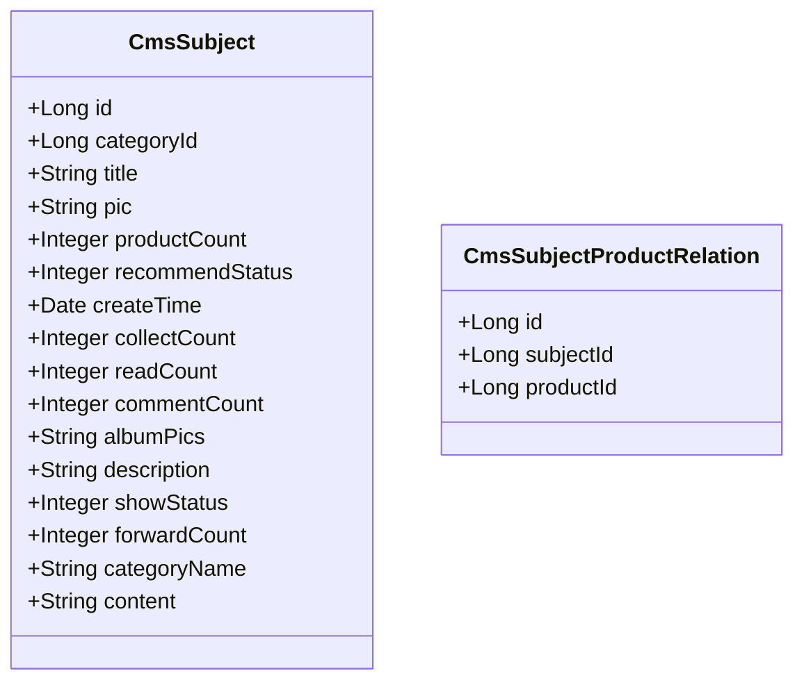
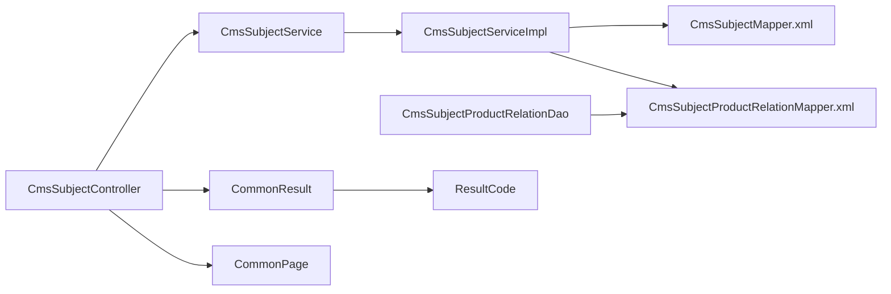

# 专题内容管理

<cite>
**本文引用的文件**
- [CmsSubjectController.java](file://mall-admin/src/main/java/com/macro/mall/controller/CmsSubjectController.java)
- [CmsSubjectService.java](file://mall-admin/src/main/java/com/macro/mall/service/CmsSubjectService.java)
- [CmsSubjectServiceImpl.java](file://mall-admin/src/main/java/com/macro/mall/service/impl/CmsSubjectServiceImpl.java)
- [CmsSubject.java](file://mall-mbg/src/main/java/com/macro/mall/model/CmsSubject.java)
- [CmsSubjectProductRelation.java](file://mall-mbg/src/main/java/com/macro/mall/model/CmsSubjectProductRelation.java)
- [CmsSubjectMapper.xml](file://mall-mbg/src/main/resources/com/macro/mall/mapper/CmsSubjectMapper.xml)
- [CmsSubjectProductRelationMapper.xml](file://mall-mbg/src/main/resources/com/macro/mall/mapper/CmsSubjectProductRelationMapper.xml)
- [CmsSubjectProductRelationDao.java](file://mall-admin/src/main/java/com/macro/mall/dao/CmsSubjectProductRelationDao.java)
- [CommonResult.java](file://mall-common/src/main/java/com/macro/mall/common/api/CommonResult.java)
- [CommonPage.java](file://mall-common/src/main/java/com/macro/mall/common/api/CommonPage.java)
- [ResultCode.java](file://mall-common/src/main/java/com/macro/mall/common/api/ResultCode.java)
- [ApiException.java](file://mall-common/src/main/java/com/macro/mall/common/exception/ApiException.java)
- [Asserts.java](file://mall-common/src/main/java/com/macro/mall/common/exception/Asserts.java)
- [mall.sql](file://document/sql/mall.sql)
</cite>

## 目录
1. [简介](#简介)
2. [项目结构](#项目结构)
3. [核心组件](#核心组件)
4. [架构总览](#架构总览)
5. [详细组件分析](#详细组件分析)
6. [依赖分析](#依赖分析)
7. [性能考虑](#性能考虑)
8. [故障排查指南](#故障排查指南)
9. [结论](#结论)
10. [附录：API 接口文档](#附录api-接口文档)

## 简介
本文件围绕“专题内容管理”主题，系统化梳理并解读以下内容：
- CmsSubjectController 的 RESTful 接口设计与调用流程
- CmsSubjectService 的业务逻辑与实现细节
- CmsSubject 数据模型字段定义与用途
- 专题与商品的关联机制（CmsSubjectProductRelation 表）
- 完整的 API 接口文档（请求参数、响应格式、错误码说明）
- 实际使用示例与最佳实践建议

## 项目结构
专题内容管理涉及三层结构：
- 控制层：CmsSubjectController 提供 RESTful 接口
- 服务层：CmsSubjectService 定义业务契约，CmsSubjectServiceImpl 实现具体逻辑
- 数据访问层：MyBatis 映射 XML 负责数据库交互；DAO 仅提供批量插入能力

图表来源
- [CmsSubjectController.java:21-43](file://mall-admin/src/main/java/com/macro/mall/controller/CmsSubjectController.java#L21-L43)
- [CmsSubjectService.java:11-21](file://mall-admin/src/main/java/com/macro/mall/service/CmsSubjectService.java#L11-L21)
- [CmsSubjectServiceImpl.java:18-38](file://mall-admin/src/main/java/com/macro/mall/service/impl/CmsSubjectServiceImpl.java#L18-L38)
- [CmsSubjectMapper.xml:1-447](file://mall-mbg/src/main/resources/com/macro/mall/mapper/CmsSubjectMapper.xml#L1-L447)
- [CmsSubjectProductRelationMapper.xml:1-179](file://mall-mbg/src/main/resources/com/macro/mall/mapper/CmsSubjectProductRelationMapper.xml#L1-L179)
- [CmsSubjectProductRelationDao.java:12-17](file://mall-admin/src/main/java/com/macro/mall/dao/CmsSubjectProductRelationDao.java#L12-L17)
- [CommonResult.java:7-134](file://mall-common/src/main/java/com/macro/mall/common/api/CommonResult.java#L7-L134)
- [CommonPage.java:12-101](file://mall-common/src/main/java/com/macro/mall/common/api/CommonPage.java#L12-L101)
- [ResultCode.java:7-29](file://mall-common/src/main/java/com/macro/mall/common/api/ResultCode.java#L7-L29)

章节来源
- [CmsSubjectController.java:21-43](file://mall-admin/src/main/java/com/macro/mall/controller/CmsSubjectController.java#L21-L43)
- [CmsSubjectService.java:11-21](file://mall-admin/src/main/java/com/macro/mall/service/CmsSubjectService.java#L11-L21)
- [CmsSubjectServiceImpl.java:18-38](file://mall-admin/src/main/java/com/macro/mall/service/impl/CmsSubjectServiceImpl.java#L18-L38)
- [CmsSubjectMapper.xml:1-447](file://mall-mbg/src/main/resources/com/macro/mall/mapper/CmsSubjectMapper.xml#L1-L447)
- [CmsSubjectProductRelationMapper.xml:1-179](file://mall-mbg/src/main/resources/com/macro/mall/mapper/CmsSubjectProductRelationMapper.xml#L1-L179)
- [CmsSubjectProductRelationDao.java:12-17](file://mall-admin/src/main/java/com/macro/mall/dao/CmsSubjectProductRelationDao.java#L12-L17)
- [CommonResult.java:7-134](file://mall-common/src/main/java/com/macro/mall/common/api/CommonResult.java#L7-L134)
- [CommonPage.java:12-101](file://mall-common/src/main/java/com/macro/mall/common/api/CommonPage.java#L12-L101)
- [ResultCode.java:7-29](file://mall-common/src/main/java/com/macro/mall/common/api/ResultCode.java#L7-L29)

## 核心组件
- 控制器：提供专题内容的全量列表与分页列表查询接口
- 服务接口与实现：封装查询逻辑，支持关键字模糊匹配与分页
- 数据模型：专题实体与专题-商品关联实体
- MyBatis 映射：完成数据库 CRUD 与条件查询
- 统一返回与分页：标准化响应结构与分页封装

章节来源
- [CmsSubjectController.java:21-43](file://mall-admin/src/main/java/com/macro/mall/controller/CmsSubjectController.java#L21-L43)
- [CmsSubjectService.java:11-21](file://mall-admin/src/main/java/com/macro/mall/service/CmsSubjectService.java#L11-L21)
- [CmsSubjectServiceImpl.java:18-38](file://mall-admin/src/main/java/com/macro/mall/service/impl/CmsSubjectServiceImpl.java#L18-L38)
- [CmsSubject.java:6-39](file://mall-mbg/src/main/java/com/macro/mall/model/CmsSubject.java#L6-L39)
- [CmsSubjectProductRelation.java:5-12](file://mall-mbg/src/main/java/com/macro/mall/model/CmsSubjectProductRelation.java#L5-L12)
- [CmsSubjectMapper.xml:1-447](file://mall-mbg/src/main/resources/com/macro/mall/mapper/CmsSubjectMapper.xml#L1-L447)
- [CmsSubjectProductRelationMapper.xml:1-179](file://mall-mbg/src/main/resources/com/macro/mall/mapper/CmsSubjectProductRelationMapper.xml#L1-L179)
- [CommonResult.java:7-134](file://mall-common/src/main/java/com/macro/mall/common/api/CommonResult.java#L7-L134)
- [CommonPage.java:12-101](file://mall-common/src/main/java/com/macro/mall/common/api/CommonPage.java#L12-L101)

## 架构总览
下图展示从控制器到服务再到数据访问的整体调用链路。

图表来源
- [CmsSubjectController.java:28-42](file://mall-admin/src/main/java/com/macro/mall/controller/CmsSubjectController.java#L28-L42)
- [CmsSubjectServiceImpl.java:23-37](file://mall-admin/src/main/java/com/macro/mall/service/impl/CmsSubjectServiceImpl.java#L23-L37)
- [CmsSubjectMapper.xml:105-118](file://mall-mbg/src/main/resources/com/macro/mall/mapper/CmsSubjectMapper.xml#L105-L118)

## 详细组件分析

### 控制器：CmsSubjectController
- 接口路径与方法
  - GET /subject/listAll：获取全部专题列表
  - GET /subject/list：分页查询专题，支持关键字过滤
- 关键点
  - 使用统一返回体 CommonResult 包装结果
  - 列表查询通过 CommonPage.restPage 进行分页封装
  - 关键字 keyword 支持模糊匹配（由服务层拼接 %）

章节来源
- [CmsSubjectController.java:28-42](file://mall-admin/src/main/java/com/macro/mall/controller/CmsSubjectController.java#L28-L42)
- [CommonResult.java:35-47](file://mall-common/src/main/java/com/macro/mall/common/api/CommonResult.java#L35-L47)
- [CommonPage.java:37-46](file://mall-common/src/main/java/com/macro/mall/common/api/CommonPage.java#L37-L46)

### 服务层：CmsSubjectService 与 CmsSubjectServiceImpl
- 契约方法
  - listAll()：查询全部专题
  - list(keyword, pageNum, pageSize)：按关键字分页查询
- 实现要点
  - 使用 PageHelper 进行分页
  - 若 keyword 非空，则对 title 字段进行 LIKE 模糊匹配
  - 返回 CmsSubject 列表（包含 BLOB 字段 content）

图表来源
- [CmsSubjectServiceImpl.java:23-37](file://mall-admin/src/main/java/com/macro/mall/service/impl/CmsSubjectServiceImpl.java#L23-L37)
- [CmsSubjectMapper.xml:105-118](file://mall-mbg/src/main/resources/com/macro/mall/mapper/CmsSubjectMapper.xml#L105-L118)

章节来源
- [CmsSubjectService.java:11-21](file://mall-admin/src/main/java/com/macro/mall/service/CmsSubjectService.java#L11-L21)
- [CmsSubjectServiceImpl.java:18-38](file://mall-admin/src/main/java/com/macro/mall/service/impl/CmsSubjectServiceImpl.java#L18-L38)

### 数据模型：CmsSubject 与 CmsSubjectProductRelation
- CmsSubject 字段概览（部分）
  - 主键 id、分类 id categoryId、标题 title、封面 pic、商品数量 productCount、推荐状态 recommendStatus、创建时间 createTime、收藏数 collectCount、阅读数 readCount、评论数 commentCount、相册图集 albumPics、描述 description、显示状态 showStatus、转发数 forwardCount、分类名称 categoryName、正文 content（BLOB）
- CmsSubjectProductRelation 字段概览
  - 主键 id、subjectId、productId

图表来源
- [CmsSubject.java:6-39](file://mall-mbg/src/main/java/com/macro/mall/model/CmsSubject.java#L6-L39)
- [CmsSubjectProductRelation.java:5-12](file://mall-mbg/src/main/java/com/macro/mall/model/CmsSubjectProductRelation.java#L5-L12)

章节来源
- [CmsSubject.java:6-39](file://mall-mbg/src/main/java/com/macro/mall/model/CmsSubject.java#L6-L39)
- [CmsSubjectProductRelation.java:5-12](file://mall-mbg/src/main/java/com/macro/mall/model/CmsSubjectProductRelation.java#L5-L12)

### 数据访问层：MyBatis 映射与 DAO
- CmsSubjectMapper.xml
  - 提供基础列与 BLOB 列的查询映射
  - 支持按 Example 条件查询、分页、更新等
- CmsSubjectProductRelationMapper.xml
  - 提供专题-商品关联的查询、插入、删除、更新
- CmsSubjectProductRelationDao
  - 提供批量插入接口 insertList，便于批量建立专题与商品的关联

章节来源
- [CmsSubjectMapper.xml:1-447](file://mall-mbg/src/main/resources/com/macro/mall/mapper/CmsSubjectMapper.xml#L1-L447)
- [CmsSubjectProductRelationMapper.xml:1-179](file://mall-mbg/src/main/resources/com/macro/mall/mapper/CmsSubjectProductRelationMapper.xml#L1-L179)
- [CmsSubjectProductRelationDao.java:12-17](file://mall-admin/src/main/java/com/macro/mall/dao/CmsSubjectProductRelationDao.java#L12-L17)

### 专题与商品关联机制
- 关联表 cms_subject_product_relation 存储 subjectId 与 productId 的多对多关系
- 典型场景
  - 为某个专题批量绑定多个商品
  - 查询某专题下的所有商品
  - 删除专题时清理关联或转移关联
- 示例数据
  - 参考 SQL 文件中的插入记录，体现多专题多商品的关联关系

章节来源
- [CmsSubjectProductRelationMapper.xml:70-106](file://mall-mbg/src/main/resources/com/macro/mall/mapper/CmsSubjectProductRelationMapper.xml#L70-L106)
- [CmsSubjectProductRelationDao.java:12-17](file://mall-admin/src/main/java/com/macro/mall/dao/CmsSubjectProductRelationDao.java#L12-L17)
- [mall.sql:206-221](file://document/sql/mall.sql#L206-L221)

## 依赖分析
- 控制器依赖服务接口
- 服务实现依赖 Mapper 与 PageHelper
- 统一返回体与分页封装独立于业务逻辑
- 异常处理通过 ApiException 与 Asserts 提供

图表来源
- [CmsSubjectController.java:21-43](file://mall-admin/src/main/java/com/macro/mall/controller/CmsSubjectController.java#L21-L43)
- [CmsSubjectService.java:11-21](file://mall-admin/src/main/java/com/macro/mall/service/CmsSubjectService.java#L11-L21)
- [CmsSubjectServiceImpl.java:18-38](file://mall-admin/src/main/java/com/macro/mall/service/impl/CmsSubjectServiceImpl.java#L18-L38)
- [CmsSubjectMapper.xml:1-447](file://mall-mbg/src/main/resources/com/macro/mall/mapper/CmsSubjectMapper.xml#L1-L447)
- [CmsSubjectProductRelationMapper.xml:1-179](file://mall-mbg/src/main/resources/com/macro/mall/mapper/CmsSubjectProductRelationMapper.xml#L1-L179)
- [CmsSubjectProductRelationDao.java:12-17](file://mall-admin/src/main/java/com/macro/mall/dao/CmsSubjectProductRelationDao.java#L12-L17)
- [CommonResult.java:7-134](file://mall-common/src/main/java/com/macro/mall/common/api/CommonResult.java#L7-L134)
- [CommonPage.java:12-101](file://mall-common/src/main/java/com/macro/mall/common/api/CommonPage.java#L12-L101)
- [ResultCode.java:7-29](file://mall-common/src/main/java/com/macro/mall/common/api/ResultCode.java#L7-L29)

## 性能考虑
- 分页查询
  - 使用 PageHelper 对列表查询进行分页，避免一次性加载大量数据
- 模糊查询
  - keyword 采用 title LIKE 模糊匹配，建议在 title 上建立索引以提升查询效率
- BLOB 字段
  - content 为大文本字段，分页查询通常只取基础字段；如需 content，请单独按主键查询
- 批量插入
  - 专题-商品关联建议使用 DAO 的批量插入接口，减少多次往返数据库

## 故障排查指南
- 统一返回码
  - 成功：200
  - 失败：500
  - 参数校验失败：404
  - 未登录/过期：401
  - 无权限：403
- 常见问题定位
  - 接口返回 500：检查服务层异常是否被 ApiException 捕获并包装
  - 分页不生效：确认 pageNum/pageSize 是否传入且 PageHelper 已正确设置
  - 关键字查询无结果：确认 keyword 是否为空以及数据库中是否存在匹配的 title

章节来源
- [ResultCode.java:7-29](file://mall-common/src/main/java/com/macro/mall/common/api/ResultCode.java#L7-L29)
- [CommonResult.java:53-79](file://mall-common/src/main/java/com/macro/mall/common/api/CommonResult.java#L53-L79)
- [ApiException.java:9-32](file://mall-common/src/main/java/com/macro/mall/common/exception/ApiException.java#L9-L32)
- [Asserts.java:9-17](file://mall-common/src/main/java/com/macro/mall/common/exception/Asserts.java#L9-L17)

## 结论
本专题内容管理模块以清晰的分层架构实现了专题的增删改查、列表查询与关键字搜索，并通过统一返回体与分页封装提升了接口的一致性与可用性。专题与商品的关联通过独立的关系表与批量插入能力实现灵活扩展。建议在生产环境中配合索引优化与缓存策略进一步提升性能。

## 附录：API 接口文档

### 1. 获取全部专题列表
- 请求
  - 方法：GET
  - 路径：/subject/listAll
- 响应
  - 数据类型：CommonResult<List<CmsSubject>>
  - 字段说明：data 为 CmsSubject 列表
- 示例
  - 成功响应：data 为非空数组
  - 失败响应：code=500，message 为错误信息

章节来源
- [CmsSubjectController.java:28-33](file://mall-admin/src/main/java/com/macro/mall/controller/CmsSubjectController.java#L28-L33)
- [CommonResult.java:35-47](file://mall-common/src/main/java/com/macro/mall/common/api/CommonResult.java#L35-L47)

### 2. 分页查询专题（支持关键字搜索）
- 请求
  - 方法：GET
  - 路径：/subject/list
  - 查询参数：
    - keyword：字符串，可选，用于按标题模糊搜索
    - pageNum：整数，默认 1
    - pageSize：整数，默认 5
- 响应
  - 数据类型：CommonResult<CommonPage<CmsSubject>>
  - 字段说明：
    - data.pageNum：当前页码
    - data.pageSize：每页数量
    - data.totalPage：总页数
    - data.total：总条数
    - data.list：当前页数据列表
- 示例
  - 成功响应：data.list 为专题列表
  - 失败响应：code=500，message 为错误信息

章节来源
- [CmsSubjectController.java:35-42](file://mall-admin/src/main/java/com/macro/mall/controller/CmsSubjectController.java#L35-L42)
- [CommonPage.java:37-59](file://mall-common/src/main/java/com/macro/mall/common/api/CommonPage.java#L37-L59)
- [CommonResult.java:35-47](file://mall-common/src/main/java/com/macro/mall/common/api/CommonResult.java#L35-L47)

### 3. 专题与商品关联（批量插入）
- 请求
  - 方法：POST/PUT（建议通过后台管理接口进行批量维护）
  - 路径：由后台管理接口提供（批量插入专题-商品关联）
  - 参数：List<CmsSubjectProductRelation>
- 响应
  - 数据类型：CommonResult<Integer>（返回受影响的记录数）
- 示例
  - 成功响应：data 为批量插入的记录数
  - 失败响应：code=500，message 为错误信息

章节来源
- [CmsSubjectProductRelationDao.java:12-17](file://mall-admin/src/main/java/com/macro/mall/dao/CmsSubjectProductRelationDao.java#L12-L17)
- [CmsSubjectProductRelationMapper.xml:100-106](file://mall-mbg/src/main/resources/com/macro/mall/mapper/CmsSubjectProductRelationMapper.xml#L100-L106)
- [CommonResult.java:35-47](file://mall-common/src/main/java/com/macro/mall/common/api/CommonResult.java#L35-L47)

### 4. 错误码说明
- 200：操作成功
- 500：操作失败
- 404：参数校验失败
- 401：未登录或 token 已过期
- 403：没有相关权限

章节来源
- [ResultCode.java:7-29](file://mall-common/src/main/java/com/macro/mall/common/api/ResultCode.java#L7-L29)