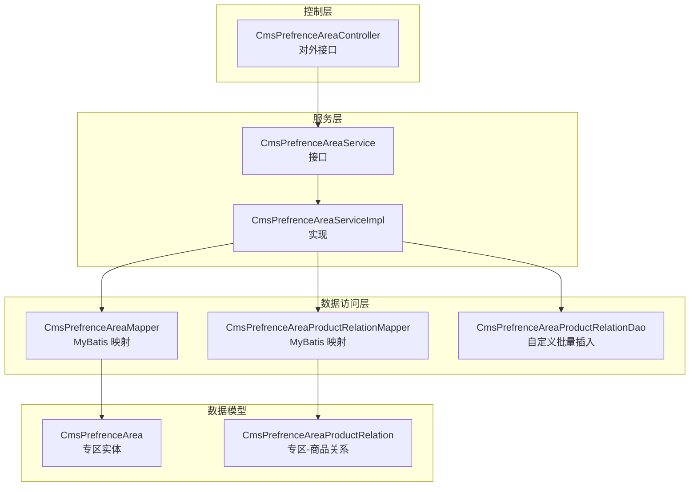
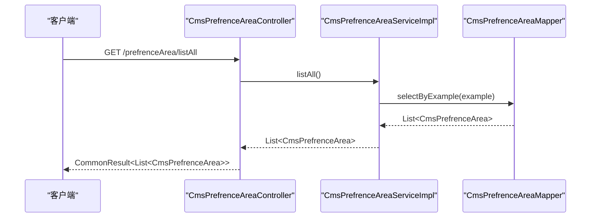
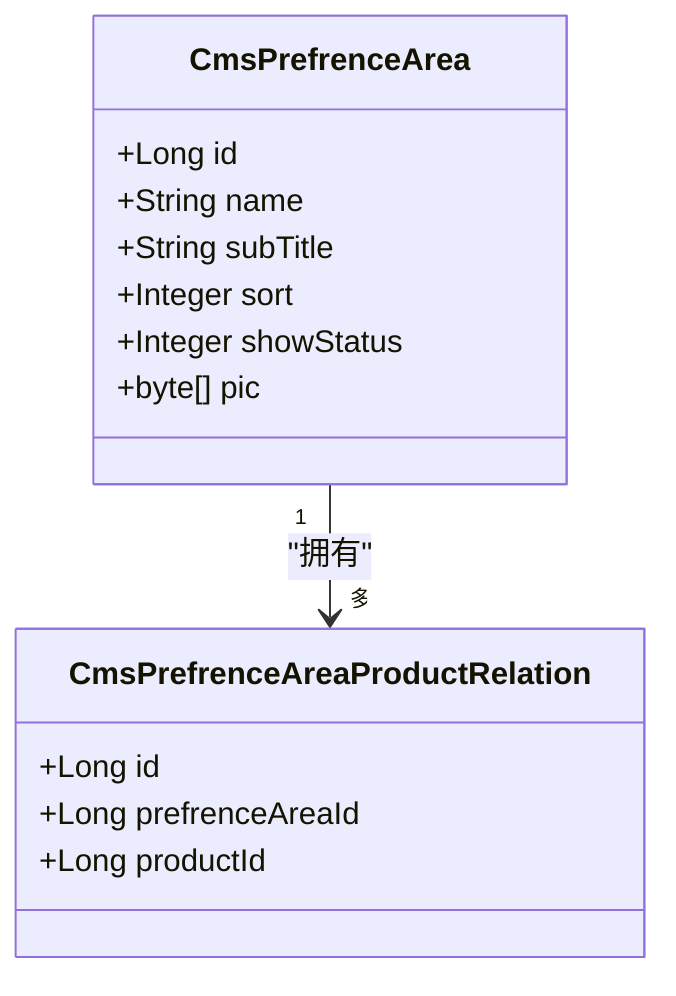
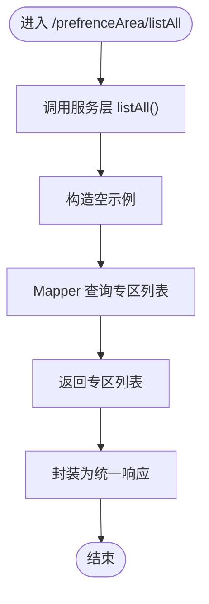
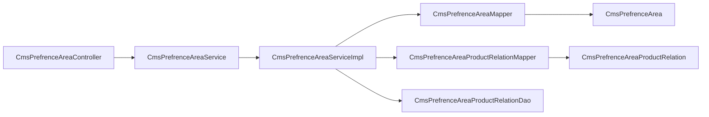

# 优选专区管理

<cite>
**本文引用的文件**
- [CmsPrefrenceAreaController.java](file://mall-admin/src/main/java/com/macro/mall/controller/CmsPrefrenceAreaController.java)
- [CmsPrefrenceAreaService.java](file://mall-admin/src/main/java/com/macro/mall/service/CmsPrefrenceAreaService.java)
- [CmsPrefrenceAreaServiceImpl.java](file://mall-admin/src/main/java/com/macro/mall/service/impl/CmsPrefrenceAreaServiceImpl.java)
- [CmsPrefrenceAreaMapper.java](file://mall-mbg/src/main/java/com/macro/mall/mapper/CmsPrefrenceAreaMapper.java)
- [CmsPrefrenceArea.java](file://mall-mbg/src/main/java/com/macro/mall/model/CmsPrefrenceArea.java)
- [CmsPrefrenceAreaMapper.xml](file://mall-mbg/src/main/resources/com/macro/mall/mapper/CmsPrefrenceAreaMapper.xml)
- [CmsPrefrenceAreaProductRelationDao.java](file://mall-admin/src/main/java/com/macro/mall/dao/CmsPrefrenceAreaProductRelationDao.java)
- [CmsPrefrenceAreaProductRelationMapper.java](file://mall-mbg/src/main/java/com/macro/mall/mapper/CmsPrefrenceAreaProductRelationMapper.java)
- [CmsPrefrenceAreaProductRelation.java](file://mall-mbg/src/main/java/com/macro/mall/model/CmsPrefrenceAreaProductRelation.java)
- [CmsPrefrenceAreaProductRelationMapper.xml](file://mall-mbg/src/main/resources/com/macro/mall/mapper/CmsPrefrenceAreaProductRelationMapper.xml)
- [PmsProductDao.xml](file://mall-admin/src/main/resources/dao/PmsProductDao.xml)
- [mall.sql](file://document/sql/mall.sql)
</cite>

## 目录
1. [简介](#简介)
2. [项目结构](#项目结构)
3. [核心组件](#核心组件)
4. [架构总览](#架构总览)
5. [详细组件分析](#详细组件分析)
6. [依赖分析](#依赖分析)
7. [性能考虑](#性能考虑)
8. [故障排查指南](#故障排查指南)
9. [结论](#结论)
10. [附录](#附录)

## 简介
本文件面向“优选专区管理”模块，系统化梳理从接口到服务再到数据模型与关系表的全链路实现，重点覆盖：
- RESTful 接口设计与使用说明（当前已实现“查询全部”）
- 服务层业务逻辑（专区配置管理、商品推荐关系维护）
- 数据模型设计（专区基本信息、标题、展示图片、排序与状态）
- 专区与商品的关联机制（关系表、批量写入、查询）
- 完整 API 接口文档（请求路径、参数、返回结构）
- 运营配置最佳实践与常见问题处理建议

## 项目结构
优选专区管理涉及三层结构：
- 控制层：负责对外暴露 RESTful 接口
- 服务层：封装业务逻辑，协调数据访问
- 数据访问层：MyBatis Mapper/DAO 负责数据库操作

图表来源
- [CmsPrefrenceAreaController.java:1-33](file://mall-admin/src/main/java/com/macro/mall/controller/CmsPrefrenceAreaController.java#L1-L33)
- [CmsPrefrenceAreaService.java:1-17](file://mall-admin/src/main/java/com/macro/mall/service/CmsPrefrenceAreaService.java#L1-L17)
- [CmsPrefrenceAreaServiceImpl.java:1-26](file://mall-admin/src/main/java/com/macro/mall/service/impl/CmsPrefrenceAreaServiceImpl.java#L1-L26)
- [CmsPrefrenceAreaMapper.java:1-36](file://mall-mbg/src/main/java/com/macro/mall/mapper/CmsPrefrenceAreaMapper.java#L1-L36)
- [CmsPrefrenceAreaProductRelationMapper.java:1-30](file://mall-mbg/src/main/java/com/macro/mall/mapper/CmsPrefrenceAreaProductRelationMapper.java#L1-L30)
- [CmsPrefrenceAreaProductRelationDao.java:1-18](file://mall-admin/src/main/java/com/macro/mall/dao/CmsPrefrenceAreaProductRelationDao.java#L1-L18)
- [CmsPrefrenceArea.java:1-84](file://mall-mbg/src/main/java/com/macro/mall/model/CmsPrefrenceArea.java#L1-L84)
- [CmsPrefrenceAreaProductRelation.java:1-51](file://mall-mbg/src/main/java/com/macro/mall/model/CmsPrefrenceAreaProductRelation.java#L1-L51)

章节来源
- [CmsPrefrenceAreaController.java:1-33](file://mall-admin/src/main/java/com/macro/mall/controller/CmsPrefrenceAreaController.java#L1-L33)
- [CmsPrefrenceAreaService.java:1-17](file://mall-admin/src/main/java/com/macro/mall/service/CmsPrefrenceAreaService.java#L1-L17)
- [CmsPrefrenceAreaServiceImpl.java:1-26](file://mall-admin/src/main/java/com/macro/mall/service/impl/CmsPrefrenceAreaServiceImpl.java#L1-L26)
- [CmsPrefrenceAreaMapper.java:1-36](file://mall-mbg/src/main/java/com/macro/mall/mapper/CmsPrefrenceAreaMapper.java#L1-L36)
- [CmsPrefrenceAreaProductRelationMapper.java:1-30](file://mall-mbg/src/main/java/com/macro/mall/mapper/CmsPrefrenceAreaProductRelationMapper.java#L1-L30)
- [CmsPrefrenceAreaProductRelationDao.java:1-18](file://mall-admin/src/main/java/com/macro/mall/dao/CmsPrefrenceAreaProductRelationDao.java#L1-L18)
- [CmsPrefrenceArea.java:1-84](file://mall-mbg/src/main/java/com/macro/mall/model/CmsPrefrenceArea.java#L1-L84)
- [CmsPrefrenceAreaProductRelation.java:1-51](file://mall-mbg/src/main/java/com/macro/mall/model/CmsPrefrenceAreaProductRelation.java#L1-L51)

## 核心组件
- 控制器：提供对外 RESTful 接口，当前实现“查询全部专区”
- 服务接口与实现：封装业务逻辑，当前实现“查询全部专区”
- Mapper/DAO：MyBatis 映射与自定义批量插入
- 实体模型：专区与专区-商品关系的数据结构

章节来源
- [CmsPrefrenceAreaController.java:26-31](file://mall-admin/src/main/java/com/macro/mall/controller/CmsPrefrenceAreaController.java#L26-L31)
- [CmsPrefrenceAreaService.java:11-16](file://mall-admin/src/main/java/com/macro/mall/service/CmsPrefrenceAreaService.java#L11-L16)
- [CmsPrefrenceAreaServiceImpl.java:22-24](file://mall-admin/src/main/java/com/macro/mall/service/impl/CmsPrefrenceAreaServiceImpl.java#L22-L24)
- [CmsPrefrenceAreaMapper.java:19-21](file://mall-mbg/src/main/java/com/macro/mall/mapper/CmsPrefrenceAreaMapper.java#L19-L21)
- [CmsPrefrenceAreaProductRelationDao.java:12-16](file://mall-admin/src/main/java/com/macro/mall/dao/CmsPrefrenceAreaProductRelationDao.java#L12-L16)

## 架构总览
优选专区管理采用经典的分层架构：
- 控制层接收请求，调用服务层
- 服务层通过 Mapper/DAO 访问数据库
- 实体模型承载数据结构，XML 映射文件定义 SQL

图表来源
- [CmsPrefrenceAreaController.java:26-31](file://mall-admin/src/main/java/com/macro/mall/controller/CmsPrefrenceAreaController.java#L26-L31)
- [CmsPrefrenceAreaServiceImpl.java:22-24](file://mall-admin/src/main/java/com/macro/mall/service/impl/CmsPrefrenceAreaServiceImpl.java#L22-L24)
- [CmsPrefrenceAreaMapper.java:19-21](file://mall-mbg/src/main/java/com/macro/mall/mapper/CmsPrefrenceAreaMapper.java#L19-L21)

## 详细组件分析

### 控制器：CmsPrefrenceAreaController
- 功能：对外提供“查询全部优选专区”的接口
- 路径：GET /prefrenceArea/listAll
- 返回：统一结果包装对象，包含专区列表

章节来源
- [CmsPrefrenceAreaController.java:26-31](file://mall-admin/src/main/java/com/macro/mall/controller/CmsPrefrenceAreaController.java#L26-L31)

### 服务层：CmsPrefrenceAreaService 与 CmsPrefrenceAreaServiceImpl
- 接口职责：定义“查询全部专区”的能力
- 实现逻辑：构造空条件示例，委托 Mapper 查询

章节来源
- [CmsPrefrenceAreaService.java:11-16](file://mall-admin/src/main/java/com/macro/mall/service/CmsPrefrenceAreaService.java#L11-L16)
- [CmsPrefrenceAreaServiceImpl.java:22-24](file://mall-admin/src/main/java/com/macro/mall/service/impl/CmsPrefrenceAreaServiceImpl.java#L22-L24)

### 数据访问层：CmsPrefrenceAreaMapper 与 XML 映射
- 查询：支持按 Example 条件查询，含 BLOB 字段查询
- 插入/更新：支持选择性字段插入与更新，含 BLOB 字段

章节来源
- [CmsPrefrenceAreaMapper.java:19-21](file://mall-mbg/src/main/java/com/macro/mall/mapper/CmsPrefrenceAreaMapper.java#L19-L21)
- [CmsPrefrenceAreaMapper.xml:114-268](file://mall-mbg/src/main/resources/com/macro/mall/mapper/CmsPrefrenceAreaMapper.xml#L114-L268)

### 关系表 DAO：CmsPrefrenceAreaProductRelationDao
- 批量插入：提供 insertList 方法，用于批量写入专区-商品关系

章节来源
- [CmsPrefrenceAreaProductRelationDao.java:12-16](file://mall-admin/src/main/java/com/macro/mall/dao/CmsPrefrenceAreaProductRelationDao.java#L12-L16)

### 关系映射：CmsPrefrenceAreaProductRelationMapper 与 XML
- 基础 CRUD：支持按主键、示例查询与更新
- 批量插入：支持选择性字段插入

章节来源
- [CmsPrefrenceAreaProductRelationMapper.java:19-21](file://mall-mbg/src/main/java/com/macro/mall/mapper/CmsPrefrenceAreaProductRelationMapper.java#L19-L21)
- [CmsPrefrenceAreaProductRelationMapper.xml:70-143](file://mall-mbg/src/main/resources/com/macro/mall/mapper/CmsPrefrenceAreaProductRelationMapper.xml#L70-L143)

### 数据模型：CmsPrefrenceArea 与 CmsPrefrenceAreaProductRelation
- 专区实体：包含标识、名称、副标题、排序、展示状态、展示图片等字段
- 关系实体：包含标识、专区标识、商品标识

章节来源
- [CmsPrefrenceArea.java:5-18](file://mall-mbg/src/main/java/com/macro/mall/model/CmsPrefrenceArea.java#L5-L18)
- [CmsPrefrenceAreaProductRelation.java:5-12](file://mall-mbg/src/main/java/com/macro/mall/model/CmsPrefrenceAreaProductRelation.java#L5-L12)

### 商品侧查询入口：PmsProductDao.xml
- 提供按商品 ID 查询其所在专区关系的 SQL 片段，便于运营后台或前台查询商品所属专区

章节来源
- [PmsProductDao.xml:38-43](file://mall-admin/src/main/resources/dao/PmsProductDao.xml#L38-L43)

### 数据库结构：mall.sql
- 专区表：包含主键、名称、副标题、展示图片、排序、展示状态
- 关系表：包含主键、专区标识、商品标识

章节来源
- [mall.sql:80-121](file://document/sql/mall.sql#L80-L121)

### 类图：数据模型与关系

图表来源
- [CmsPrefrenceArea.java:5-18](file://mall-mbg/src/main/java/com/macro/mall/model/CmsPrefrenceArea.java#L5-L18)
- [CmsPrefrenceAreaProductRelation.java:5-12](file://mall-mbg/src/main/java/com/macro/mall/model/CmsPrefrenceAreaProductRelation.java#L5-L12)

### 流程图：查询全部专区流程

图表来源
- [CmsPrefrenceAreaController.java:26-31](file://mall-admin/src/main/java/com/macro/mall/controller/CmsPrefrenceAreaController.java#L26-L31)
- [CmsPrefrenceAreaServiceImpl.java:22-24](file://mall-admin/src/main/java/com/macro/mall/service/impl/CmsPrefrenceAreaServiceImpl.java#L22-L24)
- [CmsPrefrenceAreaMapper.java:19-21](file://mall-mbg/src/main/java/com/macro/mall/mapper/CmsPrefrenceAreaMapper.java#L19-L21)

## 依赖分析
- 控制器依赖服务接口
- 服务实现依赖 Mapper 与 DAO
- Mapper 依赖实体模型
- 关系 DAO 与 Mapper 共同支撑专区-商品关系的批量写入与查询

图表来源
- [CmsPrefrenceAreaController.java:23-24](file://mall-admin/src/main/java/com/macro/mall/controller/CmsPrefrenceAreaController.java#L23-L24)
- [CmsPrefrenceAreaServiceImpl.java:18-19](file://mall-admin/src/main/java/com/macro/mall/service/impl/CmsPrefrenceAreaServiceImpl.java#L18-L19)
- [CmsPrefrenceAreaMapper.java:3-5](file://mall-mbg/src/main/java/com/macro/mall/mapper/CmsPrefrenceAreaMapper.java#L3-L5)
- [CmsPrefrenceAreaProductRelationMapper.java:3-5](file://mall-mbg/src/main/java/com/macro/mall/mapper/CmsPrefrenceAreaProductRelationMapper.java#L3-L5)
- [CmsPrefrenceAreaProductRelationDao.java:3-4](file://mall-admin/src/main/java/com/macro/mall/dao/CmsPrefrenceAreaProductRelationDao.java#L3-L4)

章节来源
- [CmsPrefrenceAreaController.java:23-24](file://mall-admin/src/main/java/com/macro/mall/controller/CmsPrefrenceAreaController.java#L23-L24)
- [CmsPrefrenceAreaServiceImpl.java:18-19](file://mall-admin/src/main/java/com/macro/mall/service/impl/CmsPrefrenceAreaServiceImpl.java#L18-L19)
- [CmsPrefrenceAreaMapper.java:3-5](file://mall-mbg/src/main/java/com/macro/mall/mapper/CmsPrefrenceAreaMapper.java#L3-L5)
- [CmsPrefrenceAreaProductRelationMapper.java:3-5](file://mall-mbg/src/main/java/com/macro/mall/mapper/CmsPrefrenceAreaProductRelationMapper.java#L3-L5)
- [CmsPrefrenceAreaProductRelationDao.java:3-4](file://mall-admin/src/main/java/com/macro/mall/dao/CmsPrefrenceAreaProductRelationDao.java#L3-L4)

## 性能考虑
- 查询优化：使用示例查询时避免不必要的 BLOB 字段加载，必要时在 Mapper 中指定列
- 批量写入：关系表批量插入建议使用 JDBC 批处理以减少往返
- 缓存策略：对热点专区列表可引入缓存，降低数据库压力
- 分页与排序：若未来扩展分页/排序，建议在 Mapper 层增加对应参数与索引

## 故障排查指南
- 接口 404/405：确认请求路径是否为 GET /prefrenceArea/listAll
- 返回空列表：检查数据库中是否存在专区记录
- 图片字段异常：确认存储介质与访问权限，以及序列化/反序列化处理
- 批量插入失败：检查传入关系列表的合法性与重复性，确保主键自增可用

## 结论
当前模块已完成“查询全部优选专区”的基础能力，后续可在此基础上扩展：
- 新增/编辑/删除专区接口
- 区域商品推荐算法与权重计算
- 展示位置控制与排序策略
- 关系表的批量导入与校验工具

## 附录

### API 接口文档

- 基础信息
  - 控制器类：CmsPrefrenceAreaController
  - 命名空间：/prefrenceArea

- 查询全部专区
  - 方法：GET
  - 路径：/prefrenceArea/listAll
  - 请求参数：无
  - 返回值：统一结果对象，包含专区列表
  - 返回字段说明：
    - id：专区标识
    - name：专区名称
    - subTitle：副标题
    - sort：排序
    - showStatus：展示状态
    - pic：展示图片（二进制）

章节来源
- [CmsPrefrenceAreaController.java:26-31](file://mall-admin/src/main/java/com/macro/mall/controller/CmsPrefrenceAreaController.java#L26-L31)
- [CmsPrefrenceArea.java:5-18](file://mall-mbg/src/main/java/com/macro/mall/model/CmsPrefrenceArea.java#L5-L18)

### 数据模型定义

- 专区实体（CmsPrefrenceArea）
  - 字段：id、name、subTitle、sort、showStatus、pic
  - 复杂度：查询为 O(n)，更新为 O(1)
  - 索引：主键 id

- 关系实体（CmsPrefrenceAreaProductRelation）
  - 字段：id、prefrenceAreaId、productId
  - 复杂度：查询为 O(n)，批量插入为 O(k)
  - 索引：主键 id

章节来源
- [CmsPrefrenceArea.java:5-18](file://mall-mbg/src/main/java/com/macro/mall/model/CmsPrefrenceArea.java#L5-L18)
- [CmsPrefrenceAreaProductRelation.java:5-12](file://mall-mbg/src/main/java/com/macro/mall/model/CmsPrefrenceAreaProductRelation.java#L5-L12)

### 专区与商品关联机制

- 关联表结构
  - 表名：cms_prefrence_area_product_relation
  - 字段：id、prefrence_area_id、product_id

- 关系维护
  - 批量插入：通过 CmsPrefrenceAreaProductRelationDao.insertList 实现
  - 单条查询：通过 CmsPrefrenceAreaProductRelationMapper.selectByPrimaryKey
  - 按商品查询专区关系：通过 PmsProductDao.xml 的 SQL 片段

- 推荐算法与权重
  - 当前代码未实现具体算法，可在服务层扩展：基于销量、评价、价格区间、标签等维度加权排序
  - 建议：引入评分函数与缓存策略，提升推荐效率

章节来源
- [mall.sql:100-121](file://document/sql/mall.sql#L100-L121)
- [CmsPrefrenceAreaProductRelationDao.java:12-16](file://mall-admin/src/main/java/com/macro/mall/dao/CmsPrefrenceAreaProductRelationDao.java#L12-L16)
- [CmsPrefrenceAreaProductRelationMapper.java:21](file://mall-mbg/src/main/java/com/macro/mall/mapper/CmsPrefrenceAreaProductRelationMapper.java#L21)
- [PmsProductDao.xml:41-43](file://mall-admin/src/main/resources/dao/PmsProductDao.xml#L41-L43)

### 展示位置控制
- 当前实现仅提供查询接口，展示位置控制可通过以下方式扩展：
  - 在专区实体中增加位置标识字段
  - 在服务层按位置与排序字段返回专区列表
  - 在前端按位置渲染不同区域

章节来源
- [CmsPrefrenceArea.java:12-16](file://mall-mbg/src/main/java/com/macro/mall/model/CmsPrefrenceArea.java#L12-L16)

### 最佳实践
- 接口幂等：新增/编辑接口应保证幂等性，避免重复创建
- 参数校验：对必填字段进行校验，对非法输入返回明确错误
- 批量操作：批量导入时先做去重与校验，再执行事务性写入
- 缓存与降级：热点数据加入缓存，数据库异常时提供降级策略
- 日志与监控：记录关键操作日志，埋点统计推荐点击率与转化率

### 常见问题
- 图片无法显示：检查 pic 字段是否为空，以及访问路径与权限
- 商品未出现在专区：确认关系表中是否存在对应记录
- 排序不生效：确认 sort 字段是否正确设置，以及查询时的排序条件