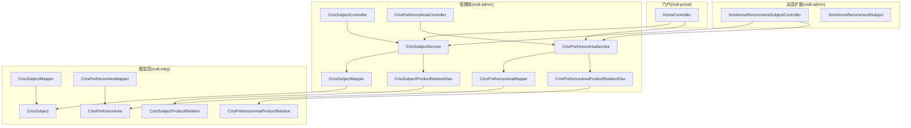
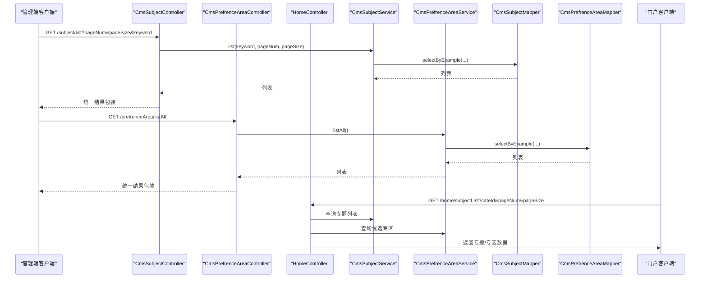
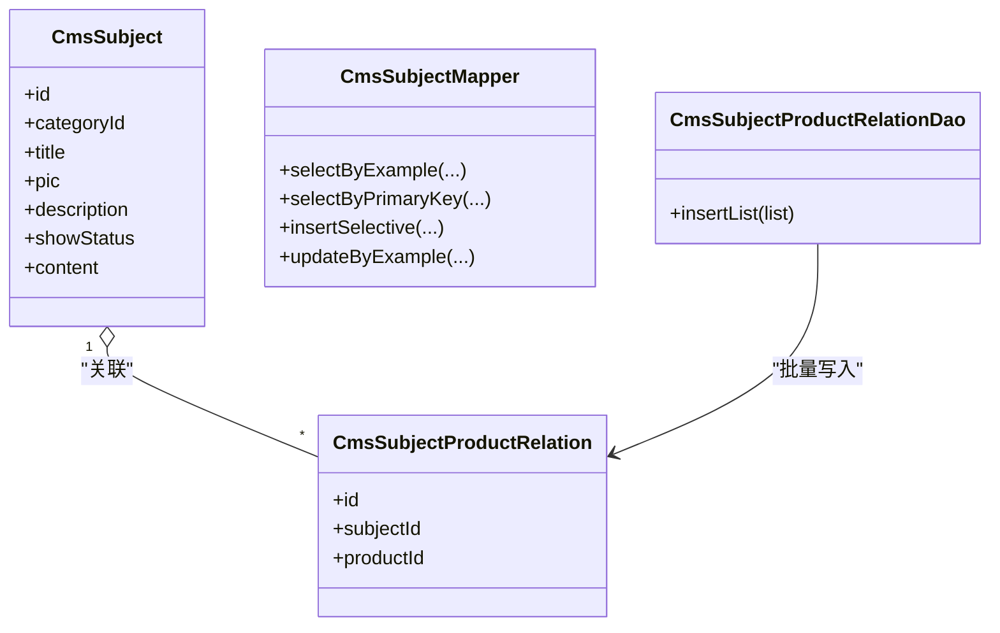
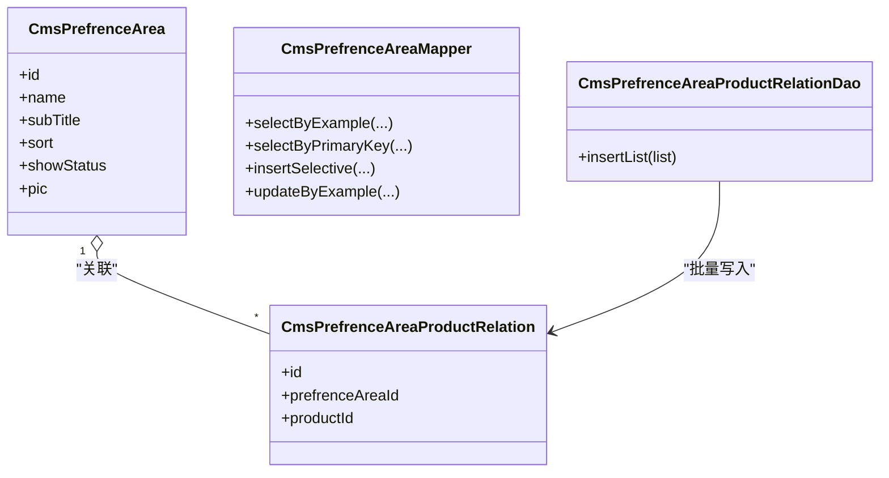
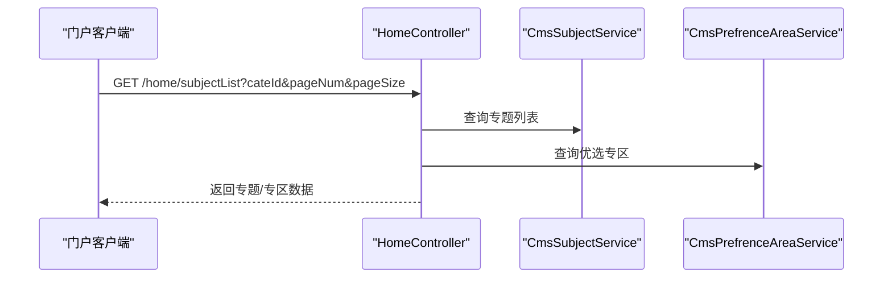
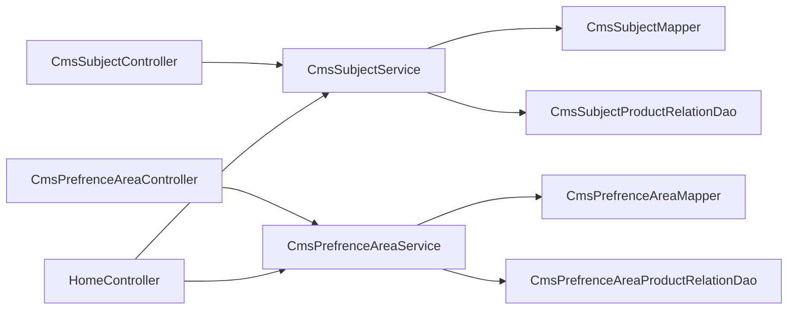

# 内容管理系统

<cite>
**本文引用的文件**
- [CmsSubjectController.java](file://mall-admin/src/main/java/com/macro/mall/controller/CmsSubjectController.java)
- [CmsPrefrenceAreaController.java](file://mall-admin/src/main/java/com/macro/mall/controller/CmsPrefrenceAreaController.java)
- [CmsSubjectService.java](file://mall-admin/src/main/java/com/macro/mall/service/CmsSubjectService.java)
- [CmsPrefrenceAreaService.java](file://mall-admin/src/main/java/com/macro/mall/service/CmsPrefrenceAreaService.java)
- [CmsSubjectServiceImpl.java](file://mall-admin/src/main/java/com/macro/mall/service/impl/CmsSubjectServiceImpl.java)
- [CmsPrefrenceAreaServiceImpl.java](file://mall-admin/src/main/java/com/macro/mall/service/impl/CmsPrefrenceAreaServiceImpl.java)
- [CmsSubject.java](file://mall-mbg/src/main/java/com/macro/mall/model/CmsSubject.java)
- [CmsPrefrenceArea.java](file://mall-mbg/src/main/java/com/macro/mall/model/CmsPrefrenceArea.java)
- [CmsSubjectProductRelation.java](file://mall-mbg/src/main/java/com/macro/mall/model/CmsSubjectProductRelation.java)
- [CmsPrefrenceAreaProductRelation.java](file://mall-mbg/src/main/java/com/macro/mall/model/CmsPrefrenceAreaProductRelation.java)
- [CmsSubjectMapper.java](file://mall-mbg/src/main/java/com/macro/mall/mapper/CmsSubjectMapper.java)
- [CmsPrefrenceAreaMapper.java](file://mall-mbg/src/main/java/com/macro/mall/mapper/CmsPrefrenceAreaMapper.java)
- [CmsSubjectProductRelationDao.java](file://mall-admin/src/main/java/com/macro/mall/dao/CmsSubjectProductRelationDao.java)
- [CmsPrefrenceAreaProductRelationDao.java](file://mall-admin/src/main/java/com/macro/mall/dao/CmsPrefrenceAreaProductRelationDao.java)
- [SmsHomeRecommendSubjectController.java](file://mall-admin/src/main/java/com/macro/mall/controller/SmsHomeRecommendSubjectController.java)
- [SmsHomeRecommendSubject.java](file://mall-mbg/src/main/java/com/macro/mall/model/SmsHomeRecommendSubject.java)
- [HomeController.java](file://mall-portal/src/main/java/com/macro/mall/portal/controller/HomeController.java)
</cite>

## 目录
1. [简介](#简介)
2. [项目结构](#项目结构)
3. [核心组件](#核心组件)
4. [架构总览](#架构总览)
5. [详细组件分析](#详细组件分析)
6. [依赖分析](#依赖分析)
7. [性能考虑](#性能考虑)
8. [故障排查指南](#故障排查指南)
9. [结论](#结论)
10. [附录：API 接口文档与运营配置](#附录api-接口文档与运营配置)

## 简介
本文件面向内容管理系统的业务与技术实现，聚焦两大核心模块：专题内容管理与优选专区管理。文档从控制器接口设计、服务层业务逻辑、数据模型与关联关系、到内容展示与运营配置进行系统化梳理，并提供可操作的 API 文档与运维建议，帮助运营与开发人员高效完成内容配置与维护。

## 项目结构
内容管理相关能力主要分布在以下层次：
- 控制器层（mall-admin）：负责对外暴露 RESTful 接口，处理请求参数与返回统一结果包装。
- 服务层（mall-admin）：封装业务逻辑，协调 DAO/Mapper 完成数据持久化与查询。
- 数据访问层（mall-mbg）：MyBatis Mapper 与实体模型，映射数据库表结构。
- 运营扩展（mall-admin）：首页推荐专题等运营配置控制器，支撑内容展示规则。
- 前端门户（mall-portal）：面向用户的首页内容拉取接口，调用后端服务获取专题与推荐商品。

图表来源
- [CmsSubjectController.java:1-44](file://mall-admin/src/main/java/com/macro/mall/controller/CmsSubjectController.java#L1-L44)
- [CmsPrefrenceAreaController.java:1-33](file://mall-admin/src/main/java/com/macro/mall/controller/CmsPrefrenceAreaController.java#L1-L33)
- [CmsSubjectService.java:1-22](file://mall-admin/src/main/java/com/macro/mall/service/CmsSubjectService.java#L1-L22)
- [CmsPrefrenceAreaService.java:1-17](file://mall-admin/src/main/java/com/macro/mall/service/CmsPrefrenceAreaService.java#L1-L17)
- [CmsSubjectMapper.java:1-36](file://mall-mbg/src/main/java/com/macro/mall/mapper/CmsSubjectMapper.java#L1-L36)
- [CmsPrefrenceAreaMapper.java:1-36](file://mall-mbg/src/main/java/com/macro/mall/mapper/CmsPrefrenceAreaMapper.java#L1-L36)
- [CmsSubjectProductRelationDao.java:1-18](file://mall-admin/src/main/java/com/macro/mall/dao/CmsSubjectProductRelationDao.java#L1-L18)
- [CmsPrefrenceAreaProductRelationDao.java:1-18](file://mall-admin/src/main/java/com/macro/mall/dao/CmsPrefrenceAreaProductRelationDao.java#L1-L18)
- [HomeController.java:34-56](file://mall-portal/src/main/java/com/macro/mall/portal/controller/HomeController.java#L34-L56)
- [SmsHomeRecommendSubjectController.java:35-74](file://mall-admin/src/main/java/com/macro/mall/controller/SmsHomeRecommendSubjectController.java#L35-L74)

章节来源
- [CmsSubjectController.java:1-44](file://mall-admin/src/main/java/com/macro/mall/controller/CmsSubjectController.java#L1-L44)
- [CmsPrefrenceAreaController.java:1-33](file://mall-admin/src/main/java/com/macro/mall/controller/CmsPrefrenceAreaController.java#L1-L33)
- [CmsSubjectService.java:1-22](file://mall-admin/src/main/java/com/macro/mall/service/CmsSubjectService.java#L1-L22)
- [CmsPrefrenceAreaService.java:1-17](file://mall-admin/src/main/java/com/macro/mall/service/CmsPrefrenceAreaService.java#L1-L17)
- [CmsSubjectMapper.java:1-36](file://mall-mbg/src/main/java/com/macro/mall/mapper/CmsSubjectMapper.java#L1-L36)
- [CmsPrefrenceAreaMapper.java:1-36](file://mall-mbg/src/main/java/com/macro/mall/mapper/CmsPrefrenceAreaMapper.java#L1-L36)
- [HomeController.java:34-56](file://mall-portal/src/main/java/com/macro/mall/portal/controller/HomeController.java#L34-L56)

## 核心组件
- 专题内容管理
  - 控制器：CmsSubjectController 提供专题列表查询能力，支持关键词分页检索。
  - 服务：CmsSubjectService 定义查询接口；CmsSubjectServiceImpl 实现分页与关键字过滤。
  - 模型：CmsSubject 描述专题元信息；CmsSubjectProductRelation 关联专题与商品。
  - 访问：CmsSubjectMapper 提供通用 CRUD；CmsSubjectProductRelationDao 支持批量插入专题-商品关系。
- 优选专区管理
  - 控制器：CmsPrefrenceAreaController 提供优选专区全量查询。
  - 服务：CmsPrefrenceAreaService 定义查询接口；CmsPrefrenceAreaServiceImpl 实现全量查询。
  - 模型：CmsPrefrenceArea 描述专区元信息；CmsPrefrenceAreaProductRelation 关联专区与商品。
  - 访问：CmsPrefrenceAreaMapper 提供通用 CRUD；CmsPrefrenceAreaProductRelationDao 支持批量插入专区-商品关系。
- 展示与运营
  - 首页专题列表：HomeController 对外提供专题列表查询接口，供门户使用。
  - 首页推荐专题：SmsHomeRecommendSubjectController 提供排序、上下架与分页查询等运营能力。

章节来源
- [CmsSubjectController.java:28-42](file://mall-admin/src/main/java/com/macro/mall/controller/CmsSubjectController.java#L28-L42)
- [CmsSubjectService.java:11-21](file://mall-admin/src/main/java/com/macro/mall/service/CmsSubjectService.java#L11-L21)
- [CmsSubjectServiceImpl.java:23-37](file://mall-admin/src/main/java/com/macro/mall/service/impl/CmsSubjectServiceImpl.java#L23-L37)
- [CmsSubject.java:6-39](file://mall-mbg/src/main/java/com/macro/mall/model/CmsSubject.java#L6-L39)
- [CmsSubjectProductRelation.java:5-51](file://mall-mbg/src/main/java/com/macro/mall/model/CmsSubjectProductRelation.java#L5-L51)
- [CmsSubjectMapper.java:8-36](file://mall-mbg/src/main/java/com/macro/mall/mapper/CmsSubjectMapper.java#L8-L36)
- [CmsSubjectProductRelationDao.java:12-17](file://mall-admin/src/main/java/com/macro/mall/dao/CmsSubjectProductRelationDao.java#L12-L17)
- [CmsPrefrenceAreaController.java:26-31](file://mall-admin/src/main/java/com/macro/mall/controller/CmsPrefrenceAreaController.java#L26-L31)
- [CmsPrefrenceAreaService.java:11-16](file://mall-admin/src/main/java/com/macro/mall/service/CmsPrefrenceAreaService.java#L11-L16)
- [CmsPrefrenceAreaServiceImpl.java:21-24](file://mall-admin/src/main/java/com/macro/mall/service/impl/CmsPrefrenceAreaServiceImpl.java#L21-L24)
- [CmsPrefrenceArea.java:5-18](file://mall-mbg/src/main/java/com/macro/mall/model/CmsPrefrenceArea.java#L5-L18)
- [CmsPrefrenceAreaProductRelation.java:5-51](file://mall-mbg/src/main/java/com/macro/mall/model/CmsPrefrenceAreaProductRelation.java#L5-L51)
- [CmsPrefrenceAreaMapper.java:8-36](file://mall-mbg/src/main/java/com/macro/mall/mapper/CmsPrefrenceAreaMapper.java#L8-L36)
- [CmsPrefrenceAreaProductRelationDao.java:12-17](file://mall-admin/src/main/java/com/macro/mall/dao/CmsPrefrenceAreaProductRelationDao.java#L12-L17)
- [HomeController.java:49-56](file://mall-portal/src/main/java/com/macro/mall/portal/controller/HomeController.java#L49-L56)
- [SmsHomeRecommendSubjectController.java:35-74](file://mall-admin/src/main/java/com/macro/mall/controller/SmsHomeRecommendSubjectController.java#L35-L74)

## 架构总览
内容管理采用经典的分层架构：
- 表现层：控制器接收请求，返回统一响应包装。
- 领域层：服务层封装业务规则，协调数据访问。
- 数据层：MyBatis Mapper 映射数据库，实体模型承载字段与校验。
- 门户集成：门户通过控制器接口拉取专题与推荐商品，形成内容展示闭环。

图表来源
- [CmsSubjectController.java:28-42](file://mall-admin/src/main/java/com/macro/mall/controller/CmsSubjectController.java#L28-L42)
- [CmsPrefrenceAreaController.java:26-31](file://mall-admin/src/main/java/com/macro/mall/controller/CmsPrefrenceAreaController.java#L26-L31)
- [HomeController.java:49-56](file://mall-portal/src/main/java/com/macro/mall/portal/controller/HomeController.java#L49-L56)
- [CmsSubjectService.java:11-21](file://mall-admin/src/main/java/com/macro/mall/service/CmsSubjectService.java#L11-L21)
- [CmsPrefrenceAreaService.java:11-16](file://mall-admin/src/main/java/com/macro/mall/service/CmsPrefrenceAreaService.java#L11-L16)
- [CmsSubjectMapper.java:19-21](file://mall-mbg/src/main/java/com/macro/mall/mapper/CmsSubjectMapper.java#L19-L21)
- [CmsPrefrenceAreaMapper.java:19-21](file://mall-mbg/src/main/java/com/macro/mall/mapper/CmsPrefrenceAreaMapper.java#L19-L21)

## 详细组件分析

### 专题内容管理
- 控制器接口
  - 全量专题：GET /subject/listAll → 返回全部专题列表。
  - 分页检索：GET /subject/list → 支持 keyword、pageNum、pageSize 参数。
- 服务逻辑
  - listAll：直接查询全部专题。
  - list：基于 PageHelper 分页；根据 keyword 构造标题模糊匹配条件。
- 数据模型与关联
  - CmsSubject：包含标题、封面、描述、展示状态、统计字段等。
  - CmsSubjectProductRelation：专题与商品的多对多关联，支持批量插入。
- 门户集成
  - HomeController 提供 /home/subjectList 接口，供门户按分类与分页拉取专题。

图表来源
- [CmsSubject.java:6-39](file://mall-mbg/src/main/java/com/macro/mall/model/CmsSubject.java#L6-L39)
- [CmsSubjectProductRelation.java:5-51](file://mall-mbg/src/main/java/com/macro/mall/model/CmsSubjectProductRelation.java#L5-L51)
- [CmsSubjectMapper.java:8-36](file://mall-mbg/src/main/java/com/macro/mall/mapper/CmsSubjectMapper.java#L8-L36)
- [CmsSubjectProductRelationDao.java:12-17](file://mall-admin/src/main/java/com/macro/mall/dao/CmsSubjectProductRelationDao.java#L12-L17)

章节来源
- [CmsSubjectController.java:28-42](file://mall-admin/src/main/java/com/macro/mall/controller/CmsSubjectController.java#L28-L42)
- [CmsSubjectServiceImpl.java:23-37](file://mall-admin/src/main/java/com/macro/mall/service/impl/CmsSubjectServiceImpl.java#L23-L37)
- [CmsSubject.java:6-39](file://mall-mbg/src/main/java/com/macro/mall/model/CmsSubject.java#L6-L39)
- [CmsSubjectProductRelation.java:5-51](file://mall-mbg/src/main/java/com/macro/mall/model/CmsSubjectProductRelation.java#L5-L51)
- [CmsSubjectMapper.java:8-36](file://mall-mbg/src/main/java/com/macro/mall/mapper/CmsSubjectMapper.java#L8-L36)
- [CmsSubjectProductRelationDao.java:12-17](file://mall-admin/src/main/java/com/macro/mall/dao/CmsSubjectProductRelationDao.java#L12-L17)
- [HomeController.java:49-56](file://mall-portal/src/main/java/com/macro/mall/portal/controller/HomeController.java#L49-L56)

### 优选专区管理
- 控制器接口
  - 全量专区：GET /prefrenceArea/listAll → 返回全部优选专区列表。
- 服务逻辑
  - listAll：直接查询全部专区。
- 数据模型与关联
  - CmsPrefrenceArea：包含名称、副标题、排序、展示状态、图片等。
  - CmsPrefrenceAreaProductRelation：专区与商品的多对多关联，支持批量插入。

图表来源
- [CmsPrefrenceArea.java:5-18](file://mall-mbg/src/main/java/com/macro/mall/model/CmsPrefrenceArea.java#L5-L18)
- [CmsPrefrenceAreaProductRelation.java:5-51](file://mall-mbg/src/main/java/com/macro/mall/model/CmsPrefrenceAreaProductRelation.java#L5-L51)
- [CmsPrefrenceAreaMapper.java:8-36](file://mall-mbg/src/main/java/com/macro/mall/mapper/CmsPrefrenceAreaMapper.java#L8-L36)
- [CmsPrefrenceAreaProductRelationDao.java:12-17](file://mall-admin/src/main/java/com/macro/mall/dao/CmsPrefrenceAreaProductRelationDao.java#L12-L17)

章节来源
- [CmsPrefrenceAreaController.java:26-31](file://mall-admin/src/main/java/com/macro/mall/controller/CmsPrefrenceAreaController.java#L26-L31)
- [CmsPrefrenceAreaServiceImpl.java:21-24](file://mall-admin/src/main/java/com/macro/mall/service/impl/CmsPrefrenceAreaServiceImpl.java#L21-L24)
- [CmsPrefrenceArea.java:5-18](file://mall-mbg/src/main/java/com/macro/mall/model/CmsPrefrenceArea.java#L5-L18)
- [CmsPrefrenceAreaProductRelation.java:5-51](file://mall-mbg/src/main/java/com/macro/mall/model/CmsPrefrenceAreaProductRelation.java#L5-L51)
- [CmsPrefrenceAreaMapper.java:8-36](file://mall-mbg/src/main/java/com/macro/mall/mapper/CmsPrefrenceAreaMapper.java#L8-L36)
- [CmsPrefrenceAreaProductRelationDao.java:12-17](file://mall-admin/src/main/java/com/macro/mall/dao/CmsPrefrenceAreaProductRelationDao.java#L12-L17)

### 展示与运营配置
- 首页专题列表：HomeController 提供 /home/subjectList 接口，支持按分类、分页查询专题。
- 首页推荐专题：SmsHomeRecommendSubjectController 提供排序更新、批量删除、上下架开关与分页查询，支撑首页专题的运营配置。

图表来源
- [HomeController.java:49-56](file://mall-portal/src/main/java/com/macro/mall/portal/controller/HomeController.java#L49-L56)
- [CmsSubjectService.java:11-21](file://mall-admin/src/main/java/com/macro/mall/service/CmsSubjectService.java#L11-L21)
- [CmsPrefrenceAreaService.java:11-16](file://mall-admin/src/main/java/com/macro/mall/service/CmsPrefrenceAreaService.java#L11-L16)

章节来源
- [HomeController.java:49-56](file://mall-portal/src/main/java/com/macro/mall/portal/controller/HomeController.java#L49-L56)
- [SmsHomeRecommendSubjectController.java:35-74](file://mall-admin/src/main/java/com/macro/mall/controller/SmsHomeRecommendSubjectController.java#L35-L74)

## 依赖分析
- 控制器依赖服务：CmsSubjectController 与 CmsPrefrenceAreaController 分别注入对应 Service。
- 服务依赖 Mapper：CmsSubjectServiceImpl 与 CmsPrefrenceAreaServiceImpl 注入 Mapper 完成数据读写。
- 关联关系 DAO：专题与专区分别提供批量插入关系的 DAO，用于运营侧批量绑定商品。
- 门户依赖：HomeController 调用服务层接口，形成内容展示链路。

图表来源
- [CmsSubjectController.java:25-26](file://mall-admin/src/main/java/com/macro/mall/controller/CmsSubjectController.java#L25-L26)
- [CmsPrefrenceAreaController.java:24-24](file://mall-admin/src/main/java/com/macro/mall/controller/CmsPrefrenceAreaController.java#L24-L24)
- [CmsSubjectServiceImpl.java:20-21](file://mall-admin/src/main/java/com/macro/mall/service/impl/CmsSubjectServiceImpl.java#L20-L21)
- [CmsPrefrenceAreaServiceImpl.java:18-19](file://mall-admin/src/main/java/com/macro/mall/service/impl/CmsPrefrenceAreaServiceImpl.java#L18-L19)
- [CmsSubjectProductRelationDao.java:16-16](file://mall-admin/src/main/java/com/macro/mall/dao/CmsSubjectProductRelationDao.java#L16-L16)
- [CmsPrefrenceAreaProductRelationDao.java:16-16](file://mall-admin/src/main/java/com/macro/mall/dao/CmsPrefrenceAreaProductRelationDao.java#L16-L16)
- [HomeController.java:49-56](file://mall-portal/src/main/java/com/macro/mall/portal/controller/HomeController.java#L49-L56)

章节来源
- [CmsSubjectController.java:25-26](file://mall-admin/src/main/java/com/macro/mall/controller/CmsSubjectController.java#L25-L26)
- [CmsPrefrenceAreaController.java:24-24](file://mall-admin/src/main/java/com/macro/mall/controller/CmsPrefrenceAreaController.java#L24-L24)
- [CmsSubjectServiceImpl.java:20-21](file://mall-admin/src/main/java/com/macro/mall/service/impl/CmsSubjectServiceImpl.java#L20-L21)
- [CmsPrefrenceAreaServiceImpl.java:18-19](file://mall-admin/src/main/java/com/macro/mall/service/impl/CmsPrefrenceAreaServiceImpl.java#L18-L19)
- [CmsSubjectProductRelationDao.java:16-16](file://mall-admin/src/main/java/com/macro/mall/dao/CmsSubjectProductRelationDao.java#L16-L16)
- [CmsPrefrenceAreaProductRelationDao.java:16-16](file://mall-admin/src/main/java/com/macro/mall/dao/CmsPrefrenceAreaProductRelationDao.java#L16-L16)
- [HomeController.java:49-56](file://mall-portal/src/main/java/com/macro/mall/portal/controller/HomeController.java#L49-L56)

## 性能考虑
- 分页查询：服务层使用分页组件进行分页，建议在高频查询场景下为关键字字段建立索引以提升 LIKE 查询效率。
- 批量插入：专题与专区的商品关联均支持批量插入，建议在运营批量绑定时使用该接口减少往返次数。
- 缓存策略：可在门户层对热门专题与专区数据增加缓存，降低数据库压力。
- 排序与筛选：首页推荐专题支持排序与上下架控制，建议结合热点数据做缓存与预热。

## 故障排查指南
- 控制器返回异常
  - 统一结果包装由公共模块提供，若出现格式不一致，检查控制器是否正确返回统一包装。
- 查询无结果
  - 确认关键字是否正确传入；确认数据库中是否存在匹配记录；检查分页参数是否合理。
- 批量插入失败
  - 检查传入的列表参数是否为空；确认关联关系表的外键约束与数据类型。
- 门户无法拉取专题
  - 检查 HomeController 的调用链路是否正常；确认服务层方法是否正确实现；核对数据库中专题与专区的展示状态。

章节来源
- [CmsSubjectController.java:28-42](file://mall-admin/src/main/java/com/macro/mall/controller/CmsSubjectController.java#L28-L42)
- [CmsPrefrenceAreaController.java:26-31](file://mall-admin/src/main/java/com/macro/mall/controller/CmsPrefrenceAreaController.java#L26-L31)
- [CmsSubjectServiceImpl.java:23-37](file://mall-admin/src/main/java/com/macro/mall/service/impl/CmsSubjectServiceImpl.java#L23-L37)
- [CmsPrefrenceAreaServiceImpl.java:21-24](file://mall-admin/src/main/java/com/macro/mall/service/impl/CmsPrefrenceAreaServiceImpl.java#L21-L24)

## 结论
内容管理系统围绕“专题内容”与“优选专区”两条主线构建，控制器层提供简洁的 RESTful 接口，服务层封装查询与运营能力，数据层通过实体与 Mapper 完成持久化。结合门户的专题拉取接口，形成从运营配置到用户展示的完整闭环。后续可在分页索引、批量操作优化与缓存策略方面进一步提升性能与稳定性。

## 附录：API 接口文档与运营配置

### 专题内容管理 API
- 获取全部专题
  - 方法：GET
  - 路径：/subject/listAll
  - 返回：统一结果包装 + 专题列表
- 分页查询专题
  - 方法：GET
  - 路径：/subject/list
  - 查询参数：
    - keyword：可选，按标题模糊搜索
    - pageNum：默认 1
    - pageSize：默认 5
  - 返回：统一结果包装 + 分页专题列表

章节来源
- [CmsSubjectController.java:28-42](file://mall-admin/src/main/java/com/macro/mall/controller/CmsSubjectController.java#L28-L42)

### 优选专区管理 API
- 获取全部优选专区
  - 方法：GET
  - 路径：/prefrenceArea/listAll
  - 返回：统一结果包装 + 专区列表

章节来源
- [CmsPrefrenceAreaController.java:26-31](file://mall-admin/src/main/java/com/macro/mall/controller/CmsPrefrenceAreaController.java#L26-L31)

### 门户专题展示 API
- 门户专题列表
  - 方法：GET
  - 路径：/home/subjectList
  - 查询参数：
    - cateId：可选，按分类筛选
    - pageSize：默认 4
    - pageNum：默认 1
  - 返回：统一结果包装 + 专题列表

章节来源
- [HomeController.java:49-56](file://mall-portal/src/main/java/com/macro/mall/portal/controller/HomeController.java#L49-L56)

### 首页推荐专题运营 API
- 更新排序
  - 方法：POST
  - 路径：/home/recommendSubject/update/sort/{id}
  - 请求参数：sort
  - 返回：统一结果包装
- 删除推荐
  - 方法：POST
  - 路径：/home/recommendSubject/delete
  - 请求参数：ids（列表）
  - 返回：统一结果包装
- 更新推荐状态
  - 方法：POST
  - 路径：/home/recommendSubject/update/recommendStatus
  - 请求参数：ids（列表）、recommendStatus
  - 返回：统一结果包装
- 分页查询推荐专题
  - 方法：GET
  - 路径：/home/recommendSubject/list
  - 查询参数：subjectName（可选）、recommendStatus（可选）、pageSize（默认 5）、pageNum（默认 1）
  - 返回：统一结果包装 + 分页列表

章节来源
- [SmsHomeRecommendSubjectController.java:35-74](file://mall-admin/src/main/java/com/macro/mall/controller/SmsHomeRecommendSubjectController.java#L35-L74)

### 数据模型与关联关系
- 专题表（CmsSubject）
  - 字段要点：id、categoryId、title、pic、description、showStatus、content 等
- 专题-商品关联表（CmsSubjectProductRelation）
  - 字段要点：id、subjectId、productId
- 优选专区表（CmsPrefrenceArea）
  - 字段要点：id、name、subTitle、sort、showStatus、pic
- 区域-商品关联表（CmsPrefrenceAreaProductRelation）
  - 字段要点：id、prefrenceAreaId、productId

章节来源
- [CmsSubject.java:6-39](file://mall-mbg/src/main/java/com/macro/mall/model/CmsSubject.java#L6-L39)
- [CmsSubjectProductRelation.java:5-51](file://mall-mbg/src/main/java/com/macro/mall/model/CmsSubjectProductRelation.java#L5-L51)
- [CmsPrefrenceArea.java:5-18](file://mall-mbg/src/main/java/com/macro/mall/model/CmsPrefrenceArea.java#L5-L18)
- [CmsPrefrenceAreaProductRelation.java:5-51](file://mall-mbg/src/main/java/com/macro/mall/model/CmsPrefrenceAreaProductRelation.java#L5-L51)