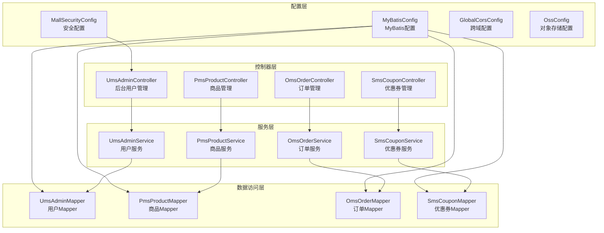
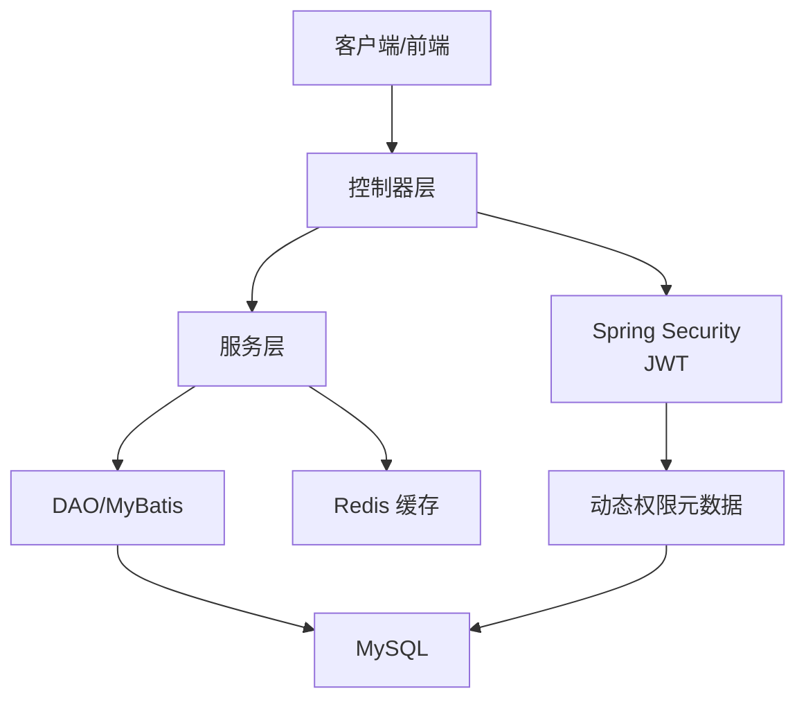
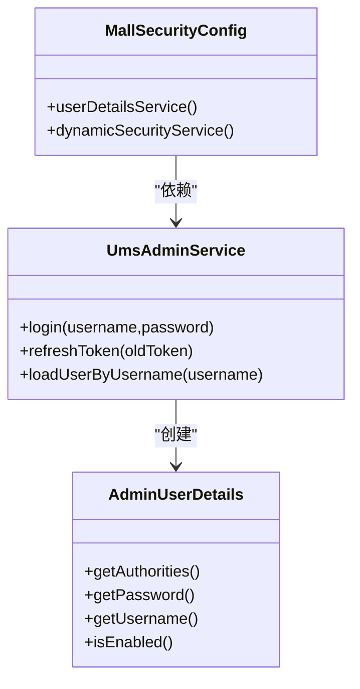
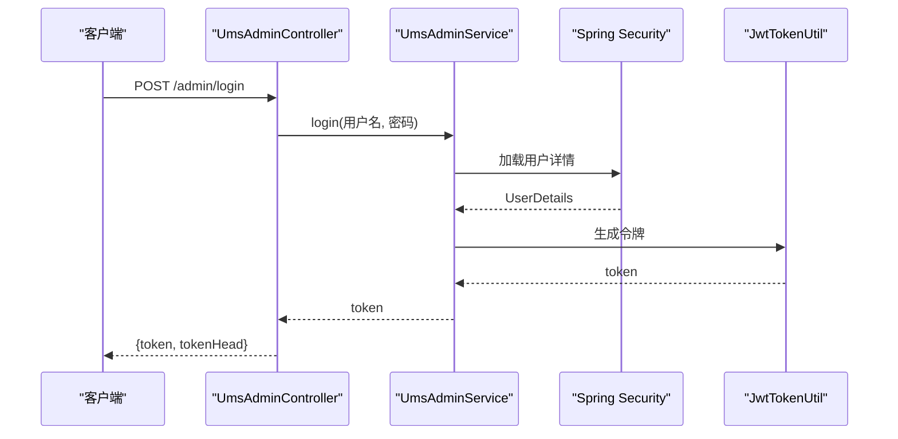
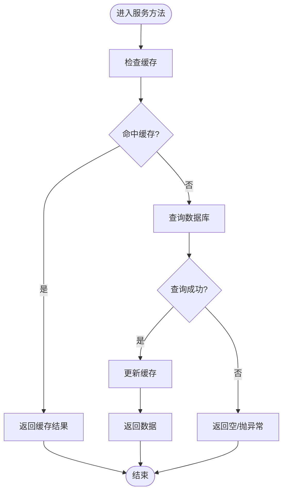
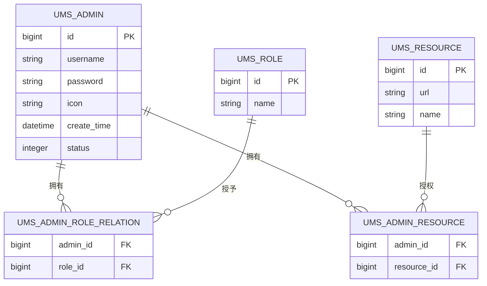
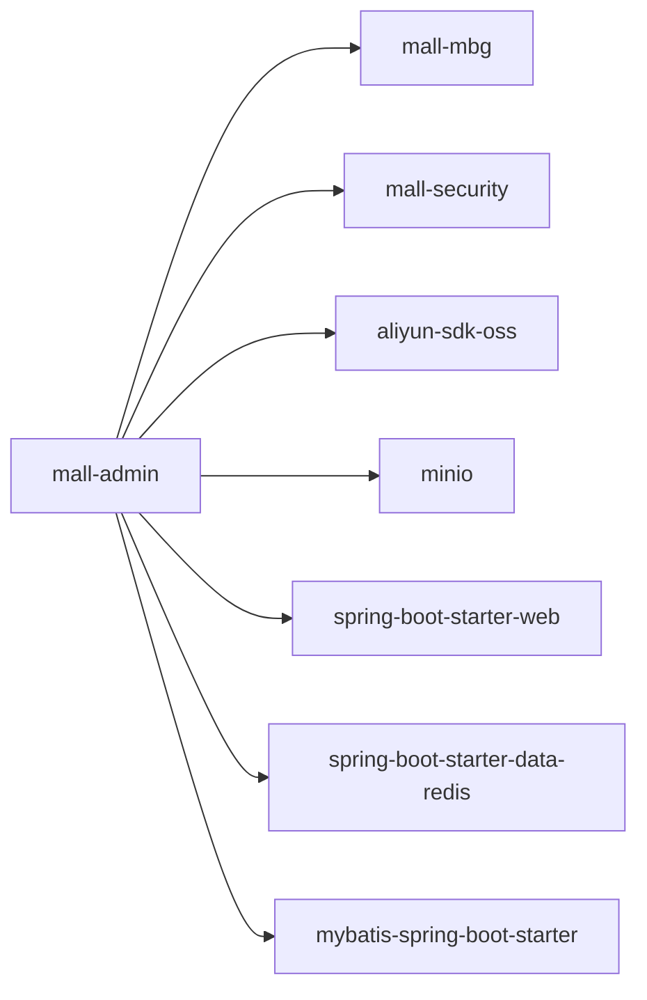

# 后台管理系统 (mall-admin)

<cite>
**本文引用的文件**
- [MallAdminApplication.java](file://mall-admin/src/main/java/com/macro/mall/MallAdminApplication.java)
- [pom.xml](file://mall-admin/pom.xml)
- [application.yml](file://mall-admin/src/main/resources/application.yml)
- [MallSecurityConfig.java](file://mall-admin/src/main/java/com/macro/mall/config/MallSecurityConfig.java)
- [MyBatisConfig.java](file://mall-admin/src/main/java/com/macro/mall/config/MyBatisConfig.java)
- [GlobalCorsConfig.java](file://mall-admin/src/main/java/com/macro/mall/config/GlobalCorsConfig.java)
- [OssConfig.java](file://mall-admin/src/main/java/com/macro/mall/config/OssConfig.java)
- [AdminUserDetails.java](file://mall-admin/src/main/java/com/macro/mall/bo/AdminUserDetails.java)
- [UmsAdminController.java](file://mall-admin/src/main/java/com/macro/mall/controller/UmsAdminController.java)
- [UmsAdminServiceImpl.java](file://mall-admin/src/main/java/com/macro/mall/service/impl/UmsAdminServiceImpl.java)
- [UmsAdminLoginParam.java](file://mall-admin/src/main/java/com/macro/mall/dto/UmsAdminLoginParam.java)
- [FlagValidator.java](file://mall-admin/src/main/java/com/macro/mall/validator/FlagValidator.java)
- [GlobalExceptionHandler.java](file://mall-common/src/main/java/com/macro/mall/common/exception/GlobalExceptionHandler.java)
- [CommonResult.java](file://mall-common/src/main/java/com/macro/mall/common/api/CommonResult.java)
- [ResultCode.java](file://mall-common/src/main/java/com/macro/mall/common/api/ResultCode.java)
- [IErrorCode.java](file://mall-common/src/main/java/com/macro/mall/common/api/IErrorCode.java)
- [Asserts.java](file://mall-common/src/main/java/com/macro/mall/common/exception/Asserts.java)
- [ApiException.java](file://mall-common/src/main/java/com/macro/mall/common/exception/ApiException.java)
- [UmsAdminCacheService.java](file://mall-admin/src/main/java/com/macro/mall/service/UmsAdminCacheService.java)
- [UmsAdminService.java](file://mall-admin/src/main/java/com/macro/mall/service/UmsAdminService.java)
- [UmsRoleService.java](file://mall-admin/src/main/java/com/macro/mall/service/UmsRoleService.java)
- [UmsResourceService.java](file://mall-admin/src/main/java/com/macro/mall/service/UmsResourceService.java)
- [UmsAdminMapper.java](file://mall-mbg/src/main/java/com/macro/mall/mapper/UmsAdminMapper.java)
- [UmsAdminRoleRelationMapper.java](file://mall-mbg/src/main/java/com/macro/mall/mapper/UmsAdminRoleRelationMapper.java)
- [UmsAdminLoginLogMapper.java](file://mall-mbg/src/main/java/com/macro/mall/mapper/UmsAdminLoginLogMapper.java)
- [UmsAdminRoleRelationDao.java](file://mall-admin/src/main/java/com/macro/mall/dao/UmsAdminRoleRelationDao.java)
- [UmsAdminRoleRelationDaoImpl.java](file://mall-admin/src/main/java/com/macro/mall/dao/impl/UmsAdminRoleRelationDaoImpl.java)
- [JwtTokenUtil.java](file://mall-security/src/main/java/com/macro/mall/security/util/JwtTokenUtil.java)
- [DynamicSecurityService.java](file://mall-security/src/main/java/com/macro/mall/security/component/DynamicSecurityService.java)
- [mall-admin.sh](file://document/sh/mall-admin.sh)
- [docker-compose-app.yml](file://document/docker/docker-compose-app.yml)
- [docker-compose-env.yml](file://document/docker/docker-compose-env.yml)
- [nginx.conf](file://document/docker/nginx.conf)
- [mall.sql](file://document/sql/mall.sql)
</cite>

## 目录
1. [简介](#简介)
2. [项目结构](#项目结构)
3. [核心组件](#核心组件)
4. [架构总览](#架构总览)
5. [详细组件分析](#详细组件分析)
6. [依赖关系分析](#依赖关系分析)
7. [性能考虑](#性能考虑)
8. [故障排查指南](#故障排查指南)
9. [结论](#结论)
10. [附录](#附录)

## 简介
mall-admin 是电商管理后台的核心模块，基于 Spring Boot 构建，提供完善的后台管理能力，涵盖商品管理、订单处理、用户管理、营销活动等业务模块。系统采用 Spring Security 实现统一鉴权与动态权限控制，结合 JWT 进行无状态认证；MyBatis 作为持久层框架，支持多模块数据访问；通过统一的响应包装与全局异常处理，确保接口的一致性与健壮性。

## 项目结构
mall-admin 模块遵循分层架构与按功能域划分的组织方式：
- 配置层：包含 Spring Security、MyBatis、跨域、对象存储等配置类
- 控制器层：面向 RESTful 的各业务控制器（如用户、商品、订单、营销）
- 服务层：封装业务逻辑、事务管理与 DTO 转换
- 数据访问层：DAO 接口与 MBG Mapper 组合，提供数据读写
- BO/DTO/Validator：领域对象、传输对象与参数校验
- 资源与配置：application.yml、MyBatis 映射 XML、Swagger 文档等

图表来源
- [MallSecurityConfig.java:1-50](file://mall-admin/src/main/java/com/macro/mall/config/MallSecurityConfig.java#L1-L50)
- [MyBatisConfig.java:1-16](file://mall-admin/src/main/java/com/macro/mall/config/MyBatisConfig.java#L1-L16)
- [GlobalCorsConfig.java:1-35](file://mall-admin/src/main/java/com/macro/mall/config/GlobalCorsConfig.java#L1-L35)
- [OssConfig.java:1-27](file://mall-admin/src/main/java/com/macro/mall/config/OssConfig.java#L1-L27)
- [UmsAdminController.java:1-192](file://mall-admin/src/main/java/com/macro/mall/controller/UmsAdminController.java#L1-L192)
- [UmsAdminService.java](file://mall-admin/src/main/java/com/macro/mall/service/UmsAdminService.java)
- [UmsAdminMapper.java](file://mall-mbg/src/main/java/com/macro/mall/mapper/UmsAdminMapper.java)

章节来源
- [MallAdminApplication.java:1-16](file://mall-admin/src/main/java/com/macro/mall/MallAdminApplication.java#L1-L16)
- [pom.xml:1-50](file://mall-admin/pom.xml#L1-L50)
- [application.yml:1-66](file://mall-admin/src/main/resources/application.yml#L1-L66)

## 核心组件
- 应用启动入口：负责加载 Spring Boot 应用上下文，启用自动配置
- 安全配置：定义用户详情加载器与动态权限数据源，集成 JWT 与 Spring Security
- MyBatis 配置：开启事务管理与 Mapper 扫描，统一类型别名包
- 跨域配置：全局 CORS 放行策略，支持 Cookie 与任意来源
- 对象存储配置：基于 Aliyun OSS 的条件化装配，支持按开关启用
- 统一响应与异常：通过 CommonResult 包装响应，GlobalExceptionHandler 处理校验与业务异常
- 参数校验：使用 Jakarta Bean Validation 注解与自定义校验注解（如 FlagValidator）

章节来源
- [MallAdminApplication.java:1-16](file://mall-admin/src/main/java/com/macro/mall/MallAdminApplication.java#L1-L16)
- [MallSecurityConfig.java:1-50](file://mall-admin/src/main/java/com/macro/mall/config/MallSecurityConfig.java#L1-L50)
- [MyBatisConfig.java:1-16](file://mall-admin/src/main/java/com/macro/mall/config/MyBatisConfig.java#L1-L16)
- [GlobalCorsConfig.java:1-35](file://mall-admin/src/main/java/com/macro/mall/config/GlobalCorsConfig.java#L1-L35)
- [OssConfig.java:1-27](file://mall-admin/src/main/java/com/macro/mall/config/OssConfig.java#L1-L27)
- [GlobalExceptionHandler.java:1-69](file://mall-common/src/main/java/com/macro/mall/common/exception/GlobalExceptionHandler.java#L1-L69)
- [CommonResult.java](file://mall-common/src/main/java/com/macro/mall/common/api/CommonResult.java)
- [FlagValidator.java:1-24](file://mall-admin/src/main/java/com/macro/mall/validator/FlagValidator.java#L1-L24)

## 架构总览
mall-admin 采用“控制器-服务-数据访问”的三层架构，并通过以下关键点实现高内聚低耦合：
- 控制器层：RESTful 接口设计，统一返回体，参数校验与异常处理前置
- 服务层：封装业务流程、事务边界与缓存策略，避免控制器直接操作数据
- 数据访问层：Mapper 与 DAO 分离，DAO 提供复杂查询与批量插入能力
- 安全层：基于 JWT 的无状态认证，动态权限元数据来源于资源表
- 配置层：集中管理 MyBatis、CORS、对象存储与安全白名单

图表来源
- [UmsAdminController.java:1-192](file://mall-admin/src/main/java/com/macro/mall/controller/UmsAdminController.java#L1-L192)
- [UmsAdminServiceImpl.java:1-288](file://mall-admin/src/main/java/com/macro/mall/service/impl/UmsAdminServiceImpl.java#L1-L288)
- [MallSecurityConfig.java:1-50](file://mall-admin/src/main/java/com/macro/mall/config/MallSecurityConfig.java#L1-L50)
- [application.yml:1-66](file://mall-admin/src/main/resources/application.yml#L1-L66)

## 详细组件分析

### 安全与认证组件
- 用户详情封装：AdminUserDetails 将后台用户与其资源列表组合，作为 Spring Security 的 UserDetails 实现
- 动态权限：MallSecurityConfig 注入动态权限服务，从资源表加载 URL 到权限的映射
- 登录与令牌：服务层登录时构建 UserDetails，生成 JWT 并写入登录日志；支持刷新令牌
- 白名单：application.yml 中配置安全路径白名单，便于文档与监控端点访问

图表来源
- [AdminUserDetails.java:1-66](file://mall-admin/src/main/java/com/macro/mall/bo/AdminUserDetails.java#L1-L66)
- [MallSecurityConfig.java:1-50](file://mall-admin/src/main/java/com/macro/mall/config/MallSecurityConfig.java#L1-L50)
- [UmsAdminServiceImpl.java:1-288](file://mall-admin/src/main/java/com/macro/mall/service/impl/UmsAdminServiceImpl.java#L1-L288)

章节来源
- [AdminUserDetails.java:1-66](file://mall-admin/src/main/java/com/macro/mall/bo/AdminUserDetails.java#L1-L66)
- [MallSecurityConfig.java:1-50](file://mall-admin/src/main/java/com/macro/mall/config/MallSecurityConfig.java#L1-L50)
- [UmsAdminServiceImpl.java:1-288](file://mall-admin/src/main/java/com/macro/mall/service/impl/UmsAdminServiceImpl.java#L1-L288)
- [application.yml:34-52](file://mall-admin/src/main/resources/application.yml#L34-L52)

### 控制器层设计模式
- RESTful 设计：以资源为中心的 URL 结构，如 /admin、/product、/order 等
- 参数校验：使用 @Validated 与 Jakarta Bean Validation 注解，结合自定义注解（如 FlagValidator）约束状态枚举
- 异常处理：全局异常处理器统一拦截校验异常与业务异常，返回标准化响应
- 统一响应：所有接口返回 CommonResult，包含状态码、消息与数据体

图表来源
- [UmsAdminController.java:54-65](file://mall-admin/src/main/java/com/macro/mall/controller/UmsAdminController.java#L54-L65)
- [UmsAdminServiceImpl.java:98-119](file://mall-admin/src/main/java/com/macro/mall/service/impl/UmsAdminServiceImpl.java#L98-L119)
- [JwtTokenUtil.java](file://mall-security/src/main/java/com/macro/mall/security/util/JwtTokenUtil.java)

章节来源
- [UmsAdminController.java:1-192](file://mall-admin/src/main/java/com/macro/mall/controller/UmsAdminController.java#L1-L192)
- [UmsAdminLoginParam.java:1-20](file://mall-admin/src/main/java/com/macro/mall/dto/UmsAdminLoginParam.java#L1-L20)
- [FlagValidator.java:1-24](file://mall-admin/src/main/java/com/macro/mall/validator/FlagValidator.java#L1-L24)
- [GlobalExceptionHandler.java:1-69](file://mall-common/src/main/java/com/macro/mall/common/exception/GlobalExceptionHandler.java#L1-L69)
- [CommonResult.java](file://mall-common/src/main/java/com/macro/mall/common/api/CommonResult.java)

### 服务层与事务管理
- 业务封装：服务层聚合多个 Mapper/DAO 操作，保证业务一致性
- 事务边界：MyBatisConfig 开启事务管理，服务层方法通常承担事务语义
- 缓存策略：用户与资源列表缓存于 Redis，降低数据库压力并提升权限判定效率
- 权限与角色：通过角色-资源关联查询资源列表，动态注入到 UserDetails

图表来源
- [UmsAdminServiceImpl.java:60-76](file://mall-admin/src/main/java/com/macro/mall/service/impl/UmsAdminServiceImpl.java#L60-L76)
- [UmsAdminServiceImpl.java:226-239](file://mall-admin/src/main/java/com/macro/mall/service/impl/UmsAdminServiceImpl.java#L226-L239)
- [application.yml:26-33](file://mall-admin/src/main/resources/application.yml#L26-L33)

章节来源
- [MyBatisConfig.java:1-16](file://mall-admin/src/main/java/com/macro/mall/config/MyBatisConfig.java#L1-L16)
- [UmsAdminServiceImpl.java:1-288](file://mall-admin/src/main/java/com/macro/mall/service/impl/UmsAdminServiceImpl.java#L1-L288)
- [UmsAdminCacheService.java](file://mall-admin/src/main/java/com/macro/mall/service/UmsAdminCacheService.java)

### 数据模型与持久层
- 模型与映射：MBG 自动生成的 Mapper 与 Model 类位于 mall-mbg 模块
- 复杂查询：DAO 接口与实现负责复杂关联查询与批量操作
- 配置扫描：MyBatisConfig 统一扫描 mapper 与 dao 包，简化配置

图表来源
- [UmsAdminMapper.java](file://mall-mbg/src/main/java/com/macro/mall/mapper/UmsAdminMapper.java)
- [UmsAdminRoleRelationMapper.java](file://mall-mbg/src/main/java/com/macro/mall/mapper/UmsAdminRoleRelationMapper.java)
- [UmsAdminRoleRelationDao.java](file://mall-admin/src/main/java/com/macro/mall/dao/UmsAdminRoleRelationDao.java)
- [UmsAdminRoleRelationDaoImpl.java](file://mall-admin/src/main/java/com/macro/mall/dao/impl/UmsAdminRoleRelationDaoImpl.java)

章节来源
- [MyBatisConfig.java:1-16](file://mall-admin/src/main/java/com/macro/mall/config/MyBatisConfig.java#L1-L16)
- [UmsAdminMapper.java](file://mall-mbg/src/main/java/com/macro/mall/mapper/UmsAdminMapper.java)
- [UmsAdminRoleRelationMapper.java](file://mall-mbg/src/main/java/com/macro/mall/mapper/UmsAdminRoleRelationMapper.java)

### 关键业务模块概览
- 用户管理：注册、登录、刷新令牌、获取用户信息、更新状态、分配角色、重置密码等
- 商品管理：品牌、属性、分类、库存、商品增删改查与查询参数封装
- 订单管理：订单发货、取消、退款、设置、公司地址、历史记录等
- 营销活动：优惠券、限时购、首页广告、专题推荐等

章节来源
- [UmsAdminController.java:1-192](file://mall-admin/src/main/java/com/macro/mall/controller/UmsAdminController.java#L1-L192)
- [application.yml:1-66](file://mall-admin/src/main/resources/application.yml#L1-L66)

## 依赖关系分析
mall-admin 通过 Maven 依赖引入核心模块与外部组件：
- mall-mbg：提供 MBG 生成的实体、Mapper 与 XML
- mall-security：提供安全组件（JWT 工具、动态权限、过滤器、异常处理）
- ali-sdk-oss 与 minio：对象存储能力（阿里云 OSS 与 MinIO）
- spring-boot-starter-web、spring-boot-starter-data-redis、mybatis-spring-boot-starter 等

图表来源
- [pom.xml:19-36](file://mall-admin/pom.xml#L19-L36)

章节来源
- [pom.xml:1-50](file://mall-admin/pom.xml#L1-L50)

## 性能考虑
- 缓存优先：用户与资源列表缓存于 Redis，减少数据库与权限计算开销
- 分页查询：服务层使用 PageHelper 实现分页，避免一次性加载大量数据
- 事务边界：合理划分服务方法的事务范围，避免长事务占用连接
- 跨域与静态资源：白名单放行静态资源与监控端点，降低鉴权开销
- 对象存储：按需启用 OSS，避免不必要的初始化与网络开销

## 故障排查指南
- 登录失败：检查用户名/密码是否正确，确认用户状态是否启用；查看登录日志与异常堆栈
- 权限不足：核对资源 URL 是否已在资源表配置，动态权限元数据是否已加载
- 参数校验失败：关注全局异常处理器返回的字段错误提示，修正请求体字段
- 数据库权限：演示环境存在权限限制，必要时本地搭建服务或调整权限
- 跨域问题：确认 CORS 配置是否生效，浏览器控制台 Network 面板查看预检请求

章节来源
- [GlobalExceptionHandler.java:1-69](file://mall-common/src/main/java/com/macro/mall/common/exception/GlobalExceptionHandler.java#L1-L69)
- [MallSecurityConfig.java:1-50](file://mall-admin/src/main/java/com/macro/mall/config/MallSecurityConfig.java#L1-L50)
- [application.yml:34-52](file://mall-admin/src/main/resources/application.yml#L34-L52)

## 结论
mall-admin 通过清晰的分层设计、完善的鉴权与缓存策略、统一的响应与异常处理，构建了稳定高效的电商后台管理平台。其 RESTful 接口与 DTO/BO 设计便于扩展与维护，配合 MyBatis 与 Redis 实现高性能的数据访问与权限判定。建议在生产环境中完善日志审计、限流熔断与密钥管理，持续优化缓存命中率与数据库索引。

## 附录

### 部署与运行指南
- 环境准备：JDK 17+、MySQL、Redis、Nginx
- 数据库初始化：执行 mall.sql 初始化数据库与基础数据
- 配置文件：根据环境切换 application-dev.yml 或 application-prod.yml
- 启动脚本：使用 mall-admin.sh 启动应用
- 容器编排：参考 docker-compose-app.yml 与 docker-compose-env.yml 进行容器化部署
- 反向代理：使用 nginx.conf 配置 Nginx 反向代理与静态资源

章节来源
- [mall-admin.sh](file://document/sh/mall-admin.sh)
- [docker-compose-app.yml](file://document/docker/docker-compose-app.yml)
- [docker-compose-env.yml](file://document/docker/docker-compose-env.yml)
- [nginx.conf](file://document/docker/nginx.conf)
- [mall.sql](file://document/sql/mall.sql)