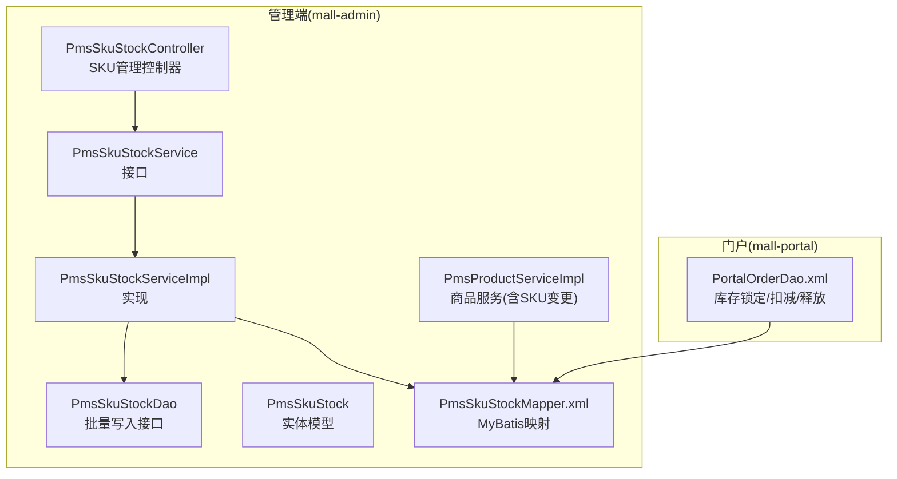
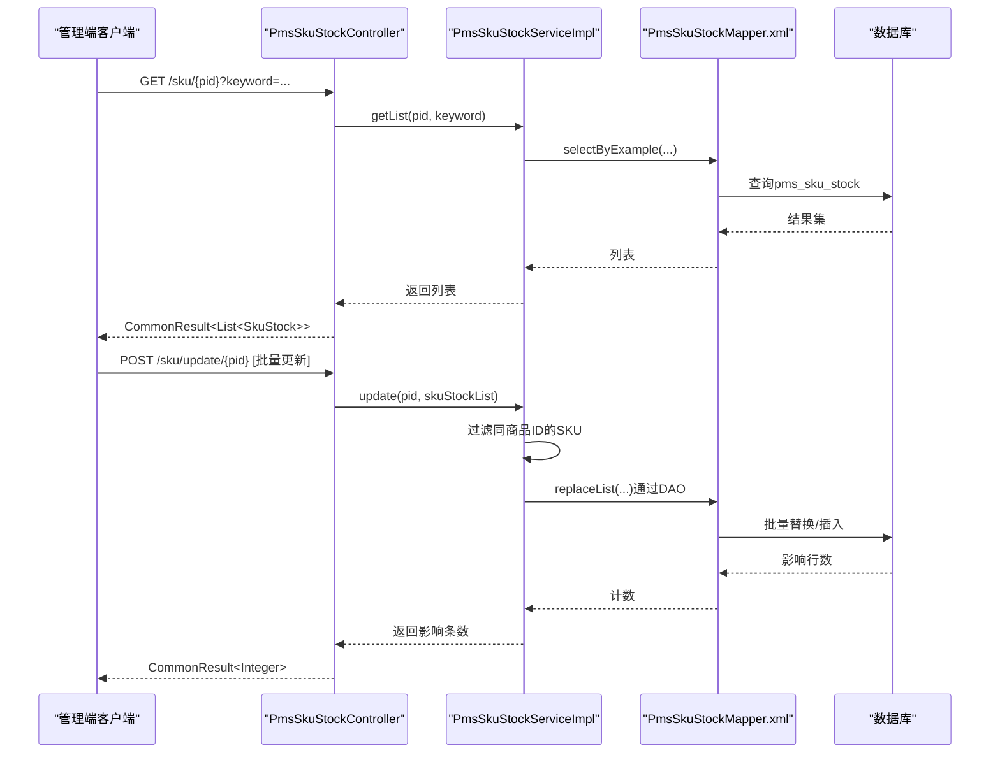
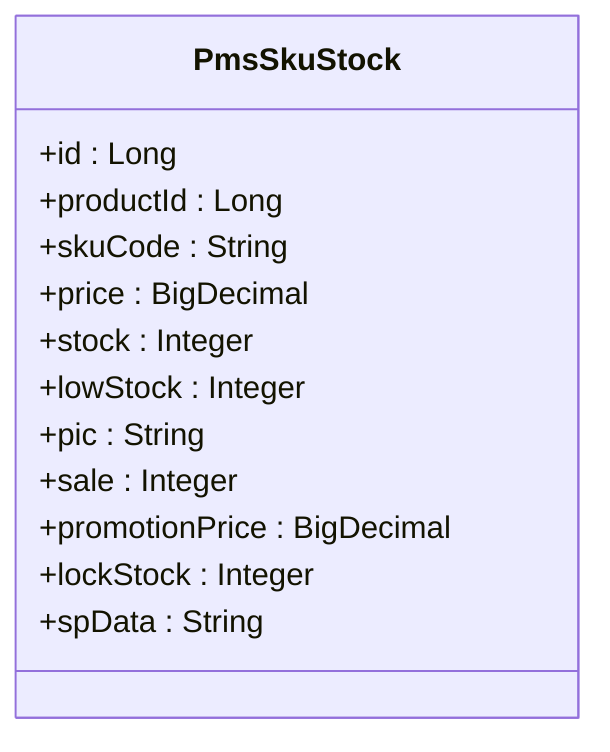
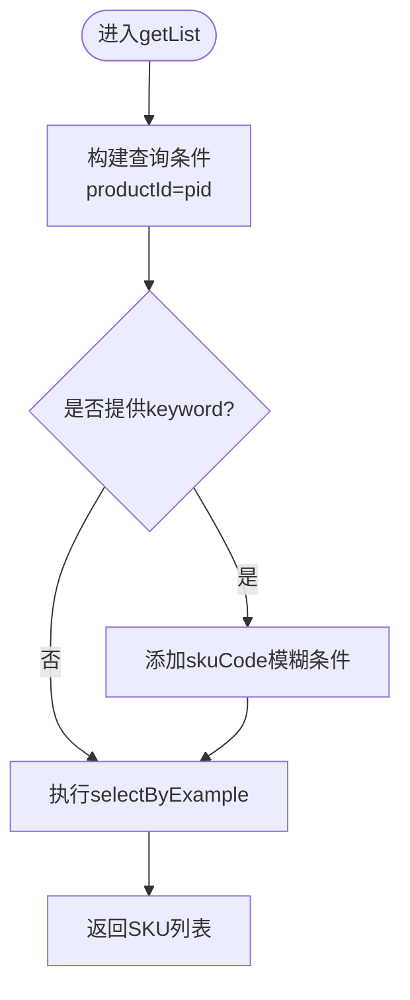
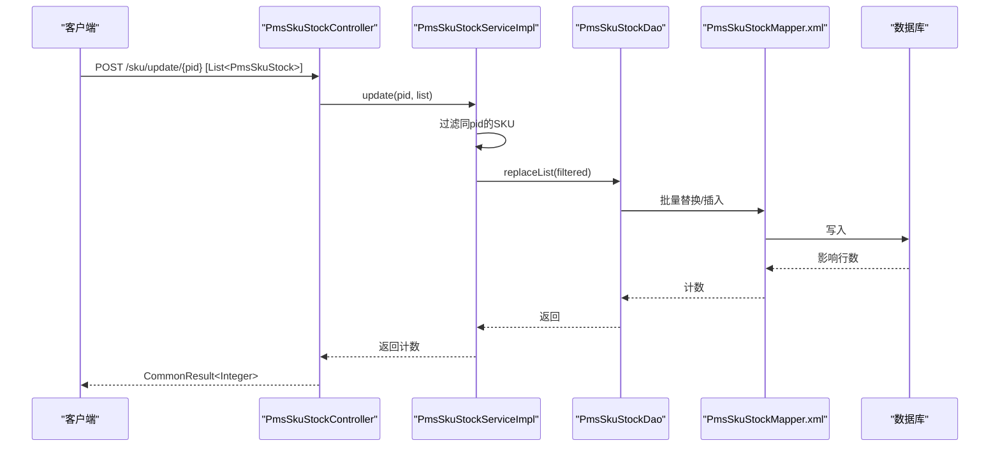
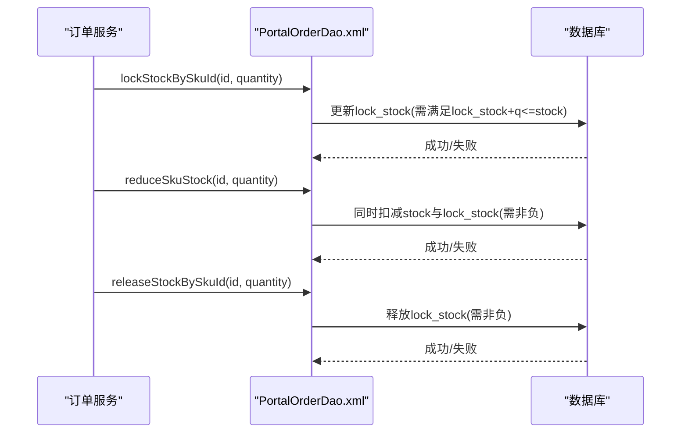
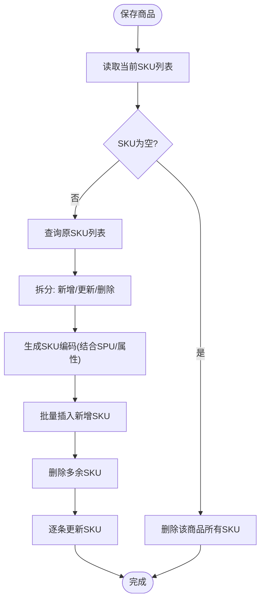
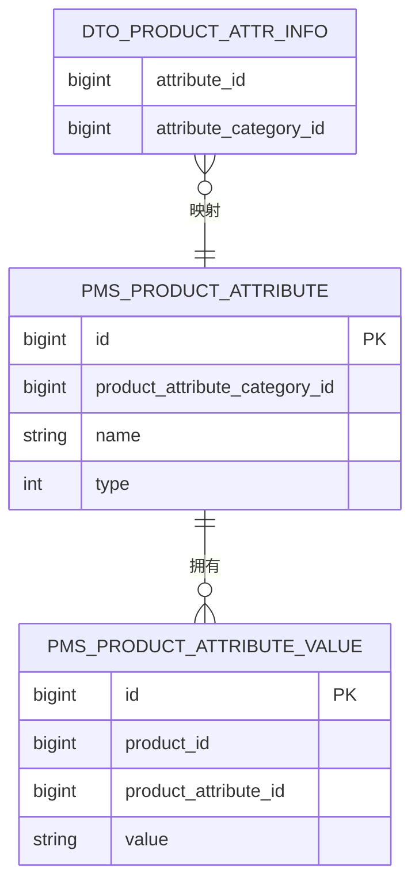
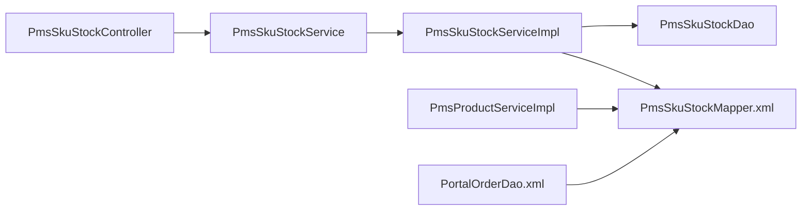

# SKU库存管理

<cite>
**本文引用的文件**   
- [PmsSkuStockController.java](file://mall-admin/src/main/java/com/macro/mall/controller/PmsSkuStockController.java)
- [PmsSkuStockService.java](file://mall-admin/src/main/java/com/macro/mall/service/PmsSkuStockService.java)
- [PmsSkuStockServiceImpl.java](file://mall-admin/src/main/java/com/macro/mall/service/impl/PmsSkuStockServiceImpl.java)
- [PmsSkuStockDao.java](file://mall-admin/src/main/java/com/macro/mall/dao/PmsSkuStockDao.java)
- [PmsSkuStock.java](file://mall-mbg/src/main/java/com/macro/mall/model/PmsSkuStock.java)
- [PmsSkuStockMapper.xml](file://mall-mbg/src/main/resources/com/macro/mall/mapper/PmsSkuStockMapper.xml)
- [PmsProductServiceImpl.java](file://mall-admin/src/main/java/com/macro/mall/service/impl/PmsProductServiceImpl.java)
- [PortalOrderDao.xml](file://mall-portal/src/main/resources/dao/PortalOrderDao.xml)
- [ProductAttrInfo.java](file://mall-admin/src/main/java/com/macro/mall/dto/ProductAttrInfo.java)
- [PmsProductAttributeServiceImpl.java](file://mall-admin/src/main/java/com/macro/mall/service/impl/PmsProductAttributeServiceImpl.java)
- [PmsProductAttribute.java](file://mall-mbg/src/main/java/com/macro/mall/model/PmsProductAttribute.java)
- [PmsProductAttributeValue.java](file://mall-mbg/src/main/java/com/macro/mall/model/PmsProductAttributeValue.java)
</cite>

## 目录
1. [引言](#引言)
2. [项目结构](#项目结构)
3. [核心组件](#核心组件)
4. [架构总览](#架构总览)
5. [详细组件分析](#详细组件分析)
6. [依赖分析](#依赖分析)
7. [性能考虑](#性能考虑)
8. [故障排查指南](#故障排查指南)
9. [结论](#结论)
10. [附录：API接口文档](#附录api接口文档)

## 引言
本文件围绕电商系统中的SKU库存管理能力进行系统化梳理，覆盖以下主题：
- SKU与商品属性的关系：属性组合生成SKU、SKU编码规则、价格差异化处理
- 库存管理业务逻辑：库存扣减、库存回滚、库存同步机制
- 实时监控与预警：低库存阈值与告警联动
- 管理端能力：SKU列表查询、批量更新
- 最佳实践与性能优化建议

## 项目结构
SKU库存管理涉及“管理端”和“前台门户”两个模块：
- 管理端（mall-admin）：提供SKU列表查询、批量更新、与商品属性/规格联动
- 门户（mall-portal）：提供下单流程中的库存锁定、扣减、释放等原子操作

图表来源
- [PmsSkuStockController.java:1-41](file://mall-admin/src/main/java/com/macro/mall/controller/PmsSkuStockController.java#L1-L41)
- [PmsSkuStockService.java:1-22](file://mall-admin/src/main/java/com/macro/mall/service/PmsSkuStockService.java#L1-L22)
- [PmsSkuStockServiceImpl.java:1-44](file://mall-admin/src/main/java/com/macro/mall/service/impl/PmsSkuStockServiceImpl.java#L1-L44)
- [PmsSkuStockDao.java:1-23](file://mall-admin/src/main/java/com/macro/mall/dao/PmsSkuStockDao.java#L1-L23)
- [PmsSkuStock.java:1-140](file://mall-mbg/src/main/java/com/macro/mall/model/PmsSkuStock.java#L1-L140)
- [PmsSkuStockMapper.xml:1-306](file://mall-mbg/src/main/resources/com/macro/mall/mapper/PmsSkuStockMapper.xml#L1-L306)
- [PmsProductServiceImpl.java:160-328](file://mall-admin/src/main/java/com/macro/mall/service/impl/PmsProductServiceImpl.java#L160-L328)
- [PortalOrderDao.xml:1-114](file://mall-portal/src/main/resources/dao/PortalOrderDao.xml#L1-L114)

章节来源
- [PmsSkuStockController.java:1-41](file://mall-admin/src/main/java/com/macro/mall/controller/PmsSkuStockController.java#L1-L41)
- [PmsSkuStockServiceImpl.java:1-44](file://mall-admin/src/main/java/com/macro/mall/service/impl/PmsSkuStockServiceImpl.java#L1-L44)
- [PmsSkuStockMapper.xml:1-306](file://mall-mbg/src/main/resources/com/macro/mall/mapper/PmsSkuStockMapper.xml#L1-L306)
- [PortalOrderDao.xml:1-114](file://mall-portal/src/main/resources/dao/PortalOrderDao.xml#L1-L114)

## 核心组件
- 控制器层：提供SKU列表查询与批量更新接口
- 服务层：封装查询与批量更新逻辑，负责数据过滤与DAO调用
- DAO层：提供批量插入/替换能力
- 模型与映射：定义SKU字段、条件查询与批量更新SQL
- 商品服务：在商品编辑时维护SKU集合，包含SKU编码生成与差异定价
- 门户DAO：提供库存锁定、扣减、释放的原子更新语句

章节来源
- [PmsSkuStockController.java:24-40](file://mall-admin/src/main/java/com/macro/mall/controller/PmsSkuStockController.java#L24-L40)
- [PmsSkuStockService.java:11-21](file://mall-admin/src/main/java/com/macro/mall/service/PmsSkuStockService.java#L11-L21)
- [PmsSkuStockServiceImpl.java:26-42](file://mall-admin/src/main/java/com/macro/mall/service/impl/PmsSkuStockServiceImpl.java#L26-L42)
- [PmsSkuStockDao.java:12-22](file://mall-admin/src/main/java/com/macro/mall/dao/PmsSkuStockDao.java#L12-L22)
- [PmsSkuStock.java:6-29](file://mall-mbg/src/main/java/com/macro/mall/model/PmsSkuStock.java#L6-L29)
- [PmsSkuStockMapper.xml:79-306](file://mall-mbg/src/main/resources/com/macro/mall/mapper/PmsSkuStockMapper.xml#L79-L306)
- [PmsProductServiceImpl.java:163-202](file://mall-admin/src/main/java/com/macro/mall/service/impl/PmsProductServiceImpl.java#L163-L202)
- [PortalOrderDao.xml:50-114](file://mall-portal/src/main/resources/dao/PortalOrderDao.xml#L50-L114)

## 架构总览
下图展示了从管理端到数据库的SKU查询与批量更新路径，以及门户侧的库存操作。

图表来源
- [PmsSkuStockController.java:24-40](file://mall-admin/src/main/java/com/macro/mall/controller/PmsSkuStockController.java#L24-L40)
- [PmsSkuStockServiceImpl.java:26-42](file://mall-admin/src/main/java/com/macro/mall/service/impl/PmsSkuStockServiceImpl.java#L26-L42)
- [PmsSkuStockMapper.xml:79-306](file://mall-mbg/src/main/resources/com/macro/mall/mapper/PmsSkuStockMapper.xml#L79-L306)

## 详细组件分析

### SKU数据模型与字段含义
SKU实体包含库存、预警、价格、销售、图片、SPU规格描述等关键字段，支撑库存管理与前端展示。

图表来源
- [PmsSkuStock.java:6-29](file://mall-mbg/src/main/java/com/macro/mall/model/PmsSkuStock.java#L6-L29)

章节来源
- [PmsSkuStock.java:6-29](file://mall-mbg/src/main/java/com/macro/mall/model/PmsSkuStock.java#L6-L29)

### SKU列表查询
- 支持按商品ID精确匹配，可选关键词模糊匹配SKU编码
- 使用示例：GET /sku/{pid}?keyword=...

图表来源
- [PmsSkuStockServiceImpl.java:27-34](file://mall-admin/src/main/java/com/macro/mall/service/impl/PmsSkuStockServiceImpl.java#L27-L34)
- [PmsSkuStockMapper.xml:79-92](file://mall-mbg/src/main/resources/com/macro/mall/mapper/PmsSkuStockMapper.xml#L79-L92)

章节来源
- [PmsSkuStockController.java:24-29](file://mall-admin/src/main/java/com/macro/mall/controller/PmsSkuStockController.java#L24-L29)
- [PmsSkuStockServiceImpl.java:27-34](file://mall-admin/src/main/java/com/macro/mall/service/impl/PmsSkuStockServiceImpl.java#L27-L34)
- [PmsSkuStockMapper.xml:79-92](file://mall-mbg/src/main/resources/com/macro/mall/mapper/PmsSkuStockMapper.xml#L79-L92)

### SKU批量更新
- 接口：POST /sku/update/{pid}
- 逻辑：仅保留与目标商品ID一致的SKU项，调用DAO批量替换/插入
- 适用场景：商品编辑时一次性同步SKU集合

图表来源
- [PmsSkuStockController.java:30-39](file://mall-admin/src/main/java/com/macro/mall/controller/PmsSkuStockController.java#L30-L39)
- [PmsSkuStockServiceImpl.java:36-42](file://mall-admin/src/main/java/com/macro/mall/service/impl/PmsSkuStockServiceImpl.java#L36-L42)
- [PmsSkuStockDao.java:16-21](file://mall-admin/src/main/java/com/macro/mall/dao/PmsSkuStockDao.java#L16-L21)
- [PmsSkuStockMapper.xml:198-255](file://mall-mbg/src/main/resources/com/macro/mall/mapper/PmsSkuStockMapper.xml#L198-L255)

章节来源
- [PmsSkuStockController.java:30-39](file://mall-admin/src/main/java/com/macro/mall/controller/PmsSkuStockController.java#L30-L39)
- [PmsSkuStockServiceImpl.java:36-42](file://mall-admin/src/main/java/com/macro/mall/service/impl/PmsSkuStockServiceImpl.java#L36-L42)
- [PmsSkuStockDao.java:16-21](file://mall-admin/src/main/java/com/macro/mall/dao/PmsSkuStockDao.java#L16-L21)
- [PmsSkuStockMapper.xml:198-255](file://mall-mbg/src/main/resources/com/macro/mall/mapper/PmsSkuStockMapper.xml#L198-L255)

### 库存扣减、锁定与回滚（门户侧）
门户侧提供下单流程中的库存原子操作，确保并发安全与一致性。

图表来源
- [PortalOrderDao.xml:91-114](file://mall-portal/src/main/resources/dao/PortalOrderDao.xml#L91-L114)

章节来源
- [PortalOrderDao.xml:50-114](file://mall-portal/src/main/resources/dao/PortalOrderDao.xml#L50-L114)

### 库存同步机制（管理端）
管理端通过商品服务在保存商品时同步SKU集合，包含：
- 新增SKU：批量插入
- 删除SKU：按ID删除
- 更新SKU：逐条更新

图表来源
- [PmsProductServiceImpl.java:163-202](file://mall-admin/src/main/java/com/macro/mall/service/impl/PmsProductServiceImpl.java#L163-L202)

章节来源
- [PmsProductServiceImpl.java:163-202](file://mall-admin/src/main/java/com/macro/mall/service/impl/PmsProductServiceImpl.java#L163-L202)

### SKU与商品属性的关系
- 商品属性（attribute）决定SKU的维度（如颜色、尺寸），不同属性组合形成唯一SKU
- 属性值与SKU绑定，用于生成SKU编码与展示
- ProductAttrInfo用于封装“属性ID-属性分类ID”的关联，便于属性管理与筛选

图表来源
- [PmsProductAttribute.java:1-150](file://mall-mbg/src/main/java/com/macro/mall/model/PmsProductAttribute.java#L1-L150)
- [PmsProductAttributeValue.java:1-62](file://mall-mbg/src/main/java/com/macro/mall/model/PmsProductAttributeValue.java#L1-L62)
- [ProductAttrInfo.java:1-17](file://mall-admin/src/main/java/com/macro/mall/dto/ProductAttrInfo.java#L1-L17)
- [PmsProductAttributeServiceImpl.java:98-100](file://mall-admin/src/main/java/com/macro/mall/service/impl/PmsProductAttributeServiceImpl.java#L98-L100)

章节来源
- [PmsProductAttribute.java:1-150](file://mall-mbg/src/main/java/com/macro/mall/model/PmsProductAttribute.java#L1-L150)
- [PmsProductAttributeValue.java:1-62](file://mall-mbg/src/main/java/com/macro/mall/model/PmsProductAttributeValue.java#L1-L62)
- [ProductAttrInfo.java:1-17](file://mall-admin/src/main/java/com/macro/mall/dto/ProductAttrInfo.java#L1-L17)
- [PmsProductAttributeServiceImpl.java:98-100](file://mall-admin/src/main/java/com/macro/mall/service/impl/PmsProductAttributeServiceImpl.java#L98-L100)

### 库存预警与实时监控
- lowStock字段作为库存预警阈值，可用于告警策略
- 门户侧可通过查询SKU列表并结合lowStock进行实时监控
- 建议：结合定时任务扫描lowStock与当前stock，触发补货提醒

章节来源
- [PmsSkuStock.java:17](file://mall-mbg/src/main/java/com/macro/mall/model/PmsSkuStock.java#L17)
- [PmsSkuStockMapper.xml:418-451](file://mall-mbg/src/main/resources/com/macro/mall/mapper/PmsSkuStockMapper.xml#L418-L451)

## 依赖分析
- 控制器依赖服务接口
- 服务实现依赖Mapper与自定义DAO
- 商品服务依赖SKU映射以维护SKU集合
- 门户DAO依赖SKU映射以执行库存原子操作

图表来源
- [PmsSkuStockController.java:21-22](file://mall-admin/src/main/java/com/macro/mall/controller/PmsSkuStockController.java#L21-L22)
- [PmsSkuStockServiceImpl.java:21-24](file://mall-admin/src/main/java/com/macro/mall/service/impl/PmsSkuStockServiceImpl.java#L21-L24)
- [PmsProductServiceImpl.java:163-202](file://mall-admin/src/main/java/com/macro/mall/service/impl/PmsProductServiceImpl.java#L163-L202)
- [PortalOrderDao.xml:50-114](file://mall-portal/src/main/resources/dao/PortalOrderDao.xml#L50-L114)

章节来源
- [PmsSkuStockController.java:21-22](file://mall-admin/src/main/java/com/macro/mall/controller/PmsSkuStockController.java#L21-L22)
- [PmsSkuStockServiceImpl.java:21-24](file://mall-admin/src/main/java/com/macro/mall/service/impl/PmsSkuStockServiceImpl.java#L21-L24)
- [PmsProductServiceImpl.java:163-202](file://mall-admin/src/main/java/com/macro/mall/service/impl/PmsProductServiceImpl.java#L163-L202)
- [PortalOrderDao.xml:50-114](file://mall-portal/src/main/resources/dao/PortalOrderDao.xml#L50-L114)

## 性能考虑
- 批量更新：使用DAO提供的批量插入/替换，减少往返次数
- 查询优化：对productId与skuCode建立索引；避免全表扫描
- 并发控制：门户侧库存操作采用单条UPDATE并带条件校验，降低锁竞争
- 缓存策略：对热点SKU的库存与价格可引入缓存，注意与数据库的最终一致性
- 分页与过滤：列表查询支持关键词过滤，建议配合分页参数

## 故障排查指南
- 批量更新无效：确认请求体中SKU的productId与目标商品ID一致，否则会被过滤掉
- 库存扣减失败：检查stock与lock_stock是否满足非负约束；确认并发场景下的锁策略
- 预警不生效：核对lowStock阈值设置与监控脚本逻辑

章节来源
- [PmsSkuStockServiceImpl.java:36-42](file://mall-admin/src/main/java/com/macro/mall/service/impl/PmsSkuStockServiceImpl.java#L36-L42)
- [PortalOrderDao.xml:91-114](file://mall-portal/src/main/resources/dao/PortalOrderDao.xml#L91-L114)

## 结论
本方案通过清晰的分层设计与原子化的库存操作，实现了SKU库存的高效管理与可靠保障。管理端负责SKU集合的维护与查询，门户侧保证下单过程中的库存一致性。结合属性体系与预警机制，可进一步提升商品管理与供应链协同效率。

## 附录：API接口文档

- 获取SKU列表
  - 方法与路径：GET /sku/{pid}
  - 查询参数：
    - keyword：可选，SKU编码关键字（模糊匹配）
  - 返回：CommonResult<List<PmsSkuStock>>
  - 说明：按商品ID精确查询，可选关键词模糊匹配

- 批量更新SKU
  - 方法与路径：POST /sku/update/{pid}
  - 请求体：List<PmsSkuStock>
  - 返回：CommonResult<Integer>（更新条数）
  - 说明：仅保留与目标商品ID一致的SKU项，其余被过滤；通过DAO批量替换/插入

- 库存实时监控与告警
  - 监控点：查询SKU列表，对比stock与lowStock
  - 告警策略：当stock <= lowStock触发告警
  - 建议：结合定时任务与消息通知

章节来源
- [PmsSkuStockController.java:24-39](file://mall-admin/src/main/java/com/macro/mall/controller/PmsSkuStockController.java#L24-L39)
- [PmsSkuStockServiceImpl.java:26-42](file://mall-admin/src/main/java/com/macro/mall/service/impl/PmsSkuStockServiceImpl.java#L26-L42)
- [PmsSkuStock.java:15-27](file://mall-mbg/src/main/java/com/macro/mall/model/PmsSkuStock.java#L15-L27)