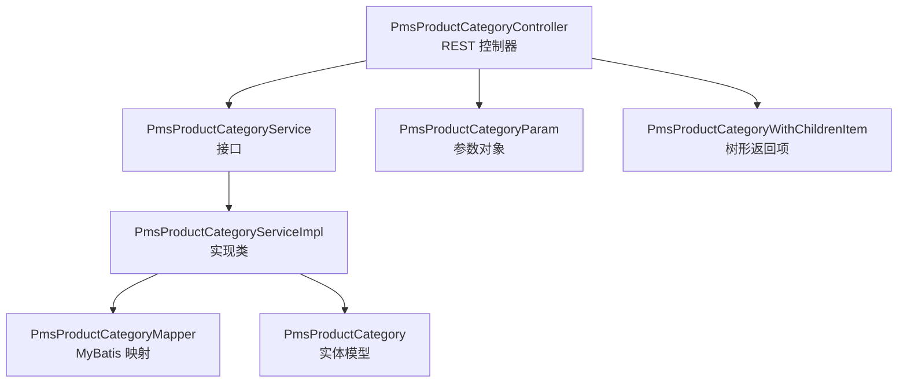
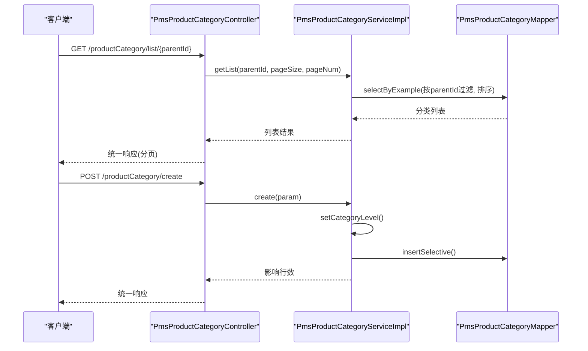
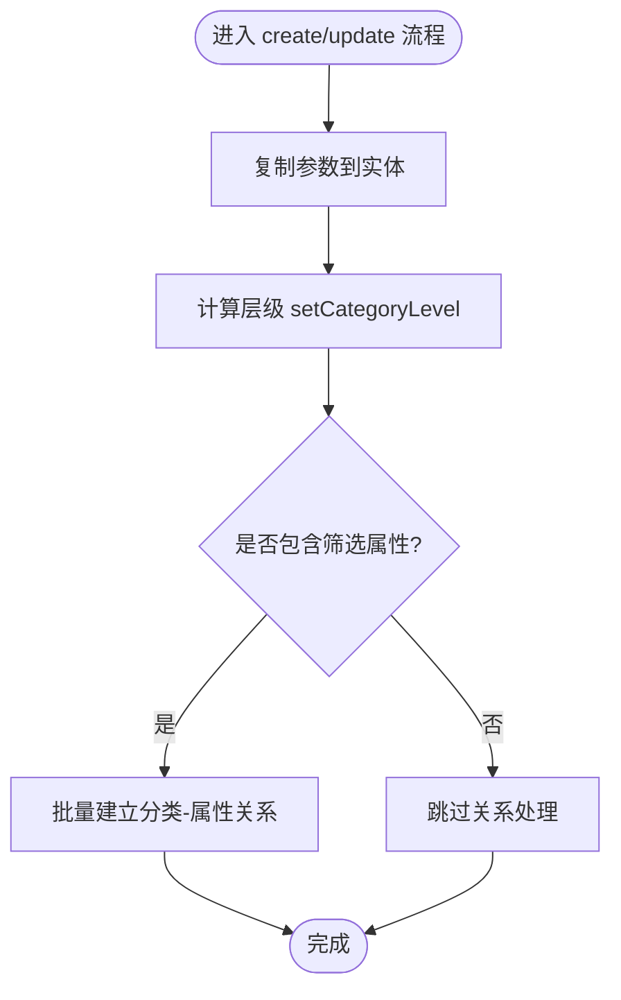
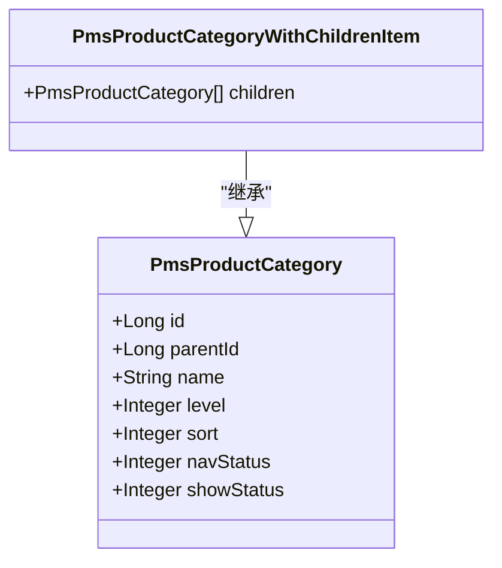
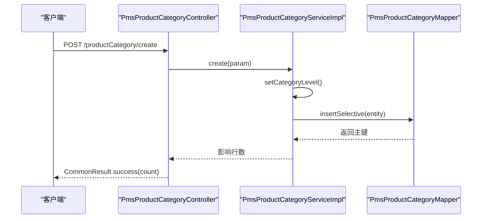
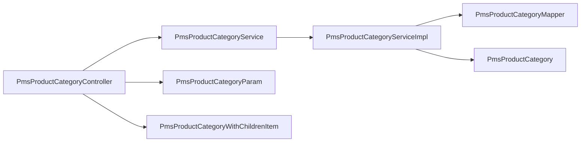

# 分类管理

<cite>
**本文引用的文件**
- [PmsProductCategoryController.java](file://mall-admin/src/main/java/com/macro/mall/controller/PmsProductCategoryController.java)
- [PmsProductCategoryService.java](file://mall-admin/src/main/java/com/macro/mall/service/PmsProductCategoryService.java)
- [PmsProductCategoryServiceImpl.java](file://mall-admin/src/main/java/com/macro/mall/service/impl/PmsProductCategoryServiceImpl.java)
- [PmsProductCategoryParam.java](file://mall-admin/src/main/java/com/macro/mall/dto/PmsProductCategoryParam.java)
- [PmsProductCategoryWithChildrenItem.java](file://mall-admin/src/main/java/com/macro/mall/dto/PmsProductCategoryWithChildrenItem.java)
- [PmsProductCategory.java](file://mall-mbg/src/main/java/com/macro/mall/model/PmsProductCategory.java)
- [PmsProductCategoryMapper.java](file://mall-mbg/src/main/java/com/macro/mall/mapper/PmsProductCategoryMapper.java)
- [PmsProductCategoryMapper.xml](file://mall-mbg/src/main/resources/com/macro/mall/mapper/PmsProductCategoryMapper.xml)
</cite>

## 目录
1. [简介](#简介)
2. [项目结构](#项目结构)
3. [核心组件](#核心组件)
4. [架构总览](#架构总览)
5. [详细组件分析](#详细组件分析)
6. [依赖分析](#依赖分析)
7. [性能考虑](#性能考虑)
8. [故障排查指南](#故障排查指南)
9. [结论](#结论)
10. [附录：API 接口文档与使用示例](#附录api-接口文档与使用示例)

## 简介
本文件系统性梳理“分类管理”功能，围绕 PmsProductCategoryController 的商品分类管理接口展开，覆盖分类层级结构、列表查询、创建、更新、删除、批量状态变更以及树形导航生成等能力。重点解析分类参数对象 PmsProductCategoryParam 的设计要点（如分类名称、父级分类、图标、排序值等），并阐述分类树形结构的实现方式（父子关系处理、层级遍历、导航生成）。同时给出 PmsProductCategoryWithChildrenItem 数据结构说明，用于返回带子分类的完整分类树。

## 项目结构
分类管理功能主要由以下层次构成：
- 控制层：PmsProductCategoryController 提供 REST 接口
- 服务层：PmsProductCategoryService 定义接口；PmsProductCategoryServiceImpl 实现业务逻辑
- DTO 层：PmsProductCategoryParam（请求参数）、PmsProductCategoryWithChildrenItem（树形返回）
- 模型与持久层：PmsProductCategory（实体模型）、PmsProductCategoryMapper（MyBatis 映射）

图表来源
- [PmsProductCategoryController.java:21-26](file://mall-admin/src/main/java/com/macro/mall/controller/PmsProductCategoryController.java#L21-L26)
- [PmsProductCategoryService.java:14-56](file://mall-admin/src/main/java/com/macro/mall/service/PmsProductCategoryService.java#L14-L56)
- [PmsProductCategoryServiceImpl.java:25-36](file://mall-admin/src/main/java/com/macro/mall/service/impl/PmsProductCategoryServiceImpl.java#L25-L36)
- [PmsProductCategoryParam.java:17-32](file://mall-admin/src/main/java/com/macro/mall/dto/PmsProductCategoryParam.java#L17-L32)
- [PmsProductCategoryWithChildrenItem.java:13-17](file://mall-admin/src/main/java/com/macro/mall/dto/PmsProductCategoryWithChildrenItem.java#L13-L17)
- [PmsProductCategory.java:5-30](file://mall-mbg/src/main/java/com/macro/mall/model/PmsProductCategory.java#L5-L30)
- [PmsProductCategoryMapper.java:8-36](file://mall-mbg/src/main/java/com/macro/mall/mapper/PmsProductCategoryMapper.java#L8-L36)

章节来源
- [PmsProductCategoryController.java:21-26](file://mall-admin/src/main/java/com/macro/mall/controller/PmsProductCategoryController.java#L21-L26)
- [PmsProductCategoryService.java:14-56](file://mall-admin/src/main/java/com/macro/mall/service/PmsProductCategoryService.java#L14-L56)
- [PmsProductCategoryServiceImpl.java:25-36](file://mall-admin/src/main/java/com/macro/mall/service/impl/PmsProductCategoryServiceImpl.java#L25-L36)
- [PmsProductCategoryParam.java:17-32](file://mall-admin/src/main/java/com/macro/mall/dto/PmsProductCategoryParam.java#L17-L32)
- [PmsProductCategoryWithChildrenItem.java:13-17](file://mall-admin/src/main/java/com/macro/mall/dto/PmsProductCategoryWithChildrenItem.java#L13-L17)
- [PmsProductCategory.java:5-30](file://mall-mbg/src/main/java/com/macro/mall/model/PmsProductCategory.java#L5-L30)
- [PmsProductCategoryMapper.java:8-36](file://mall-mbg/src/main/java/com/macro/mall/mapper/PmsProductCategoryMapper.java#L8-L36)

## 核心组件
- 控制器接口：提供分类 CRUD、分页列表、单个查询、批量状态更新、树形列表等接口
- 参数对象：封装分类创建/更新所需的字段，包含校验规则
- 返回对象：扩展实体模型，增加 children 字段，用于树形结构返回
- 服务实现：负责参数转换、层级计算、批量属性关联维护、状态批量更新等
- 持久层映射：基于 MyBatis 的 SQL 映射，支持查询、更新、删除等

章节来源
- [PmsProductCategoryController.java:28-106](file://mall-admin/src/main/java/com/macro/mall/controller/PmsProductCategoryController.java#L28-L106)
- [PmsProductCategoryParam.java:17-32](file://mall-admin/src/main/java/com/macro/mall/dto/PmsProductCategoryParam.java#L17-L32)
- [PmsProductCategoryWithChildrenItem.java:13-17](file://mall-admin/src/main/java/com/macro/mall/dto/PmsProductCategoryWithChildrenItem.java#L13-L17)
- [PmsProductCategoryServiceImpl.java:38-154](file://mall-admin/src/main/java/com/macro/mall/service/impl/PmsProductCategoryServiceImpl.java#L38-L154)
- [PmsProductCategoryMapper.xml:78-375](file://mall-mbg/src/main/resources/com/macro/mall/mapper/PmsProductCategoryMapper.xml#L78-L375)

## 架构总览
分类管理采用经典的分层架构：控制层接收请求并返回统一响应体，服务层编排业务流程，持久层通过 MyBatis 访问数据库。树形结构通过 DAO 查询聚合后在服务层组装，最终以带 children 的数据结构返回。

图表来源
- [PmsProductCategoryController.java:52-59](file://mall-admin/src/main/java/com/macro/mall/controller/PmsProductCategoryController.java#L52-L59)
- [PmsProductCategoryController.java:28-37](file://mall-admin/src/main/java/com/macro/mall/controller/PmsProductCategoryController.java#L28-L37)
- [PmsProductCategoryServiceImpl.java:96-102](file://mall-admin/src/main/java/com/macro/mall/service/impl/PmsProductCategoryServiceImpl.java#L96-L102)
- [PmsProductCategoryServiceImpl.java:38-51](file://mall-admin/src/main/java/com/macro/mall/service/impl/PmsProductCategoryServiceImpl.java#L38-L51)
- [PmsProductCategoryMapper.xml:101-114](file://mall-mbg/src/main/resources/com/macro/mall/mapper/PmsProductCategoryMapper.xml#L101-L114)

## 详细组件分析

### 控制器接口与路由
- 路由前缀：/productCategory
- 主要接口：
  - POST /create：创建分类
  - POST /update/{id}：更新分类
  - GET /list/{parentId}：分页查询某父级下的子分类
  - GET /{id}：查询单个分类详情
  - POST /delete/{id}：删除分类
  - POST /update/navStatus：批量更新导航状态
  - POST /update/showStatus：批量更新显示状态
  - GET /list/withChildren：获取树形分类列表

章节来源
- [PmsProductCategoryController.java:28-106](file://mall-admin/src/main/java/com/macro/mall/controller/PmsProductCategoryController.java#L28-L106)

### 参数对象 PmsProductCategoryParam 设计
- 关键字段与语义
  - parentId：父级分类标识，用于构建层级关系
  - name：分类名称，必填
  - productUnit：计量单位
  - navStatus：导航状态（0/1），配合 FlagValidator 校验
  - showStatus：显示状态（0/1），配合 FlagValidator 校验
  - sort：排序值，最小为 0
  - icon：分类图标
  - keywords：关键词
  - description：描述
  - productAttributeIdList：与分类绑定的筛选属性 ID 列表
- 校验规则
  - name 非空
  - navStatus、showStatus 仅允许 0 或 1
  - sort 最小为 0

章节来源
- [PmsProductCategoryParam.java:17-32](file://mall-admin/src/main/java/com/macro/mall/dto/PmsProductCategoryParam.java#L17-L32)

### 实体模型 PmsProductCategory
- 字段概览（关键字段）
  - id、parentId、name、level、productCount、productUnit、navStatus、showStatus、sort、icon、keywords、description
- 作用
  - 作为数据库表 pms_product_category 的 Java 映射
  - 用于查询、更新、删除等持久化操作

章节来源
- [PmsProductCategory.java:5-30](file://mall-mbg/src/main/java/com/macro/mall/model/PmsProductCategory.java#L5-L30)
- [PmsProductCategoryMapper.xml:4-19](file://mall-mbg/src/main/resources/com/macro/mall/mapper/PmsProductCategoryMapper.xml#L4-L19)

### 服务层实现要点
- 创建分类
  - 将参数复制到实体，设置默认 productCount=0
  - 计算层级 setCategoryLevel：若 parentId=0 则 level=0，否则取父级 level+1
  - 插入记录，并根据 productAttributeIdList 批量建立分类与筛选属性的关系
- 更新分类
  - 同步更新商品表中该分类名称
  - 若传入筛选属性列表，则先清空旧关系再批量插入新关系
  - 更新分类信息
- 分页查询
  - 基于 parentId 过滤，按 sort 降序
- 批量状态更新
  - 支持批量更新导航状态与显示状态
- 树形列表
  - 委托 DAO 查询“分类及其子分类”的聚合结果

图表来源
- [PmsProductCategoryServiceImpl.java:38-51](file://mall-admin/src/main/java/com/macro/mall/service/impl/PmsProductCategoryServiceImpl.java#L38-L51)
- [PmsProductCategoryServiceImpl.java:70-93](file://mall-admin/src/main/java/com/macro/mall/service/impl/PmsProductCategoryServiceImpl.java#L70-L93)
- [PmsProductCategoryServiceImpl.java:140-153](file://mall-admin/src/main/java/com/macro/mall/service/impl/PmsProductCategoryServiceImpl.java#L140-L153)

章节来源
- [PmsProductCategoryServiceImpl.java:38-93](file://mall-admin/src/main/java/com/macro/mall/service/impl/PmsProductCategoryServiceImpl.java#L38-L93)
- [PmsProductCategoryServiceImpl.java:140-153](file://mall-admin/src/main/java/com/macro/mall/service/impl/PmsProductCategoryServiceImpl.java#L140-L153)

### 树形结构与导航生成
- 数据结构
  - PmsProductCategoryWithChildrenItem 继承实体模型，新增 children 字段，用于承载子分类集合
- 实现思路
  - 通过 DAO 查询“分类及其子分类”的聚合结果
  - 服务层将扁平结果按父子关系组装为树形结构
  - 返回给控制器，最终以统一响应返回
- 导航生成
  - 通过 navStatus 字段控制是否参与导航展示
  - 结合前端渲染可生成多级导航菜单

图表来源
- [PmsProductCategory.java:5-30](file://mall-mbg/src/main/java/com/macro/mall/model/PmsProductCategory.java#L5-L30)
- [PmsProductCategoryWithChildrenItem.java:13-17](file://mall-admin/src/main/java/com/macro/mall/dto/PmsProductCategoryWithChildrenItem.java#L13-L17)

章节来源
- [PmsProductCategoryWithChildrenItem.java:13-17](file://mall-admin/src/main/java/com/macro/mall/dto/PmsProductCategoryWithChildrenItem.java#L13-L17)
- [PmsProductCategoryServiceImpl.java:132-135](file://mall-admin/src/main/java/com/macro/mall/service/impl/PmsProductCategoryServiceImpl.java#L132-L135)

### API 请求/响应与调用序列
以下序列图展示“创建分类”的典型调用链路：

图表来源
- [PmsProductCategoryController.java:28-37](file://mall-admin/src/main/java/com/macro/mall/controller/PmsProductCategoryController.java#L28-L37)
- [PmsProductCategoryServiceImpl.java:38-51](file://mall-admin/src/main/java/com/macro/mall/service/impl/PmsProductCategoryServiceImpl.java#L38-L51)
- [PmsProductCategoryMapper.xml:146-221](file://mall-mbg/src/main/resources/com/macro/mall/mapper/PmsProductCategoryMapper.xml#L146-L221)

## 依赖分析
- 控制器依赖服务接口
- 服务实现依赖 Mapper 与 DAO（用于树形查询）
- 实体模型与 MyBatis 映射文件一一对应
- 参数与返回对象与实体存在字段映射关系

图表来源
- [PmsProductCategoryController.java:25-26](file://mall-admin/src/main/java/com/macro/mall/controller/PmsProductCategoryController.java#L25-L26)
- [PmsProductCategoryService.java:14-56](file://mall-admin/src/main/java/com/macro/mall/service/PmsProductCategoryService.java#L14-L56)
- [PmsProductCategoryServiceImpl.java:27-36](file://mall-admin/src/main/java/com/macro/mall/service/impl/PmsProductCategoryServiceImpl.java#L27-L36)
- [PmsProductCategoryParam.java:17-32](file://mall-admin/src/main/java/com/macro/mall/dto/PmsProductCategoryParam.java#L17-L32)
- [PmsProductCategoryWithChildrenItem.java:13-17](file://mall-admin/src/main/java/com/macro/mall/dto/PmsProductCategoryWithChildrenItem.java#L13-L17)
- [PmsProductCategory.java:5-30](file://mall-mbg/src/main/java/com/macro/mall/model/PmsProductCategory.java#L5-L30)
- [PmsProductCategoryMapper.java:8-36](file://mall-mbg/src/main/java/com/macro/mall/mapper/PmsProductCategoryMapper.java#L8-L36)

章节来源
- [PmsProductCategoryController.java:25-26](file://mall-admin/src/main/java/com/macro/mall/controller/PmsProductCategoryController.java#L25-L26)
- [PmsProductCategoryService.java:14-56](file://mall-admin/src/main/java/com/macro/mall/service/PmsProductCategoryService.java#L14-L56)
- [PmsProductCategoryServiceImpl.java:27-36](file://mall-admin/src/main/java/com/macro/mall/service/impl/PmsProductCategoryServiceImpl.java#L27-L36)
- [PmsProductCategoryParam.java:17-32](file://mall-admin/src/main/java/com/macro/mall/dto/PmsProductCategoryParam.java#L17-L32)
- [PmsProductCategoryWithChildrenItem.java:13-17](file://mall-admin/src/main/java/com/macro/mall/dto/PmsProductCategoryWithChildrenItem.java#L13-L17)
- [PmsProductCategory.java:5-30](file://mall-mbg/src/main/java/com/macro/mall/model/PmsProductCategory.java#L5-L30)
- [PmsProductCategoryMapper.java:8-36](file://mall-mbg/src/main/java/com/macro/mall/mapper/PmsProductCategoryMapper.java#L8-L36)

## 性能考虑
- 分页查询：列表接口已使用分页组件，建议前端传入合理 pageSize 并限制最大值，避免一次性加载过多节点
- 树形查询：树形列表涉及聚合查询，建议在数据库层面为 parentId、level 等字段建立索引以提升查询效率
- 批量更新：批量状态更新使用 in 条件，建议控制 ids 数量，避免超长 in 列表导致 SQL 性能下降
- 属性关系维护：创建/更新时会批量插入或删除分类-属性关系，建议在数据库层面使用事务保证一致性，并对属性数量进行上限控制

## 故障排查指南
- 参数校验失败
  - 现象：返回失败响应
  - 排查：确认 navStatus/showStatus 是否为 0/1，sort 是否不小于 0，name 是否为空
- 父级不存在
  - 现象：层级计算异常或 level 未按预期设置
  - 排查：确认 parentId 是否正确；若为根分类请设置 parentId=0
- 删除失败
  - 现象：返回影响行数为 0
  - 排查：确认 id 是否存在且未被其他业务引用（如商品关联）
- 树形列表为空
  - 现象：返回空数组
  - 排查：确认数据库中是否存在父级为 0 的分类；检查 DAO 聚合查询是否正常

章节来源
- [PmsProductCategoryParam.java:17-32](file://mall-admin/src/main/java/com/macro/mall/dto/PmsProductCategoryParam.java#L17-L32)
- [PmsProductCategoryServiceImpl.java:140-153](file://mall-admin/src/main/java/com/macro/mall/service/impl/PmsProductCategoryServiceImpl.java#L140-L153)
- [PmsProductCategoryServiceImpl.java:105-107](file://mall-admin/src/main/java/com/macro/mall/service/impl/PmsProductCategoryServiceImpl.java#L105-L107)
- [PmsProductCategoryServiceImpl.java:132-135](file://mall-admin/src/main/java/com/macro/mall/service/impl/PmsProductCategoryServiceImpl.java#L132-L135)

## 结论
分类管理模块通过清晰的分层设计实现了完整的 CRUD、分页查询、批量状态更新与树形导航能力。参数对象与实体模型职责明确，服务层承担了层级计算、关系维护与批量操作等核心逻辑，结合 MyBatis 的高效映射，满足了后台管理系统对分类管理的需求。建议在生产环境中关注索引优化、批量操作的大小控制与事务一致性保障。

## 附录：API 接口文档与使用示例

- 创建分类
  - 方法：POST
  - 路径：/productCategory/create
  - 请求体：PmsProductCategoryParam
  - 响应：CommonResult<Integer>
  - 示例场景：新增一个二级分类，设置 parentId、name、sort、navStatus、showStatus、icon、keywords、description、productAttributeIdList

- 更新分类
  - 方法：POST
  - 路径：/productCategory/update/{id}
  - 路径参数：id
  - 请求体：PmsProductCategoryParam
  - 响应：CommonResult<Integer>
  - 示例场景：修改分类名称、图标、排序、状态，或更新筛选属性关联

- 分类列表（分页）
  - 方法：GET
  - 路径：/productCategory/list/{parentId}
  - 路径参数：parentId
  - 查询参数：pageSize、pageNum
  - 响应：CommonResult<CommonPage<PmsProductCategory>>
  - 示例场景：获取某一级分类下的所有子分类，按 sort 降序分页展示

- 查询单个分类
  - 方法：GET
  - 路径：/productCategory/{id}
  - 路径参数：id
  - 响应：CommonResult<PmsProductCategory>
  - 示例场景：打开编辑页面时加载该分类的全部信息

- 删除分类
  - 方法：POST
  - 路径：/productCategory/delete/{id}
  - 路径参数：id
  - 响应：CommonResult<Integer>
  - 示例场景：删除不再使用的分类（需确保无子分类与商品关联）

- 批量更新导航状态
  - 方法：POST
  - 路径：/productCategory/update/navStatus
  - 查询参数：ids（多个 id）、navStatus（0/1）
  - 响应：CommonResult<Integer>
  - 示例场景：批量启用/禁用多个分类的导航展示

- 批量更新显示状态
  - 方法：POST
  - 路径：/productCategory/update/showStatus
  - 查询参数：ids（多个 id）、showStatus（0/1）
  - 响应：CommonResult<Integer>
  - 示例场景：批量隐藏/显示多个分类

- 树形分类列表
  - 方法：GET
  - 路径：/productCategory/list/withChildren
  - 响应：CommonResult<List<PmsProductCategoryWithChildrenItem>>
  - 示例场景：生成多级导航菜单或树形选择器

章节来源
- [PmsProductCategoryController.java:28-106](file://mall-admin/src/main/java/com/macro/mall/controller/PmsProductCategoryController.java#L28-L106)
- [PmsProductCategoryParam.java:17-32](file://mall-admin/src/main/java/com/macro/mall/dto/PmsProductCategoryParam.java#L17-L32)
- [PmsProductCategoryWithChildrenItem.java:13-17](file://mall-admin/src/main/java/com/macro/mall/dto/PmsProductCategoryWithChildrenItem.java#L13-L17)