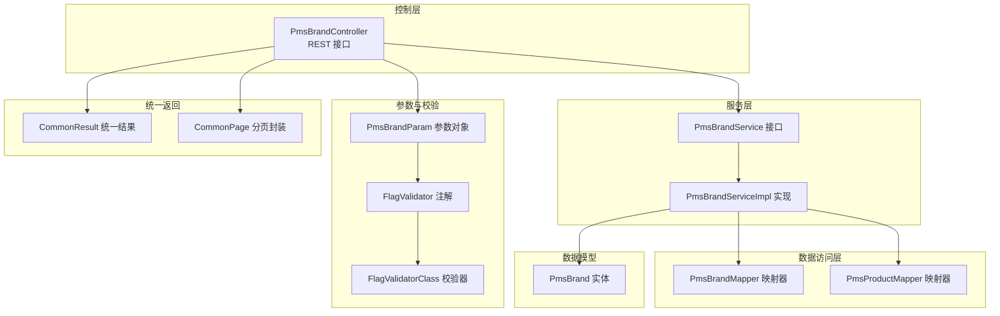
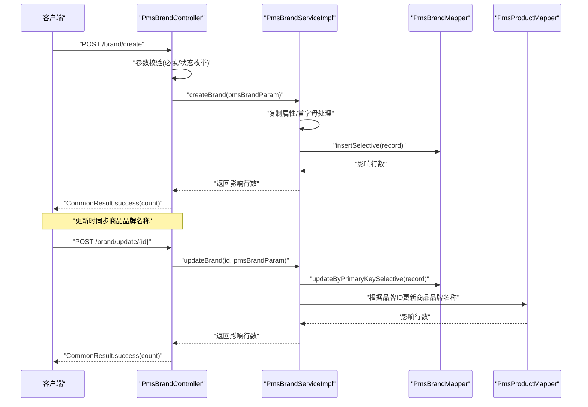
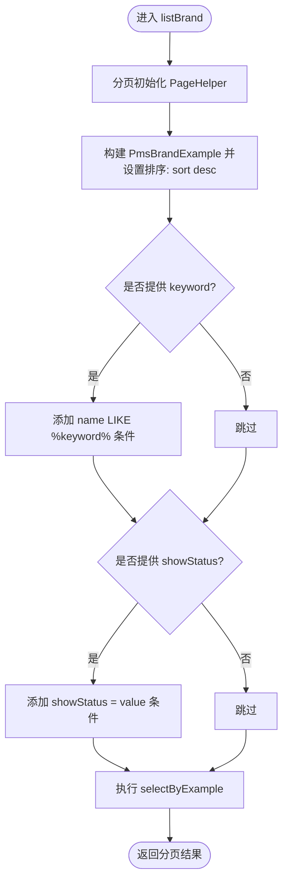
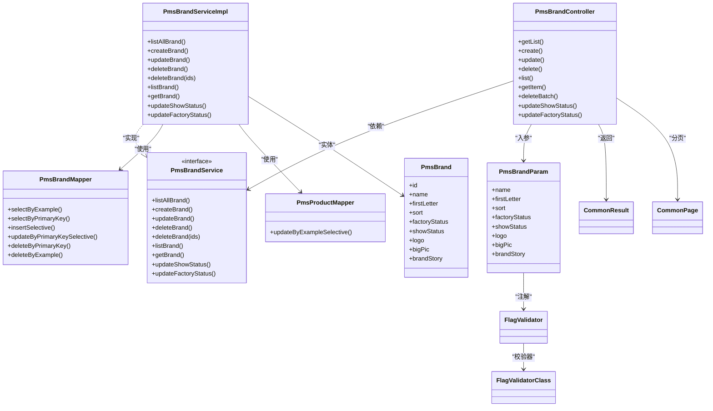

# 品牌管理

<cite>
**本文引用的文件**
- [PmsBrandController.java](file://mall-admin/src/main/java/com/macro/mall/controller/PmsBrandController.java)
- [PmsBrandParam.java](file://mall-admin/src/main/java/com/macro/mall/dto/PmsBrandParam.java)
- [PmsBrandService.java](file://mall-admin/src/main/java/com/macro/mall/service/PmsBrandService.java)
- [PmsBrandServiceImpl.java](file://mall-admin/src/main/java/com/macro/mall/service/impl/PmsBrandServiceImpl.java)
- [PmsBrand.java](file://mall-mbg/src/main/java/com/macro/mall/model/PmsBrand.java)
- [PmsBrandMapper.java](file://mall-mbg/src/main/java/com/macro/mall/mapper/PmsBrandMapper.java)
- [PmsBrandMapper.xml](file://mall-mbg/src/main/resources/com/macro/mall/mapper/PmsBrandMapper.xml)
- [PmsProductMapper.java](file://mall-mbg/src/main/java/com/macro/mall/mapper/PmsProductMapper.java)
- [FlagValidator.java](file://mall-admin/src/main/java/com/macro/mall/validator/FlagValidator.java)
- [FlagValidatorClass.java](file://mall-admin/src/main/java/com/macro/mall/validator/FlagValidatorClass.java)
- [CommonResult.java](file://mall-common/src/main/java/com/macro/mall/common/api/CommonResult.java)
- [CommonPage.java](file://mall-common/src/main/java/com/macro/mall/common/api/CommonPage.java)
- [application.yml](file://mall-admin/src/main/resources/application.yml)
</cite>

## 目录
1. [简介](#简介)
2. [项目结构](#项目结构)
3. [核心组件](#核心组件)
4. [架构总览](#架构总览)
5. [详细组件分析](#详细组件分析)
6. [依赖关系分析](#依赖关系分析)
7. [性能考量](#性能考量)
8. [故障排查指南](#故障排查指南)
9. [结论](#结论)
10. [附录：API 接口文档](#附录api-接口文档)

## 简介
本文件系统化梳理“品牌管理”功能，围绕 PmsBrandController 的品牌管理接口展开，覆盖品牌列表查询、创建、更新、删除、批量操作、状态变更等能力；深入解析品牌参数对象 PmsBrandParam 的设计与约束；阐述品牌管理的业务逻辑（如唯一性校验策略、图片字段处理、排序规则管理）；并提供完整的 API 文档、最佳实践与常见问题处理方案，帮助开发者快速理解与高效维护该模块。

## 项目结构
品牌管理功能位于 mall-admin 模块，采用经典的分层架构：
- 控制层：PmsBrandController 负责接收请求、参数校验、调用服务层并返回统一响应。
- 服务层：PmsBrandService 定义品牌管理接口；PmsBrandServiceImpl 实现具体业务逻辑。
- 数据访问层：MyBatis 映射器 PmsBrandMapper、PmsProductMapper 及其 XML 配置负责数据库交互。
- 数据模型：PmsBrand 表示品牌实体，包含品牌名称、首字母、排序、状态、图片、故事等字段。
- 参数对象：PmsBrandParam 作为入参载体，承载创建/更新时的必填与可选字段，并通过注解进行参数校验。
- 统一返回：CommonResult、CommonPage 提供统一的响应结构与分页封装。
- 校验器：FlagValidator/FlagValidatorClass 对状态字段进行枚举校验。

图表来源
- [PmsBrandController.java:20-121](file://mall-admin/src/main/java/com/macro/mall/controller/PmsBrandController.java#L20-L121)
- [PmsBrandService.java:13-59](file://mall-admin/src/main/java/com/macro/mall/service/PmsBrandService.java#L13-L59)
- [PmsBrandServiceImpl.java:24-113](file://mall-admin/src/main/java/com/macro/mall/service/impl/PmsBrandServiceImpl.java#L24-L113)
- [PmsBrandMapper.java:8-35](file://mall-mbg/src/main/java/com/macro/mall/mapper/PmsBrandMapper.java#L8-L35)
- [PmsProductMapper.java:8-35](file://mall-mbg/src/main/java/com/macro/mall/mapper/PmsProductMapper.java#L8-L35)
- [PmsBrand.java:5-28](file://mall-mbg/src/main/java/com/macro/mall/model/PmsBrand.java#L5-L28)
- [PmsBrandParam.java:14-30](file://mall-admin/src/main/java/com/macro/mall/dto/PmsBrandParam.java#L14-L30)
- [FlagValidator.java:15-23](file://mall-admin/src/main/java/com/macro/mall/validator/FlagValidator.java#L15-L23)
- [FlagValidatorClass.java:10-32](file://mall-admin/src/main/java/com/macro/mall/validator/FlagValidatorClass.java#L10-L32)
- [CommonResult.java:7-133](file://mall-common/src/main/java/com/macro/mall/common/api/CommonResult.java#L7-L133)
- [CommonPage.java:12-99](file://mall-common/src/main/java/com/macro/mall/common/api/CommonPage.java#L12-L99)

章节来源
- [PmsBrandController.java:16-121](file://mall-admin/src/main/java/com/macro/mall/controller/PmsBrandController.java#L16-L121)
- [PmsBrandService.java:9-59](file://mall-admin/src/main/java/com/macro/mall/service/PmsBrandService.java#L9-L59)
- [PmsBrandServiceImpl.java:19-113](file://mall-admin/src/main/java/com/macro/mall/service/impl/PmsBrandServiceImpl.java#L19-L113)
- [PmsBrandParam.java:10-30](file://mall-admin/src/main/java/com/macro/mall/dto/PmsBrandParam.java#L10-L30)
- [PmsBrand.java:5-28](file://mall-mbg/src/main/java/com/macro/mall/model/PmsBrand.java#L5-L28)
- [PmsBrandMapper.java:8-35](file://mall-mbg/src/main/java/com/macro/mall/mapper/PmsBrandMapper.java#L8-L35)
- [PmsBrandMapper.xml:4-18](file://mall-mbg/src/main/resources/com/macro/mall/mapper/PmsBrandMapper.xml#L4-L18)
- [CommonResult.java:35-79](file://mall-common/src/main/java/com/macro/mall/common/api/CommonResult.java#L35-L79)
- [CommonPage.java:37-46](file://mall-common/src/main/java/com/macro/mall/common/api/CommonPage.java#L37-L46)

## 核心组件
- 控制器 PmsBrandController：提供品牌管理的完整 REST 接口，包括列表查询、详情获取、创建、更新、删除、批量删除、批量状态变更等。
- 服务接口与实现 PmsBrandService / PmsBrandServiceImpl：定义并实现品牌业务逻辑，包括分页查询、状态变更、更新时同步商品品牌名称、批量删除等。
- 数据模型与映射 PmsBrand / PmsBrandMapper / PmsBrandMapper.xml：品牌实体与数据库映射，支持基础字段与 BLOB 字段（品牌故事）。
- 参数对象 PmsBrandParam：承载创建/更新的品牌请求参数，含必填与可选字段及状态校验注解。
- 校验器 FlagValidator/FlagValidatorClass：对状态字段（工厂状态、显示状态）进行枚举校验。
- 统一返回 CommonResult/CommonPage：标准化响应结构与分页封装。

章节来源
- [PmsBrandController.java:23-121](file://mall-admin/src/main/java/com/macro/mall/controller/PmsBrandController.java#L23-L121)
- [PmsBrandService.java:13-59](file://mall-admin/src/main/java/com/macro/mall/service/PmsBrandService.java#L13-L59)
- [PmsBrandServiceImpl.java:24-113](file://mall-admin/src/main/java/com/macro/mall/service/impl/PmsBrandServiceImpl.java#L24-L113)
- [PmsBrandParam.java:16-30](file://mall-admin/src/main/java/com/macro/mall/dto/PmsBrandParam.java#L16-L30)
- [FlagValidator.java:15-23](file://mall-admin/src/main/java/com/macro/mall/validator/FlagValidator.java#L15-L23)
- [FlagValidatorClass.java:10-32](file://mall-admin/src/main/java/com/macro/mall/validator/FlagValidatorClass.java#L10-L32)
- [CommonResult.java:35-79](file://mall-common/src/main/java/com/macro/mall/common/api/CommonResult.java#L35-L79)
- [CommonPage.java:37-46](file://mall-common/src/main/java/com/macro/mall/common/api/CommonPage.java#L37-L46)

## 架构总览
品牌管理采用典型的 MVC + 分层架构，请求从控制器进入，经由服务层执行业务逻辑，再通过 MyBatis 访问数据库。参数对象与校验器确保入参合法性；统一返回包装保证前端一致的响应格式。

图表来源
- [PmsBrandController.java:33-58](file://mall-admin/src/main/java/com/macro/mall/controller/PmsBrandController.java#L33-L58)
- [PmsBrandServiceImpl.java:36-62](file://mall-admin/src/main/java/com/macro/mall/service/impl/PmsBrandServiceImpl.java#L36-L62)
- [PmsBrandMapper.java:15-17](file://mall-mbg/src/main/java/com/macro/mall/mapper/PmsBrandMapper.java#L15-L17)
- [PmsProductMapper.java:25-29](file://mall-mbg/src/main/java/com/macro/mall/mapper/PmsProductMapper.java#L25-L29)

## 详细组件分析

### 控制器 PmsBrandController
- 功能清单
  - 获取全部品牌：GET /brand/listAll
  - 分页查询品牌：GET /brand/list（支持关键词、显示状态、分页）
  - 获取单个品牌：GET /brand/{id}
  - 创建品牌：POST /brand/create（入参为 PmsBrandParam）
  - 更新品牌：POST /brand/update/{id}
  - 删除单个品牌：GET /brand/delete/{id}
  - 批量删除：POST /brand/delete/batch
  - 批量修改显示状态：POST /brand/update/showStatus
  - 批量修改工厂状态：POST /brand/update/factoryStatus
- 参数与校验
  - 入参统一使用 @Validated + @RequestBody，结合 PmsBrandParam 的注解进行参数校验。
  - 状态字段通过 @FlagValidator 校验，确保仅允许 0/1。
- 统一返回
  - 使用 CommonResult 包装结果；分页场景使用 CommonPage 进行封装。

章节来源
- [PmsBrandController.java:27-121](file://mall-admin/src/main/java/com/macro/mall/controller/PmsBrandController.java#L27-L121)
- [PmsBrandParam.java:17-29](file://mall-admin/src/main/java/com/macro/mall/dto/PmsBrandParam.java#L17-L29)
- [FlagValidator.java:15-23](file://mall-admin/src/main/java/com/macro/mall/validator/FlagValidator.java#L15-L23)
- [CommonResult.java:35-79](file://mall-common/src/main/java/com/macro/mall/common/api/CommonResult.java#L35-L79)
- [CommonPage.java:37-46](file://mall-common/src/main/java/com/macro/mall/common/api/CommonPage.java#L37-L46)

### 服务层 PmsBrandService / PmsBrandServiceImpl
- 列表与分页
  - listAllBrand：查询所有品牌。
  - listBrand：支持关键词模糊匹配、显示状态过滤、按 sort 降序排序、分页。
- 创建与更新
  - createBrand：复制参数到实体，若首字母为空则取名称首字符；插入记录。
  - updateBrand：复制参数到实体并设置 ID；若首字母为空则取名称首字符；同时根据品牌 ID 同步更新商品表中的品牌名称。
- 删除与批量删除
  - deleteBrand(Long)：按主键删除。
  - deleteBrand(List<Long>)：批量删除。
- 状态变更
  - updateShowStatus：批量更新显示状态。
  - updateFactoryStatus：批量更新工厂状态。

图表来源
- [PmsBrandServiceImpl.java:77-89](file://mall-admin/src/main/java/com/macro/mall/service/impl/PmsBrandServiceImpl.java#L77-L89)
- [PmsBrandMapper.xml:100-113](file://mall-mbg/src/main/resources/com/macro/mall/mapper/PmsBrandMapper.xml#L100-L113)

章节来源
- [PmsBrandService.java:13-59](file://mall-admin/src/main/java/com/macro/mall/service/PmsBrandService.java#L13-L59)
- [PmsBrandServiceImpl.java:30-113](file://mall-admin/src/main/java/com/macro/mall/service/impl/PmsBrandServiceImpl.java#L30-L113)

### 参数对象 PmsBrandParam 设计
- 字段说明
  - name：品牌名称，必填。
  - firstLetter：品牌首字母，可选；若为空，服务层会自动取 name 的首字符。
  - sort：排序值，最小值为 0。
  - factoryStatus：工厂状态，0/1 枚举，通过 @FlagValidator 校验。
  - showStatus：显示状态，0/1 枚举，通过 @FlagValidator 校验。
  - logo：品牌图标，必填。
  - bigPic：大图，可选。
  - brandStory：品牌故事，BLOB 字段，可选。
- 校验策略
  - 必填字段使用 @NotEmpty。
  - 数值下限使用 @Min。
  - 枚举状态使用自定义 @FlagValidator + FlagValidatorClass。

章节来源
- [PmsBrandParam.java:16-30](file://mall-admin/src/main/java/com/macro/mall/dto/PmsBrandParam.java#L16-L30)
- [FlagValidator.java:15-23](file://mall-admin/src/main/java/com/macro/mall/validator/FlagValidator.java#L15-L23)
- [FlagValidatorClass.java:10-32](file://mall-admin/src/main/java/com/macro/mall/validator/FlagValidatorClass.java#L10-L32)

### 数据模型与映射 PmsBrand
- 字段映射
  - 基础字段：id、name、firstLetter、sort、factoryStatus、showStatus、productCount、productCommentCount、logo、bigPic。
  - BLOB 字段：brandStory。
- 映射配置
  - MyBatis ResultMap 定义了 BaseResultMap 与带 BLOB 的 ResultMapWithBLOBs。
  - 支持按 Example 查询、分页、排序、批量更新等。

章节来源
- [PmsBrand.java:5-28](file://mall-mbg/src/main/java/com/macro/mall/model/PmsBrand.java#L5-L28)
- [PmsBrandMapper.xml:4-18](file://mall-mbg/src/main/resources/com/macro/mall/mapper/PmsBrandMapper.xml#L4-L18)
- [PmsBrandMapper.xml:100-121](file://mall-mbg/src/main/resources/com/macro/mall/mapper/PmsBrandMapper.xml#L100-L121)

### 校验器与统一返回
- 校验器
  - FlagValidator：声明式注解，限定状态枚举值。
  - FlagValidatorClass：运行时校验逻辑，支持空值默认通过。
- 统一返回
  - CommonResult：success/failed/validateFailed 等静态方法，统一状态码与消息。
  - CommonPage：restPage 将 PageHelper 结果转换为分页对象。

章节来源
- [FlagValidator.java:15-23](file://mall-admin/src/main/java/com/macro/mall/validator/FlagValidator.java#L15-L23)
- [FlagValidatorClass.java:10-32](file://mall-admin/src/main/java/com/macro/mall/validator/FlagValidatorClass.java#L10-L32)
- [CommonResult.java:35-79](file://mall-common/src/main/java/com/macro/mall/common/api/CommonResult.java#L35-L79)
- [CommonPage.java:37-46](file://mall-common/src/main/java/com/macro/mall/common/api/CommonPage.java#L37-L46)

## 依赖关系分析
- 控制器依赖服务接口；服务实现依赖映射器与产品映射器；映射器依赖 MyBatis 与数据库。
- 参数对象与校验器相互配合，确保入参合法。
- 统一返回包装贯穿整个流程，便于前端消费。

图表来源
- [PmsBrandController.java:23-121](file://mall-admin/src/main/java/com/macro/mall/controller/PmsBrandController.java#L23-L121)
- [PmsBrandService.java:13-59](file://mall-admin/src/main/java/com/macro/mall/service/PmsBrandService.java#L13-L59)
- [PmsBrandServiceImpl.java:24-113](file://mall-admin/src/main/java/com/macro/mall/service/impl/PmsBrandServiceImpl.java#L24-L113)
- [PmsBrandMapper.java:8-35](file://mall-mbg/src/main/java/com/macro/mall/mapper/PmsBrandMapper.java#L8-L35)
- [PmsProductMapper.java:8-35](file://mall-mbg/src/main/java/com/macro/mall/mapper/PmsProductMapper.java#L8-L35)
- [PmsBrandParam.java:16-30](file://mall-admin/src/main/java/com/macro/mall/dto/PmsBrandParam.java#L16-L30)
- [PmsBrand.java:5-28](file://mall-mbg/src/main/java/com/macro/mall/model/PmsBrand.java#L5-L28)
- [FlagValidator.java:15-23](file://mall-admin/src/main/java/com/macro/mall/validator/FlagValidator.java#L15-L23)
- [FlagValidatorClass.java:10-32](file://mall-admin/src/main/java/com/macro/mall/validator/FlagValidatorClass.java#L10-L32)
- [CommonResult.java:35-79](file://mall-common/src/main/java/com/macro/mall/common/api/CommonResult.java#L35-L79)
- [CommonPage.java:37-46](file://mall-common/src/main/java/com/macro/mall/common/api/CommonPage.java#L37-L46)

## 性能考量
- 分页查询
  - 使用 PageHelper 在服务层启动分页，避免一次性加载大量数据。
  - 排序字段为 sort，建议在数据库层面建立索引以提升排序效率。
- 查询条件
  - 关键词模糊匹配使用 name LIKE %keyword%，建议对 name 建立索引或使用全文检索优化。
- 批量操作
  - 批量删除与批量状态更新通过 Example 条件批量执行，减少多次往返。
- 图片字段
  - logo/bigPic 为普通字段，建议结合对象存储（如 OSS）进行管理，避免数据库膨胀。
- 事务与一致性
  - 更新品牌时同步更新商品品牌名称，建议在事务内执行，确保一致性。

[本节为通用性能建议，不直接分析具体文件]

## 故障排查指南
- 参数校验失败
  - 现象：返回参数验证失败。
  - 排查：检查必填字段是否为空、状态值是否为 0/1、排序值是否小于最小值。
  - 参考：[CommonResult.java:84-94](file://mall-common/src/main/java/com/macro/mall/common/api/CommonResult.java#L84-L94)、[FlagValidatorClass.java:18-31](file://mall-admin/src/main/java/com/macro/mall/validator/FlagValidatorClass.java#L18-L31)
- 创建/更新失败
  - 现象：返回失败或影响行数为 0。
  - 排查：确认数据库连接、事务是否生效、实体字段映射是否正确。
  - 参考：[PmsBrandServiceImpl.java:36-62](file://mall-admin/src/main/java/com/macro/mall/service/impl/PmsBrandServiceImpl.java#L36-L62)、[PmsBrandMapper.xml:145-214](file://mall-mbg/src/main/resources/com/macro/mall/mapper/PmsBrandMapper.xml#L145-L214)
- 图片上传与存储
  - 现象：图片无法保存或访问异常。
  - 排查：确认上传配置与 OSS 设置，检查文件大小限制与回调地址。
  - 参考：[application.yml:56-68](file://mall-admin/src/main/resources/application.yml#L56-L68)
- 分页结果异常
  - 现象：分页总数或页码不正确。
  - 排查：确认 PageHelper 初始化顺序、排序字段与数据库索引。
  - 参考：[CommonPage.java:37-46](file://mall-common/src/main/java/com/macro/mall/common/api/CommonPage.java#L37-L46)、[PmsBrandServiceImpl.java:77-89](file://mall-admin/src/main/java/com/macro/mall/service/impl/PmsBrandServiceImpl.java#L77-L89)

章节来源
- [CommonResult.java:84-94](file://mall-common/src/main/java/com/macro/mall/common/api/CommonResult.java#L84-L94)
- [FlagValidatorClass.java:18-31](file://mall-admin/src/main/java/com/macro/mall/validator/FlagValidatorClass.java#L18-L31)
- [PmsBrandServiceImpl.java:36-62](file://mall-admin/src/main/java/com/macro/mall/service/impl/PmsBrandServiceImpl.java#L36-L62)
- [PmsBrandMapper.xml:145-214](file://mall-mbg/src/main/resources/com/macro/mall/mapper/PmsBrandMapper.xml#L145-L214)
- [application.yml:56-68](file://mall-admin/src/main/resources/application.yml#L56-L68)
- [CommonPage.java:37-46](file://mall-common/src/main/java/com/macro/mall/common/api/CommonPage.java#L37-L46)

## 结论
品牌管理模块通过清晰的分层设计与统一的返回规范，提供了完善的品牌 CRUD、分页查询、批量操作与状态变更能力。参数对象与自定义校验器确保了入参的合法性；服务层在更新时同步维护商品品牌名称，保障了数据一致性。结合合理的数据库索引与对象存储策略，可在保证性能的同时提升可维护性。

[本节为总结性内容，不直接分析具体文件]

## 附录：API 接口文档

### 品牌管理 API
- 获取全部品牌
  - 方法：GET
  - 路径：/brand/listAll
  - 返回：CommonResult<List<PmsBrand>>
- 分页查询品牌
  - 方法：GET
  - 路径：/brand/list
  - 查询参数：
    - keyword：关键词（可选）
    - showStatus：显示状态（可选，0/1）
    - pageNum：页码，默认 1
    - pageSize：每页数量，默认 5
  - 返回：CommonResult<CommonPage<PmsBrand>>
- 获取单个品牌
  - 方法：GET
  - 路径：/brand/{id}
  - 路径参数：id
  - 返回：CommonResult<PmsBrand>
- 创建品牌
  - 方法：POST
  - 路径：/brand/create
  - 请求体：PmsBrandParam
  - 返回：CommonResult<Integer>
- 更新品牌
  - 方法：POST
  - 路径：/brand/update/{id}
  - 路径参数：id
  - 请求体：PmsBrandParam
  - 返回：CommonResult<Integer>
- 删除单个品牌
  - 方法：GET
  - 路径：/brand/delete/{id}
  - 路径参数：id
  - 返回：CommonResult<Void>
- 批量删除
  - 方法：POST
  - 路径：/brand/delete/batch
  - 请求参数：ids（List<Long>）
  - 返回：CommonResult<Integer>
- 批量修改显示状态
  - 方法：POST
  - 路径：/brand/update/showStatus
  - 请求参数：ids（List<Long>）、showStatus（0/1）
  - 返回：CommonResult<Integer>
- 批量修改工厂状态
  - 方法：POST
  - 路径：/brand/update/factoryStatus
  - 请求参数：ids（List<Long>）、factoryStatus（0/1）
  - 返回：CommonResult<Integer>

章节来源
- [PmsBrandController.java:27-121](file://mall-admin/src/main/java/com/macro/mall/controller/PmsBrandController.java#L27-L121)