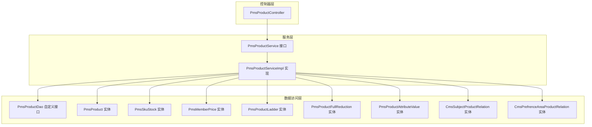
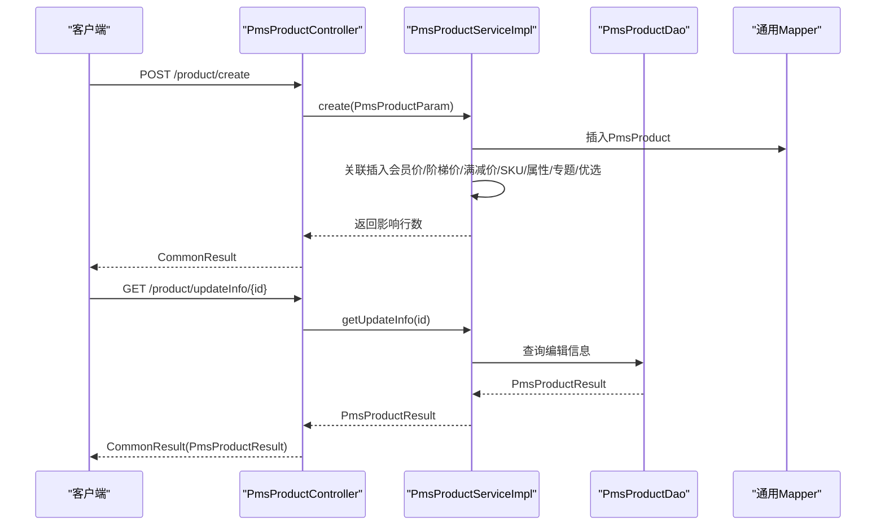
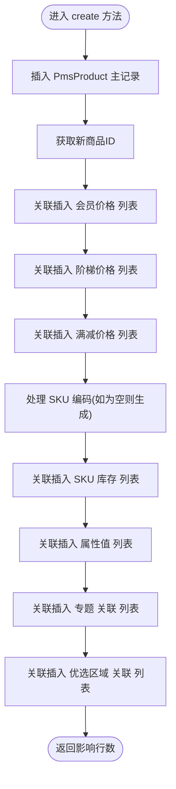
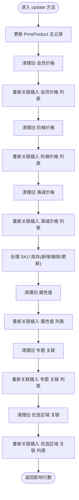
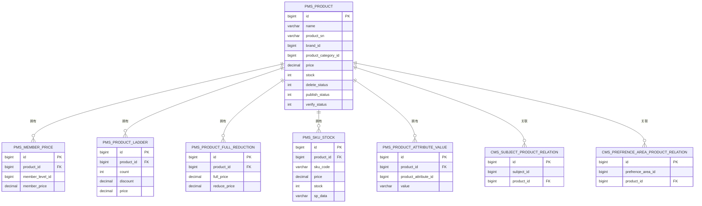
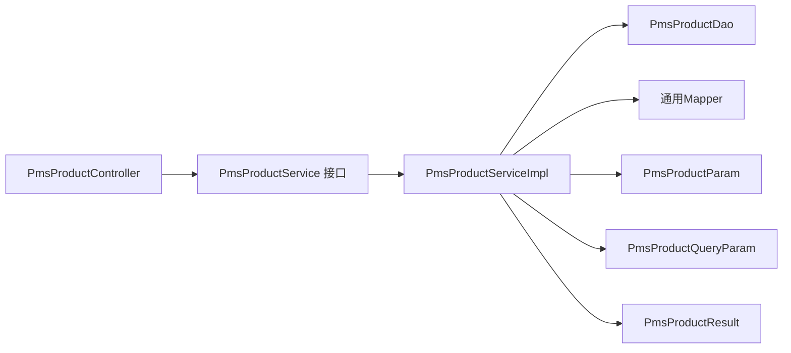

# 商品CRUD操作

<cite>
**本文引用的文件**
- [PmsProductController.java](file://mall-admin/src/main/java/com/macro/mall/controller/PmsProductController.java)
- [PmsProductService.java](file://mall-admin/src/main/java/com/macro/mall/service/PmsProductService.java)
- [PmsProductServiceImpl.java](file://mall-admin/src/main/java/com/macro/mall/service/impl/PmsProductServiceImpl.java)
- [PmsProductParam.java](file://mall-admin/src/main/java/com/macro/mall/dto/PmsProductParam.java)
- [PmsProductQueryParam.java](file://mall-admin/src/main/java/com/macro/mall/dto/PmsProductQueryParam.java)
- [PmsProductResult.java](file://mall-admin/src/main/java/com/macro/mall/dto/PmsProductResult.java)
- [PmsProductDao.java](file://mall-admin/src/main/java/com/macro/mall/dao/PmsProductDao.java)
- [PmsProduct.java](file://mall-mbg/src/main/java/com/macro/mall/model/PmsProduct.java)
- [PmsSkuStock.java](file://mall-mbg/src/main/java/com/macro/mall/model/PmsSkuStock.java)
- [PmsMemberPrice.java](file://mall-mbg/src/main/java/com/macro/mall/model/PmsMemberPrice.java)
- [PmsProductLadder.java](file://mall-mbg/src/main/java/com/macro/mall/model/PmsProductLadder.java)
- [PmsProductFullReduction.java](file://mall-mbg/src/main/java/com/macro/mall/model/PmsProductFullReduction.java)
- [PmsProductAttributeValue.java](file://mall-mbg/src/main/java/com/macro/mall/model/PmsProductAttributeValue.java)
- [CmsSubjectProductRelation.java](file://mall-mbg/src/main/java/com/macro/mall/model/CmsSubjectProductRelation.java)
- [CmsPrefrenceAreaProductRelation.java](file://mall-mbg/src/main/java/com/macro/mall/model/CmsPrefrenceAreaProductRelation.java)
</cite>

## 目录
1. [简介](#简介)
2. [项目结构](#项目结构)
3. [核心组件](#核心组件)
4. [架构总览](#架构总览)
5. [详细组件分析](#详细组件分析)
6. [依赖分析](#依赖分析)
7. [性能考虑](#性能考虑)
8. [故障排查指南](#故障排查指南)
9. [结论](#结论)
10. [附录](#附录)

## 简介
本文件围绕商品CRUD操作进行系统化说明，重点覆盖以下内容：
- 控制器接口：商品创建、更新、详情获取、列表查询、简单列表查询等核心能力
- 参数对象设计：PmsProductParam对商品基本信息、图片信息、规格属性、价格设置等的封装
- 服务层业务逻辑：商品验证规则、数据持久化、关联数据处理策略
- 完整RESTful API接口文档：请求参数、响应格式、错误处理
- 实际接口调用示例与常见问题解决方案

## 项目结构
商品模块位于 mall-admin 工程中，采用经典的分层架构：
- 控制器层：PmsProductController 提供REST接口
- 服务层：PmsProductService 接口与 PmsProductServiceImpl 实现
- DTO/Model：PmsProductParam、PmsProductQueryParam、PmsProductResult 封装请求/响应数据；MBG生成的实体模型承载数据库映射
- DAO：PmsProductDao 自定义查询接口，配合通用 Mapper 实现复杂查询

图表来源
- [PmsProductController.java:21-134](file://mall-admin/src/main/java/com/macro/mall/controller/PmsProductController.java#L21-L134)
- [PmsProductService.java:17-74](file://mall-admin/src/main/java/com/macro/mall/service/PmsProductService.java#L17-L74)
- [PmsProductServiceImpl.java:30-328](file://mall-admin/src/main/java/com/macro/mall/service/impl/PmsProductServiceImpl.java#L30-L328)
- [PmsProductDao.java:11-16](file://mall-admin/src/main/java/com/macro/mall/dao/PmsProductDao.java#L11-L16)

章节来源
- [PmsProductController.java:21-134](file://mall-admin/src/main/java/com/macro/mall/controller/PmsProductController.java#L21-L134)
- [PmsProductService.java:17-74](file://mall-admin/src/main/java/com/macro/mall/service/PmsProductService.java#L17-L74)
- [PmsProductServiceImpl.java:30-328](file://mall-admin/src/main/java/com/macro/mall/service/impl/PmsProductServiceImpl.java#L30-L328)
- [PmsProductDao.java:11-16](file://mall-admin/src/main/java/com/macro/mall/dao/PmsProductDao.java#L11-L16)

## 核心组件
- 控制器接口：提供商品的增删改查与批量状态变更接口，统一返回 CommonResult 包裹结果或分页包装
- 参数对象：PmsProductParam 继承 PmsProduct 并扩展促销、SKU、属性、专题与优选区域关联集合
- 查询参数：PmsProductQueryParam 支持按发布状态、审核状态、关键词、货号、分类、品牌等条件过滤
- 结果对象：PmsProductResult 在 PmsProductParam 基础上增加分类父ID字段，用于编辑时回显
- 服务实现：围绕事务边界与关联数据处理，完成商品主数据与多类子表的一致性写入/更新

章节来源
- [PmsProductController.java:28-132](file://mall-admin/src/main/java/com/macro/mall/controller/PmsProductController.java#L28-L132)
- [PmsProductParam.java:13-23](file://mall-admin/src/main/java/com/macro/mall/dto/PmsProductParam.java#L13-L23)
- [PmsProductQueryParam.java:10-19](file://mall-admin/src/main/java/com/macro/mall/dto/PmsProductQueryParam.java#L10-L19)
- [PmsProductResult.java:10-14](file://mall-admin/src/main/java/com/macro/mall/dto/PmsProductResult.java#L10-L14)
- [PmsProductService.java:17-74](file://mall-admin/src/main/java/com/macro/mall/service/PmsProductService.java#L17-L74)

## 架构总览
商品CRUD在控制器、服务与DAO之间形成清晰的职责边界，服务层承担事务控制与关联数据一致性处理。

图表来源
- [PmsProductController.java:28-44](file://mall-admin/src/main/java/com/macro/mall/controller/PmsProductController.java#L28-L44)
- [PmsProductServiceImpl.java:68-95](file://mall-admin/src/main/java/com/macro/mall/service/impl/PmsProductServiceImpl.java#L68-L95)
- [PmsProductDao.java:11-16](file://mall-admin/src/main/java/com/macro/mall/dao/PmsProductDao.java#L11-L16)

## 详细组件分析

### 控制器接口定义
- 创建商品：POST /product/create，请求体为 PmsProductParam，返回 CommonResult<Integer>
- 获取更新信息：GET /product/updateInfo/{id}，返回 CommonResult<PmsProductResult>
- 更新商品：POST /product/update/{id}，请求体为 PmsProductParam，返回 CommonResult<Integer>
- 列表查询：GET /product/list，支持分页与多条件筛选，返回 CommonPage<PmsProduct>
- 简单列表：GET /product/simpleList，支持按关键字模糊匹配，返回 List<PmsProduct>
- 批量状态变更：POST /product/update/verifyStatus、/publishStatus、/recommendStatus、/newStatus、/deleteStatus

章节来源
- [PmsProductController.java:28-132](file://mall-admin/src/main/java/com/macro/mall/controller/PmsProductController.java#L28-L132)

### 参数对象设计：PmsProductParam
- 继承 PmsProduct，复用商品基础字段（名称、货号、品牌、分类、描述、相册、价格、库存等）
- 扩展字段：
  - 促销价格：阶梯价格列表、满减价格列表、会员价格列表
  - 库存与SKU：SKU库存列表，含SKU编码、价格、库存、销售价、SP规格等
  - 规格属性：自定义属性值列表
  - 关联专题与优选区域：专题/优选区域与商品的关联列表

该设计将“主数据 + 多类子表”一次性提交，便于服务层统一处理事务与一致性。

章节来源
- [PmsProductParam.java:13-23](file://mall-admin/src/main/java/com/macro/mall/dto/PmsProductParam.java#L13-L23)
- [PmsProduct.java:7-92](file://mall-mbg/src/main/java/com/macro/mall/model/PmsProduct.java#L7-L92)
- [PmsSkuStock.java:6-29](file://mall-mbg/src/main/java/com/macro/mall/model/PmsSkuStock.java#L6-L29)
- [PmsMemberPrice.java:6-17](file://mall-mbg/src/main/java/com/macro/mall/model/PmsMemberPrice.java#L6-L17)
- [PmsProductLadder.java:6-17](file://mall-mbg/src/main/java/com/macro/mall/model/PmsProductLadder.java#L6-L17)
- [PmsProductFullReduction.java:6-15](file://mall-mbg/src/main/java/com/macro/mall/model/PmsProductFullReduction.java#L6-L15)
- [PmsProductAttributeValue.java:5-14](file://mall-mbg/src/main/java/com/macro/mall/model/PmsProductAttributeValue.java#L5-L14)
- [CmsSubjectProductRelation.java:5-12](file://mall-mbg/src/main/java/com/macro/mall/model/CmsSubjectProductRelation.java#L5-L12)
- [CmsPrefrenceAreaProductRelation.java:5-12](file://mall-mbg/src/main/java/com/macro/mall/model/CmsPrefrenceAreaProductRelation.java#L5-L12)

### 服务层业务逻辑
- 创建流程：
  - 插入 PmsProduct 主记录，获取新ID
  - 逐类关联插入：会员价格、阶梯价格、满减价格、SKU库存、属性值、专题与优选区域关联
  - SKU编码处理：若未提供则按日期+商品ID+序号生成唯一编码
- 更新流程：
  - 先更新 PmsProduct 主记录
  - 清理旧关联数据后重新插入（会员价、阶梯价、满减价、属性值）
  - SKU库存采用“新增/删除/更新”的三段式策略，确保与前端传入保持一致
- 列表查询：
  - 支持按发布状态、审核状态、关键词、货号、分类、品牌过滤
  - 默认排除已删除商品
- 简单列表：
  - 按名称或货号模糊匹配，支持 OR 条件组合
- 批量状态变更：
  - 审核状态变更会同步写入审核记录表

图表来源
- [PmsProductServiceImpl.java:68-95](file://mall-admin/src/main/java/com/macro/mall/service/impl/PmsProductServiceImpl.java#L68-L95)
- [PmsProductServiceImpl.java:97-113](file://mall-admin/src/main/java/com/macro/mall/service/impl/PmsProductServiceImpl.java#L97-L113)

图表来源
- [PmsProductServiceImpl.java:120-161](file://mall-admin/src/main/java/com/macro/mall/service/impl/PmsProductServiceImpl.java#L120-L161)
- [PmsProductServiceImpl.java:163-204](file://mall-admin/src/main/java/com/macro/mall/service/impl/PmsProductServiceImpl.java#L163-L204)

章节来源
- [PmsProductServiceImpl.java:68-328](file://mall-admin/src/main/java/com/macro/mall/service/impl/PmsProductServiceImpl.java#L68-L328)

### 数据模型关系
商品主数据与多类子表通过 productId 建立一对多关系，服务层通过统一的“建立与插入”工具方法批量处理。

图表来源
- [PmsProduct.java:7-92](file://mall-mbg/src/main/java/com/macro/mall/model/PmsProduct.java#L7-L92)
- [PmsMemberPrice.java:6-17](file://mall-mbg/src/main/java/com/macro/mall/model/PmsMemberPrice.java#L6-L17)
- [PmsProductLadder.java:6-17](file://mall-mbg/src/main/java/com/macro/mall/model/PmsProductLadder.java#L6-L17)
- [PmsProductFullReduction.java:6-15](file://mall-mbg/src/main/java/com/macro/mall/model/PmsProductFullReduction.java#L6-L15)
- [PmsSkuStock.java:6-29](file://mall-mbg/src/main/java/com/macro/mall/model/PmsSkuStock.java#L6-L29)
- [PmsProductAttributeValue.java:5-14](file://mall-mbg/src/main/java/com/macro/mall/model/PmsProductAttributeValue.java#L5-L14)
- [CmsSubjectProductRelation.java:5-12](file://mall-mbg/src/main/java/com/macro/mall/model/CmsSubjectProductRelation.java#L5-L12)
- [CmsPrefrenceAreaProductRelation.java:5-12](file://mall-mbg/src/main/java/com/macro/mall/model/CmsPrefrenceAreaProductRelation.java#L5-L12)

## 依赖分析
- 控制器依赖服务接口，服务实现依赖DAO与通用Mapper
- 服务层通过反射调用DAO的 insertList 批量插入方法，降低重复代码
- 查询参数与结果对象贯穿控制器、服务与DAO，保证接口契约稳定

图表来源
- [PmsProductController.java:25-26](file://mall-admin/src/main/java/com/macro/mall/controller/PmsProductController.java#L25-L26)
- [PmsProductService.java:3-6](file://mall-admin/src/main/java/com/macro/mall/service/PmsProductService.java#L3-L6)
- [PmsProductServiceImpl.java:33-66](file://mall-admin/src/main/java/com/macro/mall/service/impl/PmsProductServiceImpl.java#L33-L66)
- [PmsProductParam.java:15](file://mall-admin/src/main/java/com/macro/mall/dto/PmsProductParam.java#L15)
- [PmsProductQueryParam.java:12-19](file://mall-admin/src/main/java/com/macro/mall/dto/PmsProductQueryParam.java#L12-L19)
- [PmsProductResult.java:10](file://mall-admin/src/main/java/com/macro/mall/dto/PmsProductResult.java#L10)

章节来源
- [PmsProductController.java:25-26](file://mall-admin/src/main/java/com/macro/mall/controller/PmsProductController.java#L25-L26)
- [PmsProductService.java:3-6](file://mall-admin/src/main/java/com/macro/mall/service/PmsProductService.java#L3-L6)
- [PmsProductServiceImpl.java:33-66](file://mall-admin/src/main/java/com/macro/mall/service/impl/PmsProductServiceImpl.java#L33-L66)

## 性能考虑
- 分页查询：列表查询使用分页助手，建议合理设置页大小，避免超大结果集
- 批量插入：通过DAO的 insertList 批量写入，减少JDBC往返
- SKU处理：更新时区分新增、删除、更新三类操作，避免全量替换带来的不必要开销
- 字段选择：查询时尽量缩小范围（如按品牌、分类、状态），减少LIKE匹配成本

## 故障排查指南
- 创建失败或部分数据缺失
  - 检查 PmsProductParam 的必填字段是否完整
  - 关注 SKU 编码生成逻辑，确保未提供时可正确生成
  - 查看服务层日志，定位 relateAndInsertList 抛错位置
- 更新后SKU异常
  - 确认前端传入的SKU列表是否包含新增/删除/更新标识
  - 检查 handleUpdateSkuStockList 的分支逻辑是否符合预期
- 列表查询无结果
  - 确认查询参数（状态、关键词、货号、分类、品牌）是否正确
  - 注意默认过滤 deleteStatus=0 的条件
- 批量状态变更无效
  - 确认ids列表非空且存在
  - 审核状态变更会同时写入审核记录，请检查审核记录表是否成功插入

章节来源
- [PmsProductServiceImpl.java:310-325](file://mall-admin/src/main/java/com/macro/mall/service/impl/PmsProductServiceImpl.java#L310-L325)
- [PmsProductServiceImpl.java:163-204](file://mall-admin/src/main/java/com/macro/mall/service/impl/PmsProductServiceImpl.java#L163-L204)
- [PmsProductServiceImpl.java:206-231](file://mall-admin/src/main/java/com/macro/mall/service/impl/PmsProductServiceImpl.java#L206-L231)
- [PmsProductServiceImpl.java:233-253](file://mall-admin/src/main/java/com/macro/mall/service/impl/PmsProductServiceImpl.java#L233-L253)

## 结论
本模块通过清晰的分层设计与完善的参数封装，实现了商品主数据与其促销、SKU、属性、专题与优选区域关联的统一管理。服务层在事务边界内完成一致性写入，并提供灵活的查询与批量状态变更能力，满足后台商品管理的核心需求。

## 附录

### RESTful API 接口文档

- 创建商品
  - 方法：POST
  - 路径：/product/create
  - 请求体：PmsProductParam
  - 成功响应：CommonResult<Integer>（返回影响行数）
  - 失败响应：CommonResult（failed）

- 获取更新信息
  - 方法：GET
  - 路径：/product/updateInfo/{id}
  - 路径参数：id（Long）
  - 成功响应：CommonResult<PmsProductResult>

- 更新商品
  - 方法：POST
  - 路径：/product/update/{id}
  - 路径参数：id（Long）
  - 请求体：PmsProductParam
  - 成功响应：CommonResult<Integer>（返回影响行数）
  - 失败响应：CommonResult（failed）

- 列表查询
  - 方法：GET
  - 路径：/product/list
  - 查询参数：
    - productQueryParam：PmsProductQueryParam
    - pageSize：Integer（默认5）
    - pageNum：Integer（默认1）
  - 成功响应：CommonResult<CommonPage<PmsProduct>>

- 简单列表
  - 方法：GET
  - 路径：/product/simpleList
  - 查询参数：keyword（String）
  - 成功响应：CommonResult<List<PmsProduct>>

- 批量状态变更（示例：审核状态）
  - 方法：POST
  - 路径：/product/update/verifyStatus
  - 表单参数：
    - ids：List<Long>
    - verifyStatus：Integer
    - detail：String
  - 成功响应：CommonResult<Integer>

- 批量状态变更（示例：发布状态）
  - 方法：POST
  - 路径：/product/update/publishStatus
  - 表单参数：
    - ids：List<Long>
    - publishStatus：Integer
  - 成功响应：CommonResult<Integer>

- 批量状态变更（示例：推荐状态/新品状态/删除状态）
  - 方法：POST
  - 路径：/product/update/recommendStatus | /newStatus | /deleteStatus
  - 表单参数：
    - ids：List<Long>
    - recommendStatus/newStatus/deleteStatus：Integer
  - 成功响应：CommonResult<Integer>

章节来源
- [PmsProductController.java:28-132](file://mall-admin/src/main/java/com/macro/mall/controller/PmsProductController.java#L28-L132)

### 请求参数与响应格式说明
- PmsProductParam
  - 继承 PmsProduct 的所有字段
  - 扩展字段：促销价格列表、SKU库存列表、属性值列表、专题与优选区域关联列表
- PmsProductQueryParam
  - publishStatus：Integer
  - verifyStatus：Integer
  - keyword：String
  - productSn：String
  - productCategoryId：Long
  - brandId：Long
- PmsProductResult
  - 在 PmsProductParam 基础上增加 cateParentId（Long）

章节来源
- [PmsProductParam.java:13-23](file://mall-admin/src/main/java/com/macro/mall/dto/PmsProductParam.java#L13-L23)
- [PmsProductQueryParam.java:10-19](file://mall-admin/src/main/java/com/macro/mall/dto/PmsProductQueryParam.java#L10-L19)
- [PmsProductResult.java:10-14](file://mall-admin/src/main/java/com/macro/mall/dto/PmsProductResult.java#L10-L14)

### 常见问题与解决方案
- 问题：创建后SKU未生效
  - 解决：确认 SKU 列表中每项的 productId 已被正确设置；若未提供 SKU 编码，需确保 handleSkuStockCode 逻辑正常执行
- 问题：更新后部分促销价格未更新
  - 解决：服务层会先清理旧记录再插入新列表，确保前端传入的是全量最新列表
- 问题：列表查询结果过多导致卡顿
  - 解决：合理设置 pageSize；优先使用精确条件过滤；避免无意义的 LIKE 匹配
- 问题：批量状态变更后审核记录缺失
  - 解决：审核状态变更会写入审核记录表，检查对应记录是否成功插入

章节来源
- [PmsProductServiceImpl.java:78-94](file://mall-admin/src/main/java/com/macro/mall/service/impl/PmsProductServiceImpl.java#L78-L94)
- [PmsProductServiceImpl.java:127-160](file://mall-admin/src/main/java/com/macro/mall/service/impl/PmsProductServiceImpl.java#L127-L160)
- [PmsProductServiceImpl.java:233-253](file://mall-admin/src/main/java/com/macro/mall/service/impl/PmsProductServiceImpl.java#L233-L253)