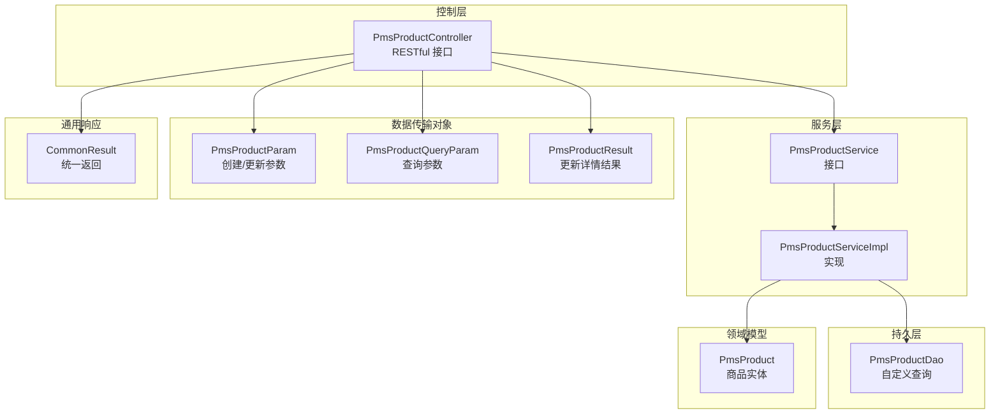
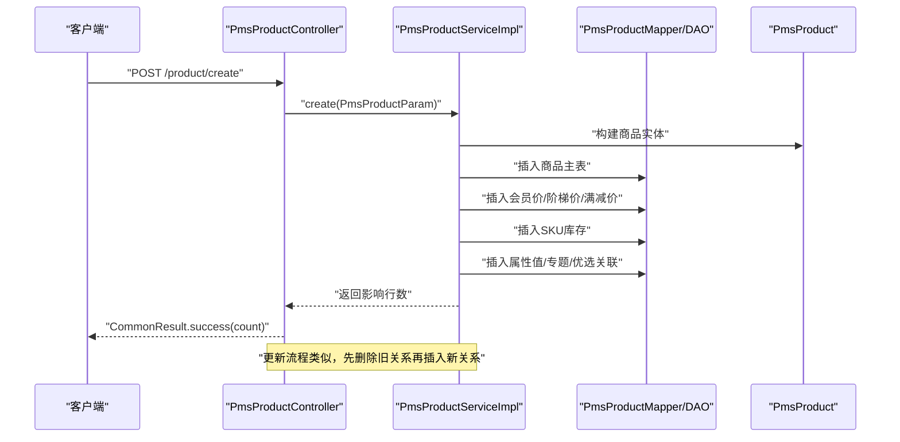
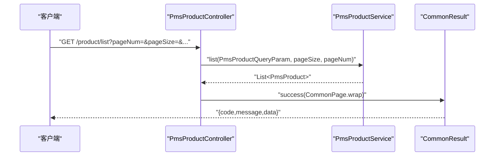
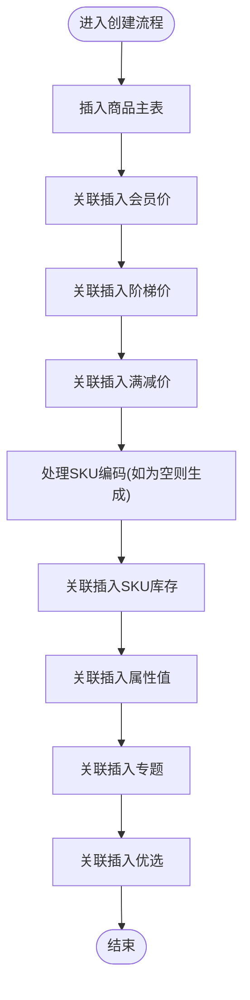
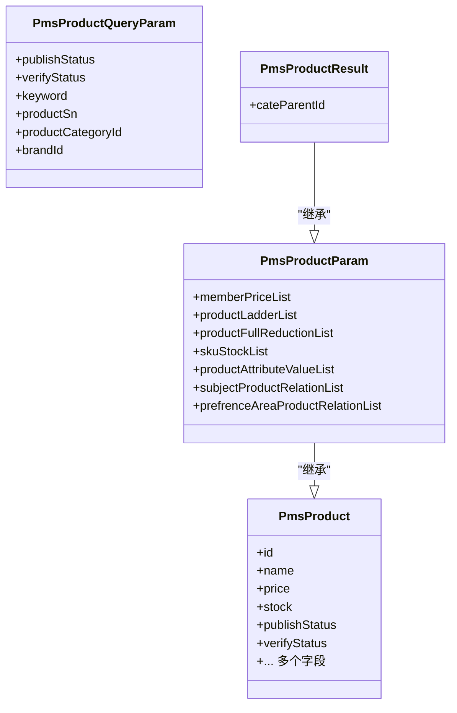
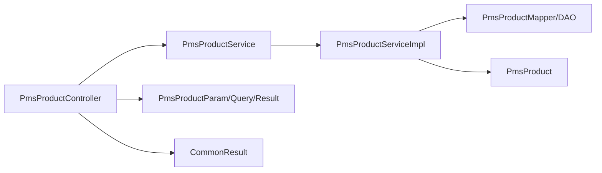

# 商品管理系统

<cite>
**本文引用的文件**
- [PmsProductController.java](file://mall-admin/src/main/java/com/macro/mall/controller/PmsProductController.java)
- [PmsProductService.java](file://mall-admin/src/main/java/com/macro/mall/service/PmsProductService.java)
- [PmsProductServiceImpl.java](file://mall-admin/src/main/java/com/macro/mall/service/impl/PmsProductServiceImpl.java)
- [PmsProductParam.java](file://mall-admin/src/main/java/com/macro/mall/dto/PmsProductParam.java)
- [PmsProductQueryParam.java](file://mall-admin/src/main/java/com/macro/mall/dto/PmsProductQueryParam.java)
- [PmsProductResult.java](file://mall-admin/src/main/java/com/macro/mall/dto/PmsProductResult.java)
- [PmsProductDao.java](file://mall-admin/src/main/java/com/macro/mall/dao/PmsProductDao.java)
- [PmsProduct.java](file://mall-mbg/src/main/java/com/macro/mall/model/PmsProduct.java)
- [CommonResult.java](file://mall-common/src/main/java/com/macro/mall/common/api/CommonResult.java)
</cite>

## 目录
1. [简介](#简介)
2. [项目结构](#项目结构)
3. [核心组件](#核心组件)
4. [架构总览](#架构总览)
5. [详细组件分析](#详细组件分析)
6. [依赖分析](#依赖分析)
7. [性能考虑](#性能考虑)
8. [故障排查指南](#故障排查指南)
9. [结论](#结论)
10. [附录](#附录)

## 简介
本文件面向商品管理系统的开发者与使用者，系统性梳理商品管理模块的功能与实现，重点覆盖以下方面：
- 商品CRUD操作与批量状态管理（审核、上下架、推荐、新品、删除）
- 商品服务层的业务逻辑（价格策略、库存SKU处理、规格属性维护）
- DTO数据传输对象设计（参数封装、查询条件、返回结果）
- PmsProductController控制器的RESTful接口设计与使用说明
- 商品管理API接口文档与典型使用示例

## 项目结构
商品管理相关代码主要分布在如下模块与包中：
- 控制器层：mall-admin/controller 下的 PmsProductController
- 服务层：mall-admin/service 与其实现类 PmsProductServiceImpl
- 数据传输对象：mall-admin/dto 下的 PmsProductParam、PmsProductQueryParam、PmsProductResult 等
- 持久层接口：mall-admin/dao 下的 PmsProductDao
- 领域模型：mall-mbg/model 下的 PmsProduct
- 通用响应封装：mall-common/api 下的 CommonResult

**图表来源**
- [PmsProductController.java:1-134](file://mall-admin/src/main/java/com/macro/mall/controller/PmsProductController.java#L1-L134)
- [PmsProductService.java:1-74](file://mall-admin/src/main/java/com/macro/mall/service/PmsProductService.java#L1-L74)
- [PmsProductServiceImpl.java:1-328](file://mall-admin/src/main/java/com/macro/mall/service/impl/PmsProductServiceImpl.java#L1-L328)
- [PmsProductParam.java:1-24](file://mall-admin/src/main/java/com/macro/mall/dto/PmsProductParam.java#L1-L24)
- [PmsProductQueryParam.java:1-20](file://mall-admin/src/main/java/com/macro/mall/dto/PmsProductQueryParam.java#L1-L20)
- [PmsProductResult.java:1-15](file://mall-admin/src/main/java/com/macro/mall/dto/PmsProductResult.java#L1-L15)
- [PmsProductDao.java:1-17](file://mall-admin/src/main/java/com/macro/mall/dao/PmsProductDao.java#L1-L17)
- [PmsProduct.java:1-482](file://mall-mbg/src/main/java/com/macro/mall/model/PmsProduct.java#L1-L482)
- [CommonResult.java:1-134](file://mall-common/src/main/java/com/macro/mall/common/api/CommonResult.java#L1-L134)

**章节来源**
- [PmsProductController.java:1-134](file://mall-admin/src/main/java/com/macro/mall/controller/PmsProductController.java#L1-L134)
- [PmsProductService.java:1-74](file://mall-admin/src/main/java/com/macro/mall/service/PmsProductService.java#L1-L74)
- [PmsProductServiceImpl.java:1-328](file://mall-admin/src/main/java/com/macro/mall/service/impl/PmsProductServiceImpl.java#L1-L328)
- [PmsProductParam.java:1-24](file://mall-admin/src/main/java/com/macro/mall/dto/PmsProductParam.java#L1-L24)
- [PmsProductQueryParam.java:1-20](file://mall-admin/src/main/java/com/macro/mall/dto/PmsProductQueryParam.java#L1-L20)
- [PmsProductResult.java:1-15](file://mall-admin/src/main/java/com/macro/mall/dto/PmsProductResult.java#L1-L15)
- [PmsProductDao.java:1-17](file://mall-admin/src/main/java/com/macro/mall/dao/PmsProductDao.java#L1-L17)
- [PmsProduct.java:1-482](file://mall-mbg/src/main/java/com/macro/mall/model/PmsProduct.java#L1-L482)
- [CommonResult.java:1-134](file://mall-common/src/main/java/com/macro/mall/common/api/CommonResult.java#L1-L134)

## 核心组件
- 控制器：PmsProductController 提供商品管理的RESTful接口，包括创建、更新、分页查询、简单查询以及多状态批量更新等。
- 服务接口与实现：PmsProductService 定义业务契约；PmsProductServiceImpl 实现具体逻辑，涵盖价格策略、SKU库存处理、规格属性维护、审核记录写入等。
- DTO：PmsProductParam 封装创建/更新的商品参数；PmsProductQueryParam 封装查询条件；PmsProductResult 在更新时返回带父级分类ID的结果。
- 领域模型：PmsProduct 描述商品实体字段，包含品牌、分类、价格、库存、上下架/审核状态等。
- 统一响应：CommonResult 提供统一的返回结构，便于前端与接口消费方标准化处理。

**章节来源**
- [PmsProductController.java:17-134](file://mall-admin/src/main/java/com/macro/mall/controller/PmsProductController.java#L17-L134)
- [PmsProductService.java:13-74](file://mall-admin/src/main/java/com/macro/mall/service/PmsProductService.java#L13-L74)
- [PmsProductServiceImpl.java:26-328](file://mall-admin/src/main/java/com/macro/mall/service/impl/PmsProductServiceImpl.java#L26-L328)
- [PmsProductParam.java:9-24](file://mall-admin/src/main/java/com/macro/mall/dto/PmsProductParam.java#L9-L24)
- [PmsProductQueryParam.java:6-20](file://mall-admin/src/main/java/com/macro/mall/dto/PmsProductQueryParam.java#L6-L20)
- [PmsProductResult.java:6-15](file://mall-admin/src/main/java/com/macro/mall/dto/PmsProductResult.java#L6-L15)
- [PmsProduct.java:7-482](file://mall-mbg/src/main/java/com/macro/mall/model/PmsProduct.java#L7-L482)
- [CommonResult.java:7-134](file://mall-common/src/main/java/com/macro/mall/common/api/CommonResult.java#L7-L134)

## 架构总览
商品管理采用经典的分层架构：
- 表现层：控制器接收HTTP请求，校验参数，调用服务层。
- 业务层：服务接口定义能力，实现类完成复杂业务编排（价格策略、库存SKU、属性关系等）。
- 数据访问层：MyBatis Mapper/DAO负责数据库读写；自定义DAO提供复杂查询。
- 领域模型：实体类承载商品数据结构。
- 统一响应：所有接口返回统一包装格式。

**图表来源**
- [PmsProductController.java:28-37](file://mall-admin/src/main/java/com/macro/mall/controller/PmsProductController.java#L28-L37)
- [PmsProductServiceImpl.java:69-95](file://mall-admin/src/main/java/com/macro/mall/service/impl/PmsProductServiceImpl.java#L69-L95)
- [PmsProductServiceImpl.java:120-161](file://mall-admin/src/main/java/com/macro/mall/service/impl/PmsProductServiceImpl.java#L120-L161)

**章节来源**
- [PmsProductController.java:28-37](file://mall-admin/src/main/java/com/macro/mall/controller/PmsProductController.java#L28-L37)
- [PmsProductServiceImpl.java:69-95](file://mall-admin/src/main/java/com/macro/mall/service/impl/PmsProductServiceImpl.java#L69-L95)
- [PmsProductServiceImpl.java:120-161](file://mall-admin/src/main/java/com/macro/mall/service/impl/PmsProductServiceImpl.java#L120-L161)

## 详细组件分析

### 控制器：PmsProductController
- 路径前缀：/product
- 主要接口：
  - POST /create：创建商品
  - GET /updateInfo/{id}：获取更新详情
  - POST /update/{id}：更新商品
  - GET /list：分页查询商品（支持发布/审核状态、关键词、货号、分类、品牌）
  - GET /simpleList：按关键词进行简单查询
  - POST /update/verifyStatus：批量更新审核状态
  - POST /update/publishStatus：批量更新上下架状态
  - POST /update/recommendStatus：批量更新推荐状态
  - POST /update/newStatus：批量更新新品状态
  - POST /update/deleteStatus：批量更新删除状态
- 返回统一使用 CommonResult 包装，成功返回数据，失败返回错误码与消息。

**图表来源**
- [PmsProductController.java:57-64](file://mall-admin/src/main/java/com/macro/mall/controller/PmsProductController.java#L57-L64)
- [PmsProductService.java:35-38](file://mall-admin/src/main/java/com/macro/mall/service/PmsProductService.java#L35-L38)
- [CommonResult.java:30-47](file://mall-common/src/main/java/com/macro/mall/common/api/CommonResult.java#L30-L47)

**章节来源**
- [PmsProductController.java:28-132](file://mall-admin/src/main/java/com/macro/mall/controller/PmsProductController.java#L28-L132)
- [CommonResult.java:30-79](file://mall-common/src/main/java/com/macro/mall/common/api/CommonResult.java#L30-L79)

### 服务层：PmsProductService 与 PmsProductServiceImpl
- 事务注解：创建与更新方法均声明事务传播与隔离级别，保证一致性。
- 关键能力：
  - 创建商品：插入主表，关联插入会员价、阶梯价、满减价、SKU库存、属性值、专题与优选关联。
  - 更新商品：先删除旧关系，再插入新关系；SKU库存支持新增、删除、更新三种变更。
  - 查询：分页查询支持多条件过滤；简单查询支持名称或货号模糊匹配。
  - 批量状态更新：审核、上下架、推荐、新品、删除状态均可批量更新；审核完成后写入审核记录。
- SKU编码规则：若SKU编码为空，按“日期+商品ID+序号”生成唯一编码。
- 关系表插入：通过反射统一处理“清空旧关系 -> 设置外键 -> 批量插入”的模式，提升可维护性。

**图表来源**
- [PmsProductServiceImpl.java:69-95](file://mall-admin/src/main/java/com/macro/mall/service/impl/PmsProductServiceImpl.java#L69-L95)
- [PmsProductServiceImpl.java:97-113](file://mall-admin/src/main/java/com/macro/mall/service/impl/PmsProductServiceImpl.java#L97-L113)

**章节来源**
- [PmsProductService.java:17-73](file://mall-admin/src/main/java/com/macro/mall/service/PmsProductService.java#L17-L73)
- [PmsProductServiceImpl.java:69-325](file://mall-admin/src/main/java/com/macro/mall/service/impl/PmsProductServiceImpl.java#L69-L325)

### DTO 设计
- PmsProductParam：继承商品实体，扩展了会员价、阶梯价、满减价、SKU库存、属性值、专题与优选关联列表，用于创建/更新时的参数封装。
- PmsProductQueryParam：封装分页查询条件，包括发布/审核状态、关键词、货号、分类ID、品牌ID。
- PmsProductResult：在获取更新详情时返回，扩展了分类父ID字段，便于前端联动选择。

**图表来源**
- [PmsProduct.java:7-92](file://mall-mbg/src/main/java/com/macro/mall/model/PmsProduct.java#L7-L92)
- [PmsProductParam.java:15-23](file://mall-admin/src/main/java/com/macro/mall/dto/PmsProductParam.java#L15-L23)
- [PmsProductQueryParam.java:12-19](file://mall-admin/src/main/java/com/macro/mall/dto/PmsProductQueryParam.java#L12-L19)
- [PmsProductResult.java:10-14](file://mall-admin/src/main/java/com/macro/mall/dto/PmsProductResult.java#L10-L14)

**章节来源**
- [PmsProductParam.java:9-24](file://mall-admin/src/main/java/com/macro/mall/dto/PmsProductParam.java#L9-L24)
- [PmsProductQueryParam.java:6-20](file://mall-admin/src/main/java/com/macro/mall/dto/PmsProductQueryParam.java#L6-L20)
- [PmsProductResult.java:6-15](file://mall-admin/src/main/java/com/macro/mall/dto/PmsProductResult.java#L6-L15)
- [PmsProduct.java:7-482](file://mall-mbg/src/main/java/com/macro/mall/model/PmsProduct.java#L7-L482)

### 数据模型：PmsProduct
- 字段覆盖品牌、分类、价格、库存、上下架/审核/推荐/新品状态、描述、详情等。
- 支持促销相关字段（原价、促销价、促销时间、促销类型等），便于后续价格策略扩展。

**章节来源**
- [PmsProduct.java:7-482](file://mall-mbg/src/main/java/com/macro/mall/model/PmsProduct.java#L7-L482)

### 统一响应：CommonResult
- 提供 success/failure/validateFailed/unauthorized/forbidden 等静态方法，统一返回结构，便于前后端约定。

**章节来源**
- [CommonResult.java:7-134](file://mall-common/src/main/java/com/macro/mall/common/api/CommonResult.java#L7-L134)

## 依赖分析
- 控制器依赖服务接口，服务实现依赖多个DAO与Mapper，DAO与Mapper依赖MyBatis与数据库。
- DTO与实体模型之间存在继承/组合关系，确保参数与返回结构清晰。
- 服务层通过统一的“relateAndInsertList”方法抽象关系表插入逻辑，降低重复与耦合。

**图表来源**
- [PmsProductController.java:25-26](file://mall-admin/src/main/java/com/macro/mall/controller/PmsProductController.java#L25-L26)
- [PmsProductService.java:17-38](file://mall-admin/src/main/java/com/macro/mall/service/PmsProductService.java#L17-L38)
- [PmsProductServiceImpl.java:34-66](file://mall-admin/src/main/java/com/macro/mall/service/impl/PmsProductServiceImpl.java#L34-L66)
- [PmsProductParam.java:15-23](file://mall-admin/src/main/java/com/macro/mall/dto/PmsProductParam.java#L15-L23)
- [CommonResult.java:35-79](file://mall-common/src/main/java/com/macro/mall/common/api/CommonResult.java#L35-L79)

**章节来源**
- [PmsProductController.java:25-26](file://mall-admin/src/main/java/com/macro/mall/controller/PmsProductController.java#L25-L26)
- [PmsProductService.java:17-38](file://mall-admin/src/main/java/com/macro/mall/service/PmsProductService.java#L17-L38)
- [PmsProductServiceImpl.java:34-66](file://mall-admin/src/main/java/com/macro/mall/service/impl/PmsProductServiceImpl.java#L34-L66)
- [PmsProductParam.java:15-23](file://mall-admin/src/main/java/com/macro/mall/dto/PmsProductParam.java#L15-L23)
- [CommonResult.java:35-79](file://mall-common/src/main/java/com/macro/mall/common/api/CommonResult.java#L35-L79)

## 性能考虑
- 分页查询：服务层使用分页助手进行分页，建议在高频查询场景下配合数据库索引优化（如品牌ID、分类ID、状态、关键词等）。
- 批量更新：批量更新状态时使用示例条件与选择性更新，减少不必要的全表扫描。
- SKU处理：SKU编码生成与更新时避免重复计算，必要时可引入缓存或序列化机制。
- 关系表插入：统一反射插入策略可简化代码，但需注意反射开销；在高并发场景可评估批量插入性能与事务粒度。

## 故障排查指南
- 创建/更新失败：检查 DTO 参数是否完整，特别是 SKU 列表、价格策略列表、属性值列表是否按要求传入；查看服务层日志输出。
- 审核状态更新后缺少审核记录：确认审核记录DAO是否正确执行；检查服务层审核记录构造逻辑。
- SKU库存异常：核对 SKU 编码生成规则与更新逻辑，确保新增/删除/更新分支均被正确触发。
- 查询无结果：确认查询条件与数据库索引配置；对于关键词查询，确认模糊匹配策略与 OR 条件使用。

**章节来源**
- [PmsProductServiceImpl.java:310-325](file://mall-admin/src/main/java/com/macro/mall/service/impl/PmsProductServiceImpl.java#L310-L325)
- [PmsProductServiceImpl.java:234-252](file://mall-admin/src/main/java/com/macro/mall/service/impl/PmsProductServiceImpl.java#L234-L252)
- [PmsProductServiceImpl.java:163-203](file://mall-admin/src/main/java/com/macro/mall/service/impl/PmsProductServiceImpl.java#L163-L203)
- [PmsProductServiceImpl.java:206-231](file://mall-admin/src/main/java/com/macro/mall/service/impl/PmsProductServiceImpl.java#L206-L231)

## 结论
商品管理模块通过清晰的分层设计与统一的DTO/响应封装，实现了商品CRUD、批量状态管理、价格策略与SKU库存处理等核心能力。服务层以事务与关系表抽象为核心，兼顾可维护性与扩展性。建议在生产环境中进一步完善索引、批量插入与日志监控，以提升查询与写入性能。

## 附录

### API 接口文档与使用示例

- 创建商品
  - 方法：POST
  - 路径：/product/create
  - 请求体：PmsProductParam
  - 返回：CommonResult<Integer>（返回影响行数）

- 获取更新详情
  - 方法：GET
  - 路径：/product/updateInfo/{id}
  - 路径参数：id
  - 返回：CommonResult<PmsProductResult>

- 更新商品
  - 方法：POST
  - 路径：/product/update/{id}
  - 路径参数：id
  - 请求体：PmsProductParam
  - 返回：CommonResult<Integer>

- 分页查询商品
  - 方法：GET
  - 路径：/product/list
  - 查询参数：
    - publishStatus（可选）
    - verifyStatus（可选）
    - keyword（可选）
    - productSn（可选）
    - productCategoryId（可选）
    - brandId（可选）
    - pageSize（默认5）
    - pageNum（默认1）
  - 返回：CommonResult<CommonPage<PmsProduct>>

- 简单查询（名称/货号模糊）
  - 方法：GET
  - 路径：/product/simpleList
  - 查询参数：keyword
  - 返回：CommonResult<List<PmsProduct>>

- 批量更新审核状态
  - 方法：POST
  - 路径：/product/update/verifyStatus
  - 查询参数：
    - ids（列表）
    - verifyStatus（状态）
    - detail（审核意见）
  - 返回：CommonResult<Integer>

- 批量更新上下架状态
  - 方法：POST
  - 路径：/product/update/publishStatus
  - 查询参数：
    - ids（列表）
    - publishStatus（状态）
  - 返回：CommonResult<Integer>

- 批量更新推荐状态
  - 方法：POST
  - 路径：/product/update/recommendStatus
  - 查询参数：
    - ids（列表）
    - recommendStatus（状态）
  - 返回：CommonResult<Integer>

- 批量更新新品状态
  - 方法：POST
  - 路径：/product/update/newStatus
  - 查询参数：
    - ids（列表）
    - newStatus（状态）
  - 返回：CommonResult<Integer>

- 批量更新删除状态
  - 方法：POST
  - 路径：/product/update/deleteStatus
  - 查询参数：
    - ids（列表）
    - deleteStatus（状态）
  - 返回：CommonResult<Integer>

- 使用示例（描述性说明）
  - 创建商品：构造 PmsProductParam，填充基本信息与价格/库存/属性等扩展列表，调用 /product/create。
  - 批量上下架：准备商品ID列表与目标状态，调用 /product/update/publishStatus。
  - 分页查询：设置分页参数与筛选条件，调用 /product/list 获取分页结果。

**章节来源**
- [PmsProductController.java:28-132](file://mall-admin/src/main/java/com/macro/mall/controller/PmsProductController.java#L28-L132)
- [PmsProductParam.java:9-24](file://mall-admin/src/main/java/com/macro/mall/dto/PmsProductParam.java#L9-L24)
- [PmsProductQueryParam.java:6-20](file://mall-admin/src/main/java/com/macro/mall/dto/PmsProductQueryParam.java#L6-L20)
- [PmsProductResult.java:6-15](file://mall-admin/src/main/java/com/macro/mall/dto/PmsProductResult.java#L6-L15)
- [CommonResult.java:30-79](file://mall-common/src/main/java/com/macro/mall/common/api/CommonResult.java#L30-L79)