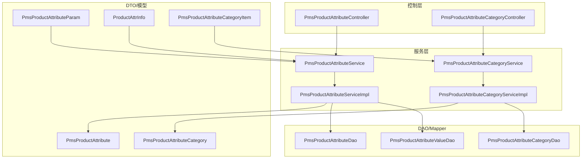
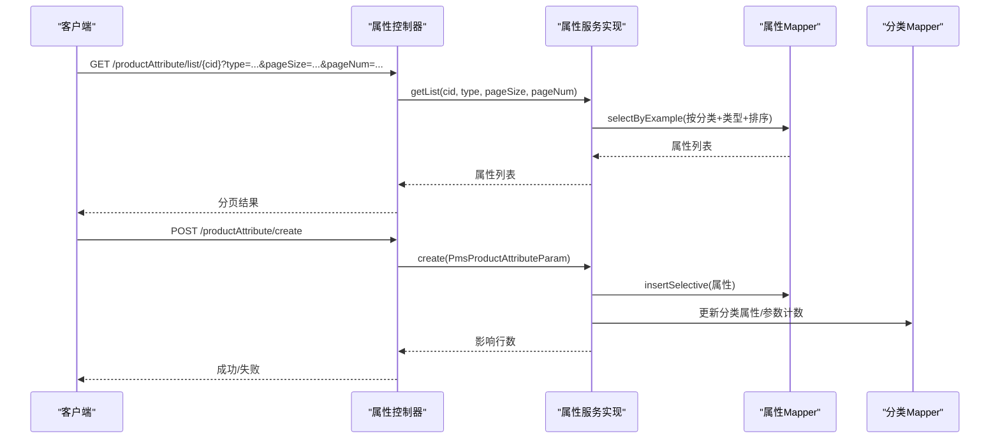
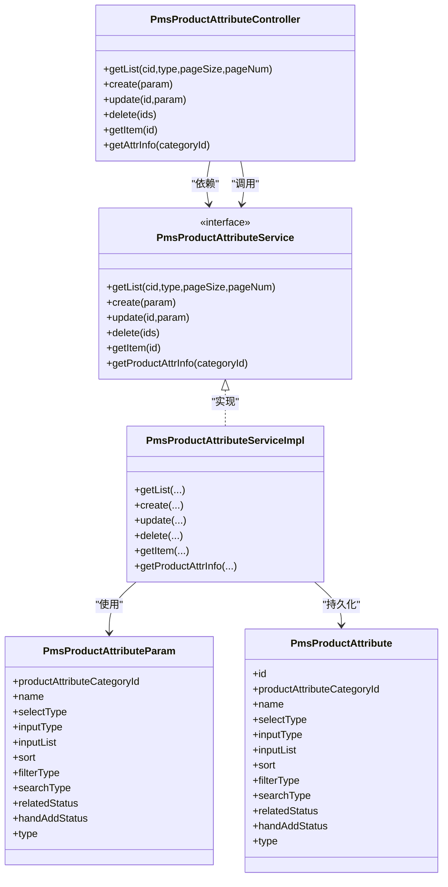
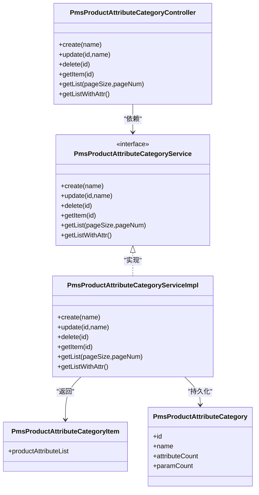
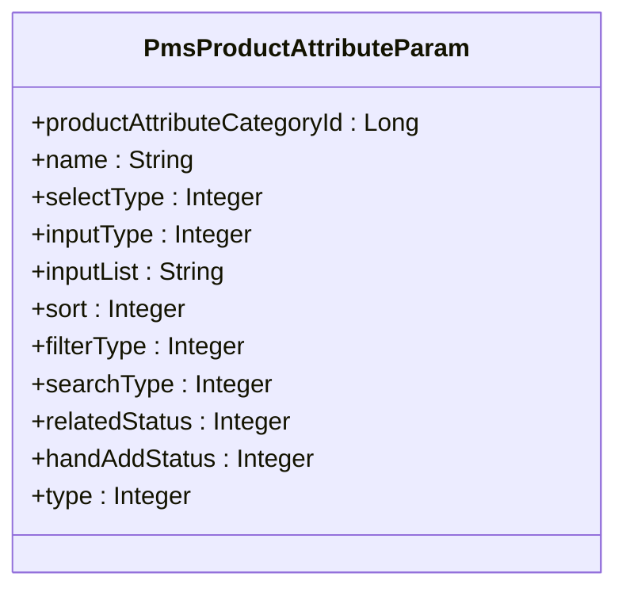
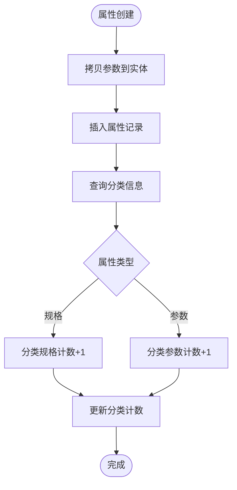
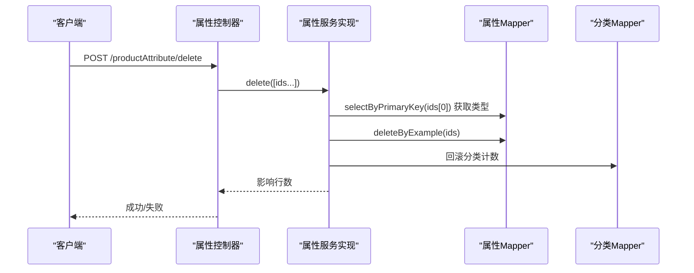
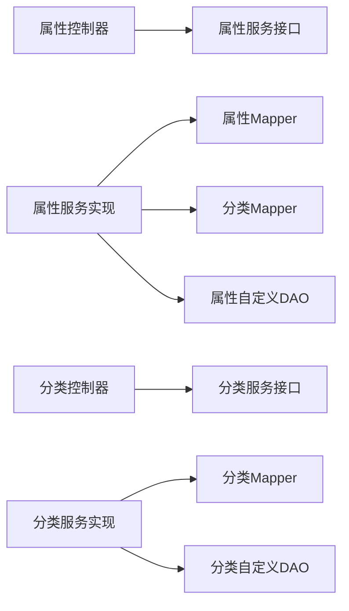

# 属性管理

<cite>
**本文引用的文件**
- [PmsProductAttributeController.java](file://mall-admin/src/main/java/com/macro/mall/controller/PmsProductAttributeController.java)
- [PmsProductAttributeCategoryController.java](file://mall-admin/src/main/java/com/macro/mall/controller/PmsProductAttributeCategoryController.java)
- [PmsProductAttributeService.java](file://mall-admin/src/main/java/com/macro/mall/service/PmsProductAttributeService.java)
- [PmsProductAttributeCategoryService.java](file://mall-admin/src/main/java/com/macro/mall/service/PmsProductAttributeCategoryService.java)
- [PmsProductAttributeServiceImpl.java](file://mall-admin/src/main/java/com/macro/mall/service/impl/PmsProductAttributeServiceImpl.java)
- [PmsProductAttributeCategoryServiceImpl.java](file://mall-admin/src/main/java/com/macro/mall/service/impl/PmsProductAttributeCategoryServiceImpl.java)
- [PmsProductAttributeParam.java](file://mall-admin/src/main/java/com/macro/mall/dto/PmsProductAttributeParam.java)
- [ProductAttrInfo.java](file://mall-admin/src/main/java/com/macro/mall/dto/ProductAttrInfo.java)
- [PmsProductAttributeCategoryItem.java](file://mall-admin/src/main/java/com/macro/mall/dto/PmsProductAttributeCategoryItem.java)
- [PmsProductAttribute.java](file://mall-mbg/src/main/java/com/macro/mall/model/PmsProductAttribute.java)
- [PmsProductAttributeCategory.java](file://mall-mbg/src/main/java/com/macro/mall/model/PmsProductAttributeCategory.java)
- [PmsProductAttributeDao.java](file://mall-admin/src/main/java/com/macro/mall/dao/PmsProductAttributeDao.java)
- [PmsProductAttributeCategoryDao.java](file://mall-admin/src/main/java/com/macro/mall/dao/PmsProductAttributeCategoryDao.java)
- [PmsProductAttributeValueDao.java](file://mall-admin/src/main/java/com/macro/mall/dao/PmsProductAttributeValueDao.java)
</cite>

## 目录
1. [简介](#简介)
2. [项目结构](#项目结构)
3. [核心组件](#核心组件)
4. [架构总览](#架构总览)
5. [详细组件分析](#详细组件分析)
6. [依赖分析](#依赖分析)
7. [性能考虑](#性能考虑)
8. [故障排查指南](#故障排查指南)
9. [结论](#结论)
10. [附录：API 接口文档](#附录api-接口文档)

## 简介
本文件系统性梳理“属性管理”能力，覆盖商品属性与属性分类的全生命周期管理，包括：
- 属性列表查询（按分类与类型分页）
- 属性创建、更新、删除
- 属性分类的创建、更新、删除、分页查询、带属性查询
- 属性与分类的关联关系、输入类型与可选项管理
- 属性分类层级化与分类属性继承机制
- 高级功能：属性搜索、批量操作、属性值绑定

同时，对 PmsProductAttributeParam 参数对象进行设计解析，并给出完整的 API 文档。

## 项目结构
属性管理相关代码主要分布在以下模块：
- 控制器层：属性与属性分类的 HTTP 入口
- 服务接口与实现：业务逻辑编排与事务控制
- DTO：参数与结果封装
- 模型与 DAO/Mapper：数据模型与自定义查询接口
- MBG 模型：数据库实体映射

图表来源
- [PmsProductAttributeController.java:1-84](file://mall-admin/src/main/java/com/macro/mall/controller/PmsProductAttributeController.java#L1-L84)
- [PmsProductAttributeCategoryController.java:1-80](file://mall-admin/src/main/java/com/macro/mall/controller/PmsProductAttributeCategoryController.java#L1-L80)
- [PmsProductAttributeService.java:1-49](file://mall-admin/src/main/java/com/macro/mall/service/PmsProductAttributeService.java#L1-L49)
- [PmsProductAttributeCategoryService.java:1-43](file://mall-admin/src/main/java/com/macro/mall/service/PmsProductAttributeCategoryService.java#L1-L43)
- [PmsProductAttributeServiceImpl.java:1-102](file://mall-admin/src/main/java/com/macro/mall/service/impl/PmsProductAttributeServiceImpl.java#L1-L102)
- [PmsProductAttributeCategoryServiceImpl.java:1-62](file://mall-admin/src/main/java/com/macro/mall/service/impl/PmsProductAttributeCategoryServiceImpl.java#L1-L62)
- [PmsProductAttributeParam.java:1-37](file://mall-admin/src/main/java/com/macro/mall/dto/PmsProductAttributeParam.java#L1-L37)
- [ProductAttrInfo.java:1-17](file://mall-admin/src/main/java/com/macro/mall/dto/ProductAttrInfo.java#L1-L17)
- [PmsProductAttributeCategoryItem.java:1-19](file://mall-admin/src/main/java/com/macro/mall/dto/PmsProductAttributeCategoryItem.java#L1-L19)
- [PmsProductAttributeDao.java:1-18](file://mall-admin/src/main/java/com/macro/mall/dao/PmsProductAttributeDao.java#L1-L18)
- [PmsProductAttributeCategoryDao.java:1-17](file://mall-admin/src/main/java/com/macro/mall/dao/PmsProductAttributeCategoryDao.java#L1-L17)
- [PmsProductAttributeValueDao.java:1-18](file://mall-admin/src/main/java/com/macro/mall/dao/PmsProductAttributeValueDao.java#L1-L18)

章节来源
- [PmsProductAttributeController.java:1-84](file://mall-admin/src/main/java/com/macro/mall/controller/PmsProductAttributeController.java#L1-L84)
- [PmsProductAttributeCategoryController.java:1-80](file://mall-admin/src/main/java/com/macro/mall/controller/PmsProductAttributeCategoryController.java#L1-L80)

## 核心组件
- 控制器
  - 属性控制器：提供属性列表、创建、更新、删除、详情、属性分类绑定信息等接口
  - 属性分类控制器：提供分类创建、更新、删除、详情、分页、带属性列表等接口
- 服务接口与实现
  - 属性服务：分页查询、创建/更新/删除、属性分类计数联动、属性与分类绑定信息
  - 分类服务：创建/更新/删除、分页查询、带属性查询
- DTO 与模型
  - PmsProductAttributeParam：属性创建/更新参数对象
  - ProductAttrInfo：属性分类绑定信息
  - PmsProductAttributeCategoryItem：带属性的分类项
  - PmsProductAttribute、PmsProductAttributeCategory：数据库实体
- DAO
  - 自定义 DAO 提供属性分类绑定信息查询、批量属性值插入等扩展能力

章节来源
- [PmsProductAttributeService.java:1-49](file://mall-admin/src/main/java/com/macro/mall/service/PmsProductAttributeService.java#L1-L49)
- [PmsProductAttributeCategoryService.java:1-43](file://mall-admin/src/main/java/com/macro/mall/service/PmsProductAttributeCategoryService.java#L1-L43)
- [PmsProductAttributeParam.java:1-37](file://mall-admin/src/main/java/com/macro/mall/dto/PmsProductAttributeParam.java#L1-L37)
- [ProductAttrInfo.java:1-17](file://mall-admin/src/main/java/com/macro/mall/dto/ProductAttrInfo.java#L1-L17)
- [PmsProductAttributeCategoryItem.java:1-19](file://mall-admin/src/main/java/com/macro/mall/dto/PmsProductAttributeCategoryItem.java#L1-L19)
- [PmsProductAttribute.java:1-150](file://mall-mbg/src/main/java/com/macro/mall/model/PmsProductAttribute.java#L1-L150)
- [PmsProductAttributeCategory.java:1-62](file://mall-mbg/src/main/java/com/macro/mall/model/PmsProductAttributeCategory.java#L1-L62)
- [PmsProductAttributeDao.java:1-18](file://mall-admin/src/main/java/com/macro/mall/dao/PmsProductAttributeDao.java#L1-L18)
- [PmsProductAttributeCategoryDao.java:1-17](file://mall-admin/src/main/java/com/macro/mall/dao/PmsProductAttributeCategoryDao.java#L1-L17)
- [PmsProductAttributeValueDao.java:1-18](file://mall-admin/src/main/java/com/macro/mall/dao/PmsProductAttributeValueDao.java#L1-L18)

## 架构总览
属性管理采用经典的分层架构：
- 控制器负责请求接入与响应包装
- 服务层编排业务流程，处理事务与校验
- DAO/MBG 负责数据持久化
- DTO 封装参数与返回值，避免直接暴露模型

图表来源
- [PmsProductAttributeController.java:27-35](file://mall-admin/src/main/java/com/macro/mall/controller/PmsProductAttributeController.java#L27-L35)
- [PmsProductAttributeServiceImpl.java:32-55](file://mall-admin/src/main/java/com/macro/mall/service/impl/PmsProductAttributeServiceImpl.java#L32-L55)
- [PmsProductAttribute.java:1-150](file://mall-mbg/src/main/java/com/macro/mall/model/PmsProductAttribute.java#L1-L150)
- [PmsProductAttributeCategory.java:1-62](file://mall-mbg/src/main/java/com/macro/mall/model/PmsProductAttributeCategory.java#L1-L62)

## 详细组件分析

### 组件一：属性控制器与服务
- 控制器方法
  - 列表查询：按分类与类型分页获取属性
  - 创建：接收属性参数并调用服务创建
  - 更新：按 ID 更新属性
  - 删除：批量删除属性
  - 详情：按 ID 查询属性
  - 属性分类绑定信息：按商品分类查询属性绑定信息
- 服务实现要点
  - 分页使用分页插件，按 sort 字段降序
  - 创建后根据属性类型更新分类的属性/参数计数
  - 删除后根据属性类型回滚分类计数
  - 属性与分类绑定信息通过自定义 DAO 查询

图表来源
- [PmsProductAttributeController.java:1-84](file://mall-admin/src/main/java/com/macro/mall/controller/PmsProductAttributeController.java#L1-L84)
- [PmsProductAttributeService.java:1-49](file://mall-admin/src/main/java/com/macro/mall/service/PmsProductAttributeService.java#L1-L49)
- [PmsProductAttributeServiceImpl.java:1-102](file://mall-admin/src/main/java/com/macro/mall/service/impl/PmsProductAttributeServiceImpl.java#L1-L102)
- [PmsProductAttributeParam.java:1-37](file://mall-admin/src/main/java/com/macro/mall/dto/PmsProductAttributeParam.java#L1-L37)
- [PmsProductAttribute.java:1-150](file://mall-mbg/src/main/java/com/macro/mall/model/PmsProductAttribute.java#L1-L150)

章节来源
- [PmsProductAttributeController.java:27-82](file://mall-admin/src/main/java/com/macro/mall/controller/PmsProductAttributeController.java#L27-L82)
- [PmsProductAttributeService.java:14-47](file://mall-admin/src/main/java/com/macro/mall/service/PmsProductAttributeService.java#L14-L47)
- [PmsProductAttributeServiceImpl.java:32-100](file://mall-admin/src/main/java/com/macro/mall/service/impl/PmsProductAttributeServiceImpl.java#L32-L100)

### 组件二：属性分类控制器与服务
- 控制器方法
  - 创建、更新、删除、详情、分页查询
  - 带属性的分类列表：返回每个分类及其关联的属性集合
- 服务实现要点
  - 分页查询使用分页插件
  - 带属性查询通过自定义 DAO 实现

图表来源
- [PmsProductAttributeCategoryController.java:1-80](file://mall-admin/src/main/java/com/macro/mall/controller/PmsProductAttributeCategoryController.java#L1-L80)
- [PmsProductAttributeCategoryService.java:1-43](file://mall-admin/src/main/java/com/macro/mall/service/PmsProductAttributeCategoryService.java#L1-L43)
- [PmsProductAttributeCategoryServiceImpl.java:1-62](file://mall-admin/src/main/java/com/macro/mall/service/impl/PmsProductAttributeCategoryServiceImpl.java#L1-L62)
- [PmsProductAttributeCategoryItem.java:1-19](file://mall-admin/src/main/java/com/macro/mall/dto/PmsProductAttributeCategoryItem.java#L1-L19)
- [PmsProductAttributeCategory.java:1-62](file://mall-mbg/src/main/java/com/macro/mall/model/PmsProductAttributeCategory.java#L1-L62)

章节来源
- [PmsProductAttributeCategoryController.java:26-78](file://mall-admin/src/main/java/com/macro/mall/controller/PmsProductAttributeCategoryController.java#L26-L78)
- [PmsProductAttributeCategoryService.java:12-41](file://mall-admin/src/main/java/com/macro/mall/service/PmsProductAttributeCategoryService.java#L12-L41)
- [PmsProductAttributeCategoryServiceImpl.java:26-60](file://mall-admin/src/main/java/com/macro/mall/service/impl/PmsProductAttributeCategoryServiceImpl.java#L26-L60)

### 组件三：参数对象 PmsProductAttributeParam 设计解析
- 关键字段说明
  - 分类标识：用于建立属性与属性分类的关联
  - 名称：属性显示名
  - 选择类型：枚举值限定，用于区分属性的选择策略
  - 输入类型：枚举值限定，区分手动录入或从可选项中选择
  - 可选项列表：以特定格式存储的可选值集合
  - 排序：影响展示顺序
  - 过滤类型、搜索类型：控制属性在筛选与搜索中的行为
  - 相关状态、手工添加状态、类型：区分规格/参数等业务维度
- 校验规则
  - 使用注解对多个枚举字段进行取值范围校验

图表来源
- [PmsProductAttributeParam.java:1-37](file://mall-admin/src/main/java/com/macro/mall/dto/PmsProductAttributeParam.java#L1-L37)

章节来源
- [PmsProductAttributeParam.java:16-35](file://mall-admin/src/main/java/com/macro/mall/dto/PmsProductAttributeParam.java#L16-L35)

### 组件四：属性与分类的关联关系与业务逻辑
- 关联关系
  - 属性通过分类标识与属性分类建立一对多关系
  - 分类维护属性计数与参数计数，用于统计与展示
- 输入类型与可选项
  - 输入类型决定用户输入方式（如手工输入或下拉选择）
  - 可选项列表用于提供候选值，便于标准化与一致性
- 分类属性继承机制
  - 当前实现未体现“子分类继承父分类属性”的逻辑，属性与分类为直接关联
  - 若需实现继承，可在查询时合并父分类属性或在创建时复制父类属性

图表来源
- [PmsProductAttributeServiceImpl.java:42-55](file://mall-admin/src/main/java/com/macro/mall/service/impl/PmsProductAttributeServiceImpl.java#L42-L55)
- [PmsProductAttributeCategory.java:10-12](file://mall-mbg/src/main/java/com/macro/mall/model/PmsProductAttributeCategory.java#L10-L12)

章节来源
- [PmsProductAttributeServiceImpl.java:42-55](file://mall-admin/src/main/java/com/macro/mall/service/impl/PmsProductAttributeServiceImpl.java#L42-L55)

### 组件五：高级功能与数据绑定
- 属性搜索
  - 列表接口支持按分类与类型过滤，结合排序字段提升检索效率
- 批量操作
  - 删除接口支持传入多个 ID，服务端按类型回滚分类计数
- 属性值绑定
  - 通过自定义 DAO 支持批量插入属性值，便于商品 SKU 层面的属性值绑定

图表来源
- [PmsProductAttributeController.java:66-75](file://mall-admin/src/main/java/com/macro/mall/controller/PmsProductAttributeController.java#L66-L75)
- [PmsProductAttributeServiceImpl.java:71-95](file://mall-admin/src/main/java/com/macro/mall/service/impl/PmsProductAttributeServiceImpl.java#L71-L95)

章节来源
- [PmsProductAttributeController.java:66-75](file://mall-admin/src/main/java/com/macro/mall/controller/PmsProductAttributeController.java#L66-L75)
- [PmsProductAttributeValueDao.java:12-16](file://mall-admin/src/main/java/com/macro/mall/dao/PmsProductAttributeValueDao.java#L12-L16)

## 依赖分析
- 控制器依赖服务接口，实现松耦合
- 服务实现依赖 Mapper 与自定义 DAO，DAO 通过 MyBatis 映射数据库
- DTO 作为参数与返回值，避免直接暴露模型细节
- 模型与数据库表一一对应，确保数据一致性

图表来源
- [PmsProductAttributeController.java:24-25](file://mall-admin/src/main/java/com/macro/mall/controller/PmsProductAttributeController.java#L24-L25)
- [PmsProductAttributeCategoryController.java:24-24](file://mall-admin/src/main/java/com/macro/mall/controller/PmsProductAttributeCategoryController.java#L24-L24)
- [PmsProductAttributeServiceImpl.java:26-30](file://mall-admin/src/main/java/com/macro/mall/service/impl/PmsProductAttributeServiceImpl.java#L26-L30)
- [PmsProductAttributeCategoryServiceImpl.java:22-24](file://mall-admin/src/main/java/com/macro/mall/service/impl/PmsProductAttributeCategoryServiceImpl.java#L22-L24)

章节来源
- [PmsProductAttributeServiceImpl.java:26-30](file://mall-admin/src/main/java/com/macro/mall/service/impl/PmsProductAttributeServiceImpl.java#L26-L30)
- [PmsProductAttributeCategoryServiceImpl.java:22-24](file://mall-admin/src/main/java/com/macro/mall/service/impl/PmsProductAttributeCategoryServiceImpl.java#L22-L24)

## 性能考虑
- 分页查询：服务层使用分页插件，建议前端合理设置页码与大小，避免超大分页
- 排序：按 sort 字段排序，建议在数据库建立索引以提升排序性能
- 批量删除：服务端一次性回滚分类计数，减少多次写操作
- 缓存：可对分类与属性的静态配置进行缓存，降低频繁查询开销

## 故障排查指南
- 参数校验失败
  - 检查枚举字段是否在允许范围内
  - 确认必填字段是否为空
- 创建/更新失败
  - 检查分类是否存在且类型匹配
  - 确认数据库约束与唯一性
- 删除异常
  - 确认传入的 ID 是否存在
  - 检查分类计数回滚逻辑是否正确执行
- 属性与分类不一致
  - 核对属性的分类标识与实际分类是否一致
  - 如需继承机制，需在查询侧补充合并逻辑

章节来源
- [PmsProductAttributeParam.java:16-35](file://mall-admin/src/main/java/com/macro/mall/dto/PmsProductAttributeParam.java#L16-L35)
- [PmsProductAttributeServiceImpl.java:42-55](file://mall-admin/src/main/java/com/macro/mall/service/impl/PmsProductAttributeServiceImpl.java#L42-L55)
- [PmsProductAttributeCategoryServiceImpl.java:27-31](file://mall-admin/src/main/java/com/macro/mall/service/impl/PmsProductAttributeCategoryServiceImpl.java#L27-L31)

## 结论
属性管理模块通过清晰的分层设计与完善的参数校验，实现了属性与分类的全生命周期管理。当前实现聚焦于直接关联关系与基础业务流程，若需引入分类层级与属性继承，可在查询与创建阶段增加相应的合并与复制逻辑，以满足更复杂的业务场景。

## 附录：API 接口文档

- 属性管理
  - 列表查询
    - 方法：GET
    - 路径：/productAttribute/list/{cid}
    - 查询参数：
      - cid：分类 ID
      - type：属性类型（0->规格；1->参数）
      - pageSize：每页条数，默认 5
      - pageNum：页码，默认 1
    - 返回：分页后的属性列表
  - 创建属性
    - 方法：POST
    - 路径：/productAttribute/create
    - 请求体：PmsProductAttributeParam
    - 返回：受影响行数
  - 更新属性
    - 方法：POST
    - 路径：/productAttribute/update/{id}
    - 路径参数：id
    - 请求体：PmsProductAttributeParam
    - 返回：受影响行数
  - 删除属性
    - 方法：POST
    - 路径：/productAttribute/delete
    - 请求体参数：ids（多个属性 ID）
    - 返回：受影响行数
  - 获取属性详情
    - 方法：GET
    - 路径：/productAttribute/{id}
    - 路径参数：id
    - 返回：单个属性详情
  - 属性分类绑定信息
    - 方法：GET
    - 路径：/productAttribute/attrInfo/{productCategoryId}
    - 路径参数：productCategoryId
    - 返回：属性与属性分类的绑定信息列表

- 属性分类管理
  - 创建分类
    - 方法：POST
    - 路径：/productAttribute/category/create
    - 表单参数：name
    - 返回：受影响行数
  - 更新分类
    - 方法：POST
    - 路径：/productAttribute/category/update/{id}
    - 路径参数：id
    - 表单参数：name
    - 返回：受影响行数
  - 删除分类
    - 方法：GET
    - 路径：/productAttribute/category/delete/{id}
    - 路径参数：id
    - 返回：受影响行数
  - 获取分类详情
    - 方法：GET
    - 路径：/productAttribute/category/{id}
    - 路径参数：id
    - 返回：单个分类详情
  - 分页查询分类
    - 方法：GET
    - 路径：/productAttribute/category/list
    - 查询参数：pageSize、pageNum
    - 返回：分页后的分类列表
  - 获取带属性的分类列表
    - 方法：GET
    - 路径：/productAttribute/category/list/withAttr
    - 返回：带属性的分类列表

章节来源
- [PmsProductAttributeController.java:27-82](file://mall-admin/src/main/java/com/macro/mall/controller/PmsProductAttributeController.java#L27-L82)
- [PmsProductAttributeCategoryController.java:26-78](file://mall-admin/src/main/java/com/macro/mall/controller/PmsProductAttributeCategoryController.java#L26-L78)