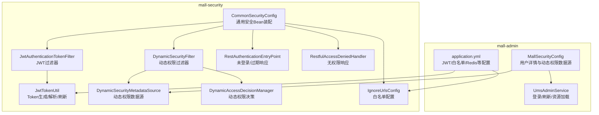
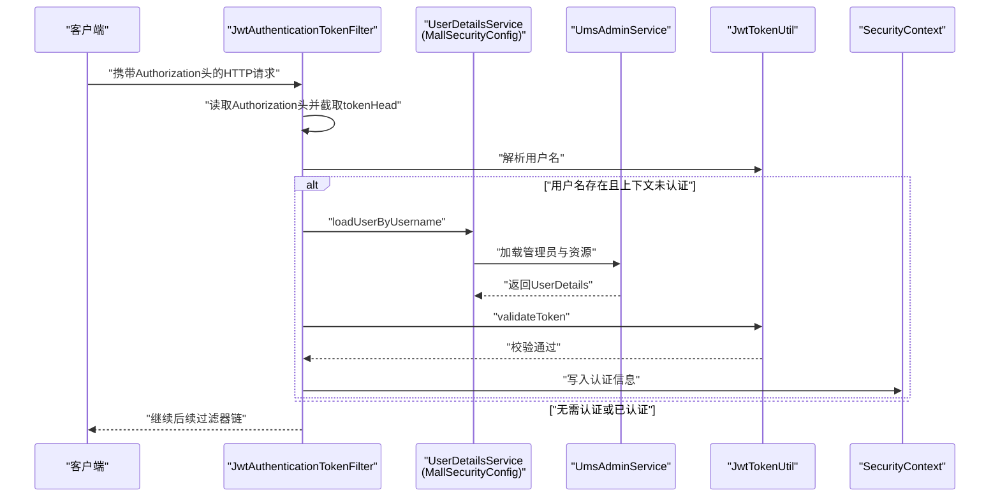
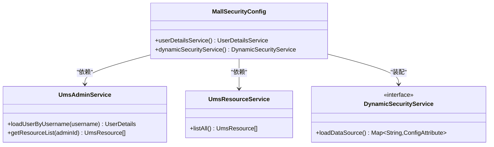
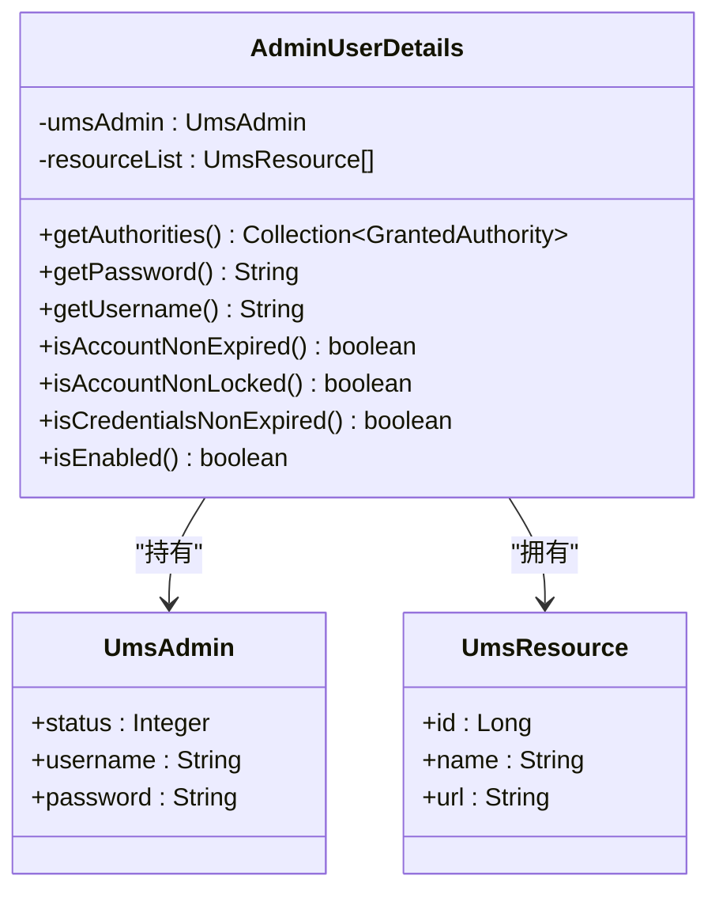
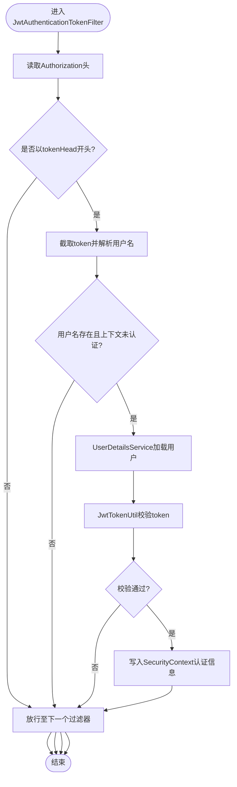
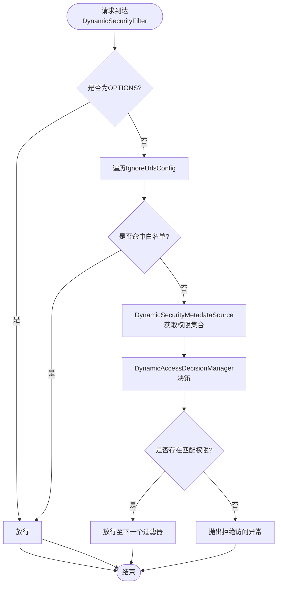
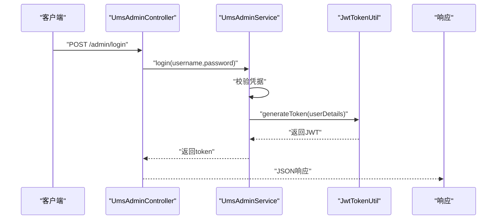
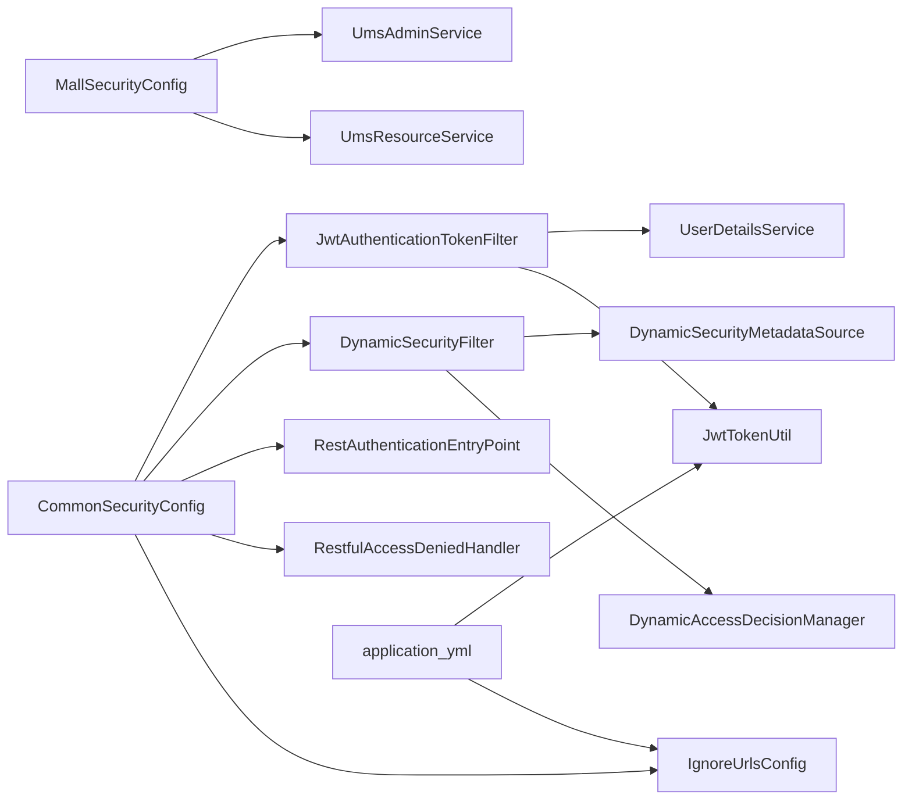

# 安全配置与认证

<cite>
**本文引用的文件**
- [MallSecurityConfig.java](file://mall-admin/src/main/java/com/macro/mall/config/MallSecurityConfig.java)
- [AdminUserDetails.java](file://mall-admin/src/main/java/com/macro/mall/bo/AdminUserDetails.java)
- [JwtAuthenticationTokenFilter.java](file://mall-security/src/main/java/com/macro/mall/security/component/JwtAuthenticationTokenFilter.java)
- [JwtTokenUtil.java](file://mall-security/src/main/java/com/macro/mall/security/util/JwtTokenUtil.java)
- [DynamicSecurityFilter.java](file://mall-security/src/main/java/com/macro/mall/security/component/DynamicSecurityFilter.java)
- [DynamicSecurityMetadataSource.java](file://mall-security/src/main/java/com/macro/mall/security/component/DynamicSecurityMetadataSource.java)
- [DynamicAccessDecisionManager.java](file://mall-security/src/main/java/com/macro/mall/security/component/DynamicAccessDecisionManager.java)
- [RestAuthenticationEntryPoint.java](file://mall-security/src/main/java/com/macro/mall/security/component/RestAuthenticationEntryPoint.java)
- [RestfulAccessDeniedHandler.java](file://mall-security/src/main/java/com/macro/mall/security/component/RestfulAccessDeniedHandler.java)
- [CommonSecurityConfig.java](file://mall-security/src/main/java/com/macro/mall/security/config/CommonSecurityConfig.java)
- [IgnoreUrlsConfig.java](file://mall-security/src/main/java/com/macro/mall/security/config/IgnoreUrlsConfig.java)
- [UmsAdminService.java](file://mall-admin/src/main/java/com/macro/mall/service/UmsAdminService.java)
- [application.yml](file://mall-admin/src/main/resources/application.yml)
</cite>

## 目录
1. [简介](#简介)
2. [项目结构](#项目结构)
3. [核心组件](#核心组件)
4. [架构总览](#架构总览)
5. [详细组件分析](#详细组件分析)
6. [依赖分析](#依赖分析)
7. [性能考虑](#性能考虑)
8. [故障排查指南](#故障排查指南)
9. [结论](#结论)
10. [附录](#附录)

## 简介
本文件面向后台管理系统“安全配置与认证”的深度解析，围绕以下目标展开：
- MallSecurityConfig 的安全配置类：Spring Security 过滤器链配置、JWT 认证机制、权限拦截规则。
- AdminUserDetails 用户详情类：用户信息加载、权限角色设置、账户状态验证。
- 登录认证流程、Token 生成与验证机制、权限控制策略。
- 安全配置最佳实践与常见安全问题的解决方案。

## 项目结构
本项目采用多模块结构，安全相关能力主要分布在 mall-security 模块，后台管理应用 mall-admin 通过配置类与服务类集成安全能力；配置参数集中在 mall-admin 的 application.yml 中。

图表来源
- [MallSecurityConfig.java:29-48](file://mall-admin/src/main/java/com/macro/mall/config/MallSecurityConfig.java#L29-L48)
- [CommonSecurityConfig.java:44-65](file://mall-security/src/main/java/com/macro/mall/security/config/CommonSecurityConfig.java#L44-L65)
- [application.yml:20-52](file://mall-admin/src/main/resources/application.yml#L20-L52)

章节来源
- [MallSecurityConfig.java:29-48](file://mall-admin/src/main/java/com/macro/mall/config/MallSecurityConfig.java#L29-L48)
- [CommonSecurityConfig.java:44-65](file://mall-security/src/main/java/com/macro/mall/security/config/CommonSecurityConfig.java#L44-L65)
- [application.yml:20-52](file://mall-admin/src/main/resources/application.yml#L20-L52)

## 核心组件
- MallSecurityConfig：注册 UserDetailsService 与动态权限数据源，将后台管理员与资源权限映射为 Spring Security 可识别的用户与权限。
- AdminUserDetails：实现 UserDetails，封装后台用户及其资源权限，并根据状态字段控制启用状态。
- JwtAuthenticationTokenFilter：从请求头读取 JWT，解析用户名，调用 UserDetailsService 加载用户并校验 Token，成功后写入 SecurityContext。
- JwtTokenUtil：负责 JWT 的生成、解析、过期判断、刷新逻辑。
- 动态权限组件：DynamicSecurityFilter、DynamicSecurityMetadataSource、DynamicAccessDecisionManager 组成动态权限拦截链。
- 异常处理：RestAuthenticationEntryPoint、RestfulAccessDeniedHandler 提供统一的未登录与无权限响应。
- 配置：CommonSecurityConfig 装配通用 Bean；IgnoreUrlsConfig 与 application.yml 提供白名单与 JWT 参数。

章节来源
- [MallSecurityConfig.java:29-48](file://mall-admin/src/main/java/com/macro/mall/config/MallSecurityConfig.java#L29-L48)
- [AdminUserDetails.java:17-65](file://mall-admin/src/main/java/com/macro/mall/bo/AdminUserDetails.java#L17-L65)
- [JwtAuthenticationTokenFilter.java:25-57](file://mall-security/src/main/java/com/macro/mall/security/component/JwtAuthenticationTokenFilter.java#L25-57)
- [JwtTokenUtil.java:31-181](file://mall-security/src/main/java/com/macro/mall/security/util/JwtTokenUtil.java#L31-181)
- [DynamicSecurityFilter.java:21-77](file://mall-security/src/main/java/com/macro/mall/security/component/DynamicSecurityFilter.java#L21-77)
- [DynamicSecurityMetadataSource.java:18-64](file://mall-security/src/main/java/com/macro/mall/security/component/DynamicSecurityMetadataSource.java#L18-64)
- [DynamicAccessDecisionManager.java:18-51](file://mall-security/src/main/java/com/macro/mall/security/component/DynamicAccessDecisionManager.java#L18-51)
- [RestAuthenticationEntryPoint.java:18-28](file://mall-security/src/main/java/com/macro/mall/security/component/RestAuthenticationEntryPoint.java#L18-28)
- [RestfulAccessDeniedHandler.java:18-30](file://mall-security/src/main/java/com/macro/mall/security/component/RestfulAccessDeniedHandler.java#L18-30)
- [CommonSecurityConfig.java:16-66](file://mall-security/src/main/java/com/macro/mall/security/config/CommonSecurityConfig.java#L16-66)
- [IgnoreUrlsConfig.java:14-21](file://mall-security/src/main/java/com/macro/mall/security/config/IgnoreUrlsConfig.java#L14-21)
- [UmsAdminService.java:17-98](file://mall-admin/src/main/java/com/macro/mall/service/UmsAdminService.java#L17-98)
- [application.yml:20-52](file://mall-admin/src/main/resources/application.yml#L20-L52)

## 架构总览
下图展示从请求进入系统到完成认证与权限决策的整体流程，以及各组件之间的交互关系。

图表来源
- [JwtAuthenticationTokenFilter.java:36-56](file://mall-security/src/main/java/com/macro/mall/security/component/JwtAuthenticationTokenFilter.java#L36-L56)
- [MallSecurityConfig.java:29-33](file://mall-admin/src/main/java/com/macro/mall/config/MallSecurityConfig.java#L29-L33)
- [UmsAdminService.java:86](file://mall-admin/src/main/java/com/macro/mall/service/UmsAdminService.java#L86)
- [JwtTokenUtil.java:87-107](file://mall-security/src/main/java/com/macro/mall/security/util/JwtTokenUtil.java#L87-107)

## 详细组件分析

### MallSecurityConfig 安全配置类
- 用户详情服务注册：通过 lambda 表达式将 UmsAdminService 的 loadUserByUsername 方法暴露为 Spring Security 的 UserDetailsService。
- 动态权限数据源：实现 DynamicSecurityService 接口，从 UmsResourceService 加载所有资源，构建“URL → 资源标识”的映射，供动态权限过滤器使用。

图表来源
- [MallSecurityConfig.java:29-48](file://mall-admin/src/main/java/com/macro/mall/config/MallSecurityConfig.java#L29-L48)
- [UmsAdminService.java:86](file://mall-admin/src/main/java/com/macro/mall/service/UmsAdminService.java#L86)

章节来源
- [MallSecurityConfig.java:29-48](file://mall-admin/src/main/java/com/macro/mall/config/MallSecurityConfig.java#L29-L48)

### AdminUserDetails 用户详情类
- 权限授予：将用户拥有的资源列表转换为“资源ID+名称”的权限字符串集合。
- 账户状态：isEnabled 返回值取决于后台用户的状态字段，仅当状态为启用时才允许登录。

图表来源
- [AdminUserDetails.java:17-65](file://mall-admin/src/main/java/com/macro/mall/bo/AdminUserDetails.java#L17-L65)

章节来源
- [AdminUserDetails.java:17-65](file://mall-admin/src/main/java/com/macro/mall/bo/AdminUserDetails.java#L17-L65)

### JWT 认证机制与过滤器链
- 请求拦截：JwtAuthenticationTokenFilter 在 doFilterInternal 中从请求头读取 Authorization，去除 tokenHead 后得到完整 token。
- 用户解析：JwtTokenUtil 从 token 中提取用户名并校验有效性。
- 用户加载：若上下文未认证且用户名有效，则通过 UserDetailsService.loadUserByUsername 加载用户详情。
- 认证写入：校验通过后构造 UsernamePasswordAuthenticationToken 并写入 SecurityContext，后续处理器可直接获取认证主体。

图表来源
- [JwtAuthenticationTokenFilter.java:36-56](file://mall-security/src/main/java/com/macro/mall/security/component/JwtAuthenticationTokenFilter.java#L36-L56)
- [JwtTokenUtil.java:87-107](file://mall-security/src/main/java/com/macro/mall/security/util/JwtTokenUtil.java#L87-107)

章节来源
- [JwtAuthenticationTokenFilter.java:25-57](file://mall-security/src/main/java/com/macro/mall/security/component/JwtAuthenticationTokenFilter.java#L25-57)
- [JwtTokenUtil.java:31-181](file://mall-security/src/main/java/com/macro/mall/security/util/JwtTokenUtil.java#L31-181)

### 权限拦截规则与动态权限
- 白名单放行：DynamicSecurityFilter 对 OPTIONS 预检请求与 IgnoreUrlsConfig 中配置的路径直接放行。
- 动态匹配：DynamicSecurityMetadataSource 使用 AntPathMatcher 将当前访问路径与资源模式进行匹配，返回所需权限集合。
- 决策逻辑：DynamicAccessDecisionManager 遍历所需权限与用户权限，若存在匹配则放行，否则抛出拒绝访问异常。

图表来源
- [DynamicSecurityFilter.java:37-61](file://mall-security/src/main/java/com/macro/mall/security/component/DynamicSecurityFilter.java#L37-61)
- [DynamicSecurityMetadataSource.java:34-51](file://mall-security/src/main/java/com/macro/mall/security/component/DynamicSecurityMetadataSource.java#L34-51)
- [DynamicAccessDecisionManager.java:20-39](file://mall-security/src/main/java/com/macro/mall/security/component/DynamicAccessDecisionManager.java#L20-39)
- [IgnoreUrlsConfig.java:14-21](file://mall-security/src/main/java/com/macro/mall/security/config/IgnoreUrlsConfig.java#L14-21)

章节来源
- [DynamicSecurityFilter.java:21-77](file://mall-security/src/main/java/com/macro/mall/security/component/DynamicSecurityFilter.java#L21-77)
- [DynamicSecurityMetadataSource.java:18-64](file://mall-security/src/main/java/com/macro/mall/security/component/DynamicSecurityMetadataSource.java#L18-64)
- [DynamicAccessDecisionManager.java:18-51](file://mall-security/src/main/java/com/macro/mall/security/component/DynamicAccessDecisionManager.java#L18-51)
- [IgnoreUrlsConfig.java:14-21](file://mall-security/src/main/java/com/macro/mall/security/config/IgnoreUrlsConfig.java#L14-21)

### 登录认证流程与 Token 策略
- 登录入口：UmsAdminService.login 接口接收用户名与密码，内部完成认证并通过 JwtTokenUtil 生成 token。
- 刷新策略：JwtTokenUtil.refreshHeadToken 支持在未过期前提下的 token 刷新，避免频繁登录。
- 白名单开放：application.yml 中的 secure.ignored.urls 明确列出无需认证的路径（如登录、注册、静态资源等）。

图表来源
- [UmsAdminService.java:34](file://mall-admin/src/main/java/com/macro/mall/service/UmsAdminService.java#L34)
- [JwtTokenUtil.java:128-133](file://mall-security/src/main/java/com/macro/mall/security/util/JwtTokenUtil.java#L128-133)
- [application.yml:34-52](file://mall-admin/src/main/resources/application.yml#L34-L52)

章节来源
- [UmsAdminService.java:17-98](file://mall-admin/src/main/java/com/macro/mall/service/UmsAdminService.java#L17-98)
- [JwtTokenUtil.java:135-164](file://mall-security/src/main/java/com/macro/mall/security/util/JwtTokenUtil.java#L135-164)
- [application.yml:34-52](file://mall-admin/src/main/resources/application.yml#L34-L52)

### 异常处理与统一响应
- 未登录/过期：RestAuthenticationEntryPoint 输出统一 JSON 响应，便于前端处理。
- 无权限：RestfulAccessDeniedHandler 输出统一 JSON 响应，包含 forbidden 状态。

章节来源
- [RestAuthenticationEntryPoint.java:18-28](file://mall-security/src/main/java/com/macro/mall/security/component/RestAuthenticationEntryPoint.java#L18-28)
- [RestfulAccessDeniedHandler.java:18-30](file://mall-security/src/main/java/com/macro/mall/security/component/RestfulAccessDeniedHandler.java#L18-30)

## 依赖分析
- 组件耦合
  - MallSecurityConfig 依赖 UmsAdminService 与 UmsResourceService，用于用户详情与动态权限数据源。
  - JwtAuthenticationTokenFilter 依赖 UserDetailsService 与 JwtTokenUtil，负责认证与令牌校验。
  - 动态权限链路由 DynamicSecurityFilter、DynamicSecurityMetadataSource、DynamicAccessDecisionManager 协作完成。
- 外部依赖
  - application.yml 提供 JWT 密钥、过期时间、token 头、白名单等关键配置。
  - CommonSecurityConfig 装配通用 Bean，确保过滤器与处理器在容器中可用。

图表来源
- [MallSecurityConfig.java:24-27](file://mall-admin/src/main/java/com/macro/mall/config/MallSecurityConfig.java#L24-L27)
- [JwtAuthenticationTokenFilter.java:27-30](file://mall-security/src/main/java/com/macro/mall/security/component/JwtAuthenticationTokenFilter.java#L27-L30)
- [DynamicSecurityFilter.java:23-31](file://mall-security/src/main/java/com/macro/mall/security/component/DynamicSecurityFilter.java#L23-L31)
- [CommonSecurityConfig.java:44-65](file://mall-security/src/main/java/com/macro/mall/security/config/CommonSecurityConfig.java#L44-L65)
- [application.yml:20-52](file://mall-admin/src/main/resources/application.yml#L20-L52)

章节来源
- [MallSecurityConfig.java:24-27](file://mall-admin/src/main/java/com/macro/mall/config/MallSecurityConfig.java#L24-L27)
- [JwtAuthenticationTokenFilter.java:27-30](file://mall-security/src/main/java/com/macro/mall/security/component/JwtAuthenticationTokenFilter.java#L27-L30)
- [DynamicSecurityFilter.java:23-31](file://mall-security/src/main/java/com/macro/mall/security/component/DynamicSecurityFilter.java#L23-L31)
- [CommonSecurityConfig.java:44-65](file://mall-security/src/main/java/com/macro/mall/security/config/CommonSecurityConfig.java#L44-L65)
- [application.yml:20-52](file://mall-admin/src/main/resources/application.yml#L20-L52)

## 性能考虑
- 动态权限缓存：DynamicSecurityMetadataSource 在首次加载后可结合缓存策略减少重复扫描与匹配开销。
- Token 过期与刷新：合理设置 expiration 与 refresh 逻辑，避免频繁刷新导致的 CPU 压力。
- 白名单优化：将高频静态资源与健康检查加入白名单，减少不必要的权限匹配。
- 用户详情缓存：UmsAdminService 可结合 Redis 缓存用户与资源列表，降低数据库压力。

## 故障排查指南
- 无法登录或频繁过期
  - 检查 application.yml 中 jwt.secret、jwt.expiration、jwt.tokenHead 是否正确。
  - 确认 JwtTokenUtil 的密钥与签名算法一致。
- 无权限访问
  - 检查动态权限数据源是否正确加载资源 URL 与权限映射。
  - 确认请求路径与资源模式是否匹配（AntPathMatcher）。
- 白名单未生效
  - 核对 secure.ignored.urls 配置项，确认路径格式与实际请求一致。
- 未登录跳转或报错
  - 检查 RestAuthenticationEntryPoint 与 RestfulAccessDeniedHandler 的响应格式是否被前端正确处理。

章节来源
- [application.yml:20-52](file://mall-admin/src/main/resources/application.yml#L20-L52)
- [DynamicSecurityMetadataSource.java:34-51](file://mall-security/src/main/java/com/macro/mall/security/component/DynamicSecurityMetadataSource.java#L34-51)
- [IgnoreUrlsConfig.java:14-21](file://mall-security/src/main/java/com/macro/mall/security/config/IgnoreUrlsConfig.java#L14-21)
- [RestAuthenticationEntryPoint.java:18-28](file://mall-security/src/main/java/com/macro/mall/security/component/RestAuthenticationEntryPoint.java#L18-28)
- [RestfulAccessDeniedHandler.java:18-30](file://mall-security/src/main/java/com/macro/mall/security/component/RestfulAccessDeniedHandler.java#L18-30)

## 结论
本系统通过 MallSecurityConfig 与 mall-security 模块的协同，实现了基于 JWT 的无状态认证与基于资源的动态权限控制。AdminUserDetails 将后台用户与其资源权限无缝对接 Spring Security；动态权限链路保证了细粒度的访问控制；统一的异常处理提升了前后端交互的一致性。建议在生产环境中结合缓存与白名单策略进一步提升性能与安全性。

## 附录
- 关键配置项
  - jwt.tokenHeader：请求头键名
  - jwt.tokenHead：token 前缀
  - jwt.secret：签名密钥
  - jwt.expiration：过期时间（秒）
  - secure.ignored.urls：白名单路径集合

章节来源
- [application.yml:20-52](file://mall-admin/src/main/resources/application.yml#L20-L52)