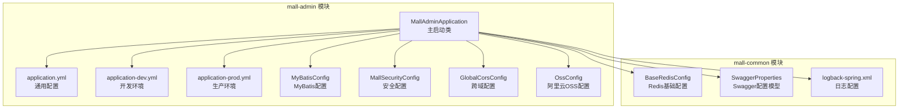
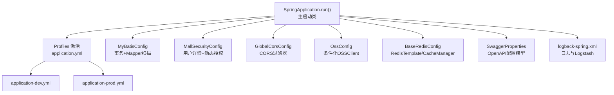
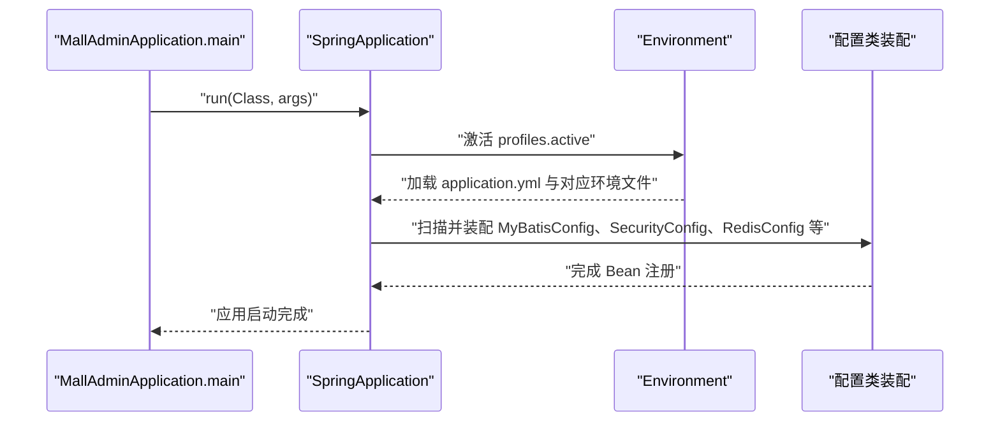
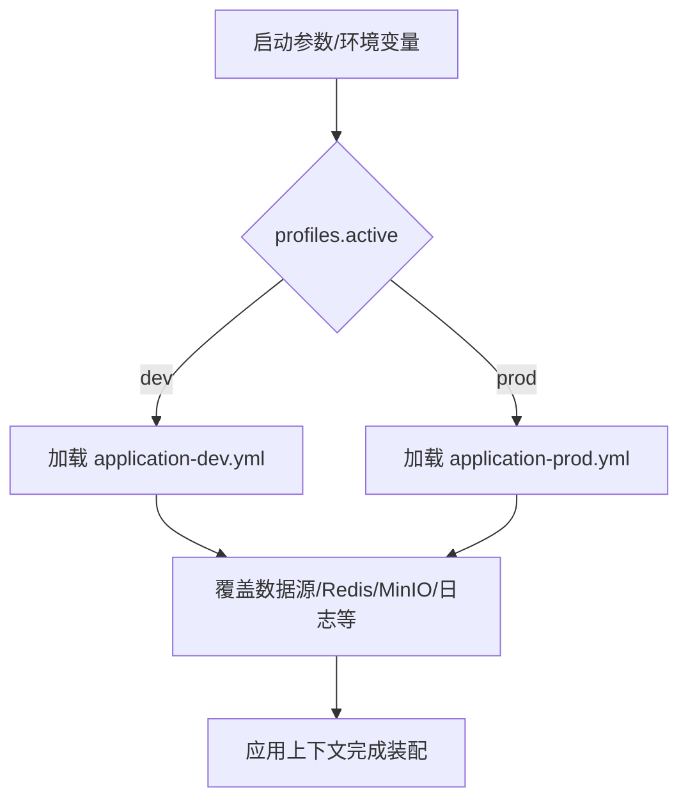
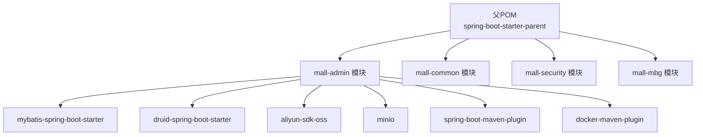

# 应用配置与启动

<cite>
**本文引用的文件**
- [MallAdminApplication.java](file://mall-admin/src/main/java/com/macro/mall/MallAdminApplication.java)
- [application.yml](file://mall-admin/src/main/resources/application.yml)
- [application-dev.yml](file://mall-admin/src/main/resources/application-dev.yml)
- [application-prod.yml](file://mall-admin/src/main/resources/application-prod.yml)
- [MyBatisConfig.java](file://mall-admin/src/main/java/com/macro/mall/config/MyBatisConfig.java)
- [MallSecurityConfig.java](file://mall-admin/src/main/java/com/macro/mall/config/MallSecurityConfig.java)
- [OssConfig.java](file://mall-admin/src/main/java/com/macro/mall/config/OssConfig.java)
- [GlobalCorsConfig.java](file://mall-admin/src/main/java/com/macro/mall/config/GlobalCorsConfig.java)
- [BaseRedisConfig.java](file://mall-common/src/main/java/com/macro/mall/common/config/BaseRedisConfig.java)
- [SwaggerProperties.java](file://mall-common/src/main/java/com/macro/mall/common/domain/SwaggerProperties.java)
- [pom.xml（父工程）](file://pom.xml)
- [pom.xml（mall-admin模块）](file://mall-admin/pom.xml)
- [admin-run.sh](file://admin-run.sh)
- [mall-admin.sh](file://document/sh/mall-admin.sh)
- [deploy-windows.md](file://document/reference/deploy-windows.md)
- [logback-spring.xml](file://mall-common/src/main/resources/logback-spring.xml)
</cite>

## 目录
1. [简介](#简介)
2. [项目结构](#项目结构)
3. [核心组件](#核心组件)
4. [架构总览](#架构总览)
5. [详细组件分析](#详细组件分析)
6. [依赖分析](#依赖分析)
7. [性能考虑](#性能考虑)
8. [故障排查指南](#故障排查指南)
9. [结论](#结论)
10. [附录](#附录)

## 简介
本文件面向后台管理应用“mall-admin”的配置与启动，系统性梳理主启动类的自动配置与组件扫描机制，详解多环境配置文件设计与切换策略，并对 application.yml 中的关键配置项（数据库连接、Redis、MyBatis、Swagger 等）进行逐项说明。同时提供完整的项目启动步骤、端口配置与常见问题排查方法，帮助开发者快速、稳定地启动与维护系统。

## 项目结构
mall-admin 作为独立 Spring Boot 子模块，通过 Maven 父工程统一版本与依赖管理。其核心启动类位于 com.macro.mall 包内，配置集中在 resources 下的 application.yml 及其多环境文件 application-dev.yml、application-prod.yml。模块还包含若干自定义配置类，覆盖 MyBatis、安全、跨域、对象存储等能力。

图表来源
- [MallAdminApplication.java:1-16](file://mall-admin/src/main/java/com/macro/mall/MallAdminApplication.java#L1-L16)
- [application.yml:1-66](file://mall-admin/src/main/resources/application.yml#L1-L66)
- [application-dev.yml:1-36](file://mall-admin/src/main/resources/application-dev.yml#L1-L36)
- [application-prod.yml:1-36](file://mall-admin/src/main/resources/application-prod.yml#L1-L36)
- [MyBatisConfig.java:1-16](file://mall-admin/src/main/java/com/macro/mall/config/MyBatisConfig.java#L1-L16)
- [MallSecurityConfig.java:1-50](file://mall-admin/src/main/java/com/macro/mall/config/MallSecurityConfig.java#L1-L50)
- [GlobalCorsConfig.java:1-35](file://mall-admin/src/main/java/com/macro/mall/config/GlobalCorsConfig.java#L1-L35)
- [OssConfig.java:1-27](file://mall-admin/src/main/java/com/macro/mall/config/OssConfig.java#L1-L27)
- [BaseRedisConfig.java:1-67](file://mall-common/src/main/java/com/macro/mall/common/config/BaseRedisConfig.java#L1-L67)
- [SwaggerProperties.java:1-48](file://mall-common/src/main/java/com/macro/mall/common/domain/SwaggerProperties.java#L1-L48)
- [logback-spring.xml:1-15](file://mall-common/src/main/resources/logback-spring.xml#L1-L15)

章节来源
- [MallAdminApplication.java:1-16](file://mall-admin/src/main/java/com/macro/mall/MallAdminApplication.java#L1-L16)
- [application.yml:1-66](file://mall-admin/src/main/resources/application.yml#L1-L66)
- [application-dev.yml:1-36](file://mall-admin/src/main/resources/application-dev.yml#L1-L36)
- [application-prod.yml:1-36](file://mall-admin/src/main/resources/application-prod.yml#L1-L36)

## 核心组件
- 主启动类与自动配置
  - 使用 @SpringBootApplication 注解，启用组件扫描与 Spring Boot 自动配置，入口方法通过 SpringApplication.run 启动应用。
- 多环境配置
  - application.yml 中通过 profiles.active 指定默认环境；开发与生产分别在 application-dev.yml 与 application-prod.yml 中覆盖数据源、Redis、MinIO、日志等配置。
- 数据库与连接池
  - 开发环境使用本地 MySQL，生产环境使用容器网络别名 db；均通过 Druid 连接池增强监控与性能。
- 缓存与序列化
  - mall-common 提供 Redis 基础配置，包含 RedisTemplate、Jackson 序列化器与 RedisCacheManager。
- ORM 与事务
  - MyBatisConfig 启用事务并扫描 Mapper/DAO 包，配合 application.yml 的 MyBatis 配置加载映射文件。
- 安全与资源授权
  - MallSecurityConfig 提供动态资源授权所需的服务与用户详情服务 Bean。
- 跨域与对象存储
  - GlobalCorsConfig 提供全局 CORS 支持；OssConfig 条件化装配 OSSClient，受 ali Yun OSS 开关控制。
- 日志与可观测性
  - logback-spring.xml 引入 Spring Boot 默认日志配置，结合 logstash.host 与开关控制日志输出与外部收集。

章节来源
- [MallAdminApplication.java:10-14](file://mall-admin/src/main/java/com/macro/mall/MallAdminApplication.java#L10-L14)
- [application.yml:1-66](file://mall-admin/src/main/resources/application.yml#L1-L66)
- [application-dev.yml:1-36](file://mall-admin/src/main/resources/application-dev.yml#L1-L36)
- [application-prod.yml:1-36](file://mall-admin/src/main/resources/application-prod.yml#L1-L36)
- [MyBatisConfig.java:11-14](file://mall-admin/src/main/java/com/macro/mall/config/MyBatisConfig.java#L11-L14)
- [MallSecurityConfig.java:22-48](file://mall-admin/src/main/java/com/macro/mall/config/MallSecurityConfig.java#L22-L48)
- [GlobalCorsConfig.java:13-34](file://mall-admin/src/main/java/com/macro/mall/config/GlobalCorsConfig.java#L13-L34)
- [OssConfig.java:13-26](file://mall-admin/src/main/java/com/macro/mall/config/OssConfig.java#L13-L26)
- [BaseRedisConfig.java:27-61](file://mall-common/src/main/java/com/macro/mall/common/config/BaseRedisConfig.java#L27-L61)
- [logback-spring.xml:1-15](file://mall-common/src/main/resources/logback-spring.xml#L1-L15)

## 架构总览
下图展示 mall-admin 启动与配置加载的关键交互：主启动类触发自动配置，随后加载 application.yml 与所选环境文件，装配 MyBatis、Redis、安全、跨域、对象存储等组件，并最终暴露接口与文档。

图表来源
- [MallAdminApplication.java:12-13](file://mall-admin/src/main/java/com/macro/mall/MallAdminApplication.java#L12-L13)
- [application.yml:4-5](file://mall-admin/src/main/resources/application.yml#L4-L5)
- [application-dev.yml:1-36](file://mall-admin/src/main/resources/application-dev.yml#L1-L36)
- [application-prod.yml:1-36](file://mall-admin/src/main/resources/application-prod.yml#L1-L36)
- [MyBatisConfig.java:11-14](file://mall-admin/src/main/java/com/macro/mall/config/MyBatisConfig.java#L11-L14)
- [MallSecurityConfig.java:22-48](file://mall-admin/src/main/java/com/macro/mall/config/MallSecurityConfig.java#L22-L48)
- [GlobalCorsConfig.java:19-33](file://mall-admin/src/main/java/com/macro/mall/config/GlobalCorsConfig.java#L19-L33)
- [OssConfig.java:21-25](file://mall-admin/src/main/java/com/macro/mall/config/OssConfig.java#L21-L25)
- [BaseRedisConfig.java:30-61](file://mall-common/src/main/java/com/macro/mall/common/config/BaseRedisConfig.java#L30-L61)
- [SwaggerProperties.java:14-47](file://mall-common/src/main/java/com/macro/mall/common/domain/SwaggerProperties.java#L14-L47)
- [logback-spring.xml:1-15](file://mall-common/src/main/resources/logback-spring.xml#L1-L15)

## 详细组件分析

### 主启动类与自动配置
- 角色与职责
  - 作为应用入口，负责触发 Spring Boot 自动配置与组件扫描。
- 关键点
  - @SpringBootApplication 启用组件扫描，默认扫描当前包及其子包。
  - 通过 application.yml 的 profiles.active 切换环境。
- 启动流程示意

图表来源
- [MallAdminApplication.java:12-13](file://mall-admin/src/main/java/com/macro/mall/MallAdminApplication.java#L12-L13)
- [application.yml:4-5](file://mall-admin/src/main/resources/application.yml#L4-L5)
- [MyBatisConfig.java:11-14](file://mall-admin/src/main/java/com/macro/mall/config/MyBatisConfig.java#L11-L14)
- [MallSecurityConfig.java:22-48](file://mall-admin/src/main/java/com/macro/mall/config/MallSecurityConfig.java#L22-L48)
- [BaseRedisConfig.java:27-61](file://mall-common/src/main/java/com/macro/mall/common/config/BaseRedisConfig.java#L27-L61)

章节来源
- [MallAdminApplication.java:10-14](file://mall-admin/src/main/java/com/macro/mall/MallAdminApplication.java#L10-L14)
- [application.yml:4-5](file://mall-admin/src/main/resources/application.yml#L4-L5)

### 多环境配置设计与切换
- 设计要点
  - application.yml 定义默认环境与通用配置；application-dev.yml 与 application-prod.yml 分别覆盖数据源、Redis、MinIO、日志等差异化配置。
  - 开发环境使用本地服务（MySQL、Redis、MinIO），生产环境通过容器网络别名或外网地址访问。
- 切换机制
  - 通过 profiles.active 指定 dev 或 prod；也可通过 JVM 参数或环境变量覆盖。
- 环境差异概览

图表来源
- [application.yml:4-5](file://mall-admin/src/main/resources/application.yml#L4-L5)
- [application-dev.yml:1-36](file://mall-admin/src/main/resources/application-dev.yml#L1-L36)
- [application-prod.yml:1-36](file://mall-admin/src/main/resources/application-prod.yml#L1-L36)

章节来源
- [application.yml:4-5](file://mall-admin/src/main/resources/application.yml#L4-L5)
- [application-dev.yml:1-36](file://mall-admin/src/main/resources/application-dev.yml#L1-L36)
- [application-prod.yml:1-36](file://mall-admin/src/main/resources/application-prod.yml#L1-L36)

### application.yml 关键配置项说明
- 应用与文件上传
  - spring.application.name：应用名称
  - spring.profiles.active：默认开发环境
  - spring.servlet.multipart：文件上传开关与大小限制
  - spring.mvc.pathmatch.matching-strategy：路径匹配策略
- MyBatis
  - mybatis.mapper-locations：映射文件位置
  - mybatis.type-aliases-package：实体别名包
- JWT
  - jwt.tokenHeader/tokenHead/secret/expitation：请求头、令牌前缀、密钥与过期时间
- Redis
  - redis.database/key/expire：数据库索引、键命名规范与通用过期时间
- 安全白名单
  - secure.ignored.urls：无需鉴权的路径集合（含 Swagger、静态资源、登录接口等）
- 阿里云 OSS
  - aliyun.oss.*：Endpoint、凭证、Bucket、签名策略、回调地址与目录前缀
- MinIO（由各环境文件覆盖）
  - minio.endpoint/bucketName/accessKey/secretKey：对象存储访问参数

章节来源
- [application.yml:1-66](file://mall-admin/src/main/resources/application.yml#L1-L66)
- [application-dev.yml:23-27](file://mall-admin/src/main/resources/application-dev.yml#L23-L27)
- [application-prod.yml:22-26](file://mall-admin/src/main/resources/application-prod.yml#L22-L26)

### MyBatis 配置
- 组件扫描与事务
  - @MapperScan 指定 Mapper 与 DAO 包扫描路径
  - @EnableTransactionManagement 启用注解式事务
- 与 application.yml 的协同
  - application.yml 的 mybatis.mapper-locations 与 type-aliases-package 与之共同决定映射文件与实体别名

章节来源
- [MyBatisConfig.java:11-14](file://mall-admin/src/main/java/com/macro/mall/config/MyBatisConfig.java#L11-L14)
- [application.yml:14-18](file://mall-admin/src/main/resources/application.yml#L14-L18)

### 安全配置与动态授权
- 用户详情服务
  - 通过 Bean 注入 UmsAdminService 实现登录用户信息加载
- 动态资源授权
  - 提供 DynamicSecurityService，从资源表加载 URL 与权限映射，供动态决策器与元数据源使用

章节来源
- [MallSecurityConfig.java:22-48](file://mall-admin/src/main/java/com/macro/mall/config/MallSecurityConfig.java#L22-L48)

### 跨域与对象存储配置
- 全局跨域
  - 配置允许任意来源、头与方法，并支持携带凭据
- 阿里云 OSS
  - 条件化装配 OSSClient，受 aliyun.oss.enable 控制，避免未启用时的 Bean 冲突

章节来源
- [GlobalCorsConfig.java:19-33](file://mall-admin/src/main/java/com/macro/mall/config/GlobalCorsConfig.java#L19-L33)
- [OssConfig.java:21-25](file://mall-admin/src/main/java/com/macro/mall/config/OssConfig.java#L21-L25)

### Redis 基础配置
- RedisTemplate
  - 键值序列化策略：StringRedisSerializer 与 Jackson2JsonRedisSerializer
- RedisCacheManager
  - 默认缓存 TTL 为 1 天，统一 JSON 序列化

章节来源
- [BaseRedisConfig.java:30-61](file://mall-common/src/main/java/com/macro/mall/common/config/BaseRedisConfig.java#L30-L61)

### Swagger 配置模型
- SwaggerProperties
  - 封装 API 基础包、是否启用安全、标题、描述、版本、联系人等信息，便于集中管理 OpenAPI 文档配置

章节来源
- [SwaggerProperties.java:14-47](file://mall-common/src/main/java/com/macro/mall/common/domain/SwaggerProperties.java#L14-L47)

## 依赖分析
- 父工程与版本管理
  - 父 POM 统一继承 spring-boot-starter-parent，集中管理 Java 版本、依赖版本与插件。
  - 依赖管理中包含 MyBatis、Druid、MySQL 驱动、JWT、OSS、MinIO、Logstash 等。
- mall-admin 模块
  - 依赖 mall-mbg、mall-security，并引入 Aliyun OSS 与 MinIO SDK。
  - 构建阶段包含 spring-boot-maven-plugin 与 docker-maven-plugin，便于打包与镜像构建。

图表来源
- [pom.xml（父工程）:22-55](file://pom.xml#L22-L55)
- [pom.xml（父工程）:93-194](file://pom.xml#L93-L194)
- [pom.xml（mall-admin模块）:19-48](file://mall-admin/pom.xml#L19-L48)

章节来源
- [pom.xml（父工程）:22-55](file://pom.xml#L22-L55)
- [pom.xml（父工程）:93-194](file://pom.xml#L93-L194)
- [pom.xml（mall-admin模块）:19-48](file://mall-admin/pom.xml#L19-L48)

## 性能考虑
- 连接池与监控
  - 使用 Druid 连接池，合理设置初始大小、最小空闲与最大活跃数，开启 Web 监控页面便于排查慢查询与连接泄漏。
- 缓存策略
  - Redis 默认缓存 TTL 为 1 天，建议根据业务热点数据调整过期策略，避免缓存雪崩与热点穿透。
- ORM 与分页
  - 结合 PageHelper Starter 与 MyBatis，确保分页查询性能与 SQL 优化。
- 日志与可观测性
  - 通过 logstash.host 与开关控制日志输出与外部收集，建议在生产环境开启并配置合适的日志级别。

[本节为通用指导，不直接分析具体文件]

## 故障排查指南
- 端口占用与启动失败
  - 确认 8080 端口未被占用；若使用 Docker 启动，检查 -p 映射与容器日志。
- 数据库连接异常
  - 检查 application-dev.yml 与 application-prod.yml 中的数据库 URL、用户名、密码与时区配置；确认 MySQL 已启动且网络可达。
- Redis 连接异常
  - 校验 Redis 地址、端口与超时配置；确认 Redis 已启动且网络连通。
- MinIO/对象存储
  - 确认 MinIO Endpoint、Bucket、AccessKey/SecretKey 正确；若使用 OSS，检查 aliyun.oss.enable 与 OSS 凭证。
- 日志与外部收集
  - 检查 logback-spring.xml 中 logstash.host 与开关；确认 Logstash 服务可用。
- Windows 环境启动
  - 参考部署文档，确保 JDK、MySQL、Redis 等服务已正确安装与启动；IDE 启动时可直接运行主类。

章节来源
- [mall-admin.sh:9-15](file://document/sh/mall-admin.sh#L9-L15)
- [application-dev.yml:2-21](file://mall-admin/src/main/resources/application-dev.yml#L2-L21)
- [application-prod.yml:1-20](file://mall-admin/src/main/resources/application-prod.yml#L1-L20)
- [logback-spring.xml:11-15](file://mall-common/src/main/resources/logback-spring.xml#L11-L15)
- [deploy-windows.md:18-28](file://document/reference/deploy-windows.md#L18-L28)

## 结论
mall-admin 的启动与配置围绕 Spring Boot 自动装配展开，通过 application.yml 与多环境文件实现灵活的环境隔离与差异化配置。MyBatis、Redis、安全、跨域与对象存储等关键组件通过自定义配置类与父工程依赖管理得以清晰组织。结合本文提供的启动步骤、端口配置与故障排查方法，可高效完成本地与生产环境的部署与运维。

[本节为总结性内容，不直接分析具体文件]

## 附录

### 项目启动步骤
- 本地 Maven 启动
  - 在根目录执行 Maven 构建与启动命令，指定主类为 MallAdminApplication。
- Docker 启动
  - 停止并移除旧容器，使用 mall-admin.sh 指定端口映射、链接 MySQL/Redis、挂载日志目录并启动容器。
- Windows 环境
  - 参考部署文档，确保 JDK、MySQL、Redis 等服务就绪，直接运行主类启动。

章节来源
- [admin-run.sh:10-25](file://admin-run.sh#L10-L25)
- [mall-admin.sh:3-15](file://document/sh/mall-admin.sh#L3-L15)
- [deploy-windows.md:90-93](file://document/reference/deploy-windows.md#L90-L93)

### 端口与文档访问
- 接口文档地址
  - 默认访问地址为 http://localhost:8080/swagger-ui.html（Windows 部署文档中给出）。
- 端口映射
  - Docker 启动时将容器 8080 端口映射至宿主机 8080；如需变更，请调整 -p 参数。

章节来源
- [deploy-windows.md:92-93](file://document/reference/deploy-windows.md#L92-L93)
- [mall-admin.sh:9-9](file://document/sh/mall-admin.sh#L9-L9)