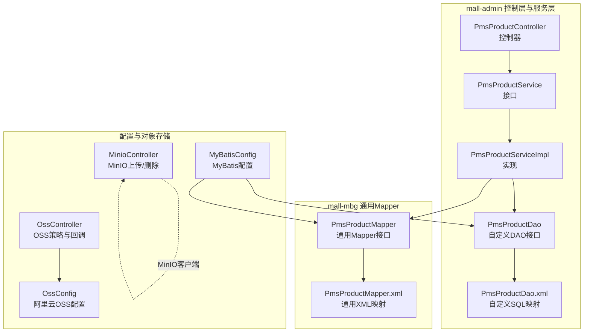
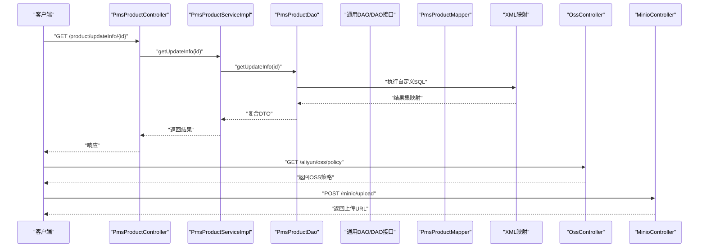
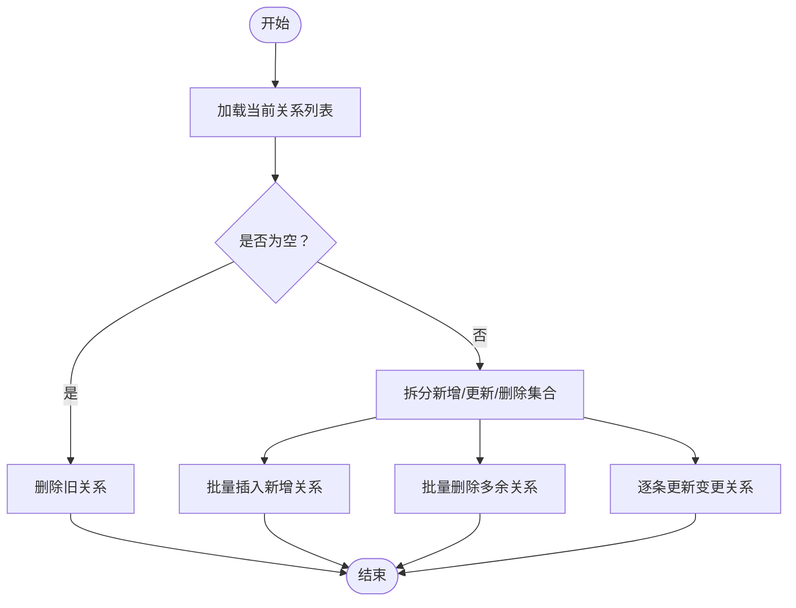
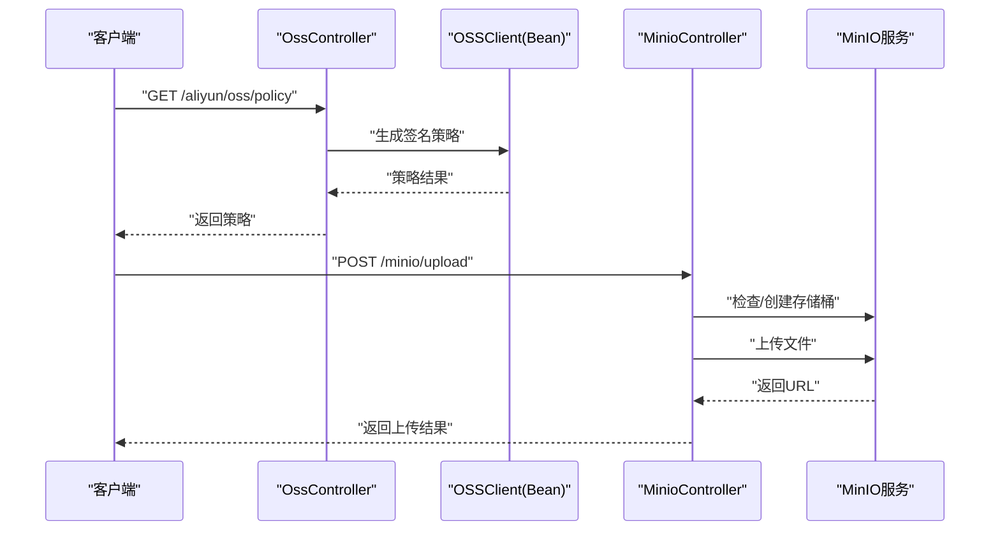
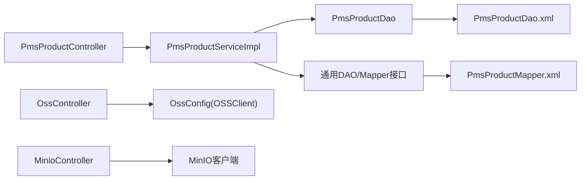

# 数据访问层设计

<cite>
**本文引用的文件**
- [MyBatisConfig.java](file://mall-admin/src/main/java/com/macro/mall/config/MyBatisConfig.java)
- [OssConfig.java](file://mall-admin/src/main/java/com/macro/mall/config/OssConfig.java)
- [application.yml](file://mall-admin/src/main/resources/application.yml)
- [application-dev.yml](file://mall-admin/src/main/resources/application-dev.yml)
- [application-prod.yml](file://mall-admin/src/main/resources/application-prod.yml)
- [PmsProductDao.java](file://mall-admin/src/main/java/com/macro/mall/dao/PmsProductDao.java)
- [PmsProductDao.xml](file://mall-admin/src/main/resources/dao/PmsProductDao.xml)
- [PmsProductMapper.java](file://mall-mbg/src/main/java/com/macro/mall/mapper/PmsProductMapper.java)
- [PmsProductMapper.xml](file://mall-mbg/src/main/resources/com/macro/mall/mapper/PmsProductMapper.xml)
- [PmsProductController.java](file://mall-admin/src/main/java/com/macro/mall/controller/PmsProductController.java)
- [PmsProductService.java](file://mall-admin/src/main/java/com/macro/mall/service/PmsProductService.java)
- [PmsProductServiceImpl.java](file://mall-admin/src/main/java/com/macro/mall/service/impl/PmsProductServiceImpl.java)
- [OssController.java](file://mall-admin/src/main/java/com/macro/mall/controller/OssController.java)
- [MinioController.java](file://mall-admin/src/main/java/com/macro/mall/controller/MinioController.java)
</cite>

## 目录
1. [简介](#简介)
2. [项目结构](#项目结构)
3. [核心组件](#核心组件)
4. [架构总览](#架构总览)
5. [详细组件分析](#详细组件分析)
6. [依赖分析](#依赖分析)
7. [性能考虑](#性能考虑)
8. [故障排查指南](#故障排查指南)
9. [结论](#结论)
10. [附录](#附录)

## 简介
本文件系统化梳理后台管理系统的数据访问层设计，重点覆盖以下方面：
- MyBatisConfig 配置类：数据源与事务、Mapper 扫描范围、分页插件配置现状与建议
- DAO 接口设计模式：通用 Mapper 接口、自定义 SQL 映射、批量操作实现
- 对象存储配置：OssConfig 的阿里云 OSS 集成；MinIO 的本地/生产集成方案
- XML 映射文件编写规范、SQL 优化策略与 MyBatis Plus 使用建议
- 性能优化建议与最佳实践

## 项目结构
数据访问层主要分布在三个模块：
- mall-admin：控制层、服务层、DAO 层与配置
- mall-mbg：基于 MyBatis Generator 生成的通用 Mapper 与 XML
- mall-common：公共返回体、异常与日志等基础设施

下图展示与数据访问层相关的模块与文件关系：

图表来源
- [MyBatisConfig.java:11-15](file://mall-admin/src/main/java/com/macro/mall/config/MyBatisConfig.java#L11-L15)
- [OssConfig.java:13-26](file://mall-admin/src/main/java/com/macro/mall/config/OssConfig.java#L13-L26)
- [PmsProductController.java:21-26](file://mall-admin/src/main/java/com/macro/mall/controller/PmsProductController.java#L21-L26)
- [PmsProductService.java:17-73](file://mall-admin/src/main/java/com/macro/mall/service/PmsProductService.java#L17-L73)
- [PmsProductServiceImpl.java:30-66](file://mall-admin/src/main/java/com/macro/mall/service/impl/PmsProductServiceImpl.java#L30-L66)
- [PmsProductDao.java:11-16](file://mall-admin/src/main/java/com/macro/mall/dao/PmsProductDao.java#L11-L16)
- [PmsProductDao.xml:3-19](file://mall-admin/src/main/resources/dao/PmsProductDao.xml#L3-L19)
- [PmsProductMapper.java:8-36](file://mall-mbg/src/main/java/com/macro/mall/mapper/PmsProductMapper.java#L8-L36)
- [PmsProductMapper.xml:3-49](file://mall-mbg/src/main/resources/com/macro/mall/mapper/PmsProductMapper.xml#L3-L49)
- [OssController.java:22-26](file://mall-admin/src/main/java/com/macro/mall/controller/OssController.java#L22-L26)
- [MinioController.java:24-27](file://mall-admin/src/main/java/com/macro/mall/controller/MinioController.java#L24-L27)

章节来源
- [MyBatisConfig.java:11-15](file://mall-admin/src/main/java/com/macro/mall/config/MyBatisConfig.java#L11-L15)
- [application.yml:14-18](file://mall-admin/src/main/resources/application.yml#L14-L18)

## 核心组件
- MyBatisConfig：启用事务管理与 Mapper 扫描，指定扫描包范围为通用 Mapper 与自定义 DAO 包
- PmsProductDao/PmsProductDao.xml：自定义复杂查询与多表联结结果映射
- PmsProductMapper/PmsProductMapper.xml：通用 CRUD 与条件查询
- PmsProductService/PmsProductServiceImpl：业务编排、事务控制、批量操作
- OssConfig：按开关启用阿里云 OSS 客户端 Bean
- MinioController：本地/生产 MinIO 集成示例，含存储桶策略与上传/删除
- OssController：阿里云 OSS 策略与回调接口

章节来源
- [MyBatisConfig.java:11-15](file://mall-admin/src/main/java/com/macro/mall/config/MyBatisConfig.java#L11-L15)
- [PmsProductDao.java:11-16](file://mall-admin/src/main/java/com/macro/mall/dao/PmsProductDao.java#L11-L16)
- [PmsProductMapper.java:8-36](file://mall-mbg/src/main/java/com/macro/mall/mapper/PmsProductMapper.java#L8-L36)
- [PmsProductService.java:17-73](file://mall-admin/src/main/java/com/macro/mall/service/PmsProductService.java#L17-L73)
- [PmsProductServiceImpl.java:30-66](file://mall-admin/src/main/java/com/macro/mall/service/impl/PmsProductServiceImpl.java#L30-L66)
- [OssConfig.java:13-26](file://mall-admin/src/main/java/com/macro/mall/config/OssConfig.java#L13-L26)
- [MinioController.java:24-27](file://mall-admin/src/main/java/com/macro/mall/controller/MinioController.java#L24-L27)
- [OssController.java:22-26](file://mall-admin/src/main/java/com/macro/mall/controller/OssController.java#L22-L26)

## 架构总览
下图展示从控制器到服务、DAO、通用 Mapper 与对象存储的整体调用链路与职责边界。

图表来源
- [PmsProductController.java:39-44](file://mall-admin/src/main/java/com/macro/mall/controller/PmsProductController.java#L39-L44)
- [PmsProductServiceImpl.java:115-118](file://mall-admin/src/main/java/com/macro/mall/service/impl/PmsProductServiceImpl.java#L115-L118)
- [PmsProductDao.java:15](file://mall-admin/src/main/java/com/macro/mall/dao/PmsProductDao.java#L15)
- [PmsProductDao.xml:21-37](file://mall-admin/src/main/resources/dao/PmsProductDao.xml#L21-L37)
- [OssController.java:30-35](file://mall-admin/src/main/java/com/macro/mall/controller/OssController.java#L30-L35)
- [MinioController.java:39-82](file://mall-admin/src/main/java/com/macro/mall/controller/MinioController.java#L39-L82)

## 详细组件分析

### MyBatisConfig 配置类
- 作用：启用事务管理、扫描通用 Mapper 与自定义 DAO 包，确保 Mapper 接口被 Spring 管理并注入
- 关键点：
  - 启用事务管理注解
  - 指定 Mapper 扫描范围包含通用 Mapper 与 DAO 包
- 当前未显式配置分页插件，可结合 PageHelper 在服务层进行分页

章节来源
- [MyBatisConfig.java:11-15](file://mall-admin/src/main/java/com/macro/mall/config/MyBatisConfig.java#L11-L15)
- [application.yml:14-18](file://mall-admin/src/main/resources/application.yml#L14-L18)

### DAO 接口设计模式
- 自定义 DAO 接口：面向复杂查询与多表联结，如 PmsProductDao 提供“获取商品编辑信息”的复合查询
- 通用 Mapper 接口：由 MyBatis Generator 生成，提供标准 CRUD 与 Example 条件查询
- 设计要点：
  - 复杂查询集中在 DAO XML 中，避免在 Service 中拼装 SQL
  - 通过 ResultMap 与 collection/association 实现一对多/多对多映射
  - 批量操作通过 DAO 的 insertList 方法统一处理

章节来源
- [PmsProductDao.java:11-16](file://mall-admin/src/main/java/com/macro/mall/dao/PmsProductDao.java#L11-L16)
- [PmsProductDao.xml:3-19](file://mall-admin/src/main/resources/dao/PmsProductDao.xml#L3-L19)
- [PmsProductMapper.java:8-36](file://mall-mbg/src/main/java/com/macro/mall/mapper/PmsProductMapper.java#L8-L36)
- [PmsProductMapper.xml:3-49](file://mall-mbg/src/main/resources/com/macro/mall/mapper/PmsProductMapper.xml#L3-L49)

### XML 映射文件编写规范与 SQL 优化
- 规范：
  - 使用 ResultMap 明确字段映射，避免硬编码列名
  - 将重复条件封装为 SQL 片段（如 Example_Where_Clause），提升复用性
  - 对于复杂联结查询，采用嵌套结果映射（collection/association）或子查询
- 优化策略：
  - 仅选择必要字段，避免 SELECT *
  - 为高频查询字段建立合适索引
  - 使用 LIMIT/分页参数，避免一次性加载大量数据
  - 将动态条件拆分为多个 SQL 片段，减少分支判断

章节来源
- [PmsProductDao.xml:3-19](file://mall-admin/src/main/resources/dao/PmsProductDao.xml#L3-L19)
- [PmsProductDao.xml:21-43](file://mall-admin/src/main/resources/dao/PmsProductDao.xml#L21-L43)
- [PmsProductMapper.xml:50-107](file://mall-mbg/src/main/resources/com/macro/mall/mapper/PmsProductMapper.xml#L50-L107)
- [PmsProductMapper.xml:119-148](file://mall-mbg/src/main/resources/com/macro/mall/mapper/PmsProductMapper.xml#L119-L148)

### 批量操作实现
- 通用流程：
  - 先清理旧关系，再批量插入新关系
  - 使用反射或统一方法将 productId 注入到待插入实体
  - 通过 DAO 的 insertList 执行批量写入
- 示例：商品更新时对会员价、阶梯价、满减、SKU、属性值、专题与优选区域等进行批量维护

图表来源
- [PmsProductServiceImpl.java:163-204](file://mall-admin/src/main/java/com/macro/mall/service/impl/PmsProductServiceImpl.java#L163-L204)
- [PmsProductServiceImpl.java:310-325](file://mall-admin/src/main/java/com/macro/mall/service/impl/PmsProductServiceImpl.java#L310-L325)

章节来源
- [PmsProductServiceImpl.java:68-95](file://mall-admin/src/main/java/com/macro/mall/service/impl/PmsProductServiceImpl.java#L68-L95)
- [PmsProductServiceImpl.java:120-161](file://mall-admin/src/main/java/com/macro/mall/service/impl/PmsProductServiceImpl.java#L120-L161)
- [PmsProductServiceImpl.java:310-325](file://mall-admin/src/main/java/com/macro/mall/service/impl/PmsProductServiceImpl.java#L310-L325)

### 对象存储配置：OssConfig 与 MinIO 集成
- 阿里云 OSS：
  - 通过 OssConfig 条件化创建 OSSClient Bean
  - OssController 提供策略生成与回调接口，受开关控制
- MinIO：
  - MinioController 直接使用 MinIO Java 客户端进行上传/删除
  - 自动检测并创建存储桶，设置只读策略
  - 支持按日期前缀组织对象命名

图表来源
- [OssConfig.java:21-25](file://mall-admin/src/main/java/com/macro/mall/config/OssConfig.java#L21-L25)
- [OssController.java:30-42](file://mall-admin/src/main/java/com/macro/mall/controller/OssController.java#L30-L42)
- [MinioController.java:42-82](file://mall-admin/src/main/java/com/macro/mall/controller/MinioController.java#L42-L82)

章节来源
- [OssConfig.java:13-26](file://mall-admin/src/main/java/com/macro/mall/config/OssConfig.java#L13-L26)
- [OssController.java:22-26](file://mall-admin/src/main/java/com/macro/mall/controller/OssController.java#L22-L26)
- [MinioController.java:24-27](file://mall-admin/src/main/java/com/macro/mall/controller/MinioController.java#L24-L27)

### MyBatis Plus 使用建议
- 本项目使用 MyBatis Generator 生成通用 Mapper，未引入 MyBatis Plus
- 若后续迁移至 MyBatis Plus，建议：
  - 使用 BaseMapper 与条件构造器简化 CRUD
  - 利用分页插件 PageHelper 或 MyBatis-Plus 分页
  - 使用自动填充、乐观锁等增强能力
- 当前配置中未显式声明分页插件，可在 MyBatisConfig 中补充 PageHelper Bean

章节来源
- [MyBatisConfig.java:11-15](file://mall-admin/src/main/java/com/macro/mall/config/MyBatisConfig.java#L11-L15)
- [application.yml:14-18](file://mall-admin/src/main/resources/application.yml#L14-L18)

## 依赖分析
- 控制器依赖服务层，服务层依赖 DAO 与通用 Mapper
- DAO 依赖 XML 映射文件完成 SQL 执行与结果映射
- 对象存储控制器分别依赖 OSSClient Bean 与 MinIO 客户端
- 配置文件提供数据源、MyBatis 映射位置与对象存储参数

图表来源
- [PmsProductController.java:21-26](file://mall-admin/src/main/java/com/macro/mall/controller/PmsProductController.java#L21-L26)
- [PmsProductServiceImpl.java:30-66](file://mall-admin/src/main/java/com/macro/mall/service/impl/PmsProductServiceImpl.java#L30-L66)
- [PmsProductDao.java:11-16](file://mall-admin/src/main/java/com/macro/mall/dao/PmsProductDao.java#L11-L16)
- [PmsProductDao.xml:3-19](file://mall-admin/src/main/resources/dao/PmsProductDao.xml#L3-L19)
- [PmsProductMapper.java:8-36](file://mall-mbg/src/main/java/com/macro/mall/mapper/PmsProductMapper.java#L8-L36)
- [PmsProductMapper.xml:3-49](file://mall-mbg/src/main/resources/com/macro/mall/mapper/PmsProductMapper.xml#L3-L49)
- [OssConfig.java:21-25](file://mall-admin/src/main/java/com/macro/mall/config/OssConfig.java#L21-L25)
- [MinioController.java:42-82](file://mall-admin/src/main/java/com/macro/mall/controller/MinioController.java#L42-L82)

章节来源
- [PmsProductController.java:21-26](file://mall-admin/src/main/java/com/macro/mall/controller/PmsProductController.java#L21-L26)
- [PmsProductServiceImpl.java:30-66](file://mall-admin/src/main/java/com/macro/mall/service/impl/PmsProductServiceImpl.java#L30-L66)
- [PmsProductDao.xml:3-19](file://mall-admin/src/main/resources/dao/PmsProductDao.xml#L3-L19)
- [PmsProductMapper.xml:3-49](file://mall-mbg/src/main/resources/com/macro/mall/mapper/PmsProductMapper.xml#L3-L49)
- [OssConfig.java:21-25](file://mall-admin/src/main/java/com/macro/mall/config/OssConfig.java#L21-L25)
- [MinioController.java:42-82](file://mall-admin/src/main/java/com/macro/mall/controller/MinioController.java#L42-L82)

## 性能考虑
- SQL 优化
  - 仅查询必要字段，避免 SELECT *
  - 为高频过滤字段建立索引
  - 使用 LIMIT 与分页参数，避免全表扫描
- 结果映射
  - 使用 ResultMap 与嵌套映射，减少二次查询
  - 对大字段（如 BLOB）按需加载
- 批量操作
  - 统一批处理流程，减少往返次数
  - 使用 JDBC 批处理或框架提供的批量插入
- 缓存与连接池
  - 合理配置 Druid 连接池参数（初始大小、最大活跃数、最小空闲）
  - 结合 Redis 缓存热点数据
- 对象存储
  - MinIO/阿里云 OSS 上传时设置合适的并发与分片大小
  - 回调与签名策略尽量缩短外部交互时间

## 故障排查指南
- MyBatis 扫描不到 Mapper
  - 检查 MyBatisConfig 的 Mapper 扫描包是否包含 DAO 与通用 Mapper
  - 确认 application.yml 中的 mapper-locations 是否正确
- 自定义 SQL 查询异常
  - 核对 XML 命名空间与接口全限定名一致
  - 检查 ResultMap 字段与 SQL 列名映射是否匹配
- 批量插入失败
  - 确保 DAO 的 insertList 方法已实现
  - 检查实体注入逻辑（如 productId）是否正确
- 对象存储上传失败
  - 阿里云 OSS：确认开关开启、Endpoint、AccessKey、SecretKey 正确
  - MinIO：确认 Endpoint、BucketName、AccessKey、SecretKey 正确，存储桶策略是否允许读取

章节来源
- [MyBatisConfig.java:11-15](file://mall-admin/src/main/java/com/macro/mall/config/MyBatisConfig.java#L11-L15)
- [application.yml:14-18](file://mall-admin/src/main/resources/application.yml#L14-L18)
- [OssConfig.java:15-25](file://mall-admin/src/main/java/com/macro/mall/config/OssConfig.java#L15-L25)
- [MinioController.java:39-82](file://mall-admin/src/main/java/com/macro/mall/controller/MinioController.java#L39-L82)

## 结论
本项目采用“通用 Mapper + 自定义 DAO + XML 映射”的混合架构，既保证了通用 CRUD 的简洁性，又满足复杂查询与批量操作的需求。通过合理的配置与规范化的 XML 编写，能够有效支撑后台管理系统的数据访问需求。建议后续在保持现有结构的基础上，完善分页插件配置与缓存策略，并持续优化 SQL 与映射性能。

## 附录
- 配置文件要点
  - MyBatis：mapper-locations、type-aliases-package
  - 数据源：Druid 连接池参数
  - 对象存储：阿里云 OSS 与 MinIO 的开关、Endpoint、BucketName、AccessKey、SecretKey
- 开发建议
  - 新增实体时优先生成通用 Mapper，复杂查询放入 DAO XML
  - 批量操作统一入口，避免分散在各处
  - 对外接口统一返回体与异常处理

章节来源
- [application.yml:14-18](file://mall-admin/src/main/resources/application.yml#L14-L18)
- [application-dev.yml:2-27](file://mall-admin/src/main/resources/application-dev.yml#L2-L27)
- [application-prod.yml:2-27](file://mall-admin/src/main/resources/application-prod.yml#L2-L27)