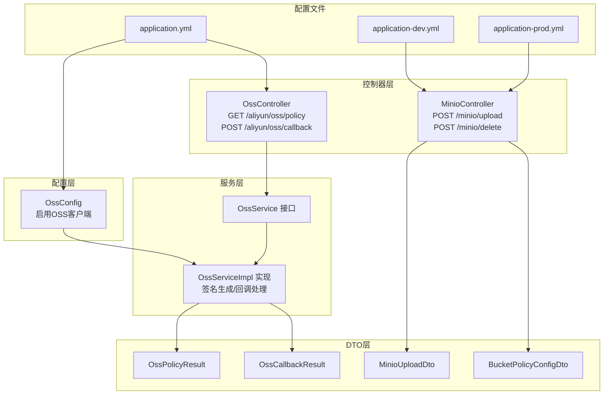
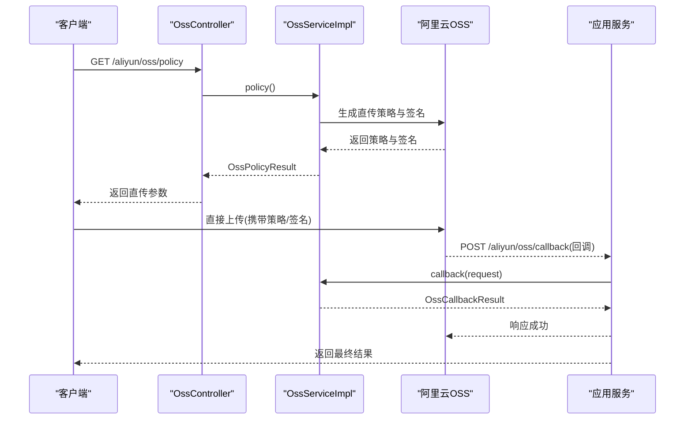
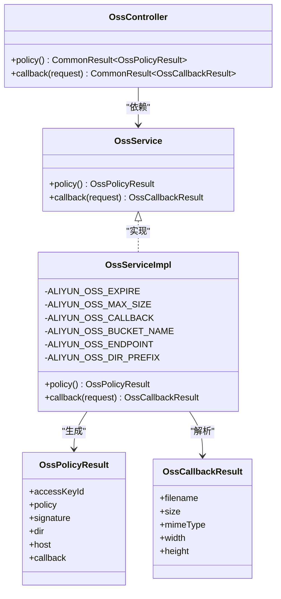
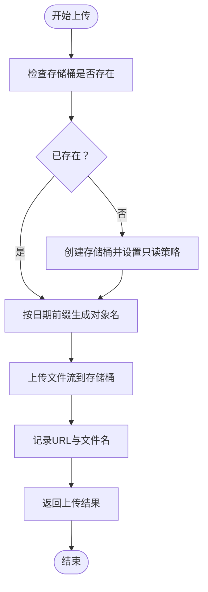
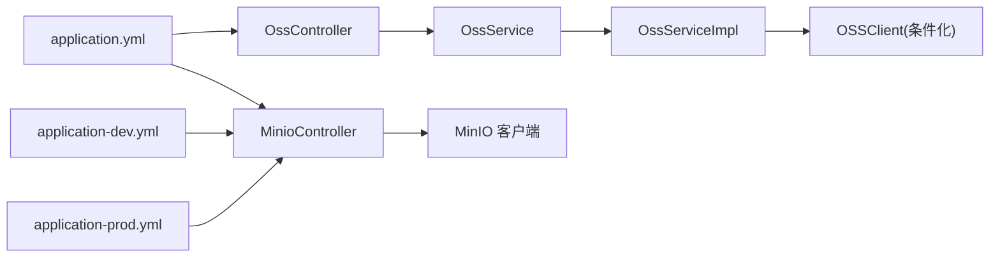

# 文件存储与上传

<cite>
**本文引用的文件**
- [OssController.java](file://mall-admin/src/main/java/com/macro/mall/controller/OssController.java)
- [MinioController.java](file://mall-admin/src/main/java/com/macro/mall/controller/MinioController.java)
- [OssService.java](file://mall-admin/src/main/java/com/macro/mall/service/OssService.java)
- [OssServiceImpl.java](file://mall-admin/src/main/java/com/macro/mall/service/impl/OssServiceImpl.java)
- [OssConfig.java](file://mall-admin/src/main/java/com/macro/mall/config/OssConfig.java)
- [OssPolicyResult.java](file://mall-admin/src/main/java/com/macro/mall/dto/OssPolicyResult.java)
- [OssCallbackResult.java](file://mall-admin/src/main/java/com/macro/mall/dto/OssCallbackResult.java)
- [MinioUploadDto.java](file://mall-admin/src/main/java/com/macro/mall/dto/MinioUploadDto.java)
- [BucketPolicyConfigDto.java](file://mall-admin/src/main/java/com/macro/mall/dto/BucketPolicyConfigDto.java)
- [application.yml](file://mall-admin/src/main/resources/application.yml)
- [application-dev.yml](file://mall-admin/src/main/resources/application-dev.yml)
- [application-prod.yml](file://mall-admin/src/main/resources/application-prod.yml)
</cite>

## 目录
1. [简介](#简介)
2. [项目结构](#项目结构)
3. [核心组件](#核心组件)
4. [架构总览](#架构总览)
5. [详细组件分析](#详细组件分析)
6. [依赖关系分析](#依赖关系分析)
7. [性能考虑](#性能考虑)
8. [故障排查指南](#故障排查指南)
9. [结论](#结论)
10. [附录：API 接口与配置说明](#附录api-接口与配置说明)

## 简介
本文件系统性梳理了基于 Spring Boot 的文件存储与上传模块，覆盖阿里云 OSS 与 MinIO 两种对象存储的集成方案。内容包括：
- 控制器设计：OssController 与 MinioController 的直传配置、回调处理与文件管理能力
- 服务层业务：签名生成、权限控制、存储策略配置
- DTO 设计：上传策略、回调参数、上传结果
- 完整 API 文档与存储配置说明，便于快速接入与运维

## 项目结构
围绕文件存储与上传的关键文件组织如下：
- 配置层：OssConfig 负责按开关启用 OSS 客户端
- 控制器层：OssController 暴露直传策略与回调接口；MinioController 提供直传、删除接口
- 服务层：OssService 接口与 OssServiceImpl 实现，封装 OSS 签名与回调逻辑
- DTO 层：OssPolicyResult、OssCallbackResult、MinioUploadDto、BucketPolicyConfigDto
- 配置文件：application.yml、application-dev.yml、application-prod.yml 中包含 OSS 与 MinIO 的运行参数

图表来源
- [OssConfig.java:1-27](file://mall-admin/src/main/java/com/macro/mall/config/OssConfig.java#L1-L27)
- [OssController.java:1-45](file://mall-admin/src/main/java/com/macro/mall/controller/OssController.java#L1-L45)
- [MinioController.java:1-115](file://mall-admin/src/main/java/com/macro/mall/controller/MinioController.java#L1-L115)
- [OssService.java:1-22](file://mall-admin/src/main/java/com/macro/mall/service/OssService.java#L1-L22)
- [OssServiceImpl.java:1-105](file://mall-admin/src/main/java/com/macro/mall/service/impl/OssServiceImpl.java#L1-L105)
- [OssPolicyResult.java:1-20](file://mall-admin/src/main/java/com/macro/mall/dto/OssPolicyResult.java#L1-L20)
- [OssCallbackResult.java:1-19](file://mall-admin/src/main/java/com/macro/mall/dto/OssCallbackResult.java#L1-L19)
- [MinioUploadDto.java:1-16](file://mall-admin/src/main/java/com/macro/mall/dto/MinioUploadDto.java#L1-L16)
- [BucketPolicyConfigDto.java:1-32](file://mall-admin/src/main/java/com/macro/mall/dto/BucketPolicyConfigDto.java#L1-L32)
- [application.yml:56-68](file://mall-admin/src/main/resources/application.yml#L56-L68)
- [application-dev.yml:23-27](file://mall-admin/src/main/resources/application-dev.yml#L23-L27)
- [application-prod.yml:22-26](file://mall-admin/src/main/resources/application-prod.yml#L22-L26)

章节来源
- [OssConfig.java:1-27](file://mall-admin/src/main/java/com/macro/mall/config/OssConfig.java#L1-L27)
- [OssController.java:1-45](file://mall-admin/src/main/java/com/macro/mall/controller/OssController.java#L1-L45)
- [MinioController.java:1-115](file://mall-admin/src/main/java/com/macro/mall/controller/MinioController.java#L1-L115)
- [OssService.java:1-22](file://mall-admin/src/main/java/com/macro/mall/service/OssService.java#L1-L22)
- [OssServiceImpl.java:1-105](file://mall-admin/src/main/java/com/macro/mall/service/impl/OssServiceImpl.java#L1-L105)
- [OssPolicyResult.java:1-20](file://mall-admin/src/main/java/com/macro/mall/dto/OssPolicyResult.java#L1-L20)
- [OssCallbackResult.java:1-19](file://mall-admin/src/main/java/com/macro/mall/dto/OssCallbackResult.java#L1-L19)
- [MinioUploadDto.java:1-16](file://mall-admin/src/main/java/com/macro/mall/dto/MinioUploadDto.java#L1-L16)
- [BucketPolicyConfigDto.java:1-32](file://mall-admin/src/main/java/com/macro/mall/dto/BucketPolicyConfigDto.java#L1-L32)
- [application.yml:56-68](file://mall-admin/src/main/resources/application.yml#L56-L68)
- [application-dev.yml:23-27](file://mall-admin/src/main/resources/application-dev.yml#L23-L27)
- [application-prod.yml:22-26](file://mall-admin/src/main/resources/application-prod.yml#L22-L26)

## 核心组件
- OssController：提供直传策略查询与回调处理接口，受 aliyun.oss.enable 开关控制
- MinioController：提供直传与删除接口，自动检测/创建存储桶并设置只读策略
- OssService/OssServiceImpl：封装 OSS 签名生成与回调解析，支持自定义过期时间、最大尺寸、回调地址与目录前缀
- DTO：OssPolicyResult、OssCallbackResult、MinioUploadDto、BucketPolicyConfigDto 分别承载直传策略、回调结果、上传结果与存储桶策略

章节来源
- [OssController.java:22-44](file://mall-admin/src/main/java/com/macro/mall/controller/OssController.java#L22-L44)
- [MinioController.java:24-114](file://mall-admin/src/main/java/com/macro/mall/controller/MinioController.java#L24-L114)
- [OssService.java:12-21](file://mall-admin/src/main/java/com/macro/mall/service/OssService.java#L12-L21)
- [OssServiceImpl.java:27-104](file://mall-admin/src/main/java/com/macro/mall/service/impl/OssServiceImpl.java#L27-L104)
- [OssPolicyResult.java:10-19](file://mall-admin/src/main/java/com/macro/mall/dto/OssPolicyResult.java#L10-L19)
- [OssCallbackResult.java:10-18](file://mall-admin/src/main/java/com/macro/mall/dto/OssCallbackResult.java#L10-L18)
- [MinioUploadDto.java:10-15](file://mall-admin/src/main/java/com/macro/mall/dto/MinioUploadDto.java#L10-L15)
- [BucketPolicyConfigDto.java:13-31](file://mall-admin/src/main/java/com/macro/mall/dto/BucketPolicyConfigDto.java#L13-L31)

## 架构总览
下图展示从客户端到对象存储的典型上传流程，以及回调链路：

图表来源
- [OssController.java:30-42](file://mall-admin/src/main/java/com/macro/mall/controller/OssController.java#L30-L42)
- [OssServiceImpl.java:52-89](file://mall-admin/src/main/java/com/macro/mall/service/impl/OssServiceImpl.java#L52-L89)
- [OssServiceImpl.java:91-102](file://mall-admin/src/main/java/com/macro/mall/service/impl/OssServiceImpl.java#L91-L102)
- [application.yml:65](file://mall-admin/src/main/resources/application.yml#L65)

## 详细组件分析

### 阿里云 OSS 集成
- 配置启用：通过开关 aliyun.oss.enable 控制是否加载 OSS 客户端 Bean
- 策略生成：OssServiceImpl 在 policy() 中计算过期时间、最大尺寸、回调参数，并生成策略与签名
- 回调处理：OssServiceImpl 在 callback() 中解析回调参数，拼装可访问 URL 并返回标准结果
- 控制器接口：OssController 暴露 GET /aliyun/oss/policy 与 POST /aliyun/oss/callback

图表来源
- [OssController.java:26-42](file://mall-admin/src/main/java/com/macro/mall/controller/OssController.java#L26-L42)
- [OssService.java:12-21](file://mall-admin/src/main/java/com/macro/mall/service/OssService.java#L12-L21)
- [OssServiceImpl.java:29-104](file://mall-admin/src/main/java/com/macro/mall/service/impl/OssServiceImpl.java#L29-L104)
- [OssPolicyResult.java:12-19](file://mall-admin/src/main/java/com/macro/mall/dto/OssPolicyResult.java#L12-L19)
- [OssCallbackResult.java:12-18](file://mall-admin/src/main/java/com/macro/mall/dto/OssCallbackResult.java#L12-L18)

章节来源
- [OssConfig.java:21-25](file://mall-admin/src/main/java/com/macro/mall/config/OssConfig.java#L21-L25)
- [OssServiceImpl.java:52-89](file://mall-admin/src/main/java/com/macro/mall/service/impl/OssServiceImpl.java#L52-L89)
- [OssServiceImpl.java:91-102](file://mall-admin/src/main/java/com/macro/mall/service/impl/OssServiceImpl.java#L91-L102)
- [OssController.java:30-42](file://mall-admin/src/main/java/com/macro/mall/controller/OssController.java#L30-L42)

### MinIO 集成
- 自动化存储桶：首次上传时检测存储桶是否存在，不存在则创建并设置只读策略
- 只读策略：通过 BucketPolicyConfigDto 生成策略 JSON 并设置到存储桶
- 上传流程：接收 MultipartFile，按日期前缀生成对象名，上传后返回可访问 URL 与原始文件名
- 删除接口：根据对象名删除对应文件

图表来源
- [MinioController.java:48-71](file://mall-admin/src/main/java/com/macro/mall/controller/MinioController.java#L48-L71)
- [MinioController.java:87-97](file://mall-admin/src/main/java/com/macro/mall/controller/MinioController.java#L87-L97)
- [MinioUploadDto.java:12-15](file://mall-admin/src/main/java/com/macro/mall/dto/MinioUploadDto.java#L12-L15)
- [BucketPolicyConfigDto.java:16-31](file://mall-admin/src/main/java/com/macro/mall/dto/BucketPolicyConfigDto.java#L16-L31)

章节来源
- [MinioController.java:39-82](file://mall-admin/src/main/java/com/macro/mall/controller/MinioController.java#L39-L82)
- [MinioController.java:99-113](file://mall-admin/src/main/java/com/macro/mall/controller/MinioController.java#L99-L113)
- [BucketPolicyConfigDto.java:13-31](file://mall-admin/src/main/java/com/macro/mall/dto/BucketPolicyConfigDto.java#L13-L31)
- [MinioUploadDto.java:10-15](file://mall-admin/src/main/java/com/macro/mall/dto/MinioUploadDto.java#L10-L15)

## 依赖关系分析
- OssController 依赖 OssService 接口，具体实现由 OssServiceImpl 提供
- OssServiceImpl 依赖 OSS 客户端 Bean（由 OssConfig 条件化注入）
- MinioController 直接使用 MinIO 客户端进行上传与删除操作
- 配置文件在不同环境提供不同的 endpoint、bucketName、accessKey、secretKey

图表来源
- [OssController.java:27-28](file://mall-admin/src/main/java/com/macro/mall/controller/OssController.java#L27-L28)
- [OssServiceImpl.java:46](file://mall-admin/src/main/java/com/macro/mall/service/impl/OssServiceImpl.java#L46)
- [OssConfig.java:22-25](file://mall-admin/src/main/java/com/macro/mall/config/OssConfig.java#L22-L25)
- [MinioController.java:44-47](file://mall-admin/src/main/java/com/macro/mall/controller/MinioController.java#L44-L47)
- [application.yml:56-68](file://mall-admin/src/main/resources/application.yml#L56-L68)
- [application-dev.yml:23-27](file://mall-admin/src/main/resources/application-dev.yml#L23-L27)
- [application-prod.yml:22-26](file://mall-admin/src/main/resources/application-prod.yml#L22-L26)

章节来源
- [OssController.java:22-44](file://mall-admin/src/main/java/com/macro/mall/controller/OssController.java#L22-L44)
- [OssServiceImpl.java:27-104](file://mall-admin/src/main/java/com/macro/mall/service/impl/OssServiceImpl.java#L27-L104)
- [OssConfig.java:13-26](file://mall-admin/src/main/java/com/macro/mall/config/OssConfig.java#L13-L26)
- [MinioController.java:24-114](file://mall-admin/src/main/java/com/macro/mall/controller/MinioController.java#L24-L114)
- [application.yml:56-68](file://mall-admin/src/main/resources/application.yml#L56-L68)
- [application-dev.yml:23-27](file://mall-admin/src/main/resources/application-dev.yml#L23-L27)
- [application-prod.yml:22-26](file://mall-admin/src/main/resources/application-prod.yml#L22-L26)

## 性能考虑
- 直传优化：OSS 直传避免应用服务器中转，显著降低带宽与 CPU 开销
- 签名时效：通过 aliyun.oss.policy.expire 控制签名有效期，建议结合前端轮询刷新策略
- 文件大小限制：通过 aliyun.oss.maxSize 限制单次上传大小，防止资源滥用
- MinIO 多部分上传：上传大文件时利用流式上传与多部分策略，提升稳定性
- 日志与异常：上传异常需捕获并记录，避免泄露敏感信息

## 故障排查指南
- OSS 直传失败
  - 检查 aliyun.oss.enable 是否开启
  - 核对 endpoint、accessKeyId、accessKeySecret、bucketName、dir.prefix
  - 确认回调地址可访问且未被防火墙拦截
- MinIO 上传失败
  - 检查 endpoint、bucketName、accessKey、secretKey
  - 确认存储桶存在或具备创建权限
  - 查看日志输出定位异常
- 回调未触发
  - 确认回调 URL 与 OSS 回调配置一致
  - 检查网络连通性与安全组放行

章节来源
- [OssConfig.java:22-25](file://mall-admin/src/main/java/com/macro/mall/config/OssConfig.java#L22-L25)
- [application.yml:56-68](file://mall-admin/src/main/resources/application.yml#L56-L68)
- [MinioController.java:77-81](file://mall-admin/src/main/java/com/macro/mall/controller/MinioController.java#L77-L81)

## 结论
该文件存储模块以清晰的分层设计实现了 OSS 与 MinIO 的统一接入：OSS 采用直传+回调模式，MinIO 提供直传与删除能力。通过 DTO 统一返回结构、配置文件灵活切换环境，既保证了易用性也兼顾了扩展性。

## 附录：API 接口与配置说明

### API 接口文档
- OSS 直传策略
  - 方法：GET
  - 路径：/aliyun/oss/policy
  - 功能：返回直传所需的 accessKeyId、policy、signature、dir、host、callback
  - 返回：CommonResult 包裹 OssPolicyResult
- OSS 回调
  - 方法：POST
  - 路径：/aliyun/oss/callback
  - 功能：处理 OSS 上传成功后的回调，返回 filename、size、mimeType、width、height
  - 返回：CommonResult 包裹 OssCallbackResult
- MinIO 上传
  - 方法：POST
  - 路径：/minio/upload
  - 参数：file（MultipartFile）
  - 功能：自动创建存储桶并设置只读策略，上传文件并返回 URL 与文件名
  - 返回：CommonResult 包裹 MinioUploadDto
- MinIO 删除
  - 方法：POST
  - 路径：/minio/delete
  - 参数：objectName（字符串）
  - 功能：删除指定对象
  - 返回：CommonResult

章节来源
- [OssController.java:30-42](file://mall-admin/src/main/java/com/macro/mall/controller/OssController.java#L30-L42)
- [MinioController.java:39-82](file://mall-admin/src/main/java/com/macro/mall/controller/MinioController.java#L39-L82)
- [MinioController.java:99-113](file://mall-admin/src/main/java/com/macro/mall/controller/MinioController.java#L99-L113)

### 存储配置说明
- OSS 配置（application.yml）
  - aliyun.oss.enable：是否启用 OSS 客户端
  - aliyun.oss.endpoint：OSS 外网访问域名
  - aliyun.oss.accessKeyId / accessKeySecret：访问凭据
  - aliyun.oss.bucketName：存储空间
  - aliyun.oss.policy.expire：签名有效期（秒）
  - aliyun.oss.maxSize：上传文件大小上限（MB）
  - aliyun.oss.callback：回调地址
  - aliyun.oss.dir.prefix：上传目录前缀
- MinIO 配置（application-dev.yml / application-prod.yml）
  - minio.endpoint：MinIO 服务地址
  - minio.bucketName：存储桶名称
  - minio.accessKey / minio.secretKey：访问凭据

章节来源
- [application.yml:56-68](file://mall-admin/src/main/resources/application.yml#L56-L68)
- [application-dev.yml:23-27](file://mall-admin/src/main/resources/application-dev.yml#L23-L27)
- [application-prod.yml:22-26](file://mall-admin/src/main/resources/application-prod.yml#L22-L26)