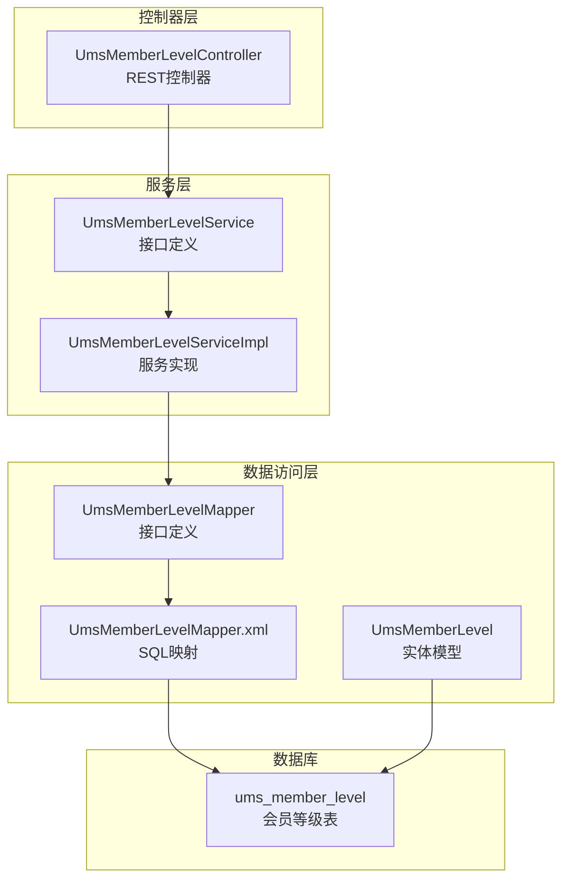
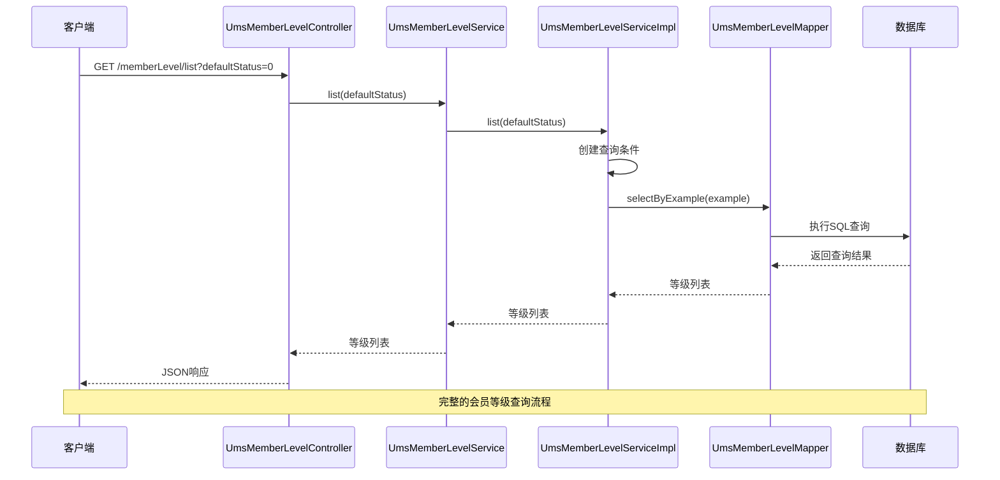
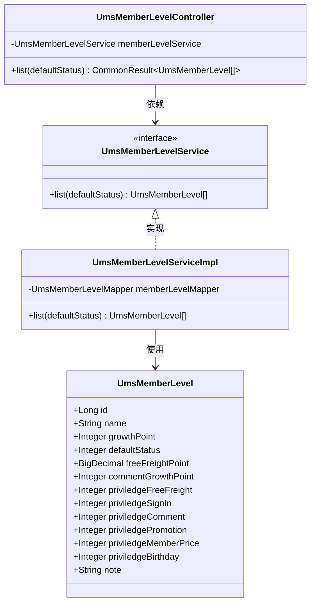
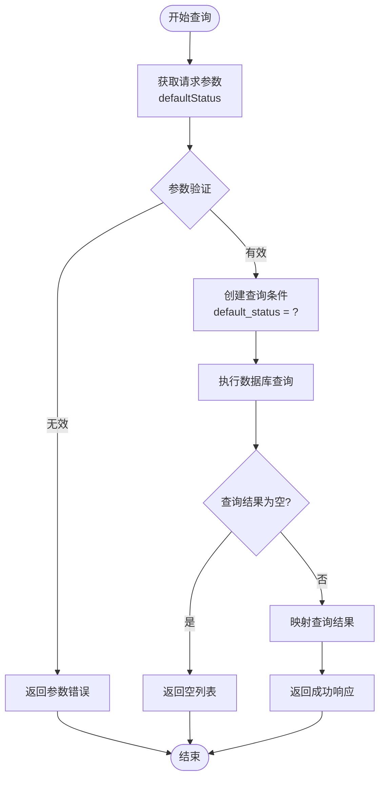

# 会员等级管理

<cite>
**本文档引用的文件**
- [UmsMemberLevelController.java](file://mall-admin/src/main/java/com/macro/mall/controller/UmsMemberLevelController.java)
- [UmsMemberLevelService.java](file://mall-admin/src/main/java/com/macro/mall/service/UmsMemberLevelService.java)
- [UmsMemberLevelServiceImpl.java](file://mall-admin/src/main/java/com/macro/mall/service/impl/UmsMemberLevelServiceImpl.java)
- [UmsMemberLevel.java](file://mall-mbg/src/main/java/com/macro/mall/model/UmsMemberLevel.java)
- [UmsMemberLevelMapper.java](file://mall-mbg/src/main/java/com/macro/mall/mapper/UmsMemberLevelMapper.java)
- [UmsMemberLevelMapper.xml](file://mall-mbg/src/main/resources/com/macro/mall/mapper/UmsMemberLevelMapper.xml)
- [mall.sql](file://document/sql/mall.sql)
</cite>

## 目录
1. [简介](#简介)
2. [项目结构](#项目结构)
3. [核心组件](#核心组件)
4. [架构概览](#架构概览)
5. [详细组件分析](#详细组件分析)
6. [API接口文档](#api接口文档)
7. [数据模型设计](#数据模型设计)
8. [业务逻辑分析](#业务逻辑分析)
9. [性能考虑](#性能考虑)
10. [故障排除指南](#故障排除指南)
11. [结论](#结论)

## 简介

会员等级管理模块是商城系统中重要的会员管理体系，负责维护和管理会员的等级制度。该模块提供了完整的会员等级查询、配置管理、权益分配等功能，支持基于成长值的自动升级机制和特权权益的差异化配置。

本模块采用经典的三层架构设计：Controller层负责HTTP请求处理，Service层封装业务逻辑，DAO层负责数据持久化操作。通过MyBatis框架实现数据库访问，支持灵活的查询条件和权限控制。

## 项目结构

会员等级管理模块在项目中的组织结构如下：



**图表来源**
- [UmsMemberLevelController.java:1-34](file://mall-admin/src/main/java/com/macro/mall/controller/UmsMemberLevelController.java#L1-L34)
- [UmsMemberLevelService.java:1-18](file://mall-admin/src/main/java/com/macro/mall/service/UmsMemberLevelService.java#L1-L18)
- [UmsMemberLevelServiceImpl.java:1-27](file://mall-admin/src/main/java/com/macro/mall/service/impl/UmsMemberLevelServiceImpl.java#L1-L27)

**章节来源**
- [UmsMemberLevelController.java:1-34](file://mall-admin/src/main/java/com/macro/mall/controller/UmsMemberLevelController.java#L1-L34)
- [UmsMemberLevelService.java:1-18](file://mall-admin/src/main/java/com/macro/mall/service/UmsMemberLevelService.java#L1-L18)
- [UmsMemberLevelServiceImpl.java:1-27](file://mall-admin/src/main/java/com/macro/mall/service/impl/UmsMemberLevelServiceImpl.java#L1-L27)

## 核心组件

### 控制器组件
UmsMemberLevelController是会员等级管理的唯一对外接口，目前实现了基础的等级查询功能。

### 服务组件
UmsMemberLevelService定义了会员等级管理的核心业务接口，当前包含等级列表查询功能。

### 数据模型组件
UmsMemberLevel实体类封装了会员等级的所有属性，包括基础信息、成长值要求、特权配置等。

**章节来源**
- [UmsMemberLevelController.java:16-33](file://mall-admin/src/main/java/com/macro/mall/controller/UmsMemberLevelController.java#L16-L33)
- [UmsMemberLevelService.java:7-17](file://mall-admin/src/main/java/com/macro/mall/service/UmsMemberLevelService.java#L7-L17)
- [UmsMemberLevel.java:6-162](file://mall-mbg/src/main/java/com/macro/mall/model/UmsMemberLevel.java#L6-L162)

## 架构概览

会员等级管理模块采用分层架构设计，各层职责明确，耦合度低：



**图表来源**
- [UmsMemberLevelController.java:27-32](file://mall-admin/src/main/java/com/macro/mall/controller/UmsMemberLevelController.java#L27-L32)
- [UmsMemberLevelServiceImpl.java:21-25](file://mall-admin/src/main/java/com/macro/mall/service/impl/UmsMemberLevelServiceImpl.java#L21-L25)
- [UmsMemberLevelMapper.xml:82-95](file://mall-mbg/src/main/resources/com/macro/mall/mapper/UmsMemberLevelMapper.xml#L82-L95)

## 详细组件分析

### 控制器层分析

#### UmsMemberLevelController
控制器层采用Spring MVC注解驱动的方式，提供了RESTful风格的API接口。



**图表来源**
- [UmsMemberLevelController.java:23-33](file://mall-admin/src/main/java/com/macro/mall/controller/UmsMemberLevelController.java#L23-L33)
- [UmsMemberLevelService.java:11-16](file://mall-admin/src/main/java/com/macro/mall/service/UmsMemberLevelService.java#L11-L16)
- [UmsMemberLevelServiceImpl.java:17-26](file://mall-admin/src/main/java/com/macro/mall/service/impl/UmsMemberLevelServiceImpl.java#L17-L26)
- [UmsMemberLevel.java:6-33](file://mall-mbg/src/main/java/com/macro/mall/model/UmsMemberLevel.java#L6-L33)

**章节来源**
- [UmsMemberLevelController.java:16-33](file://mall-admin/src/main/java/com/macro/mall/controller/UmsMemberLevelController.java#L16-L33)
- [UmsMemberLevelService.java:7-17](file://mall-admin/src/main/java/com/macro/mall/service/UmsMemberLevelService.java#L7-L17)
- [UmsMemberLevelServiceImpl.java:12-26](file://mall-admin/src/main/java/com/macro/mall/service/impl/UmsMemberLevelServiceImpl.java#L12-L26)

### 服务层分析

#### UmsMemberLevelService接口
定义了会员等级管理的核心业务方法，当前提供等级列表查询功能。

#### UmsMemberLevelServiceImpl实现
实现了具体的业务逻辑，通过MyBatis查询数据库中的会员等级信息。

**章节来源**
- [UmsMemberLevelService.java:11-16](file://mall-admin/src/main/java/com/macro/mall/service/UmsMemberLevelService.java#L11-L16)
- [UmsMemberLevelServiceImpl.java:17-26](file://mall-admin/src/main/java/com/macro/mall/service/impl/UmsMemberLevelServiceImpl.java#L17-L26)

### 数据访问层分析

#### UmsMemberLevelMapper接口
定义了会员等级数据访问的方法，包括查询、插入、更新、删除等操作。

#### UmsMemberLevelMapper.xml映射文件
通过XML配置定义了SQL语句和结果映射关系，支持复杂的查询条件和权限控制。

**章节来源**
- [UmsMemberLevelMapper.java:8-29](file://mall-mbg/src/main/java/com/macro/mall/mapper/UmsMemberLevelMapper.java#L8-L29)
- [UmsMemberLevelMapper.xml:4-18](file://mall-mbg/src/main/resources/com/macro/mall/mapper/UmsMemberLevelMapper.xml#L4-L18)

## API接口文档

### 基础查询接口

#### 接口概述
- **接口名称**: 会员等级查询
- **接口路径**: `/memberLevel/list`
- **请求方法**: GET
- **功能描述**: 根据默认状态查询会员等级列表

#### 请求参数

| 参数名 | 类型 | 必填 | 描述 | 示例 |
|--------|------|------|------|------|
| defaultStatus | Integer | 是 | 默认等级状态 | 0或1 |

#### 响应格式

```json
{
  "code": 200,
  "message": "操作成功",
  "data": [
    {
      "id": 1,
      "name": "黄金会员",
      "growthPoint": 1000,
      "defaultStatus": 0,
      "freeFreightPoint": 199.00,
      "commentGrowthPoint": 5,
      "priviledgeFreeFreight": 1,
      "priviledgeSignIn": 1,
      "priviledgeComment": 1,
      "priviledgePromotion": 1,
      "priviledgeMemberPrice": 1,
      "priviledgeBirthday": 1,
      "note": null
    }
  ]
}
```

#### 使用示例

**请求示例**
```
GET /memberLevel/list?defaultStatus=0
```

**响应示例**
```json
{
  "code": 200,
  "message": "操作成功",
  "data": [
    {
      "id": 1,
      "name": "黄金会员",
      "growthPoint": 1000,
      "defaultStatus": 0,
      "freeFreightPoint": 199.00,
      "commentGrowthPoint": 5,
      "priviledgeFreeFreight": 1,
      "priviledgeSignIn": 1,
      "priviledgeComment": 1,
      "priviledgePromotion": 1,
      "priviledgeMemberPrice": 1,
      "priviledgeBirthday": 1,
      "note": null
    }
  ]
}
```

**章节来源**
- [UmsMemberLevelController.java:27-32](file://mall-admin/src/main/java/com/macro/mall/controller/UmsMemberLevelController.java#L27-L32)

## 数据模型设计

### UmsMemberLevel实体模型

会员等级模型设计遵循数据库规范化原则，包含了完整的等级配置信息：

```mermaid
erDiagram
UMS_MEMBER_LEVEL {
BIGINT id PK
VARCHAR name
INTEGER growth_point
INTEGER default_status
DECIMAL free_freight_point
INTEGER comment_growth_point
INTEGER priviledge_free_freight
INTEGER priviledge_sign_in
INTEGER priviledge_comment
INTEGER priviledge_promotion
INTEGER priviledge_member_price
INTEGER priviledge_birthday
VARCHAR note
}
UMS_MEMBER_LEVEL {
"主键: id"
"等级名称: name"
"成长值门槛: growth_point"
"默认状态: default_status"
"免邮门槛: free_freight_point"
"评论成长值: comment_growth_point"
"免邮特权: priviledge_free_freight"
"签到特权: priviledge_sign_in"
"评论特权: priviledge_comment"
"活动特权: priviledge_promotion"
"会员价特权: priviledge_member_price"
"生日特权: priviledge_birthday"
"备注: note"
}
```

**图表来源**
- [UmsMemberLevel.java:6-33](file://mall-mbg/src/main/java/com/macro/mall/model/UmsMemberLevel.java#L6-L33)
- [mall.sql:2755-2770](file://document/sql/mall.sql#L2755-L2770)

### 字段详细说明

| 字段名 | 类型 | 允许空 | 默认值 | 描述 |
|--------|------|--------|--------|------|
| id | bigint | 否 | 自增 | 主键标识符 |
| name | varchar(100) | 是 | NULL | 等级名称 |
| growth_point | int(11) | 是 | NULL | 成长值门槛 |
| default_status | int(1) | 是 | NULL | 默认等级状态（0:否,1:是） |
| free_freight_point | decimal(10,2) | 是 | NULL | 免运费门槛 |
| comment_growth_point | int(11) | 是 | NULL | 每次评价获得的成长值 |
| priviledge_free_freight | int(1) | 是 | NULL | 免邮特权（0:无,1:有） |
| priviledge_sign_in | int(1) | 是 | NULL | 签到特权（0:无,1:有） |
| priviledge_comment | int(1) | 是 | NULL | 评论特权（0:无,1:有） |
| priviledge_promotion | int(1) | 是 | NULL | 专享活动特权（0:无,1:有） |
| priviledge_member_price | int(1) | 是 | NULL | 会员价格特权（0:无,1:有） |
| priviledge_birthday | int(1) | 是 | NULL | 生日特权（0:无,1:有） |
| note | varchar(200) | 是 | NULL | 备注说明 |

**章节来源**
- [UmsMemberLevel.java:6-162](file://mall-mbg/src/main/java/com/macro/mall/model/UmsMemberLevel.java#L6-L162)
- [mall.sql:2755-2770](file://document/sql/mall.sql#L2755-L2770)

## 业务逻辑分析

### 等级查询逻辑

会员等级查询采用条件查询的方式，通过defaultStatus参数筛选默认等级：



**图表来源**
- [UmsMemberLevelServiceImpl.java:21-25](file://mall-admin/src/main/java/com/macro/mall/service/impl/UmsMemberLevelServiceImpl.java#L21-L25)
- [UmsMemberLevelMapper.xml:82-95](file://mall-mbg/src/main/resources/com/macro/mall/mapper/UmsMemberLevelMapper.xml#L82-L95)

### 权益配置分析

会员等级系统支持多种特权配置，每种特权都有独立的开关控制：

| 特权类型 | 字段名 | 描述 | 默认配置 |
|----------|--------|------|----------|
| 免邮特权 | priviledge_free_freight | 免运费资格 | 1 |
| 签到特权 | priviledge_sign_in | 每日签到奖励 | 1 |
| 评论特权 | priviledge_comment | 评价获奖励 | 1 |
| 活动特权 | priviledge_promotion | 专享活动参与 | 1 |
| 会员价特权 | priviledge_member_price | 享受会员价格 | 1 |
| 生日特权 | priviledge_birthday | 生日特殊待遇 | 1 |

**章节来源**
- [UmsMemberLevel.java:19-31](file://mall-mbg/src/main/java/com/macro/mall/model/UmsMemberLevel.java#L19-L31)
- [UmsMemberLevelServiceImpl.java:21-25](file://mall-admin/src/main/java/com/macro/mall/service/impl/UmsMemberLevelServiceImpl.java#L21-L25)

## 性能考虑

### 查询优化策略

1. **索引设计**: 建议在default_status字段上建立索引，提高查询效率
2. **分页查询**: 对于大量等级数据，建议实现分页查询功能
3. **缓存策略**: 可以考虑将常用等级配置缓存到Redis中
4. **批量操作**: 支持批量查询和批量更新操作

### 数据库优化

```sql
-- 建议的索引
CREATE INDEX idx_default_status ON ums_member_level(default_status);
CREATE INDEX idx_growth_point ON ums_member_level(growth_point);
```

## 故障排除指南

### 常见问题及解决方案

#### 1. 查询结果为空
**问题描述**: 调用接口后返回空数组
**可能原因**: 
- defaultStatus参数传入错误
- 数据库中没有符合条件的记录
**解决方法**:
- 检查defaultStatus参数值（0或1）
- 确认数据库中存在对应的等级记录

#### 2. 数据库连接异常
**问题描述**: 服务启动时报数据库连接错误
**可能原因**:
- 数据库配置不正确
- 数据库服务未启动
**解决方法**:
- 检查application.yml中的数据库配置
- 确认MySQL服务正常运行

#### 3. 字段映射错误
**问题描述**: 查询结果中某些字段为NULL
**可能原因**:
- 数据库字段类型不匹配
- MyBatis映射配置错误
**解决方法**:
- 检查UmsMemberLevel.java与数据库字段的对应关系
- 验证UmsMemberLevelMapper.xml中的字段映射

**章节来源**
- [UmsMemberLevelServiceImpl.java:21-25](file://mall-admin/src/main/java/com/macro/mall/service/impl/UmsMemberLevelServiceImpl.java#L21-L25)
- [UmsMemberLevelMapper.xml:4-18](file://mall-mbg/src/main/resources/com/macro/mall/mapper/UmsMemberLevelMapper.xml#L4-L18)

## 结论

会员等级管理模块是一个设计合理、结构清晰的功能模块。当前版本主要实现了基础的等级查询功能，具备以下特点：

1. **架构清晰**: 采用标准的三层架构，职责分离明确
2. **扩展性强**: 通过接口抽象，便于后续功能扩展
3. **配置灵活**: 支持多种特权配置，满足不同业务需求
4. **易于维护**: 代码结构简洁，注释完善

未来可以考虑的功能增强：
- 添加等级配置的增删改查接口
- 实现会员等级自动升级逻辑
- 增加等级统计和报表功能
- 优化查询性能，支持更多查询条件

该模块为商城系统的会员管理奠定了良好的基础，为后续的会员营销和用户运营提供了重要支撑。