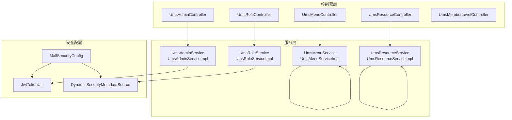
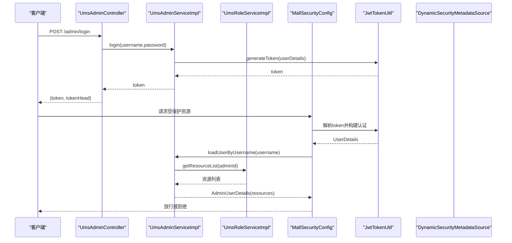
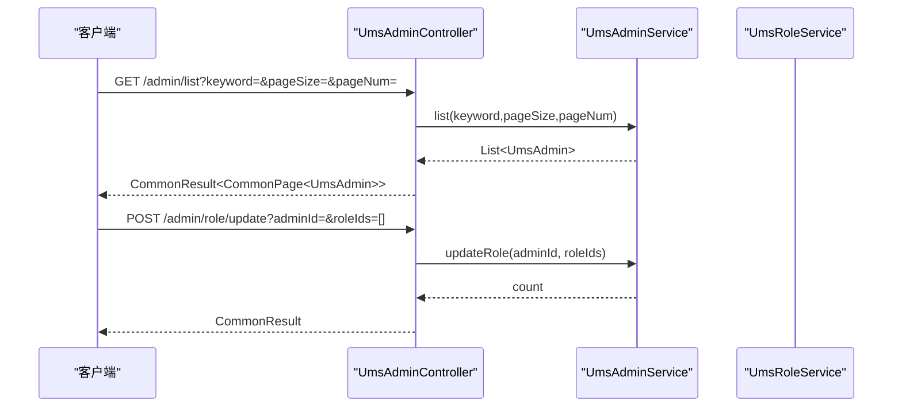
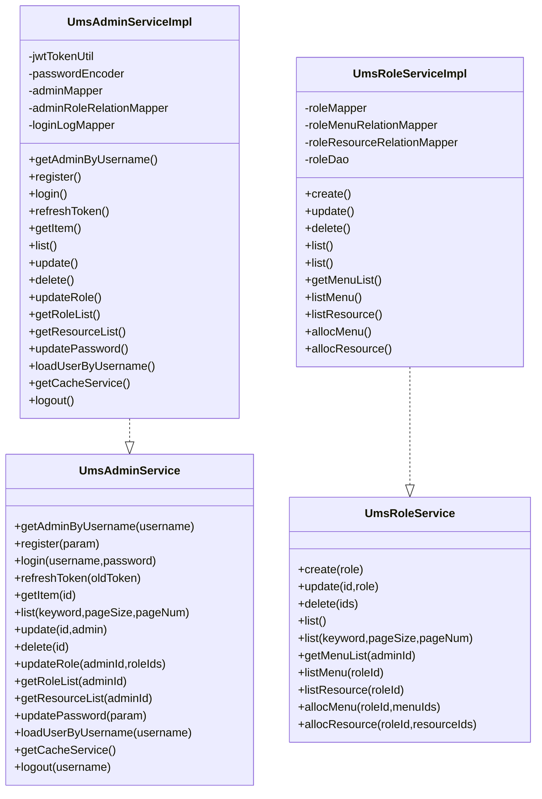
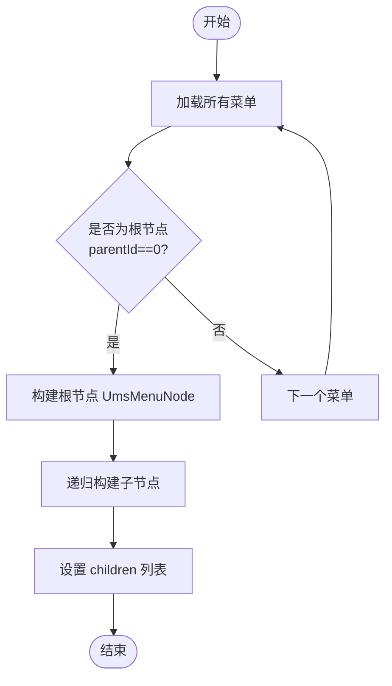
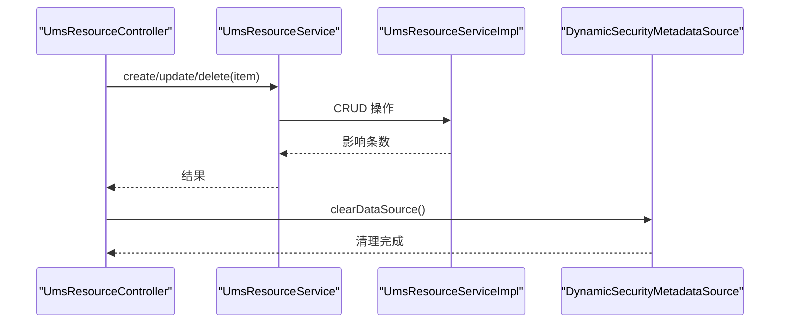
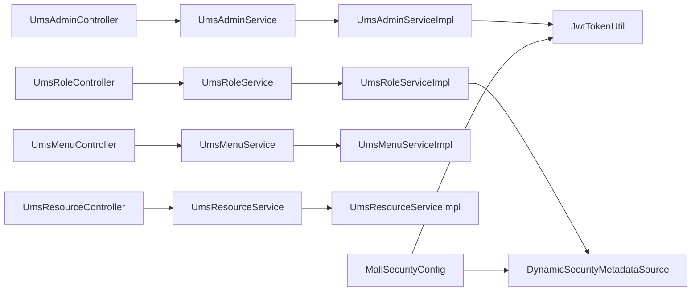

# 用户权限系统

<cite>
**本文引用的文件**
- [UmsAdminController.java](file://mall-admin/src/main/java/com/macro/mall/controller/UmsAdminController.java)
- [UmsAdminService.java](file://mall-admin/src/main/java/com/macro/mall/service/UmsAdminService.java)
- [UmsAdminServiceImpl.java](file://mall-admin/src/main/java/com/macro/mall/service/impl/UmsAdminServiceImpl.java)
- [UmsRoleService.java](file://mall-admin/src/main/java/com/macro/mall/service/UmsRoleService.java)
- [UmsRoleServiceImpl.java](file://mall-admin/src/main/java/com/macro/mall/service/impl/UmsRoleServiceImpl.java)
- [UmsMenuService.java](file://mall-admin/src/main/java/com/macro/mall/service/UmsMenuService.java)
- [UmsMenuServiceImpl.java](file://mall-admin/src/main/java/com/macro/mall/service/impl/UmsMenuServiceImpl.java)
- [UmsResourceService.java](file://mall-admin/src/main/java/com/macro/mall/service/UmsResourceService.java)
- [UmsResourceServiceImpl.java](file://mall-admin/src/main/java/com/macro/mall/service/impl/UmsResourceServiceImpl.java)
- [UmsRoleController.java](file://mall-admin/src/main/java/com/macro/mall/controller/UmsRoleController.java)
- [UmsMenuController.java](file://mall-admin/src/main/java/com/macro/mall/controller/UmsMenuController.java)
- [UmsResourceController.java](file://mall-admin/src/main/java/com/macro/mall/controller/UmsResourceController.java)
- [UmsAdminParam.java](file://mall-admin/src/main/java/com/macro/mall/dto/UmsAdminParam.java)
- [UpdateAdminPasswordParam.java](file://mall-admin/src/main/java/com/macro/mall/dto/UpdateAdminPasswordParam.java)
- [UmsMenuNode.java](file://mall-admin/src/main/java/com/macro/mall/dto/UmsMenuNode.java)
- [UmsMemberLevelController.java](file://mall-admin/src/main/java/com/macro/mall/controller/UmsMemberLevelController.java)
- [UmsMemberLevelService.java](file://mall-admin/src/main/java/com/macro/mall/service/UmsMemberLevelService.java)
- [DynamicSecurityMetadataSource.java](file://mall-security/src/main/java/com/macro/mall/security/component/DynamicSecurityMetadataSource.java)
- [JwtTokenUtil.java](file://mall-security/src/main/java/com/macro/mall/security/util/JwtTokenUtil.java)
- [MallSecurityConfig.java](file://mall-admin/src/main/java/com/macro/mall/config/MallSecurityConfig.java)
</cite>

## 目录
1. [简介](#简介)
2. [项目结构](#项目结构)
3. [核心组件](#核心组件)
4. [架构总览](#架构总览)
5. [详细组件分析](#详细组件分析)
6. [依赖分析](#依赖分析)
7. [性能考虑](#性能考虑)
8. [故障排查指南](#故障排查指南)
9. [结论](#结论)
10. [附录：API 接口文档](#附录api-接口文档)

## 简介
本文件面向“用户权限系统”的全面技术文档，聚焦于后台管理员、角色、菜单、资源以及会员等级等模块，系统性阐述以下内容：
- 控制器层：UmsAdminController 的 RESTful 接口设计与职责边界
- 服务层：RBAC 权限模型、菜单树形结构、资源权限控制的业务逻辑
- DTO 设计：管理员参数、菜单节点、权限资源等数据传输对象
- 安全配置：基于 JWT 的认证与动态权限元数据源
- API 文档：完整的权限管理接口清单与使用说明

## 项目结构
权限系统主要位于 mall-admin 模块，采用典型的分层架构：
- 控制器层（controller）：对外暴露 RESTful 接口
- 服务层（service/impl）：封装业务逻辑与事务控制
- 数据传输对象（dto）：参数校验与跨层数据封装
- 安全配置（security/config）：JWT 认证与动态权限过滤

图表来源
- [UmsAdminController.java:1-192](file://mall-admin/src/main/java/com/macro/mall/controller/UmsAdminController.java#L1-L192)
- [UmsRoleController.java:1-112](file://mall-admin/src/main/java/com/macro/mall/controller/UmsRoleController.java#L1-L112)
- [UmsMenuController.java:1-95](file://mall-admin/src/main/java/com/macro/mall/controller/UmsMenuController.java#L1-L95)
- [UmsResourceController.java:1-91](file://mall-admin/src/main/java/com/macro/mall/controller/UmsResourceController.java#L1-L91)
- [UmsAdminService.java:1-99](file://mall-admin/src/main/java/com/macro/mall/service/UmsAdminService.java#L1-L99)
- [UmsAdminServiceImpl.java:1-288](file://mall-admin/src/main/java/com/macro/mall/service/impl/UmsAdminServiceImpl.java#L1-L288)
- [UmsRoleService.java:1-67](file://mall-admin/src/main/java/com/macro/mall/service/UmsRoleService.java#L1-L67)
- [UmsRoleServiceImpl.java:1-120](file://mall-admin/src/main/java/com/macro/mall/service/impl/UmsRoleServiceImpl.java#L1-L120)
- [UmsMenuService.java:1-48](file://mall-admin/src/main/java/com/macro/mall/service/UmsMenuService.java#L1-L48)
- [UmsMenuServiceImpl.java:1-107](file://mall-admin/src/main/java/com/macro/mall/service/impl/UmsMenuServiceImpl.java#L1-L107)
- [UmsResourceService.java:1-42](file://mall-admin/src/main/java/com/macro/mall/service/UmsResourceService.java#L1-L42)
- [UmsResourceServiceImpl.java:1-74](file://mall-admin/src/main/java/com/macro/mall/service/impl/UmsResourceServiceImpl.java#L1-L74)
- [MallSecurityConfig.java](file://mall-admin/src/main/java/com/macro/mall/config/MallSecurityConfig.java)
- [JwtTokenUtil.java](file://mall-security/src/main/java/com/macro/mall/security/util/JwtTokenUtil.java)
- [DynamicSecurityMetadataSource.java](file://mall-security/src/main/java/com/macro/mall/security/component/DynamicSecurityMetadataSource.java)

章节来源
- [UmsAdminController.java:1-192](file://mall-admin/src/main/java/com/macro/mall/controller/UmsAdminController.java#L1-L192)
- [UmsAdminService.java:1-99](file://mall-admin/src/main/java/com/macro/mall/service/UmsAdminService.java#L1-L99)
- [UmsAdminServiceImpl.java:1-288](file://mall-admin/src/main/java/com/macro/mall/service/impl/UmsAdminServiceImpl.java#L1-L288)

## 核心组件
- 管理员管理：提供注册、登录、刷新令牌、获取用户信息、登出、列表查询、单个查询、更新、删除、启用/禁用、修改密码、角色分配与查看等功能
- 角色管理：提供角色的增删改查、状态变更、菜单与资源授权
- 菜单管理：提供菜单的增删改查、分页查询、树形结构返回、显示状态切换
- 资源管理：提供资源的增删改查、分页查询、全量查询，并在资源变更后清理动态权限元数据缓存
- 会员等级：提供会员等级列表查询
- DTO：UmsAdminParam、UpdateAdminPasswordParam、UmsMenuNode 等用于参数校验与跨层数据封装

章节来源
- [UmsAdminController.java:108-191](file://mall-admin/src/main/java/com/macro/mall/controller/UmsAdminController.java#L108-L191)
- [UmsRoleController.java:25-110](file://mall-admin/src/main/java/com/macro/mall/controller/UmsRoleController.java#L25-L110)
- [UmsMenuController.java:27-93](file://mall-admin/src/main/java/com/macro/mall/controller/UmsMenuController.java#L27-L93)
- [UmsResourceController.java:29-90](file://mall-admin/src/main/java/com/macro/mall/controller/UmsResourceController.java#L29-L90)
- [UmsMemberLevelController.java:27-32](file://mall-admin/src/main/java/com/macro/mall/controller/UmsMemberLevelController.java#L27-L32)
- [UmsAdminParam.java:1-26](file://mall-admin/src/main/java/com/macro/mall/dto/UmsAdminParam.java#L1-L26)
- [UpdateAdminPasswordParam.java:1-22](file://mall-admin/src/main/java/com/macro/mall/dto/UpdateAdminPasswordParam.java#L1-L22)
- [UmsMenuNode.java:1-18](file://mall-admin/src/main/java/com/macro/mall/dto/UmsMenuNode.java#L1-L18)

## 架构总览
权限系统采用 RBAC（基于角色的访问控制）模型，结合 JWT 实现认证与鉴权：
- 认证：登录成功后签发 JWT，后续请求通过拦截器解析并注入认证上下文
- 授权：根据用户的角色加载其可访问的资源集合，动态权限元数据源按需刷新
- 缓存：用户与资源列表缓存减少数据库压力，支持失效策略

图表来源
- [UmsAdminController.java:54-65](file://mall-admin/src/main/java/com/macro/mall/controller/UmsAdminController.java#L54-L65)
- [UmsAdminServiceImpl.java:98-119](file://mall-admin/src/main/java/com/macro/mall/service/impl/UmsAdminServiceImpl.java#L98-L119)
- [MallSecurityConfig.java](file://mall-admin/src/main/java/com/macro/mall/config/MallSecurityConfig.java)
- [JwtTokenUtil.java](file://mall-security/src/main/java/com/macro/mall/security/util/JwtTokenUtil.java)
- [UmsAdminServiceImpl.java:225-239](file://mall-admin/src/main/java/com/macro/mall/service/impl/UmsAdminServiceImpl.java#L225-L239)
- [UmsRoleServiceImpl.java:82-85](file://mall-admin/src/main/java/com/macro/mall/service/impl/UmsRoleServiceImpl.java#L82-L85)
- [DynamicSecurityMetadataSource.java](file://mall-security/src/main/java/com/macro/mall/security/component/DynamicSecurityMetadataSource.java)

## 详细组件分析

### 控制器层：UmsAdminController
- 职责：提供管理员相关的 RESTful 接口，包括注册、登录、刷新令牌、获取用户信息、登出、列表查询、单个查询、更新、删除、启用/禁用、修改密码、角色分配与查看
- 关键点：
  - 使用 CommonResult 统一响应包装
  - 使用 @Validated 对 DTO 进行参数校验
  - 通过 UmsAdminService 和 UmsRoleService 协作完成业务处理
  - 返回菜单树与角色列表给前端渲染

图表来源
- [UmsAdminController.java:108-191](file://mall-admin/src/main/java/com/macro/mall/controller/UmsAdminController.java#L108-L191)
- [UmsAdminService.java:50-71](file://mall-admin/src/main/java/com/macro/mall/service/UmsAdminService.java#L50-L71)
- [UmsRoleService.java:58-65](file://mall-admin/src/main/java/com/macro/mall/service/UmsRoleService.java#L58-L65)

章节来源
- [UmsAdminController.java:44-191](file://mall-admin/src/main/java/com/macro/mall/controller/UmsAdminController.java#L44-L191)

### 服务层：RBAC 权限模型与业务逻辑
- 管理员服务（UmsAdminServiceImpl）
  - 认证与授权：登录校验、JWT 生成、用户详情加载、资源列表缓存
  - 密码管理：参数校验、旧密码验证、新密码加密存储
  - 角色关系：删除旧关系、批量插入新关系，清理缓存
  - 缓存策略：管理员信息与资源列表缓存，失效时主动清除
- 角色服务（UmsRoleServiceImpl）
  - 菜单与资源授权：先删除旧关系，再批量插入新关系
  - 资源变更后清理相关缓存，确保权限生效
- 菜单服务（UmsMenuServiceImpl）
  - 层级计算：根据父级 ID 自动计算 level
  - 树形结构：将平面菜单列表转为父子嵌套结构
- 资源服务（UmsResourceServiceImpl）
  - 资源 CRUD 与分页查询
  - 变更后清理缓存，触发动态权限元数据刷新

图表来源
- [UmsAdminService.java:17-98](file://mall-admin/src/main/java/com/macro/mall/service/UmsAdminService.java#L17-L98)
- [UmsAdminServiceImpl.java:44-288](file://mall-admin/src/main/java/com/macro/mall/service/impl/UmsAdminServiceImpl.java#L44-L288)
- [UmsRoleService.java:14-66](file://mall-admin/src/main/java/com/macro/mall/service/UmsRoleService.java#L14-L66)
- [UmsRoleServiceImpl.java:22-120](file://mall-admin/src/main/java/com/macro/mall/service/impl/UmsRoleServiceImpl.java#L22-L120)

章节来源
- [UmsAdminServiceImpl.java:60-288](file://mall-admin/src/main/java/com/macro/mall/service/impl/UmsAdminServiceImpl.java#L60-L288)
- [UmsRoleServiceImpl.java:34-120](file://mall-admin/src/main/java/com/macro/mall/service/impl/UmsRoleServiceImpl.java#L34-L120)
- [UmsMenuServiceImpl.java:25-107](file://mall-admin/src/main/java/com/macro/mall/service/impl/UmsMenuServiceImpl.java#L25-L107)
- [UmsResourceServiceImpl.java:26-74](file://mall-admin/src/main/java/com/macro/mall/service/impl/UmsResourceServiceImpl.java#L26-L74)

### 菜单树形结构算法
- 输入：平面的 UmsMenu 列表
- 输出：以 parentId=0 的节点为根的树形结构 UmsMenuNode
- 处理流程：筛选根节点，递归构建子节点 children

图表来源
- [UmsMenuServiceImpl.java:77-105](file://mall-admin/src/main/java/com/macro/mall/service/impl/UmsMenuServiceImpl.java#L77-L105)
- [UmsMenuNode.java:15-17](file://mall-admin/src/main/java/com/macro/mall/dto/UmsMenuNode.java#L15-L17)

章节来源
- [UmsMenuServiceImpl.java:77-105](file://mall-admin/src/main/java/com/macro/mall/service/impl/UmsMenuServiceImpl.java#L77-L105)

### 资源权限控制与动态元数据
- 资源变更后，控制器调用动态权限元数据源清理缓存，确保下次请求重新加载最新权限规则
- 安全配置通过 MallSecurityConfig 集成 JWT 与动态权限过滤

图表来源
- [UmsResourceController.java:33-65](file://mall-admin/src/main/java/com/macro/mall/controller/UmsResourceController.java#L33-L65)
- [UmsResourceServiceImpl.java:36-49](file://mall-admin/src/main/java/com/macro/mall/service/impl/UmsResourceServiceImpl.java#L36-L49)
- [DynamicSecurityMetadataSource.java](file://mall-security/src/main/java/com/macro/mall/security/component/DynamicSecurityMetadataSource.java)

章节来源
- [UmsResourceController.java:29-90](file://mall-admin/src/main/java/com/macro/mall/controller/UmsResourceController.java#L29-L90)

### DTO 设计
- UmsAdminParam：管理员注册参数，包含用户名、密码、头像、邮箱、昵称、备注等字段，并进行非空与邮箱格式校验
- UpdateAdminPasswordParam：修改密码参数，包含用户名、旧密码、新密码，均要求非空
- UmsMenuNode：菜单树节点，继承 UmsMenu 并扩展 children 字段，用于树形渲染

章节来源
- [UmsAdminParam.java:15-25](file://mall-admin/src/main/java/com/macro/mall/dto/UmsAdminParam.java#L15-L25)
- [UpdateAdminPasswordParam.java:14-21](file://mall-admin/src/main/java/com/macro/mall/dto/UpdateAdminPasswordParam.java#L14-L21)
- [UmsMenuNode.java:15-17](file://mall-admin/src/main/java/com/macro/mall/dto/UmsMenuNode.java#L15-L17)

## 依赖分析
- 控制器依赖服务接口，服务实现依赖 Mapper/DAO 与工具类（如 JWT、密码编码器）
- 动态权限元数据源与安全配置共同保证权限生效
- 资源变更链路：控制器 -> 服务 -> 元数据源清理，避免脏缓存导致权限不一致

图表来源
- [UmsAdminController.java:39-42](file://mall-admin/src/main/java/com/macro/mall/controller/UmsAdminController.java#L39-L42)
- [UmsRoleController.java:22-23](file://mall-admin/src/main/java/com/macro/mall/controller/UmsRoleController.java#L22-L23)
- [UmsMenuController.java:24-25](file://mall-admin/src/main/java/com/macro/mall/controller/UmsMenuController.java#L24-L25)
- [UmsResourceController.java:24-27](file://mall-admin/src/main/java/com/macro/mall/controller/UmsResourceController.java#L24-L27)
- [UmsAdminServiceImpl.java:48-58](file://mall-admin/src/main/java/com/macro/mall/service/impl/UmsAdminServiceImpl.java#L48-L58)
- [UmsRoleServiceImpl.java:25-33](file://mall-admin/src/main/java/com/macro/mall/service/impl/UmsRoleServiceImpl.java#L25-L33)
- [UmsMenuServiceImpl.java:22-23](file://mall-admin/src/main/java/com/macro/mall/service/impl/UmsMenuServiceImpl.java#L22-L23)
- [UmsResourceServiceImpl.java:23-25](file://mall-admin/src/main/java/com/macro/mall/service/impl/UmsResourceServiceImpl.java#L23-L25)
- [MallSecurityConfig.java](file://mall-admin/src/main/java/com/macro/mall/config/MallSecurityConfig.java)
- [JwtTokenUtil.java](file://mall-security/src/main/java/com/macro/mall/security/util/JwtTokenUtil.java)
- [DynamicSecurityMetadataSource.java](file://mall-security/src/main/java/com/macro/mall/security/component/DynamicSecurityMetadataSource.java)

章节来源
- [UmsAdminServiceImpl.java:48-58](file://mall-admin/src/main/java/com/macro/mall/service/impl/UmsAdminServiceImpl.java#L48-L58)
- [UmsRoleServiceImpl.java:25-33](file://mall-admin/src/main/java/com/macro/mall/service/impl/UmsRoleServiceImpl.java#L25-L33)
- [UmsMenuServiceImpl.java:22-23](file://mall-admin/src/main/java/com/macro/mall/service/impl/UmsMenuServiceImpl.java#L22-L23)
- [UmsResourceServiceImpl.java:23-25](file://mall-admin/src/main/java/com/macro/mall/service/impl/UmsResourceServiceImpl.java#L23-L25)

## 性能考虑
- 缓存策略：管理员与资源列表缓存减少数据库查询；角色与资源变更后主动清理缓存，避免脏读
- 分页查询：列表接口统一使用分页插件，降低一次性数据量
- 密码处理：仅对新密码进行加密，避免重复加密带来的开销
- 动态权限：资源变更后清理元数据缓存，确保权限即时生效但可能带来额外的首次请求延迟

## 故障排查指南
- 登录失败
  - 检查用户名是否存在与密码是否匹配
  - 确认账户未被禁用
  - 查看日志定位认证异常
- 修改密码失败
  - 参数为空或不合法会返回相应状态码
  - 用户不存在或旧密码错误会返回对应提示
- 权限不生效
  - 资源或角色变更后需等待缓存清理或触发元数据刷新
  - 检查动态权限元数据源是否正常工作
- 菜单树异常
  - 父级 ID 与层级计算逻辑需保持一致，避免出现环或层级错误

章节来源
- [UmsAdminServiceImpl.java:242-262](file://mall-admin/src/main/java/com/macro/mall/service/impl/UmsAdminServiceImpl.java#L242-L262)
- [UmsResourceController.java:33-65](file://mall-admin/src/main/java/com/macro/mall/controller/UmsResourceController.java#L33-L65)
- [UmsMenuServiceImpl.java:35-48](file://mall-admin/src/main/java/com/macro/mall/service/impl/UmsMenuServiceImpl.java#L35-L48)

## 结论
本权限系统以 RBAC 为核心，结合 JWT 认证与动态权限元数据，实现了管理员、角色、菜单、资源的全链路管理能力。通过缓存与分页优化，兼顾了可用性与性能；通过严格的 DTO 校验与错误码返回，提升了系统的健壮性与可维护性。

## 附录：API 接口文档

### 管理员管理（/admin）
- 注册
  - 方法：POST
  - 路径：/admin/register
  - 请求体：UmsAdminParam
  - 响应：CommonResult<UmsAdmin>
- 登录
  - 方法：POST
  - 路径：/admin/login
  - 请求体：UmsAdminLoginParam
  - 响应：CommonResult<{token, tokenHead}>
- 刷新令牌
  - 方法：GET
  - 路径：/admin/refreshToken
  - 请求头：tokenHeader
  - 响应：CommonResult<{token, tokenHead}>
- 获取用户信息
  - 方法：GET
  - 路径：/admin/info
  - 认证：基于 Principal
  - 响应：CommonResult<{username, menus, icon, roles}>
- 登出
  - 方法：POST
  - 路径：/admin/logout
  - 认证：基于 Principal
  - 响应：CommonResult
- 管理员列表
  - 方法：GET
  - 路径：/admin/list
  - 查询参数：keyword、pageSize、pageNum
  - 响应：CommonResult<CommonPage<UmsAdmin>>
- 获取单个管理员
  - 方法：GET
  - 路径：/admin/{id}
  - 响应：CommonResult<UmsAdmin>
- 更新管理员
  - 方法：POST
  - 路径：/admin/update/{id}
  - 请求体：UmsAdmin
  - 响应：CommonResult<int>
- 修改密码
  - 方法：POST
  - 路径：/admin/updatePassword
  - 请求体：UpdateAdminPasswordParam
  - 响应：CommonResult<int>（状态码语义见实现）
- 删除管理员
  - 方法：POST
  - 路径：/admin/delete/{id}
  - 响应：CommonResult<int>
- 启用/禁用管理员
  - 方法：POST
  - 路径：/admin/updateStatus/{id}
  - 查询参数：status
  - 响应：CommonResult<int>
- 分配角色
  - 方法：POST
  - 路径：/admin/role/update
  - 查询参数：adminId、roleIds
  - 响应：CommonResult<int>
- 获取管理员角色
  - 方法：GET
  - 路径：/admin/role/{adminId}
  - 响应：CommonResult<List<UmsRole>>

章节来源
- [UmsAdminController.java:44-191](file://mall-admin/src/main/java/com/macro/mall/controller/UmsAdminController.java#L44-L191)

### 角色管理（/role）
- 新增角色
  - 方法：POST
  - 路径：/role/create
  - 请求体：UmsRole
  - 响应：CommonResult<int>
- 修改角色
  - 方法：POST
  - 路径：/role/update/{id}
  - 请求体：UmsRole
  - 响应：CommonResult<int>
- 删除角色
  - 方法：POST
  - 路径：/role/delete
  - 查询参数：ids
  - 响应：CommonResult<int>
- 获取全部角色
  - 方法：GET
  - 路径：/role/listAll
  - 响应：CommonResult<List<UmsRole>>
- 分页查询角色
  - 方法：GET
  - 路径：/role/list
  - 查询参数：keyword、pageSize、pageNum
  - 响应：CommonResult<CommonPage<UmsRole>>
- 启用/禁用角色
  - 方法：POST
  - 路径：/role/updateStatus/{id}
  - 查询参数：status
  - 响应：CommonResult<int>
- 获取角色菜单
  - 方法：GET
  - 路径：/role/listMenu/{roleId}
  - 响应：CommonResult<List<UmsMenu>>
- 获取角色资源
  - 方法：GET
  - 路径：/role/listResource/{roleId}
  - 响应：CommonResult<List<UmsResource>>
- 分配菜单
  - 方法：POST
  - 路径：/role/allocMenu
  - 查询参数：roleId、menuIds
  - 响应：CommonResult<int>
- 分配资源
  - 方法：POST
  - 路径：/role/allocResource
  - 查询参数：roleId、resourceIds
  - 响应：CommonResult<int>

章节来源
- [UmsRoleController.java:25-110](file://mall-admin/src/main/java/com/macro/mall/controller/UmsRoleController.java#L25-L110)

### 菜单管理（/menu）
- 新增菜单
  - 方法：POST
  - 路径：/menu/create
  - 请求体：UmsMenu
  - 响应：CommonResult<int>
- 修改菜单
  - 方法：POST
  - 路径：/menu/update/{id}
  - 请求体：UmsMenu
  - 响应：CommonResult<int>
- 获取菜单
  - 方法：GET
  - 路径：/menu/{id}
  - 响应：CommonResult<UmsMenu>
- 删除菜单
  - 方法：POST
  - 路径：/menu/delete/{id}
  - 响应：CommonResult<int>
- 分页查询菜单
  - 方法：GET
  - 路径：/menu/list/{parentId}
  - 查询参数：pageSize、pageNum
  - 响应：CommonResult<CommonPage<UmsMenu>>
- 菜单树形列表
  - 方法：GET
  - 路径：/menu/treeList
  - 响应：CommonResult<List<UmsMenuNode>>
- 更新显示状态
  - 方法：POST
  - 路径：/menu/updateHidden/{id}
  - 查询参数：hidden
  - 响应：CommonResult<int>

章节来源
- [UmsMenuController.java:27-93](file://mall-admin/src/main/java/com/macro/mall/controller/UmsMenuController.java#L27-L93)

### 资源管理（/resource）
- 新增资源
  - 方法：POST
  - 路径：/resource/create
  - 请求体：UmsResource
  - 响应：CommonResult<int>
- 修改资源
  - 方法：POST
  - 路径：/resource/update/{id}
  - 请求体：UmsResource
  - 响应：CommonResult<int>
- 获取资源
  - 方法：GET
  - 路径：/resource/{id}
  - 响应：CommonResult<UmsResource>
- 删除资源
  - 方法：POST
  - 路径：/resource/delete/{id}
  - 响应：CommonResult<int>
- 分页查询资源
  - 方法：GET
  - 路径：/resource/list
  - 查询参数：categoryId、nameKeyword、urlKeyword、pageSize、pageNum
  - 响应：CommonResult<CommonPage<UmsResource>>
- 获取全部资源
  - 方法：GET
  - 路径：/resource/listAll
  - 响应：CommonResult<List<UmsResource>>

章节来源
- [UmsResourceController.java:29-90](file://mall-admin/src/main/java/com/macro/mall/controller/UmsResourceController.java#L29-L90)

### 会员等级（/memberLevel）
- 获取会员等级列表
  - 方法：GET
  - 路径：/memberLevel/list
  - 查询参数：defaultStatus
  - 响应：CommonResult<List<UmsMemberLevel>>

章节来源
- [UmsMemberLevelController.java:27-32](file://mall-admin/src/main/java/com/macro/mall/controller/UmsMemberLevelController.java#L27-L32)