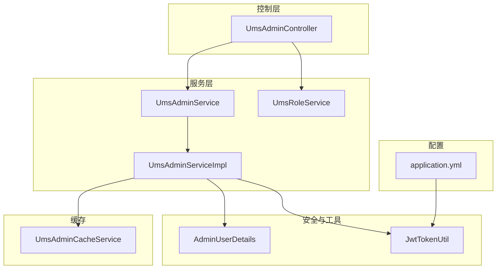
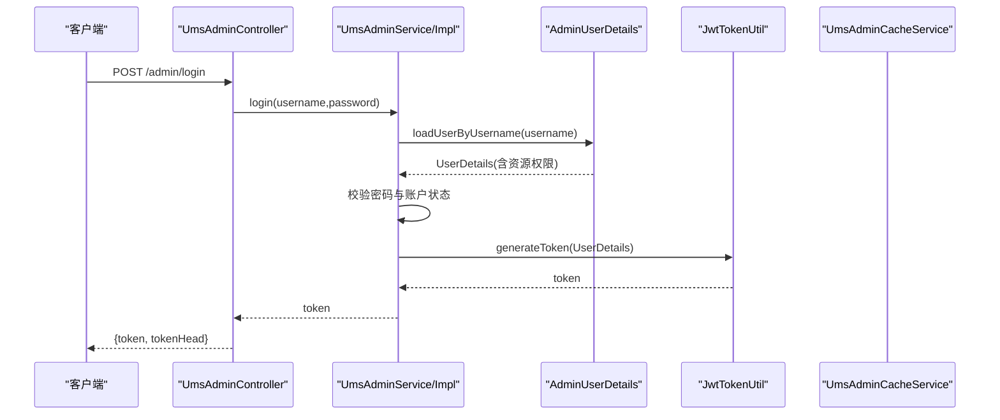
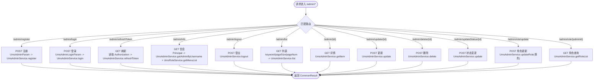
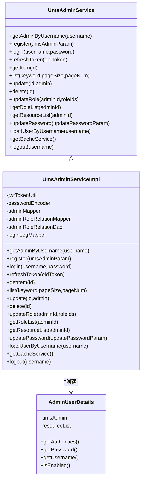
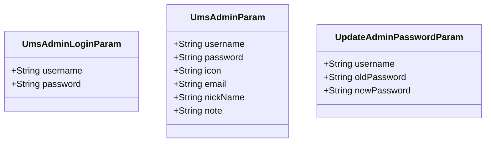
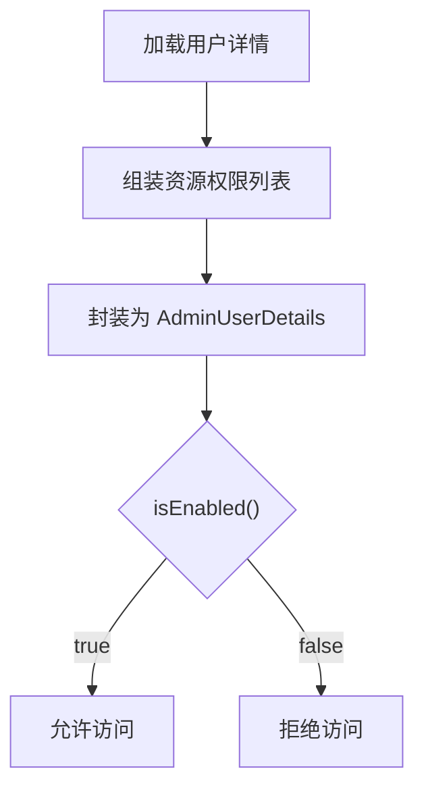
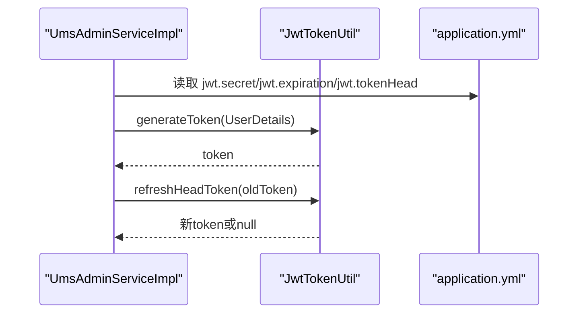
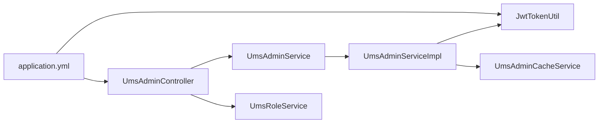

# 管理员管理

<cite>
**本文引用的文件**
- [UmsAdminController.java](file://mall-admin/src/main/java/com/macro/mall/controller/UmsAdminController.java)
- [UmsAdminService.java](file://mall-admin/src/main/java/com/macro/mall/service/UmsAdminService.java)
- [UmsAdminServiceImpl.java](file://mall-admin/src/main/java/com/macro/mall/service/impl/UmsAdminServiceImpl.java)
- [UmsAdminLoginParam.java](file://mall-admin/src/main/java/com/macro/mall/dto/UmsAdminLoginParam.java)
- [UmsAdminParam.java](file://mall-admin/src/main/java/com/macro/mall/dto/UmsAdminParam.java)
- [UpdateAdminPasswordParam.java](file://mall-admin/src/main/java/com/macro/mall/dto/UpdateAdminPasswordParam.java)
- [AdminUserDetails.java](file://mall-admin/src/main/java/com/macro/mall/bo/AdminUserDetails.java)
- [JwtTokenUtil.java](file://mall-security/src/main/java/com/macro/mall/security/util/JwtTokenUtil.java)
- [application.yml](file://mall-admin/src/main/resources/application.yml)
- [UmsAdminCacheService.java](file://mall-admin/src/main/java/com/macro/mall/service/UmsAdminCacheService.java)
- [UmsRoleService.java](file://mall-admin/src/main/java/com/macro/mall/service/UmsRoleService.java)
</cite>

## 目录
1. [简介](#简介)
2. [项目结构](#项目结构)
3. [核心组件](#核心组件)
4. [架构总览](#架构总览)
5. [详细组件分析](#详细组件分析)
6. [依赖分析](#依赖分析)
7. [性能考虑](#性能考虑)
8. [故障排查指南](#故障排查指南)
9. [结论](#结论)
10. [附录](#附录)

## 简介
本文件面向管理员管理模块，围绕 UmsAdminController 控制器与 UmsAdminService 服务层展开，系统性梳理以下能力：
- 管理员注册、登录认证、令牌刷新、信息获取、登出、密码更新、状态管理、删除与角色管理
- 服务层的密码加密存储、JWT 令牌生成与刷新、权限验证、管理员状态管理
- DTO 设计（登录参数、注册参数、密码更新参数）
- 完整的管理员管理 API 接口文档（请求参数、响应格式、错误处理与使用示例）

## 项目结构
管理员管理模块位于 mall-admin 工程中，采用典型的分层架构：
- 控制层：UmsAdminController 提供 RESTful 接口
- 服务层：UmsAdminService 及其实现 UmsAdminServiceImpl 负责业务逻辑
- 数据传输对象：dto 包下的登录、注册、密码更新参数
- 安全与鉴权：基于 Spring Security 的 UserDetails 实现 AdminUserDetails，结合 JWT 工具 JwtTokenUtil
- 配置：application.yml 中包含 JWT、Redis 缓存、安全白名单等配置

**图表来源**
- [UmsAdminController.java:34-191](file://mall-admin/src/main/java/com/macro/mall/controller/UmsAdminController.java#L34-L191)
- [UmsAdminService.java:17-98](file://mall-admin/src/main/java/com/macro/mall/service/UmsAdminService.java#L17-L98)
- [UmsAdminServiceImpl.java:44-287](file://mall-admin/src/main/java/com/macro/mall/service/impl/UmsAdminServiceImpl.java#L44-L287)
- [AdminUserDetails.java:17-65](file://mall-admin/src/main/java/com/macro/mall/bo/AdminUserDetails.java#L17-L65)
- [JwtTokenUtil.java:31-181](file://mall-security/src/main/java/com/macro/mall/security/util/JwtTokenUtil.java#L31-L181)
- [application.yml:20-33](file://mall-admin/src/main/resources/application.yml#L20-L33)
- [UmsRoleService.java:14-66](file://mall-admin/src/main/java/com/macro/mall/service/UmsRoleService.java#L14-L66)
- [UmsAdminCacheService.java:12-57](file://mall-admin/src/main/java/com/macro/mall/service/UmsAdminCacheService.java#L12-L57)

**章节来源**
- [UmsAdminController.java:34-191](file://mall-admin/src/main/java/com/macro/mall/controller/UmsAdminController.java#L34-L191)
- [application.yml:20-33](file://mall-admin/src/main/resources/application.yml#L20-L33)

## 核心组件
- 控制器 UmsAdminController：暴露 /admin 前缀的 RESTful 接口，涵盖注册、登录、刷新、信息、登出、列表、详情、更新、删除、状态变更、角色分配与查询等
- 服务接口 UmsAdminService：定义管理员相关业务契约，包括登录、注册、令牌刷新、密码更新、角色关系维护、资源列表获取等
- 服务实现 UmsAdminServiceImpl：具体业务逻辑，含密码加密、JWT 生成、登录日志、缓存清理、角色与资源缓存管理
- DTO：UmsAdminLoginParam、UmsAdminParam、UpdateAdminPasswordParam，分别用于登录、注册、密码更新
- 安全主体 AdminUserDetails：实现 UserDetails，封装管理员与资源权限，启用状态由管理员状态字段决定
- JWT 工具 JwtTokenUtil：生成、解析、校验与刷新 JWT
- 配置 application.yml：JWT 密钥、过期时间、token 头部、Redis 缓存键与过期时间、安全白名单

**章节来源**
- [UmsAdminService.java:17-98](file://mall-admin/src/main/java/com/macro/mall/service/UmsAdminService.java#L17-L98)
- [UmsAdminServiceImpl.java:44-287](file://mall-admin/src/main/java/com/macro/mall/service/impl/UmsAdminServiceImpl.java#L44-L287)
- [UmsAdminLoginParam.java:14-19](file://mall-admin/src/main/java/com/macro/mall/dto/UmsAdminLoginParam.java#L14-L19)
- [UmsAdminParam.java:15-25](file://mall-admin/src/main/java/com/macro/mall/dto/UmsAdminParam.java#L15-L25)
- [UpdateAdminPasswordParam.java:14-21](file://mall-admin/src/main/java/com/macro/mall/dto/UpdateAdminPasswordParam.java#L14-L21)
- [AdminUserDetails.java:17-65](file://mall-admin/src/main/java/com/macro/mall/bo/AdminUserDetails.java#L17-L65)
- [JwtTokenUtil.java:31-181](file://mall-security/src/main/java/com/macro/mall/security/util/JwtTokenUtil.java#L31-L181)
- [application.yml:20-33](file://mall-admin/src/main/resources/application.yml#L20-L33)

## 架构总览
管理员管理模块遵循“控制器-服务-数据访问”的分层设计，配合 Spring Security 与 JWT 实现认证与授权；通过 UmsAdminCacheService 缓存管理员与资源列表，提升读取性能。

**图表来源**
- [UmsAdminController.java:54-65](file://mall-admin/src/main/java/com/macro/mall/controller/UmsAdminController.java#L54-L65)
- [UmsAdminServiceImpl.java:98-119](file://mall-admin/src/main/java/com/macro/mall/service/impl/UmsAdminServiceImpl.java#L98-L119)
- [AdminUserDetails.java:23-26](file://mall-admin/src/main/java/com/macro/mall/bo/AdminUserDetails.java#L23-L26)
- [JwtTokenUtil.java:128-133](file://mall-security/src/main/java/com/macro/mall/security/util/JwtTokenUtil.java#L128-L133)

## 详细组件分析

### 控制器：UmsAdminController
- 路径前缀：/admin
- 主要接口与行为
  - 注册：POST /admin/register，接收 UmsAdminParam，调用服务注册并返回 UmsAdmin
  - 登录：POST /admin/login，接收 UmsAdminLoginParam，返回 token 与 tokenHead
  - 刷新：GET /admin/refreshToken，从请求头读取 Authorization，调用服务刷新 token
  - 信息：GET /admin/info，基于 Principal 获取当前用户信息（用户名、菜单、头像、角色），返回 CommonResult
  - 登出：POST /admin/logout，清理缓存并返回成功
  - 列表：GET /admin/list，支持 keyword、pageSize、pageNum 查询
  - 详情：GET /admin/{id}，按主键查询
  - 更新：POST /admin/update/{id}，接收 UmsAdmin 对象，处理密码加密与缓存清理
  - 删除：POST /admin/delete/{id}
  - 状态变更：POST /admin/updateStatus/{id}?status=...
  - 角色更新：POST /admin/role/update?adminId=&roleIds=...，事务性更新管理员角色关系
  - 角色查询：GET /admin/role/{adminId}

**图表来源**
- [UmsAdminController.java:44-191](file://mall-admin/src/main/java/com/macro/mall/controller/UmsAdminController.java#L44-L191)

**章节来源**
- [UmsAdminController.java:44-191](file://mall-admin/src/main/java/com/macro/mall/controller/UmsAdminController.java#L44-L191)

### 服务接口与实现：UmsAdminService 与 UmsAdminServiceImpl
- 关键方法与职责
  - getAdminByUsername：优先从缓存获取，不存在则查询数据库并写入缓存
  - register：去重检查、密码加密、插入数据库
  - login：加载用户详情、校验密码与启用状态、生成 JWT、记录登录日志
  - refreshToken：委托 JwtTokenUtil 刷新带 tokenHead 的 token
  - updatePassword：参数校验、查用户、校验旧密码、加密新密码、更新并清理缓存
  - updateRole：事务性删除旧关系并批量插入新关系，清理资源缓存
  - getResourceList：优先缓存，缺失则查询数据库并写入缓存
  - loadUserByUsername：组合管理员与资源列表为 AdminUserDetails
  - logout：清理管理员与资源列表缓存
- 密码策略：使用 PasswordEncoder 进行加密存储
- 缓存策略：管理员信息与资源列表缓存，变更时主动清理

**图表来源**
- [UmsAdminService.java:17-98](file://mall-admin/src/main/java/com/macro/mall/service/UmsAdminService.java#L17-L98)
- [UmsAdminServiceImpl.java:44-287](file://mall-admin/src/main/java/com/macro/mall/service/impl/UmsAdminServiceImpl.java#L44-L287)
- [AdminUserDetails.java:17-65](file://mall-admin/src/main/java/com/macro/mall/bo/AdminUserDetails.java#L17-L65)

**章节来源**
- [UmsAdminService.java:17-98](file://mall-admin/src/main/java/com/macro/mall/service/UmsAdminService.java#L17-L98)
- [UmsAdminServiceImpl.java:61-287](file://mall-admin/src/main/java/com/macro/mall/service/impl/UmsAdminServiceImpl.java#L61-L287)

### DTO 设计
- UmsAdminLoginParam：登录参数，包含用户名与密码
- UmsAdminParam：注册参数，包含用户名、密码、头像、邮箱、昵称、备注
- UpdateAdminPasswordParam：密码更新参数，包含用户名、旧密码、新密码

**图表来源**
- [UmsAdminLoginParam.java:14-19](file://mall-admin/src/main/java/com/macro/mall/dto/UmsAdminLoginParam.java#L14-L19)
- [UmsAdminParam.java:15-25](file://mall-admin/src/main/java/com/macro/mall/dto/UmsAdminParam.java#L15-L25)
- [UpdateAdminPasswordParam.java:14-21](file://mall-admin/src/main/java/com/macro/mall/dto/UpdateAdminPasswordParam.java#L14-L21)

**章节来源**
- [UmsAdminLoginParam.java:14-19](file://mall-admin/src/main/java/com/macro/mall/dto/UmsAdminLoginParam.java#L14-L19)
- [UmsAdminParam.java:15-25](file://mall-admin/src/main/java/com/macro/mall/dto/UmsAdminParam.java#L15-L25)
- [UpdateAdminPasswordParam.java:14-21](file://mall-admin/src/main/java/com/macro/mall/dto/UpdateAdminPasswordParam.java#L14-L21)

### 权限与状态管理
- 权限来源：AdminUserDetails 将管理员拥有的资源列表转换为 GrantedAuthority，用于 Spring Security 授权
- 启用状态：isEnabled 返回值取决于管理员状态字段，禁用账户无法通过认证

**图表来源**
- [AdminUserDetails.java:23-64](file://mall-admin/src/main/java/com/macro/mall/bo/AdminUserDetails.java#L23-L64)

**章节来源**
- [AdminUserDetails.java:23-64](file://mall-admin/src/main/java/com/macro/mall/bo/AdminUserDetails.java#L23-L64)

### JWT 令牌生成与刷新
- 生成：根据 UserDetails 生成 token，包含用户名与创建时间
- 刷新：去除 tokenHead 后校验与过期判断，若未过期且未在短时间内重复刷新，则延长创建时间并重新签发
- 配置：密钥、过期时间、tokenHead 从 application.yml 注入

**图表来源**
- [JwtTokenUtil.java:35-40](file://mall-security/src/main/java/com/macro/mall/security/util/JwtTokenUtil.java#L35-L40)
- [JwtTokenUtil.java:128-164](file://mall-security/src/main/java/com/macro/mall/security/util/JwtTokenUtil.java#L128-L164)
- [application.yml:20-24](file://mall-admin/src/main/resources/application.yml#L20-L24)

**章节来源**
- [JwtTokenUtil.java:35-40](file://mall-security/src/main/java/com/macro/mall/security/util/JwtTokenUtil.java#L35-L40)
- [JwtTokenUtil.java:128-164](file://mall-security/src/main/java/com/macro/mall/security/util/JwtTokenUtil.java#L128-L164)
- [application.yml:20-24](file://mall-admin/src/main/resources/application.yml#L20-L24)

## 依赖分析
- 控制器依赖服务接口与角色服务，服务实现依赖 JWT 工具、密码编码器、数据访问层与缓存服务
- 安全白名单配置覆盖 /admin/login、/admin/register、/admin/info、/admin/logout 等无需鉴权的端点

**图表来源**
- [UmsAdminController.java:39-42](file://mall-admin/src/main/java/com/macro/mall/controller/UmsAdminController.java#L39-L42)
- [UmsAdminServiceImpl.java:47-58](file://mall-admin/src/main/java/com/macro/mall/service/impl/UmsAdminServiceImpl.java#L47-L58)
- [application.yml:34-54](file://mall-admin/src/main/resources/application.yml#L34-L54)

**章节来源**
- [UmsAdminController.java:39-42](file://mall-admin/src/main/java/com/macro/mall/controller/UmsAdminController.java#L39-L42)
- [UmsAdminServiceImpl.java:47-58](file://mall-admin/src/main/java/com/macro/mall/service/impl/UmsAdminServiceImpl.java#L47-L58)
- [application.yml:34-54](file://mall-admin/src/main/resources/application.yml#L34-L54)

## 性能考虑
- 缓存策略：管理员信息与资源列表优先从缓存读取，写操作后主动清理相关缓存，避免脏读
- 分页查询：列表接口使用分页插件，降低一次性查询压力
- 密码处理：仅在必要时对密码进行加密，避免重复加密
- 登录日志：异步化或批量落库可进一步优化（当前为单条插入）

[本节为通用建议，不直接分析具体文件]

## 故障排查指南
- 登录失败
  - 可能原因：用户名或密码错误、账户被禁用、密码未加密或不匹配
  - 排查要点：确认客户端是否已对密码进行加密；检查 AdminUserDetails 的 isEnabled 状态
- 令牌刷新失败
  - 可能原因：Authorization 请求头缺失或格式不正确、token 已过期、短时间内重复刷新
  - 排查要点：核对 tokenHead 与请求头；查看 JwtTokenUtil 的过期与刷新逻辑
- 密码更新失败
  - 可能原因：参数为空、用户不存在、旧密码不匹配
  - 排查要点：检查 UpdateAdminPasswordParam 参数；确认旧密码校验流程
- 角色或资源权限异常
  - 可能原因：缓存未及时清理导致权限滞后
  - 排查要点：确认 updateRole 后是否清理资源列表缓存；检查缓存键与过期时间

**章节来源**
- [UmsAdminServiceImpl.java:104-109](file://mall-admin/src/main/java/com/macro/mall/service/impl/UmsAdminServiceImpl.java#L104-L109)
- [JwtTokenUtil.java:140-164](file://mall-security/src/main/java/com/macro/mall/security/util/JwtTokenUtil.java#L140-L164)
- [UmsAdminServiceImpl.java:242-262](file://mall-admin/src/main/java/com/macro/mall/service/impl/UmsAdminServiceImpl.java#L242-L262)
- [UmsAdminServiceImpl.java:216-218](file://mall-admin/src/main/java/com/macro/mall/service/impl/UmsAdminServiceImpl.java#L216-L218)

## 结论
管理员管理模块以清晰的分层架构实现了完整的后台用户生命周期管理，结合 Spring Security 与 JWT 提供了可靠的认证与授权机制，并通过缓存与分页提升了性能。控制器与服务层职责明确，DTO 设计简洁，便于扩展与维护。

[本节为总结性内容，不直接分析具体文件]

## 附录

### 管理员管理 API 接口文档

- 注册
  - 方法与路径：POST /admin/register
  - 请求体：UmsAdminParam
    - 字段：username、password、icon、email、nickName、note
  - 成功响应：UmsAdmin 对象
  - 失败响应：CommonResult.failed()

- 登录
  - 方法与路径：POST /admin/login
  - 请求体：UmsAdminLoginParam
    - 字段：username、password
  - 成功响应：{ token, tokenHead }
  - 失败响应：CommonResult.validateFailed("用户名或密码错误")

- 刷新令牌
  - 方法与路径：GET /admin/refreshToken
  - 请求头：Authorization（需携带 tokenHead）
  - 成功响应：{ token, tokenHead }
  - 失败响应：CommonResult.failed("token已经过期！")

- 获取当前用户信息
  - 方法与路径：GET /admin/info
  - 成功响应：{ username, menus, icon, roles }
  - 未登录响应：CommonResult.unauthorized(null)

- 登出
  - 方法与路径：POST /admin/logout
  - 成功响应：CommonResult.success(null)

- 管理员列表
  - 方法与路径：GET /admin/list
  - 查询参数：keyword（可选）、pageSize（默认5）、pageNum（默认1）
  - 成功响应：分页包装的管理员列表

- 管理员详情
  - 方法与路径：GET /admin/{id}
  - 路径参数：id
  - 成功响应：UmsAdmin

- 更新管理员
  - 方法与路径：POST /admin/update/{id}
  - 路径参数：id
  - 请求体：UmsAdmin（可选字段，密码会按需加密）
  - 成功响应：影响的记录数

- 删除管理员
  - 方法与路径：POST /admin/delete/{id}
  - 路径参数：id
  - 成功响应：影响的记录数

- 更新管理员状态
  - 方法与路径：POST /admin/updateStatus/{id}?status=...
  - 路径参数：id
  - 查询参数：status
  - 成功响应：影响的记录数

- 更新管理员角色
  - 方法与路径：POST /admin/role/update
  - 查询参数：adminId、roleIds（数组）
  - 成功响应：影响的角色数量（>=0）

- 查询管理员角色
  - 方法与路径：GET /admin/role/{adminId}
  - 路径参数：adminId
  - 成功响应：角色列表

- 密码更新
  - 方法与路径：POST /admin/updatePassword
  - 请求体：UpdateAdminPasswordParam
    - 字段：username、oldPassword、newPassword
  - 成功响应：1
  - 失败响应：
    - -1：提交参数不合法
    - -2：找不到该用户
    - -3：旧密码错误
    - 其他：通用失败

**章节来源**
- [UmsAdminController.java:44-191](file://mall-admin/src/main/java/com/macro/mall/controller/UmsAdminController.java#L44-L191)
- [UmsAdminLoginParam.java:14-19](file://mall-admin/src/main/java/com/macro/mall/dto/UmsAdminLoginParam.java#L14-L19)
- [UmsAdminParam.java:15-25](file://mall-admin/src/main/java/com/macro/mall/dto/UmsAdminParam.java#L15-L25)
- [UpdateAdminPasswordParam.java:14-21](file://mall-admin/src/main/java/com/macro/mall/dto/UpdateAdminPasswordParam.java#L14-L21)