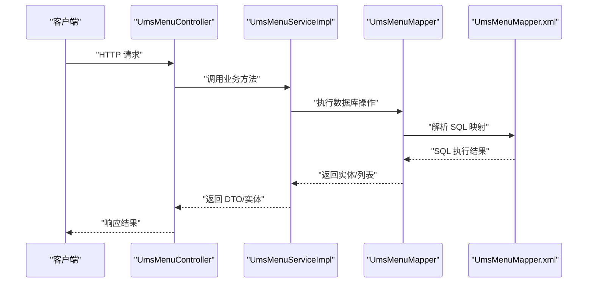
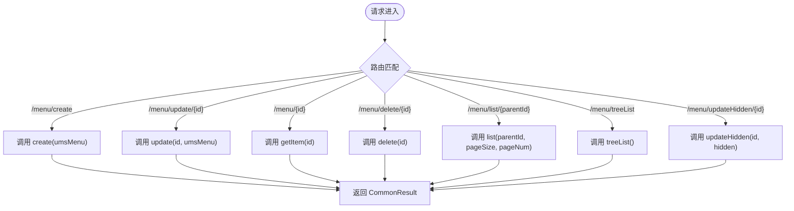
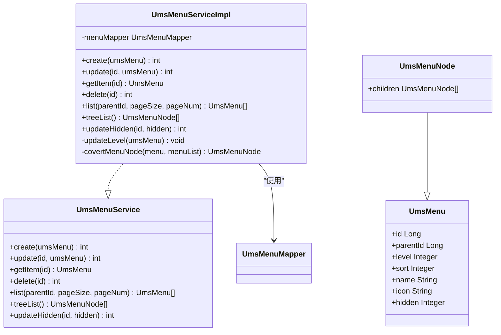
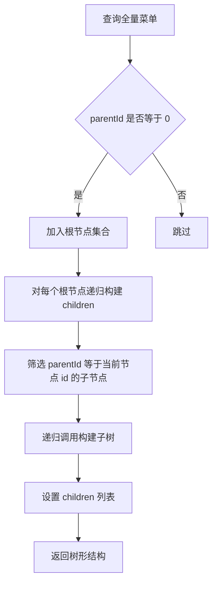
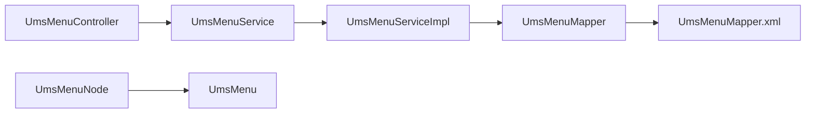

# 菜单管理

<cite>
**本文引用的文件**
- [UmsMenuController.java](file://mall-admin/src/main/java/com/macro/mall/controller/UmsMenuController.java)
- [UmsMenuService.java](file://mall-admin/src/main/java/com/macro/mall/service/UmsMenuService.java)
- [UmsMenuServiceImpl.java](file://mall-admin/src/main/java/com/macro/mall/service/impl/UmsMenuServiceImpl.java)
- [UmsMenuNode.java](file://mall-admin/src/main/java/com/macro/mall/dto/UmsMenuNode.java)
- [UmsMenu.java](file://mall-mbg/src/main/java/com/macro/mall/model/UmsMenu.java)
- [UmsMenuMapper.java](file://mall-mbg/src/main/java/com/macro/mall/mapper/UmsMenuMapper.java)
- [UmsMenuMapper.xml](file://mall-mbg/src/main/resources/com/macro/mall/mapper/UmsMenuMapper.xml)
</cite>

## 目录
1. [简介](#简介)
2. [项目结构](#项目结构)
3. [核心组件](#核心组件)
4. [架构总览](#架构总览)
5. [详细组件分析](#详细组件分析)
6. [依赖分析](#依赖分析)
7. [性能考虑](#性能考虑)
8. [故障排查指南](#故障排查指南)
9. [结论](#结论)
10. [附录：菜单管理API接口文档](#附录菜单管理api接口文档)

## 简介
本文件系统性梳理“菜单管理”模块的设计与实现，围绕 UmsMenuController 控制器、UmsMenuService 服务层、UmsMenuNode DTO、UmsMenu 实体及 UmsMenuMapper 持久层展开，重点覆盖以下主题：
- 菜单层级结构管理与父子关系维护
- 菜单排序与分页查询
- 状态控制（显示/隐藏）
- 树形结构构建与递归查询
- 权限过滤与菜单缓存的扩展点说明
- 完整的菜单管理 API 接口文档与树形结构示例

## 项目结构
菜单管理模块位于 mall-admin 工程中，采用经典的分层架构：
- 控制层：UmsMenuController 提供 REST 接口
- 服务层：UmsMenuService 定义业务契约，UmsMenuServiceImpl 实现具体逻辑
- 数据传输层：UmsMenuNode 扩展 UmsMenu，用于树形结构返回
- 模型与持久层：UmsMenu 实体与 UmsMenuMapper 映射数据库表 ums_menu

```mermaid
graph TB
subgraph "控制层"
C1["UmsMenuController"]
end
subgraph "服务层"
S1["UmsMenuService"]
S2["UmsMenuServiceImpl"]
end
subgraph "数据传输层"
D1["UmsMenuNode"]
end
subgraph "模型与持久层"
M1["UmsMenu"]
M2["UmsMenuMapper"]
X1["UmsMenuMapper.xml"]
end
C1 --> S1
S1 < --> S2
S2 --> M2
M2 --> X1
S2 --> D1
D1 --> M1
```

图表来源
- [UmsMenuController.java:1-95](file://mall-admin/src/main/java/com/macro/mall/controller/UmsMenuController.java#L1-L95)
- [UmsMenuService.java:1-48](file://mall-admin/src/main/java/com/macro/mall/service/UmsMenuService.java#L1-L48)
- [UmsMenuServiceImpl.java:1-107](file://mall-admin/src/main/java/com/macro/mall/service/impl/UmsMenuServiceImpl.java#L1-L107)
- [UmsMenuNode.java:1-18](file://mall-admin/src/main/java/com/macro/mall/dto/UmsMenuNode.java#L1-L18)
- [UmsMenu.java:1-118](file://mall-mbg/src/main/java/com/macro/mall/model/UmsMenu.java#L1-L118)
- [UmsMenuMapper.java:1-30](file://mall-mbg/src/main/java/com/macro/mall/mapper/UmsMenuMapper.java#L1-L30)
- [UmsMenuMapper.xml:1-273](file://mall-mbg/src/main/resources/com/macro/mall/mapper/UmsMenuMapper.xml#L1-L273)

章节来源
- [UmsMenuController.java:1-95](file://mall-admin/src/main/java/com/macro/mall/controller/UmsMenuController.java#L1-L95)
- [UmsMenuService.java:1-48](file://mall-admin/src/main/java/com/macro/mall/service/UmsMenuService.java#L1-L48)
- [UmsMenuServiceImpl.java:1-107](file://mall-admin/src/main/java/com/macro/mall/service/impl/UmsMenuServiceImpl.java#L1-L107)
- [UmsMenuNode.java:1-18](file://mall-admin/src/main/java/com/macro/mall/dto/UmsMenuNode.java#L1-L18)
- [UmsMenu.java:1-118](file://mall-mbg/src/main/java/com/macro/mall/model/UmsMenu.java#L1-L118)
- [UmsMenuMapper.java:1-30](file://mall-mbg/src/main/java/com/macro/mall/mapper/UmsMenuMapper.java#L1-L30)
- [UmsMenuMapper.xml:1-273](file://mall-mbg/src/main/resources/com/macro/mall/mapper/UmsMenuMapper.xml#L1-L273)

## 核心组件
- 控制器 UmsMenuController：暴露菜单管理的 REST 接口，包括新增、修改、删除、查询单个、分页查询、树形查询、更新显示状态等。
- 服务接口 UmsMenuService：定义菜单管理的业务方法，如 create、update、getItem、delete、list、treeList、updateHidden。
- 服务实现 UmsMenuServiceImpl：实现业务逻辑，包括层级计算、树形构建、分页查询、状态更新等。
- DTO UmsMenuNode：在 UmsMenu 基础上增加 children 字段，用于树形结构返回。
- 实体 UmsMenu：对应数据库表 ums_menu 的字段集合，包含 parentId、level、sort、name、icon、hidden 等。
- Mapper UmsMenuMapper 及 XML：MyBatis 映射，提供菜单的增删改查 SQL。

章节来源
- [UmsMenuController.java:1-95](file://mall-admin/src/main/java/com/macro/mall/controller/UmsMenuController.java#L1-L95)
- [UmsMenuService.java:1-48](file://mall-admin/src/main/java/com/macro/mall/service/UmsMenuService.java#L1-L48)
- [UmsMenuServiceImpl.java:1-107](file://mall-admin/src/main/java/com/macro/mall/service/impl/UmsMenuServiceImpl.java#L1-L107)
- [UmsMenuNode.java:1-18](file://mall-admin/src/main/java/com/macro/mall/dto/UmsMenuNode.java#L1-L18)
- [UmsMenu.java:1-118](file://mall-mbg/src/main/java/com/macro/mall/model/UmsMenu.java#L1-L118)
- [UmsMenuMapper.java:1-30](file://mall-mbg/src/main/java/com/macro/mall/mapper/UmsMenuMapper.java#L1-L30)
- [UmsMenuMapper.xml:1-273](file://mall-mbg/src/main/resources/com/macro/mall/mapper/UmsMenuMapper.xml#L1-L273)

## 架构总览
下图展示从控制器到服务再到持久层的数据流与职责分工：



图表来源
- [UmsMenuController.java:1-95](file://mall-admin/src/main/java/com/macro/mall/controller/UmsMenuController.java#L1-L95)
- [UmsMenuServiceImpl.java:1-107](file://mall-admin/src/main/java/com/macro/mall/service/impl/UmsMenuServiceImpl.java#L1-L107)
- [UmsMenuMapper.java:1-30](file://mall-mbg/src/main/java/com/macro/mall/mapper/UmsMenuMapper.java#L1-L30)
- [UmsMenuMapper.xml:1-273](file://mall-mbg/src/main/resources/com/macro/mall/mapper/UmsMenuMapper.xml#L1-L273)

## 详细组件分析

### 控制器：UmsMenuController
- 职责：提供菜单管理的 REST 接口，统一返回 CommonResult 包装的结果。
- 关键接口：
  - 新增菜单：POST /menu/create
  - 更新菜单：POST /menu/update/{id}
  - 查询单个菜单：GET /menu/{id}
  - 删除菜单：POST /menu/delete/{id}
  - 分页查询子菜单：GET /menu/list/{parentId}
  - 获取树形菜单：GET /menu/treeList
  - 更新显示状态：POST /menu/updateHidden/{id}?hidden=...



图表来源
- [UmsMenuController.java:27-93](file://mall-admin/src/main/java/com/macro/mall/controller/UmsMenuController.java#L27-L93)

章节来源
- [UmsMenuController.java:1-95](file://mall-admin/src/main/java/com/macro/mall/controller/UmsMenuController.java#L1-L95)

### 服务接口与实现：UmsMenuService 与 UmsMenuServiceImpl
- 服务接口 UmsMenuService：定义菜单管理的业务契约，包括创建、更新、删除、查询、树形查询、状态更新等。
- 服务实现 UmsMenuServiceImpl：
  - 层级计算：根据 parentId 计算 level，根菜单 level=0，子菜单为父级 level+1。
  - 树形构建：先查询全量菜单，再以 parentId=0 的节点为根，递归构建 children。
  - 分页查询：使用 PageHelper 进行分页，并按 sort 降序排列。
  - 状态更新：通过选择性更新 hidden 字段实现显示/隐藏切换。



图表来源
- [UmsMenuService.java:12-47](file://mall-admin/src/main/java/com/macro/mall/service/UmsMenuService.java#L12-L47)
- [UmsMenuServiceImpl.java:20-106](file://mall-admin/src/main/java/com/macro/mall/service/impl/UmsMenuServiceImpl.java#L20-L106)
- [UmsMenuNode.java:13-17](file://mall-admin/src/main/java/com/macro/mall/dto/UmsMenuNode.java#L13-L17)
- [UmsMenu.java:6-97](file://mall-mbg/src/main/java/com/macro/mall/model/UmsMenu.java#L6-L97)

章节来源
- [UmsMenuService.java:1-48](file://mall-admin/src/main/java/com/macro/mall/service/UmsMenuService.java#L1-L48)
- [UmsMenuServiceImpl.java:1-107](file://mall-admin/src/main/java/com/macro/mall/service/impl/UmsMenuServiceImpl.java#L1-L107)

### DTO 设计：UmsMenuNode
- 继承自 UmsMenu，新增 children 字段，用于树形结构返回。
- 作用：将扁平的菜单列表转换为树形结构，便于前端渲染。

章节来源
- [UmsMenuNode.java:1-18](file://mall-admin/src/main/java/com/macro/mall/dto/UmsMenuNode.java#L1-L18)

### 实体与持久层：UmsMenu、UmsMenuMapper、UmsMenuMapper.xml
- UmsMenu：包含 id、parentId、level、sort、name、icon、hidden 等字段，用于描述菜单的层级、排序、显示状态等。
- UmsMenuMapper：MyBatis Mapper 接口，提供基本的 CRUD 方法。
- UmsMenuMapper.xml：定义 SQL 映射，包括列清单、条件查询、插入、更新、分页等。

章节来源
- [UmsMenu.java:1-118](file://mall-mbg/src/main/java/com/macro/mall/model/UmsMenu.java#L1-L118)
- [UmsMenuMapper.java:1-30](file://mall-mbg/src/main/java/com/macro/mall/mapper/UmsMenuMapper.java#L1-L30)
- [UmsMenuMapper.xml:1-273](file://mall-mbg/src/main/resources/com/macro/mall/mapper/UmsMenuMapper.xml#L1-L273)

### 树形结构构建流程
服务端通过一次全量查询后，在内存中进行递归组装树形结构：
- 先筛选 parentId=0 的节点作为根
- 对每个节点，递归筛选其子节点并设置 children
- 使用 Stream API 过滤与映射，保证构建效率与可读性



图表来源
- [UmsMenuServiceImpl.java:76-105](file://mall-admin/src/main/java/com/macro/mall/service/impl/UmsMenuServiceImpl.java#L76-L105)

章节来源
- [UmsMenuServiceImpl.java:76-105](file://mall-admin/src/main/java/com/macro/mall/service/impl/UmsMenuServiceImpl.java#L76-L105)

### 分页与排序
- 分页：使用 PageHelper.startPage(pageNum, pageSize) 实现分页。
- 排序：按 sort 字段降序排列，确保层级展示顺序符合预期。

章节来源
- [UmsMenuServiceImpl.java:67-74](file://mall-admin/src/main/java/com/macro/mall/service/impl/UmsMenuServiceImpl.java#L67-L74)

### 状态控制（显示/隐藏）
- 通过 updateHidden 接口更新 UmsMenu 的 hidden 字段，支持 0/1 或类似枚举值表示显示/隐藏。
- 服务端仅做字段更新，不涉及权限过滤或缓存策略。

章节来源
- [UmsMenuController.java:84-93](file://mall-admin/src/main/java/com/macro/mall/controller/UmsMenuController.java#L84-L93)
- [UmsMenuServiceImpl.java:86-92](file://mall-admin/src/main/java/com/macro/mall/service/impl/UmsMenuServiceImpl.java#L86-L92)

## 依赖分析
- 控制器依赖服务接口，服务实现依赖 Mapper，Mapper 依赖 XML 映射。
- DTO 继承实体，扩展树形结构能力。
- 服务层对数据库访问采用 MyBatis，未直接引入缓存组件。



图表来源
- [UmsMenuController.java:24-25](file://mall-admin/src/main/java/com/macro/mall/controller/UmsMenuController.java#L24-L25)
- [UmsMenuService.java:12-47](file://mall-admin/src/main/java/com/macro/mall/service/UmsMenuService.java#L12-L47)
- [UmsMenuServiceImpl.java:22-23](file://mall-admin/src/main/java/com/macro/mall/service/impl/UmsMenuServiceImpl.java#L22-L23)
- [UmsMenuMapper.java:8-29](file://mall-mbg/src/main/java/com/macro/mall/mapper/UmsMenuMapper.java#L8-L29)
- [UmsMenuMapper.xml:3-14](file://mall-mbg/src/main/resources/com/macro/mall/mapper/UmsMenuMapper.xml#L3-L14)
- [UmsMenuNode.java:15](file://mall-admin/src/main/java/com/macro/mall/dto/UmsMenuNode.java#L15)
- [UmsMenu.java:6-25](file://mall-mbg/src/main/java/com/macro/mall/model/UmsMenu.java#L6-L25)

章节来源
- [UmsMenuController.java:1-95](file://mall-admin/src/main/java/com/macro/mall/controller/UmsMenuController.java#L1-L95)
- [UmsMenuService.java:1-48](file://mall-admin/src/main/java/com/macro/mall/service/UmsMenuService.java#L1-L48)
- [UmsMenuServiceImpl.java:1-107](file://mall-admin/src/main/java/com/macro/mall/service/impl/UmsMenuServiceImpl.java#L1-L107)
- [UmsMenuMapper.java:1-30](file://mall-mbg/src/main/java/com/macro/mall/mapper/UmsMenuMapper.java#L1-L30)
- [UmsMenuMapper.xml:1-273](file://mall-mbg/src/main/resources/com/macro/mall/mapper/UmsMenuMapper.xml#L1-L273)
- [UmsMenuNode.java:1-18](file://mall-admin/src/main/java/com/macro/mall/dto/UmsMenuNode.java#L1-L18)
- [UmsMenu.java:1-118](file://mall-mbg/src/main/java/com/macro/mall/model/UmsMenu.java#L1-L118)

## 性能考虑
- 树形构建：一次性查询全量菜单后在内存中递归组装，适合中小规模菜单；若菜单量较大，建议：
  - 在数据库层面按 level 排序并分层加载
  - 引入缓存（如 Redis）存储树形结构，降低重复构建成本
  - 增加分页与懒加载策略，避免一次性渲染过多节点
- 排序与分页：已按 sort 降序与 PageHelper 分页，建议结合索引优化查询性能。
- 状态更新：updateHidden 为单字段更新，性能开销较小。

## 故障排查指南
- 新增/更新失败
  - 检查 parentId 是否正确，层级计算依赖父节点是否存在
  - 确认必填字段（如 title、name）是否为空
- 树形结构异常
  - 确保数据库中存在 parentId=0 的根节点
  - 检查 children 递归构建逻辑是否被中断（如空列表处理）
- 分页/排序异常
  - 确认传入的 parentId、pageSize、pageNum 参数
  - 检查 sort 字段是否正确填充
- 显示/隐藏无效
  - 确认 hidden 参数取值与业务约定一致
  - 检查数据库更新是否成功

章节来源
- [UmsMenuServiceImpl.java:35-48](file://mall-admin/src/main/java/com/macro/mall/service/impl/UmsMenuServiceImpl.java#L35-L48)
- [UmsMenuServiceImpl.java:76-105](file://mall-admin/src/main/java/com/macro/mall/service/impl/UmsMenuServiceImpl.java#L76-L105)
- [UmsMenuServiceImpl.java:67-74](file://mall-admin/src/main/java/com/macro/mall/service/impl/UmsMenuServiceImpl.java#L67-L74)
- [UmsMenuServiceImpl.java:86-92](file://mall-admin/src/main/java/com/macro/mall/service/impl/UmsMenuServiceImpl.java#L86-L92)

## 结论
菜单管理模块以清晰的分层设计实现了菜单的层级管理、父子关系维护、排序与状态控制，并通过 UmsMenuNode 将扁平数据转换为树形结构，满足前端渲染需求。服务层在内存中构建树形结构，简单高效；对于大规模场景，建议引入缓存与分层加载策略以提升性能。

## 附录：菜单管理API接口文档

- 基础路径
  - /menu

- 新增菜单
  - 方法：POST
  - 路径：/create
  - 请求体：UmsMenu
  - 返回：CommonResult<Integer>（受影响记录数）

- 更新菜单
  - 方法：POST
  - 路径：/update/{id}
  - 路径参数：id（Long）
  - 请求体：UmsMenu
  - 返回：CommonResult<Integer>

- 查询单个菜单
  - 方法：GET
  - 路径：/{id}
  - 路径参数：id（Long）
  - 返回：CommonResult<UmsMenu>

- 删除菜单
  - 方法：POST
  - 路径：/delete/{id}
  - 路径参数：id（Long）
  - 返回：CommonResult<Integer>

- 分页查询子菜单
  - 方法：GET
  - 路径：/list/{parentId}
  - 路径参数：parentId（Long）
  - 查询参数：
    - pageSize（Integer，默认 5）
    - pageNum（Integer，默认 1）
  - 返回：CommonResult<CommonPage<UmsMenu>>

- 获取树形菜单
  - 方法：GET
  - 路径：/treeList
  - 返回：CommonResult<List<UmsMenuNode>>

- 更新显示状态
  - 方法：POST
  - 路径：/updateHidden/{id}
  - 路径参数：id（Long）
  - 查询参数：hidden（Integer）
  - 返回：CommonResult<Integer>

- 数据模型说明（UmsMenu）
  - 字段概览：
    - id：主键
    - parentId：父级菜单ID
    - level：层级（根为0）
    - sort：排序权重
    - name：菜单英文名
    - icon：图标
    - hidden：是否隐藏
    - createTime：创建时间

- 树形结构示例（概念示意）
  - 根节点 A（parentId=0, level=0）
    - 子节点 A1（parentId=A.id, level=1）
      - 子节点 A1a（parentId=A1.id, level=2）
    - 子节点 A2（parentId=A.id, level=1）